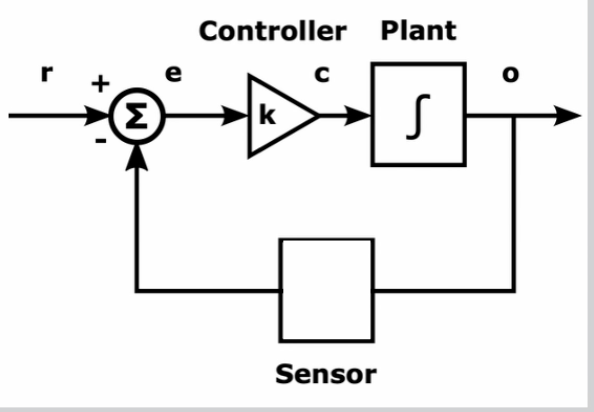
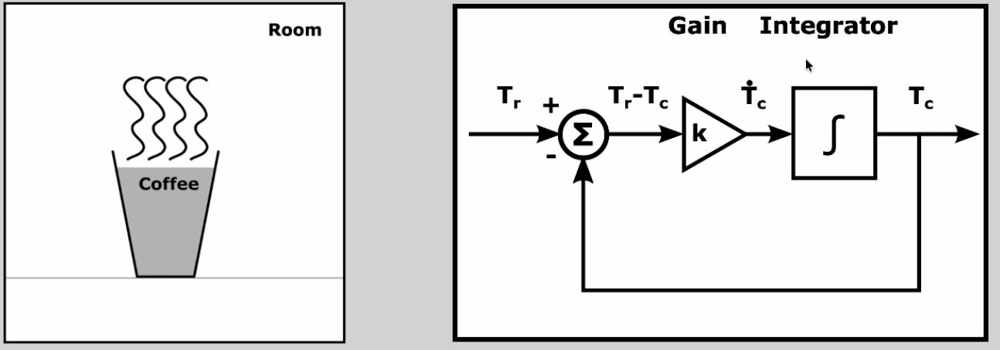
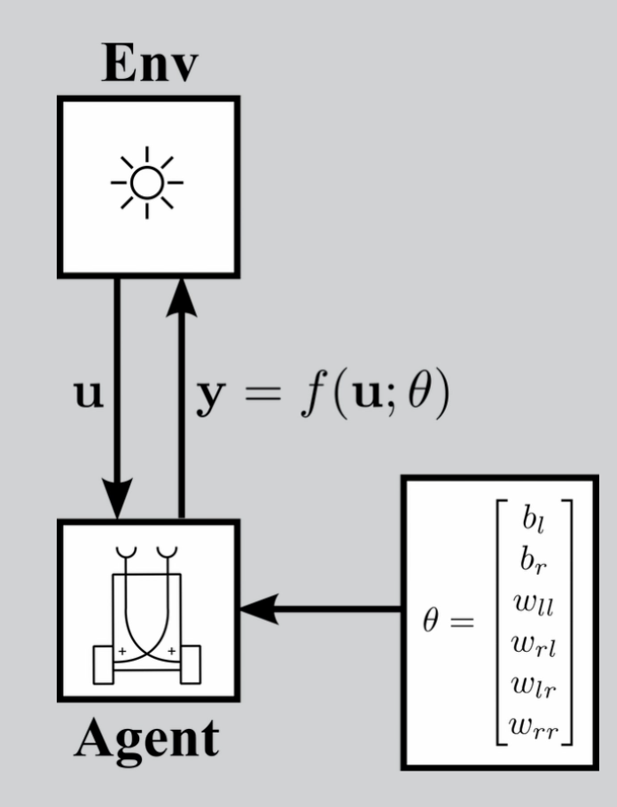
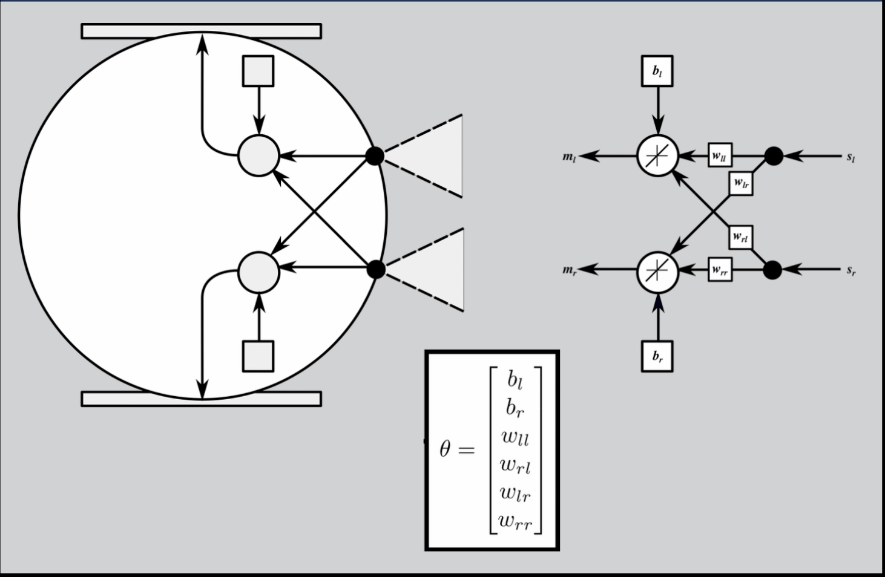

# Adapative Systems (Spring 26)

This is the main file for the Machine Learning module taken in Spring 26. It will act as the location for note taking accross all mediums, i.e. lectures, videos, labs and additional readings, as well as a directory for file locations. It will recorded chronologically with a section for each week. 

TODO: module overview

# Table of Contents
1. [Week 1 - Introduction](#week-1---introduction)
2. [Week 2 - Systems](#week-2---systems)
3. [Week 3 - ]()
4. [Week 4 - ]()
5. [Week 5 - ]()
6. [Week 6 - ]()
7. [Week 7 - ]()
8. [Week 8 - ]()
9. [Week 9 - ]()
10. [Week 10 - ]()
11. [Week 11 - ]()

 

--- 

# [Week 1 - Introduction](https://canvas.sussex.ac.uk/courses/34987/pages/week-1-introduction-to-adaptive-systems-2?module_item_id=1616848)

## Week 1 Lecture Content

This weeks lecture is split into two half. The first half introduces the module, it covers acedemic details like the weekly sylabus, learning objectives and the assessment. The second half beings to introduce adpative systems as a topic, it introduces this notion of a closed, coupled system between an agent and its environment and how evolutionary fitness is defined by this relationship. It moves on to adpatation as a mechanism to maintian or improve fitness, as well as, delving into evolution vs learning as different methods of adapating. In addition to the lecture/slides there is a lecture summary on Canvas and a page on defining adaptive systems. 

#### Lecture Contents:

1. [Part 1 - Introduction to the Module](#part-1-introduction-to-the-module)
2. [Part 2 - Introduction to Adaptive Systems](#part-2---introduction-to-adaptive-systems)
3. [Defining Adaptive Systems](#defining-adaptive-systems)
4. [Lecture Summary](#week-1-lecture-summary)

---

## Part 1: Introduction to the Module

**| [File Location](825G5_Adaptive_Systems/files/week_1/week_1_lecture_introduction_to_the_module.pdf) | [Recording](https://sussex.cloud.panopto.eu/Panopto/Pages/Viewer.aspx?id=84021c4e-5e0c-40f1-aa19-b3e101082d12) |**

Adaptive systems is extremely cross-disciplinary subject. It can be found in the sciences, engineering, artifical life, finance, politics, economics and just about anything where a system is present. However, there are broad to two reasons to study adpative systems: 
* From the scientific perspective in the persuit of knowledge. We want to understand and model natural adapative systems around us. 
* The technological/engineering perspective. The ability to make artifical adative systems for our own utility, i.e. software systems and robots. 

---

**Why should we study natural adative systems?** 

Generally, natural adapative systems are superior to our own. They are smarter, more agile and more dextrous. Therefore, when building our own systems, designing them based off of naturally found formations allows us to skips a lot of leg work. Some examples are: 
* Hexapod bodies for walking systems. This is insect inspired.
* Artifical NNs which are based off of brain neurons.
* Central Pattern Generators (CPG) for locomotion

---

**Why study the artifical ones?** Natural systems are complex and often the full information is out of reach. With articical systems we can contruct something where we have full control of the inputs and outouts. We can simulate, iterate, automate and analyse how the system works, or doesn't work. Typically, we transfer learnings from natural systems into artifical but we may (rarely) learn something in an aritfical system that can be applied to natural systems. Finally, artifical systems are modular and accessible, we can easily pickup or incorporate someone else work into our own. 

---

**<u>Module Structure:</u>**

10 lecture topics with one addition session for spill over. 
5 labs where we apply theories into coded, simulated systems. 6 seminars where discussions of adapative system theory and report writing takes place. 

1. An Introduction to Adaptive Systems
2. System Theory
3. Cybernetics and the Importance of Negative Feedback
4. Postive Feedback: Stigmergy and Chaos
5. Ashby Part 1: State-Determined Systems
6. Ashby Part 2: Ultrastable Systems
7. Sensorimotor Systems
8. Evolution and Evolutionary Robotics
9. Self-Organising Systems
10. Living Systems

---

**<u>Assessments:</u>**
1. 1000 word report, little bit of code, basic experiment, due week 8, worth 20%, consider a practice run
2. 3000 word report, a lot of coding required and in-depth experiements/analysis

Both need to be respresentive of an adaptive system with some sort of learning or evolution. Often includes some sort of agent application. 

There are 3 main directions for the assessments:
3 main directions for assessments:
1. Scientific: e.g. Simulating and analysing a model of a biological adpative system. Common topics are neuroscience, animal behaviour, ant behaviour.
2. Engineering: e.g. designing, implementing and testing your own adaptive system. You still collect results and test how well 
3. Artifical Life: Investigating and explaining theoretical adaptive systems. 

 

---

## Part 2: - Introduction to Adaptive Systems

**| [File Location](/Users/lukebirkett/Repos/study-planner/825G5_Adaptive_Systems/files/week_1/week_1_lecture_introduction_to_the_module.pdf) | [Recording](https://sussex.cloud.panopto.eu/Panopto/Pages/Viewer.aspx?id=84021c4e-5e0c-40f1-aa19-b3e101082d12) |**

1. Systems and their environments
2. Timescales and relative rates of change 
3. Adaptation can be driven in many ways
4. “Adaptation” can mean either a process or a characteristic
5. Processes of adaptation take place over various timescales
6. All adaptation involves change, but not all change is adaptation

---

### <u> Systems and Their Environments </u>

We can often think of systems a being coupled whereby an agent(s) and environment impact one another. There is circular causality that flows to and from each agent and enviroment. Because the flows are circular, an agent can essentially have an effect on itself. It changes the env, which changes itself, and so on. 

Llosed loops are generally more interesting than open loops. They can do much more compelx things than open loops. Open loops are characteristed as systems with inflows and/or outflows. A feedforward network is an input and output system. They can do useful things but they don't have the same dynamics and closed systems. 

----

### <u> The fitt-est </u>

"Survival of the fittest", not actually first written by Dariwn but largely attributed. Actually written by Spencer. In first edition, Darwin wrote about how well species were fitted to their env. Fitted, a fitness as a specific term here. They do not mean the physical fitness is a muscular or cardiovascual sense, instead we mean evolutionary fitness which is a two-way relationshp between a populaiton and its environment. 

A species fitness is intrisinctly linked to the environment that it is currently in. If the env changes then so does the fitness because it is placed into a new context. 

Therefore, progress in the naturual world does not mean better, better, more complex. It means an improved fit to an environment. The idea of "progress" applies more to artificial than to natural evolution. There are many example in nature that would be "anti-progress" in terms of bigger, better, more complex.

e.g. sticlebacks over time became less armound from predators as their new envs didn't require it (possibly observed as reverse evolution). Revolution has a trade-off, more armour requires more resources. But resources of life are limited. If something can become more simple but still survive or thrive just the same then the fittness is the same. Additionally, fitness can easily go down when an env changes. It could be argued that an over armour fish is less fit because this armour comes with disadvantages.

---

### <u> Maintaining a Good Fit </u>

Successful systems fit well into their environemnt. A system can meant an agent, or just about anything. Often the system will adpat to maintain a good fit to an env. 

Successes or fitness is completed dependent on the context and system. Though for living systems it is generally survival. The great thing about artificial systems, or man man, is that we define these terms. 

Bateson: "the unit of survival is a flexible organism in its env". Flexible can be substituted for "capable of adapting". Coupled sys of agent and env can both change to fit changes in the other

---

### <u> Timescales </u>

This slide covered the notion of learning vs evoluaiton. Learning is what humans, or agents, do and aquire in their lifetime. Evolution is was changes over many lifetimes. Evolution, or atleast the perception of evolution, is often dependent on the rate of reproduction. Bacteria can evolve very fast in human life terms. 

---

### <u> Time </u>

Time is a repeating concept in the module. Today's main interest is "rates of changes" and "relative rates of change". 

e.g. rate of change of ecosystems. Global temperature changes compared to previous periods in time. 

Consdier the rate of change of evolution which takes many generations so may not be quick enough to keep track with ecosystem evn changes. This results in a loss of fitness and risk of non-survival

---

### <u> Why do Systems Adapt? </u>

To learn:
* a behaviour or action 
* how to solve a problem
* to compensate for injury or damage
* to adapt to changes in the environment

Ens are dynamic, i.e. constantly chaning, therefore unpredictable. Slow changes in environment may be adpated to by a process evolution. 

* Slow changes in enviroment may be adapted to by a process of evolution
* Faster changes and other suprises may be adpated to by learn 
* Very fact changes may be adjusted to by a process of regultions and control (which are not necessarily processes of adaption)

---

## Problematic Terminology

Often key concepts and words in adaptive systems have mutliple defintions. 

Defining evolution thorugh natural selection: 
* Adpatation is a central concept in biology. The word has two related meanings
1. Adaption means the evolutionary process by which, over the course of generations, organisms are altered to become improved with respect to features that affect survival or reproduction. 
2. An adpations is a characteristic of an organism that evolved by natural selection. 

Sometimes "an adapativtion" is referred to as an "adaptive trait". This causes a similar problem because when we refer to an adpative system we mean one which can adapt itself through some adaptive process; a self-adpative system. 

---

## Adaptation (as a process)

Examples: 
* learning in humans
* learning in aritifical neural networkds
* evolution through naturual selection

With these, there is a a mechanism which is searching for "good", or optimal. The change (adaptation) must be directied somehow. Though not all change is adaptation. 

---

## Adapative Traits (an adaptation)

Speed is an adv for predators and prey. Animals have adapted to be fast. A cheetah has mutli adapative traits which synergistically contribute to its speed. 

---

## Adpated vs Self-Adative

An adpated system, is something which is adapted by some other system or external processes - such as an evolutionary algo - to have some desirable for beneficial characteristics.
* eco-system and natural selection
* simulated env and genetic algo

> Possibly important for my idea. The environment will be a self-adpaptive system. But the farming system will be an adapted system will can be tweaked and optimized based on some metric. 

A self-adaptive system is something that has the ability to adaptive itself:
* by learning
* by changing its body through reconfiguration

On this model we are principally interesedf in:
* The self-adaptive systems which adapt themselves
* As well as the systems and proccess which can adapt other systems. 

Often our studied systems will be will be both both adpated and self-adaptive

---

## Not all Change is Adaption - Evolution

A process of adaptation always involves change but not all changes are adaptaiton. Genetric mutations are random but over many gnereations mutations which make organisms less likely (or more) are selected for or against. 

---

## Not all Change is Adaption - Learning

Like evolution, learning also must be directed by rules or algos to acheived desireable or effective results

Hebb's rule; neurons which fire together, wire together

---

## Summary

* An adaptation is a characteristic of a system, which is the result of a process

* But adaptation can also mean the process by which a system is adapted

* We can distinguish between systems which are self-adaptive, which means that they can adapt themselves (a process), and systems which  are adapted by other systems or external processes
• I use self-adaptive here to distinguish from adaptive, which is often 
used otherwise, e.g. in “adaptive traits” or “adaptive behaviour”
• While all processes of adaptation involve change, not all change is 
adaptation - only changes which are selected or directed according to 
some set of rules or laws can lead to adaptation
• Adaptive processes can be driven in many ways, but often the change 
involved in a system’s adaptation is prompted by changes in its 
environment
• Which kinds of adaptive processes (if any) are effective in a given 
situation or environment is determined by relative rates of change

### Defining Adaptive Systems

* [Defining Adaptive Systems](https://canvas.sussex.ac.uk/courses/34987/pages/defining-adaptive-systems?wrap=1)

 
 
 
 
 
 
 
 
 

# [Week 2 - Systems](https://canvas.sussex.ac.uk/courses/34987/pages/week-2-systems-2?module_item_id=1617677)

In this lecture, we cover some basic systems theory language and concepts. Some of you may already be very familiar with these concepts, and therefore find this a very simple lecture, but that won't be the case for everyone. For this lecture, our main objective is to make sure we all know and can use the same ways of describing systems, in a non-technical way. We will start to look at more technical material on systems in later lectures, in particular in the ones related to Cybernetics.

* [Lecture Video](https://sussex.cloud.panopto.eu/Panopto/Pages/Viewer.aspx?id=57984111-19fc-4644-b989-b3e80107efb8)
* [Week 2 Intro Page](https://canvas.sussex.ac.uk/courses/34987/pages/week-2-systems-2?module_item_id=1617677)
* [Lecture Content](#week-2-lecture-content)

## Weekly Introduction

Systems science is holistic, meaning it studies the whole system. This could is in opposition to a reductionist approach where we look at components, or it they could be two complementary routes. Often complex system are made up of more systems, which we also want to explore. 

If we think of complex systems like our own bodies as hierarchies of systems, then the reductionist approach to science is a way of moving down the hierarchy to lower levels of subsystem, while the holistic approach can be thought of as being a way of moving up the hierarchy to study the supersystems of those lower levels. 

To gain a full understanding of a complex system, we need to be able to move both up and down through the different levels of its hierarchy in the scientific models that we build.

The lecture introduces the idea of the open system. The theory of open systems is central to the study of life and living systems. 

The concept of time makes a brief appearance again in today's lecture. Whenever we create models of systems, we have to decide which features of the systems we have to include in our models, and which features we can leave out because their effects are negligible. Some of these decisions will be related to rates of change, which we have seen before, and what is sometimes referred to as the time horizon of the model. 

The example I give in the lecture is of a double-walled flask, which can keep a drink either hot or cold for hours. Suppose we want to model the behaviour of the molecules of the liquid in the flask. If the time horizon of our model is only a few seconds, then we can reasonably model the flask as a closed system. This is because in such a short space of time, only a small amount of energy can transported from the interior to the exterior of the flask, or vice versa. However, if we want to model how the liquid molecules behave over a period of days, then we must treat the flask as an open system - over this period of time, the liquid in the flask can either lose or gain a significant amount of energy (i.e. cool down or warm up, depending on whether they were initially hot or cold in comparison to the flask's environment). The insulating properties of the flask are impressive, but they ultimately only slow the transfer of thermal energy, they do not stop it. 

Finally, there is one concept which only is only covered quite briefly in this lecture (and the previous one) but which is an important concept for this module: coupled systems. Often, it is useful to think of systems, e.g. animals or robots, as being embedded (and situated) in their environments. This is certainly true, and it is a description which makes a lot of intuitive sense. However, as we shall see again in later classes, it can also be very useful to describe a system and its environment as being coupled systems. It is very often useful in the systems approach to shift between different points of view, either up or down the hierarchy of super- and sub-systems, or alternatively "sideways" as in this case, where we may still view a system at the same level, but from a changed perspective. 

## Week 2 Lecture Content

Learning Outcomes:
* Systems are connected sets of elements
* Systems are made up of systems 
* A systems environment is also a system 
* Systems are usuallty open, but we can model them as if they were closed. 

---

Lecture Outline:
1. Why use a systems approach?
2. A defintion of a system
3. Casual Connections
4. Systems and their ennvironments
5. Subsystems and supersystems
6. Overlapping systems
7. Open and closed systems

---

### Why use a systems approach?

The systems approach is holistic: we study whole systems. This is in constract to reductionism where people try to go down to the lowest mechanisms of a system and work those parts out. 

In order to model systems we must use abstraction to make this possible as they are too fine grained and complex. i.e. a system of human but not going down to the molecurlar level. 

The systems approach is cross-discipline. Often applies to business and finance, but also politics, biology, engineering. 

---

### An informal definition of a system

> “A set of elements or parts that is coherently organized and interconnected in a pattern or structure that produces a characteristic set of behaviors, often classified as its ‘function’ or ‘purpose’.” (Meadows)

**A set of elements or parts;** i.e. a robot system which is made up of parts; once set up they are all connected; Could talk about an animal and considered the organs as parts;

**organized and interconnected in a pattern of structure:** think about the arrows in a diagram, without the arrows it is not a connected system; 

**produces a characteristic set of behaviours;** we characterise systems by their output behaviours; external (that we see) or internal behaviour; 

**function or 'purpose';** fuction of an object may be what it was designed for; or it hasevolutes to

---

### Causal Connection

Arrows in diagrams; system elements are casually connected; can transfer: info, energy, matter; or a combo

---

### Systems and their environments

Definiiton systems by parititions; define a system by its boundary; where is the boundary between the thing and not thing; agents and env; a coupled agents, env relationship can be draw wit the agents embedded in the env; we may also differentitate between an agents immediate env and the whole environment. 

The agents, env coupled system is a closed loop or circular causality, where each subsystem has an effect on the other. 

---

### Systems and Their Parameters

Often, the pwower of a system to adapt will lie in its parameters
* Why do want to adapt the system?
* When do we want to adapt the system? Maybe upto a certain point of performence, maybe its a system that learns continuously. could be intermitted, i.e. there is a threshold to meet, if it is in the threshold is doesn't change, if it does then parameters can change to re-adapt. 
* How should we adjust the parameters?

---

### Subsystems

Zooming in on a system; an element in a system is often also a system itself; example a nn, is composed of layers, which are their own systems; 

# [Week 3 - Cybernetics and Negative Feedback Control](https://canvas.sussex.ac.uk/courses/34987/pages/week-3-cybernetics-and-negative-feedback-control?module_item_id=1619230)

Today's lecture is in two parts. Part 1 in an introduction to the historical origins of Cybernetics. Part 2, starts to look more closely at the ideas of circular causality, and negative feedback.

* [Lecture Recording Part 1](https://sussex.cloud.panopto.eu/Panopto/Pages/Viewer.aspx?id=89d90ed0-dd78-4e4f-99c3-b3ef0107dec0)
* [Lecture Recording Part 2][https://sussex.cloud.panopto.eu/Panopto/Pages/Viewer.aspx?id=d7255e26-bf02-4d46-9cf9-b3f001039adb]
* [Cybernetrics Resources](https://canvas.sussex.ac.uk/courses/34987/pages/cybernetics-resources)
* [3.1 Cybernetics]()
* [3.2 Negative Feedback]()

## Weekly Introduction

In Lecture 3.1, we see something of how influential Cybernetics has been on areas including Artificial Intelligence, computing, robotics, and systems theory. Later in the module, we will also see how one Cybernetician in particular, Ashby, has been very influential in the area of adaptive systems.

Apart from the history, the main idea to take away from Lecture 3.1 is that the early cyberneticians were perhaps the first scientists to fully recognise how important feedback is to the behaviour of both natural and human-made systems. I would go so far as to say that there is no intelligent or adaptive behaviour without feedback. Taking ourselves as an example, we cannot stand up without feedback, cannot pick up a pen, cannot steer a bicycle or a car, cannot learn how to throw a ball - indeed, without feedback, we cannot learn any skills at all. 

When we look at some different kinds of feedback and where they are used, we come back to the idea of different **timescales**:
* Being able to stand up straight requires relatively fast feedback - without regular and quick updates from our senses about how well we are balancing, we would fall over. 
* There are some actions which humans regularly perform which are too fast for feedback to be involved in controlling. A good example of this is a tennis serve. Due to the time it takes for signals to travel along the nerves in our arms, the tennis serve is too fast for feedback to be involved in controlling the arm - feedback signals cannot reach the brain fast enough to be of use, and the arm is controlled using feedforward or open-loop control. 

All feedback takes from finite amount of time to be fed into a system, meaning that the info is always to some extent out of date. 

In general, negative feedback is associated with stability and positive feedback with instability. However, a system with a negative feedback can behave like one with positive feedback if the feedback signals are significantly delayed.

Whether or not feedback delays are significant in a system can only be determined by comparing how fast the feedback is in comparison to how quickly the system and its environment change - put simply: fast feedback is required to keep up with fast changes in controlled systems or their environments, but for systems and environments which change slowly, slow feedback may be good enough.

In many situations and systems, stability is seen as desirable, and instability is seen as undesirable or even dangerous. However, positive feedback, which tends to lead to instability, can often be a good thing.

Looking ahead: in the last part of the lecture on positive feedback and chaos, we will spend some time looking at chaotic systems. As we shall see, chaotic behaviour can emerge in systems which have nonlinear feedback, which may be positive at some times and negative at others. We will see that deterministically chaotic systems are not only inherently unstable, but also that - looked at in the right way - may be so unpredictable as to be deterministic and yet effectively random at the same time. 

## Part 1: Cybernetics

Everything of interest to us on this module was influenced by cybernetics.

Feedback is everything in all intelligent systems

---

Lecture outline:
* Cybernetics before cybernetics
* Important of feedback
* Macy meetings
* Cybernetics is names
* Cybernetics original of artifical neural networks
* Other cyberneticians 

---

Cybernetics lead to: AI, Robotics, Control theory, systems thinking, neural networks, genetic algorithms, ultrastability, autopoiesis. 

---

## Part 2: Negative Feedback

Learning outcomes:
* Basic principle of negative feedback control 
* Negative feedback leads to stability
* Stability without control 
* Delays in feedback loops

---

1. [Analogies](#analogies)
2. [Stable and Unstable Equilibria](#stable-and-unstable-equilibria)
3. [Cybernetic Loops](#cybernetic-loops)
4. [Negative Feedback Control](#negative-feedback-control)
5. [Varying Inital Conditions](#varying-inital-conditions)
6. [Problems with Delays](#problems-with-delays)
7. [Stability Without Control](#stability-without-control)
8. [Week 3, Part 2, Summary](#week-3-part-2-summary)

---

### Analogies

Metaphors and analogies are similar concepts in the English language. They are both the "bridge-builders" of language. They both help us understand something new by comparing it to something we already know, but they go about it in different ways—one is a poetic shortcut, while the other is a structural blueprint.

A metaphor is a figure of speech that says one thing is another thing. It’s usually brief, punchy, and more about the feeling or essence of a situation than a logical breakdown. "Time is a thief.". Creates a vivid image or emotional impact. It doesn't literally mean time has a mask and a getaway car; it suggests the "vibe" of loss.

An analogy is an explanatory tool that shows how two things are alike in their functions or relationships. It is usually more detailed and focuses on the "how" and "why." "An atom is like a tiny solar system, where the nucleus is the sun and electrons are the planets orbiting it." To explain a complex process by mapping the structure of a familiar system onto an unfamiliar one.

 However, analogies are more useful in science. An analogy allows a scientist to "map" the known rules of one system onto another.

An Isomorpoism is the strongest type of analogy. This is where two systems produce the same outputs. 

metapors, or analogies; similar concepts in eng lang; analogies more useful in science; analogue electrons, derived from analogies; this is due to the relationships with anologes; dampener takes fraction out of the systeml; 

We don't always have the perfect Isomorphism between systems, but a similar model is good enough. Think about biological models and their physical, "toy model" examples. If we want build a good enough physical model, we can conduct experiements on it to say things about the biological thing. Perhaps using a robot in lieu of an animal. 

--- 

### Stable and Unstable Equilibria

There are two point in a sytem where "things" can balance. 

A unstable equiliberium will only stay in balance if undisturbed. Small changes will push it out of balance. 

A stable equilib behave very different. It will still remain in balance in the case of no disturbances and changes will (potentially) remove it from balance, but it will natural return to the balanced point. 

It is easy to think in the example of a pendulum. The unstable Eq is the pendulum balance perfectly up right. It is very unstable and will definitely fall. The stable position is handing down. You can move it off balance but naturally gravity will bring it back to its stable position. 

---

### Cybernetic Loops

Weiner and co stressed the importance of feedback. In systems with feedback, the components are connected. Cyberneticans called this **circular causality**.

---

### Negative Feedback Control 

A controlled system, or process, is often refered to as the plant. Could be the movement of an arm, output of a factory, tradjectory of a ship. Output from the plant is the controlled variable. 

The reference signal $r$ is what specifies the desired plant output. The goal of the system is to make $o=r$. The $o$ output will often be a variable or pattern rather than a single value. 

If you remove the sensor loop then you just have feedforward network whereby in input $e$ emits an output $o$ via some mechanism, i.e. the controller processing the input and the plant executing the signal from the controller. There exists no way to acheive control because there is no way to check that $r=o$.

In a negative feedback control system, the actual output is fed back to controller, via sensor and computed into the error, so that the controller can act on the differential (actual - desired). 

It should be noted that no sensor is perfect, there will be noise in the reading the output signal. Additionally, there will always be delays in feedback from the output sensor to the controler. 

Remember, the controller only ever sends the signal to do something if the error is $>0$. Given the issues with noise and delay, there can be times where the actual output has changed but the controller doesn't have the information to react to it yet. 

---

### Varying Inital Conditions

If we start the parameters from different places, the system shoud still stabilise in the same way. THe very simple feedback control systems above are capable of controlling or regulating a system. But it this is reactive, not self-adaptive. This is because it does not monitor its own performance. This means that if a systems parameters are not set correctly, it may perform badly. Self-adaptive systems need more than one feedback loop and at least 1 to monitor performance. 

---

### Problems with Delays

There will always be some level of delay but delay causes two problems:
* Error delay means there is some peroid of time where the process is in error before the controller has reacted to it. 
* A delay in the feedback path itself means that the controller is always working with out of date information. Can extreme outcome of this is the negative feedback may turn into positive feedback.

---

### Stability Without Control

Many systems tend towards stability without control. For example, a cup of coffee cooling: $t_c = -k(T_c - T_r)$, accoridng to Networks Law (model) of cooling. Here $k$ is a rate parameter which lumps various physics factors together. 

This system/equation is isomorphic to a negative feedback system. Eventully $T_c$ and $T_r$ will be the same and nothing more will happen. 

In control theoretic terms, the rooms temperature is analogous to the reference signal, and the temperature of the cup is analogous to the controlled variable.

When the rate of change of a variable is a function of that variable, then you have feedback. In this case, $T_c$ is a function of $T_c$ (itself). 

In a designed control system (like a thermostat or a self-driving car), the Reference Signal is the "target" or "setpoint" provided by the user. It is the state the system should be in.

The Room Temperature ($T_r$) acts as this dial. Because of the laws of thermodynamics, the coffee "wants" to reach the room's temperature. The room effectively "tells" the coffee what its final temperature will be.

The Controlled Variable (also called the Process Variable) is the actual state of the system that we are measuring and trying to change. This is the Temperature of the Cup ($T_c$). It is the "output" of the system. It changes over time based on the physics of the situation.

In a standard control system, you usually need a Controller (a computer or a person) to look at the difference between these two and decide what to do. In this "Stability without Control" example, the "Controller" is Nature.

The coffee cup example is a passive system. The gain ($k$) is determined by the physical properties of the mug and the liquid. It doesn't "learn" or change its behavior if the environment changes drastically. If you move the coffee to a windy room, the value of $k$ might change due to physics (convection), but the system itself isn't monitoring its performance and tuning $k$ to reach equilibrium faster.

An adaptive system is a "system of systems." It features a secondary loop that monitors the primary feedback loop. The primary feedback loop determins the tempurature of the coffee cup in relation to the tempurature of the room. A secondary loop observes, normally the rate of rate, of the error signal. If the error isn't skrinking fast enough, the secondary loop changes the parameters, like the gain $k$ of the primary loop in real-time. 

---

### Week 3, Part 2, Summary

1. Systems with loops in their interconnections have feedback, or  circular causality
2. Negative feedback tends to lead to stability
3. Some systems are naturally stable, or self-stable
4. In control, negative feedback can be used to turn unstable points in a system’s dynamics into stable points
    * we saw that feedback control system matmmatically  may be isomorphic to a self stable system.
    * this may be an insight as to what feedback control is for. to turn an unstable system into a stable one
5. Although negative feedback tends to lead to stability, delays in  feedback loops can cause problems
6. Systems which are self-stable may be mathematically equivalent  to feedback-controlled systems! (or vice versa, e.g. see point 4)
7. Self-adaptive systems have multiple feedback loops
    * feedback loop to monitor the performence

---

 
 
 
 
 
 

# [Week 4 - Sensorimotor behaviour](https://canvas.sussex.ac.uk/courses/34987/pages/week-4-sensorimotor-behaviour-2?module_item_id=1620203)

These lecture notes explore the intersection of robotics and cybernetics, specifically focusing on sensorimotor agents that interact with their environments through feedback loops. The text highlights Braitenberg Vehicles, which are simple models demonstrating how basic mechanical connections between sensors and motors can create the appearance of complex, goal-directed behavior. It contrasts historical "sense-plan-act" AI models with modern behavior-based robotics, which prioritize immediate environmental interaction over internal mapping. The material also introduces Grey Walter’s tortoises and Rodney Brooks' subsumption architecture to illustrate the transition toward situated and embodied AI. Ultimately, the sources define autonomy as a relational property and emphasize that truly adaptive systems require internal mechanisms to modify their own parameters over time.

* [Lecture Video](https://sussex.cloud.panopto.eu/Panopto/Pages/Viewer.aspx?id=acbe3aed-b38f-4d7a-9613-b3f601088a6f)
* [Robotics Resources](https://canvas.sussex.ac.uk/courses/34987/pages/robotics-resources?wrap=1)
* [Weekly Page with Reading Content](https://canvas.sussex.ac.uk/courses/34987/pages/week-4-sensorimotor-behaviour-2?module_item_id=1620203)
* [Braintenberg Pages to read]()
* [4.1 Braitenbergs Vehicles]()
* [4.2 Sensorimotor Systems]()

---

## Weekly Introduction

While standard feedback loops are about maintaining a setpoint (like a thermostat), sensorimotor loops are about an agent's actions directly changing its own future perceptions. 

1. [Part 1 - Braitenberg Vechicles](#part-1---braitenberg-vechicles)
    * [Agents](#agents)
    * [Braitenberg Vehicles](#braitenberg-vehicles)
    * [The Vehicles](#the-vehicles)
    * [Black Box](#black-box)
    * [Differential Drive](#differential-drive)
    * [Sensorimotor Coupling](#sensorimotor-coupling)
    * [Autonomy and Predictability](#autonomy-and-predictability)
2. [Part 2 - Cybernetics and Sensorimotor Systems](#part-2---cybernetics-and-sensorimotor-systems)
    * 
    * 
    * 
    * 
    * 
    * 
    * 
    * 

---

## Part 1 - Braitenberg Vechicles

Learning Outcomes/Main Points:
* The sensorimotor loop: new, diff kind of feedback loop which cant be characterised as pos or neg; living agents,  robots, agents that act in a physical or sim phys world, all obs extranl behaviour is sensiormotor
* braitenburg becicles: a thought exper with simple sensori motor systems (lab to follow)

---

## Agents

Agents are systems which act in and on their environment. Most of the systems in this module are agents and this lecture in particular focused on Sensorimotor agents.

A Sensorimotor Agent is an autonomous or semi-autonomous system that is physically coupled to its environment. Its behavior is the emergent result of a continuous, circular loop consisting of three core components:
* Sensors: The "Input." These take in specific signals from the environment (e.g., light, heat, touch) based on the agent's Umwelt.
* Controller: The "Logic." This maps the sensory input to a motor command. This can be as simple as a direct wire (Braitenberg) or as complex as a CTRNN.
* Motors/Actuators: The "Output." These perform an action that changes the agent's physical state (position, orientation).

The defining characteristic of these agents is that action changes perception. When the motor moves the agent, the sensors receive new data because of that movement. This creates a "closed-loop" system where the environment is an active part of the agent's "thinking" process.

An important charactistic of sensorimotor agents is their embodient. They have a "body" that exists in space. The physical shape of the body (where the sensors are placed) is just as important as the controller. Often an inties perseived intelligence or skills are a direct result of their embodiment, rather than some higher form of intelligence. 

Also, sensorimotor agents are situated. They intrinsically depend on their environment to determine thier behaviour, or fitness. Their behavior only makes sense in the context of that environment (e.g., an "Aggressor" vehicle only acts "aggressive" if there is a light to chase). 

Most basic sensorimotor agents are reactive (they have a fixed response to a stimulus). They only become adaptive when they have an internal mechanism to change their own mapping/parameters over time. A sensorimotor agent is a system that 'closes the loop' with its environment, meaning its internal state and external actions are inseparable from the physical context it inhabits.

---

## Braitenberg Vehicles

In his 1984 book, Vehicles: Experiments in Synthetic Psychology, Valentino Braitenberg proposed a series of thought experiments involving simple mobile agents (often called animats).

The core premise is "Synthetic Psychology": the idea that we can understand complex internal states (like love, fear, or aggression) by building simple systems from the bottom up and observing their behavior.

Key Principles:
* The Law of Uphill Analysis and Downhill Invention: It is much easier to invent a simple mechanism that produces complex behavior than it is to analyze a complex behavior and guess the simple mechanism behind it.
* Minimalist Architecture: These vehicles require no "central processor" or "memory." They consist only of sensors directly connected to motors (sometimes through an amplifier).
* Behavior as Emergence: Behavior is not "programmed" into the vehicle; it emerges from the interaction between the vehicle's wiring and the environment (the light sources).

Note, a solution to "Uphill Analysis", whereby researchers need to figure out what weights a robot needs, is "Downhill Invention". This is where Evolutionary Algorithms (EAs) come into play. An EA doesn't "analyze" at all; it just "invents" thousands of random setups and keeps the ones that work.

---

## The Vehicles

The vehicles themsevles were very basic. They were comprised of sensors and wheels/motors, one of each side. The sensors transfers the signal of a light source into powering the wheels. The strong the light, the stronger the signal that controlled the motor and the fast the wheel. 

Despite this basic structure, there a number of different ways to set up the vehicle to treat behavior that appears more advanced and emotionally guided:

---
| Vehicle Type | Connection Style | Signal Type | "Resulting ""Emotion""" |
| :--- | :--- | :--- | :--- |
| Vehicle 1 | Single Sensor/Motor | Positive | Active: Moves in the presence of a stimulus. |
| Vehicle 2a (Coward) | Direct (Left to Left) | Positive | Fear: Turns away from the light and flees. |
| Vehicle 2b (Aggressor) | Crossed (Left to Right) | Positive | "Aggression: Turns toward the light and ""attacks"" it." |
| Vehicle 3a (Lover) | Direct (Left to Left) | Inhibitory (Negative) | Love: Slows down as it approaches light; stays near it. |
| Vehicle 3b (Explorer) | Crossed (Left to Right) | Inhibitory (Negative) | Exploration: Slows down near light but eventually drifts away. |

---

## Black Box

Braitenberg used these vehicles to challenge our perceptions. If you saw a Vehicle 2b (Aggressor) in the wild, you might say, "That robot is angry; it's chasing the light!" However, because we know the "Genotype" (the simple crossed wires), we know there is no "anger" inside. This highlights the Attribution Bias: we tend to over-attribute intelligence and emotion to systems based on their external sensorimotor behavior. This is where the notion of the "black box" comes into play. Without knowing the rules before (black box) it is easy to assume some higher level of intelligence.

---

## Differential Drive

To understand why the wiring (Direct vs. Crossed) creates these "personalities," you have to understand the Differential Drive—the mechanical "body" that the controller is actually moving.

A differential drive is a mobile robot setup with two independent wheels, each with its own motor. It is the most common platform for sensorimotor agents because of its maneuverability.

* Equal Speeds ($V_L = V_R$): The vehicle moves in a straight line.
* Different Speeds ($V_L \neq V_R$): The vehicle moves along a curved path.
* Opposite Speeds ($V_L = -V_R$): The vehicle rotates on the spot (Zero-turning radius).

---

## Sensorimotor Coupling

This section will be relevant to lab 1. The Braitenberg Vechicles are coupled to their environments. We can change (adapt) the nature of that coupling by modifiying the systems parameters ion the agents side. 

Note, that this is not a self-adaptive system as it can only acheve the ability to "adpat" by us extrernal changing the parameters that govern behaviour and outcome. 

In the lab we will see a fully coded controller whereby we can change the parameters to get new behaviour.

You could frame this model as a Neural Network where the inputs are the sensor reveiving light and there are weights which govern how the network perceived and reacts to the inputs. It is the weights that are the parameters which can be changed (adapted)

Furthermore, because the agents is coupled to the environment, if we arrange the lights in interesting patterns, or have them moving, we can make the Vehciles behaviour in even more complex ways. This approach is making the environment more complex but because the agent is a product of the environemnt it passes over. 

Behaviour is a product of the interactions between brains, bodies and environments. 

Again, it should be understood that the behaviour, however compelx, is just reactive, not adaptive. To be adpative we woul dneed a second feedback loop that mintors the performance of the vehicle and potentially change the parameter to be acheive a certain outcome. Above we are just discussing changing the parameters ourselves and observing the different outcomes. 

--- 

## Autonomy and Predictability

In this module, autonomy is not viewed as a "magic" property of being alive. Instead, it is a technical relationship between an agent and its controller (or environment).

According to Pfeifer and Scheier, autonomy is not an absolute state (all-or-nothing); it is a matter of degree. Autonomy is the independence from external control. It is a property of the relationship between two systems (e.g., a human designer and a robot). If System A can perfectly predict and command System B, System B has zero autonomy.

The most important concept is the correlation between Internal State and Controllability: "The more an agent can have its own history, the less controllable it will be."

If a robot is purely reactive (like a Braitenberg Vehicle), its behavior is 100% predictable if you know the environment and the wiring. It has no "memory," so it has no "opinion" on what to do—it just reacts. As soon as you add a "memory" (like a CTRNN's membrane potential or a learning algorithm), the agent’s current action depends on what happened to it in the past. Because the external controller (the human) may not know every tiny detail of the agent's past experiences, the agent becomes less predictable and, therefore, more autonomous. 

These two concepts are set up as opposites:
* High Controllability: The agent is a "slave" to the input. Input $X$ always results in Output $Y$.
* High Autonomy: The agent is "situated" in its own history. Input $X$ results in Output $Y$ only if the agent is in Internal State $Z$.

If we evaluate Braitenberg Vehicles using the Pfeifer and Scheier definition:
1. Level of Autonomy: Very Low / Zero.
2. Why? They lack "Internal State." They do not acquire their own history. Every time they see a light, they perform the exact same mathematical turn.
3. The "Trap": Even though they look autonomous (because they move on their own), they are actually entirely controlled by the light source and their fixed wiring.

"Autonomy is the degree to which an agent's behavior is determined by its own internal state and history, rather than by immediate external triggers or the designer’s commands."

---

## Summary 

* Sensorimotor Loop: A bidirectional, circular feedback loop where Action and Perception are inseparable. The agent’s movement directly determines its next sensory input.
* Synthetic Psychology: The "Downhill Invention" approach—proving that complex behaviors (emotions/intentions) can be created using incredibly simple mechanical rules.
* Differential Drive: Movement is governed by two independent wheels. Steering is purely a result of the velocity difference between the left and right motors ($V_L$ vs $V_R$).
* Wiring Personalities: * Direct (L→L): Turns the vehicle away from the stimulus (e.g., "Coward").
    * Crossed (L→R): Turns the vehicle toward the stimulus (e.g., "Aggressor").
* The Black Box: A warning against Attribution Bias. External complexity does not guarantee internal complexity; we often over-attribute "intelligence" to simple reactive systems.
* Autonomy: Defined as independence from external control. Autonomy is a matter of degree. It is directly correlated to Internal State/History—the more an agent remembers its past, the less predictable (and more autonomous) it becomes.
* Emergence: Intelligence is not "located" in the brain; it is an emergent property of the interaction between the Brain, Body, and Environment.

---

## Part 2 - Cybernetics and Sensorimotor Systems

Part 2 shifts from the theoretical "thought experiments" of Braitenberg to the actual history and engineering of Behaviour-Based Robotics. It tracks the rebellion against "Classical AI" and the birth of Situated and Embodied AI.

Learning Outcomes:
* Situational and embodied robotics began in cyberntics
* Grey walter was very successful in this area in the 1950 but his ideas were forgotten for decades.
* In 1980s frustion with condtional AI lead to a new cynetrics approach: behaviour based robotics.
* behaviour based robitcs are often not self-adaptive  - but we will see in later lectures they can be made self-adpative if we follow Ashbys theory of ultrastable systems.

In the following lab we will parameterise sensorimotor systems but in the future we will be writting algorithms which modify the parameters - making the systems self-adpative.

## Cybernetic Foundations: Grey Walter’s Tortoises

In the 1950s, neurophysiologist W. Grey Walter created Machina Speculatrix (nicknamed "Tortoises" like Elmer and Elsie). These were the first true examples of situated and embodied robotics, predating modern AI by decades.

#### The Mechanical "Body":
* Three-Wheeled Chassis: A tricycle design where the front wheel provides both steering and drive power.
* Scanning Sensor: A single light sensor (photo-cell) mounted on a rotating steering column. The "eye" and the "wheel" always point in the same direction.
* Dual Motors: One motor for forward locomotion and one for steering.
* Bump Sensor: A simple protective shell that acts as a touch sensor to trigger an "avoidance" reflex.

The Tortoises demonstrated that complex social interaction does not require a complex brain—only physical rules: 
* Light Seeking (Phototaxis): The rotating sensor scans until it "sees" light, then the steering locks to drive toward it.
* The Mirror Test: When a tortoise saw itself in a mirror (or saw the light on another tortoise’s shell), the interaction between its own movement and its light-seeking behavior created a flickering "dance."
* Self-Recognition?: To an observer, it looked like the robot was "recognizing" itself. In reality, it was just a sensorimotor loop reacting to its own output.

#### Key Principles:
* Parsimony: Walter proved that very few "neurons" (he used only two vacuum tubes) could produce unpredictable, life-like behavior.
* Embodiment: The "intelligence" wasn't in a computer program; it was in the physical arrangement of the motors, wheels, and sensors.
* Social Robotics: By giving the robots a way to sense each other (the shell lights), Walter showed how collective behavior emerges from simple individual rules.

Grey Walter’s tortoises proved that 'situatedness'—being physically present and reactive in an environment—could produce complex, social-looking behaviors without the need for a central processor or an internal map.

---

## Situatedness and Embodient 

In Adaptive Systems, Situatedness and Embodiment are more than just physical descriptions; they are fundamental philosophies of design. At its most basic level, an agent is situated if it exists within a dynamic, real-world environment rather than an abstract simulation or a symbolic database. This means the agent must deal with the "here and now," treating the world as a primary source of information rather than relying on an internal map.

Embodiment takes this a step further by focusing on the agent’s physical presence. It isn't just about having a body, but about how that body’s structure—its weight, the placement of its sensors, and its mechanical constraints—contributes to its behavior. A truly embodied agent exploits its Passive Dynamics, allowing its physical form to do some of the "computational work" for free. For example, the curved shell of a Grey Walter tortoise is an embodied feature that allows it to physically deflect off a wall without needing a complex "obstacle avoidance" algorithm.

Ultimately, the depth of an agent's embodiment is measured by how effectively it takes advantage of its situatedness. We must ask whether the agent’s physical form makes its task easier or if the body is merely a passive container for a program. In this view, intelligence is not something "added" to a robot via a complex controller; instead, it is a product of the interaction between a physical body and the immediate context it inhabits.

## Umwelten

The term Umwelten (coined by biologist Jakob von Uexküll) describes the "self-centered world" or the unique sensory reality of an agent. While multiple agents might exist in the same physical space, each inhabits a different Umwelt based on what their specific sensors can detect and what their bodies can act upon.

In robotics, this concept is crucial because it reminds us that an agent does not interact with "The World" in its entirety; it only interacts with the subset of the world it can perceive. For example, a Braitenberg vehicle with only light sensors is "blind" to sound, temperature, or physical obstacles until it physically collides with them. The wall exists in the physical environment, but it does not exist in the agent's visual Umwelt.

This "sensory bubble" is defined by two factors:
* The Sensory Limit: What the agent can detect (e.g., a tick is sensitive to the smell of butyric acid and heat, ignoring all visual data).
* The Functional Limit: What the agent can do (e.g., if a robot cannot move sideways, the "sideways" space is functionally irrelevant to its immediate decision-making).

Understanding Umwelten allows designers to simplify robots. Instead of trying to make a robot "see everything," we can give it just the specific sensors needed for its task. As Rodney Brooks famously argued, if you "sense the world appropriately and often enough," you don't need a complex internal model. You simply react to the specific cues that enter your Umwelt.

"The world is its own best model" (Rodney Brooks) is the antidote to a small Umwelt. If an agent "senses often enough," it doesn't need to remember the wall; it just reacts to it the moment it appears in its Umwelt.

## AI Robotics and Behaviour-Based Robotics

The transition from traditional "Classical AI" to modern Behaviour-Based Robotics (BBR) represents a fundamental shift in how we define artificial intelligence. In the 1970s and 80s, the dominant approach was GOFAI (Good Old Fashioned AI), which relied on a serial processing pipeline known as Sense-Plan-Act. In this model, a robot would take sensory data, build a massive internal 3D model of its world, calculate a logical path through that model, and then execute a small movement. This approach was famously personified by the Stanford Cart, which was so computationally overburdened that it would "think" for fifteen minutes only to move a few feet. These systems were notoriously "brittle"—if a single chair was moved while the robot was planning, the internal model became obsolete, and the robot would inevitably crash into the real-world obstacle.

In the late 1980s, Rodney Brooks led a rebellion against this slow, top-down logic. He observed that simple biological organisms and even Grey Walter’s 1950s tortoises moved through the world with far more grace than expensive supercomputers. Brooks argued that the "central planner" was a bottleneck and that "the world is its own best model". He proposed that instead of building a map of a room, a robot should simply "sense it appropriately and often enough" to react to it in real-time. Feedback loops made the world maps constructed by complex, computationally heavily proccesses redunant because by the time it had been produced it was already out of date. This led to the birth of Behaviour-Based Robotics, which replaced the serial pipeline with parallelization.

In this new paradigm, instead of one giant brain, the robot is composed of multiple, simple behavioral layers (like Avoid Objects, Wander, and Explore) that all run at the same time. By ditching the need for complex internal modelling and central planning, robots became faster, cheaper, and significantly more robust. This "bottom-up" approach proved that most sensorimotor tasks don't require abstract thought; they simply require a tight, fast coupling between what the robot senses and how it acts.

## Subsumption Architecture

The Subsumption Architecture was Rodney Brooks’ practical method for implementing behavior-based robotics. It was the "blueprint" that allowed his robots to function without a central brain by organizing simple behaviors into a hierarchy of layers. 

He realized that the "Sense-Plan-Act" bottleneck was the problem. His Subsumption Architecture allowed robots to be fast and cheap by running layers (like "Avoid Obstacles") in parallel rather than waiting for a central planner.

In this architecture, each layer is a self-contained "behavior" (like a mini Braitenberg vehicle) that connects sensors to actuators. Crucially, these layers run in parallel and asynchronously.
* Lowest Layers: Handle survival-level tasks (e.g., "Avoid Collisions"). They are fast and reactive.
* Higher Layers: Handle goal-oriented tasks (e.g., "Find the Charging Dock").
* The "Subsumption" Mechanism: Higher layers can "subsume" (suppress or inhibit) the signals of the lower layers. For example, if the "Explore" layer wants to move forward, but the "Avoid" layer detects a wall, the lower layer overrides the higher one to prevent a crash.

While revolutionary, the Subsumption Architecture had a major limitation: it wasn't scalable. As you add more layers (Layer 10, Layer 11...), the web of "who inhibits whom" becomes a "spaghetti" mess of wires that is almost impossible for a human to hand-design. Also, the priority of the layers is fixed. If you want the robot to prioritize "Finding a Dock" over "Cleaning" only when the battery is low, you have to add even more complex "switch" logic.

ubsumption Architecture replaced the central planner with a hierarchy of parallel behavioral layers. While it allowed for fast, robust interaction with the world, its reliance on a fixed, hand-designed hierarchy made it difficult to scale for highly complex tasks.

## Extended Braitneberg Archietcture

The Extended Braitenberg Architecture (EBA) is the modern, more flexible evolution of Rodney Brooks’ ideas. If Subsumption is a rigid ladder of command, EBA is a democratic network of modules. It provides a way to build complex controllers that are still reactive and parallel but much easier to tune and scale.

In the Subsumption Architecture, layers were strictly ranked (Layer 2 always beats Layer 1). EBA breaks this "spaghetti" logic by using weighted combinations. Instead of one layer "killing" another's signal, multiple processes contribute their "opinions" to the motors. These outputs are summed or averaged, allowing the robot to perform smooth, blended behaviors (e.g., veering slightly to avoid a chair while still heading toward a light).

An EBA controller is made of several independent processes running in parallel. Each process only listens to the sensors it needs. A "Collision" process listens to bump sensors; a "Target" process listens to light sensors. Each process outputs a value for the motors, which is multiplied by a Weight ($w$). Crucially, the output of these processes can be fed back into the system as if it were a sensor. This allows the robot to have a "memory" of what it just did, creating a primitive form of internal state without needing a giant map.

The EBA is much easier to manage than Subsumption because it is parameterized. You don't have to rewire the whole robot to change its behavior; you just adjust the weights ($w$) of the different processes. Because it uses weights and feedback loops, EBA is a natural bridge to Neural Networks. In fact, many modern robot controllers are essentially EBA-style modules where the "processes" are small NNs.

The Extended Braitenberg Architecture (EBA) provides a modular and flexible alternative to the rigid hierarchies of the Subsumption Architecture. By using weighted connections to combine parallel behavioral processes, EBA allows for "blended" behaviors and easier scaling. While EBA systems are not inherently self-adaptive, their parameterized nature makes them the perfect candidates for the "Second Feedback Loop"—where an evolutionary algorithm can "tune" the weights to optimize the robot’s performance.

If you wanted to hand-design a controller, then the EBA might be a good place to begin. It could be used as an approach for the course but it is not recommended as it isn't itself an adaptive system. Though you could use it as inspiration to develop one. 

## Summary

* The Roots of Robotics: Situated and embodied robotics originated in Cybernetics, emphasizing physical interaction over abstract logic. Early pioneers like Grey Walter (1950s) demonstrated that simple mechanical rules could produce complex, "social" behaviors.
* The GOFAI Detour: For decades, AI research shifted toward a computational/symbolic approach (GOFAI). This relied on the serial Sense-Plan-Act pipeline, which proved to be slow, "brittle," and computationally expensive, as seen in the Stanford Cart.
* The 1980s Revolution: Frustration with the limits of conventional AI led Rodney Brooks to revive cybernetic principles through Behaviour-Based Robotics. This approach replaced central planning with Parallelism, famously asserting that "the world is its own best model."
* Layered Architectures: * Subsumption Architecture: Organized behaviors into a fixed hierarchy where higher layers override lower ones.
    * Extended Braitenberg Architecture (EBA): A more flexible, modular alternative that uses weighted combinations of processes to allow for fluid, blended behaviors.
    * The Autonomy Gap: A critical limitation of all the systems discussed so far is that they are not self-adaptive. They are "hard-wired" by the designer and lack a sense of history or internal state.
* The Path Forward: True autonomy requires the system to modify its own parameters based on experience. To move beyond mere "reaction," robots need a second feedback loop—such as Evolutionary Algorithms or CTRNNs—to acquire their own history and adapt to changing environments.

---

 
 
 
 
 
 
 

# Lecture 5 -  Evolutionary Robotics

[Video Lecture](https://sussex.cloud.panopto.eu/Panopto/Pages/Viewer.aspx?id=40b3755e-3f88-42f5-bac8-b4040109e9bd)

# Learning Outcomes

A broad overview of artificial evolution and evolutionary robotics

An understanding of the difference between adapted and self-adaptive, in an an evolutionary robotics context

A familiarity with three very different forms of adaptation in recurrent neural networks (3 case studies)

# Part 1: Evolution: reproduction, mutation and selection

A process of adaptation always involves change, but not all changes are adaptations.

Successful organisms are adapted to their environments, for example: By evolution (over multiple generations); By learning (during their lifetimes).

Genetic mutations are random, but, over many generations, mutations which make organisms less likely to survive and reproduce are selected against. By this process of elimination, beneficial genes tend to survive and multiply

Alternatively, you will often read of beneficial mutations or traits being selected for. E.g. giraffes born with short necks might be selected against, as it is difficult for them to reach high branches of trees. But we could equally say that giraffes with long necks are being selected for, as they reach those branches more easily

most genetic/evo algos are based on this idea of random changes and survival. when we do these types of algo we typically do selected for, rather than selected against. 

# Mutation and selection

In Neo-Darwinist (or gradualist) theories of evolution, adaptation involves random mutations, followed by selection

THe env plays a big role in slelection

When selecting in artificial evolution, we first compute fitness for our whole population, then we probabilistically select the most fit members of the population for reproduction

We do it probabilsitically because diversity is important in a populication. This is because it is the population that evolutes not individuals. This is in contract to just selecting the best outright everytime.

Genetic algorithms (GAs) are inspired by the gradualist view. Note: there are many, many variants of evolutionary algorithm – not all will follow the above approach.

Evo algos are a larger class, gen algos are a subset of these

# Main ingredients for evolution

For a species or population to evolve, three main ingredients are required:

1. Reproduction
* With inheritence!
* Sometimes referred to as replication. 
* Genes are copied from one generation to the next 
* genes may come from either a single or multiple parents
* But can't just continually copy, this is not evolution. 

2. Mutation 
* Random changes to genes. 
* Most mutations reduce fitness (or are deleterious).
* Waiting for rare mutations that make things better

3. Selection
* Mechanisms of selection tend to preserve beneficial genes, and remove deleterious ones from a gene pool

These ingredients form the basis of both natural and artificial evolution. 

You need all 3 of these for evolution. + darwin says if you do have all 3 then evolution will have to take place (?)

# Population-based GAs

When we put these elements together into a genetic algorithm; 

we have population, or candiate solutions which are a solution to some problem; we start by initalising the population, likely set random values about genes. doesn't have to be random if you have some sort of knowledge about something, can statt with a specific distribution; we then evaluate the population, based on fitness, this is measure of how good the genotype is, eval every candiate and assign a score, probably based on some task assigned; based on fitness we do selection, select higher fitness for reproduction, i.e. maybe take two half of population (detminerinistic) and reproduce (duplicate), this type turns out to be quite bad as in just a few population interations it kills diversity, better would be to have a stochastic or probabilistic, Probabilistic describes a state or a single event, while Stochastic describes a process over time, where select high genotypes most of the time but low genos get picked sometimes, this is better and appears to perform better; reprod need some sort of merging between the parents, which creates some sort of new population; there are different approaches to the new population in these algos, some approaches discard the old population and just keep the new reproduced population, others merge the two pools; after this we iterate and evaluate fitness again; each iterate is a generation of the population; repeat loop until some contraint or target is met, this could be a simple as just number of iterations or related to a metric or attribute of the population; even when a ga is running well it still may not find a solution in a number of iters, this is why we sent an iters constraint; also set some kind of threshold on the acceptable level of fitness, once met stop the algo; fitness scores re often normalized between 0 and 1, 0.95 is normally good enough but it depends on the topic; 

---

These notes outline the fundamental structure and logic of Population-based Genetic Algorithms (GAs). In essence, a GA is a search heuristic inspired by Charles Darwin’s theory of natural evolution. It "evolves" a solution to a problem over multiple generations.

#### 1. The GA Lifecycle (The Loop)

The algorithm follows a circular process of evaluation and refinement:
* Initialization: You start with a "population" of candidate solutions (genotypes). These are usually randomized, but can be biased if you already have some domain knowledge.
* Evaluation (Fitness): Every individual is tested against a Fitness Function. This assigns a score based on how well that specific genotype solves the assigned task.
* Selection: You choose which individuals get to "parent" the next generation.
    * Deterministic Selection: (e.g., just picking the top 50%) is warned against because it destroys diversity too quickly, leading to a "dead end" where every individual is identical.
    * Stochastic/Probabilistic Selection: This is the preferred method. Higher fitness individuals have a higher probability of being picked, but lower fitness individuals are occasionally chosen to keep the "gene pool" diverse.
* Reproduction & Variation: The selected parents are merged (Crossover) and often slightly altered (Mutation) to create a new population.
* Replacement: The algorithm decides whether to throw away the old parents entirely (Generational GA) or mix them with the new children (Steady-state or Elitist GA).

#### Diversity vs. Convergence
The notes emphasize that if you are too "greedy" (only picking the very best), the population loses diversity. Without diversity, the algorithm can't explore new areas of the "fitness landscape" and gets stuck.

#### Termination (When to Stop)
A GA doesn't run forever. It stops when:
1. A Fitness Threshold is met: (e.g., a solution reaches a normalized score of 0.95).
2. An Iteration Constraint is hit: If the GA is struggling to find a perfect solution, it stops after a pre-set number of generations (to save time/computing power).

#### Stochastic vs. Probabilistic
Probabilistic: Refers to the likelihood of a single event (the chance of this parent being picked right now).

Stochastic: Refers to the random process over the entire timeline of the algorithm.

---
| Phase | Action | Purpose | 
| :--- | :--- | :--- | 
| Initialization | Create random genotypes | Establish a starting point for exploration.
| Evaluation | Assign fitness scores (0 to 1) | "Identify which solutions are ""working.""" |
| Selection | Stochastic picking of parents | "Favor the ""strong"" while maintaining diversity." | 
| Iteration | Repeat for N generations | Gradually improve the average fitness of the group. |
---

---

# Part 3: Fitness Functions and Landscapes

The fitness function is what quant measures performence or success

In trad ML we thinking cost functions and minimizing them using gradient descent
 
But fitness functions can take many forms and are often maximised. 

Think about a walking robot, the success is messured in distance at the nd of the simulation, we want to maximise this

Could be a fitness score for following a trajectory, correct path +1, wrong path -1

However, normally, we don't us evo methods to get an outcome. We use then to see suprising solutions

the more we expecify the outcome, the less uprising results we will get

# Evolutionary Fitness

Evolutionary algorithms can get trapped on local optima. A common strategy to mitigate this
problem is to have small mutations with high probability and large mutations with low
probability (i.e. have many micromutations and very few macromutations)

Fitness and costs are different sides of the same coins 

If we normalize them both, we could say something like: fittness = 1-cost

some problems it might be easier to work out the cost, i.e. the distance a robot travels

**if we want to normalize the cost, why does fitness=1-cost achieve this?**

Sometimes it is no ob or easy to work out how the cost should be normalized because we don't know the max possible cost

If so, we can normalize fitness instead: fitness = 1/1+cost. if cost goes to 0, fit will go to 1. result will be a non-linear relationship

**why does this normalize the cost?** 

fitness landscape = fitness against parameter(s). there exists global and possible local maxima in this landscape. there could be any locals. probs will local max is that we we apply small mutations (small changes), we could be trapped on this local max. macro mutations could help to escape these. 

AGs are better for lumpy landscape with many locals. Here, gradient descent can get stuck but AG has the oppurtunity to jump out. However, if the landscape is smooth with just one min or max, then AG is at disadvantage because most mutations will through it off track. 

# Part 4: Artifical Neural Networks

Most of robotics uses NN so this is a fundemental topic. May not go too much into the full technicals but as this is coved in other modules. 

Maass, W. (1997). Networks of spiking neurons: the third generation of neural network models. Neural networks, 10(9):1659–1671.

Maas defined 3  generation of NN:s
1. McCulloch and Pitts, bio inspired
2. Generation 2: "Activation Function" nerurons including RNNs
3. Spiking neural networks (SNNs); more bio plausible

Spiking have intermitent spiking outputs. 

[Simple Model of Spiking Neurons IEEE Transactions on Neural Networks (2003) 14:1569- 1572 Eugene M. Izhikevich](https://www.izhikevich.org/publications/spikes.htm)

Spiking is used more in bio rather than AI; because you need a way to turn spikes into some starardised output similar other AI; spiking not covered on this module. 

# ANNs - Feedforward

Inputs, layers, weights, hidden layers, activation functions, output layers.

Activ; sigmoid, hyperbolic tangent; rectifed linear; radial basis function

MM with vector and weights (dot product)

# ANNs - Recurrent

Recurrent neural networks include feedback loops

# Continuous-time recurrent neural network (CTRNNs)

Filled with feedback loops

This eq is the state of an individual neuron $i$:
$$\tau_{i}\dot{y}_{i} = -y_{i} + \sum_{j=1}^{N} w_{ij}\sigma(y_{j} + \theta_{j}) + sI(t)$$

dot above y is shorthand for deriviate

therefore the formula is for change over time $𝜏_𝑖$. time determines how quickly the state of aneuron can change

neurons can have different $𝜏_𝑖$ for diff neurons; some neurons change states slowly or quick; gives us more richness of dynamics

Where the activation function is sigmoid

• $y_i$ state of neuron $i$
• $𝜏_𝑖$ time constant for neuron $i$
• $𝜃_𝑗$ bias for neuron $j$
• $𝑤_{𝑖𝑗}$ weight on synapse between neurons $i$ and $j$
• $𝐼$ sensory input
• $s$ weight on sensory input

Feedforward ANNs are universal function approximators

CTRNNs are dynamical system approximators
* if you hage a dynamic system where the states change. 

“. . . any finite time trajectory of a given n-dimensional dynamical system can be approximately realized by the internal state of the output units of a continuous time recurrent neural network with n output units, some hidden units, and an appropriate initial condition.”

---

Gemini Notes:

Most standard Neural Networks (like the ones used for image recognition) are "Feed-Forward." They are basically complex functions: you give them an input $x$, and they spit out a prediction $y$. They have no "memory" of what happened a second ago.

CTRNNs are different because they are dynamical systems. Here is why they are perfect for systems with changing internal states:

1. Internal State and Memory

In the formula you shared, $y_i$ represents the internal state (the "membrane potential") of a neuron. Because of the decay term ($-y_i$) and the time constant ($\tau_i$), the neuron doesn't just react to an input and then "forget" it.

* It takes time for the neuron to charge up.
* It takes time for it to leak away.
* This allows the network to have short-term memory and internal "tempos."

2. Temporal Dynamics

CTRNNs are built using differential equations, meaning they live in continuous time.

* In your pendulum lab, the pendulum’s position is a continuous flow.
* A CTRNN is designed to "hook into" that flow. It doesn't just see a snapshot; it experiences the rhythm of the movement.
* This makes them ideal for tasks like walking, swimming, or balancing, where the timing of the motor output is just as important as the direction.

3. Recurrence: The "Brain" Loop 

The "R" in Recurrent means the neurons are connected in loops. Neuron A can excite Neuron B, which then loops back to inhibit Neuron A.

* This creates central pattern generators (CPGs)—circuits that can produce rhythmic pulsing even without any external input
* This is how a biological brain maintains an internal state (like "hunger" or "arousal") that persists even when the environment changes.

4. Why use them for the "South West" Pendulum?

If you used a CTRNN instead of a PID controller for your pendulum:

The PID controller only knows the current error and the previous error.

A CTRNN could develop an internal representation of the gravity it's fighting. It could "learn" that at certain angles it needs a specific sustained level of power, effectively acting as its own "internal model."

Summary: 

Standard NN: Best for Pattern Recognition (e.g., "Is this a cat?").

CTRNN: Best for Sensorimotor Control (e.g., "How do I move my legs to stay upright while the wind blows?").

| Donella Meadows Term | CTRNN Component |Physical Analogy | 
| :--- | :--- | :--- | 
| Stock | yi​ (State) | Water in a tank | 
| Inflow | ∑wij​σ(...)+sI(t) | The faucet filling the tank | 
| Outflow/Leak | −yi​ | A hole in the bottom of the tank |
| Buffer/Delay | τi​ | The size of the tank (inertia) |

1. The Membrane Potential ($y_i$) is the "Stock"

In Meadows' book, a Stock is the memory of the history of changing flows in the system (like water in a bathtub or inventory in a warehouse).In a CTRNN, the internal state $y_i$ is your Stock. It represents the "amount" of electrical charge or activation currently held by the neuron.Just like a bathtub doesn't empty instantly when you turn off the tap, the neuron doesn't hit zero instantly because it is a reservoir of state.

2. The Time Constant ($\tau_i$) is the "Buffer"

Meadows emphasizes that Buffers (or delays) are what make systems stable or oscillate.If $\tau_i$ is very large, the "Stock" ($y_i$) changes very slowly. This acts as a massive buffer against sudden spikes in input $I(t)$.It filters out "noise." If a small disturbance hits the pendulum, a neuron with a high buffer won't react frantically; it "waits" to see if the pressure persists.

3. The Recurrent Weights ($w_{ij}$) are the "Feedback Loops"

This is where the "Adaptive" part comes in.Positive Feedback: If $w_{ij}$ is positive and connects back to itself, it’s a reinforcing loop. It can lead to "runaway" growth or a "switch" flipping.Negative Feedback: If $w_{ij}$ is negative, it acts like the PID controller you used in the lab, constantly trying to pull the "Stock" back to a setpoint.

---

# Part 5: Evolutionary Robotics

Putting together stuff we have seen so far

Before:
1. random generation
2. loop of eval > select > varition: genotype
3. terminate

now we take this genotype and covert it to a phenotype. this is known as the decoding step, taking the list of numbers and decode it to produce the phenotype. this is a mapping

genotype to phenotype; whereby the phenotype is a neural network.

The phenotype is the literal neural network (the controller) that resides within the robot's body.

The genotype is usually just a long string of numbers (often called a "chromosome" or "bitstring"). It doesn't "do" anything on its own; it is just storage.It contains the raw data for all the evolvable parameters of your robot.If you are evolving a CTRNN, the genotype will contain the values for every $w_{ij}$ (weight), every $\theta_j$ (bias), every $\tau_i$ (time constant), and potentially even the physical dimensions of the robot.

The mapping is the process of taking those numbers from the genotype and "plugging them in" to the correct slots.

Example: The first 10 numbers in the genotype are assigned to the weights of Neuron 1, the next 10 to Neuron 2, and so on.

The phenotype is the physical realization of that genotype. In this context, it is the actual, functioning Neural Network—complete with weights, biases, and connections—connected to the robot's sensors and motors.
* A phenotype is the set of observable characteristics or traits of an organism, resulting from the interaction of its genotype (genetic makeup) with the environment. It encompasses not only physical appearance (such as hair color or height) but also behavioral, physiological, and biochemical traits

The phenotype is what actually interacts with the environment.

When the lecture says the genotype maps to a NN, it means the result of the mapping is a fully formed controller.

You asked if the genotype is just an input to a NN. In standard evolutionary robotics, no. An input to a NN is a sensory signal (like a light sensor reading). The genotype defines the structure and rules of the NN itself.

* The Genotype: The blueprints and tuning instructions for a guitar.
* The Mapping: The factory process of building and tuning that guitar.
* The Phenotype: The actual guitar.
* The Input: The musician plucking the strings (sensory data).

Why this matters for CTRNNs:

Because CTRNNs have so many parameters ($\tau, w, \theta$), the genotype can get very long.Linear Mapping: Most simple labs use a 1-to-1 mapping where one number in the genotype equals one weight.Developmental Mapping: More advanced research uses "indirect" mapping (like DNA), where a small genotype "grows" a very complex phenotype. This is how a small amount of human DNA can create a brain with trillions of connections.

It should be noted, that the neural networks, the physcial emboidments, are usually pre-construced. Their size, layers etc are pre-determined. 

1. Is the EA just an Optimization Method?

Yes. In this context, you can think of the Evolutionary Algorithm as a Global Optimizer.

In "traditional" AI, we use Gradient Descent (Backpropagation) to train networks. But Gradient Descent requires two things:

A Differentiable Error: You need to know exactly how much "wronger" you are if you change a weight by 0.001.

A Clear Target: You usually need a dataset of "correct" answers to compare against.

In robotics, you often don't have those. If a robot falls over, you don't know which of the 50 weights caused the fall. The EA doesn't care about gradients; it just tries a bunch of random settings, sees which robot walked the furthest, and "breeds" the winners. This is why it’s often called Reinforcement Learning via Evolution.

With evolutionary and generatic algos, we aren't explicitly training anything in the traditional sense. This is because the genetic algo doesn't have any sense of what is good or bad, it just produces stuff which we then convert into phenos/NN and test. 

This is one of the most fundamental philosophical divides in AI: the difference between learning and selection.

In a traditional Neural Network (like those trained with Backpropagation), the system "learns" by looking at its own mistakes and correcting them mathematically. In an Evolutionary Algorithm (EA), the individuals themselves never learn a single thing. They are born, they perform, and they die.

The EA is essentially a "Generate and Test" loop. It throws 100 random robots at a wall. It doesn't know why robot #42 did better than robot #41; it just sees that #42 has a higher score and duplicates its genotype.

In the industry, we often use the word "training" as a catch-all, but technically:

Training (Learning): Usually implies a change in an individual's internal state based on experience.

Evolution (Optimization): Is a change in the population’s distribution based on performance.

we often categorize Genetic Algorithms (GAs) as a Stochastic Global Optimization technique.

Grid Search: This is exhaustive and deterministic. It’s like a person walking across a field in perfectly straight lines, checking every single square meter. It is guaranteed to find the highest point, but if the field is the size of a continent (a "High-Dimensional Parameter Space"), the person will die of old age before they finish.

Genetic Algorithms: These are heuristic and stochastic. Instead of checking everything, the GA drops 100 people at random. It only spends time checking the areas around the people who report back saying, "Hey, I'm standing on a hill!"

The real difference between a GA and a "Random Search" (simply picking random points) is Crossover.In a grid search, the "trials" don't talk to each other. Trial A doesn't know what Trial B found.In a GA, if Trial A finds a good value for Parameter 1 ($K_p$), and Trial B finds a good value for Parameter 2 ($\tau$), the GA swaps their genes. It creates a "child" that has both the good $K_p$ and the good $\tau$.This is known as the Building Block Hypothesis. The GA isn't just searching; it is assembling a solution from pieces of previous successes.

3. Hyper-parameter Search in the "Wild"
In standard Deep Learning, we use Hyper-parameter Optimization (HPO) tools like Optuna or Ray Tune. These often use Evolutionary Strategies (a close cousin of the GA) for exactly the reasons you suspected:

Non-Differentiable Spaces: If you are searching for the "number of layers" in a network, you can't use Calculus (Gradients) because you can't have 2.5 layers. Evolution handles these "discrete" jumps perfectly.

Jagged Landscapes: Grid search gets stuck if the "best" spot is hidden in a tiny, sharp needle-peak between your grid lines. Because GAs use Mutation, they have a chance to "accidentally" land on those hidden peaks.

4. The "Meadows" Limit: Diminishing Returns
Linking back to Donella Meadows—she warns about the "Limits to Growth." In a GA-based parameter search:

Early on, the GA finds huge improvements (Exponential Growth).

Later, as the population "converges" on a peak, the improvements get smaller and smaller.

At this point, your "Advanced Grid Search" has effectively become a Local Search. This is where you might stop the GA and switch to a more precise tool to find the exact "center" of the peak.

---
