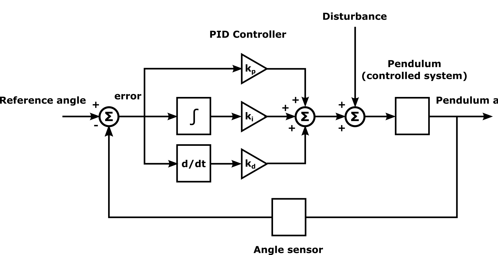

# Table of Contents
1. [Lab 0 - Negative Feedback](#lab-0---negative-feedback)


# Lab 0 - Negative Feedback

This lab has 3 main aims:
1. To see negative feedback control in action, and to get some feel for both its power and its limitations.
2. To introduce you to the PID controller, which is relatively simple but still far superior to the controller we saw in lectures.
3. To introduce you to Pymunk, a relatively simple and easy to use physics engine for Python. Perhaps some of you will consider using it in assignments.

# Table of Contents
1. [](#a-pid-negative-feedback-controlled-pendulum-with-an-external-disturbance-affecting-the-pendulum)
2. [](#playing-with-the-system)
3. [](#limitation-1-not-enough-force)
4. [](#stability-through-control)
5. [](#figure-3-the-main-plot-output-from-our-simulation)
6. []()
7. []()
8. []()
9. []()
10. []()
11. []()
12. []()
13. []()
14. []()

#### A PID negative feedback controlled pendulum, with an external disturbance affecting the pendulum



Figure 1 shows a negative feedback controlled pendulum, with a style of diagram that is familiar to you from lectures, but which has the addition of a disturbance which affects the pendulum. **The angle of the pendulum is the controlled variable**. 

We can set the code to either use a reference angle of $\frac{\pi}{2} radians$, so that the pendulum will stand upright, in the inverted position (if the controller is effective). Or alternatively, we can set the controller to use a time-varying reference signal, so that the pendulum exhibits cyclic motion.

In the code for this lab, the disturbance is a randomly varying force applied to the free end of the pendulum in the x-axis only. This means that it has most effect when the pendulum is vertically aligned.

You will also notice that the system diagram shows a different controller to the one covered in lectures. In lecture examples, the controller was a simple proportional controller, where the output from the controller is proportional (linearly) to the error. 

The controller in Figure 1 is a proportional-integral-derivative (PID) controller. In effect, this controller is three controllers in parallel and one of them is the proportional controller. 

The third controller is a derivative controller, and its output is proportional to the derivative of the error with respect to time. The derivative component of the PID controller can prevent overshoot, as the derivative (i.e. how the error is changing over time) has predictive power. 

The integral component, on the other hand, captures information about the history of the error, and can be used to eliminate steady-state errors, where a controller otherwise fails to "catch up" to the reference signal. 

Setting the parameters of the PID controller can be a bit tricky (or at least is easy to get wrong), especially the gain for the integral controller - if any of the gains are too large, the controller can become unstable, but this is especially the case for the integral gain.

The controller is defined as follows: $c(t) = K_p e(t) + K_i \int_{0}^{t} e(\tau) d\tau + K_d \frac{de(t)}{dt}$

Where $K_p, K_i, K_d$ are the gains for the proportional, integral and derivative terms, respectively, and is a dummy time variable.

For simulation (in Sandbox, in this case), we discretise the equation to:

$$c(t) = K_p e(t) + K_i \sum_{\tau=0}^{t} e(\tau)\Delta t + K_d \frac{e(t)-e(t-1)}{\Delta t}$$


where $\Delta t$ is the duration of a simulation time step, and the derivative term can only be evaluated for $t >= 1$

**Types of controllers:**
* If we set $K_i = K_d = 0$, then we have the proportional controller which we are already familiar with.
* If only $K_i = 0$ then we have a PD (proportional-derivative) controller, 
* If only $K_d = 0$ then we have a PI (proportional-integral) controller. 

**Understanding the Controllers:**
* Proportional ($K_p$): "The further I am from the target, the harder I should push." (The Present)
* Integral ($K_i$): "I’ve been slightly off-target for a long time; I need to add a little extra push to close the gap." (The Past)
* Derivative ($K_d$): "I’m approaching the target very fast; I should slow down now so I don't overshoot." (The Future)

Both of these last controllers are quite commonly used, as they are more stable than the PID controller under certain circumstances. In this lab, we will only use the **proportional** and **proportional-derivative** controller variants, as I was unable to create a scenario with this particular simulation where the integral controller component was beneficial, although a future lab with a slightly more interesting and challenging system will use the full PID controller. 

In this diagram, we can think of the controller as being the computational part of the system. The pendulum system includes the motor that the controller specifies the angular velocity (rather than a level of supplied energy or torque) for. This is due to the fact that the physics engine that we are using here, Pymunk, only has one type of motor, which is effectively already feedback-controlled to produce a constant angular velocity - the motor can slow down or stall, e.g. if its maximum torque is insufficient to lift the pendulum, but we don't have access to or control over the instantaneous level of torque.

#### Playing with the System

Feel free to play with the code if you want to, but you can do quite a lot just by modifying the parameters in the parameter file shown in Figure 1. These parameters are:

* `proportional_gain`: The proportional controller gain, or amplification/attenuation factor, denoted $k$ in the Lecture 3.2 slides, but $K_p$ here.
* `integral_gain`: The integral controller gain, denoted $K_i$.
* `derivative_gain`: The derivative controller gain, denoted $K_d$.
* `disturbance_strength`: The scale of disturbing forces. If this is set to 0, then there will be no disturbances.
* `pattern`: This parameter determines whether the reference signal for the controller is fixed or varies periodically. Set to $0$
 for fixed, and to $1$ for periodic.
* `mass`: Sets the mass of the ball on the end of the pendulum (note: this is not the full mass of the pendulum - its bar also has some small mass which we can't adjust from here)
* `main_plot`: This parameter determines whether or not the plot shown in Figure 2 is displayed. Set to $1$
 to display the plot and to $0$ to not display it. 

#### Limitation 1: Not enough force

Video 1 shows the system as you'll find it when you first run the code. The controller has a fixed reference point, and so the goal of the complete closed-loop system is for the pendulum to stand in the inverted position. Although the motor will run at a constant speed, until our controller changes it, the motor has a limit on how much torque (angular force) it can deliver. Here, the mass of the pendulum is so large that the motor fails.

Try increasing the gain of the controller and see if the pendulum will stand, as in Video 2. I'll be very surprised if you will find any gain for which this will be the case, but physics engines can do strange things - if this works, please let me know!

#### Stability through control

Try decreasing the mass of the pendulum, and find the point at which the motor torque becomes sufficient to lift the pendulum and produce plots like the ones shown in Figure 3. 

#### Figure 3: The main plot output from our simulation.

Figure 3 shows the main plot of our simulation outputs. This corresponds to the behaviour shown in Video 2. You may notice a similarity between the plots for the angle of the pendulum and the error. You may also notice what is known as overshoot in the pendulum angle plot: before the pendulum stabilises, it goes past the reference point and then bounces back. The noise and disturbance plots aren't relevant here, because the disturbance scale has been set to zero. The plots are coloured in such a way as to indicate time - not necessary for plots where time is on one axis, but useful in the interpretation of phase portraits. Notice where the lines end in the phase portraits. What does it signify for trajectories in phase space to converge on points like these, and why do the trajectories converge on those particular points?

* **Pendulum Angle**: This is the position of the pendulum in Radians. $1.57$ Radians ($\pi/2$) is exactly 90° (north) and $-1.57$ for -90° (south)
* Angle phase portrait 
* Error phase portrait
* Zero mean brown noise
* Disturbance 
* Error

Try to find a value for the `derivative_gain` parameter which will lead to the pendulum stabilising as quickly as possible without overshoot.


#### Initial Run

When running initially running the code as it comes, the pendulum starts pointing south and it push up hard on the left handside. It reaches just above level and swings back down. It doesn't quite return to south and then is pushed back up the left where it also doesn't return to the same height as before. This pattern repeats where each swing the low and high points become less extreme. Eventually, the pendulum settles pointing south west. This is the point whereby the motor strength it enough to hold the pendulum and resist it from falling into gravities desired position of handing south. 

The code is set up with `controller = FeedbackController(..., ref_value=1 * math.pi/2)`, this means the target and therefore the error is conditions to 90 degrees, i.e. straight north. 

In the add_pendulum function, the ball is placed at box_offset + Vec2d(150, -50). Because gravity in your space is set to (0.0, -900.0) (straight down), the pendulum starts hanging downwards.

In the run, the pendulum exhibits pulsing behaviour. Infact the motor/controller, which is a proporitonal controller, is constant but it is programmed to changed its output based on the error. This means as the pendulum is shot up, it power reduces and the mass of the pendulum is able to swing it back down. As it approaches south, the motor increases, this is what causes the oscilations. 

A Proportional controller’s output is $K_p \times \text{error}$. As the pendulum gets closer to the top, the error gets smaller. Eventually, the error is so small that the resulting motor speed isn't strong enough to overcome gravity. 

The goal is to have the pendlum stand up right, this is why the motor responds to the error, otherwise, it would continually push the pendulum over the taget. 

Essentially, if the Proportional Gain ($K_p$) is too low, the motor doesn't have enough strength to swing the pendulum and its mass all the way up. Eventually, it gets stuck where the motor's effort perfectly balances out the pull of gravity.

The output of the motor is governed by the `proportional_gain` $(K_p), the target and the current angle: `motor.rate = controller.step(dt, ang, target)`

$$\text{Motor Rate} = K_p \times (\text{Target} - \text{Current Angle})$$


```
proportional_gain: 10
integral_gain: 0
derivative_gain: 0
disturbance_strength: 0
pattern: 0
mass: 100
main_plot: 1
```


#### Increasing the gain of the controller 
> Try increasing the gain of the controller and see if the pendulum will stand, as in Video 2. I'll be very surprised if you will find any gain for which this will be the case, but physics engines can do strange things - if this works, please let me know!

I did not record this attempt as it doesn't lead to a desired outcome.

---

#### Decreasing the Mass of the Pendulum

> Try decreasing the mass of the pendulum, and find the point at which the motor torque becomes sufficient to lift the pendulum and produce plots like the ones shown in Figure 3.

Whilst it may seem inutatively that this is just the oppposite but same change as increasing the gain of the controller, it actually allows for fine-tuning on the control. There is less inertia and therefore parameter tweaks make visible makes. 

The result of decreasing the mass is that it overshoots the target but also continues to overshoot and pick up momentum with each loop. It is stuck in a positive feedback loop and begins to swing wildly.

#### Finding a Value for `derivative_gain`
> Try to find a value for the derivative_gain parameter which will lead to the pendulum stabilising as quickly as possible without overshoot.

By setting `derivative_gain: 1` we find that the pendulum reaches the upright position as before but this time sticks there. Below are a series of explanations around what is happening:

Proportional Gain ($K_p$) is tethered to the distance from the target as measured by the error. The higher the error the strong the push from the proportional gain. Derivative Gain ($K_d$) on the other and a dampening effect that slows things down. It is not contingent on anything sense of position or distance from the tatget, it only cares about how fast it is moving. In the code it is the "change in error" over "change in time" ($\frac{de}{dt}$). 

Derivative Gain can be interpreted as reacting to the potential future position by acting on the current velocity. If the speed is fast then if left unchecked the position will most forward districally. The DG works against this flow. 

In the code, the DG is calculated within the `FeedbackController.step()` function, the $K_d$ part of the formula is: $K_d \times \frac{Error_{current} - Error_{previous}}{\Delta t}$. If the pendulum is moving fast towards the target, the error will be shrinking rapidily. This will result in a negative value for the derivate which ultilty works against the proportional gains forward momentum. 

These combined forces mean that when the pendulum entrer the upright position is essentially stops dead at 90° instead of swinging past it like before. It removes energy from the system (specifically, it removes kinetic energy).

An important distinction to make for this example is that they are only acting against each other when the pendulum is moving toward the target. Once the upright position is found they actually work in tandem to keep the pendulum there. If the pendulum deviates from its upright positiom, then the error starts getting bigger so $K_p$ pulls Up to fix it. At the same time, $K_d$ also pushes Up to stop the falling motion as it engages in a reversal of the errors gradient. It cancels out the kinetic energy.

Also, at $90^\circ$ exactly, Error = 0, so $K_p \times 0 = 0$, so both forces are in activate. 

```
proportional_gain: 10
integral_gain: 0
derivative_gain: 1
disturbance_strength: 0
pattern: 0
mass: 75
main_plot: 1
```

#### Introducing Disturbance

If setting the `disturbance_strength: 1` we find a situation whereby the motor and derivative force are still the main driving source. This means that they are able to stabilbes the pendulum in the vertical position. However, what the distrubance will known the pendulum off center. A few things can happen here. First, the pendlum is knocked off center but the balancing forces are able to bring it straight bacl. The other option, is that the distrubance completely knocks the pendulum off target and sends it into a spinning loop. The further disturbances continue to send it round on a loop and it begins to spin uncontrollably. In all instances I watch, the loop eventually ends and the forces are able to able the pendulum again. 


#### Additional Experimentation

Experiment with combinations of appropriate or too high proportional and derivative controller gains, a fixed or periodic reference signal, and various levels of disturbance (try 0, 1, 2, 3 at first for disturbance levels)

* In each case, try to explain what you are observing. Is the system behaving in a way which seems realistic and can be explained in terms of the physics and parameters, or is the Pymunk physics engine producing strange behaviours?
* In every case, look at the plots, especially the phase portraits, and see how they change.
    * If you could not see the animation of the pendulum's motion, what could you tell about the system's behaviour from just the phase portraits?
* Try a disturbance level of 50 or even higher.
    * This is to highlight the limitations of physics engines, and Pymunk specifically - they can all behave strangely, often (but not exclusively) due to the injection of too much energy, as in this case. Actually, in my (fairly limited) experience, Pymunk fails quite gracefully in comparison to some physics engines, where systems are more likely to literally explode rather than just stretch under similar circumstances. 