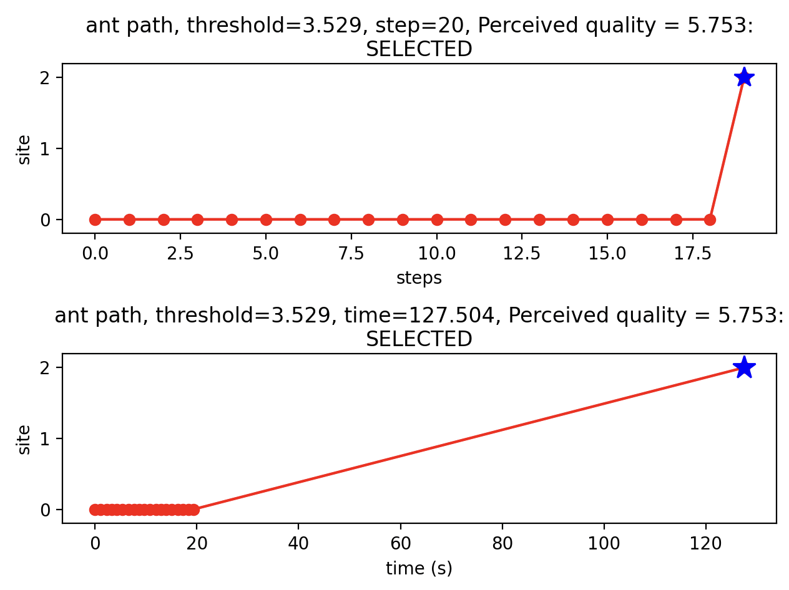
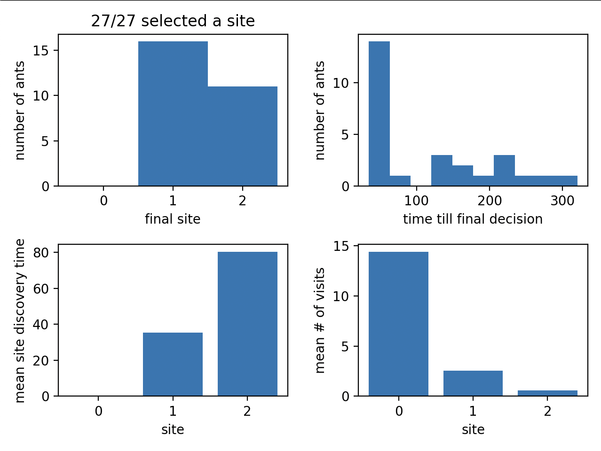
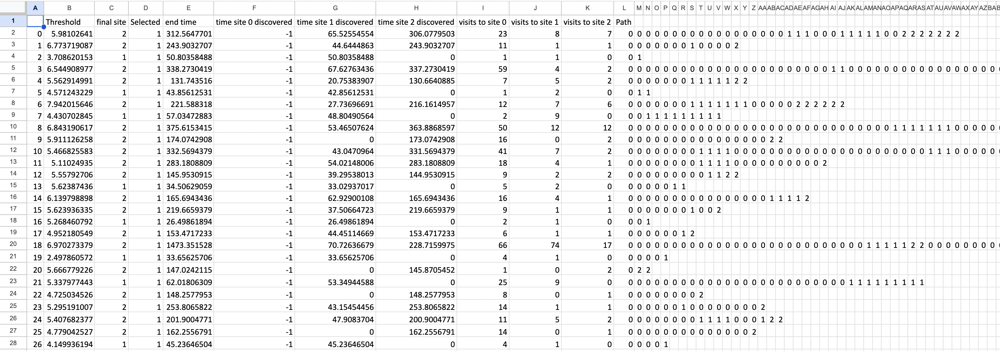
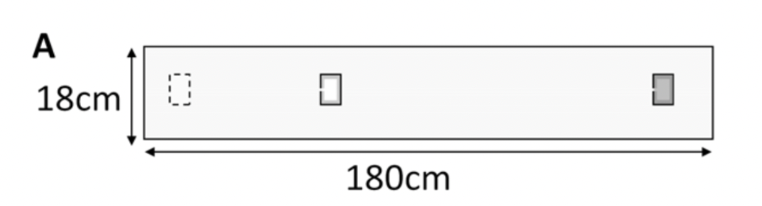

# Lab 3

The goal of this lab is to bridge the theoretical finds and critiques of Robinson et al. (2011) with practical, hands-on computational modeling. 

We choose to synthetically model such periments to test finding and our own hypothesis, conduct experiements and interogate mechanisms - particularly from a killjoy perspective.  

The primary technical goal of this session is an introduction to biological modeling through a Monte Carlo simulation, a technique that relies on repeated random sampling to compute results.

This set up is a tool to test the viability of a simplified, memoryless threshold rule as being mathematically sufficient to account for complex collective decision-making.

A large focus of the lab is on parameter sensitivity. This is a process whereby internal, controlable parameters are "tweaked" to see how robust the model is and at what point the biological simulation breaks and no longer works. Additionally, an emphasis of the lab is to think about and explain why such observed changes result in a specific change to the colony and its outcomes. 

---

### How the Model is Programmed

In the Python simulation each ant is initalized independently, moving them through the environemnt based on rigid probabiltiy matrices and and random statistical draws. 

**The Evaluation Rule:** When an ant finds a nest, it generates a perceived quality score by adding the nest's objective quality ($b$) to a random assessment error.

**The Threshold Check:** If that perceived quality is strictly greater than the ant's personal, randomly assigned acceptance threshold ($a$), the ant accepts the nest. Otherwise, it continues searching.

**The Statistical Distributions:** To mimic biological variation, thresholds are drawn from a normal distribution (e.g., mean of 5, standard deviation of 1), and the assessment errors are drawn from a normal distribution around 0.

**The "Old" Nest:** To ensure the colony actually emigrates, the damaged original nest is assigned a quality of negative infinity, making it impossible to accept.

**Movement Matrices:** Ants do not walk freely in 3D space; they instantly transition between discrete sites based on a fixed probability matrix (where the transition likelihoods for a given location always sum to 1).

**Travel Time:** The time it takes to move between sites is randomly drawn from a distribution based on a set matrix of mean travel times and their corresponding standard deviations.

--- 

### The Lab Tasks

**Baseline Replication:** Run the default model to ensure you can successfully replicate the standard results published in the 2011 paper.

**Threshold vs. Quality Testing:** Alter the relationship between the ants' internal thresholds and the objective nest qualities to see if you can generate illogical results or break the colony's ability to decide.

**Sensory Noise Analysis:** Increase the assessment error parameter to simulate ants with highly uncertain or "noisy" sensory judgments, and measure how much noise the colony can tolerate before failing.

**Environmental Layouts:** Change the physical parameters of the simulation, such as increasing the number of candidate nests from two to four.

---

## Set Up Basics

Execute the file by running `ExampleUsingRobinsonCode.py`

This file imports files `RobinsonCode`, `PlotSummaryDataRobinson` and `OutputRobinsonDataExcel`

`RobinsonCode` contains the main functions for the system

`ExampleUsingRobinsonCode` sets the parameters for the experiement

`PlotSummaryDataRobinson` and `OutputRobinsonDataExcel` allow us to capture, present and summarizes the outputs of the experiment.

`enter` to iterate through steps within a simualtion

`1` to complete an ants route

`0` to complete all ants and skip to the summary graphic

There will be 3 outputs. A graphical output of a single ants route. A graphic representation of the cumulative decision of all ants. And an excel dump of raw data as per each ants run.

--- 

## Simulating a Single Ant. 

The programmes produces an ants route interaively. Each step can be followed using `enter` or completed in full using `1`. 

Each ant is initalised with its own `threshold` value for its run. The number of `steps` is recorded for each iteration and well as the cumuliative `time`.

The chance of leaving the current nest and arriving at another is pre-determined given the `probs` matrix denotes the probabilities of visiting each site from each other

```
17 probs = np.array([[0.91, 0.15, 0.03], [0.06, 0.8, 0.06], [0.03, 0.05, 0.91]])
```

This matrix is set up so that the ant generally stays in an nest for several steps. 

The time it takes to get between the given nests is also pre-determined in `time_means`

```
20 time_means = np.array([[1, 36, 143], [36, 1, 116], [143, 116, 1]])
21 time_stddevs = time_means / 5
```

When the ant does arrive at a new nest, a `Perceived quality` is computed and recorded. Cruicially, there is not mechanism or programe to compute this intelligently. Instead, it is simulated by drawing from a normal distribution. Each nest in the environment is pre-assigned a mean quality in `quals` and has a standard deviation assigned to it. The SD by default is 1. 

```
25 quals = np.array([-np.inf, 4, 6])
30 qual_stddev = np.array([1, 1, 1])
```

When an ant is not at `site 1` or `site 2` the ant will be at `site 0`, I am not yet clear if this means that the ant has returned to the original site or if it means that the ant is just travelling somewhere in the land. Either way, these `site_0` occurances do not record a quality and just rank as `-INF`

If the `quality` does not exceed the `threshold` then the graphic and programme will record `NOT SELECTED` and/if it does exceed then it will record `SELECTED`

<p align="center">
  
</p>

---

## Simulating a Cohort of Ants

Pressing `0` when starting a simulation will skip to the summary graphic for the number of ants `n`

```
35 n = 27
```

The plotting functions from the file `PlotSummaryDataRobinson.py` and are imported into `ExampleUsingRobinsonCode.py`. It captures `current_time, accepts, discovers, visits, Ants` variables which are derived by running the main `rc.RobinsonCode`

**Final Site counter:** This has number of ants on the y-axis and site number on the x-axis.

**Time till final decision: This also has number of ants on the y-axis but cumaltive time taken till `SELECTED` decision on the x-axis.**

**Mean Site Discovery time:** This has mean time on the y-axis and site number on the x-axis.

**Mean Number of Visits:** This has mean counts on the y-axis and site number on the x-axis.

<p align="center">
  

---

## The Excel Dump

he Excel Dump provides a granular but raw breakdown of each ants (rows) path, sites and times broken down into steps (columns). It has no assesment quality related data but does hold the threshold allocated to each ants simulation. Each row relates to a different ants simulation and the columns are a mix of outcomes, aggregrate metric and at the end a column break down of each step taken and where the ant was. For this final section, the number of columns of variable for each row and depends on the route the ant took. 

<p align="center">
  
</p>

---
| Column Name | Column Description |
| :--- | :--- |
| Ant/Row Number         | Just a row label for the order of simulations |
| Threshold              | The quality threshold assigned to the ant at the start of the simulation |
| Final Site             | This is the final site that the ant selected |
| Selected               | This appears to be a binary marker to say if a nest was selected. All simulation in my default example were `1` implying that a nest was selected but maybe there are some instants where it doesn't select a nest |
| end time               | Looks to be the cumulative time take to find a nest |
| time site 0 discovered | Entry values are all `-1` for the default run, I assume this is because it is the starts here |
| time site 1 discovered | The cumulative time it took to discover `site 1`. It can be zero meaning the site was never visited |
| time site 2 discovered | The cumulative time it took to discover `site 2`. It can be zero meaning the site was never visited  |
| visits to site 0       | Count of visits to `site 0`. It correlates to counting the number of `0` entries in the `Path` array. Again not sure if the mid array `0` means `site 0` or travelling |
| visits to site 1       | Count of visits to `site 1`. |
| visits to site 2       | Count of visits to `site 2`. |
| Path           | This is the final named column but has trailing columns with no header. It represents an array of the route that an ant took. Each column is a time step and the value within the cell is the site that an ant is currently at. In the default run, each array starts at 0 but can also revert back to being 0 after site 1 or 2 have been reached. It's not clear to me whether these subsequent 0 vists mean the ant has returned back to site 0 or it means that the ant is travelling somewhere in the environment. |
---

<br>


## The Model

The premise of Robinson et al is to model how ants find new nests after the old one is damanged.

In the model, individual ats do not interact with each other, they are simulated individually.

Ant assess the sites they arrive at, derividing a quality metric which they then compare against a pre-determined acceptance threshold. If it exceed then they stay in the nest, otherwise they continue searching. 

---

#### Model Schematics

- Arrive at and assess a nest
- If the assessed quality $(b_i)$ plus some assessment error $(\varepsilon)$ is less than the threshold $a$ then reject the nest: $b_i + \varepsilon \le a$
- If the assessed quality $(b_i)$ plus some assessment error $(\varepsilon)$ is more than the threshold $a$ then reject the nest: $b_i + \varepsilon > a$

---

### Model Parameters

The model params are the key tool to affect ants' decisions.

In the default example run, the mean of the acceptance threshold is set specificly (hardcoded) as the middle value of the two sites but this can be changed. 

The mean of the two nests might be quite a poor and misleading midpoint as it suggests that the ant as some sort of global knowledge about the possible nests it will encounter and is happy with something in the middle. 

---

<br>

---
| Parameter Name | Parameter Sign | Values | Line Set |
| :--- | :--- | :--- | :--- |
| Acceptance Threshold | $a$             | Normal Distribution; `mean = 5`, `sd = 1`   | `threshold_mean`=`line 38`, `threshold_stddev`=`line 39` |
| Nest Qualities       | $b$             | `site_0 = -inf`, `site_1 = 4`, `site_2 = 6` | `line 25`, `quals` |
| Assessment Error     | $(\varepsilon)$ | Normal Distribution; `mean = 0`, `sd = 1`   | `line 30`, `qual_stddev`, this can be set different for each nest |
---

<br>

### Assessment Error

Biological functions are rarely deterministic and are subject to natural variations. Sometimes related to other factors, othertimes processes are purely probablistic. This is captured using the assessment error $(\varepsilon)$. Every evaluation decision made is impacts by an assessment error. The error is drawn from a Normal Distribution and the Standard Deviation is set for each site. It should be noted that the probability of an ant select a nest is function of two distributions; The distribution to draw the overall acceptance threshold and the distribution to draw each steps assessment error.

---

### Moving Around 

An environment is set up that resembles a rectangle with dimensions 18cm x 180cm (long and thin). 

<br>

<p align="center">
  
</p>

<br>

Within this space, subspaces are allocated which respresent nests.

A matrix is setup/computed that maps the probabilities of travelling between nests.

The columns represent the starting nest and the rows the destination nest. 

Each column will sum to 1 as it represents all travel options.

The highest probability will always be the current nest, no journey, this is because the ants stay in one place for a period and assessment mutliple times.

Embedded into the probabilities is the notion that nests further away are less likely to be visited.

Though this is an assumpt as IRL obstacles may block nearer nests making the travel time longer. The probabilites are fixed and hardcoded on `line 17`, `probs`

<br>

---
| | Old | A | B |
| :--- | :---: | :---: | :---: |
| Old | 0.91 | 0.15 | 0.03 |
| A | 0.06 | 0.80 | 0.06 |
| B | 0.03 | 0.05 | 0.91 |
---

<br>

In additional to this, there is a mean travel time matrix. This too is a hardcoded matrix set on `line 20`, `time_means`. The difference is that these values represent a mean to be samples from and is actually re-calculated and different for every trip. On `line 22`, `time_stddevs` computes this variability. 

<br>

---
| | Old | A | B |
| :--- | :---: | :---: | :---: |
| Old  | 1   | 36  | 143 |
| A    | 36  | 1   | 116 |
| B    | 143 | 116 | 1   |
---

#### The `0` Space

In this simulation, the physical space between nests isn't modeled as a grid. Instead, "returning to 0" acts as the mathematical equivalent of the ant wandering in the open environment or returning to the hub before striking out on a new path.

As a result, an ants path can look like: `0000011110000000001111111111111000000000002222222`

The 0 spaces do not mean that the ant is at the broken nest, it is the transition periods

<br>

### Model vs Simulation

a model (the mathematical theory in the Robinson paper) is not exactly the same as a simulation (the Python code). Because the simulation uses discrete time steps and random number generators, it is an approximation of the model, meaning we have to account for programmatic constraints (like infinite loops) that don't exist in pure math.

---

## The Tasks

### 1. Running the Model

Start by running the model, seeing how it works, and seeing if you can replicate the behaviour seen in the paper

<br>

---

### 2. Changing Parameters

You can then see how the behaviour of the model changes when you change parameters. An obvious starting point is the value of thresholds vs the qualities of the nest: Can you generate ‘odd’ results or even ‘break’ the model? How much can you change parameters until the behaviour changes (sensitivity analysis)?

As noted, the key is to look at both the behaviour of individual ants and the aggregate results so you can explain why the change you made gives rise to the behaviour you see. You can then decide if this is an issue for the model

<br>

---

### 3. Ants Sensing

You could instead investigate the sensing of the ants: For the Robinson paper, a starting point is how variable/uncertain the ants quality judgments are. What if they are more uncertain (noisy) than the original model assumes? How much can you change this factor until the model breaks (sensitivity analysis again)?

<br>

---

### 4. Changing the Environment

A final idea is to see what happens in other experimental situations eg changing the number/arrangement etc of nests. The m-file ExampleUsingRobinsonCode4Nests.m shows how you would set up the 4-nest example they use

<br>

---

### 5. Parameter Sweep

Like the earlier MATLAB implementations, ExampleUsingRobinsonCode.py is a script, which runs the simulation once for a given number of ants. If we want to run a parameter sweep (e.g. for sensitivity analysis), we need a way to automate running the simulation multiple times with different parameters. I have given an example of how to do this in ExampleUsingRobinsonCode_func.py, where the script has been turned into a function, which takes one parameter and returns one of the values which result from running the simulation - more parameters and returns could easily be added to do something more useful. param_sweep_test.py shows how to call the function from ExampleUsingRobinsonCode_func.py to conduct a simple parameter sweep.

<br>

---