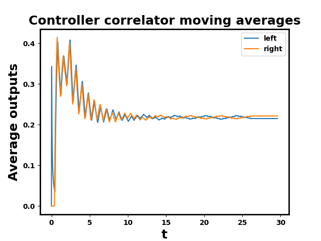
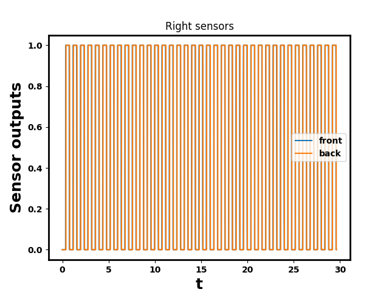
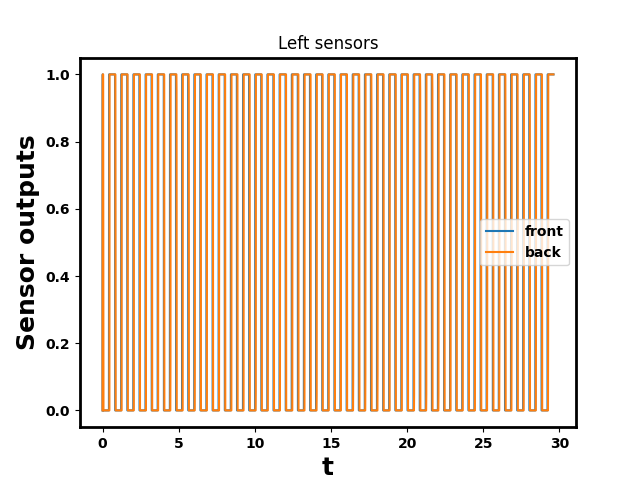
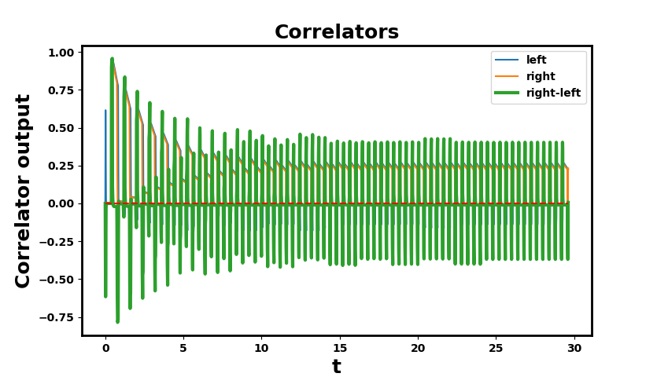
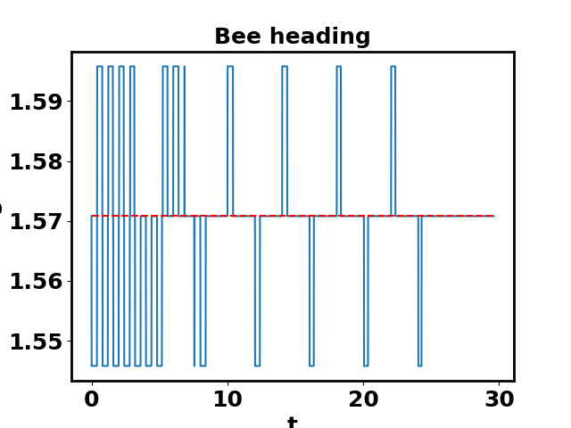
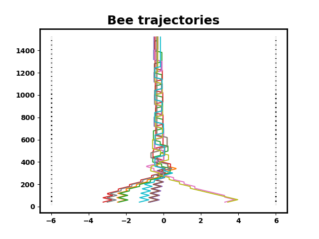

# Lab 2 - Elementary Motion Detection

This labs purpose is to simulate animal behaviour and analyse the output of simulations to answer research questions. The lab starts with a working, coded system and through analysis we to understand how it works and what makes it fail. This system we are using is very complex with many paramaters, too many to explore all of them

## What are we modelling?

**Bees centering response.** When flying through a narrow space bees will naturally go in the center. But bees do not have sterospoic vision. This means that they **do not have depth perception** like we do. The suggestion is that they instead use **optic flow independently in each eye.**

Optic flow is the pattern of perseived motion on the retina/sensor when either you (the agent) or the environment is moving - think train moving.

Srinvasan et al. do an experiement on bees where they line a corridor with vertical stripes. Flying through this corrirdor with create oscilliation and therefore strong apparent motion. The authors wanted to test centering ability when the walls were manipulated. They use 6 different patterns, including where the walls themselves are also moving. 

In our system we are simulating the bee, patterns and movemements. 

## Task 1: Understanding Elementary Motion Detectors

Using optic flow, an agent can: 
- Detect motion of other agents
- Detect surrounding objects
- Detect agents own motion

The latter point of agents own motion is the focus of this lab and experiement 

How to obtain a measure of optic flow? Have spatially seperated sensors which move together. This detect stimuli and different times. This information/signals are connected to an EMD to detect optic flow. This lab used an EMD called Hassenstein-Reichardt Detector. 

### A simple EMD explained:

2 optical sensor (retinas) from an agent in motion. Sensor 1 detects stimuli first and the Sensor 2 detects the same stimuli after. If the input from Sensor 1 is delayed by the same amount time that seperates the two sensors then both signals meet a point (called the mutlipler) @ the same time. If this happens then motion can be detected via the output of the multiplier. 

Note, an EMD doesn't do anything. It just collects signals and passed on information (motion detection) onto neurons. There would be many EMDs all capturing slightly different in formation but using the same delay maching mechanism 

### Type of info an EMD Could Monitor:
- Stabilizing flight by detecting **rotation**
- Navigation by identifying objects
- Speed detectors by EMDs using different levels of delay which will fire at different speeds.
- Direction detection (forwards vs backwards)

An individual EMD will only fire when its own conditions are seen. An EMD will be very sensitive to its surroundings, speed, delay, distance between sensors and distance from objects. 

### A Superior EMD

Based on Riabinina & Phillipides, it has less chance of being fooled. A fooled EMD is one where conflicting conditions product the same output signal. Misleading output. This happens because the classic EMD depends on constrast and the core matchingoperation is mutlipcation (non=linear). This means the output is highly dependant on instensity/constrast, not just speed. Known as speed-constract ambiguitity. 

A high-contrast, low speed observation will still generate very high output. A low-contrast, high speed will product lower output. The problem is that the magnitude is ambiguous 

R&P EMD is independant of contrast. It words by normalising the inputs and computes a ratio of contrast, i.e. A high constract setting is accounted for. It therefore provides an unambigous measure of visual speed

### Steps:
1. Input(s) passed into a high pass filter
2. Sensor 1 is then passed to a low pass filter
3. Sensor 1 (H, L), Sensor 2 (H) -> Passed into mutliplier unit

### What do high pass filters do?

The HPF allows for decay and phasing of a signal as it apporaches and passes. In the simple EMD, signal is oeither on or off. The mechanism does this by detecting edges. It does not change the temporal different between sensors (lag)

### What does the Low Pass Filter do?

LPF smooths and phase shifts the signal. Phase shift may give the signals more overlap. There is a param to control this. The smaller the param, the larger the smoothing and pase-shift efect. 

### What does the mutlipler do?

Recall, S1(H,L) and S2(H) are passed to a mutliplier. This gives the strength of the match. If both are higher then the signal will be very high. If they are opposites then the EMD will be negative.

## Task 2 Download the Code

## Task 3 - Run a Parameter Sweep

The advantage of "in silico" experiements is that you can run the simulation many times with different starting conditions. Complex systems tend to depend heavily on the initial conditions. Best way to unpack and learn the behaviour of a compled system is to simulate many times from an ensemable of intital conditions and compare results.

We can investigate this systematically by performing a parameter sweep. A parameter sweep is a methodical technique used in modeling, simulation, and optimization to test a system's behavior across a range of input values for one or more parameters. The primary goal is to understand the sensitivity of the system's output (or performance) to changes in its inputs, and to identify optimal or critical parameter settings.

### Parameter sweeps are essential for:
- Optimization: Finding the best configuration for a system.
- Robustness Analysis: Determining how resilient a system is to variations in its environment or inputs.
- Validation: Confirming that a model behaves as expected across its entire intended operational space.

In our experiment, we can investigate this systemmatically by performing a parameter sweep. We will run a simulation many times while manipulating a parameter in order to see how robust or stable the behaviour of a system is. Or when it breaks.

### Key things to examine are:
- How strongly the system depends on parameter values
- How combinations of parametetrs work together

This is known as **sensitivity analysis**. If a system is very sensitive to a parameter changing or a particular range of parameters then this may highlight an issue

### The general approach is:
1. Start with a range of parameter values, e.g. [1, 5, 7, 10] or (0 to 100)
2. Run a simulation for each value and record some important metric
3. Plot results over the range for analysis

Note, it is often better to sweep over two parameters at together as you may discover if paramters are independent or conencted in some way. 

### Robustness 

Individual simulations may be misleading and suggest things are better than they are. We can introduce various types of noise into our simulations to test robustness.

### Getting Started with the Code

The script is `vel_vs_lp_fc.py`. It initalizes a simulated agent based on a bee. It flies in a striaght line parallel to a vertically alligned wall with alternative stripes. The bee has sensors which detect patterns in view as either 1 (black) or 0 (white). If all parameters are set to false (default) then it will sweep over two parameter lists for velocity and corner frequency (this is the param for low-pass filter). If the outut is higher then more motion is detected

- line 119: Patch Height, `patch_h = 20`
- line 134-140: `single_run`, `sweep_vels`, `sweep_fcs`, `mutli_vels`. These are all boolean and false by default. 

### Comprehensive vs Resolution Trade off

Ideally we want to make the resolution as rich and detailed as possible: `v_n` & `l_n` (these are the param lists to loop through). But may be very time and comutationally expensive. Although PCs are fast and cabable today so this is not as much of an issue. 

### Tasks:

Experiment with simulations by sweeping over parameters and graps how simulation ouputs change with parameters

#### 1. Effect of Initial Conditions

`lines 151-121`, if `single_run = true` (134)

#### 2. Effect of Bee Speed

Run a 1D parameter sweep over velocity (fixing LPF corner frequency). Code that control this found in `lines 214-233`, `elif sweep_vels`

Increasing bee velocity seems increase average correlation but reduce smoothness of the line. More simiulations might be needed to average out the noise.  Also means it has an optimial delay time

#### 3. The Effect of LPF Corner Frequency

1D sweep for LPF with fixed velocity, `lines 235-254`

- 0 LPF has very little correlation
- Rapidly increases almost vertically until 5
- then drops and very slowly trails out
- If the filter is lower then it is more smooth
- If higher then less smooth, it lets through more of the HPF without changing it

- 0 has flat signal hence no correlation. It introduces and very long temporal delay
- Large LPF values will introduce almost no delay

The sudden rise and peak of the LPF parameter implies that it has an optimial level that we can fix at and focus on exploring other paramters in the ystem

The peak is where the LPF is allowing the temporary delay to exactly match. It is the optimla point for the volocity fixed at. 

## Task 4: Simulating Corridor Centering Bees

Scripted used `bee_corridor.py`

In task 3, we simulated 1 wall + pair of sensors. Task we implement the full experiement. A pair of sensor on each side of the agent and a wall each side.

- Real Honey bees centre their flight trajectories in the corridor/tunnel by balancing the optic flow on two side of their visual fields
- For out simulated bee. If the average outputs of the EMD are equal then the bee must be flying in the center. If the outputs are unbalanced then the bee should steer towards the lower EMD to rebalance itself. In the code, the walls are technically visual only. The "bee" could fly through them if it wanted it, though it is programmed not to

Recall that is it Kirchner and Srinivasan hypothesis that bees centre themsevles when flying through a corridor or tunnel using optic flow on the two sides of their visual fields. The simulated bee should be capable of this because it has two sensors with associated EMDs on each side of its body. Though the behaviour requires the parameters to be set well

In inputs to the system are very simple:
- 4 binary signals
- 2 sensors on each EMD
- Input to sensor is either white or black

If the signals from the EMDs are equal then the bee must be flying in the middle of the corridor. If the average output is higher on the left than the right, then the bee shoud steer more to the right. Being higher on the left then it must be closer to the wall meaning the signals between black and white will be closer due to perspective

### The Code

#### Moving Averages

Under the parameter sweeps we took the average EMD output from all of the interations simulations. For a real-time implementation, we need to know how much optic flow the EMD is detecting right now. Actually, in practice, we want to get an idea of what the optic flow decected has been like recently. This is because the instantaneous output of an EMD can vary greatly. An easy solution is to use a moving average of a recent (short) time window. When using a moving average, the window is the most recent interval of time. The effect of a moving average is much like the smooth effect of an LPF. A small moving average window does not average much as the result will be more similar to the instantaneous output of an EMD.If the window is too large, then the signals will be smoothed too much and the system will be not recognise EMD changes quick enough meaning it is respond slowly, lagged o r just not at all

Window size is one of the parameters we are going to investigate and is set by `window_n` on `line 102`

`controller = OpticFlowController(vel=50, margin=0.0075, window_n=200)`


#### The Controller

The bee's controller has very simple principles:
- If the bees average EMD outputs are close enough together then the bee will just fly forward
- "Close Enough" is determined by `margin` also on `line 102` with the `OpticFlowController()`
- If the EMD is greater on the left, then the bee will steer right
- If the EMD is great on the right, then the bee will steer left
- The angle by which steering takes place is set on `line 59`, `d`

The controller has 3 parameters will are set in `OpticFlowController()` on `line 102`:
- `vel`: the bee's linear speed, which will be constant over the entire simulation
- `margin`: the margin within which the EMDs' average values are considered similar enough for the bee to be in the centre of the corridor
- `window_n`: the number of simulation steps which will be used in computing the moving averages of the EMD outputs.

#### Ensemble of initial conditions

- The number of times a simulation is run is set with `n` on `line 85`
- Every simulation will start at the same y-coordinate in space
- But the x-coordinate will vary each time (lateral space)
- This is so we can confirm that the results are robust as there isn't some specially starting sweet spot that allows for certain behaviour and completions
- The path taken during each path will be plot on the graph in a different colour
- The bee traverses foward in the y-direciton using angle changes to center itself

# The Tasks

The main aim of the task is to investigate the idea that corridor centring can occur by balancing optic flow. We want to play with and test things with the hope of understanding how the system works. Also to know its limits: how does it work, and how, when and why does it fail?

## Interpretting the output 

 Staring point, `vel = 50`, `margin = 0.0075`, `window_n 200= `

 There are 5 plots to look at:
 - Average Output
 - Sensor Output
 - Correlator Output
 - Bee Heading (Radians)
 - Bee Trajectories

### Average Output

- This plot is just showing 1 simulation. The N-1 (last) simulation
- This represents the only reliable indicator of a bee success.
- These are the values uses to decide the Bee Heading Radians
- The bee only flys straight up the y-axis when the differential between the means is less than the margin
- When the bee is travelling diagonally it is impacting the optic flow. The lag between the strips becomes lesser when it travelling diagonally, that is to say the 2 second arrives quicker.
- The high pass filter Acts as an edge detector. It removes the stable DC component and emphasizes the rapid intensity change (the black-to-white or white-to-black edge).
- The low pass filter Introduces a necessary time delay and phase shift. The delayed front signal will only correlate (match) with the current back signal if there is motion.
- Mutlipler The instantaneous Optic Flow output (the raw, noisy signal from your Plot 3). The magnitude of this correlated signal is proportional to the speed of the pattern across the sensors.
- $$\mathbf{R_{instantaneous}} \propto \mathbf{V/d}$$
- The bee's forward velocity ($\mathbf{V}$) is constant. Therefore, the optic flow signal ($\mathbf{R}$) is inversely proportional to the distance ($\mathbf{d}$).
- The raw EMD output (Plot 3) is too noisy to use for steering. This is where the Controller Correlator Moving Averages (Plot 1) come in:
- What it is: A simple average of the last $\mathbf{window\_n}$ instantaneous EMD outputs.
- The Interpretation: The moving average filters out the noise and provides a stable signal that represents the average perceived motion on that side.
- The bee interprets:
- High Average Optic Flow $\rightarrow$ Wall is Closer
- Low Average Optic Flow $\rightarrow$ Wall is Further
- The bee's "interpretation" of the wall is simply: "How high is the moving average on this side relative to the other?" It never needs to know the actual distance, only the imbalance between the two optic flow signals.
- The margin is introduced specifically to manage the imperfectness of the control loop, allowing the system to achieve practical stability (the stable zigzag) instead of chasing impossible perfection.
- The bee's steering is not a perfect, smooth action; it is a fixed-step, on-off control system—it can only turn by a fixed angle $\mathbf{d}$ or fly straight.
- Problem: Because the steering is aggressive ($\mathbf{R \propto 1/d}$), any correction almost always overshoots the point of perfect optical balance.
- The bee's true steady-state behavior is a continuous cycle of over-correction, brief coasting, and then re-correction, known as Limit Cycling (or "hunting"). This is the zigzagging you see in the "Bee Heading" plot after $t \approx 15$.
- The margin parameter (set to $\mathbf{0.0075}$ in your script) is the mechanism that tames this hunting behavior. It creates a "dead zone" where the controller is deactivated.
- Without a Margin: If $\mathbf{margin = 0}$, the controller would theoretically demand perfect equality ($\mathbf{R_{Left\ Mean} = R_{Right\ Mean}}$). Since the simulation has noise and discrete steps, the flow would almost never be exactly zero. The bee's heading would switch violently at every single time step, leading to a massive, chaotic crash.
- The margin ensures that the bee's optical imbalance must grow to a noticeable degree before a new correction is triggered. This prevents the heading from switching wildly and forces the bee into a stable, low-amplitude zigzag that successfully keeps it centered.
- "Perfect Convergence" ($\mathbf{R_{L} = R_{R}}$): This is the condition that triggers the "Fly Straight" command ($\mathbf{\pi/2}$ radians).
- "Fly Straight" Command: This command means zero turning effort (no new lateral velocity). It does not stop the existing diagonal coasting movement that was already in progress from the previous turn.

```
# Code snippet from bee_corridor.py (Controller logic)
if abs(left_mean - right_mean) < self.margin:
    # 1. Fly Straight
    heading = math.pi/2
elif left_mean > right_mean:
    # 2. Steer Left (Optic flow on left is greater -> Left wall is closer)
    heading = math.pi/2 + d
else:
    # 3. Steer Right (Optic flow on right is greater -> Right wall is closer)
    heading = math.pi/2 - d
```

- However it is dependant on the margin so the values can be very similar but still output side of the margin bounds


- Plot 1 shows the history of self.left_means and self.right_means. This plot represents the filtered optical flow and is the only signal the bee's controller uses to make steering decisions.
- It is filter by the HPF and LPF so it will be smooths and window averaged
- Plot 1 is the output of a temporal filter applied to the signals in Plot 3.
- The bee's controller cannot use the raw signal in Plot 3 because the extreme oscillations would cause it to steer wildly and crash almost immediately. The moving average (Plot 1) is used specifically to smooth out this noise, revealing the stable, underlying visual speed signal that accurately reflects the bee's distance from the wall.
- The height of each line (the average output) is proportional to the optic flow perceived on that side.
- Recall that in this default run, the walls themselves are identifcal. Any difference in perceived flow is caused by distance from a wall
- Since optic flow is inversely related to distance ($\mathbf{R \propto V/d}$)
- Higher Average Output ($\mathbf{R_{mean}}$) means the wall on that side is closer (stronger perceived motion).
- Lower Average Output ($\mathbf{R_{mean}}$) means the wall on that side is further away (weaker perceived motion).
- An off center starting point will create a Feedback Loop and Overshoot effect
- The bee's control logic is fundamentally simple: Eliminate the difference between the two moving averages.\

- The average outputs appear to start at a larger value for both left and right.
- The signal values are pretty similar for each side as each point in time but the right side appears to be slightly more.
- They spike and oscialate over time, with the spikes gradually becoming less severe as the average output stabilises near 0.2
- Then the stabilse, the right side which was always marginally more is now marginally less

- Optic flow ($\mathbf{R}$) is proportional to $\mathbf{1/\text{Distance}}$ ($\mathbf{R \propto V/d}$).
- The bee's controller is designed to achieve:$$\mathbf{R_{Left\ Mean}} = \mathbf{R_{Right\ Mean}}$$
- When this condition is met, the controller issues the Fly Straight command.

- The bee will use its steering to balances its optic flow.
- Being close to a way will put the signal out of sync
- But then the rapid steering away from the wall will change the perspective and balance the optic flows
- The bee can then coast in a diagonal position



### Sensor output

- The "curve" in this graph is a percectly stepped with only horizonatal and vertical lines
- The front and back line are almost perfectly matched. Infact you can barely see the front (blue) line being the back (orange) line
- At each t step the singal output is either 0 or 1 (white or black)
- There is a chart for each sensor (side). Both are the same here




### Correlator Outputs

- The entire mechanism relies on the relationship between Optic Flow (the apparent angular speed of the world) and the Distance to an object.
- The magnitude of the EMD output ($\mathbf{R}$) is proportional to the angular velocity ($\mathbf{\omega}$) of the visual pattern across the sensor.
- The angular velocity ($\omega$) is governed by the bee's forward velocity ($\mathbf{V}$) and the distance ($\mathbf{d}$) to the wall: $$\mathbf{R} \propto \omega \propto \frac{\mathbf{V}}{\mathbf{d}}$$
- If the wall is closer, ${\mathbf{d}}$ is smaller and therefore $\mathbf{R}$ (EMD) is higher
- If the wall is further away, ${\mathbf{d}}$ is bigger and therefore $\mathbf{R}$ (EMD) is lower
- The goal is to make the optic flow from each sensor equal (enough)
- The output of the EMD (magnitude), which is the same as the angular velocity, much match enough on each sensor
- In the code there is a left (blue) and right (organge) line which is the instantanous (probably the moving average?) for each sensor
- It mostly shows spikes but has some diagonal lines which is where the bee is redirecting its trajectory
- The output of each EMD is called the correlator as it combined the 2 lagged into inputs. but these are the instaneous values
- There is a green line which is just calculated (right minus left)
- This is instaneous control errror
- Or, the raw, unfiltered difference in perceived optic flow between the two sides.
- It is calculated on `line 146` using `np.array(bee.controller.right_corr.outputs) - np.array(bee.controller.left_corr.outputs)`
- A positive peak means the right side had a stronger instantaneous flow (closer wall), suggesting a need to steer left.
- A negative trough means the left side had a stronger instantaneous flow (closer wall), suggesting a need to steer right.
- This graph is showing the raw instantaneous output. Its value is to basically tell us why the bee and control system don't use the data in its raw form because it is so noisy
- The graph oscilates wildly between positive and negative because of the optic flow structure
- It is switching when viewing white-black or black-white which each have different values
- black-white positive, white-black negative
- Since the colours are oscialating the outputs oscilate
- This rapid, noisy oscillation is why the controller never uses this instantaneous value to steer the bee.
- The bee will steer based on the moving average with smoothes out the oscilations.
- Allows the bee to move slower and more deliberatrly than is it somehow had to respond to these rapid movements
- The bee starts off centre to the oscilations are large and rapid. Over time they decay as a result of the moving average steering
- After a while, the bee stabilites enough. The spikes on this graph keep oscilatiing due to the colours but because the walls are perceived to be equi-distances now, the spikes mignatiude (height) will be the same. 



### Bee Heading (Radians)

- This plot shows the bees sterring decision at each point in randians back on the output of the EMD controller
- It is the bee's instantaneous direction of travel (its heading angle) at every time step $t$, measured in radians.
- The middle red dashed line is given by $\mathbf{\pi / 2}$ radians.
- a heading of $\pi/2$ (or $90^\circ$) means the bee is flying perfectly straight ahead up the x-axis
- The system only allows for the bee to have 3 directions: left, right or centre
- This is why the graph only have steps throughout
- One the bee stabilizing in the margin it enters something called Active Centering.
- On this graph is looks like it continues shift between left and right
- But it is actually just doing very feint oscilations within the margin
- If the solution has N=10 runs then the graph shows only the final bees actions



### Bee Trajectories

- The final plot is each bee's path taken.
- They all start from the same y-axis point but variable a-axis
- At end time step a bee moves forward either redirecting itself or continuing perfectly in the x-axis if it doesn't wish to make adjustments
- In these plots, the a-axis is the distance travelled, not time
- The bee travels at a constant forward velocity (vel) of 50 units per second.
- $$T = \frac{\text{Distance}}{\text{Velocity}} = \frac{1400 \text{ units}}{50 \text{ units/second}} = \mathbf{28 \text{ seconds}}$$
- The number of timesteps ($N$) is the total time divided by the simulation's time step size (dt), which is set to 0.01 seconds:
- $$N = \frac{T}{dt} = \frac{28 \text{ seconds}}{0.01 \text{ seconds/timestep}} = \mathbf{2800 \text{ timesteps}}$$
- Therefore, the simulation actually runs for roughly 2800 timesteps to cover the 1400 units of distance, not 1400 timesteps. The y-axis shows space, while the $t$ on your other plots (like the heading plot) shows time (which relates to the number of timesteps).
- In the simulations, "data" is captured upto a certain distance, i.e. when they get to a certain mark in corridor
- In this plot they all reach the same distance even if they took different or less optimal paths
- But a plot with more diagnoals with have a longer path and have taken longer to get to the end point
- conversely, a straighter path will be quicker and have a shorter route
- Controller sets the bee's linear speed (vel) to a constant value (50) throughout the entire simulation.
- $$\mathbf{\text{Time} = \frac{\text{Total Distance Traveled}}{\text{Constant Velocity}}}$$
- A wobbly bee that travels a longer total path distance must take more time to complete the corridor than a straight-flying bee, even though they both reach the same final $y$-coordinate.




### 1. Experiment with the window size for the moving average.

How small or large does it need to be to make the controller fail? 

Does it fail in the same way for very large and very small windows, or do they cause different problems? Why?


### 2. Experiment with the margin size.

How small or large does it need to be to make the controller fail? 

Does it fail in the same way for very large and very small margins, or do they cause different problems? Why?

`line 102` changing `margin` in `OpticFlowController()`


### 3. Experiment with speed

For higher and lower speeds, repeat steps 1 and 2.

How do the different combinations of parameters combine to affect the bee's behaviour? 

Are there speeds that break the corridor centring response? If so, is this a problem for the theory/model or not?


### 4. Experiment with the environment

Try making the corridor wider or more narrow, by increasing or decreasing w on line 90 of the script.

How does changing the width of the corridor affect the bee's behaviour? Why?


