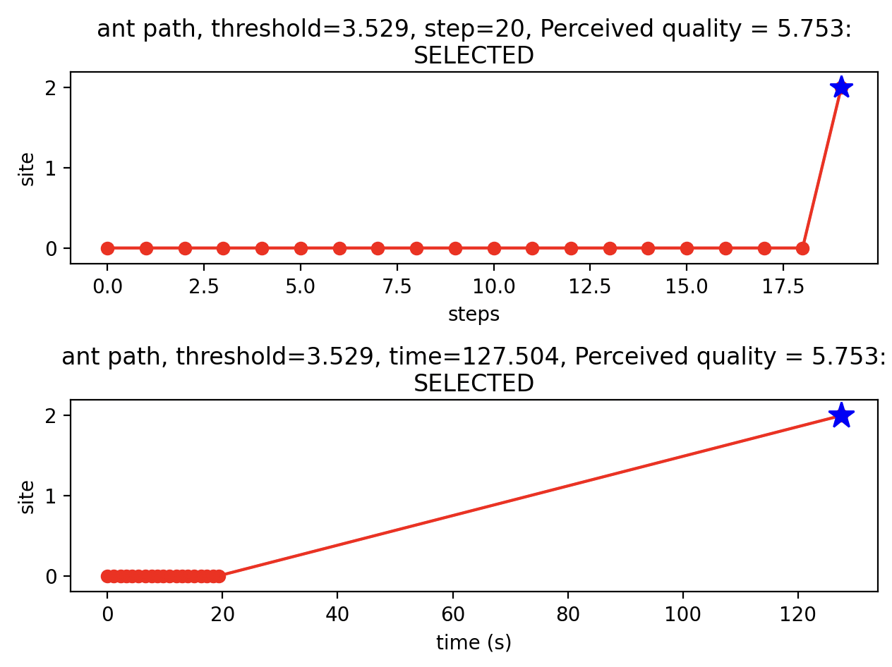

# Lab 3, 4 & Assignment Prep

Focus on lab house hunting derived from Robinsons Work:
- [A Simple Threshold Rule Is Sufficient to Explain Sophisticated Collective Decision-Making (Robinson et al. 2011)](https://canvas.sussex.ac.uk/courses/34991/files/5740841?wrap=1)
- [Paper's supplementary info](https://canvas.sussex.ac.uk/courses/34991/files/5740842?wrap=1)
- [How collective comparisons emerge without individual comparisons of the options (Robinson et al. 2014](https://canvas.sussex.ac.uk/courses/34991/files/5740820?wrap=1)

Canvas Resources:
- [Lab 3](https://canvas.sussex.ac.uk/courses/34991/pages/lab-3-monte-carlo-simulation-of-collective-behaviour)
- [Lab 4](https://canvas.sussex.ac.uk/courses/34991/pages/lab-4-guided-tasks)
- [Pdf](https://github.com/LukeBirkett/study-planner/blob/main/826G5_Intelligence_in_Animals_and_Machines/weeks/week_6/lab/IAM_lab_3.pdf)
- [Code](https://github.com/LukeBirkett/study-planner/tree/main/826G5_Intelligence_in_Animals_and_Machines/weeks/labs/IAM_Sussex_labs/lab_3_robinson)

# Paper Breakdown

Some sort of notes, breakdown or essays about the original paper

NotebookLM

# Lab 3: Monte Carlo simulation of collective behaviour

Lab 3 goes thourgh the code which will be the same code for the assessment. The tasks explored may be used for assignment topics.

#### Resources to Work Through
- Lab Page: Intro, Setup, Model, Tasks
- Lab PDF: Code details TODO: LINK
- Lab Additonal: More code details TODO: LINK

## Introduction

The purpose of this lab is to get an introduction into Biological Modelling. We can explore whether an experiements outcomes can be explained using the threshold rule as introduced by Robinson et al. (2011). Another purpose is to gain a technical understanding on how to use Monte-Carlo modelling. We will begin testing models and explore how results varying with respect to changes in different parameters, i.e. parameter sensitivity. This style of modelling can be used in our assignment so extending an investigation from the lab may form the basis of project.

Overall, we want to investigate how a model is implementing. If it meets out expecations and is plausible. We may choose to remove elements or add more capabilities. The idea is probe and stress test the assumptions and investigate results to seem odd and to not follow intuition. The correct methodology to be able to explain why a certain piece of information occurs after a parameter change occurs. The code provides us a tool to look at ant behaviour. It is our job to explain the aggregate behaviours and how many parameter changes relate to such. 

### Origins of the Code

Robinson et al. included MATLAB code for simulating their module in the supplementary information for their paper. The lecturer updated their code for use on this module, making two important additions:

- Added a limit to the number of steps the simulation will run for. This precludes the possibility of the simulation loop continuing to run indefinitely in the case where an ant does not select a nest site.
- For students' convenience, he added code to save simulation data to an Excel file, to make analysis easier.
- Adapted from MATLAB to Python

## Setting Up

- Execute the file by running `ExampleUsingRobinsonCode.py`
- `enter` to iterate through steps within a simualtion
- `1` to complete an ants route
- `0` to complete all ants and skip to the summary graphic

There will be 2 graphical outputs:

### A Single Ants Route

The programme iteratively plays through an ants journey. You can press `enter` to follow it through or `1` to complete the whole route at once. For each single ants run, it is allocated a `threshold` value which remains fixed for the duration of the run. The number of `steps` is recorded for each iteration and well as the cumuliative `time`. 

The chance of leaving the current nest and arriving at another is pre-determined given the `probs` matrix. Additionally, the time it takes to get between the given nests is also pre-determined in the `time_means`.

```
14 # these parameters are for the first experiment
15 #
16 # probabilities of visiting each site from each other
17 probs = np.array([[0.91, 0.15, 0.03], [0.06, 0.8, 0.06], [0.03, 0.05, 0.91]])
```

```
 19 # mean time to get between each nest
 20 time_means = np.array([[1, 36, 143], [36, 1, 116], [143, 116, 1]])
 21 # standard deviation of time to get between each nest
 22 time_stddevs = time_means / 5
```

When the ant does arrive at a new nest, a `Perceived quality` is computed and recorded. It does this by drawing from a distribution (i think this is set as normal). Each nest it pre-assigned a mean quality in `quals` and has a standard deviation assigned to it, which in the default run is `1` for all nests but this can be changed. 

Given the default structure of `probs` an ant generally stays at a nest for several steps. At each step it draws from the distribution meaning it ranks the nest slightly different each time. Even if several assessments have already been under the `threshold`, one sample may be over and the nest will be `SELECTED`

```
 24 # mean quality of each nest. Note home is -infinity so it never gets picked
 25 quals = np.array([-np.inf, 4, 6])
 26 
 27 # standard deviation of quality: essentially this controls
 28 # how variable the ants assessment of each nest is. This is currently set
 29 # as in the 1st experiment where the variability is the same for each nest
 30 qual_stddev = np.array([1, 1, 1])
 31 # However, if you want to change is so nests perceived w different accuracy
 32 # you could do eg qual_stddev = [1, 1, 4]
```

When an ant is not at `site 1` or `site 2` the ant will be at `site 0`, I am not yet clear if this means that the ant has returned to the original site or if it means that the ant is just travelling somewhere in the land. Either way, these `site_0` occurances do not record a quality and just rank as `-INF`

If the `quality` does not exceed the `threshold` then the graphic and programme will record `NOT SELECTED` and/if it does exceed then it will record `SELECTED`

<p align="center">
  
</p>

### Summary Graphic 

TODO: image output

Aggregate steps for all ants 

1. num ants x chosen site
2. num ants x time till dec
3. mean time x site
4. mean num visits x site

### Excel Dump

TODO: example output of excel

This has no quality related data, just raw paths, sites and times

1 row for each ant

ant number # 

threshold (varies per ant)

final site

selected (all 1's?) deicison made?

end time

time site 0 discovered (all -1 = start point?)

time site 1 discovered

time site 2 discovered

visits to site 0

visits to site 1

visits to site 2

an array of the path taken (shows that if not at 1 or 2 then the site = 0, would imply site 0 is interpretted by the system as no site, i.e. travelling, just somewhere)

## The Model 

### Searching Nests

Robinson et al model how anys find a new nest after the old one is damaged

The individual ant do not interact in the system. They are simulated individually. 

Ants assess the sites they arrive at using an acceptance threshold

The old nest (0) cannot be chosen

### The Model Parameters

#### Acceptance Threshold Distribution

Normally distributed, `mean = 5`, `standard_deviation = 1`

The Threshold is centered around the average of nest qualitites, i.e. s1=4, s2=6, threshold=5

NOTE: is this a fair **assumption**? implies thresold is evolved based on the data of enviroment as any given time, and therefore adaptive. This opposied to a hardcoded, intrinistic meansure of quality. i.e. birds are hardcoded to make nests a certain way, would ants also be hardcoded to like X?

Every ant is allocated its own threshold 

#### Nest Quality

old: -inf, site_1 = 1, site_2 = 6

#### Assessment Error

Normal distribution, `mean=0`, `sd=1`

Every any is assigned its down assessment error

### Setting Parameters in the Code

- `line 25 quals` = nest values
- `line 30 qual_stddev` = standard deviation of nest perception
- `line 38 threshold_mean` = ants assessment threshold
- `line 39 threshold_stddev` = ant assessment threshold standard deviation

### Moving Around

Within the system, an evironment is set up that resembles a recentagle with dimensions of 18cm by 180cm

Within this spaces, subspaces are allocated with respresent nests

A matrix is setup that maps the probabilites of travelling between nests

[not sure how this is derived, perhaps through its own MCP?]

The columns represent starting points

Each column will sum to 1 meaning each row is an option given a starting point

The highest probability is the current nest, no journey

The experiement is setup so nests further away are less likely to be visited

This is an **assumption** and may not be true IRL. For example, there may be obstracles blocking the nearest nest

The probabilities of the matrix are fixed

But there is amean travel time matrix. These are variable sbecause there is a given SD to sample from the mean

In the code the 2 matrices are hardcoded probabilites


