# Advanced Natural Language Proccessing Notes (Spring 26)
This is the main file for the Advanced Natural Language Proccessing module taken in Spring 26. It will act as the location for note taking accross all mediums, i.e. lectures, videos, labs and additional readings, as well as a directory for file locations. It will be recorded chronologically with a section for each week. 

Advanced Natural Language Processing focuses on the application of data-driven and machine learning methods which have transformed the field of Natural Language Processing over the past couple of decades.  It does build on foundations provided by the level 7 Applied Natural Language Processing module. Students will develop their knowledge and understanding of key topics including word vector space models of semantics, language modelling, contextualised word embeddings, large language models, generative language models and their applications. 

Seminars will provide in-depth discussion of research papers related to the key topics and also general issues that arise when developing natural language processing tools, including: evaluation and reliability, data smoothing techniques; domain adaptation; supervised vs unsupervised learning; and transfer learning. 

Labs will provide the opportunity for students to improve their python programming skills, experiment with some off-the-shelf technology and develop research skills.

#### Learning Outcomes
* Demonstrate a systematic knowledge and understanding of key challenges in the field of natural language processing (NLP) and critical awareness of current approaches to tackling these challenges.
* Critically analyse state-of-the-art NLP technologies and critically assess their application to novel problems involving large quantities of realistic data.
* Critically evaluate the effectiveness of an approach through the design and application of suitable experiments.
* Synthesise and critically assess state-of-the-art technologies for a given NLP problem based on primary scientific literature.

The textbook is [Speech and Language Processing](https://web.stanford.edu/~jurafsky/slp3/) by Dan Jurafsky and James H. Martin

# Table of Contents
1. [Week 1 - Lexical and Distributional Semantics Revisited](#week-1---lexical-and-distributional-semantics-revisited)
2. [Week 2 - Language Modelling w/ N-grams](#week-2---language-modelling-with-n-grams)
3. [Week 3 - Neural Networks and Neural Language Modelling](#week-3---neural-language-models)
4. [Week 4 - Word Embeddings](#week-4---lexical-and-distributional-semantics-2)
5. [Week 5 - Applications in NLP](#week-5---applications-in-nlp)
6. [Week 6 - Machine Translation](#week-6---machine-translation)
7. [Week 7 - Pre-Trained Large Language Models](#week-7---pre-trained-large-language-models)
8. [Week 8 - Transfer Learning with Pre-Train Large Language](#week-8---transfer-learning-with-pretrained-large-language-models)
9. [Week 9 - ]()
10. [Week 10 - ]()
11. [Week 11 - ]()

--- 

# [Week 1 - Lexical and Distributional Semantics Revisited](https://canvas.sussex.ac.uk/courses/35245/pages/week-1-introduction-2?module_item_id=1546317)

This week is for reviewing the core concepts from lexical semantics and distributional semantics. It will essentially be a revision session from the Applied Natural Language Processing module from last year. The topics covered will be:
* Word sense ambiguity
* WordNet
* Lexical semantic relations
* Semantic similarity
* Measuring Information Content
* Vector space representations based on context
* (Positive) Pointwise Mutual Information (PPMI)
* Cosine similarity
* Challenges in distributional semantics

#### Week 1: Contents

1. [Lecture](#week-1---lecture)
2. [Seminar](#week-1---seminar)
3. [Paper](#week-1---paper)
3. [Additional Readings](#week-1---additional-readings)

# Week 1 - Lecture 

| [Slides](/Users/lukebirkett/Repos/study-planner/968G5_Advanced_Natural_Language_Processing/files/week_1/week_1_lecture_lexical_distributional_semantics.pdf) | [Lecture Video Part 1](https://sussex.cloud.panopto.eu/Panopto/Pages/Viewer.aspx?id=c7d2751c-0820-4e87-8b8d-acb400db8436&start=1.23467) | [Lecture Video Part 2](https://sussex.cloud.panopto.eu/Panopto/Pages/Viewer.aspx?id=15631590-2d19-4dcd-98bf-acb400db95f6&start=0) |

#### Week 1: Contents
1. [Part 1: Lexical Semantics](#part-1-lexical-semantics)
---
* [Word Senses and Ambiguity](#word-senses-and-ambiguity)
---
* [Lexical Semantic Relationships](#lexical-semantic-relationships)
    * [Synonymy](#synonymy)
    * [Antonymy](#antonymy)
    * [Hyponymy & Hypernymy](#hyponymy--hypernymy)
    * [Meronymy & Holonymy](#meronymy--holonymy)
---
* [WordNet Structure](#wordnet-structure)
    * [Synsets](#synsets)
    * [Sense Specificity](#sense-specificity)
    * [Hierarchical Organization](#hierarchical-organization)
---
* [Semantic Similarity Measures](#semantic-similarity-measures)
    * [Path Length Similarity](#path-length-similarity)
    * [Information Content (IC)](#information-content-ic)
    * [Probability of "Carnivore:](#probability-of-carnivore)
    * [Lowest Common Subsumer (LCS)](#lowest-common-subsumer-lcs)
    * [Resnik Similarity](#resnik-similarity)
    * [Lin Similarity](#lin-similarity)
---
* [Evaluation of Lexical Semantics](#evaluation-of-lexical-semantics)
---
2. [Part 2: Distributional Semantics](#part-2-distributional-semantics)
* [The Distributional Hypothesis](#the-distributional-hypothesis)
* [Facets of Meaning & Context Windows](#facets-of-meaning--context-windows)
* [Vector Space Models & Cosine Similarity](#vector-space-models--cosine-similarity)
* [Weighting Features (PMI and PPMI)](#weighting-features-pmi-and-ppmi)
* [Challenges in Distributional Semantics](#challenges-in-distributional-semantics)

---

# Part 1: Lexical Semantics
Lexical Semantics is the subfield of linguistics and NLP focused on the study of the meaning of individual words, or "lexical units". Rather than looking at how words function in a sentence (syntax), it explores how words represent distinct concepts, how those meanings can be ambiguous across different senses, and how words relate to one another through structured networks. It provides the framework for understanding relationships like synonymy (sameness) and hyponymy (class inclusion), which are essential for mapping the human vocabulary into computational models like WordNet.

#### Part 1: Contents:
* [Word Senses and Ambiguity](#word-senses-and-ambiguity)
---
* [Lexical Semantic Relationships](#lexical-semantic-relationships)
    * [Synonymy](#synonymy)
    * [Antonymy](#antonymy)
    * [Hyponymy & Hypernymy](#hyponymy--hypernymy)
    * [Meronymy & Holonymy](#meronymy--holonymy)
---
* [WordNet Structure](#wordnet-structure)
    * [Synsets](#synsets)
    * [Sense Specificity](#sense-specificity)
    * [Hierarchical Organization](#hierarchical-organization)
---
* [Semantic Similarity Measures](#semantic-similarity-measures)
    * [Path Length Similarity](#path-length-similarity)
    * [Information Content (IC)](#information-content-ic)
    * [Probability of "Carnivore:](#probability-of-carnivore)
    * [Lowest Common Subsumer (LCS)](#lowest-common-subsumer-lcs)
    * [Resnik Similarity](#resnik-similarity)
    * [Lin Similarity](#lin-similarity)
---
* [Evaluation of Lexical Semantics](#evaluation-of-lexical-semantics)

---

# Word Senses and Ambiguity
Lexical semantics begins with the realization that the "word" is not the smallest unit of meaning; the sense is.

| Term | Definition | 
| :--- | :--- |
| Ambiguity | Most common words possess multiple senses, which dictionaries attempt to enumerate and define . |
| Homonymy | This refers to broad distinctions between meanings that share the same spelling/sound but have unrelated origins (e.g., plant as a living organism vs. plant as a factory) |
| Polysemy | This refers to fine-grained, related distinctions within a single word (e.g., book as a physical object vs. book as a set of accounts) |
| Dictionary Variation | Different resources (WordNet vs. Oxford) often disagree on the exact number of senses for a word due to the difficulty of drawing these boundaries |

---

# Lexical Semantic Relationships
Meaning is often defined by how a word relates to others in a linguistic network.

---

### Synonymy: 
Words that mean the same thing and can be substituted in context without changing the meaning . True synonyms are rare; usually, they differ in connotation or register (e.g., car vs. automobile)

---

### Antonymy:
Words with opposite meanings . Paradoxically, antonyms are semantically very similar as they usually share all features except for one specific dimension, like temperature (hot/cold) or direction (rise/fall).

---

### Hyponymy & Hypernymy:
These capture ISA-relationships (class inclusion).
* A Hyponym is a subclass (e.g., poodle is a hyponym of dog)
* A Hypernym is a superclass (e.g., animal is a hypernym of dog).

---

### Meronymy & Holonymy:
These represent Part-Whole relationships (e.g., wheel is a meronym of car).

---

# WordNet Structure
WordNet is an electronic lexical database that functions more as a network than a standard dictionary.

### Synsets:
The core unit of WordNet. It is a set of synonymous word senses (e.g., {plant, flora, plant life}).

---

### Sense Specificity:
Each synset is associated with one distinct definition; polysemous words appear in multiple synsets.

---

### Hierarchical Organization:
Synsets are primarily connected via hyponymy, creating a tree-like structure where general concepts are at the top and specific instances are at the leaves .

---

# Semantic Similarity Measures

### Path Length Similarity
The simplest way to quantify similarity is to count the number of edges between two synsets in the WordNet hierarchy. As the path length increases, the similarity score decreases. A path length of 1 (synonyms) results in a similarity of 1.0.

$$sim_{path}(c_1, c_2) = \frac{1}{\text{path\_length}(c_1, c_2)}$$

---

### Information Content (IC)
Information Content is based on the probability of a concept appearing in a corpus. 

**Concept Probability ($P(c)$):** The frequency of a concept $c$ is the sum of the frequencies of that concept and all of its descendants in the hierarchy. Where $N$ is the total number of concepts in the corpus (Total Corpus Size ($N$)).

$$P(c) = \frac{\text{freq}(c)}{N}$$

**IC Formula:** Frequent, general concepts (like vertebrate) have high probability and low IC; rare, specific concepts (like poodle) have low probability and high IC.
$$IC(c) = -\log P(c)$$

---

#### Probability of "Carnivore:
To find the frequency of "Carnivore," we must sum its own occurrences plus everything below it in the tree (dogs, poodles, cats, etc.)
* $\text{freq}(carnivore)$: $10 (\text{poodles}) + 5 (\text{terriers}) + 20 (\text{dogs}) + 15 (\text{cats}) = \mathbf{50}$.
* $P(carnivore)$: $\frac{50}{100} = \mathbf{0.50}$.
* Result: High probability $\rightarrow$ Low Information Content ($IC$).

> Note, $N$ is the Total Corpus Size

---

### Lowest Common Subsumer (LCS)
Before calculating advanced similarity, we must identify the LCS, which is the most specific ancestor that two concepts share.
* Example: The LCS of tabby and tiger is feline.
* Example: The LCS of poodle and tiger is carnivore.

---

### Resnik Similarity
Proposed by Resnik (1995), this measure assumes that the similarity of two concepts is determined by the information they share, represented by their LCS directly. If the most specific thing two words share is a very general concept, they aren't very similar. If their shared ancestor is very specific (high IC), they are highly similar.

$$sim_{resnik}(c_1, c_2) = IC(LCS(c_1, c_2))$$

---

### Lin Similarity
Proposed by Lin (1998), this measure refines Resnik's work by normalizing the shared information by the total information contained in the two individual concepts. This provides a ratio of shared information content to total information content, resulting in a score between 0 and 1.

$$sim_{lin}(c_1, c_2) = \frac{2 \times IC(LCS(c_1, c_2))}{IC(c_1) + IC(c_2)}$$

--- 

# Evaluation of Lexical Semantics
To determine if a computational measure is "correct," it must be compared against human benchmarks.

**Gold Standards:** Researchers use datasets of human synonymy judgments, such as **WordSim-353** or the **MEN** dataset

**Correlation:** Success is measured using **Pearson’s** or **Spearman’s** rank correlation to see how closely the AI's similarity scores match the human scores

---

# Part 2: Distributional Semantics
Distributional Semantics is a computational approach to meaning based on the Distributional Hypothesis, which states that words occurring in similar contexts tend to have similar meanings. Unlike Lexical Semantics, which relies on human-curated dictionaries, this method "bootstraps" meaning directly from large bodies of text (corpora). It is famously summarized by linguist J.R. Firth’s 1957 dictum: "You shall know a word by the company it keeps"

In practice, this means representing a word as a mathematical vector based on the counts of other words (features) that appear near it within a defined context window. By comparing these vectors—typically using cosine similarity—computers can automatically discover that words like beer and wine are related because they share "facets of meaning," such as being the object of the verb drink or appearing near the word bottle.

#### Part 2: Contents 
* [The Distributional Hypothesis](#the-distributional-hypothesis)
* [Facets of Meaning & Context Windows](#facets-of-meaning--context-windows)
* [Vector Space Models & Cosine Similarity](#vector-space-models--cosine-similarity)
* [Weighting Features (PMI and PPMI)](#weighting-features-pmi-and-ppmi)
* [Challenges in Distributional Semantics](#challenges-in-distributional-semantics)

---

# The Distributional Hypothesis
The foundational philosophy of distributional semantics is that a word’s meaning is defined primarily by its environment. This is famously captured by Firth’s Dictum (1957), which states, "You shall know a word by the company it keeps". The core hypothesis posits that words occurring in similar contexts tend to possess similar meanings. This allows for bootstrapping, a process where the meaning of an unknown word—such as tezguino—can be inferred by observing its co-occurrence with known words like bottle, corn, and drunk, leading to the conclusion that it is likely an alcoholic beverage . Practical applications of this theory include the automatic construction of thesauruses and overcoming data sparseness in classifiers. For instance, if a model has been trained on the word beer but encounters the unseen word tezguino, it can utilize distributional similarity to treat them as semantically equivalent.

---

# Facets of Meaning & Context Windows
To represent meaning computationally, we must extract specific "features" from the text.

**Facets of Meaning:** Words share different dimensions of meaning based on their roles. For example, banana and credit card both share the facet of "being eaten" if they appear as objects of the verb eat.

**Context Windows:** A common way to capture these features is by looking at a fixed number of words ($\pm m$) around a target word.
* **Small Windows ($\pm 1$):** Capture local, often syntactic or functional relationships.
* **Large Windows:** Capture more general topical or thematic relationships.

**Dependency Features:** A more complex method involves using grammatical relationships (e.g., "is subject of...") rather than just proximity, though this is harder to parse.

---

# Vector Space Models & Cosine Similarity
Once we count co-occurrences, we represent each word as a high-dimensional vector (or distributional representation).

**Cosine Similarity:** This is the standard measure for how similar two word vectors are. Instead of looking at the distance between points, we look at the angle ($\theta$) between the vectors. A small angle (high cosine) means high similarity. A 90° angle (zero cosine) means no similarity.

$$sim(w_1, w_2) = \cos(\theta) = \frac{\vec{a} \cdot \vec{b}}{\|\vec{a}\|*\|\vec{b}\|}$$

---

# Weighting Features (PMI and PPMI)
Raw counts are often misleading because common words (like the or is) appear frequently with everything but carry little information

**Pointwise Mutual Information (PMI):** Measures whether a word and a feature co-occur more often than would be expected by chance.

$$PMI(w, f) = \log \frac{P(w, f)}{P(w)P(f)}$$

**Positive PMI (PPMI):** Since $PMI$ results in $-\infty$ for words that never co-occur, $PPMI$ replaces all negative values with 0. This emphasizes informative features and de-emphasizes "noise" from high-frequency function words.

--- 

# Challenges in Distributional Semantics
Despite its power, this approach has three major hurdles:

**Word Ambiguity:** Vectors represent the word (the string), not the sense. A vector for bow is a "mush" of its ribbon, weapon, and ship meanings.

**Semantic Relationships:** Distributional models find "related" words, but not necessarily synonyms . Antonyms often appear in identical contexts (e.g., hot and cold), making them appear highly similar.

**Sparsity (Zipf's Law):** Most words occur very rarely (Hapax Legomena). This results in massive vectors filled with zeros, making them difficult to compare.

---

# Week 1 - Seminar 
This seminar session was a mix of mild lecturing before breaking out into small groups to discuss questions. After which as a whole class we would put forward answers. In this section I will put down the questions and some notes for the answers. 

#### Week 1: Contents
* [Document Classification using Naive Bayes](#document-classification-using-naive-bayes)
* [Towards More Intelligent NLP](#towards-more-intelligent-nlp)
---
* **[Week 1: 1.1 Questions]()**
    1. [Give an example of lexical ambiguity](#1-give-an-example-of-lexical-ambiguity)
    2. [Give an example of lexical variation](#2-give-an-example-of-lexical-variation)
    3. [What is a WordNet synset?](#3-what-is-a-wordnet-synset)
        * [What does the number of synsets that a word form occurs in tell us?](#what-does-the-number-of-synsets-that-a-word-form-occurs-in-tell-us)
        * [What does the size of a synset tell us?](#what-does-the-size-of-a-synset-tell-us)
        * [How are synsets connected?](#how-are-synsets-connected)
    4. [Describe 2 ways WordNet can be used to calculate the  similarity of 2 concepts?  Which is the best way and how do you know?](#4-describe-2-ways-wordnet-can-be-used-to-calculate-the--similarity-of-2-concepts--which-is-the-best-way-and-how-do-you-know)
---
* **[Week 1: 1.2 Questions]()**
    1. [What is the distributional hypothesis?](#1-what-is-the-distributional-hypothesis)
    2. [Explain how distributional semantics might help us in another application e.g. document classification](#2-explain-how-distributional-semantics-might-help-us-in-another-application-eg-document-classification)
    3. [In traditional distributional semantics (aka vector  semantics), how is the association between 2 words often  measured?](#3-in-traditional-distributional-semantics-aka-vector--semantics-how-is-the-association-between-2-words-often--measured)
    4. [In traditional distributional semantics, how is the similarity between 2 words often measured?](#4-in-traditional-distributional-semantics-how-is-the-similarity-between-2-words-often-measured)

---

# Document Classification using Naive Bayes
Here, documents are respected as a **bag-of-words** where the features are the observed words. There is no notion of order meaning the structure of sentances is lost. NB selected a class/label based on the cumulative probabilites of the feature vector that respresents the document. 

$$y = \text{argmax}_y P(y) \prod_{i=1}^{n} P(x_i \mid y)$$

It is important to remember Naive Bayes is a simplification of Bayes Rule. To simplifiy the model we assume that features, the words, are all indepent, i.e. the use of one word does not increase or decrease the use of a another, this is how we end up with our bag-of-words structure. Clearly this is not true but it makes the formula mathematically possible, allowing us to compute at least something. 

---

# Towards More Intelligent NLP
This slide highlights that a Naive Bayes approach to NLP is a little too basic. It treats word tokens as atomic building blocks but obscures too much of the characteristics required for human understanding of language: the meaning. Meaning is generally inferred through words relationships with other words and/or their similarity to other words. This notion is the basis for Lexical Semnatics which is the focus of this weeks content. 

---

# Week 1: 1.1 Questions

### 1. Give an example of lexical ambiguity
These are words that are spelt exactly the same but have different senses. This has two main sources: 
* **Homonymy (Broad Distinctions):** When the senses are entirely unrelated, often just by historical coincidence. Plant as a living organism vs. Plant as an industrial factory.
* **Polysemy (Fine-grained Distinctions):** When the senses are distinct but clearly related to a single core concept. Book as a printed work vs. Book as a set of accounts.

---

###  2. Give an example of lexical variation: 
These are different words that mean the same thing/sense

---

### 3. What is a WordNet synset? 
A **WordNet** synset (short for "synonym set") is a group of words that mean the same thing in a specific context.

#### What does the number of synsets that a word form occurs in tell us?: 
This is a measure of its polysemy, i.e. its multiple meanings. The higher the count, the more "ambiguous" or highly polysemous the word is. "counter" occurs in 9 noun synsets in WordNet, making it significantly more polysemous than "chicken", which occurs in 4.

#### What does the size of a synset tell us? 
The "size" of a synset refers to the number of lemmas (individual word forms) that are grouped together within it. While the number of synsets for a word tells you about ambiguity, the size of a single synset tells you about lexical density and synonymy. If a sense has many different words for it then this may be a culturally important word that is used often, or something that requires different words to represent an emotional context. Additionally, a large sysnet might imply that the word is high-level and broad. A sysnset with only 1 word is monosemous, these words are very specific and can only ever mean 1 thing. 

#### How are synsets connected?
Synsets are linked in a semantic network of Hyponymy and Hypernymy. This is hiearchical structure which denotes an "Is-A" relationship. 
* **Hypernym (Superordinate):** A more general term. (Furniture is a hypernym of Chair). 
* **Hyponym (Subordinate):** A more specific term. (Oak is a hyponym of Tree)

---

### 4. Describe 2 ways WordNet can be used to calculate the  similarity of 2 concepts?  Which is the best way and how do you know? 

The two main ways of using WordNet are **PathLength** and **Information Content**. 

**PathLength** is a distance based metric with traverse edges and counts the shortest route from one term to another. It introduces the concept of a **Lowest Common Subsumer (LCS)** which is the lowest (first) mutual Hypernymy that two terms share. Shorter paths are assumed to be more similar words. 

The other measure, **Information Content** is considered to be node based. It assumes that the similarity of two concepts depends on how much "information" they share. It requires the addition of an external corpus to populate the statistics. The "Information Content" of a concept is based on its frequency in a large body of text. Rare, specific words (like Pomeranian) have **high IC**, while common, general words (like Entity) have **low IC**. There are many different IC metrics each with their own pros and cons. 

The Information Content (IC) measures (specifically **Lin** or **Jiang-Conrath**) are generally considered superior to simple **Path-Based** measures. However, this something with a trade-off which is generally linked to data robustness and specifically **data sparisty**. Language is naturally sparse and missing values often lead to formulas failing. 

---

# Week 1: 1.2 Questions

### 1. What is the distributional hypothesis?** 
The Distributional Hypothesis is a foundational concept in linguistics and Natural Language Processing (NLP) that suggests the meaning of a word is determined by the words that frequently appear around it.

---

### 2. Explain how distributional semantics might help us in another application e.g. document classification
Distribution semantics allows us to transfer learnings from one application to the next and fill in missing information based on contextual clues. We may not know the exact meaning on a rare type of drink. However, we may see that is used similar to beer, also an alchoholic drink. By applying distribution demantics to a very large corpus we can learn that the rare drink is similar to beer even if the specific training sample wasn't able to tell us that. 

---

### 3. In traditional distributional semantics (aka vector  semantics), how is the association between 2 words often  measured?
Note that there is a different between association and similartity. 

**Similarity** refers to words that share the same features or occupy the same spot in a hierarchy. These words are often "substitutable" — you could swap one for the other in a sentence and the basic meaning would remain intact. 

**Association** (also called Relatedness) refers to words that "go together" in the real world. They don't look or act alike, but they frequently appear in the same context or sequence. They are not substitutable.

To measure Association we need to look at the words around a word. Frequency and/or simple conditional probability do not capture the intuition that some features are more informative than others. "the" and "is" appear relatively frequently with all of the word so their contribution to similarity should be smaller. They do not provide any specificity. PMI measures the amount of information gained by seeing a word and a feature together. A feature which co-occurs with a target word more than we would expect (if words and features occurred independently) has more weight in the similarity calculation.

---

### 4. In traditional distributional semantics, how is the similarity between 2 words often measured?
The main method is to compare two vectors using cosine similarity. he more similar two words are, the  smaller the angle θ between their  vectors will be.

---

# Week 1 - Paper 
> Ted Pedersen. 2010. Information content measures of semantic similarity perform better without sense-tagged text. In Proceedings of NAACL

Figure 1 shows part of the WordNet noun hypernym hierarchy. This is an ISA hierarchy where each concept in the tree IS A type of its parent. The parent concept is referred to as a hypernym (of the child) and the child concept is referred to as a hyponym (of the parent). Pedersen (2010) presents an empirical comparison of similarity measures for pairs of concepts in WordNet based on Information Content.

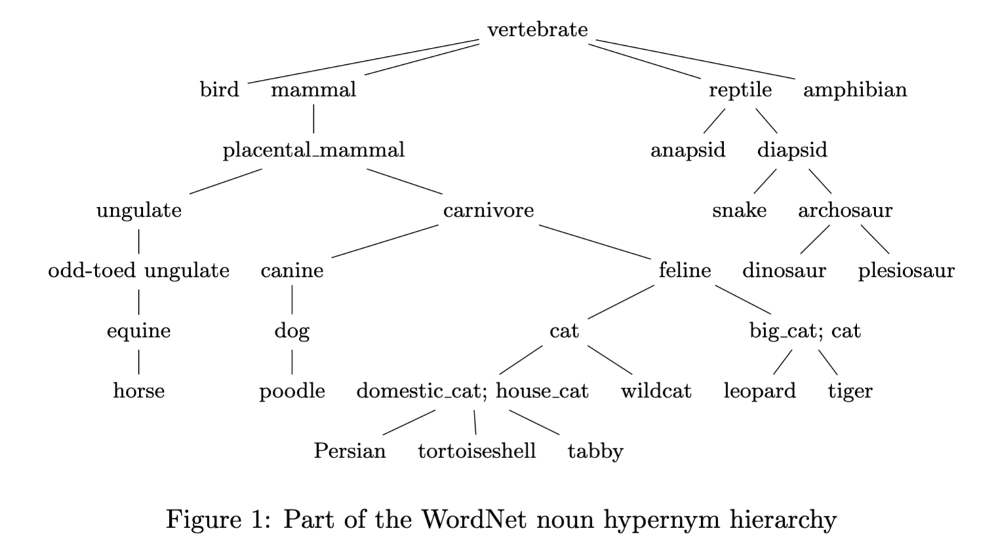

In the 2010 paper "Information Content Measures of Semantic Similarity Perform Better Without Sense-Tagged Text," Ted Pedersen explores a critical challenge in WordNet-based similarity: how to accurately calculate the Information Content (IC) of a concept. Traditionally, computing the probability of a concept $P(c)$ required a sense-tagged corpus (like SemCor), where human annotators manually mapped each word to its specific WordNet sense. This allowed researchers to precisely increment the frequency of a specific synset whenever it appeared. However, Pedersen hypothesized that the extreme scarcity and small size of these manually labeled datasets might actually hinder the accuracy of similarity measures like those proposed by Resnik, Lin, and Jiang-Conrath.

To test this, Pedersen compared similarity scores derived from a small, sense-tagged corpus against those derived from a massive, untagged corpus (the British National Corpus). Since the untagged text lacks labels, Pedersen used a simple heuristic: every time a word appeared, he incremented the frequency counts for all of its potential senses in WordNet. This "all-senses" approach essentially treats the data as noisy but comprehensive.

The experimental results provided a surprising and influential conclusion: similarity measures derived from the large, untagged corpus consistently showed a higher correlation with human similarity judgments than those derived from the high-quality, sense-tagged text. This suggested that in the realm of distributional semantics, data quantity can effectively compensate for a lack of precision. The sheer volume of raw text allowed the model to build more robust probability distributions that smoothed over the noise of individual ambiguous words, proving that expensive human annotation is not always a prerequisite for high-performing semantic models.

#### Paper 1: Questions
1. [With reference to Figure 1, what concept is the hypernym of ungulate? How many hyponyms does carnivore have? Give an example. Why do you think the word cat appears twice in the hierarchy?](#1-with-reference-to-figure-1-what-concept-is-the-hypernym-of-ungulate-how-many-hyponyms-does-carnivore-have-give-an-example-why-do-you-think-the-word-cat-appears-twice-in-the-hierarchy)
---
2. [What do you understand by path length? Give some examples of pairs of words which have a path length of 2. What limitations can you think of in using path length as a measure of semantic similarity?](#2-what-do-you-understand-by-path-length-give-some-examples-of-pairs-of-words-which-have-a-path-length-of-2-what-limitations-can-you-think-of-in-using-path-length-as-a-measure-of-semantic-similarity)
---
3. [How is information content for a WordNet concept computed from a sense-tagged corpus? How can information content for a WordNet concept be estimated from untagged data?](#3-how-is-information-content-for-a-wordnet-concept-computed-from-a-sense-tagged-corpus-how-can-information-content-for-a-wordnet-concept-be-estimated-from-untagged-data)
---
4. [What is the lowest common subsumer (LCS) of dog and big cat? What is the LCS of mammal and reptile? What is the LCS of poodle and tabby? Which of these three pairs would have the greatest similarity according to the res measure? What about if you used the lin measure? Or a measure based on path length?](#4-what-is-the-lowest-common-subsumer-lcs-of-dog-and-big-cat-what-is-the-lcs-of-mammal-and-reptile-what-is-the-lcs-of-poodle-and-tabby-which-of-these-three-pairs-would-have-the-greatest-similarity-according-to-the-res-measure-what-about-if-you-used-the-lin-measure-or-a-measure-based-on-path-length)
---
5. [What is the main experimental conclusion of the paper? Are you convinced?](#5-what-is-the-main-experimental-conclusion-of-the-paper-are-you-convinced)

---

### 1. With reference to Figure 1, what concept is the hypernym of ungulate? How many hyponyms does carnivore have? Give an example. Why do you think the word cat appears twice in the hierarchy?
Hypernym is the broader term, where as,  hyponyms is the more specific sub-term. Therefore, the hypernym of ungulate is placental_mammal.

Carnivore has 2 direct hyponyms: Canine and Feline. However, is has many more **Transitive Hyponyms** which cover all descendants. 

Cat appears twice because it is an ambious term that words as the hypernym for two different senses. 

---

### 2. What do you understand by path length? Give some examples of pairs of words which have a path length of 2. What limitations can you think of in using path length as a measure of semantic similarity?
Path length is the most intuitive measure of semantic similarity within a taxonomic hierarchy like WordNet. It is calculated by counting the number of "edges" (the links connecting nodes) that must be traversed to get from one concept to another. In this model, the "shorter" the path, the more semantically similar the words are.

While simple, path length has several significant flaws that information-based measures (like Resnik or Lin) try to solve:
* **The "Uniform Distance" Fallacy:** Path length assumes that all edges in the hierarchy represent the same "semantic distance." However, in reality, the distance between Animal and Mammal (a massive jump in biological complexity) is treated the same as the distance between Poodle and Toy Poodle (a very specific distinction).
* **Density Bias:** Some parts of WordNet are much more "densely" populated than others. For example, the "Biota" section has thousands of specific types of plants and animals, while the "Abstract Entity" section is much sparser. Path length doesn't account for how specific or general the nodes are.
* **The Root Problem:** As you move higher up the tree toward the "Root" (e.g., Entity or Object), words become less and less similar, yet they may still be only 2 or 3 steps apart. Path length doesn't capture the intuition that sharing a "specific" parent makes you more similar than sharing a "general" parent.

---

### 3. How is information content for a WordNet concept computed from a sense-tagged corpus? How can information content for a WordNet concept be estimated from untagged data?

Computing Information Content ($IC$) for a WordNet concept relies on determining the probability $P(c)$ of that concept appearing in a corpus, a process that varies significantly depending on whether the data is sense-tagged or untagged. 

In a sense-tagged corpus, such as SemCor, every word is manually labeled by humans with its specific WordNet synset. This allows for high precision, as a count is only incremented for the exact sense intended in the text. Furthermore, because WordNet is a hierarchy, this count is propagated upward; an instance of "poodle" increments the frequency of the poodle synset as well as its hypernyms like dog, mammal, and animal. This ensures that more general concepts naturally have higher probabilities and, consequently, lower Information Content.

Conversely, estimating $IC$ from untagged data requires a heuristic approach because the specific sense of a word is unknown. Pedersen (2010) describes an "all-senses" method where, upon encountering a word like "bank," the frequency count is incremented for every possible sense that word possesses in WordNet. While this introduces a significant amount of noise—counting a financial "bank" as a "river bank," for example—the theory suggests that over a massive, multi-million-word corpus, the correct semantic signals will eventually outweigh the coincidental noise. Because untagged corpora are vastly larger than manually labeled ones, the resulting $P(c)$ estimates are often more robust and provide a more accurate reflection of general language usage than small, sense-tagged datasets.

---

### 4. What is the lowest common subsumer (LCS) of dog and big cat? What is the LCS of mammal and reptile? What is the LCS of poodle and tabby? Which of these three pairs would have the greatest similarity according to the res measure? What about if you used the lin measure? Or a measure based on path length?

---

### 5. What is the main experimental conclusion of the paper? Are you convinced?
The main experimental conclusion of Pedersen (2010) is that Information Content (IC) measures of semantic similarity perform better when the underlying word frequencies are calculated from large, untagged corpora using a simple "all-senses" heuristic, rather than from smaller, manually sense-tagged datasets. By testing these measures against human gold-standard benchmarks (like the Miller-Charles or Rubenstein-Goodenough datasets), Pedersen demonstrated that the statistical power gained from a massive amount of "noisy" raw text outweighs the precision gained from a tiny amount of "perfect" human-labeled data.

#### The Case for "Yes"
**Data Hunger:** Natural language is famously sparse. Even the best sense-tagged corpora (like SemCor) only cover a fraction of the English vocabulary. A model cannot calculate an accurate $IC$ for a word it has only seen once. Using the British National Corpus (BNC) provides millions of data points, which "smooths" the probability distribution.

**The Power of Averaging:** While incrementing all senses of an ambiguous word (like "bank") is technically "wrong" for any single instance, the "wrong" senses (like "river bank" in a financial document) are essentially random noise. Over millions of words, the "true" sense signal remains consistent and rises above that noise.

#### The Case for "Caution":
**Domain Sensitivity:** If you calculate $IC$ from the BNC but then try to measure similarity in a specialized medical or legal context, the "general" frequencies might mislead the model.

**Modern Context:** In 2026, we now have "Contextualized Embeddings" (like BERT) that solve the sense-tagging problem automatically. However, for **taxonomic** similarity (using WordNet), Pedersen’s conclusion remains a fundamental proof that "more data beats better algorithms" (The Silver Lining of Big Data).

---

# Week 1 - Additional Readings

### Vector Semantics
The additional readings for this week are based on Vector Semantics:
* [Chapter 5 of Jurafsky and Martin](files/week_1/week_1_add_read_vector_semantics_chapter_5.pdf), sections 5.1-5 4 
* [Lecture 3 of Jurafsky and Martin](files/week_1/week_1_add_read_vector_semantics_lecture_3.pdf)

---

### References
| Title | Author | Year | Publication |
| :--- | :--- | :--- | :--- |
| WordNet: An Electronic Lexical Database | Christiane Fellbaum | 1998 | Cambridge, MA: MIT Press |
| Automatic retrieval and clustering of similar words | Lin, D | 1998a | In Proceedings of COLING/ACL. |
| An information-theoretic definition of similarity. | Lin, D | 1998b | In ICML 1998, San Francisco, pp 296-304 |
| Linguistic Regularities in Continuous Space Word Representations | Mikolov, Yih and Zweig | 2013 | NAACL-HCT 2013 |
| Information Content Measures of Semantic Similarity Perform Better without Sense Tagged Text | Pedersen, T. | 2010 |  |
| Using information content to evaluate semantic similarity in ataxonomy | Resnik, P | 1995 | In IJCAI-95, pp. 448-424 |
| The Microsoft Research Sentence Completion Challenge | Zweig, G. and Burges, A. | 2011 | Microsoft Technical Report |

---

<br>
<br>
<br>
<br>

# [Week 2 - Language Modelling with n-grams](https://canvas.sussex.ac.uk/courses/36171/pages/week-slash-topic-2-language-modelling-with-n-grams?module_item_id=1602169)

This week we will be looking at n-gram language models.  In particular, we will be looking at:
* why build language models?
* how to evaluate language models?
* perplexity
* generation
* generalisation and smoothing

#### Week 2: Contents

1. [Lecture](#week-2---lecture)
2. [Seminar](#week-2---seminar)
3. [Paper](#week-2-paper)
4. [Additional Readings](#week-2---additional-readings)

---

# Week 2 - Lecture

| [Lecture Slides](files/week_2/week_2_lecture_slides.pdf) |

This week we are looking at **Probabilitic Language Models**. This includes: n-gram modelling and their evaluation methods (perplexity), generation and generalisation. This week marks a shift from the meaning of words (Week 1) to the probability of sequences, providing the foundational logic for how computers "predict" text. 

#### Week 2: Lecture Content

* [Why do we want to be able to assign a prob to a sentence?](#why-do-we-want-to-be-able-to-assign-a-prob-to-a-sentence)
* [Probability language modelling](#probability-language-modelling)
* [Chain Rule for Probabilties ](#chain-rule-for-probabilties)
* [N-gram Language Model](#n-gram-language-model)
* [Lanugage Model Evaluation](#lanugage-model-evaluation)
* [Perplexity](#perplexity)
* [Part 2: Generalisation in n-Gram Models](#part-2-generalisation-in-n-gram-models)
* [Toy Example](#toy-example)
* [Unknown Words (Token)](#unknown-words-token)
* [Absolute Discounting](#absolute-discounting)

---

Week 2 of the module marks the transition from static word meanings to **Probabilistic Language Modeling**, shifting the focus from what a word means to how likely a word is to occur in a specific sequence. By utilizing the **Chain Rule of Probability**, we attempt to calculate the joint probability of entire sentences, which is essential for applications like Machine Translation, Speech Recognition, and Spelling Correction. To overcome the computational impossibility of calculating infinite histories, we apply the **Markov Assumption**, which simplifies the model into **N-grams** — predictive chains that only look at the previous $n-1$ words. This allows us to use **Maximum Likelihood Estimation (MLE)** to "train" a model by simply counting occurrences within a corpus.

However, N-gram models face a major hurdle in **Data Sparsity**, where many perfectly valid word combinations never appear in the training data, resulting in a mathematically "broken" probability of zero. To build robust models that can generalize to unseen text, we move beyond simple counting to **Smoothing** techniques. This includes using **Absolute Discounting** to steal probability mass from frequent events and reallocate it to unobserved ones, and employing the <unk> token to handle **Out-of-Vocabulary (OOV)** words.

Finally, we evaluate these models using **Perplexity**, an intrinsic metric that measures a model's "uncertainty." A lower perplexity indicates a superior model that is less surprised by the test data, serving as the benchmark for how well our statistical patterns have captured the underlying structure of the language.

---

# Why do we want to be able to assign a probabily to a sentence?
Assigning a probability to a sentence allows a model to distinguish "natural" language from random or incorrect sequences. This is essential for resolving ambiguity across several key NLP tasks:

---
| Task | Explanation | 
| :--- | :--- | 
| Machine Translation | Choosing the most fluent output among several semantically correct options (e.g., "high winds" vs. "large winds"). |
| Speech Recognition | Disambiguating similar-sounding phrases by identifying which is more linguistically probable (e.g., `P("I saw a van") > P("eyes awe of an")`). |
| Spelling & Grammar Correction | Predicting the intended word based on the surrounding context to fix errors in usage or orthography. |

---

# Probability Language Modelling
What is a probabilistic language model? It has the goal of computing 1 of 2 things:

---
| Goal | Description | Formula | 
| :--- | :--- | :--- |
| Compute Sequence | Compute the probability of a sentence as represented by a sequences of words | $P(W) = P(W_1,W_2,...,W_n)$ |
| Compute Next Word | Computing the probability of an upcoming (next) word given an input of a sequence of words | $P(W_5|W_1, W_2, W_3, W_4)$ |
---

If a model does either of these tasks, it is a **language model (LM)**.

---

# Chain Rule for Probabilties 
**Conditional probability** is given by: $P(B|A) = \frac{P(A, B)}{P(A)}$. 

It defines the probability of event B occurring, given that event A has already happened. We want to find the probability of $B$ in a world where $A$ has already happened. The solution to computing this is to find the overlap where both happen and normailze it against the total size of $A$

---
| Element | Function | 
| :--- | :--- | 
| $P(B\|A)$ | The probability of $B$ given $A$ |
| $P(A, B)$ | The joint probability (the chance that both $A$ and $B$ happen) |
| $P(A)$ | The probability of event $A$ happening on its own |
---

By multiplying both sides by $P(A)$ you get:

$$P(A, B) = P(A)P(B|A)$$

This is a fundamental rule used to find the probability of a sequence of events. It tells us that the probability of both $A$ and $B$ occurring is the probability that $A$ occurs, multiplied by the probability that $B$ occurs given that $A$ occurred.

In other words, to find the chance of two things happening together, you multiply the probability of the first event by the probability of the second event given the first has already occurred.

The **Naive Bayes** formula is essentially a clever rearrangement of this Product Rule. It takes the probability of a "Class" and "Features" happening together and flips them around to predict the class based on the features.

This can be extended to many more variables where each new event is dependant on everything that came before it:

$$P(A, B, C, D) = P(A)* P(B|A) * P(C|A, B) * P(D|A, B, C)$$

For any number of variables $n$, the joint probability is the product of each variable conditioned on all previous ones: 

$$P(x_1, x_2, \dots, x_n) = P(x_1)P(x_2|x_1)P(x_3|x_1, x_2) \dots P(x_n|x_1, \dots, x_{n-1})$$

This logic can easily be applied to sentances whereby each most recent word in the sentence depends on the entirety of the sentence that came before. 

---

# Estimating Probabilities
The issue we run into here is **data sparsity**. As the sentence continues and the length of the **dependant chain** grows, the probability that the exact sentence has occured before starts to become **extremely unlikely** and our results will be **unreliable**. 

---

# Markov Assumptions
To fix **sparsity in n-grams** we use **Markov Assumptions**. Here, we simplify the dependency criteria from the entire previous chain to **orders**. The most common is **first-order Markov Chains** whereby each newest word depends only on the previous word. This **1 previous state** is considered to be a proxy for the entire previous sentence, for the previous state will occur given a specific set of previous states, i.e. the context of the sentence. This is an **assumption of independence** whereby all previous context is held **intrinsically** in the state. In practice, we know this **isn't true** but it is a simple assumption that allows us to calculate some sort of probability. The markov model can be extended in its orders. A **second order model** allows each words to look at the previous 2. 

---

# N-gram Language Model
 Calculating the probability of a word based on every preceding word is computationally difficult, or even impossible, the **N-gram model** introduces a simplifying assumption:
 * It **fixes** the history and only considers $n$ words at a time: the current word ($w_i$) and the previous $n-1$ words.
 * **Maximum Likelihood Estimation (MLE):** The model estimates these probabilities by looking at a training corpus and calculating frequencies. In statistics, **Maximum Likelihood Estimation** is a method of estimating the parameters of a model that makes the observed data "most probable."

 $$P(w_i \mid w_{i-(n-1)}, \dots, w_{i-1}) = \frac{freq(all\ n\ words\ together)}{freq(the\ previous\ n-1\ words)}$$

 This formula represents the "training" phase of the model. It is the way the computer calculates the probability of a specific word appearing based on the context of the words that came right before it.

In this context, if you see the phrase "the cat sat" 10 times in your data, and 6 of those times the next word is "on," the MLE estimate for $P(on \mid the, cat, sat)$ is $6/10 = 0.6$. This is the "best guess" the model can make based solely on the evidence it has seen in its training text.

---

### Unigram Model
This is the most simplistic type of n-gram model whereby `n=1`. It doesn't look at any previous words meaning probabilites are all independent, i.e. words have probabilities which get chained together: `P("he fell over) = P(he) * P(fell) * P(over)`

This approach is very simple but atlest it gives an estimate which can be used as a baseline for further comparison.

$$P(w_1, w_2, w_3, \dots, w_k) = \prod_{i=1}^{k} P(w_i)$$

---

### Bigram Model
A bigram model is a **first order markov model** meaning that each word in a given sentence depends on the **previous word**:

`P("then we hovered") = P("then|start") * P("he|then") * P("hovered|he") * P("over|hovered")`

---

### Trigrams and Beyond
This logic pravails for any `n` number of terms to look back on. Rememeber `n=1` is a unigram which only looks at itself, so `n>1` looks back `n-1` terms. e.g. trigrams (3), quadrigrams (4), 5-grams (5). Higher terms will be able to capture more long range association dependencies but the models will be become more sparse and unreliable.

---

# Products of Probabilties vs Logarithmic Addition
When calculating the probability of a long sequence (like a sentence in an **N-gram model**), we prefer **logarithmic addition** over raw multiplication for two main technical reasons: **numerical stability** and **computational efficiency**.

Probabilites are always betwene 0 and 1, this means when you mutliple many probabilites together, like the **chain rules**, the result is a **tiny** output which quickly becomes **infinitesimally small**. Computers cannot represent numbers this small with high precision, leading to a **"floating-point underflow"** where the computer simply rounds the result down to zero.

By taking the **logarithm**, these tiny probabilities are converted into manageable negative numbers (e.g., $log(0.0001) = -4$). Adding these values avoids the precision "death" that occurs with multiplication. 

Addtionally, from a hardware perspective, computers are generally faster at performing addition than multiplication, especially when dealing with billions of calculations in modern AI models.

In **Maximum Likelihood Estimation (MLE)**, the goal is to find the parameters that **maximize the probability** of the data. Since the $log(x)$ function is monotonically increasing, the value of $x$ that maximizes the probability is the same value that maximizes the log of that probability. However, log probabiltiy is no longer a "true" probability, i.e. 0.5 is no longer 50%, but that is fine for our computations as we just want to identify the highest. 

$$log(a \times b) = log(a) + log(b)$$

---

# Lanugage Model Evaluation
We want to be able to evaluate how good a language model is. The outputs need to be determined as good or bad sentences. Real sentences, that is grammatically and plausible sentences, should be assigned higher probabilities than "fake' ones.

---

### Extrinsic Evaluation
This is where you evaluate a model by applying it to a task, i.e. spelling, translation, speech recognition. You run the task and get an accuracy for each model. 
* How many words spelt correctly.
* How many translations correct. 

The issue with this approach is that it is **time consuming** to set up the conditions for such an experiement and even then there are **other factors** which may affects the task. The language model is not tested in isolation. 

---

### Intrinstic Evaluation
While extrinsic evaluation measures a model's performance on a final, real-world task, intrinsic evaluation measures the model's quality in **isolation**, based on its **internal properties**. 

**Intrinsic evaluation** tests a language model on a specific sub-task that is independent of any external application. The goal is to see how well the model has learned the underlying patterns of the language itself rather than how well it helps a spellchecker or translator.

A models parameters are trainined on a training set and then tested/evaluated on a test set. We are checking the probabilities applied to sentences. Does the model assign higher probabilties to seen sentences vs unseen?

---

# Perplexity
To evaluate any model we need a metric. The best language model is one that best predicts an unseen test set, i.e. it returns the highest `P(sentences)`. A common metric used for language models is **Perplexity**.

To calculate the **Perplexity**, we look at the probability it assigns to a test set of words. Essentially, perplexity is the inverse probability of the test set, normalized by the number of words.

A **lower** perplexity score indicates that the model is **less "surprised"** by the test data, meaning it has a better grasp of the language's structure. If **high** then the model is **"confused"** and the test data was **unexpected**.

$$PP(W) = P(w_1, w_2, w_3, ..., w_N)^{-1/N}$$

This formula can also be converted to logarithms to maintain numerical stablility:

$$PP(W) = e^{-1/N \log P(w_1, w_2, w_3, ..., w_N)}$$

Because **Perplexity** is the inverse of probability, minimising perplexity is the same as maximising probability. 

---

# Part 2: Generalisation in n-Gram Models

# Toy Example

In this example we will be a example built from a very small corpus which highlights a **n-grams inability to generalise**. 

A **bigram** is a good type of model to demonstrate this as we can represent this infomration as a tabular table/matrix. Recall, that a bigram is the probability a word coming up given the previous word. Given this, we can represent the previous word along the x-axis and the possble next word along the y-axis. Note that, the entire corpus' tokens will be entered on both the x and y axis. 

| $P(w_2\|w_1)$ | _ST. | I | They | like | want | to | cook | eat | Chinese | dinner | Indian | food | _END |
| :--- | :--- | :--- | :--- | :--- | :--- | :--- | :--- | :--- | :--- | :--- | :--- | :--- | :--- |
| _ST. | 0 | 2/3 | 1/3 | 0 | 0 | 0 | 0 | 0 | 0 | 0 | 0 | 0 | 0 |
| I | 0 | 0 | 0 | 1/2 | 1/2 | 0 | 0 | 0 | 0 | 0 | 0 | 0 | 0 |
| They | 0 | 0 | 0 | 0 | 1 | 0 | 0 | 0 | 0 | 0 | 0 | 0 | 0 |
| like | 0 | 0 | 0 | 0 | 0 | 1 | 0 | 0 | 0 | 0 | 0 | 0 | 0 |
| want | 0 | 0 | 0 | 0 | 0 | 1 | 0 | 0 | 0 | 0 | 0 | 0 | 0 |
| to | 0 | 0 | 0 | 0 | 0 | 0 | 1/3 | 2/3 | 0 | 0 | 0 | 0 | 0 |
| cook | 0 | 0 | 0 | 0 | 0 | 0 | 0 | 0 | 1 | 0 | 0 | 0 | 0 |
| eat | 0 | 0 | 0 | 0 | 0 | 0 | 0 | 0 | 0 | 1/2 | 1/2 | 0 | 0 |
| Chinese | 0 | 0 | 0 | 0 | 0 | 0 | 0 | 0 | 0 | 0 | 0 | 1 | 0 |
| dinner | 0 | 0 | 0 | 0 | 0 | 0 | 0 | 0 | 0 | 0 | 0 | 0 | 1 |
| Indian | 0 | 0 | 0 | 0 | 0 | 0 | 0 | 0 | 0 | 0 | 0 | 1 | 0 |
| food | 0 | 0 | 0 | 0 | 0 | 0 | 0 | 0 | 0 | 0 | 0 | 0 | 1 |

From here we can use these probabilites to chain into sentences. 

--- 

# Generation 
One approach to sentence generation is to use the **shannon-visualations** to analyse possible sentences. The flow starts with the opening tag and then given this start looks and what is possible to come next give the edvidence in the corpus and the associated probabilities. From this distribution, you select a word, usually the one with the **highest probabilities**. You repeat this process and this is how you generate new sentences. 

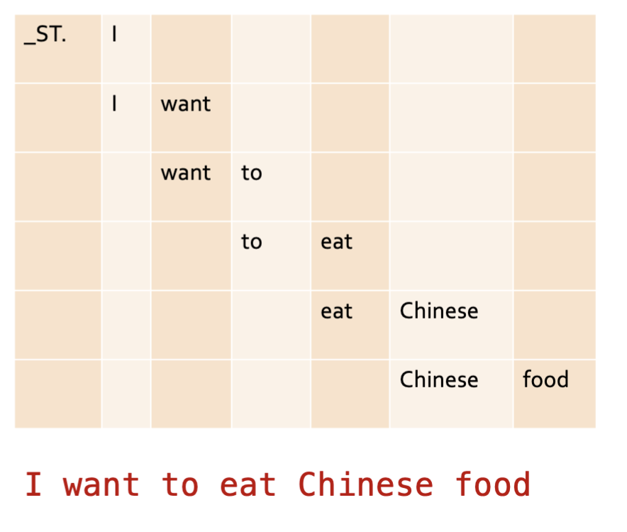

---
# Approximating Shakespeare
We can generate sentence based on a corpus using the probabilies computed by different n-grams:

| gram | text | 
| :--- | :--- |
| 1 | To him swallowed confess hear both. Which. Of save on train for are ay device and rote life have
| 2 | What means, sir. I confess she? then all sorts, he is trim, captain."
| 3 | This shall forbid it should be branded, if renown made it empty."
| 4 | King Henry. What! I will go seek the traitor Gloucester. Exeunt some of the watch. A great banquet serv’d in; - It cannot be but so.

Has the n-grams increase it starts to increasing sounds like Shakespeare. However, there is a problem. The reason it seems like this is because **it is Shakespeare**. There is **no generalisation**, the 4-gram begins to pick up and reproduce chains of sentences as they exist in the text. This is because as the n-gram context window increase, the instances of the exact 3 chained example become **increasly limited** and often only include the one instnce that a particle set of words was used in. 

Shakespeare used $884,647$ tokens from a total vocabulary of $29,066$. With this vocabulary size, there is 840 million possible bigrams but only 300k approx actually occured in the corpus. This means 99.96% of bigrams did not occur. 

The way we are constructing the model and using it to generate sentences means that only the bigrams that occured in the traning data can be generated.

---

# N-Gram Overfitting
**N-grams** only work well for word prediction if the test corpus looks like the training copurus. Note that, in the context of n-grams, the test corpus is just the present, i.e. what is being generated. The idea is to see if the probabilities learned during training actually apply to **new, real-world sentences**. We want to see if the model can accurately predict the next word in the test set based on what it learned in the training set. 

If the test corpus contains a word sequence that **never appeared** in the training corpus (e.g., training had "bright sun" but test has "bright neon"), the N-gram model will mathematically **assign it a probability of zero**. Without advanced **"smoothing"** techniques, the model effectively breaks because it assumes that sequence is impossible. In almost all applications this will be the case as **language is sparse**. This is all an issue because models need to be robust and hold the ability to **generalise on unseen data**. For language, one of the main symptoms to fix is avoid **0 counts** and probabilties for data not seen in the training set.

Any n-gram with a 0 count in the training set means that we assign a 0 probability to it in the test set, if it comes up. **A 0 probability means that we cannot calculate perplexity**. We need to somehow assign a probabiltiy mass to unseen instances. 

---

# Smoothing Intuition
When we have sparse statistics, we can steal probabiltiy mass from observed events to generalise to unobserved events. This can be described as smoothing the counts because we are lowering the peaks and increasing (or just populating) the troughs.

---

# Add-One Estimation (Laplace Smoothing)
The intuition here is to pretend we saw each word one more time than we did. We just add on one to each count. It can be useful for some applications where the number of zeros isn't so huge. But for n-grams and language models, it is barely used. Assigning too much mass to unseen co-occurances leads to massive unwiedly models. The model becomes too large and complex. Recall that shakepear has 840 mill bigrams but only 300k used. Adding mass to nearly 839 million biagrams is too extreme.  

---

# Unknown Words (Token) `<unk>`
This the approach for language models. We need to account for words that appear in the test set but not the training set - and also those that appear in the train but not the test. First, we can focus on the words in the training set that we beleive are least likely to be in the test set. These will be the lowest frequency words. Here, we can just freeze/fix to vocabulary and only take the `n` top words (based on some criteria, i.e. volume or just top `n`). For the rest of the entries, we create the `<unk>` token. We treat this token as the marker for out of vocab words. We can count it and use the counts to assign a probability to OOV words. If something is not in the vocab then it is assigned to `<unk>`. 

---

# Unseen Bigrams
The `<unk>` token allows us to estimate the probability of seeing an OOV in the test set. But it can also allow us to estimate the probability of seeing bi-grams which includes an `<unk>` token. **But it does not help us in estimating the probability of two in-vocab words which have note been seen together.**

---

# Absolute Discounting
Subtract a little from each bigram count in order to save probabiltiy mass for unseen events. Church and Gale (1991) did an experiement where they took a newswire corpus of 22 million words which they split into train and test sets. They looked as each bigram count in the trianing set and compared it to its average bi-gram count in the test set. They notice a relationship where the count in the test corpus is 0.75 lower in the test set.

---

# Absolute Discounting Interpolation
What it does is take `d` from each bigram count. `d` is a param that can be set but often 0.75 is used. Each time we discount a bigram $c(w_2|w_1)$, we add that discount to a dummy token lamda $Lc(L|w_1)$. We convert this count into a probabiltiy distribution as before, calculaing probabiltiy estimates for bigrams. 

How do we then use these outputs? When we want to estimate a new word, we lookup the observed discounted probability of a word given the previous $P_d(w_2|w_1)$ and add the lamda given the previous word $P_d(L|w_1)$ 

$$P_e(w_2|w_1) = P_d(w_2|w_1) + P_d(\lambda|w_1) \times P(w_2)$$

The intituion of this formula can be described as: "Start with the specific evidence we have for this pair ($w_1, w_2$). If that evidence is weak or zero, add a 'safety net' based on how common $w_2$ is in general."

The main reason we use the original formula is to handle the case where the bigram count is zero. If $P_d(w_2|w_1) = 0$, the formula simplifies to $P_d(\lambda|w_1) \times P(w_2)$. You still get a positive number.

---

# Week 2 - Seminar

## Week 2 Questions: 2.1

### 1. Give 3 examples of applications where one might want to assign a probability to a sequence of words.
While you mentioned these in your lecture notes, for a seminar answer, we want to be as precise as possible about why the probability matters in each case. Here is a refined answer:
* **Machine Translation:** To ensure the output is fluent and follows natural word order (e.g., $P(\text{"strong tea"}) > P(\text{"powerful tea"})$).
* **Speech Recognition:** To resolve "homophones" or similar-sounding inputs based on context (e.g., $P(\text{"I saw a van"}) > P(\text{"eyes awe of an"})$).
* **Predictive Text/Autocomplete:** To rank the most likely next word in a sequence to save user effort (e.g., $P(\text{"Happy Birthday"}) > P(\text{"Happy Anniversary"})$).

---

### 2. Write down the product of probabilities which would need to be calculated to estimate the probability of “Then he hovered over the hill” using a trigram model.
Recall that a Trigram Model looks back at the two previous words $(n-1 = 2)$. We also need to include the start tokens $(\langle s \rangle)$ to initialize the context.

The sequence would be broken down as:
1. $P(\text{Then} \mid \langle s \rangle, \langle s \rangle)$
2. $P(\text{he} \mid \langle s \rangle, \text{Then})$
3. $P(\text{hovered} \mid \text{Then}, \text{he})$
4. $P(\text{over} \mid \text{he}, \text{hovered})$
5. $P(\text{the} \mid \text{hovered}, \text{over})$
6. $P(\text{hill} \mid \text{over}, \text{the})$
7. $P(\langle /s \rangle \mid \text{the}, \text{hill})$ (Optional but standard for ending a sequence)

--- 

### 3. Is measuring perplexity for a language model an example of intrinsic or extrinsic evaluation?
It is an Intrinsic Evaluation. It measures the model's performance on the specific task it was trained for (predicting words) in isolation, without considering how it performs in a larger application like translation or search.

---

### 4. The perplexity of model A is measured as 85 and the perplexity of model B is measured as 143. Which is better and why?
Model A is better. Perplexity is a measure of "uncertainty" or "branching factor." A lower score means the model was less "surprised" by the test data and assigned it a higher overall probability. Essentially, Model A is more confident in its predictions.

---

## Week 2 Questions: 2.2

### 1. Explain how a bigram language model can be used to generate possible sequences of tokens.
A bigram language model generates text by treating word prediction like a chain reaction. Because a bigram only "looks back" at the single previous token, it uses the probability $P(w_n | w_{n-1})$ to decide what comes next.

The Shannon-Visualisation method says to start with a random bigram. You then choose the next bigram based on this probability using the most recent token. If there are a range of possible tokens which follow the current token, then sample from this distribution, usually taking the highest token. Continue in a iterative loop until you hit then end token. 

---

### 2. Why do language models need to be smoothed?
Language models must be smoothed because natural language is extremely sparse, meaning even massive datasets cannot capture every valid combination of words. Without smoothing, if a model encounters a word pair in the test set that never appeared in the training set, it assigns that pair a probability of zero. Because the probability of a sentence is the product of its parts, a single zero causes the entire sentence’s probability to collapse to zero, making it impossible to calculate Perplexity. Smoothing "shaves off" a tiny bit of probability mass from frequent, seen events and reallocates it to these unseen events, ensuring the model remains robust and capable of generalizing to new data without "breaking" mathematically.

---

### 3. What does OOV stand for? How do we smooth a language model with respect to OOV tokens?
We smoothing using the `<unk>` token to handle OOV tokens. We only return the top `n` common words and turn less commmon tokens into the `<unk>` token. Add one smoothing is not good for language models as the number of parameters to populate is too vast. 

Why throw away information? rare information means that we don't know much about it, at least interms of freq/probabiltiy setting. By modelling the `<unk>` token, we gather a better understanding of how rare words work in language, even if we loose the specifics. We can indentify the words that preceed or suceed rare words and identify the structure of sentence with rare word usage.


---

### 4. Name 2 different methods for smoothing the probabilities of combinations of tokens. Explain one of them.
Two common methods for smoothing are **Absolute Discounting** and **Stupid Backoff**. Absolute Discounting works by subtracting a fixed constant (usually $0.75$) from every non-zero count and redistributing that "discounted" mass to lower-order models (like moving from a bigram to a unigram) through **interpolation**. This ensures every possible combination has at least some probability.

In contrast, **Stupid Backoff** is a simpler, more "aggressive" method designed for web-scale data. It doesn't attempt to create a mathematically perfect probability distribution; instead, if a higher-order N-gram (like a 4-gram) has a count of zero, the model simply "backs off" to the 3-gram and multiplies that score by a fixed weight (often $0.4$). It continues backing off to smaller and smaller N-grams until it finds a non-zero count, prioritizing speed and simplicity over theoretical perfection.

---

<br>
<br>
<br>

# Week 2 Paper

# Paper: The Microsoft Research Sentence Completion Challenge (Zweig and Burges, 2011)
Zweig and Burges (2011) introduce an evaluation task known as the Microsoft Research Sentence Completion Challenge. We will be looking at this task and its potential to evaluate language models. There are 1040 questions in the dataset, an example of which is given below:

> Was she his **[client ‖ musings ‖ discomfiture ‖ choice ‖ opportunity]**, his friend or his mistress?

The paper addresses a major limitation in N-gram models: while they are excellent at capturing local word order (fluency), they often struggle with long-range dependencies and global coherence. To test this, the authors created a dataset of 1,040 questions derived from five Sherlock Holmes novels by Sir Arthur Conan Doyle. Each question presents a sentence with one word removed and provides five candidate completions. Crucially, all five candidates are grammatically plausible, meaning the model cannot simply rely on part-of-speech rules; it must understand the semantic "fit" of the word within the entire sentence.

The authors used this challenge to compare several models, including standard smoothed 4-grams, Log-Bilinear models, and Latent Semantic Analysis (LSA). Their findings highlighted that while N-grams are reliable for local syntax, they are easily "fooled" in this challenge because the clue for the correct answer often lies far away from the blank space. In contrast, vector-based methods like LSA—which look at the "global" context of the entire sentence—performed significantly better at identifying the semantically correct choice, even if the specific word sequence was rare. This paper essentially paved the way for the development of modern neural models that prioritize global context over local counting.

#### Week 2 Paper Questions
* [1. Explain what the task is, for a human or a computer system, for a question, as presented above. In the above example, what knowledge is needed in order to choose the correct answer?](#1-explain-what-the-task-is-for-a-human-or-a-computer-system-for-a-question-as-presented-above-in-the-above-example-what-knowledge-is-needed-in-order-to-choose-the-correct-answer)
---
* [2. How was the dataset created? How and why were the incorrect answers selected in the way they were?](#2-how-was-the-dataset-created-how-and-why-were-the-incorrect-answers-selected-in-the-way-they-were)
---
* [3. How is performance measured on this task? What score must a method achieve to be better than the baseline of random guessing?](#3-how-is-performance-measured-on-this-task-what-score-must-a-method-achieve-to-be-better-than-the-baseline-of-random-guessing)
---
* [4. What are the advantages and disadvantages of this evaluation task compare to ones based on human synonymy judgements such as WordSim353?](#4-what-are-the-advantages-and-disadvantages-of-this-evaluation-task-compare-to-ones-based-on-human-synonymy-judgements-such-as-wordsim353)
---
* [5. How does the simple 4-gram model work?](#5-how-does-the-simple-4-gram-model-work)
---
* [6. What do you understand by a smoothed n-gram model?](#6-what-do-you-understand-by-a-smoothed-n-gram-model)
---
* [7. Explain the method based on latent semantic analysis similarity. Why do you think this does better than the n-gram methods?](#7-explain-the-method-based-on-latent-semantic-analysis-similarity-why-do-you-think-this-does-better-than-the-n-gram-methods)
---
* [8. How do you think you could do better on this task (without asking humans to help!)?](#8-how-do-you-think-you-could-do-better-on-this-task-without-asking-humans-to-help)

---

### 1. Explain what the task is, for a human or a computer system, for a question, as presented above. In the above example, what knowledge is needed in order to choose the correct answer?
The task in the Microsoft Research Sentence Completion Challenge is a **multiple-choice Cloze test**, where a human or a computer system must identify the single most appropriate word to fill a "gap" in a sentence from five given candidates. Unlike simple grammar tests, all five options are typically the same part of speech—in this case, all are nouns—meaning the sentence remains grammatically "legal" regardless of the choice. To solve it, the system must evaluate the **semantic coherence** and **lexical fit** of the word within the entire sentential context.

In the specific example—"Was she his [client ‖ musings ‖ discomfiture ‖ choice ‖ opportunity], his friend or his mistress?"—the correct answer is "client." To choose this, a system needs two distinct types of knowledge:

**Collocational and Proximity Knowledge:** The sentence provides a list of social or professional roles ("friend", "mistress"). The word "client" fits into this category of "human relationships/roles," whereas "musings" or "discomfiture" (an emotional state) do not.

**Domain and World Knowledge:** Because the dataset is derived from Sherlock Holmes novels, the "correctness" is rooted in the specific 19th-century detective genre. In that world, a woman interacting with a protagonist is often a "client," a "friend," or a "mistress." A computer model needs to have seen these words appear in similar descriptive contexts to recognize that "client" is the most probable role to complete that specific social triad.

---

### 2. How was the dataset created? How and why were the incorrect answers selected in the way they were?
* Step 1: seed sents;
* Step 2: generate alternatives, 30, using a n-gram model, remove extreme (obvious) sentence to retain hard questions
* Step 3: human grooming, prune 30 down to 4 alts, prune with respect to rules

---

### 3. How is performance measured on this task? What score must a method achieve to be better than the baseline of random guessing?
Performance on the Microsoft Research Sentence Completion Challenge is measured using accuracy, specifically the percentage of the 1,040 questions that the model answers correctly. Because each question is a multiple-choice task with exactly five candidates (one correct answer and four distractors), the measure is straightforward: the model's chosen word is compared against the "gold standard" ground-truth word from the original Sherlock Holmes text.

To be considered better than a baseline of random guessing, a method must achieve a score higher than 20%. This is calculated simply as $1/5$, representing the statistical probability of picking the correct answer by sheer chance. In the original 2011 paper, the authors noted that while 20% is the theoretical floor, even basic N-gram models significantly outperform this, though they still fall well short of human performance, which typically sits above 90%.

---

### 4. What are the advantages and disadvantages of this evaluation task compare to ones based on human synonymy judgements such as WordSim353?
The Microsoft Research Sentence Completion Challenge (SCC) and WordSim-353 represent two fundamentally different approaches to evaluating a model's linguistic "intelligence." While WordSim-353 focuses on lexical similarity (how similar are two isolated words?), the SCC focuses on compositional coherence (how well does this word fit into this specific sentence?).

#### Advantages of the Sentence Completion Challenge
The primary advantage of the SCC is that it evaluates a model in context. In WordSim-353, a model is given "bank" and "river" and asked for a score; however, this ignores the fact that in real-world usage, "bank" is almost always surrounded by other words that clarify its sense. The SCC forces a model to resolve ambiguity using the entire sentence, making it a more "natural" test of language understanding. Furthermore, the SCC is a discriminative task with an objective "gold standard" (the original word used by the author). This makes evaluation much more reliable than human similarity judgments, which are subjective, often inconsistent between different annotators, and require complex correlation statistics (like Spearman’s rho) to interpret.

#### Disadvantages of the Sentence Completion Challenge
The main disadvantage of the SCC is its domain specificity. Because the dataset is exclusively derived from 19th-century Sherlock Holmes novels, it rewards models that have been trained on similar Victorian-era literature and may penalize modern models that are better at general-purpose English but unfamiliar with Conan Doyle’s specific vocabulary and "high-style" prose. Additionally, the SCC is a "black or white" metric; a model gets zero points for picking a near-synonym that might be a perfectly valid poetic choice, whereas WordSim-353 allows for a gradient of similarity. Finally, the SCC can sometimes be solved through "low-level" statistical shortcuts (like simple bigram frequency) without the model actually "understanding" the logic of the sentence, whereas synonymy judgments require a deeper grasp of the underlying concepts.

---

### 5. How does the simple 4-gram model work?
The "simple" 4-gram model in the context of the **Sentence Completion Challenge** operates as a **Maximum Likelihood Estimator (MLE**) that calculates the probability of a sentence based on local, four-word windows. Specifically, to evaluate a candidate word for the blank space, the model calculates the joint probability of the entire sentence by breaking it into a chain of dependencies where each word is conditioned only on the three words immediately preceding it ($n-1=3$).

In this specific challenge, the model works through a process of comparative scoring:
1. **Candidate Substitution:** The model creates five versions of the sentence, inserting each of the five candidate words into the blank.
2. **Probability Calculation:** For each version, the model calculates the total sentence probability (usually in the log-domain to avoid numerical underflow). It multiplies (or adds logs of) the probabilities of every 4-gram in the sentence, such as $P(w_4 | w_1, w_2, w_3)$.
3. **Selection:** The candidate word that results in the highest overall sentence probability (or the lowest perplexity) is selected as the "winner."

The primary limitation of this "simple" approach is its extreme locality. Because a 4-gram only "sees" three words into the past, it is excellent at checking if a word follows the local rules of grammar (e.g., ensuring an adjective follows a determiner), but it is completely "blind" to clues that appear earlier in the sentence. If the semantic hint for the blank word is ten words away, the 4-gram model will essentially ignore it, often leading it to choose a word that is locally fluent but globally nonsensical.

---

### 6. What do you understand by a smoothed n-gram model?
A **smoothed n-gram model** is a probabilistic language model that has been modified to handle the "zero-probability" problem caused by data sparsity. In a simple (unsmoothed) model, if a specific sequence of $n$ words never appeared in the training corpus, the model assigns it a probability of exactly zero. This is catastrophic for performance because if a single zero occurs in a sentence, the **Chain Rule** (multiplication) causes the entire sentence's probability to collapse to zero, making it impossible to calculate metrics like **Perplexity**.

Smoothing works by reallocating probability mass from frequently seen events to those that were unseen or rare. The core intuition is to "shave off" a small fraction of the counts from high-frequency n-grams and "spread" that count across the vast number of n-grams that have zero counts. This ensures that every possible word sequence has at least a tiny, non-zero probability, allowing the model to be robust when encountering new, "novel" sentences in the test set.

Common techniques for smoothing include:

| Type | Description | 
| :--- | :--- | 
| Laplace (Add-One) Smoothing: | The simplest method, which adds 1 to every possible n-gram count. | 
| Absolute Discounting: | Subtracting a fixed constant (e.g., $0.75$) from seen counts to create a "reservoir" of probability for unseen sequences. | 
| Backoff and Interpolation: | If a specific trigram is unknown, the model "backs off" to look at the bigram or unigram probabilities instead, ensuring that general linguistic knowledge supports specific gaps in the data. | 

---

### 7. Explain the method based on latent semantic analysis similarity. Why do you think this does better than the n-gram methods?
**Latent Semantic Analysis (LSA)** approach treats the sentence completion task as a problem of **global** semantic fit rather than local word ordering. Instead of counting how often words appear next to each other, LSA uses **Singular Value Decomposition (SVD)** to reduce a massive word-context matrix into a **"dense"** lower-dimensional space. In this space, every word is represented as a vector. To solve a challenge question, the model represents the entire sentence (minus the blank) as a single vector—usually by averaging the vectors of all its constituent words—and then calculates the cosine similarity between that "context vector" and the vectors of the five candidate completions.

LSA likely outperforms N-gram methods on this specific task for several reasons:

**Long-Range Dependencies:** N-grams are "locally blind"; a 4-gram only sees the three words immediately preceding the blank. If the clue for the correct answer appears at the very beginning of a twenty-word sentence, the N-gram will completely miss it. LSA, however, considers every word in the sentence simultaneously, allowing it to capture the overarching "topic" or "theme" of the text.

**Semantic Generalization:** N-grams suffer from the "zero-count" problem; if the model hasn't seen the exact four-word sequence before, it struggles. LSA operates in a continuous vector space where words with similar meanings (e.g., "client" and "customer") are placed close together. This allows the model to recognize that a word "fits" the topic even if that specific phrasing is entirely novel.

**Topic Consistency:** The Sentence Completion Challenge often relies on high-level narrative logic (e.g., a detective story context) rather than just grammatical fluency. LSA is specifically designed to capture these "latent" relationships, making it much more robust at identifying which candidate word is most "at home" in a Sherlock Holmes mystery.

---

### 8. How do you think you could do better on this task (without asking humans to help!)?
To outperform the 2011 benchmarks without human intervention, we would transition from "counting" and "linear algebra" to deep contextualized architectures and data augmentation. The primary goal is to solve the "short memory" of N-grams and the "bag-of-words" limitation of LSA.

#### 1. Moving to Bi-directional Transformers (BERT)
The most significant improvement would come from using a model like BERT (Bidirectional Encoder Representations from Transformers). Unlike N-grams, which look only at the past, or LSA, which loses word order, BERT uses a Masked Language Model (MLM) objective. This is identical to the SCC task: it masks a token and uses the "self-attention" mechanism to weigh the importance of every other word in the sentence (both left and right) to predict the fill. BERT would capture the Victorian syntax of Sherlock Holmes while maintaining a "global" view of the sentence's logic.

#### 2. Domain-Specific "Intermediate" Pre-training
As noted in the paper, the SCC is difficult because of its Victorian-era prose. A general-purpose model trained on Wikipedia might struggle with 19th-century vocabulary. We could improve performance by performing Domain Adaptation: taking a pre-trained model and fine-tuning it on a massive corpus of 19th-century literature (Project Gutenberg). This would "prime" the model’s internal embeddings to expect the specific collocations and formal registers used by Sir Arthur Conan Doyle.

#### 3. Incorporating Discourse and Narrative Logic
The SCC often requires understanding the "plot" or "character roles." We could use a Long-Context Transformer (like Longformer or Mistral) trained on entire chapters rather than single sentences. By providing the model with the previous five paragraphs of the story as "context," it could realize that the character being discussed is a "client" and not a "choice," even if the current sentence is ambiguous.

#### 4. Ensemble Methods
Finally, we could combine the strengths of different architectures. An Ensemble that averages the votes of a 5-gram model (for local fluency), an LSA model (for global topic consistency), and a Neural Transformer (for deep semantics) would likely be more robust than any single method. If the Transformer and LSA both agree on "client," but the N-gram is unsure, the consensus would lead to the correct answer.

---

# Week 2 - Addtional Readings
* Jurafsky and Martin Chapter 3 [N-gram Language Models]

#### References 

| Title | Author | Year | Publication |
| :--- | :--- | :--- | :--- |
| Large language models in machine translation.  | Brants, T. et al | 2007 | n EMNLP/CONLL 2007 |
| A Comparison of the enhanced Good-Turing and deleted estimation methods for estimating probabilities of English bigrams. | Church, K.W. and Gale, W.A | 1991 | Computer Speech and Language, 5, 19-54 |
| Linguistic Regularities in Continuous Space Word Representations | Mikolov, Yih and Zweig | 2013 | NAACL-HCT 2013 |
| The Microsoft Research Sentence Completion Challenge. | Zweig, G. and Burges, A | 2011 | Microsoft Technical Report |

---

<br>
<br>
<br>
<br>
<br>


# [Week 3 - Neural Language Models](https://canvas.sussex.ac.uk/courses/36171/pages/week-slash-topic-3-neural-networks-and-neural-language-models)

* Feed Forward Networks
* Recurrent (RNN)
* Long-Short Term Memory (LSTM)
* Convolutional (CNN)
* Word-based vs Character Based

#### Week 3: Contents

1. [Lecture](#week-4-lecture)
2. [Seminar](#week-3-seminar)
2. [Paper](#week-3-paper-discussion)
4. [Additional Readings](#week-3-additional-reading)

---

# Week 3: Lecture

* [Part 1 - Neural Networks](https://sussex.cloud.panopto.eu/Panopto/Pages/Viewer.aspx?id=d1dda4d7-c0c6-4018-b756-b3e500fb35fb)
* [Part 2 - RNN/LSTM/GRU](https://sussex.cloud.panopto.eu/Panopto/Pages/Viewer.aspx?id=9cae7217-e9c9-4e3f-894b-b3e800b7d5cc&start=0)
* [Part 3 - CNNs](https://sussex.cloud.panopto.eu/Panopto/Pages/Viewer.aspx?id=06ed8e74-ae66-4085-8d4d-b3e800be5350&start=0)

Week 3 of the module marks a fundamental paradigm shift from the **counting-based** logic of N-grams to the **representation-based** logic of **Neural Language Models (NLMs)**. While previous methods struggled with the "curse of dimensionality" and data sparsity, NLMs solve these issues by projecting words into a continuous, high-dimensional vector space where semantically similar words are placed closer together. We begin by exploring the **Feed-Forward Neural Network (FFNN)**, which uses a fixed-length context window to predict the next word. While this architecture introduced the power of **dense embeddings** and non-linear hidden layers, it remained limited by its "short memory" and the requirement of a hard-coded input size.

To overcome these structural limitations, we transition to **Recurrent Neural Networks (RNNs)**, which process language sequentially rather than in static windows. By maintaining a **hidden state** that acts as a persistent internal memory, RNNs can theoretically handle variable-length inputs and capture long-range dependencies across an entire sentence. However, because "Vanilla" RNNs suffer from the **vanishing gradient** problem—where the signal from the beginning of a sentence effectively disappears before reaching the end—we introduce the **Long Short-Term Memory (LSTM)**. Through a sophisticated system of **input, forget, and output gates**, the LSTM surgically manages a **"cell state,"** allowing the model to preserve critical information over much longer sequences.

Finally, we address the limitations of word-level modeling by investigating **Character-Aware Neural Language Models**. By using **Convolutional Neural Networks (CNNs)** to scan the internal character structure of words, these models can identify sub-word features like prefixes and suffixes. This architectural shift provides a powerful solution to the **Out-of-Vocabulary (OOV)** problem and enhances the model's performance on morphologically rich languages. By stacking these character-level features into a highway network and then into an LSTM, we create a robust system that understands both the structural nuances of individual words and the global context of the entire discourse.

#### Week 3: Lecture Contents 
* [Part 1 - Neural Networks](#part-1---neural-networks)
    * [Neural Unit](#neural-unit)
    * [Feedforward Network](#feedforward-network)
    * [Training Neural Networks](#training-neural-networks)
    * [Feed-Forward Neural Language Model (Bengio et al., 2003)](#feed-forward-neural-language-model-bengio-et-al-2003)
    * [Feedword Comparison to n-Gram](#feedword-comparison-to-n-gram)
    * [The "Hypothesis Space" Intuition:](#the-hypothesis-space-intuition)
    * [The Limitations of the Bengio Model](#the-limitations-of-the-bengio-model)
---
* [Part 2 - RNN/LSTM/GRU](#part-2---rnnlstmgru)
    * [Simple Recurrent Network](#simple-recurrent-network)
    * [Recurrent Neural Networks (RNN)](#recurrent-neural-network-language-model-rnn-lm)
        * [RNN Advantages](#rnn-advantages)
        * [RNN Disadvantages](#rnn-disadvantages)
    * [RNN Language Model (Mikolov et al., 2013)](#rnn-language-model-mikolov-et-al-2013)
        * [1. The Hidden Layer ($h_t$)](#1-the-hidden-layer-)
        * [2. The Output Layer ($y_t$)](#2-the-output-layer-)
        * [3. The Probability Distribution ($\hat{y}_t$)](#3-the-probability-distribution-)
        * [4. Distributed Representations in RNNs](#4-distributed-representations-in-rnns)
    * [Long Short-Term Memory (LSTM)](#long-short-term-memory-lstm)
        * [The Gating Mechanism](#the-gating-mechanism)
        * [The Forget Gate ($f_t$)](#the-forget-gate-)
        * [The Input Gate ($i_t$) & Candidate State ($\tilde{C}_t$)](#the-input-gate---candidate-state-)
        * [The Output Gate ($o_t$)](#the-output-gate-)
    * [GRU Variant](#gru-variant)
    * [Stacked RNNs (Deep RNNs)](#stacked-rnns-deep-rnns)
    * [Why Stack RNNs?](#why-stack-rnns)
    * [Bidirectional RNNs (Bi-RNN)](#bidirectional-rnns-bi-rnn)
---
* [Part 3 - CNNs](#part-3---cnns)
    * [Convolutions in NLP](#convolutions-in-nlp)
    * [Max Pooling](#max-pooling)
    * [Stacking Convolutional Layers](#stacking-convolutional-layers)
    * [Kernel Functions ](#kernel-functions)
    * [Advantages of Character-Aware Neural Language Models](#advantages-of-character-aware-neural-language-models)
    * [Sub-word Morphological Awareness:](#sub-word-morphological-awareness)
    * [Superior Handling of Sparse and OOV Data](#superior-handling-of-sparse-and-oov-data)
    * [Robustness to Noise](#robustness-to-noise)
    * [Parameter Efficiency](#parameter-efficiency)
---

# Part 1 - Neural Networks
While traditional n-gram models rely on discrete counts and the Markov assumption, Neural Language Models (NLMs) represent words in a continuous, high-dimensional vector space. At a high level, the architecture focuses on transforming input tokens into dense embeddings, which are then processed through hidden layers to capture non-linear relationships. By using a Feed-Forward structure, the network learns to predict the next token by projecting the context into a "hidden" space, effectively bypassing the data sparsity issues that plague n-grams. In this module, the focus remains on how these architectures—specifically the Softmax output and Cross-Entropy Loss—allow the model to assign probabilities to sequences in a way that generalizes to unseen data.

#### Part 1: Contents
* [Neural Unit](#neural-unit)
* [Feedforward Network](#feedforward-network)
* [Training Neural Networks](#training-neural-networks)
* [Feed-Forward Neural Language Model (Bengio et al., 2003)](#feed-forward-neural-language-model-bengio-et-al-2003)
* [Feedword Comparison to n-Gram](#feedword-comparison-to-n-gram)
* [The "Hypothesis Space" Intuition:](#the-hypothesis-space-intuition)
* [The Limitations of the Bengio Model](#the-limitations-of-the-bengio-model)

---

# Neural Unit
The fundamental building block of the network is the neuron (or unit). It performs two distinct operations: a linear transformation followed by a non-linear activation. 

The unit first calculates the weighted sum ($z$) of its inputs. This is represented mathematically as the dot product of the input vector and the weight vector, plus a bias term:

$$z = \mathbf{w} \cdot \mathbf{x} + b$$

The output ($y$) is produced by passing the sum $z$ through a non-linear activation function ($g$ or $\sigma$):

$$y = g(z)$$

This output then serves as the input for the next layer in the network. Without this non-linear step, the entire neural network would collapse into a simple linear regression model, regardless of how many layers are added.

---

# Feedforward Network 
In a Feed-Forward Network (FFN), information flows in one direction: from the input layer, through one or more hidden layers, to the output layer. There are no cycles or loops in this architecture, distinguishing it from the Recurrent Neural Networks (RNNs) we see later in the module.

* **Input Layer:** Represents the raw data (e.g., word embeddings).
* **Hidden Layers:** Where the "learning" happens. These layers extract increasingly abstract features from the input.
* **Output Layer:** Produces the final prediction (e.g., the probability of the next word).
* **Fully Connected (Dense):** In a standard FFN, every unit in layer $i$ is connected to every unit in layer $i+1$. Each connection has its own weight.

Each hidden layer $h$ can be represented as a vector calculation. If $\mathbf{x}$ is our input, the first hidden layer is:
$$\mathbf{h} = g(\mathbf{W}\mathbf{x} + \mathbf{b})$$

For **Language Modelling**, the output layer typically has a size equal to the entire **Vocabulary** ($V$). To turn the raw output values (logits) into probabilities that sum to 1, we use the Softmax function:
$$\sigma(\mathbf{z})_i = \frac{e^{z_i}}{\sum_{j=1}^{|V|} e^{z_j}}$$

This allows us to interpret the output as $P(w_t \mid \text{context})$, where the index with the highest probability is our predicted word.

---

# Training Neural Networks
Training is the process of adjusting the network's weights and biases so that its predictions match the "ground truth" labels in the training data. In NLP, this usually means predicting the actual next word in a sentence.

To improve, the network needs a mathematical measure of how "wrong" its current predictions are. This is the Loss Function ($J$).

For language modelling, we use **Cross-Entropy Loss** (often referred to as **Negative Log-Likelihood**). If the model predicts a probability $P(w)$ for the correct word, the loss for that single instance is:

$$L = -\log P(w)$$

* If the model is confident and correct ($P \approx 1$), the loss is near 0.
* If the model is wrong or uncertain ($P \approx 0$), the loss becomes very large.
* The goal of training is to minimize the average loss across the entire training corpus.

Once we have the loss, we use **Gradient Descen**t to update the parameters. This happens in three repeating steps:

| Step | Description |
| :--- | :--- |
| **Forward Pass:** | Compute the prediction and the resulting loss. |
| **Backward Pass (Backpropagation):** | Use the chain rule from calculus to calculate the gradient—the partial derivative of the loss with respect to every weight in the network ($\frac{\partial J}{\partial W}$). This tells us which direction to "nudge" the weights to decrease the loss. |
| **Update:** | Adjust the weights in the opposite direction of the gradient, scaled by a Learning Rate ($\alpha$): $W = W - \alpha \frac{\partial J}{\partial W}$ |
---

In practice, we don't update the weights after every single word **(Stochastic Gradient Descent)** because it's noisy and slow. Instead, we use **Mini-batch Gradient Descent**, where we calculate the average loss for a small group of sentences **(e.g., 32 or 64)** and perform one update step.

---

# Feed-Forward Neural Language Model (Bengio et al., 2003)
This model treats language modeling as a supervised learning task: predicting the next word $w_t$ given a fixed-length history of $n-1$ words.

#### Architecture & Process
---
| Step | Description |
| :--- | :--- | 
| **Input:** | A sequence of words (e.g., a 3-word window: $w_{t-3}, w_{t-2}, w_{t-1}$). |
| **Projection Layer (Embeddings):** | Each word is initially a high-dimensional "one-hot" vector. The model multiplies these by a shared weight matrix $C$ to produce a dense, lower-dimensional embedding vector. | 
| **Concatenation:** | These embedding vectors are concatenated into a single large input vector for the hidden layer. |
| **Hidden Layer:** | A standard fully connected layer with a non-linear activation (usually tanh). This layer learns the "contextual interactions" between the input words. | 
| **Output Layer (Softmax):** | The final layer has a size equal to the vocabulary ($\|V\|$). It outputs a probability distribution over all possible next words. $P(w_t \| w_{t-1}, \dots, w_{t-n+1})$ |
---

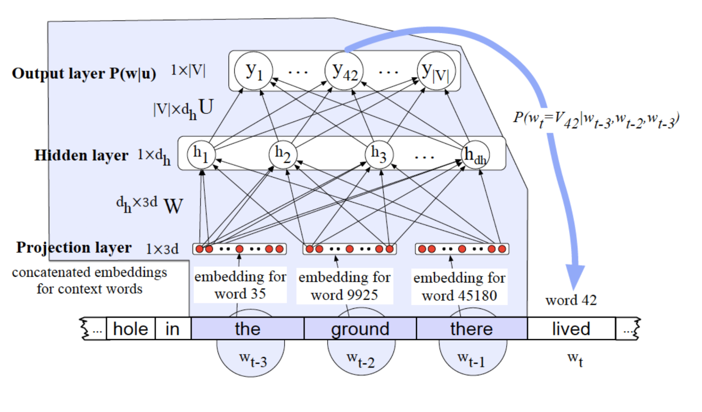

---

# Feedword Comparison to n-Gram
| Feature, | Neural Language Model (NLM) | n-gram Models | 
| :--- | :--- | :--- | 
| Generalization | High. Similar words (e.g., "dog" and "cat") have similar embeddings, so the model knows they appear in similar contexts. | Low. Treats words as atomic units; "dog" and "cat" are as different as "dog" and "refrigerator." | 
| Smoothing | Not needed. The model maps words into a continuous space; there are no "zero counts", only lower probabilities. | Essential. Required to handle unseen word combinations (Laplace, Kneser-Ney). |
| Context | Can handle slightly longer histories than n-grams (though still fixed). | Becomes exponentially sparse as n increases. |
| Training Speed | Slow. Backpropagation and softmax over a huge vocabulary are computationally expensive. | Fast. Simple counting and division. | 

---

# The "Hypothesis Space" Intuition: 
Unlike n-grams, which look for exact matches, the NLM moves into a "feature space." If the model has seen "The cat sat on the...", it can predict "mat" for "The dog sat on the..." because it recognizes that "cat" and "dog" occupy similar positions in the embedding space.

---

# The Limitations of the Bengio Model
The primary limitation is the **Fixed Window**. Even though it's better than an n-gram, it still uses a **"Markov-style"** assumption where it only looks at the previous $n$ words. It cannot "remember" a subject introduced at the beginning of a long paragraph. In a **Feed-Forward** network, the input layer size is hard-coded into the weight matrix. You could just make the inital input size very large but as you increase the window size, the number of weights in the first hidden layer explodes. Also, the most subtle but critical issue is that with a concatenated vector, the model treats "Position 1" and "Position 2" as completely different sets of weights. The model may learn structurally that "The" is a common word at $w_t-1$ but it needs to learn this again for all positions. 

---

<br>
<br>


# Part 2 - RNN/LSTM/GRU

While Feed-Forward Neural Networks (FFNNs) revolutionized language modeling by using dense embeddings, they remain structurally limited by a fixed-length context window, which forces the model to ignore any information outside of its immediate $n-1$ history. Recurrent Neural Networks (RNNs) solve this by processing language sequentially, maintaining an internal hidden state that acts as a dynamic "memory" of the entire preceding text. This allows for variable-length inputs and the theoretical ability to capture long-range dependencies. However, because standard RNNs struggle with the vanishing gradient problem—where the mathematical signal of earlier words "dies out" over time—we move toward the LSTM and GRU. These architectures introduce specialized gating mechanisms that surgically control the flow of information, allowing the network to selectively remember or forget specific linguistic features over much longer sequences, effectively creating a more robust and persistent representation of sentence history.

#### Part 2: Contents
* [Simple Recurrent Network](#simple-recurrent-network)
* [Recurrent Neural Networks (RNN)](#recurrent-neural-network-language-model-rnn-lm)
    * [RNN Advantages](#rnn-advantages)
    * [RNN Disadvantages](#rnn-disadvantages)
* [RNN Language Model (Mikolov et al., 2013)](#rnn-language-model-mikolov-et-al-2013)
    * [1. The Hidden Layer ($h_t$)](#1-the-hidden-layer-)
    * [2. The Output Layer ($y_t$)](#2-the-output-layer-)
    * [3. The Probability Distribution ($\hat{y}_t$)](#3-the-probability-distribution-)
    * [4. Distributed Representations in RNNs](#4-distributed-representations-in-rnns)
* [Long Short-Term Memory (LSTM)](#long-short-term-memory-lstm)
    * [The Gating Mechanism](#the-gating-mechanism)
    * [The Forget Gate ($f_t$)](#the-forget-gate-)
    * [The Input Gate ($i_t$) & Candidate State ($\tilde{C}_t$)](#the-input-gate---candidate-state-)
    * [The Output Gate ($o_t$)](#the-output-gate-)
* [GRU Variant](#gru-variant)
* [Stacked RNNs (Deep RNNs)](#stacked-rnns-deep-rnns)
* [Why Stack RNNs?](#why-stack-rnns)
* [Bidirectional RNNs (Bi-RNN)](#bidirectional-rnns-bi-rnn)

---

# Simple Recurrent Network
While **Feed-Forward Neural Networks (FFNNs)** offer a significant leap over n-grams through **dense embeddings** and **better generalization**, they are fundamentally limited by a **fixed-length** context window. In natural language, dependencies often span far beyond the previous three or four words. To address this, we transition to **Recurrent Neural Networks (RNNs)**. Unlike FFNNs, which process an entire window of text as a **single static input**, RNNs process language **sequentially**. By maintaining an internal **"hidden state"** that is updated at every time step, these models create a persistent memory of the past, allowing them to handle **variable-length** inputs and potentially capture long-range dependencies that a fixed window would simply miss.

#### Key Shifts: 
* **From Fixed to Variable:** Moving away from hard-coded window sizes to architectures that can process any number of tokens.
* **From Concatenation to Recurrence:** Instead of stacking word vectors side-by-side, we feed the output of the previous step back into the network alongside the current word.
* **The Vanishing Gradient Problem:** Identifying why "Vanilla" RNNs struggle with long-term memory and how LSTMs and GRUs use specialized "gates" to protect and maintain information over time.

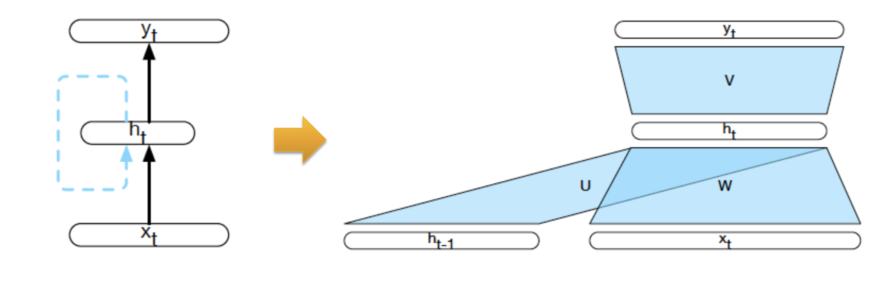

---

# Recurrent Neural Networks (RNN)

An RNN is essentially a Feed-Forward network that "loops." At each time step $t$, the network takes two inputs: the current word $x_t$ and its own previous hidden state $h_{t-1}$.

---

# RNN Advantages

* **Sequential Memory:** The hidden layer acts as a "summary" or "bottleneck" of the previous context.
* **Variable Length:** Unlike the Bengio model, the same weights ($U, V, W$) are used regardless of sentence length.
* **Parameter Sharing:** The model learns the meaning of a word once, and that knowledge is applied no matter where the word appears in the sequence.

---

# RNN Disadvantages

* **The Vanishing Gradient Problem:** During backpropagation, the gradient is multiplied by the weight matrix repeatedly. If weights are small, the gradient shrinks to zero, meaning the model "forgets" the start of long sentences.
* While it can theoretically remember everything, in practice, $h_t$ is heavily biased toward the **most recent** words.

---

# RNN Language Model (Mikolov et al., 2013)

Mikolov’s implementation formalized how RNNs could be used for large-scale language modelling. The "memory" is stored in the hidden layer, which serves as a distributed representation of the history.

Input and output vectors ($w$ and $y$) have dimensionality of the vocabulary. Output vector y is a probability distribution over words.

Word representations are found in the columns of a matrix $U$ (selected by the 1 of $N$ encoding of the current word $w(t)$)

The hidden layer $(s(t))$ maintains a representation of sentence history 

Trained with back-propagation to maximise data log-likelihood

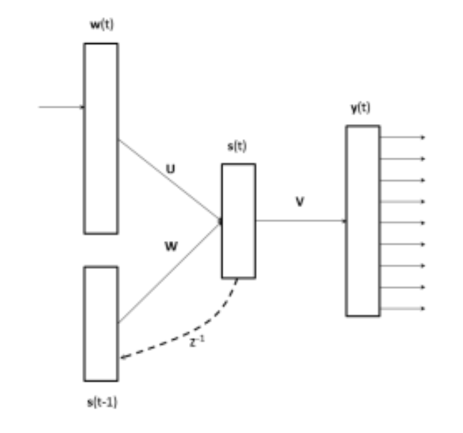

To compute the state of an RNN at any time step $t$, we use the following formulas:

---

# 1. The Hidden Layer ($h_t$)
The **hidden state** is a concatenation of the **current input** and the **previous context**, passed through a **non-linear activation** (usually $tanh$ or $sigmoid$):
$$h_t = \sigma(W x_t + U h_{t-1} + b)$$
* $W$: Weights for the input-to-hidden connections.
* $U$: Weights for the hidden-to-hidden (recurrent) connections.
* $b$: Bias vector.

---

# 2. The Output Layer ($y_t$)
The raw output (logits) is calculated from the current hidden state.
$$a_t = V h_t + c$$
* $V$: Weights for the hidden-to-output connections.
* $c$: Output bias.

---

# 3. The Probability Distribution ($\hat{y}_t$)
Finally, we apply Softmax to get the probability of every word in the vocabulary:
$$\hat{y}_t = \text{softmax}(a_t)$$

---

# 4. Distributed Representations in RNNs
One of the coolest things about the Mikolov model is that the matrix $W$ (the input weights) essentially becomes a lookup table for word embeddings. As the model learns to predict the next word, it naturally groups similar words together in the vector space because they lead to similar hidden states.

---

# Long Short-Term Memory (LSTM)
The core innovation of the LSTM is the **Cell State** ($C_t$), which acts as a "long-term memory" conveyor belt running through the top of the units. While the standard RNN squashes all information through a single $tanh$ layer, the LSTM uses gates to surgically add or remove information from the cell state.

Every LSTM unit at time $t$ considers:
* $x_t$: The current input (the current word embedding).
* $h_{t-1}$: The **short-term memory** (hidden state from the previous step).
* $C_{t-1}$: The **long-term memory** (cell state from the previous step).

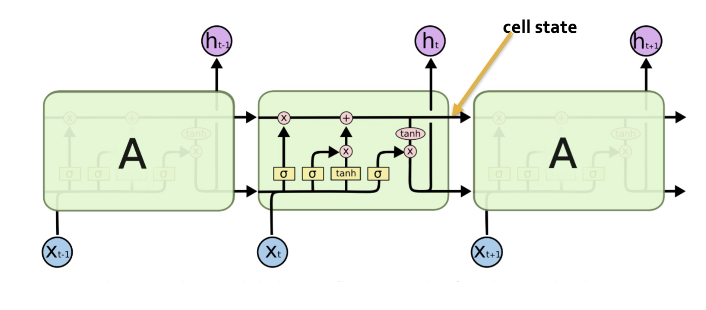

---

# The Gating Mechanism
Each gate uses a **Sigmoid** ($\sigma$) activation function. Because sigmoid outputs are between 0 and 1, they act as "valves":
* 0: **Close** the gate (forget/block everything).
* 1: **Open** the gate (keep/pass everything).

---

# The Forget Gate ($f_t$)
It looks at $x_t$ and $h_{t-1}$ and decides which bits of the **long-term memory** ($C_{t-1}$) are no longer relevant.
* **Formula:** $f_t = \sigma(W_f \cdot [h_{t-1}, x_t] + b_f)$
* **Example:** If the sentence subject changes from singular to plural, the forget gate might "erase" the singular verb constraint.

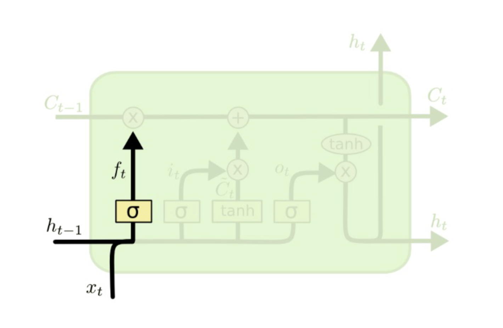

---

# The Input Gate ($i_t$) & Candidate State ($\tilde{C}_t$)
This gate decides what **new** information to store in the **cell state**.
1. **The Input Gate** ($\sigma$) decides which values to update.
2. **The Candidate State** ($tanh$) creates a vector of new potential values to add to the state.
3. **The Update:** These are multiplied and then added to the cell state.
    * **Crucial Point:** Because we add rather than multiply, the gradient can flow back through time much more easily, solving the vanishing gradient problem.

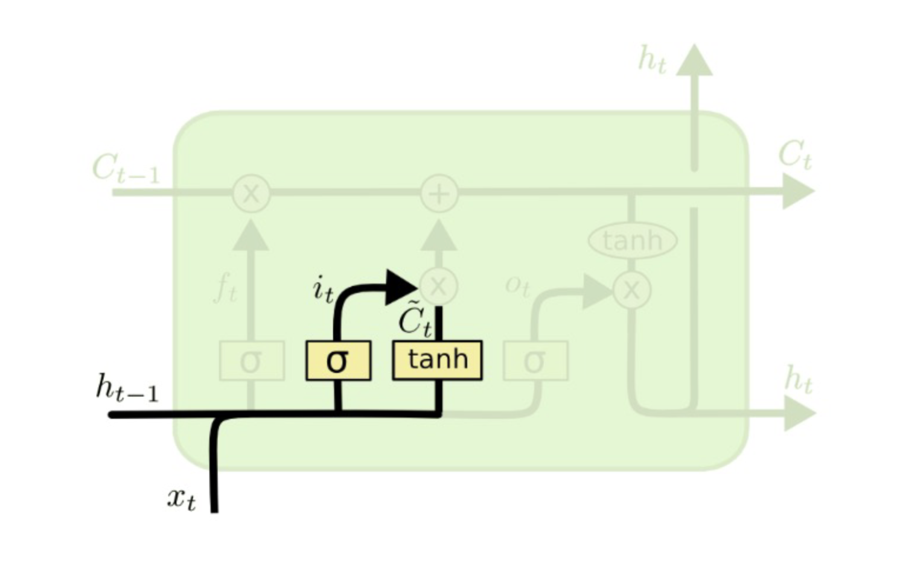

---

# The Output Gate ($o_t$)

This gate decides what the next **Hidden State** ($h_t$) should be. It takes the current cell state, runs it through a $tanh$ (to keep values between -1 and 1), and multiplies it by the output gate’s sigmoid filter.

The result $h_t$ is used for the current prediction and passed to the next cell as short-term memory.

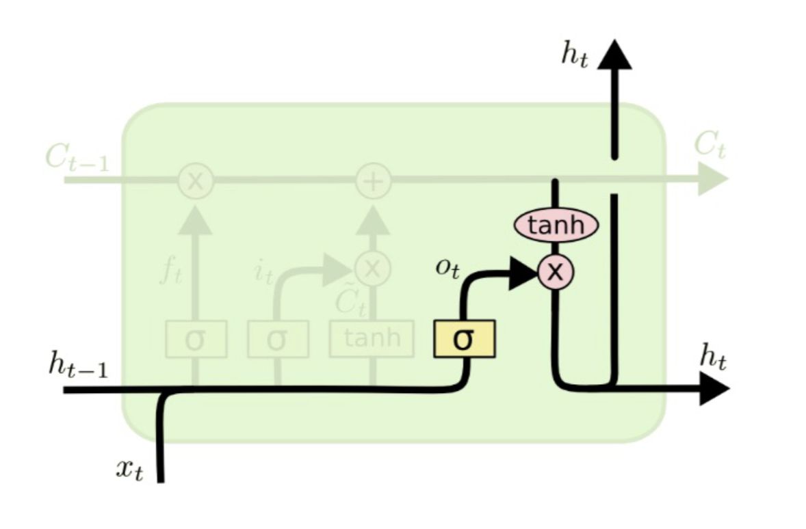

---

# GRU Variant
he GRU (Gated Recurrent Unit) is often preferred for smaller datasets or limited compute because it achieves similar performance to the LSTM but with fewer parameters. By merging the Cell State and Hidden State into one, and combining the Forget and Input gates into a single Update Gate, it simplifies the architecture while still providing a robust solution to the vanishing gradient problem.

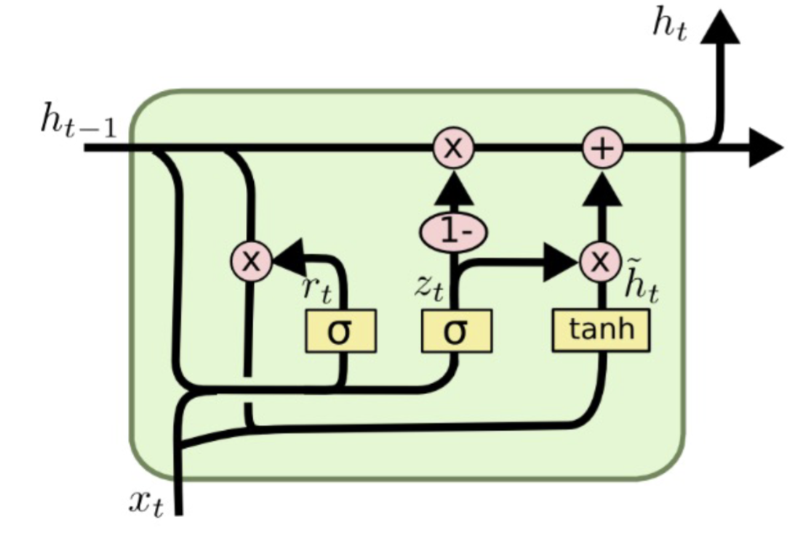

---

# Stacked RNNs (Deep RNNs)

In a Stacked RNN, the output (hidden state $h_t$) of one RNN layer is not used to predict a word immediately; instead, it becomes the input for the next RNN layer above it.

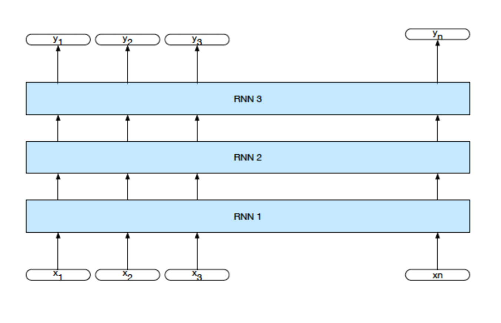

---

# Why Stack RNNs?
* **Hierarchical Abstraction:** Just as CNNs learn edges before shapes, stacked RNNs learn different levels of linguistic abstraction.
    * Lower layers tend to capture lower-level syntax (parts of speech, local morphology).
    * Higher layers tend to capture more abstract semantic concepts and long-range structure.
* **Increased Capacity:** Stacking allows the model to learn more complex functions. Most modern systems use at least 2 to 4 layers.

--- 

# Bidirectional RNNs (Bi-RNN)

A standard RNN is "causal" — it only knows about the past. However, for many NLP tasks (like **Part-of-Speech** tagging or **Named Entity Recognition**), the future context is just as important as the past.

**Example:** In the sentence "The bank was flooded," you don't know if "bank" is a financial institution or a river bank until you see the word "flooded."

A **Bidirectional RNN** consists of two independent hidden layers:
* **Forward Pass:** Processes the sequence from left to right ($w_1, w_2, \dots, w_n$).
* **Backward Pass:** Processes the sequence from right to left ($w_n, w_{n-1}, \dots, w_1$).

At each time step $t$, the hidden states from both directions are concatenated (joined together) to form the final representation:
$$h_t = [h_t^{\text{forward}} ; h_t^{\text{backward}}]$$

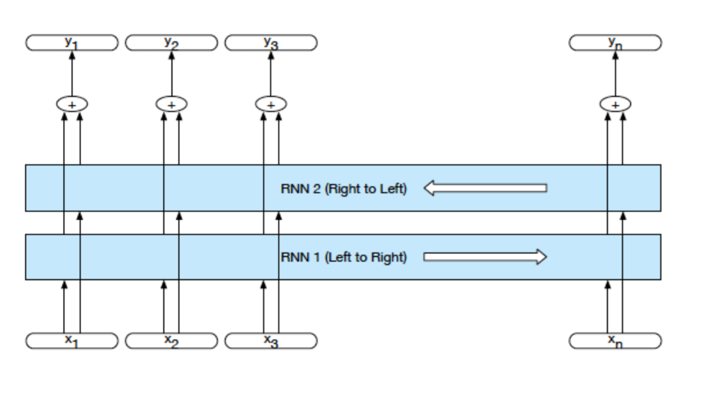

**Constraint:** You **cannot** use a Bidirectional RNN for **generative language modeling** (predicting the next word) because the "backward" pass would effectively "cheat" by seeing the word you are trying to predict. They are best for tasks where the entire sentence is available at once.

In NLP, a "task" refers to any objective where the model is mapping an input to an output. **Generative Modeling** (predicting the next word) is a massive part of modern AI, but there is a whole world of **Discriminative** and **Labeling** tasks where bidirectional context is superior.

**Generative tasks** are about creation (one word at a time), whereas **Non-Generative** tasks are about analysis or tagging (looking at the whole sentence at once).

Some non-generative tasks could be: Part-of-Speech (POS) Tagging, Named Entity Recognition (NER) and Sentence-Level Classification (Sentiment, Language Translation etc). Often times, these non-generative tasks are used to build an understanding of language to construct dense vectors which can be used in further downstream tasks. 

---

<br>
<br>

# Part 3 - CNNs

In previous sections, we treated words as the "atomic" units of language. However, this creates a massive problem for **Out-of-Vocabulary (OOV)** words or rare **morphological variants** (e.g., "unapologetically"). If the model hasn't seen that specific word **enough** times in training, its embedding will be poor.

**Convolutional Neural Networks (CNNs)** offer a solution by shifting the focus from words to **characters**. By using CNNs to "scan" the characters within a word, the model can learn to recognize sub-word patterns like prefixes, suffixes, and stems, allowing it to build a meaningful representation for words it has never seen before.

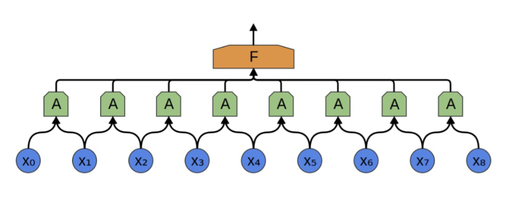

#### Part 3: Contents
* [Convolutions in NLP](#convolutions-in-nlp)
* [Max Pooling](#max-pooling)
* [Stacking Convolutional Layers](#stacking-convolutional-layers)
* [Kernel Functions ](#kernel-functions)
* [Advantages of Character-Aware Neural Language Models](#advantages-of-character-aware-neural-language-models)
* [Sub-word Morphological Awareness:](#sub-word-morphological-awareness)
* [Superior Handling of Sparse and OOV Data](#superior-handling-of-sparse-and-oov-data)
* [Robustness to Noise](#robustness-to-noise)
* [Parameter Efficiency](#parameter-efficiency)

---

# Convolutions in NLP
Originally designed for computer vision to detect edges and shapes, CNNs in NLP are used to detect local features in a sequence.

#### How it Works
* **Filters (Kernels):** A filter is a small matrix of weights that slides over the input. In NLP, the input is usually a matrix of character embeddings.
* **Width of the Filter:** Instead of a 2D square (like in images), NLP filters usually have a fixed width equal to the embedding dimension and a variable height (e.g., 2, 3, or 4 characters).
* A height of 3 is effectively looking for character *n-grams (trigrams)*.
* *Feature Maps:* As the filter slides down the word, it performs a mathematical operation (dot product) to produce a "feature map" — a list of scores showing where a specific pattern (like "-ing") was detected.

--- 

# Max Pooling
After the convolution, we are left with many scores. We usually only care if a feature was present, not necessarily where it was. Max-over-time pooling takes the single highest value from the feature map. This makes the model position-invariant — it recognizes the "ing" feature regardless of whether it's in the middle or end of the string.

---

# Stacking Convolutional Layers
In a CNN, stacking means feeding the output of one convolutional layer as the input to a second (or third) convolutional layer.

Think of it as a hierarchy of understanding: instead of just looking at the raw characters, the model starts looking at the "features of features." This allows the detection of complex features composed from simpler features e.g., face detection requires eye detection

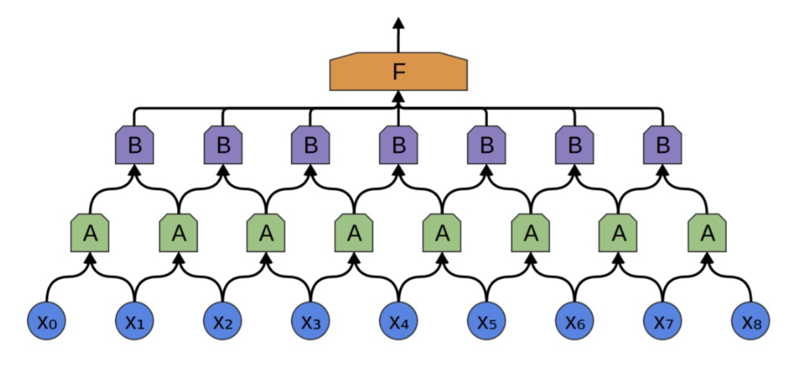

---

# Kernel Functions 
In Natural Language Processing, Kernels (also called Filters) are the actual "detectors" within the convolutional layer. They are the **matrices of weights** that the network **learns** during training to identify specific patterns in the character or word sequences.

A kernel is a **small window of weights**. In a character-level CNN, the kernel usually has a width that matches the size of the character embeddings and a height that defines the "window size" (the number of characters it looks at simultaneously).
* **Height 2:** Looks for bigrams (e.g., "th", "re", "ed").
* **Height 3:** Looks for trigrams (e.g., "ing", "pre", "ion").
* **Height 5+:** Looks for longer root words or complex morphemes.

As the kernel slides over the input matrix, it performs a pointwise multiplication between its own weights and the input values, then sums them up to produce a single value.

$$z = \sum (Weights \times Inputs) + bias$$

If the characters in the current window match the pattern the kernel has "learned" to look for, the resulting score will be high. If they don't match, the score will be low or negative.

Unlike traditional NLP, where we might manually define "suffixes" or "prefixes," a CNN learns these kernels through backpropagation:
1. **Initialization:** At the start of training, kernels are filled with random numbers (noise).
2. **Feedback:** If the model fails to predict a word because it didn't recognize a plural "-s", the loss function sends a signal back.
3. **Optimization:** The weights inside the kernels are adjusted so that, next time, they "fire" more strongly when they see that specific character pattern.

A single kernel can only detect one specific type of feature. In practical applications like the Kim et al. (2016) paper, the model uses hundreds or even thousands of kernels of varying heights. This allows the model to simultaneously detect a vast array of linguistic features, from simple plurals to complex semantic markers.

---

# Advantages of Character-Aware Neural Language Models

Character-aware models (like the CNN-LSTM architecture) provide a powerful middle ground between purely word-based models and character-only models. By looking "inside" the word, the model gains several key advantages:

---

### Sub-word Morphological Awareness:

Traditional models treat "run" and "running" as completely unrelated tokens. A character-aware model, however, recognizes the shared "run" stem.

**Suffixes/Prefixes:** The model learns that "-ing" often denotes a present participle or that "un-" denotes negation.

**Syntactic Clues:** Even if the model doesn't know the root of a word, seeing an "-ly" ending allows it to predict that the word is an adverb, which helps constrain the possible grammatical structure of the sentence.

---

### Superior Handling of Sparse and OOV Data
Sparsity is the "enemy" of NLP. Character-level features act as a safety net:
* **Low-Frequency Words:** If a word appears only twice in a 1-million-word corpus, a word-level model cannot learn a good embedding for it. A character-aware model uses its knowledge of the word's components (derived from more frequent words) to build a reliable representation.
* **Out-of-Vocabulary (OOV):** When the model hits a word it has never seen before, it doesn't just return a generic <UNK> token. It "reads" the characters and builds a vector on the fly based on the morphemes it recognizes.

---

### Robustness to Noise
Human language is messy, especially on the web.
* **Misspellings:** If a user writes "definitly" instead of "definitely," a word-level model fails. A character-CNN will see that 90% of the characters match the pattern for "definitely" and can still produce a nearly identical vector.
* **Slang & Variations:** It can handle creative emphasis (e.g., "yesssssss") by recognizing the core "yes" feature within the string.

---

### Parameter Efficiency
In a standard NLM, the input embedding matrix grows linearly with the vocabulary size ($|V| \times \text{dimension}$). For a 100k word vocabulary, this is massive.
* In a character-aware model, you only store embeddings for a small set of characters (usually ~100–250).
* The "knowledge" of words is stored in the CNN kernels, which are much smaller than a massive word-lookup table.

---

<br>
<br>
<br>


# Week 3: Seminar

* [Part 1 Questions]()
    * [1. In ML, is a loss function the same as an objective function?](#1-in-ml-is-a-loss-function-the-same-as-an-objective-function)
    * [2. Explain how a bigram model of language could be built with a feed-forward neural network?](#2-explain-how-a-bigram-model-of-language-could-be-built-with-a-feed-forward-neural-network)
    * [3. What is the difference between a one-hot encoding of a word and a word embedding?](#3-what-is-the-difference-between-a-one-hot-encoding-of-a-word-and-a-word-embedding)
    * [4. What will a neural language model typically do with OOV words?](#4-what-will-a-neural-language-model-typically-do-with-oov-words)
    * [5. If a combination of words is seen at test time which has not  been seen before, what will happen?](#5-if-a-combination-of-words-is-seen-at-test-time-which-has-not--been-seen-before-what-will-happen)
---
* [Part 2 Questions](#part-2-questions)
    * [1. What is an RNN and what advantage(s) does it have over a FF-NN (particularly when applied to language modelling)?](#1-what-is-an-rnn-and-what-advantages-does-it-have-over-a-ff-nn-particularly-when-applied-to-language-modelling)
    * [2. What is an LSTM?](#2-what-is-an-lstm)
    * [3. How might 2 RNNs be used in the same network?](#3-how-might-2-rnns-be-used-in-the-same-network)
    * [4. What is a CNN?](#4-what-is-a-cnn)
    * [5. Why might it  be useful to have character based language models rather than word based language models?](#5-why-might-it--be-useful-to-have-character-based-language-models-rather-than-word-based-language-models)

---

# Part 1 Questions

#### 1. In ML, is a loss function the same as an objective function?

As loss function is a type of objecive function. You minimise a loss function. But you could use a reward function which you wish to maximise. Often used interchangably. 

---

#### 2. Explain how a bigram model of language could be built with a feed-forward neural network?

A network with 2 inputs, the current word and the previous. Each word one hot encoded.

---

#### 3. What is the difference between a one-hot encoding of a word and a word embedding?

One-hot encoding: A sparse, high-dimensional vector (size of vocabulary) where only one index is 1 and the rest are 0. It treats words as atomic units with no mathematical relationship (the distance between any two words is identical).

Word embedding: A dense, low-dimensional vector (e.g., 300 dimensions). It captures semantic similarity; words used in similar contexts are placed closer together in the vector space.

---

#### 4. What will a neural language model typically do with OOV words?

Most word-level NLMs map all Out-of-Vocabulary words to a special <UNK> token. During training, the model learns an embedding for <UNK> by replacing rare words in the training set with it. At test time, any unknown word is treated as this generic token. Character-aware models (like Kim et al.) avoid this by building the representation from characters instead.

---

#### 5. If a combination of words is seen at test time which has not  been seen before, what will happen?

Unlike n-gram models, which would return a zero probability (and infinite perplexity) without smoothing, a Neural LM will still calculate a non-zero probability. This is because the model operates on the similarity of embeddings. If it has seen "eat a burger" and "eat a sandwich," and it encounters the unseen "eat a taco," it uses the fact that "taco" is semantically similar to "burger/sandwich" to make a reasonable prediction.

---

### Part 2 Questions

#### 1. What is an RNN and what advantage(s) does it have over a FF-NN (particularly when applied to language modelling)?

An RNN is a network where the hidden state is fed back into itself at the next time step.
* Advantage 1: It can process variable-length inputs.
* Advantage 2: It maintains a recurrent memory of the entire prior context rather than being limited to a fixed-size window.

---

#### 2. What is an LSTM?

A Long Short-Term Memory network is a specialized RNN designed to solve the vanishing gradient problem. it uses a "cell state" and three gates (forget, input, output) to regulate the flow of information, allowing it to remember dependencies over much longer sequences than a standard RNN.

---

#### 3. How might 2 RNNs be used in the same network?

Stacked RNNs: One RNN layer sits on top of another; the hidden states of the first act as inputs for the second to learn hierarchical features.

Bidirectional RNNs: Two separate RNNs process the text (one forward, one backward), and their hidden states are concatenated to capture both left and right context.

---

#### 4. What is a CNN?

A Convolutional Neural Network uses sliding "filters" (kernels) to extract local features from an input (like character n-grams within a word). In NLP, it is often paired with max-pooling to identify the most important features regardless of their position.

---

#### 5. Why might it  be useful to have character based language models rather than word based language models?

Morphological Awareness: They learn sub-word patterns (prefixes/suffixes).

No OOV Problem: They can represent any word as long as it's made of known characters.

Efficiency: They require a much smaller input vocabulary (e.g., 256 characters vs. 100k+ words).

---

# Week 3: Paper Discussion

### Character aware neural language models (Kim et al. 2016)

The paper "Character-Aware Neural Language Models" (Kim et al., 2016) presents a shift in architecture by moving away from traditional word-level embeddings. Instead, it utilizes a CNN to extract features directly from characters, which are then passed through a **Highway Network** and into an LSTM for sequence modeling. The primary contribution of the paper is proving that a model can achieve state-of-the-art performance with 60% fewer parameters than word-level models while effectively solving the Out-of-Vocabulary (OOV) problem. It is particularly effective for morphologically rich languages (like Arabic or Russian) because the character-level CNN naturally captures sub-word structures like prefixes and suffixes that word-level models simply treat as distinct, unrelated tokens.

**The Pipeline:** Characters $\rightarrow$ Convolutional Layer $\rightarrow$ Max-over-time Pooling $\rightarrow$ Highway Network $\rightarrow$ LSTM.

In the context of the Kim et al. (2016) paper, a Highway Network is a specialized type of neural layer that sits between the CNN (which extracts character features) and the LSTM (which handles the sequence). Inspired by LSTMs, Highway Networks use gating mechanisms to control the flow of information. In deep networks, as you add more layers, it becomes harder for the "raw" signal from the input to reach the deeper parts of the model (and harder for gradients to flow back during training). In the character-aware model, the CNN output might be quite "noisy." The Highway Network helps refine this output before it reaches the LSTM.

---

#### Week 3: Paper Questions
1. [What problem with using n-gram models is addressed by the use of neural language models? Why is it not completely addressed? How might character-aware models help?](#1-what-problem-with-using-n-gram-models-is-addressed-by-the-use-of-neural-language-models-why-is-it-not-completely-addressed-how-might-character-aware-models-help)
2. [Why are LSTMs generally preferred over vanilla RNNs in language modelling?](#2-why-are-lstms-generally-preferred-over-vanilla-rnns-in-language-modelling)
3. [In a character-level CNN, what is the purpose of a filter or kernel? How many filters do they state are typically used in NLP applications? How many do the authors use in each of their small and large architectures?](#3-in-a-character-level-cnn-what-is-the-purpose-of-a-filter-or-kernel-how-many-filters-do-they-state-are-typically-used-in-nlp-applications-how-many-do-the-authors-use-in-each-of-their-small-and-large-architectures)
4. [How is the character-level CNN incorporated into the overall architecture of the RNN-LM?](#4-how-is-the-character-level-cnn-incorporated-into-the-overall-architecture-of-the-rnn-lm)
5. [How are OOV words handled in these experiments? What potential improvement could the authors have made and why didn’t they do it?](#5-how-are-oov-words-handled-in-these-experiments-what-potential-improvement-could-the-authors-have-made-and-why-didnt-they-do-it)
6. [Which model(s) performs best in the optimization experiments on the Penn Treebank?](#6-which-models-performs-best-in-the-optimization-experiments-on-the-penn-treebank)
7. [Why do the authors expect the performance gains to be more in other languages such as Arabic than in English? Are their expectations met in the experimental results?](#7-why-do-the-authors-expect-the-performance-gains-to-be-more-in-other-languages-such-as-arabic-than-in-english-are-their-expectations-met-in-the-experimental-results)
8. [What advantages does the authors’ model have over the MLBL model of Botha and Blunsom (2014)?](#8-what-advantages-does-the-authors-model-have-over-the-mlbl-model-of-botha-and-blunsom-2014)
9. [What observations can you make of the nearest neighbours of ‘richard’ using each of the word representations?](#9-what-observations-can-you-make-of-the-nearest-neighbours-of-richard-using-each-of-the-word-representations)
10. [What are the main conclusions of the paper? Are you convinced](#10-what-are-the-main-conclusions-of-the-paper-are-you-convinced-2)

--- 

#### 1. What problem with using n-gram models is addressed by the use of neural language models? Why is it not completely addressed? How might character-aware models help?

The problem with n-gram models is Sparsity and assigning 0 probability to unseen sequences. Neural language models solve this by generalizing via word embeddings. Similar words share similar context meaning an unknown words meaning can be infer through the context of the sentence in the latent space.  

Basic NN's are not a complete solution because Rare and OOV words still have poor or no embeddings. The following solution to this is character-aware models. They build representations from sub-word units, allowing the model to "guess" meanings of unknown words based on their structure.

---

#### 2. Why are LSTMs generally preferred over vanilla RNNs in language modelling?

Vanilla RNNs suffer from vanishing gradients, making them "forget" long-term dependencies. LSTMs use gates to protect the cell state, allowing them to capture dependencies over much longer distances.

---

#### 3. In a character-level CNN, what is the purpose of a filter or kernel? How many filters do they state are typically used in NLP applications? How many do the authors use in each of their small and large architectures?

* Purpose: To detect character n-grams (features) like "-ing" or "pre-".
* NLP Typical: Hundreds or thousands.
* Authors' use: 1,100 filters in the small model; 5,250 in the large model (using widths 1–7).

In the Kim et al. (2016) architecture—and most character-level CNNs used for word representations—the filters are not stacked on top of each other. Instead, they run in parallel. Think of it as a "wide" architecture rather than a "deep" one.

When the authors say they use 1,100 filters, they mean that 1,100 different "detectors" are all looking at the same raw input (the character embeddings of the word) at the same time.

1. Multiple Sizes: They use filters of different heights (widths 1 through 7).
    * Width 1 filters look at single characters.
    * Width 3 filters look at trigrams (like "ing").
    * Width 7 filters look at long sequences (like "ness-ly").
2. Multiple Features: For each size (e.g., width 3), they don't just have one filter; they have hundreds. One might learn to look for "ing", another for "pre", another for "the", and so on.

Since they aren't stacked, how does the model use all 1,100 outputs? Each filter slides over the word and produces a feature map. Max-pooling is applied to every single feature map, extracting one "best" score from each filter. All 1,100 "best" scores are concatenated (joined end-to-end) to form one single, long vector. 

This long vector is what represents the word. It is then passed through the Highway Layer and finally into the LSTM.

In Computer Vision, we stack layers because a "nose" is made of "lines," and a "face" is made of "noses." In character-level NLP, words are usually too short for that kind of deep hierarchy to be useful. It is much more effective to have many different-sized "specialists" (parallel filters) looking for various sub-word patterns simultaneously.

---

#### 4. How is the character-level CNN incorporated into the overall architecture of the RNN-LM?

The CNN replaces the standard word-lookup table. The CNN processes characters $\rightarrow$ max-pools into a fixed vector $\rightarrow$ passes through a Highway Network $\rightarrow$ this vector is used as the input $x_t$ for the LSTM at each time step.

---

#### 5. How are OOV words handled in these experiments? What potential improvement could the authors have made and why didn’t they do it?

the CNN builds a vector based on the word's characters. 

They still used a word-level Softmax at the output. A character-level output (predicting the next word character-by-character) would have completely removed the fixed vocabulary limit, but it is computationally much harder.

---

#### 6. Which model(s) performs best in the optimization experiments on the Penn Treebank?

The LSTM-Char (their model) outperformed word-level LSTMs and was comparable to models with far more parameters. It specifically achieved the best results when the parameter count was kept small.

---

#### 7. Why do the authors expect the performance gains to be more in other languages such as Arabic than in English? Are their expectations met in the experimental results?

Arabic is morphologically rich (many prefixes/suffixes/internal changes). English is relatively simple.

Yes. The performance gains on morphologically rich languages (Arabic, Czech, Russian) were much larger than the gains on English.

---

#### 8. What advantages does the authors’ model have over the MLBL model of Botha and Blunsom (2014)?

The MLBL model required explicit morphological preprocessing (breaking words into morphemes first). The Kim et al. model is end-to-end; it learns to identify these features automatically from raw characters without an external linguist tool.

---

#### 9. What observations can you make of the nearest neighbours of ‘richard’ using each of the word representations?

Word-level: Finds semantic neighbors (other names like 'edward').

Char-level: Finds orthographic neighbors (words that look the same, e.g., 'richards', 'richardson').

Kim et al. Model: It successfully combines both, finding names that are both semantically and structurally similar.

---

#### 10. What are the main conclusions of the paper? Are you convinced?

Conclusion: Sub-word information is sufficient for high-quality language modeling and drastically reduces parameter counts.

Critique: It’s convincing because the model excels where word-level models fail (OOV/Rich morphology), though it is slower to train due to the extra CNN steps.

---

## Week 3: Additional Reading

* [Jurafsky and Martin Chapter 6: Neural Networks](https://web.stanford.edu/~jurafsky/slp3/6.pdf)
* [Jurafsky and Martin Chapter 13: RNNs and LSTMs](https://web.stanford.edu/~jurafsky/slp3/13.pdf)

---

### References

---
| Title | Author | Year | Publication |
| :--- | :--- | :--- | :--- |
| A neural probabilistic language model. | Bengio, Y. et al. | 2003 | In Journal of Machine Learning Research. |
| Compositional morphology for word representations and language modelling. | Botha, J., and Blunsom | 2014 | In Proceedings of ICML |
| Character-aware neural language models | Kim, Y. et al | 2016 | In Proceedings of the AAAI |
| Recurrent neural network based language model | Mikolov, T. et al | 2010 | In Proceedings of Interspeech |
| A scalable hierarchical distributed language model. | Mnih and Hinton | 2008 | In Proceedings of NIPS |

---

<br>
<br>
<br>

# [Week 4 - Lexical and Distributional Semantics 2](https://canvas.sussex.ac.uk/courses/36171/pages/week-slash-topic-4-word-embeddings)

Week 4 marks a fundamental pivot in the module. Previously, we looked at distributional semantics through the lens of sparse co-occurrence matrices—counting how often words appear near one another and using metrics like PPMI to weight them. However, as Zipf’s Law dictates, language is naturally sparse; the vast majority of words appear so infrequently that our counts are often unreliable or zero.

This week, we explore two major solutions to this "Curse of Sparsity." First, we look at Dimensionality Reduction (LSA, SVD, NMF), which attempts to compress massive, sparse matrices into dense "concept" spaces. Second, we dive into Neural Word Embeddings (Word2Vec, GloVe). Unlike traditional models that count everything first, these models predict words in a local context, learning dense, fixed-dimensional vectors that capture remarkably complex semantic and syntactic analogies through simple vector arithmetic. We conclude by looking at Compositionality: how we can combine these individual word vectors to represent the meaning of entire phrases and sentences.

#### Week 4: Contents

1. [Lecture](#week-4-lecture)
2. [Seminar](#week-4-seminar)
4. [Paper](#week-4-paper)
4. [Additional Readings](#week-4-additional-reading)

---

# Week 4: Lecture

| [Lecture Part 1](https://sussex.cloud.panopto.eu/Panopto/Pages/Viewer.aspx?id=353c47a5-1230-4ffa-b59c-b3ef010c79b0&start=0) | [Lecture Part 2](https://sussex.cloud.panopto.eu/Panopto/Pages/Viewer.aspx?id=75f1da88-d5ed-48f5-9451-b3ef0116d27c&start=0 ) | 


Week 4 marks a fundamental pivot in the module, transitioning from the **counting-based** distributional models of Week 1 to the **prediction-based** neural architectures of modern NLP. While traditional models rely on sparse, high-dimensional co-occurrence matrices that suffer from the "curse of dimensionality" and the gaps created by **Zipf’s Law**, this week introduces **Dense Word Embeddings** as the primary solution. We begin by exploring **Dimensionality Reduction** techniques like **Singular Value Decomposition (SVD)** and **Non-Negative Matrix Factorization (NMF)**, which "compress" sparse data into latent concept spaces. This mathematical foundation leads directly into **Neural Word Embeddings**, specifically the **Word2Vec** architectures (**CBOW** and **Skip-gram**), which learn to represent words as fixed-dimensional vectors through the task of local context prediction.

The curriculum then bridges the gap between local prediction and global statistics with the **GloVe (Global Vectors)** model, which utilizes ratios of co-occurrence probabilities to capture intricate semantic and syntactic analogies. A critical insight this week is provided by the **Levy & Goldberg** research, which demystifies "neural magic" by proving that Word2Vec is essentially a highly optimized form of implicit matrix factorization. Finally, we address **Compositional Distributional Semantics**, examining how individual word vectors can be combined—through addition or multiplication—to represent the meaning of phrases and sentences. This highlights the persistent challenges of the "Bag of Words" approach, such as its inability to account for word order and logical negation, setting the stage for the more advanced sequential models covered later in the term.

---

#### Week 4: Lecture Contents
* [Challenges for Distributional Similarity Measures](#challenges-for-distributional-similarity-measures)
* [Previous Way to Construct Vectors (PPMI)](#previous-way-to-construct-vectors-ppmi)
* [Sparsity](#sparsity)
* [Zipf's Law](#zipfs-law)
* [Consequences for Distributional Semantics](#consequences-for-distributional-semantics)
* [Solutions to Sparsity](#solutions-to-sparsity)
* [Smoothing: "Filling the Gaps"](#smoothing-filling-the-gaps)
    * [1. Add-One (Laplace) Smoothing](#1-add-one-laplace-smoothing)
    * [2. Distributional Smoothing (Dagan et al., 1994)](#2-distributional-smoothing-dagan-et-al-1994)
* [Dimensionality Reduction: "Finding the Essence"](#dimensionality-reduction-finding-the-essence)
    * [1. PCA (Principal Component Analysis)](#1-pca-principal-component-analysis)
    * [2. SVD (Singular Value Decomposition)](#2-svd-singular-value-decomposition)
    * [3. NNMF (Non-Negative Matrix Factorization)](#3-nnmf-non-negative-matrix-factorization)
* [Latent Semantic Analysis (LSA)](#latent-semantic-analysis-lsa)
    * [The Input: The Term-Context Matrix ($X$)](#the-input-the-term-context-matrix-)
    * [The Mechanism: Singular Value Decomposition (SVD)](#the-mechanism-singular-value-decomposition-svd)
    * [The "Trimming" Process (Dimensionality Reduction)](#the-trimming-process-dimensionality-reduction)
* [Why LSA was a Breakthrough](#why-lsa-was-a-breakthrough)
* [SVD and LSA](#svd-and-lsa)
* [LSA in the era of Transformers](#lsa-in-the-era-of-transformers)
* [NNMF](#nnmf)
* [Benefits of NMF in Distributional Semantics](#benefits-of-nmf-in-distributional-semantics)
* [Using these methods](#using-these-methods)
* [From One-Hot to Embeddings: The Neural Mechanism](#from-one-hot-to-embeddings-the-neural-mechanism)
    * [1. The One-Hot Encoding (The Input)](#1-the-one-hot-encoding-the-input)
    * [2. The "Embedding Layer" (The Selection)](#2-the-embedding-layer-the-selection)
    * [3. Embeddings as a "By-Product"](#3-embeddings-as-a-by-product)
* [Recurrent Neural Network Language Model (RNN-LM)](#recurrent-neural-network-language-model-rnn-lm)
    * [RNN-LM to Word2Vec: Word Embeddings](#rnn-lm-to-word2vec-word-embeddings)
* [The Two Architectures](#the-two-architectures)
    * [CBOW (Continuous Bag of Words)](#cbow-continuous-bag-of-words)
    * [Skip-gram (The Inverse)](#skip-gram-the-inverse)
* [Why this works (The "Softmax" Goal)](#why-this-works-the-softmax-goal)
* [Summary of RNN to Word2Vec](#summary-of-rnn-to-word2vec)
* [Why Word2Vec Replaced LSA/SVD](#why-word2vec-replaced-lsasvd)
* [Computational Efficiency (Local vs. Global)](#computational-efficiency-local-vs-global)
* [The Discovery of Linear Analogies](#the-discovery-of-linear-analogies)
* [Scalability and "Online" Learning](#scalability-and-online-learning)
* [Skip Gram: Different Approach to Training and Labels](#skip-gram-different-approach-to-training-and-labels)
* [Why this is "Hard to Understand"](#why-this-is-hard-to-understand)
* [Glove (Pennington et al 2014)](#glove-pennington-et-al-2014)
* [Why Ratios Matter (The "Ice" vs. "Steam" Example)](#why-ratios-matter-the-ice-vs-steam-example)
* [GloVe vs. Word2Vec](#glove-vs-word2vec)
* [Correlation with Human Judgement](#correlation-with-human-judgement)
* [What is Specical About Word2Vec and Glove](#what-is-specical-about-word2vec-and-glove)
    * [1. Dynamic Context Window](#1-dynamic-context-window)
    * [2. Subsampling](#2-subsampling)
    * [3. Deleting Rare Words](#3-deleting-rare-words)
    * [4. Context Distribution Smoothing (CDS)](#4-context-distribution-smoothing-cds)
    * [5. Negative Sampling / Shifted PMI](#5-negative-sampling--shifted-pmi)
    * [6. Combining Word and Context Vectors](#6-combining-word-and-context-vectors)
    * [7. Eigenvalue Weighting in SVD](#7-eigenvalue-weighting-in-svd)
* [Disadvantages of Low-Density (Dense) Representations](#disadvantages-of-low-density-dense-representations)
    * [Lack of Interpretability (The "Black Box")](#lack-of-interpretability-the-black-box)
    * [Non-Determinism (The "Random" Factor)](#non-determinism-the-random-factor)
    * [Incomparability](#incomparability)
    * [The "Silver Lining" of Non-Determinism](#the-silver-lining-of-non-determinism)
* [Compositional Distributional Semantics](#compositional-distributional-semantics)
    * [Option 1: Intersective (Multiplicative) Composition](#option-1-intersective-multiplicative-composition)
    * [Option 2: Additive Composition](#option-2-additive-composition)
* [Challenges of Compositional Models](#challenges-of-compositional-models)
    * [Non-Compositional Phrases (Idioms)](#non-compositional-phrases-idioms)
    * [Word Order (The "Bag of Words" Problem)](#word-order-the-bag-of-words-problem)
    * [Negation and Function Words](#negation-and-function-words)
* [Evaluation: How do we know it worked?](#evaluation-how-do-we-know-it-worked)
* [Composition Summary ](#composition-summary)

---

#### Part 1: 
* Sparsity and Zipf’s Law
* Smoothing
* Dimensionality
Reduction

#### Part 2
* Word Embeddings
* Word2Vec
* GloVe
* Composition

---

# Challenges for Distributional Similarity Measures
1. **Mixture of Senses (Polysemy)**: Traditional word vectors (i.e. **hot one**) are global — they collapse all meanings of a word into a **single point in space**. If a word like "bank" has two distinct senses (financial vs. river), its vector will be a mathematical "average" of both. The nearest neighbors of "bank" might include both "money" and "river," creating a blurred representation that doesn't accurately reflect either sense in a specific context.
2. **Mixture of Relationships:** Distributional similarity is a "blind" metric; it knows two words are related but doesn't know how. Cosine similarity cannot distinguish between **different lexical relations**. Synonyms: Big/Large (Interchangeable). Hyponyms: Dog/Animal (Is-a relationship). The model treats **"relatedness"** as a monolith, making it difficult to perform tasks that require specific logic (like entailment).
3. **Data Sparsity & Zipf’s Law:** This is the most significant technical challenge for traditional models. According to Zipf’s Law, most words are rare (Hapax Legomena). If a word only appears once or twice, we do not have enough "contextual evidence" to build a reliable vector.  In a sparse matrix, a value of $0$ doesn't necessarily mean two words never go together; it usually just means we haven't seen them together yet. Sparse vectors lead to unreliable similarity scores for all but the most frequent words.

---

# Previous Way to Construct Vectors (PPMI)
**PPMI** is the metric used to weight the features within a **Distributional Similarity** model. 
1. **The Framework:** Distributional Similarity (the "Distributional Hypothesis" that words with similar contexts have similar meanings).
2. **The Representation:** A Co-occurrence Matrix, where rows are target words and columns are context words.
3. **The Weighting (PPMI):** Raw counts are misleading (e.g., the word "the" co-occurs with everything). Positive Pointwise Mutual Information (PPMI) is the specific measure of Association used to give high scores to "informative" context words and low scores to uninformative ones.
4. **The Comparison (Cosine Similarity):** Once you have the PPMI-weighted vectors, you use Cosine Similarity to measure how Similar the two words are.

Raw counts are biased toward frequent words. PPMI asks: "How much more do these two words co-occur than we would expect if they were just paired at random?". PPMI is a "count-based" sparse measure.

---

# Sparsity
In Natural Language Processing, **sparsity** refers to the statistical "void" created by the vast number of rare words in any given corpus. Using the Google News corpus as a case study (320 million tokens across 82,000 types), a simple mathematical average suggests a mean frequency of roughly 3,900 occurrences per word. However, because language follows Zipf’s Law rather than a normal distribution, this mean is highly misleading. In reality, word frequencies do not cluster around a central average with a small standard deviation; instead, a few "power words" (like the, is, of) appear millions of times, while the vast majority of words appear only a handful of times or even just once (Hapax Legomena). This results in co-occurrence matrices that are mostly filled with zeros, making it mathematically difficult to calculate similarity for most of the vocabulary.

---

# Zipf's Law
Zipf's Law is the empirical observation that in any large corpus of natural language, the frequency of a word is inversely proportional to its rank in the frequency table. It is a specific type of Power Law distribution

If we rank all words in a corpus by their frequency ($r=1$ for the most common, $r=2$ for the second most common, etc.), the frequency ($f$) of a word is approximately:

$$f \propto \frac{1}{r}$$

This implies that the product of a word's frequency and its rank is roughly constant: $f \times r \approx C$.

---

#### Key Characteristics
* **The 80/20 Rule:** A very small number of words (the "heads") account for the vast majority of tokens in a text. For example, the top 100 words typically make up about 50% of any English corpus.
* **The Long Tail:** The majority of the "vocabulary types" (the unique words) occur very rarely.
* **Hapax Legomena:** These are words that appear only once in a corpus. In a typical large dataset, Hapax Legomena make up approximately 50% of the entire vocabulary.

---

#### Consequences for Distributional Semantics
Zipf's Law is the mathematical reason why distributional models suffer from extreme sparsity:
* **Empty Vectors:** For the 50% of words that appear only once, we have almost zero contextual evidence. Their 82k-dimensional co-occurrence vectors will be almost entirely zeros.
* **Unreliable Statistics**: We cannot distinguish if a $0$ in a PPMI matrix means two words are semantically incompatible or if we simply haven't seen them together yet because they are both in the "tail."
* **The Failure of the Mean:** Because word distribution is not a "Normal Distribution," the "average frequency" is a useless metric. We cannot use standard Gaussian statistics to understand word behavior.
* **Note:** On a log-log plot (log frequency vs. log rank), Zipf's Law appears as a straight line with a slope of approximately $-1$. If the line is straight, the data follows a Power Law.

---

# Solutions to Sparsity
To tackle the solutions to sparsity, we need to distinguish between simply "fixing the math" (**Smoothing**) and "redrawing the map" (**Dimensionality Reduction**).

---

# Smoothing: "Filling the Gaps"

The intuition behind smoothing is to redistribute probability mass. We assume that a zero count in our data doesn't mean "impossible," but rather "unobserved due to limited data."

---

### 1. Add-One (Laplace) Smoothing

We simply add 1 to every possible co-occurrence count. 

In a vocabulary of 82k, there are $82,000^2$ (approx. 6.7 billion) possible pairs. If we only observe a few million pairs, Add-One assigns a massive amount of "fake" probability mass to the billions of unseen pairs. This "washes out" the real signal, making every word look equally similar to every other word.

---

### 2. Distributional Smoothing (Dagan et al., 1994)

Instead of adding a flat "+1", we use a word's neighbors to estimate its missing values.

If "aardvark" and "snort" never co-occur, but "aardvark" is very similar to "pig" (which does co-occur with "snort"), we can "borrow" some of that probability.

$$P_{smooth}(w_2 \mid w_1) = \sum_{w' \in S(w_1)} \text{sim}(w_1, w') \times P(w_2 \mid w')$$

Where $S(w_1)$ is the set of words similar to $w_1$. We take a weighted average of how $w_1$'s neighbors behave.

Why do it both ways ($w_1|w_2$ and $w_2|w_1$)? Because the relationship isn't necessarily symmetrical. "Snort" might be a very specific feature for "aardvark" and "pig," but "aardvark" is just one of many things that can "snort." We average both to get a stable estimate of their association

---

# Dimensionality Reduction: "Finding the Essence"

Rather than trying to fill a 82,000-dimensional matrix, we transform the data into a dense, lower-dimensional space (e.g., 300 dimensions). This forces the model to ignore noise and find latent (hidden) patterns.

### 1. PCA (Principal Component Analysis)
**Goal:** Find the axes (**Principal Components**) along which the data varies the most.

**Intuition:** If you have a 3D cloud of data shaped like a pancake, PCA realizes that the "thickness" of the pancake is less important than its "width" and "length." It flattens the 3D data into 2D while losing as little information as possible.

---

### 2. SVD (Singular Value Decomposition)
This is the engine behind **Latent Semantic Analysis (LSA)**. It factorizes the PPMI matrix into three matrices: $X = U \Sigma V^\top$.By keeping only the top $k$ singular values, we effectively "merge" dimensions that behave similarly. If "doctor" and "physician" have almost identical co-occurrence patterns, SVD will collapse them into the same latent "medical" dimension.

---

### 3. NNMF (Non-Negative Matrix Factorization)
**Constraint:** All values must be non-negative ($\ge 0$).

**Advantage:** Unlike SVD (which can have negative values that are hard to interpret), NNMF results in a "parts-based" representation. It builds a word's meaning by adding components together.

**Example:** "Apple" = (0.5 $\times$ Fruit) + (0.3 $\times$ Red) + (0.2 $\times$ Technology). This makes the dimensions much more interpretable for humans.

---

# Latent Semantic Analysis (LSA)
LSA (Deerwester et al., 1990) is a technique in distributional semantics that uncovers the hidden ("latent") relationships between words by analyzing which documents or contexts they appear in.

---

### The Input: The Term-Context Matrix ($X$)

We start with a large matrix where rows represent unique words (types) and columns represent contexts (traditionally whole documents, but can be paragraphs or sliding windows). The cell values are usually transformed frequencies. If using documents, `tf-idf` is standard; if using local word-windows, `PPMI` is preferred.

---

### The Mechanism: Singular Value Decomposition (SVD)

SVD is the mathematical engine of LSA. It decomposes the large, sparse matrix $X$ into the product of three specific matrices:
$$X \approx W \cdot S \cdot P^\top$$

* **$W$ (Word/Term Matrix):** Each row is a dense vector representing a word. This is our "reduced dimension" word embedding.
* **$S$ (Singular Values):** A diagonal matrix that acts as the "weights" for the new dimensions. The values are sorted by importance.
* **$P^\top$ (Context/Document Matrix):** Represents the documents in the new reduced space.

---

### The "Trimming" Process (Dimensionality Reduction)
To achieve a "concept space," we don't keep all the dimensions. If our original matrix has 50,000 dimensions, we might keep only the top $k$ (e.g., 300). By ignoring the smaller singular values in $S$, we effectively remove noise.This forces the model to merge synonyms. If "physician" and "doctor" appear in similar medical documents, SVD will map them to the same latent "medical" dimensions.

As you noted, $W, S,$ and $P$ are found using **Eigendecomposition**. The singular values in $S$ are the square roots of the eigenvalues, and the columns of $W$ and $P$ are the eigenvectors. This is why LSA is often referred to as a "spectral" method.

---

# Why LSA was a Breakthrough
* **Synonymy:** It solves the problem where a search for "physician" fails to find a document containing only the word "doctor."
* **Global Context:** Unlike **Word2Vec** (which looks at immediate neighbors), LSA looks at the global distribution across the entire corpus.

---

# SVD and LSA

**SVD** is the **mathematical tool**, while **LSA** is the **application of that** tool to language.

SVD is a general matrix factorization algorithm used in many fields (physics, signals, geometry). It takes any rectangular matrix and breaks it into three parts. It doesn't care if the numbers represent word counts, pixels in an image, or sensor data from a telescope.

LSA is the specific pipeline used in NLP that utilizes SVD. It includes the linguistic "prep work" before and after the math.

* **Step 1 (Pre-SVD):** Creating the Term-Document matrix.
* **Step 2 (The Weighting):** Applying tf-idf or PPMI to the raw counts (SVD on raw counts usually performs poorly because "the" and "and" dominate the variance).
* **Step 3 (The SVD):** Running the actual matrix factorization.
* **Step 4 (The Truncation):** Choosing the value of $k$ (the number of dimensions to keep) to filter out "noise" and capture "concepts."
* **Step 5 (Post-SVD):** Using the resulting vectors for tasks like document similarity or synonym detection.

You can apply SVD to a image to compress it—that is called Image Compression, not LSA. You only call it LSA when you apply SVD to a weighted word-context matrix to find "Latent Semantics" (hidden meanings).

---

# LSA in the era of Transformers
While Transformers and modern Neural Networks have largely superseded Latent Semantic Analysis (LSA) in high-performance tasks, LSA remains a valuable utility for specific engineering constraints. Its primary strength lies in its extreme computational efficiency and interpretability; because it is grounded in linear algebra (SVD) rather than "black box" deep learning, it can run on basic CPU hardware and provide mathematically traceable results. However, as a "Bag-of-Words" model, LSA is fundamentally limited by its inability to account for word order or polysemy, treating "river bank" and "investment bank" as a single, collapsed concept. In modern pipelines, LSA is often used as a fast, cost-effective "first-pass" filter to narrow down large datasets before a more expensive Transformer model performs the final, nuanced analysis.

In modern production environments, engineers often use LSA for "First-Pass" filtering. For example, a search engine might use LSA to narrow down a billion documents to the top 10,000 based on general concepts, and then use a Transformer re-ranker to find the exact answer among those 10,000. This balances the speed of LSA with the intelligence of Transformers.

---

# NNMF
NMF is a variation of **matrix factorization** that imposes a strict constraint: all values in the decomposed matrices must be non-negative ($\ge 0$). While SVD is a "subtractive" model, NMF is a purely **"additive"** model.

In SVD (and LSA), dimensions are allowed to be negative. This allows for mathematical elegance (orthogonality), but it is semantically confusing. To represent the word "Apple," SVD might take a "Fruit" component and subtract a "Tropical" component. Humans don't naturally define concepts by what they aren't. A negative value in a semantic vector (e.g., $-0.4$ on a "finance" dimension) is nearly impossible for a linguist to explain.

NMF operates on the Additive Property. To reconstruct the original data, the model can only add components together—never subtract them. To represent "Apple," the model adds a bit of "Fruit," a bit of "Red," and a bit of "Crunchy." This mirrors human cognition. We see objects as a collection of "parts" or features.

# Benefits of NMF in Distributional Semantics

**Sparsity and Clarity:** Because NMF is forced to use only additions, it naturally pushes many values toward zero. This creates "clean" dimensions where only a few words have high scores. If you look at an NMF dimension, you might see ball, goal, score, team—it is immediately obvious that this dimension represents "Sports."

**Topic Modeling:** Because the dimensions are so interpretable, NMF is frequently used for Topic Modeling. Each latent dimension acts as a "topic" that a document can be composed of.

**Psychological Plausibility:** The idea that we build meaning by combining positive features (rather than subtracting abstract ones) is more aligned with how humans categorize the world.

While NMF is more interpretable, it is not as mathematically unique as SVD. SVD has one "perfect" solution; NMF is **solved iteratively** and can result in slightly different dimensions depending on how you **initialize** the math.

---

# Using these methods

### The Advantages
**Massively reduce dimensions:** You are taking a vocabulary of 82,000 (which is impossible for most computers to process efficiently in a single matrix) and squashing it down to 300. This is a 99.6% reduction in size.

**Capture similarities in occurrences:** Because these methods look at the entire matrix at once, they notice that "cat" and "dog" are similar because they both appear with "pet," "fur," and "food," even if "cat" and "dog" never appear in the same sentence.

---

### The Disadvantages

**Comp expensive to obtain the vectors:** Calculating the SVD or NNMF of an $82,000 \times 82,000$ matrix is a massive task for a CPU/GPU. It requires huge amounts of RAM and time. Note: The "vectors are the more efficient part" means that once you have the 300-dim vectors, they are fast to use—but getting them in the first place is the bottleneck.

**Impossible to interpret/interrogate dimensions:** This is the "Black Box" problem. In a 300-dimension SVD space, you might look at Dimension 42 and ask, "What does this represent?" The answer is usually a mess of numbers. It’s not "The Sport Dimension"; it’s a mathematical slice of variance that has no human linguistic label. (NNMF tries to fix this, but it’s still not perfect).

**Too Complex:** These are **"Global"** methods. If you add one new word or one new document to your corpus, you theoretically have to re-run the entire math on the whole matrix to get updated vectors. They aren't "online" or flexible like neural networks.

---

# From One-Hot to Embeddings: The Neural Mechanism

### 1. The One-Hot Encoding (The Input)

To feed a word into a **Neural Network**, we must first turn it into a vector. We use **One-Hot Encoding**, a vector of size $V$ (Vocabulary size) where every entry is $0$ except for the index representing that specific word, which is $1$. The problem is that one-hot vectors are huge (e.g., 82,000 dimensions) and "hollow." They contain no info about meaning. The vector for "cat" is just as different from "dog" as it is from "spaceship."

---

### 2. The "Embedding Layer" (The Selection)

When you multiply a **One-Hot** vector by a weight matrix $W$, something special happens mathematically: you are simply selecting one row of that matrix.

$$[0, 0, 1, 0, 0] \times \begin{bmatrix} w_{1,1} & w_{1,2} \\ w_{2,1} & w_{2,2} \\ \mathbf{w_{3,1}} & \mathbf{w_{3,2}} \\ w_{4,1} & w_{4,2} \end{bmatrix} = [\mathbf{w_{3,1}, w_{3,2}}]$$

This **"switches on"** a specific column or row in the network. Instead of processing 82,000 zeros, the network immediately pulls out a small, dense vector (e.g., 300 dimensions). Crucially, these weights are not fixed; they are the parameters the model optimizes during training.

---

### 3. Embeddings as a "By-Product"

Originally, researchers built **Neural Language Models** to predict the next word in a sequence. However, they noticed that to perform that task well, the network had to learn meaningful representations in its hidden layers.
* **The Task:** Predict $w_{t+1}$ given $w_t$.
* **The Result:** Words that appear in similar contexts (like "pizza" and "burger") end up having very similar weights in the matrix so the network can make similar predictions for both.
* **The Discovery:** We can throw away the "prediction" part of the network and just keep the Weight Matrix. 
* This matrix is our Lookup Table of word embeddings.

An embedding is just a learned weight. We start with a random vector for every word, and through backpropagation, the network nudges those numbers until "cat" and "dog" are mathematically close to each other because it helps the network predict the surrounding words more accurately.

---

# Recurrent Neural Network Language Model (RNN-LM)
This 2013 NAACL paper explains how to use an RNN to **predict the next word**, where as **Word2Vec** (the later 2013 paper) simplifies things to **just learn embeddings**. It is not Word2Vec, though it is from the same author (Mikolov et al NAACL 2013) and is the prelude to W2V. Think of this model as a "chain" where each link knows what happened in the previous link. 

The paper **"Recurrent Neural Network Based Language Model"** (Mikolov et al., 2013) is a seminal work that fundamentally challenged the long-standing dominance of $n$-gram models in Natural Language Processing. The authors proposed an architecture that uses a **Recurrent Neural Network (RNN)** to model language, where the probability of the next word is conditioned not just on a fixed window of previous words, but on a **"hidden state"** that acts as a **continuous memory** of the entire preceding context. By projecting words into a **dense embedding space** (the $U$ matrix) and allowing information to cycle through the hidden layer via a recurrent weight matrix ($W$), the model learns to **represent words as continuous vectors**. This allows the system to achieve a level of **generalization** impossible for $n$-grams; if the model learns that "dog" and "cat" are **semantically similar**, it can naturally assign a high probability to "the cat sat" even if it has only ever seen "the dog sat" in its training data.

The significance of this paper lies in its solution to the **curse of dimensionality** and the sparsity problem. While traditional $n$-gram models grow exponentially in complexity as the context window increases and struggle with "zero-count" sequences, Mikolov’s RNN-LM maintains a constant number of parameters and uses **"distributed representations"** to smooth the probability space. This work demonstrated that neural networks could achieve significantly lower **perplexity** (a measure of how well the model predicts a sample) than state-of-the-art smoothed $n$-grams. Furthermore, it laid the essential groundwork for the subsequent "word2vec" revolution by proving that the internal weights learned by these networks (the word embeddings) captured deep, multi-dimensional semantic and syntactic relationships that could be used in almost every other NLP task.

---

# RNN-LM to Word2Vec: Word Embeddings
While the **RNN-LM** was groundbreaking, it was **slow**. The "recurrence" (the $W$ matrix that handles memory) is **computationally expensive** because it forces the model to process words strictly **one by one**. In the follow-up 2013 paper, Mikolov realized that if our primary goal is just to get great **word embeddings**, we don't actually need a **"memory"** of the **whole sentence**. We just need to look at **immediate neighbors**.

The transition is a move toward radical simplification. By **removing** the recurrent hidden layer, the model becomes a **"shallow" neural network**. This allows it to be trained on massive datasets (billions of words) in a fraction of the time.

Instead of an RNN reading a sentence from **start to finish**, Word2Vec uses a **fixed-length context window**.
* You define a **radius** (e.g., +/- 2 words).
* As you **slide** this window across the corpus, the "(**Center**)" word is your **Target**, and the words around it are your **Context**.

One of the most important technical details of this system is that every word has two representations:
* **$v_w$ (Input/Context Vector):** Used when the word is part of the "neighboring" context.
* **$u_w$ (Output/Target Vector):** Used when the word is the "target" being predicted.

Why? It makes the math much cleaner. During training, we are essentially trying to align these two vectors so that if "cat" often appears near "purred," the Context Vector for cat and the **Target Vector** for purred have a high dot product.

---

# The Two Architectures
This logic branches into two distinct models: **CBOW** and **Skip-gram**.

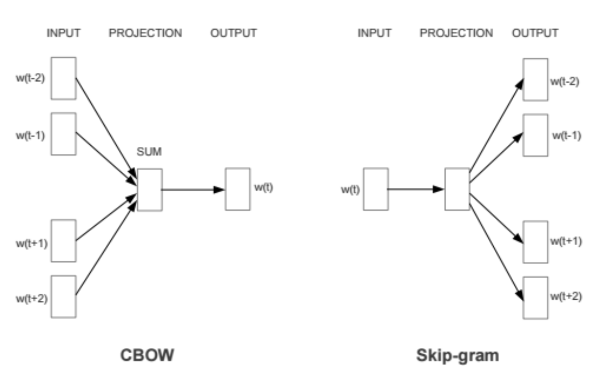

---

# CBOW (Continuous Bag of Words)
"Predict the center from the surroundings."
1. **Input**: One-hot vectors of all context words in the window.
2. **Projection**: Pull the context embeddings from the **Input Matrix** ($W$) and average them.
3. **Output**: Multiply that average by the **Target Matrix** ($W'$) to get raw scores for the whole vocab.
4. **Softmax**: Convert scores to probabilities.
5. **Loss**: Compare the probability of the actual target word (e.g., "sat") to the model's guess using **Cross-Entropy**.
6. **Backprop**: Nudge the vectors in both $W$ and $W'$ to reduce the error.

---

# Skip-gram (The Inverse)
"Predict the surroundings from the center." This is often called the "harder" task, which usually results in better embeddings for rare words.
* **Input:** The one-hot vector for one target word.
* **Projection:** Pull just one embedding vector.
* **Output:** Try to predict multiple context words independently.
* **Logic:** If I give you the word "sat," the model has to learn that "cat," "on," and "the" are all high-probability neighbors.

---

# Why this works (The "Softmax" Goal)
We are not subtracting vectors during training. We are comparing probability distributions.

If the model predicts a 60% chance for "sat" ($0.6$), the "Signal" for backpropagation is the 40% error ($1.0 - 0.6$). The **gradient descent** process then travels back into the weights:
* It strengthens the connection between the context words and "sat."
* It weakens the connection between those context words and everything else (like "airplane").

---

# Summary of RNN to Word2Vec
By simplifying the **RNN** into these **window-based** architectures, **Word2Vec** achieved:
* **Speed**: Could be trained on the 100-billion-word Google News dataset.
* **Linear Relationships**: The surprising discovery that $Vec(\text{"King"}) - Vec(\text{"Man"}) + Vec(\text{"Woman"})$ resulted in a vector very close to $Vec(\text{"Queen"})$.

---

# Why Word2Vec Replaced LSA/SVD
By 2013, **Latent Semantic Analysis (LSA)** was the industry standard. It was mathematically sound, but it struggled with the sheer scale of the internet. Mikolov’s **Word2Vec** didn't just offer better vectors; it offered a more scalable way to learn.

---

# Computational Efficiency (Local vs. Global)
* **LSA (Global):** To run LSA, you must first build a **Global Co-occurrence Matrix**. If your vocabulary is 100,000 words, you need a $100,000 \times 100,000$ matrix. Running SVD on a matrix of this size is "memory-heavy" and computationally "expensive." If you add one new document to your corpus, you theoretically have to re-run the entire math for the whole matrix.
* **Word2Vec (Local):** Word2Vec is **Stream-based**. It only ever looks at 5–10 words at a time (the sliding window). It doesn't need to see the whole corpus to start learning. This means it can be trained on billions of words using a standard computer, whereas LSA would crash due to memory limits.

---

# The Discovery of Linear Analogies
The most famous reason for Word2Vec’s success was the discovery that its vector space preserved **Relational Logic**.
* LSA is great at **Topical Association** (knowing that Paris and France are related).
* Word2Vec captures **Specific Directions**. Because it predicts words in local slots, it maps the "step" from a Country to its Capital as a consistent vector direction.
* This allowed for the famous **vector arithmetic**: $\vec{v}(King) - \vec{v}(Man) + \vec{v}(Woman) \approx \vec{v}(Queen)$. LSA rarely achieves this level of precise geometric regularity.

---

# Scalability and "Online" Learning
* **Scale:** Because Word2Vec is a neural network, it scales linearly with the size of the data. You can feed it 100 billion words from Google News, and it just keeps getting better.
* **Flexibility:** Word2Vec is an "Online" model. You can take a model pre-trained on Wikipedia and **"fine-tune"** it on medical journals. You don't have to start from scratch. With LSA, incorporating new data into an existing "concept space" is mathematically much more difficult.

---

# Skip Gram: Different Approach to Training and Labels

If the standard **"Softmax"** flow is a **Multi-class Classification** (predicting 1 word out of 80,000), then **Negative Sampling** is a **Binary Classification** (predicting if a pair is "Real" or "Fake").

Instead of asking "What is the next word?", we ask: "Is word $C$ likely to show up near word $T$?"
* **Positive Samples:** Words that actually appear in the window together (e.g., Paris and France). We want the model to output 1 (Yes).
* **Negative Samples:** Words randomly picked from the dictionary (e.g., Paris and Puddle). We want the model to output 0 (No).

To make the math work, every word has two identities: 
* **Target Embedding ($v_w$):** Used when the word is the "Center."
* **Context Embedding ($u_w$):** Used when the word is a "Neighbor."

The model starts with random numbers and iteratively shifts the vectors:
* **Increase Similarity:** If a pair is Positive, we maximize their **Dot Product**. This moves the target and context vectors closer together in space.
* **Decrease Similarity:** If a pair is Negative, we minimize their **Dot Product**. This pushes the vectors away from each other.

The objective is to maximize the probability of the actual context words ($w_{pos}$) and minimize the probability of the $k$ random negative words ($w_{neg}$):

$$\mathcal{L} = \log \sigma(v_{target} \cdot u_{pos}) + \sum_{i=1}^{k} \log \sigma(-v_{target} \cdot u_{neg_i})$$

Wait, why use $\sigma$ (Sigmoid)? The Sigmoid function takes any dot product and squashes it between 0 and 1. This turns a mathematical score into a "probability of being a real neighbor."

---

# Why this is "Hard to Understand"
The confusion usually stems from the fact that we are training two matrices ($W$ and $W'$) simultaneously. After training is finished, we usually throw away the Context Matrix ($W'$) and only use the Target Matrix ($W$) as our final word embeddings.

---

# Glove (Pennington et al 2014)
To understand **GloVe (Global Vectors)**, you have to see it as the "peace treaty" between the two worlds we’ve discussed: the **Global Matrix Factorization** of LSA and the **Local Context Prediction** of Word2Vec.

Pennington et al. (2014) argued that both previous methods were flawed. LSA uses global statistics but is bad at analogies; Word2Vec is great at analogies but "wastes" data because it only looks at local windows and ignores how often words appear across the whole corpus.

> GloVe: Global Vectors for Word Representation

GloVe’s core insight is that **ratios of co-occurrence probabilities** are the true carriers of meaning, not just the raw counts.

GloVe tries to solve the **matrix factorization problem** ($X = FC^\top$) but does so using a weighted least squares objective.
* $X$: A global word-word co-occurrence matrix (counts how many times word $i$ appears in the context of word $j$ across the entire corpus).
* $F$: Focal/Target embeddings.
* $C$: Context embeddings.
* The Goal: Find vectors such that their dot product equals the log of their co-occurrence count: $w_i \cdot \tilde{w}_j \approx \log(X_{ij})$.

---

# Why Ratios Matter (The "Ice" vs. "Steam" Example)
This is the "aha!" moment of the **GloVe** paper. Consider the relationship between "Ice", "Steam", and a probe word "Water":
1. $P(\text{water} \mid \text{ice})$ is high.
2. $P(\text{water} \mid \text{steam})$ is high.
3. The ratio $\frac{P(\text{water} \mid \text{ice})}{P(\text{water} \mid \text{steam})}$ is close to 1 (since water is related to both).

Now consider the probe word "Solid":
1. $P(\text{solid} \mid \text{ice})$ is high.
2. $P(\text{solid} \mid \text{steam})$ is low.
3. The ratio $\frac{P(\text{solid} \mid \text{ice})}{P(\text{solid} \mid \text{steam})}$ is very large.

GloVe is designed so that the vector differences capture these ratios. This is why it is so good at analogies—the math is explicitly built to preserve these proportional relationships.

In LSA, rare co-occurrences (noise) and extremely frequent ones ("the", "and") carry too much weight. GloVe introduces a weighting function that: 
1. Caps the influence of very frequent words (so "the" doesn't dominate).
2. Ignores zeros (so sparse data doesn't break the model).
3. Gives more weight to pairs that appear together more often, but only up to a point.

---

# GloVe vs. Word2Vec
In Word2Vec, the model might see "Ice" and "Water" together 1,000 times and think they are related.
In GloVe, the model looks at the ratio: How much more often does "Ice" appear with "Solid" compared to how often "Steam" appears with "Solid"? It is this contrast between words across the entire dataset that creates the high-precision vector space GloVe is famous for.

---

# Correlation with Human Judgement
In the paper "Don’t count, predict! A systematic comparison of context-counting vs. context-predicting semantic vectors" (Baroni et al., 2014), researchers wanted to settle a debate: Is it better to build a giant table and count word overlaps (PPMI/LSA), or is it better to use the Word2Vec approach of predicting neighbors?

Baroni compared two main types of models:
* **Count-based:** Traditional distributional models that use **PPMI** weighting and sometimes **SVD** (like **LSA**). These models literally **"count"** frequencies across the whole corpus.
* **Predict-based:** Neural models like Word2Vec (Skip-gram/CBOW). These models "predict" the context in which a word appears.

The study found that **predict-based** models (Word2Vec) consistently outperformed **count-based** models across almost all tasks. These tasks included:
* **Synonym detection:** Finding which word is most similar to a target.
* **Concept categorization**: Grouping "apple" and "pear" as fruits.
* **Analogy solving:** The $King - Man + Woman = Queen$ tests.

The "Human Judgement" part of your note refers to **Intrinsic Evaluation**. To see if a model is "good," we compare its mathematical similarity scores to human scores.

**The Test:** Humans are asked to rate word pairs (e.g., "How similar are Cup and Mug on a scale of 1–10?").

**The Metric:** Researchers use **Spearman’s Rank Correlation**. If the humans rank Cup/Mug as very similar and Cup/Cloud as very different, and the model’s vector distances show the exact same ranking, the model has a high correlation with human judgment.

**The Result:** Baroni showed that Word2Vec vectors "aligned" with human intuition much more closely than the old PPMI counting methods.

Your note "dont bother counting just predict cooccurences" captures the radical conclusion of the paper. It suggested that the neural "prediction" task is a more powerful way to extract meaning than raw statistical counting.

The neural network acts as a smarter filter — it ignores the noise and focuses on the underlying semantic "slots" that words fill, which is closer to how humans perceive meaning.

---

# What is Specical About Word2Vec and Glove
This section refers to the landmark paper **"Neural Word Embedding as Implicit Matrix Factorization"** (Levy & Goldberg, 2014).

Before this paper, people thought **Word2Vec** worked because of "neural magic." Levy and Goldberg proved that Word2Vec wasn't doing anything mathematically "new" — it was actually just a very efficient way of doing **Matrix Factorization** on a **PPMI** matrix.

The reason Word2Vec seemed better than the old counting methods **wasn't the neural network** itself; it was the **hyperparameters** (the settings) used during training. The authors showed that if you apply these same "tricks" to traditional **PPMI/SVD** models, the old models perform just as well as Word2Vec.

These hyperparameters are the real reason Word2Vec and GloVe outperform basic counting.

---

### 1. Dynamic Context Window
Instead of treating all words in a window ($+/- 5$) equally, the model weights them by distance. Words closer to the target get more weight than words further away. This captures the intuition that immediate neighbors are more semantically relevant.

---

### 2. Subsampling
Frequent words like "the" or "and" carry very little information but appear constantly. Subsampling randomly removes these words from the training data, forcing the model to focus on more meaningful relationships (like "coffee" and "cup").

---

### 3. Deleting Rare Words
Words that appear only once or twice are mostly noise (spelling mistakes, rare names). By deleting them entirely before building the context windows, you reduce the size of the vocabulary and stop the model from trying to learn "nonsense" patterns.

---

### 4. Context Distribution Smoothing (CDS)
When calculating PMI, the "negative" impact of frequent words is often too strong. CDS raises the context word frequencies to a power (usually $0.75$), which effectively "boosts" the probability of rare contexts and prevents common words from dominating the math.

---

### 5. Negative Sampling / Shifted PMI
As you noted, this shifts the PMI values by a constant $k$. Mathematically: $PMI(w,c) - \log(k)$. This acts as a filter. It ensures that the model only considers a context "important" if its association is significantly higher than a random baseline.

---

### 6. Combining Word and Context Vectors
In Word2Vec/GloVe, every word ends up with two vectors (Target $W$ and Context $W'$). Levy and Goldberg found that simply adding these two vectors together ($W + W'$) often produces a better, more robust embedding than just using one.

--

### 7. Eigenvalue Weighting in SVD
In traditional SVD (LSA), we often treat all "latent dimensions" equally. This trick suggests weighting the dimensions by their singular values (the eigenvalues). It helps the model prioritize the "strongest" semantic signals over the weaker ones.

---

# Disadvantages of Low-Density (Dense) Representations

---

### Lack of Interpretability (The "Black Box")
In a traditional co-occurrence matrix, if Dimension 405 has a high value, you can look it up and see it represents the word "banana." You know exactly why two words are similar. In a 300-dimensional Word2Vec space, Dimension 42 doesn't have a name. It is a mathematical abstraction. You cannot "interrogate" the vector. If the model says "Doctor" and "Hospital" are similar, you can't easily ask it which specific feature led to that conclusion. The meaning is "distributed" across all 300 dimensions.

---

### Non-Determinism (The "Random" Factor)
Because Word2Vec and GloVe use Neural Optimization (Gradient Descent), they are non-deterministic. Every time you start training, the vectors are initialized with different random numbers. The model "descends" a loss landscape. Depending on where it starts, it might get stuck in a different "valley" (local minimum) each time. It can never be 100% sure it found the "perfect" global minimum. If you train the exact same model on the exact same data twice, you will get two different sets of vectors.

---

### Incomparability
Because of this non-determinism, you cannot compare two different runs directly. If you train a model on 1990s news and another on 2020s news, you can't just subtract the vectors to see how the word "Amazon" has changed. The "coordinate systems" are completely different; Dimension 1 in the first run might correspond to Dimension 200 in the second. You would need to use a technique called Procrustes Alignment to "rotate" one space to match the other before comparing. 

---

### The "Silver Lining" of Non-Determinism
Stability as a Proxy for Truth: If you run the model 10 times with 10 different random seeds, and "nurse" is a top-5 neighbor of "doctor" in all 10 runs, you can be statistically confident that the relationship is "real" and not just a fluke of the random initialization. If a neighbor only appears in 1 out of 10 runs, it's likely just noise.

---

# Compositional Distributional Semantics
This is the "final boss" of distributional semantics: **Compositionality**. While we have mastered representing individual words, language is built on phrases and sentences. How do we mathematically combine two vectors into one?

**The core question is:** If we have $\vec{u}$ (male) and $\vec{v}$ (nurse), what is $\vec{p}$ (male nurse)? Mitchell and Lapata (2008) introduced two primary models for this.

---

### Option 1: Intersective (Multiplicative) Composition
This model assumes a feature is only relevant if it is associated with all parts of the phrase.
* **Intuition:** "Male nurse" is the intersection of "maleness" and "nursing.
* **Formula:** $\vec{p} = \vec{u} \odot \vec{v}$ (Pointwise Multiplication).
* **The Math:** For each dimension $i$, $p_i = u_i \times v_i$.
* **The Problem:** Pointwise multiplication is "aggressive." If a feature has a $0$ in the "male" vector but a high value in "nurse," the result is $0$.
* **Result:** As you add more words (e.g., "young male nurse"), the vector becomes sparser and tends toward zero, eventually losing all information.

---

### Option 2: Additive Composition
This model assumes a feature is relevant if it is associated with any part of the phrase.
* **Intuition:** A "male nurse" inherits features from both "male" and "nurse."
* **Formula:** $\vec{p} = \vec{u} + \vec{v}$ (Vector Addition).
* **The Math:** For each dimension $i$, $p_i = u_i + v_i$.
* **The "Centroid" Problem:** As you add more and more words (e.g., a whole paragraph), the vector tends toward the geometric center of the entire semantic space. It becomes a "generic" vector that is slightly related to everything but specifically describes nothing.
* **Fix:** Often, we use a weighted addition or re-normalization to keep the vector length manageable.

---

# Challenges of Compositional Models
Even with complex math, these simple operations struggle with the nuances of human language:

---

### Non-Compositional Phrases (Idioms)
"Kick the bucket" does not mean the addition of "kicking" + "buckets." Distributional models that rely on composition will completely fail on metaphors and idioms because the meaning of the whole is not the sum of its parts.

---

### Word Order (The "Bag of Words" Problem)
Vector addition and multiplication are commutative.

* $\vec{v}(\text{dog}) + \vec{v}(\text{bites}) + \vec{v}(\text{man})$
* $\vec{v}(\text{man}) + \vec{v}(\text{bites}) + \vec{v}(\text{dog})$

The resulting vector is identical, even though one is a common occurrence and the other is news. Simple composition ignores the vital information found in syntax and word order.

---

### Negation and Function Words
How do you represent "not"? If you add "not" to "happy," you get a vector that is still very close to "happy" (since they share many contexts). Logic requires "not happy" to be the opposite or an inversion, but simple vector math doesn't handle logical operators well.

---

# Evaluation: How do we know it worked?
Evaluation moves from word similarity to Sentence/Phrase Similarity.

**Intrinsic**: Human Similarity Judgments. We ask humans to rate the similarity of "male nurse" and "doctor." We then see if our composed vector for "male nurse" has a high cosine similarity to "doctor."

**Extrinsic** (Application-based): Paraphrase Detection. Can the model tell that "The boy ate the apple" and "The fruit was consumed by the child" mean the same thing? If the composed vectors for both sentences are close together, the model is successful.

--- 

# Composition Summary 
Compositionality in distributional semantics explores how to mathematically combine individual word vectors to represent the meaning of phrases or sentences. **Additive composition** ($u + v$) treats the resulting phrase as a union of features, where a "male nurse" inherits characteristics from both "male" and "nurse"; however, this approach risks "diluting" the meaning into a generic centroid as more words are added. Conversely, intersective or **multiplicative composition** ($u \odot v$) acts as a filter, retaining only the features shared by all words in the phrase. While this captures specific overlaps well, it often leads to "sparsity," where the vector quickly collapses toward zero. Despite these methods, compositionality remains a major challenge because simple vector algebra struggles to account for word order ("man bites dog" vs. "dog bites man"), logical negation, and non-compositional idioms like "kick the bucket," where the total meaning is not found in the sum of its parts.

--- 

<br>
<br>
<br>

# Week 4: Seminar

The seminar was largely a recover of the lecture content. There was not a specific set of seminar questions. 

---

<br>
<br>
<br>

# Week 4: Paper 

> Linguistic Regularities in Continuous Space Word Representations by Mikolov, Yih, and Zweig (2013)

This 2013 paper (by Mikolov, Yih, and Zweig) is the one that really "sold" word embeddings to the world. While the other Mikolov papers focus on the speed and the RNN architecture, this specific paper focuses on the linguistic beauty of the vector space. Before this paper, word vectors were evaluated based on how well they helped a model predict the next word (perplexity). This paper proposed a much more exciting idea: word vectors actually capture human-like reasoning. The authors showed that vectors aren't just arbitrary points; they encode linguistic relationships as geometric offsets (vectors).

The paper proved that semantic and syntactic relationships are represented by consistent vector distances.The Logic: If you take the vector for "King" and subtract the vector for "Man", you are left with a "royalty" vector. If you add that to "Woman", the result is closest to the vector for "Queen".The Formula: $V(Queen) \approx V(King) - V(Man) + V(Woman)$

#### Week 4: Paper Questions
1. [What are the main findings of this paper? Are you convinced?](#1-what-are-the-main-findings-of-this-paper-are-you-convinced)
2. [What do the authors claim is the main advantage of using distributed representations of words (aka. embeddings) over classical n-gram language models?](#2-what-do-the-authors-claim-is-the-main-advantage-of-using-distributed-representations-of-words-aka-embeddings-over-classical-n-gram-language-models)
3. [What is meant by a syntactic analogy? Give some examples of your own. Use some examples to explain why word2vec embeddings might be good at capturing syntactic regularities. Do you think the same would apply to other distributional word representations?](#3-what-is-meant-by-a-syntactic-analogy-give-some-examples-of-your-own-use-some-examples-to-explain-why-word2vec-embeddings-might-be-good-at-capturing-syntactic-regularities-do-you-think-the-same-would-apply-to-other-distributional-word-representations)
4. [ What is meant by a semantic analogy? Give some examples of your own. Use some examples to explain why word2vec embeddings might be good at capturing semantic regularities. Do you think the same would apply to other distributional word representations?](#4-what-is-meant-by-a-semantic-analogy-give-some-examples-of-your-own-use-some-examples-to-explain-why-word2vec-embeddings-might-be-good-at-capturing-semantic-regularities-do-you-think-the-same-would-apply-to-other-distributional-word-representations)
5. [Explain the vector offset method used to answer an analogy question. In particular, what happens when no word exists at the predicted position?](#5-explain-the-vector-offset-method-used-to-answer-an-analogy-question-in-particular-what-happens-when-no-word-exists-at-the-predicted-position)
6. [What do you think of the results for identifying syntactic regularities? Is answering more than 1 in 3 questions correctly a good result? Are there any obvious trends in the results?](#6-what-do-you-think-of-the-results-for-identifying-syntactic-regularities-is-answering-more-than-1-in-3-questions-correctly-a-good-result-are-there-any-obvious-trends-in-the-results)
7. [Do you think the comparisons with other methods are fair? Why do the authors use a different test set when comparing with Collobert & Weston (2008) and Mnih & Hinton (2009)? Does this test set appear to be easier or harder than the original one?](#7-do-you-think-the-comparisons-with-other-methods-are-fair-why-do-the-authors-use-a-different-test-set-when-comparing-with-collobert--weston-2008-and-mnih--hinton-2009-does-this-test-set-appear-to-be-easier-or-harder-than-the-original-one)
8. [What do you think of the results for identifying semantic regularities? Why are results given for](#8-what-do-you-think-of-the-results-for-identifying-semantic-regularities-why-are-results-given-for)

---

### 1. What are the main findings of this paper? Are you convinced?

The paper demonstrates that word representations learned by neural network language models (specifically RNNs) capture consistent linguistic regularities as linear vector offsets. By using a new analogy-based evaluation ($A:B :: C:D$), the authors show that relationships like verb tense or capital cities are encoded geometrically, allowing for vector arithmetic such as $King - Man + Woman \approx Queen$. This is a convincing shift in evaluation because it moves beyond simple similarity to prove that the model captures structured, relational knowledge.

---

### 2. What do the authors claim is the main advantage of using distributed representations of words (aka. embeddings) over classical n-gram language models?

The primary advantage is the ability to generalize to unseen sequences by mapping words into a continuous, dense vector space. While classical n-grams suffer from sparsity—having no information about word sequences not explicitly seen in the training data—embeddings "smooth" the space so that semantically similar words (e.g., "sapphire" and "azure") share similar coordinates. This allows the model to assign high probabilities to novel phrases based on their components' proximity to known examples, effectively solving the "zero-count" problem and reducing perplexity.

---

### 3. What is meant by a syntactic analogy? Give some examples of your own. Use some examples to explain why word2vec embeddings might be good at capturing syntactic regularities. Do you think the same would apply to other distributional word representations?

A syntactic analogy relates to the grammatical form of words, such as "walking : walk :: climbing : climb." Word2Vec captures these because words with the same grammatical suffix or tense appear in nearly identical functional contexts (e.g., following auxiliary verbs like "is" or "was"), leading to parallel vector offsets for specific rules like pluralization or tense. While traditional models like LSA often "wash out" these subtle cues by using large context windows, newer models like FastText improve on this further by representing words as bags of character n-grams, allowing them to calculate syntactic positions even for rare or unseen word forms.

---

### 4. What is meant by a semantic analogy? Give some examples of your own. Use some examples to explain why word2vec embeddings might be good at capturing semantic regularities. Do you think the same would apply to other distributional word representations?

A semantic analogy captures conceptual relationships and real-world knowledge, such as "London : England :: Paris : France." Word2Vec excels here because the vector "jump" between a country and its capital represents a specific semantic direction that remains consistent across the entire space. While earlier global models like LSA are better at broad topical association (grouping "doctor" with "hospital"), they often lack the fine-grained directional precision of Word2Vec or GloVe, the latter of which was explicitly engineered to preserve these relational ratios in its global statistics.

---

### 5. Explain the vector offset method used to answer an analogy question. In particular, what happens when no word exists at the predicted position?

The vector offset method solves analogies by calculating the displacement between two words ($\vec{v}(B) - \vec{v}(A)$) and adding it to a third ($\vec{v}(C)$) to predict the position of the fourth. Because the resulting coordinate exists in a continuous space, it rarely lands exactly on a pre-existing word vector; instead, the model performs a nearest-neighbor search using cosine similarity to find the closest word in the vocabulary. To ensure meaningful results, the input words $A, B,$ and $C$ are typically excluded from the search results to avoid the model simply returning the starting words.

---

### 6. What do you think of the results for identifying syntactic regularities? Is answering more than 1 in 3 questions correctly a good result? Are there any obvious trends in the results?

Answering more than 1 in 3 questions (approx. 33%–40% in this early paper) was a significant breakthrough at the time, as previous models often performed near 0% on such precise relational tasks. A clear trend in the results is that syntactic regularities are often easier for these models to capture than semantic ones, as grammatical rules (like pluralization) are applied more consistently across the corpus than world-knowledge relationships, which can be affected by data sparsity or polysemy.

---

### 7. Do you think the comparisons with other methods are fair? Why do the authors use a different test set when comparing with Collobert & Weston (2008) and Mnih & Hinton (2009)? Does this test set appear to be easier or harder than the original one?

The comparisons are somewhat limited because the authors had to use different test sets for models like Collobert & Weston (2008) to accommodate the original researchers' specific vocabulary and training constraints. This second test set is generally considered easier than the original because it often features more common words and simpler relationships. While this makes a direct "head-to-head" comparison difficult, it was a necessary compromise to evaluate different architectures that weren't trained on the same massive Google News datasets.

---

### 8. What do you think of the results for identifying semantic regularities? Why are results given for
Semantic results are reported using Spearman’s Rank Correlation and MaxDiff Accuracy because semantic similarity is often subjective and continuous rather than binary. Spearman’s Rank measures how well the model’s similarity ordering aligns with human intuition (e.g., ranking "cat/dog" higher than "cat/spoon"), while MaxDiff asks the model to identify the most and least similar pairs in a set. This provides a more nuanced view of the model’s conceptual "common sense" than a simple correct/incorrect accuracy score used for rigid syntactic rules.

---

# Week 4 - Additional Reading

### Reference

| Title | Author | Year | Publication |
| :--- | :--- | :--- | :--- |
| Don’t count, predict! A systematic comparison of context-counting vs context-predicting semantic vectors | Baroni, Dinu and Kruszewski | 2014 | ACL |
| Similarity-based estimation of word co-occurrence probabilities | Dagan, Pereira and Lee | 1994 | ACL |
| Neural Word Embeddings as Implicit Matrix Factorization | Levy and Goldberg | 2014 | NIPS |
| Improving Distributional Similarity with Lessons Learned from Word Embeddings | Levy, Goldberg and Dagan | 2015 | TACL |
| An Introduction to Latent Semantic Analysis | Landauer, Foltz and Laham | 1998 | Discourse Processes |
| Efficient Estimation of Word Representations in Vector Space | Mikolov, Chen, Corrado and Dean | 2013 | arXiv |
|  Linguistic regularities in continuous space word representations | Mikolov, Yih and Zweig | 2013 | NAACL |
| The Microsoft Research sentence completion challenge | Zweig and Burges | 2011 | Microsoft Research Technical Report |
---

<br>
<br>
<br>

# [Week 5 - Applications in NLP](https://canvas.sussex.ac.uk/courses/36171/pages/week-slash-topic-5-applications-in-nlp)

The ultimate goal of language modeling is rarely just to calculate the probability of a string of words or to find the mathematical distance between two vectors; rather, these models serve as the foundational engine for real-world applications. By treating language as a sequence of discrete units, we can apply different computational frameworks to solve diverse problems: Sequence Classification allows us to categorize entire documents (such as detecting sentiment or spam), while Sequence Labelling enables us to interrogate the internal structure of a sentence (such as identifying parts of speech or named entities). This week, we transition from theoretical word representations to practical architectures, exploring how traditional Bayesian methods like Hidden Markov Models (HMMs) have paved the way for modern, high-performance neural pipelines. Understanding these applications now provides the necessary grounding for when we eventually substitute these basic models with more advanced Transformer-based architectures in the coming weeks.

#### Week 5: Contents

1. [Lecture](#week-5-lecture)
2. [Seminar](#week-5-seminar)
3. [Paper](#week-5-paper)
4. [Additional Readings](#week-5-additional-reading)

---

# Week 5: Lecture
Week 5 marks a critical transition in the module from the theoretical construction of word representations to their practical application in real-world systems. Having established how to represent language as dense vectors, we now explore the two primary frameworks for processing text: **Sequence Classification** and **Sequence Labeling**. In classification, the model acts as a "judge," mapping an entire input string—regardless of length—to a single global category, such as sentiment or topic. In labeling, the model acts as a "tagger," assigning a specific category to every individual token in the sequence. This distinction is vital for moving beyond simple word-sense identification toward structural analysis, such as **Named Entity Recognition** (NER) and **Part-of-Speech** (PoS) tagging.

Architecturally, we trace the evolution of these tasks from traditional Bayesian strategies, like **Naive Bayes and Hidden Markov Models (HMMs)**, to modern deep learning pipelines. We examine how simple **additive composition** (pooling word vectors) serves as a fast baseline, but ultimately fails to capture the "logic" of word order. To solve this, we introduce the **Bi-directional LSTM**, which builds a context-aware representation by reading the text from both directions simultaneously. A key highlight of the week is the **Ma and Hovy (2016)** "sandwich" architecture, which demonstrates how combining **Character-level CNNs** (for morphology), **Bi-LSTMs** (for context), and **CRF layers** (for global sequence logic) creates a robust system capable of handling out-of-vocabulary words and complex label dependencies.

Finally, the week addresses the rigorous nature of **Evaluation**. We move beyond simple Accuracy to explore the nuances of **Precision**, **Recall**, and the **F1-Score**, particularly in the context of unbalanced datasets. By comparing **Macro-averaging** (which protects minority "underdog" classes) with **Micro-averaging** (which focuses on overall sample success), we gain the analytical tools necessary to critique model performance in high-stakes applications like propaganda detection. This grounding in task-specific architectures and metrics provides the essential bridge to the generative and transformer-based models arriving in the final third of the course.

#### Week 5: Lecture Contents
* [**Part 1: Sequence Classifciaiton**](#part-1-sequence-classifciaiton)
    * [What is Sequence Classification?](#what-is-sequence-classification)
    * [How do we represent the sequence?](#how-do-we-represent-the-sequence)
    * [The Subtle Different Betwween Word2Vec and Neural Models](#the-subtle-different-betwween-word2vec-and-neural-models)
        * [The Key Distinction: "Static" vs. "Dynamic"](#the-key-distinction-static-vs-dynamic)
    * [Sequence Classification: Evalulation](#sequence-classification-evalulation)
        * [Evaluation: Precision, Recall, and F1](#evaluation-precision-recall-and-f1)
        * [Macro vs. Micro Averaging](#macro-vs-micro-averaging)
        * [Macro-Average (The "Class-Centric" Approach)](#macro-average-the-class-centric-approach)
        * [Micro-Average (The "Sample-Centric" Approach)](#micro-average-the-sample-centric-approach)
        * [Why Does it Become Accuracy?](#why-does-it-become-accuracy)
        * [The Issue with Micro-F1 (Inherits from Accuracy)](#the-issue-with-micro-f1-inherits-from-accuracy)
    * [Traditional Representation: Bag-of-Words (BoW)](#traditional-representation-bag-of-words-bow)
    * [The Bayesian Strategy: Naive Bayes](#the-bayesian-strategy-naive-bayes)
    * [Generative Language Modeling](#generative-language-modeling)
    * [The Embedding Approach: Principle of Compositionality](#the-embedding-approach-principle-of-compositionality)
    * [Modern Neural Approach: Bi-directional Sequence Modeling](#modern-neural-approach-bi-directional-sequence-modeling)
---
* [**Part 2: Sequence Labelling**](#part-2-sequence-labelling)
    * [IOB Encoding: Identifying Spans as Sequences](#iob-encoding-identifying-spans-as-sequences)
        * [IOB - Evaluation](#iob---evaluation)
    * [Approaches to Sequence Labelling](#approaches-to-sequence-labelling)
    * [Rule-Based Sequence Labelling](#rule-based-sequence-labelling)
    * [Bayesian Models: Hidden Markov Models (HMMs)](#bayesian-models-hidden-markov-models-hmms)
        * [Drawbacks of HMMs](#drawbacks-of-hmms)
    * [Discriminative Models: MEMMs and CRFs](#discriminative-models-memms-and-crfs)
        * [Maximum Entropy Markov Models (MEMMs)](#maximum-entropy-markov-models-memms)
        * [Conditional Random Fields (CRFs)](#conditional-random-fields-crfs)
    * [Neural Models for Sequence Labelling](#neural-models-for-sequence-labelling)
    * [The Ma and Hovy (2016) Architecture](#the-ma-and-hovy-2016-architecture)
        * [Level 1: Character-level Representations (CNN)](#level-1-character-level-representations-cnn)
        * [Level 2: Word-level Context (Glove + Bi-LSTM)](#level-2-word-level-context-glove--bi-lstm)
        * [Level 3: Sequence Decoding (CRF Layer)](#level-3-sequence-decoding-crf-layer)
    * [Advantages of the Neural Approach](#advantages-of-the-neural-approach)

---

# Applications of Language Modelling
In a couple of weeks we will move into more advanced transformer based models, but first we are going to delve into the applications of language modelling and why we are interested in lanaguage modelling. If we can build a solid grounding in the applications, we should be able to substitue in our advanced models from the applications we have set up using more basic approaches. 

We are rarely interested in estimating the probability of a serquence of words as the end product, or even the similarity of a pair of words. We use these are parts of a wider goal. 

---

# Part 1: Sequence Classification
Sequence classification is the cornerstone of many practical NLP tasks. In this section, we move from understanding individual words to making high-level decisions about entire blocks of text.

---

# What is Sequence Classification?
In sequence classification, we take an input sequence of words—which could be a tweet, a product review, or an entire legal document—and map it to a single label. The term "sequence" is used because it imposes no constraints on the length or type of the text; the model simply processes a string of tokens as a unit.

* **Sentiment Analysis:** (e.g., Positive, Negative, Neutral)
* **Topic Labeling:** (e.g., Sports, Finance, Politics)
* **Spam Detection:** (e.g., Spam, Not Spam)
* **Relevance:** Determining if a document matches a specific query.

Before we train a model, we define the label space (the possible outputs). This determines the type of classification we are performing:
* **Binary Classification:** Choosing between two mutually exclusive classes (e.g., Spam or Not Spam).
*** Multi-class Classification:** Choosing one class from a set of three or more (e.g., classifying a news article as either "Technology," "Health," or "Business").

We can also distinguish between how the model "makes" its decision:
* **Hard Classification:** The model makes a final, definitive choice, placing the sequence into a single "bucket."
* **Soft Classification:** The model outputs a probability distribution across all possible classes (e.g., 60% Hate Speech, 30% Offensive, 10% Neutral). This is much more common in modern NLP, as it accounts for the fact that a long document might touch on multiple topics to varying degrees.

---

# How do we represent the sequence?
To classify text, the computer needs to turn that sequence of words into a numerical format. We will explore three main ways to do this:
* **The Traditional Approach (BoW):** Counting word occurrences and ignoring order.
* **Composition of Embeddings:** Adding or averaging word vectors (Word2Vec/GloVe) to find a "centroid" for the document.
* **Neural Models:** Using RNNs or LSTMs to build a representation that respects word order.

---

# The Subtle Different Betwween Word2Vec and Neural Models
The fundamental difference lies in how word order and context are handled: **Composition of Embeddings** (such as averaging or summing) is a **"bag-of-words"** approach that treats words as independent units, meaning the sentence "man bites dog" would result in the exact same vector as "dog bites man" because simple addition ignores sequence. 

In contrast, Neural Models like RNNs or LSTMs process words **sequentially**, using a mathematical "hidden state" that updates at each step to maintain a memory of what came before. This allows the neural approach to be order-aware and contextual, meaning it can distinguish between different meanings of the same word based on its position in the sentence, whereas simple composition merely calculates the "semantic center" of the vocabulary used.

**Word2Vec** is a neural model used to create the embeddings, but "**Composition**" is how you use them later. We use a neural network (like Word2Vec) to learn that the word "bank" should be represented by a specific vector. During this stage, it does use a context window to learn that meaning. Once the training is done, we "freeze" that vector and throw the neural network away. We are left with a static dictionary of vectors. Now you want to classify the sentence "I went to the bank.":
* If you choose **Composition**, you just grab the frozen vectors for those five words and add them together. You are no longer using a neural network; you are just doing simple math on the "output" of a previous neural network.
* If you choose a **Neural Model** (RNN/LSTM), you feed those frozen vectors into a new moving neural network that reads them one by one.

#### The Key Distinction: "Static" vs. "Dynamic"
* **Composition is Static:** It treats the word "bank" as the **same fixed vector** regardless of the other words in your specific sentence. The "context" was used to create the vector months ago, but it isn't being used to process the sentence right now.
* **Neural Models (RNNs) are Dynamic:** They re-evaluate the context of every word as they read your sentence in real-time. The vector for "bank" is modified by the "memory" of the word "river" that the model just read two tokens ago.

**Summary:** Word2Vec uses a context window to define a word's identity, but an RNN uses a sequential approach to define a word's specific role in a sentence.

This in phase of research, pre-transformers, the progression was to train Word2Vec on a large unlabled corpus and then feed the word embeddings into another RNN/LSTM. The RNN doesn't have to learn what "bank" or "river" means from scratch; it already knows their general identities. Its only job is to learn how those words interact in a specific sequence to determine a label (like Sentiment or Topic). This second step is in leiu of doing composition on the derived vectors. 

---

# Sequence Classification: Evalulation
Now that we have these two ways to classify (the "Smoothie" Additive method or the "Chef" Neural method), how do we decide which one is better? We use a set of metrics that look beyond just "Accuracy."

---

# Evaluation: Precision, Recall, and F1

In classification, **Accuracy** (Total Correct / Total Samples) can be a "trap," especially if your classes are imbalanced (e.g., if 99% of your emails are NOT spam, a model that always guesses "Not Spam" is 99% accurate but totally useless).

To fix this, we use the Confusion Matrix to track four metrics:
* **True Positives (TP):** We said it was Spam, and it was.
* **False Positives (FP):** We said it was Spam, but it was a normal email (The "Annoyance").
* **False Negatives (FN):** We said it was normal, but it was Spam (The "Failure").
* **True Negatives (TN):** We said it was normal, and it was.

---
| Metric | Formula | Intuition |
| :--- | :--- | :--- |
| Precision | TP+FPTP​ | When the model says it's Spam, how often is it right? (Quality) |
| Recall | TP+FNTP​ | Of all the actual Spam out there, how much did we catch? (Quantity) |
| F1-Score | $2⋅Prec+RecPrec⋅Rec$​ | The balanced middle ground (Harmonic Mean). |
---

---

# Macro vs. Micro Averaging

When we move beyond binary (Yes/No) classification to Multi-Class classification, we calculate Precision, Recall, and F1 for each individual class. To get a single score for the whole model, we have to aggregate those results.

---

# Macro-Average (The "Class-Centric" Approach)
Macro-averaging treats every **class as equally important**, regardless of how many samples it contains.

You calculate the F1 for each class **separately** and then take the simple arithmetic mean.

If you have 3 classes (A, B, and C), the formula is $\frac{F1_A + F1_B + F1_C}{3}$

You use this when you want to ensure the model performs well on small, rare classes. If your model is great at the common classes but fails on the rare ones, your **Macro-F1** will be very low. It punishes the model for neglecting the "underdogs."

---

# Micro-Average (The "Sample-Centric" Approach)

Micro-averaging treats every **individual sample as equally important**.

You aggregate the TPs, FPs, and FNs from all classes together first, and then calculate a single F1 score from those totals.

This is essentially **weighted by class size**. If Class A has 900 samples and Class B has 10 samples, Class A will dominate the Micro-average result.

When you care about the **overall success rate** across the entire dataset and aren't specifically worried about whether the model is struggling with a tiny subset of the data.

When we calculate the Micro-average for a multi-class problem (where each instance has exactly** one ground-truth label** and one predicted label), it turns out that Micro-Precision, Micro-Recall, and Micro-F1 all become mathematically identical to **Accuracy**.

---

### Why Does it Become Accuracy?
In a single-label multi-class system, every mistake is a "double-edged sword":
* **The False Positive**: If the model wrongly predicts "Dog" for a picture that is actually a "Cat," it creates a False Positive for the "Dog" class.
* **The False Negative:** At the exact same time, it creates a False Negative for the "Cat" class (because it missed a real cat).

Because every single error is simultaneously a False Positive for one class and a False Negative for another, the total sum of FPs across the whole dataset will always equal the total sum of FNs. When $FPs = FNs$ in the micro-level math, the distinction between Precision and Recall vanishes.

---

### The Issue with Micro-F1 (Inherits from Accuracy)

Because **Micro-F1** just collapses into **Accuracy**, it inherits all of Accuracy's weaknesses:
* **It hides minority failure:** If your model is 99% accurate because it correctly identifies the massive "**Standard**" class but gets 0% correct on the "**Danger**" class, the Micro-F1 will still be 0.99.
* **It creates a false sense of security:** It makes the model look high-performing even if it hasn't learned the "hard" parts of the data.

The only reason we keep it around is to check for **global system robustness**. If you are running a massive commercial system (like a spam filter for millions of users), you might care more about the total number of people affected by errors than the specific performance on a rare sub-type of spam.

However, for scientific research and model development, the **Macro-average** is considered the "true" test. It forces the model to be a "specialist" in every category, not just a "generalist" that wins by sheer volume.

---

# Traditional Representation: Bag-of-Words (BoW)
The classical baseline for sequence classification is the **Bag-of-Words**. It represents a document by the frequency of the words it contains, entirely discarding word order.
* **Benefits:** It is simple, fast, and highly effective for topic classification where the presence of certain keywords is enough to determine the class.
* **Limitations:** By losing order, it loses sentiment and nuance. It cannot distinguish between "The film was not good, it was bad" and "The film was not bad, it was good," as both contain the same counts. It also fails to capture semantic relationships (e.g., "sofa" and "couch" are treated as completely unrelated).

--- 

# The Bayesian Strategy: Naive Bayes
The traditional machine learning approach uses the **Naive Bayes classifier**. It is "Naive" because it assumes that every word in a document is independent of every other word.

Using **Bayes' Theorem**, we find the most likely class $C$ for a sequence of words $w$:

$$P(C|w) = \frac{P(w|C)P(C)}{P(w)}$$

In practice, we ignore the denominator ($P(w)$) because it is constant for all classes, and we maximize:

$$P(C) \prod_{i=1}^{n} P(w_i|C)$$

---

# Generative Language Modeling
We can extend this by building a separate **Language Model** for each class. We calculate the probability of the entire sequence given the class-specific model, $P(\text{seq} | \text{class})$. While $n$-gram models can do this, they have largely been superseded by embedding-based approaches.

---

# The Embedding Approach: Principle of Compositionality
Following the **Distributional Hypothesis**, we use word embeddings (Word2Vec/GloVe) to represent meaning. To move from **word-level** to **sequence-level** representations, we rely on **Compositionality**.

#### Additive Composition (Pooling)
The most common "quick" rule is to add or average the vectors of the words in a sequence to find the **Centroid**.

**Mechanism:** You take your word embeddings, pass them through a "**Pooling**" layer (Mean or Sum), and feed the resulting sequence vector into a standard classifier (Logistic Regression or SVM).

**Drawback:** These are uncontextualized. The vector for "head" is the same whether it means "body part" or "leader." Furthermore, word order is still ignored because vector addition is commutative.

---

# Modern Neural Approach: Bi-directional Sequence Modeling
To truly capture context and order, we use a **Bi-directional RNN** or **LSTM**. This creates a full, "order-aware" representation of the sequence.

1. **Forward Pass ($f_y$):** Reads the sequence from left to right, building a state based on the history of what came before.
2. **Backward Pass ($b_y$):** Reads from right to left, building a state based on the "future" context.
3. **Concatenation:** We take the final hidden states from both directions and concatenate them.

This resulting vector is a fixed-length representation that contains the entire "story" of the sequence from both perspectives. This final representation is then fed into a prediction network for classification.

---

| Method | Order Sensitive? | Semantic Aware? | Complexity |
| :--- | :--- | :--- | :--- | 
| BoW | No | No | Very Low | 
| Embedding Pooling | No | Yes (Word2Vec) | Low |
| Bi-directional LSTM | Yes | Yes (Contextual) | High | 

---

# Part 2: Sequence Labelling
In contrast to sequence classification, where we assign one label to an entire document, **Sequence Labelling** requires us to assign a label to every individual element (or token) within that sequence.

The input is typically a sequence of words, but depending on the task, it could also be a sequence of characters or sub-word units. The goal is to produce an output sequence of labels that is exactly the same length as the input sequence.

Traditionally, sequence labelling has been the engine behind two fundamental NLP tasks:
* **Part-of-Speech (PoS) Tagging**: Identifying the grammatical category of each word, such as whether it is a noun, verb, or adjective.
* **Named Entity Recognition** (NER): Identifying and categorizing "entities" within text, such as people, organizations, or locations.

These tasks are rarely performed in isolation; in complex pipelines, they are often layered on top of each other, where the output of a PoS tagger might be used as a feature to improve the accuracy of a Named Entity Recognizer.

---

# IOB Encoding: Identifying Spans as Sequences
A major challenge in sequence labelling is that entities often span multiple words (e.g., "New York City" or "Elon Musk"). Since our model predicts one label per token, we need a way to tell the computer that these individual words belong together as a single unit. We solve this using **IOB Encoding** (Inside, Outside, Beginning).

Instead of simply labelling a word as a "Person" or "Location," we add a prefix to the tag to indicate its position within a span:
* **B- (Beginning):** Indicates the first token of a named entity.
* **I- (Inside):** Indicates any subsequent tokens that are part of the same entity.
* **O (Outside):** Indicates that the token is not part of any named entity.

By using **IOB encoding**, we turn a span identification problem (finding the start and end of a phrase) into a simple sequence labelling problem (assigning one tag per token). This allows us to use standard classification architectures without needing complex "layering" or multi-token logic. The model simply learns that an **I-** tag must logically follow a **B-** tag of the same type, which helps it maintain the structural integrity of the entity spans.

---

# IOB - Evaluation
Evaluating sequence labelling is more demanding than simple classification because we aren't just checking if we got a word's category right; **we are checking if we identified the entire span correctly**.

In **Named Entity Recognition (NER)** using **IOB** encoding, we typically use strict evaluation. For an entity to be counted as a "True Positive," the model must correctly identify:
1. The boundary (the exact start and end tokens).
2. The label (e.g., PER vs. LOC).

If the model predicts "New York" as a location but misses "City," it is often counted as both a False Negative (for the correct span "New York City") and a False Positive (for the incorrect span "New York").

* **Precision:** Of all the entity spans the model predicted, how many were exactly right?
* **Recall:** Of all the actual entity spans in the text, how many did the model successfully find?
* **F1-Score:** The harmonic mean used to balance the trade-off between missing entities and hallucinating incorrect ones.

While sequence labelling looks like a series of individual classifications (word by word), we treat it as a **Global Task**. We want to find the most likely sequence of labels given the entire sequence of tokens.

This is a critical distinction:
* We don't just want the best tag for word #5.
* We want the best path of tags from word #1 to word #10. 
This requirement is why simple classifiers like Naive Bayes or Logistic Regression are often replaced by models that can handle dependencies between tags, such as **HMMs** or **CRFs**.

---

# Approaches to Sequence Labelling
* **Rule-based:** Using dictionaries and regular expressions (still common for specific domains like medical IDs).
* **Bayesian Models (HMMs):** Treating labels as hidden states that "generate" words.
* **Discriminative Models (CRFs):** Modeling the dependencies between labels directly.
* **Neural Models (Bi-LSTMs):** Using deep learning to extract features without manual engineering.

---

# Rule-Based Sequence Labelling
Before the dominance of machine learning, sequence labelling relied entirely on human-defined logic. Despite the rise of neural networks, rule-based systems remain very common in practice because they are transparent, "cheap" to build for specific domains, and require zero training data.

In modern industry, these are often used as "baselines" or combined with supervised ML in hybrid systems to catch "easy" entities while the model handles the complex ones.

---

# Bayesian Models: Hidden Markov Models (HMMs)
Moving into probabilistic territory, we encounter **Hidden Markov Models (HMMs)**. This approach treats labels as hidden states that "generate" the observed words.

An HMM assumes that there is an underlying sequence of tags (the truth) that you cannot see, and this sequence follows a **Markov Chain**. The fundamental assumption is that the current tag depends only on the previous tag.

To solve a sequence with an HMM, we need to learn three things from our training data:
* **Transition Probabilities:** How likely are we to move from one tag to another? (e.g., how likely is I-PER to follow B-PER?)
* **Emission Probabilities:** How likely is a specific state to "emit" a specific word? (e.g., how likely is the state B-LOC to produce the word "London"?)
* **Initial State Probabilities:** How likely is a sentence to start with a specific tag?

We typically use **Maximum Likelihood Estimation (MLE)** to count these frequencies in a labeled corpus to "train" the model. During inference (testing), we use the **Viterbi Algorithm** — a dynamic programming tool—to find the single most likely path of hidden tags that could have produced the observed sequence of words.

While we use **frequentist counts (MLE) to train**, the **inference is purely Bayesian**. We are constantly **updating** our "belief" about which hidden state we are in as each new word in the sentence is observed.

#### Drawbacks of HMMs
The power of HMMs is limited by two major simplifying assumptions:
* Limited History (Markov Assumption): Because it only looks at the one previous tag, it has a very short memory.
* Feature Independence: It assumes the only thing that matters for a word is the current tag, ignoring the rich interaction between surrounding words and other linguistic features.

---

# Discriminative Models: MEMMs and CRFs
This section marks the shift from Generative models (like HMMs), which try to model how words are "born" from tags, to **Discriminative** models, which focus purely on the best way to choose a tag given the words.

Discriminative models don't care about the probability of the words themselves; they only care about the boundary between classes. This allows them to "leverage interdependence," meaning they can look at many features at once—capitalization, word endings, neighboring words—without worrying about how those features relate to each other.

---

# Maximum Entropy Markov Models (MEMMs)
The **MEMM** was an attempt to make **HMMs** more powerful by switching the direction of the probability:
* **HMM Logic:** $P(\text{Observation} | \text{Tag})$ — "Given the tag 'Person', how likely is the word 'Elon'?"
* **MEMM Logic:** $P(\text{Tag} | \text{Observation}, \text{Prev\_Tag})$ — "Given the word 'Elon' and the previous tag, how likely is this to be 'Person'?"

MEMMs have a fatal flaw called **Label Bias**. Because a MEMM makes a "hard" decision at every state based only on the current local evidence, it can get "stuck." If a state has very few outgoing transitions, the model is effectively forced into those transitions regardless of what the future words say. It can't "reach back" and change a past decision even if later information proves it was wrong.

---

# Conditional Random Fields (CRFs)
**CRFs** were designed to solve the **Label Bias** problem by moving from "local" decisions to a **Global** decision.
* **The Global Approach:** Instead of having a separate probability model for every state (like MEMMs), a CRF uses a **single exponential model for the entire sequence.**
* **The Graph:** A Linear Chain CRF is an undirected graphical model. While **HMMs** have arrows (indicating a "direction" of generation), **CRFs** have simple lines (indicating a "relationship" or correlation).
* **The Benefit:** It calculates a "score" for the entire path of tags. This means it can use information from the very end of a sentence to help decide the very first tag. It optimizes the whole output sequence given the whole input sequence.

In modern NLP, we rarely use "pure" CRFs, but we frequently use **CRF Layers** at the top of Neural Networks (like Bi-LSTMs).
* The Neural Network acts as the **"Feature Extractor"** (understanding the words).
* The CRF acts as the **"Interpreter"** (ensuring the sequence of tags makes sense, e.g., preventing an I-PER from following an O tag).

The evolution from HMM to CRF represents a move toward **global** context. While HMMs are limited by **strict independence assumptions** and MEMMs suffer from the **Label Bias** problem due to their per-state local decisions, CRFs provide a superior solution by modeling the **conditional probability of the entire label sequence** at once. By treating the sequence as an undirected graph, CRFs allow every part of the sentence to influence the labeling of every other part, ensuring that the final output is the most statistically likely "path" for the whole input.

---

# Neural Models for Sequence Labelling
The major advantage of neural approaches is that they are end-to-end. In traditional models (like CRFs), humans had to manually engineer "features" (e.g., "is the word capitalized?", "does it end in -ing?"). Neural networks, however, learn these features automatically from the raw sequence of words or characters.

While vanilla RNNs and GRUs were used, the Bi-directional LSTM (Bi-LSTM) became the most popular non-transformer choice because it can maintain long-range dependencies from both the past and the future context simultaneously.

---

# The Ma and Hovy (2016) Architecture
This model is famous for its "sandwich" design: **CNN + Bi-LSTM + CRF**. It processes information at three different levels:

---

### Level 1: Character-level Representations (CNN)
For every word, the model looks at its individual characters.
* A CNN slides over character embeddings to capture morphological patterns (prefixes, suffixes).
* **The Benefit:** This solves the **"Out-of-Vocabulary" (OOV)** problem. Even if the model hasn't seen a specific rare word before, it can recognize that it looks like a name because of its structure (e.g., capitalization or specific endings).

---

### Level 2: Word-level Context (Glove + Bi-LSTM)
The character representation is concatenated with a pre-trained **GloVe** embedding.
* GloVe provides the "global" semantic meaning (unpacked from billions of co-occurrences). The CNN produces a vector based on spelling. The GloVe lookup produces a vector based on meaning. The model concatenates (glues) them together: $[ \vec{v}_{CNN} ; \vec{v}_{GloVe} ]$.
* This combined vector is fed into a Bi-LSTM. The forward and backward hidden states are concatenated to create a **context-aware representation of each word** in the specific sentence.

> GloVe is a pre-trained word-level embedding. It treats the entire word "apple" as a single atomic ID from a massive, pre-existing dictionary (trained on billions of words). GloVe provides the global semantic meaning—the "knowledge" that "apple" is related to "fruit" and "technology." Crucially: GloVe is static. It has no idea how the word is spelled. It just looks up the "address" of that word in its vector space.
> 
> If you only used GloVe, an Out-of-Vocabulary (OOV) word (like a misspelled word or a rare name) would result in a useless <UNK> (unknown) token. By adding the CNN, the model can "read" the characters of that unknown word and still get a decent representation based on its structure.

---

### Level 3: Sequence Decoding (CRF Layer)
Instead of using a simple Softmax to predict a tag for each word independently, the model uses a CRF as the final layer.
* The Logic: A Softmax might accidentally predict I-PER immediately after an O tag, which is grammatically impossible in IOB encoding.
* The Benefit: The CRF layer considers the entire sequence of labels. It ensures the "path" of tags is logically consistent, optimizing for the best global sequence rather than just the best local token.

---

# Advantages of the Neural Approach
* **No Feature Engineering:** You don't need to write rules for grammar or capitalization; the CNN and LSTM learn them.
* **Robustness:** By combining character and word embeddings, the model is equally good at handling high-frequency common words (via GloVe) and low-frequency/unseen words (via the CNN).
* **Flexibility:** You can easily swap out components (e.g., using a GRU instead of an LSTM) or tune hyperparameters to fit different languages or domains.

The **Ma and Hovy (2016)** architecture represents the pinnacle of pre-transformer sequence labelling by effectively combining **local morphological cues** with **global contextual logic**. By using a **CNN** to extract sub-word features from characters, a **Bi-LSTM** to capture bi-directional word context, and a **CRF** layer to ensure a grammatically valid output sequence, the model provides an end-to-end solution that requires no manual feature engineering. This hybrid approach remains a fundamental baseline in NLP, as it addresses the core challenges of word ambiguity, out-of-vocabulary terms, and label dependency in a single, unified framework.

---

<br>
<br>
<br>

# Week 5: Seminar

* [Part 1 Questions: Sequence Classification](#part-1-questions-sequence-classification)
    1. [Give examples of balanced and unbalanced class distributions. Why does class balance matter when developing and evaluating sequence classification models?](#1-give-examples-of-balanced-and-unbalanced-class-distributions-why-does-class-balance-matter-when-developing-and-evaluating-sequence-classification-models)
    2. [Describe 3 different ways in which language models might be used in sequence classification](#2-describe-3-different-ways-in-which-language-models-might-be-used-in-sequence-classification)
    3. [Different methods might be used to compose word embeddings? What are the advtanges and disadvantage?](#3-different-methods-might-be-used-to-compose-word-embeddings-what-are-the-advtanges-and-disadvantage)
* [Part 2: Sequence Labelling](#part-2-sequence-labelling)
    1. [Give an example sentence and show how it might be annotated using an IOB encoding for Named Entity Recognition (e.g. PER, ORG, LOC etc)](#1-give-an-example-sentence-and-show-how-it-might-be-annotated-using-an-iob-encoding-for-named-entity-recognition-eg-per-org-loc-etc)
    2. [What do understand by each of the following; HMM, MEMM, CRF](#2-what-do-understand-by-each-of-the-following-hmm-memm-crf)
    3. [Describe the typical components in a neural model for sequence labelling.](#3-describe-the-typical-components-in-a-neural-model-for-sequence-labelling)

---

# Part 1 Questions: Sequence Classification

### 1. Give examples of balanced and unbalanced class distributions. Why does class balance matter when developing and evaluating sequence classification models?

A balanced distribution occurs when each class has roughly the same number of samples (e.g., 50% Spam, 50% Ham), whereas an unbalanced distribution sees one class dominating (e.g., 99% Negative, 1% Positive). Class balance is critical because high accuracy can be misleading; a model could achieve 99% accuracy by simply guessing the majority class every time. In single-label tasks, Micro-average F1 is equivalent to Accuracy because every misclassification is simultaneously a False Positive for one class and a False Negative for another, causing Precision and Recall to equalize. Therefore, Macro-averaging is more informative as it treats all classes equally, forcing the model to perform well on the minority "underdogs" to achieve a high score.

---

### 2. Describe 3 different ways in which language models might be used in sequence classification

Language models can be integrated into classification via three primary strategies. The Bayesian Approach (such as Naive Bayes) treats the probability of a class as a "degree of belief" that is updated by the elements of a sequence, essentially calculating which class-specific model is most likely to have generated the observed text. The Word Embedding Approach utilizes compositionality to create a sequence-level representation by calculating the sum or centroid of individual word vectors, which is then passed to a standard classifier. Finally, the End-to-End Neural Approach uses a bi-directional RNN or LSTM to process word-level representations sequentially; by concatenating the forward and backward hidden states, the model builds a rich, order-aware representation of the entire sequence for prediction.

---

### 3. Different methods might be used to compose word embeddings? What are the advtanges and disadvantage?

Common methods for composing embeddings include additive, multiplicative, and pooling (Max/Mean) operations to reduce a sequence of vectors into a single document vector. While finding the centroid (averaging) is mathematically identical to addition in terms of cosine similarity (direction), these methods are fundamentally limited by their inability to capture word order or contextual nuance. Because vector addition is commutative, the resulting "context vector" cannot distinguish between different syntactic arrangements of the same words, and if the underlying embeddings were constructed using static methods like GloVe or Word2Vec, the final representation remains "uncontextualized" and blind to polysemy.

---

# Part 2: Sequence Labelling

### 1. Give an example sentence and show how it might be annotated using an IOB encoding for Named Entity Recognition (e.g. PER, ORG, LOC etc)

To identify named entities within a span of text, we use IOB encoding to turn span identification into a sequence labelling task. For the sentence "Apple Inc. is based in Cupertino", the annotation would be: Apple (B-ORG), Inc. (I-ORG), is (O), based (O), in (O), Cupertino (B-LOC). This prefix system allows the model to clearly define the beginning and interior of multi-word entities using only one tag per token.

---

### 2. What do understand by each of the following; HMM, MEMM, CRF. 

A Hidden Markov Model (HMM) is a generative Bayesian approach that models transition and emission probabilities to find the most likely "hidden" tag sequence that produced the observed words. However, because HMMs are limited by local independence assumptions, Maximum Entropy Markov Models (MEMMs) were introduced to model the probability of a tag based on the current observation and previous state; yet, MEMMs suffer from "Label Bias" where mistakes early in the sequence cannot be corrected. Conditional Random Fields (CRFs) solve this by modeling the entire sequence directly with a single global model, allowing later context to influence earlier predictions and ensuring the most likely global "path" of tags is chosen.

---

### 3. Describe the typical components in a neural model for sequence labelling. 

A modern neural model for sequence labelling, such as the Ma and Hovy (2016) architecture, typically consists of three layers. First, it combines word embeddings (like GloVe) for semantic context with character-level representations (often using a CNN) to capture morphological structure and handle low-frequency or unseen words. Second, these inputs are fed into a Bi-directional LSTM to build a context-aware representation of each token from both directions of the sequence. Finally, a CRF sequence predictor is used as the output layer to ensure the predicted labels follow valid structural rules (e.g., an "Inside" tag must follow a "Beginning" tag), optimizing the entire sequence output rather than individual tokens.

---

# Week 5: Paper

SemEval-2020 Task 11: Detection of Propaganda Techniques in News Articles

Da San Martino et al. (2020) introduce a competition to detect and classify propaganda techniques in text. When reading this paper, do not be overly concerned with the different systems which took part in the competition. You will learn about the best-performing methods (transformer-based approaches including BERT) in a few weeks time. For now, we will focus on the overall idea of propaganda detection, the two tasks introduced in this paper (span identification and technique classification), the dataset and the evaluation metrics. Once you have read the paper, consider the following questions.

---

### Paper Summary

The paper addresses the growing concern over online misinformation by proposing a computational framework to detect propaganda—communication used to influence an audience and further an agenda by using logical fallacies and emotional appeals.

Unlike previous work that classified entire articles as "propaganda or not," this paper focuses on a fine-grained analysis. It argues that propaganda is often embedded within otherwise factual text. Therefore, the goal is to identify the specific spans (text fragments) where propaganda occurs and then categorize which of the 14 specific techniques (e.g., Slogans, Name Calling, Fear) are being used.

---

### The Two Subtasks
* **SI (Span Identification):** A sequence labelling task. Given a plain-text article, identify the start and end offsets of all propagandistic fragments.
* **TC (Technique Classification):** A sequence classification task. Given a specific span of text already identified as propaganda, classify it into one of 14 categories.

---

### The Dataset (PTC-SemEval20)
The authors curated a corpus of news articles from various sources. The annotation process was rigorous, involving professional annotators and a specialized agreement metric ($\gamma$) to handle the difficulty of identifying overlapping and subjective text spans.

---

### Week 5: Paper Questions
1. [What do you understand by the term propaganda and why might it be important to develop systems which can automatically detect propaganda in text?](#1-what-do-you-understand-by-the-term-propaganda-and-why-might-it-be-important-to-develop-systems-which-can-automatically-detect-propaganda-in-text)
2. [Why is automatic propaganda detection difficult?](#2-why-is-automatic-propaganda-detection-difficult)
3. [Give examples of 3 different propaganda techniques being used in text. Explain why this is propaganda.](#3-give-examples-of-3-different-propaganda-techniques-being-used-in-text-explain-why-this-is-propaganda)
4. [What textual features might be useful to help a system detect propaganda?](#4-what-textual-features-might-be-useful-to-help-a-system-detect-propaganda)
5. [Describe the pipeline proposed by the paper for propaganda identification. Can you think of any alternatives? What advantages / disadvantages are there of each?](#5-describe-the-pipeline-proposed-by-the-paper-for-propaganda-identification-can-you-think-of-any-alternatives-what-advantages--disadvantages-are-there-of-each)
6. [How was the PTC-SemEval20 corpus collected and annotated? What do you understand by “the γ agreement on the annotated articles is on average 0.6”?](#6-how-was-the-ptc-semeval20-corpus-collected-and-annotated-what-do-you-understand-by-the-γ-agreement-on-the-annotated-articles-is-on-average-06)
7. [How do the authors evaluate systems on the span identification task?](#7-how-do-the-authors-evaluate-systems-on-the-span-identification-task)
8. [Micro-average F1 is used to evaluate systems on the technique classification task. The authors state that for a single-label task, this is equivalent to accuracy. Explain](#micro-average-the-sample-centric-approach)
9. [Outline one method which could be used to carry out span identification.](#9-outline-one-method-which-could-be-used-to-carry-out-span-identification)
10. [Outline one method which could be used to carry out techniques classification.](#10-outline-one-method-which-could-be-used-to-carry-out-techniques-classification)
11. [Systems were evaluated for span identification on both the development set and the test set. Why do you think the results are not the same on both?](#11-systems-were-evaluated-for-span-identification-on-both-the-development-set-and-the-test-set-why-do-you-think-the-results-are-not-the-same-on-both)
12. [What is the predominant propaganda technique found in the corpus? If a system labelled every propaganda snippet with this label, how would it do? What do you think of the system results for techniques classification (Table 6)?](#12-what-is-the-predominant-propaganda-technique-found-in-the-corpus-if-a-system-labelled-every-propaganda-snippet-with-this-label-how-would-it-do-what-do-you-think-of-the-system-results-for-techniques-classification-table-6)

---

### 1. What do you understand by the term propaganda and why might it be important to develop systems which can automatically detect propaganda in text?

Propaganda is a form of communication that aims to influence the attitude of a community toward some cause or position. It often relies on "loaded" language, emotional manipulation, and logical fallacies rather than rational discourse. Developing automated detection systems is vital to combat the spread of disinformation, prevent the manipulation of public opinion on a massive scale (especially in politics), and help users critically evaluate the information they consume online.

---

### 2. Why is automatic propaganda detection difficult?
It is difficult because propaganda is often highly contextual and subtle. Unlike sentiment analysis, which might rely on specific "angry" or "happy" words, propaganda can use factual statements arranged in a manipulative way. Furthermore, there is significant subjectivity; what one person considers a "strong argument," another might label as "loaded language." Finally, the class imbalance is extreme—most text in a news article is non-propagandistic, making the spans hard to find.

---

### 3. Give examples of 3 different propaganda techniques being used in text. Explain why this is propaganda.
1. Name Calling / Labeling: Labeling an opponent with a derogatory term (e.g., "The radical socialist candidate"). It simplifies a complex person into a negative label.
2. Appeal to Fear: Warning that a disaster will occur if a certain action isn't taken (e.g., "If we don't pass this law, our streets will be filled with crime"). It bypasses logic by triggering a survival instinct.
3. Slogans: Using brief, striking phrases that act as emotional triggers (e.g., "Make America Great Again" or "Forward"). They discourage critical thought by providing a pre-packaged conclusion.

---

### 4. What textual features might be useful to help a system detect propaganda?
To detect these, a system might look for:
* Lexical Features: Loaded words, superlatives, and intensifiers.
* Sentiment/Emotion: High levels of negative or polarizing sentiment.
* Punctuation/Style: Excessive use of exclamation marks or "scare quotes."
* Structural Cues: Use of rhetorical questions or repetition.
* Word Embeddings: Capturing the "flavor" or context in which certain political terms appear.

---

### 5. Describe the pipeline proposed by the paper for propaganda identification. Can you think of any alternatives? What advantages / disadvantages are there of each?
The paper proposes a sequential pipeline: first identify the spans (SI), then classify those spans (TC).
* Alternative: A Joint Model that performs both tasks simultaneously (e.g., a Bi-LSTM that outputs IOB tags with the technique name integrated, like B-Slogan).
* Pros/Cons: The sequential approach is simpler to train but suffers from "error propagation" (if the span is wrong, the classification will be too). The joint approach is more complex but allows the model to use the "technique type" to help find the boundaries.


---

### 6. How was the PTC-SemEval20 corpus collected and annotated? What do you understand by “the γ agreement on the annotated articles is on average 0.6”?
The corpus was collected from news websites known for biased content and annotated by experts. The $\gamma$ (gamma) agreement is a metric specifically designed for tasks where annotators choose the length of a span. A score of 0.6 indicates "moderate to substantial" agreement. In the messy world of propaganda, where people disagree on exactly where a manipulative phrase starts and ends, 0.6 is considered quite high.

---

### 7. How do the authors evaluate systems on the span identification task?
SI is evaluated using a partial match F1-score. Instead of requiring the model to find the exact character-level match, the authors use a formula that gives partial credit for overlaps between the predicted span and the "gold" (human-annotated) span. This accounts for the subjective nature of where a propagandistic phrase begins.


---

### 8. Micro-average F1 is used to evaluate systems on the technique classification task. The authors state that for a single-label task, this is equivalent to accuracy. Explain
In the TC task, each propaganda span is assigned exactly one label. Because it is a single-label, multi-class task, every mistake counts as one False Positive for the guessed class and one False Negative for the correct class. Mathematically, this causes Precision, Recall, and F1 to converge to the same value: the total number of correct predictions divided by the total number of samples (Accuracy).

---

### 9. Outline one method which could be used to carry out span identification.
A common method is Sequence Labelling using BIO encoding. Every word in an article is passed through a Bi-LSTM or CRF layer to be tagged as B-Prop (Beginning of propaganda), I-Prop (Inside), or O (Outside). This transforms the span-finding problem into a token-level classification task.

---

### 10. Outline one method which could be used to carry out techniques classification.
Once a span is identified, it can be treated as a Sequence Classification task. The words in the span are converted into a single vector (via additive composition of embeddings or the hidden state of an RNN), which is then passed to a Softmax classifier to choose one of the 14 techniques.


---

### 11. Systems were evaluated for span identification on both the development set and the test set. Why do you think the results are not the same on both?
Results often differ because of overfitting. A model might perform better on the Development set because researchers used that set to tune their hyperparameters (essentially "learning" the quirks of that specific data). The Test set is "blind" and often contains slightly different topics or writing styles, leading to a more realistic (and usually lower) performance score.


---

### 12. What is the predominant propaganda technique found in the corpus? If a system labelled every propaganda snippet with this label, how would it do? What do you think of the system results for techniques classification (Table 6)?
If a system labeled every snippet with the predominant technique, Loaded Language, it would achieve a surprisingly high Micro-F1 score (approx. 0.40) simply due to the class imbalance. This score would be misleading, as it represents a total failure to identify the other 13 techniques. This is why researchers look at the results in Table 6 with skepticism; a high Micro-average often masks a model's inability to handle the "Long Tail" of rare but dangerous propaganda techniques like Causal Oversimplification or Straw Men.

In contrast, the Macro-average F1 for such a system would be extremely low (approaching 0.02). Because the Macro-average calculates the F1 score for each of the 14 classes independently before averaging them, the 13 classes that were never predicted would each receive a score of zero, heavily penalizing the final result. In the context of propaganda detection, the Macro score is a superior metric because it prevents a model from "gaming" the evaluation by only learning the most frequent technique (Loaded Language). It forces the system to demonstrate competence across the entire spectrum of propaganda, ensuring that rare but high-stakes techniques—like Appeal to Fear or Red Herrings—are not ignored in favor of the majority class.

In Micro-averaging, you don't calculate scores for each class individually. Instead, you pool all the True Positives (TP), False Positives (FP), and False Negatives (FN) from every class into one big pile and calculate a single F1 score from those totals. This allows the dominant class to take over and muddy score if left unchecked. 

In Macro-averaging, you treat each class as a separate entity, regardless of its size. You calculate the F1 score for Class A, Class B, and Class C independently. Then, you take the simple average: $\frac{F1_A + F1_B + F1_C}{3}$. Every class has a 33.3% weight in the final score. If your model fails completely on a tiny minority class, that "0" is averaged in with the others, dragging the final score down significantly. In the papers example, there are 13 other classes outside of Loaded Language which would provide an equal zero weight. 

---

# Week 5: Additional Reading

* [Jurafsky and Martin Chapter 4: Logistic Regresssion and Text Classificaton.](https://web.stanford.edu/~jurafsky/slp3/4.pdf)
* [Jurafsky and Martin Chapter 17: Sequence Labelling for Parts of Speech and Named Entities.](https://web.stanford.edu/~jurafsky/slp3/17.pdf)

#### Reference
| Title | Author | Year | Publication |
| :--- | :--- | :--- | :--- |
| End-to-end Sequence Labeling via Bi-directional LSTM-CNNs-CRF | Ma, X., & Hovy, E | 2016 |  |
| SemEval-2020 Task 11: Detection of Propaganda Techniques in News Articles | Da San Martino | 2020 |  |

---

<br>
<br>
<br>
<br>
<br>
<br>

# [Week 6 - Machine Translation](https://canvas.sussex.ac.uk/courses/36171/pages/week-slash-topic-6-machine-translation)

This week we will be looking at the application of Machine Translation (MT).  This can be seen as an example of a sequence generation or sequence transduction problem, where the input is a sequence in the source language and the output is a sequence in the target language.

In particular we will look at:
* what makes MT hard?
* Evaluation of MT
* Classical MT (pre-1990s)
* Statistical MT (1990-2015)
    * word-based models
    * phrase-based models
* Neural MT (2016 - )
    * Encoder-decoder models

#### Week 6: Contents

1. [Lecture](#week-6-lecture)
2. [Seminar](#week-6-seminar)
3. [Lab](#week-6-lab-content)
4. [Additional Readings](#week-6-additional-reading)

---

# Week 6: Lecture
Week 6 of the module explores **Machine Translation (MT)**, framing it as a complex **Sequence Transduction** problem where the goal is to transform a source sequence into a target sequence of potentially different length. We begin by analyzing the fundamental linguistic hurdles that make MT difficult, including **Lexical Divergence** (one-to-many word mappings), **Morphological Variance** (how languages build words), and **Syntactic Differences** (word order rules like SVO vs. SOV). To measure success in this subjective field, we examine evaluation metrics: the precision-heavy **BLEU** score, which relies on n-gram overlaps, and the more modern **chrF**, which uses **character-level** n-grams to better handle morphologically rich languages and provide a more balanced view of **recall**.

The historical narrative of the week traces the evolution of translation technology through three distinct eras. We briefly touch upon **Classical MT**, which relied on rigid, human-defined rules and the **Vauquois Triangl**e, before diving into the **Statistical Machine Translation (SMT)** revolution of the 1990s. SMT introduced the **Noisy Channel Model**, a Bayesian framework that balances faithfulness (via a Translation Model) and fluency (via a Language Model) using massive parallel corpora. We observe how SMT progressed from simple **word-based** alignments to **Phrase-Based models**, which improved context by treating sequences of words as atomic units, though they remained limited by "memory bloat" and an inability to generalize beyond exact string matches.

Finally, the week culminates in **Neural Machine Translation (NMT)**, the current industry standard. We explore the **Encoder-Decoder (Seq2Seq)** architecture, where an RNN "crushes" the input into a fixed-length context vector that a Decoder then "unpacks" into the target language. We address the critical "bottleneck" problem of early NMT—where long sentences lost detail—and how the **Attention Mechanism** solved this by allowing the decoder to "look back" at specific source tokens during each step of generation. Combined with **Subword Tokenization** (like BPE) to solve the rare-word problem, these neural advancements represent the direct technological lineage leading into the Transformer-based models that define modern AI.

#### Week 6: Lecture Contents
* [Part 1: Machine Translation](#part-1-machine-translation)
* [Why is MT hard?](#why-is-mt-hard)
* [Lexical Divergences](#lexical-divergences)
* [Morphological Differences](#morphological-differences)
    * [Isolating Languages](#isolating-languages)
    * [Synthetic Languages](#synthetic-languages)
        * [Agglutinative](#agglutinative)
        * [Fusional](#fusional)
    * [Polysynthetic Languages](#polysynthetic-languages)
* [Syntactic Differences](#syntactic-differences)
* [Machine Translation Evaluation](#machine-translation-evaluation)
    * [Human Evaluation](#human-evaluation)
    * [Automatic Evaluation](#automatic-evaluation)
* [Understanding BLEU (Bilingual Evaluation Understudy)](#understanding-bleu-bilingual-evaluation-understudy)
    * [1. Precision vs. Recall Refresh](#1-precision-vs-recall-refresh)
    * [2. Why BLEU Favors Precision](#2-why-bleu-favors-precision)
    * [3. Modified N-gram Precision](#3-modified-n-gram-precision)
    * [4. The Combined Score: N-grams and Brevity](#4-the-combined-score-n-grams-and-brevity)
    * [5. Strengths and Weaknesses](#5-strengths-and-weaknesses)
* [chrF: Character n-gram F-score](#chrf-character-n-gram-f-score)
    * [1. Why Character n-grams?](#1-why-character-n-grams)
    * [2. Bringing Back Recall](#2-bringing-back-recall)
    * [3. The Math and the $\beta$ Parameter](#3-the-math-and-the--parameter)
    * [Why does a high $\beta$ weight Recall more?](#why-does-a-high--weight-recall-more)
    * [chrF Summary](#chrf-summary)
---
* [Part 2: Approaches to Machine Translation](#part-2-approaches-to-machine-translation)
* [Classical MT: Vauquios Triangle](#classical-mt-vauquios-triangle)
* [Statistical Machine Translation](#statistical-machine-translation)
* [The Bayesian Noisy Channel Model](#the-bayesian-noisy-channel-model)
    * [1. The Language Model $P(E)$: Fluency](#1-the-language-model--fluency)
    * [2. The Translation Model $P(F|E)$: Faithfulness](#2-the-translation-model--faithfulness)
* [Estimating Probabilities with Expectation-Maximization](#estimating-probabilities-with-expectation-maximization)
* [From Word-Based to Phrase-Based Models](#from-word-based-to-phrase-based-models)
    * [What is Compositionality?](#what-is-compositionality)
* [Phrase Alignment and Translation](#phrase-alignment-and-translation)
* [Standard Model of Phrase-Based Machine Translation (PBMT)](#standard-model-of-phrase-based-machine-translation-pbmt)
* [Generative vs. Discriminative Models](#generative-vs-discriminative-models)
* [Inference and Training](#inference-and-training)
* [Decoding: The Search Problem](#decoding-the-search-problem)
* [Shortcomings of Phrase-Based Machine Translation](#shortcomings-of-phrase-based-machine-translation)
---
* [Part 3: Neural Machine Translation (NMT)](#part-3-neural-machine-translation-nmt)
* [The Encoder-Decoder Architecture](#the-encoder-decoder-architecture)
* [From RNNs to LSTMs](#from-rnns-to-lstms)
* [Encoder-Decoder Details](#encoder-decoder-details)
* [Potential Weaknesses of NMT](#potential-weaknesses-of-nmt)
* [Rare Word Problem in Neural Methods](#rare-word-problem-in-neural-methods)
* [Solving the Rare Word Problem: Subword Tokenization](#solving-the-rare-word-problem-subword-tokenization)
    * [Subword Tokenization (like BPE - Byte Pair Encoding)](#subword-tokenization-like-bpe---byte-pair-encoding)
* [Overcoming the Bottleneck: Attention](#overcoming-the-bottleneck-attention)
* [The GNMT Peak (2016)](#the-gnmt-peak-2016)

---

# Part 1: Machine Translation.

# Why is MT hard?
Machine Translation is fundamentally difficult because it requires more than a simple word-for-word swap; it involves navigating the complex, often incompatible systems of different languages. This challenge is rooted in **Linguistic Typology**, the study of how languages systematically differ in their "blueprints." These differences manifest as **Lexical Divergences**, where words have multiple meanings (polysemy) or lack direct equivalents, and **Structural Differences**, which include how words are built **(Morphology)** and how sentences are ordered **(Syntax)**. Because one language might express an entire concept in a single word while another requires a complex sentence, a translation system must do more than match definitions—it must reconstruct meaning across entirely different logical frameworks.

---

# Lexical Divergences
**Lexical divergence** occurs when languages categorize reality differently, creating a "one-to-many" mapping problem for translation models. This is often driven by **homonymy and polysemy**, where a single word in the source language — like "know" — must be split into distinct concepts in the target language, such as the French distinction between **savoir** (knowing a fact) and **connaître** (knowing a person). Languages also vary in their level of **granularity**; for instance, where English uses the broad term "brother," Chinese necessitates a choice between specific terms for "older" or "younger" brother. Furthermore, models must contend with **gender markings** in Romance languages, which require grammatical agreement not present in English, and **lexical gaps**, where a concept exists in one culture but has no direct equivalent in another, often resulting in loanwords. These divergences mean that a system cannot rely on a static dictionary; it must use context to "disambiguate" which specific version of a concept is being invoked.

---

# Morphological Differences
**Morphology** describes how languages construct words from **morphemes** (the smallest units of meaning). The challenge for MT lies in the "morpheme-to-word ratio," which varies wildly across a spectrum from **Isolating** to **Polysynthetic** languages.

---

# Isolating Languages
Languages like Chinese or Vietnamese have a low ratio; words typically consist of a single morpheme, and grammatical relationships are shown through word order rather than word endings. English sits relatively low on this scale, leaning toward the isolating side.

---

# Synthetic Languages
These use more morphemes per word and are subdivided into two categories:

### Agglutinative:
In languages like Finnish or Turkish, morphemes are "glued" together in a clear, linear fashion. Each morpheme usually has one distinct meaning, making them easier for models to segment.

### Fusional:
In languages like Russian or Latin, morphemes "fuse" together. A single suffix might simultaneously indicate gender, number, and case, making it much harder for a system to disentangle the individual bits of information.

---

# Polysynthetic Languages: 
At the extreme end, languages like Inuktitut (Eskimo-Inuit) have an incredibly **high morpheme-to-word ratio**. A single word can contain enough **morphological information** to translate into an entire complex sentence in English.

For MT systems, this diversity creates a vocabulary problem: a system trained on English (isolating) might struggle to process the nearly infinite number of word forms possible in an agglutinative or polysynthetic language without breaking them down into sub-word units.

---

# Syntactic Differences
**Syntactic divergence** refers to the different rules languages use to arrange words into sentences, primarily defined by the order of the **Subject** (S), **Verb** (V), and **Object** (O). While English is a classic SVO language ("The cat [S] ate [V] the fish [O]"), others like Japanese are SOV, and languages like Arabic or Irish often follow a VSO pattern. Beyond basic word order, syntax also dictates where modifiers go—such as whether an adjective comes before the noun (English: "green apple") or after it (French: "pomme verte"). For Machine Translation, these differences mean the system cannot simply translate **word-for-word** in a linear string; it must **"reorder"** the entire structure to ensure the output is grammatically natural in the target language.

---

# Machine Translation Evaluation
Evaluation is the process of measuring how well a machine translation system performs, a task that is notoriously difficult because there is rarely a single "correct" answer. Historically, this has been divided into **Human Evaluation**, which is highly accurate but slow and expensive, and **Automatic Evaluation**, which is fast and scalable but less nuanced.

---

### Human Evaluation
Human raters assess translation quality based on three primary pillars:

**Fluency:** Does the output sound like a native speaker of the target language? This is often measured on a scale of 1–5 or through a **"Cloze" task**, where words are deleted from the translation to see if a human can correctly guess them based on the surrounding context.

**Fidelity (Adequacy):** Does the translation convey the same information as the source text? This ensures no information was lost, distorted, or hallucinated during the process.

**Post-edit Cost:** A practical metric that measures the time and effort required for a professional human translator to fix the machine's output. If the "edit distance" is too high, the system may not be useful in a professional setting.

---

### Automatic Evaluation
Because human evaluation cannot be performed every time a model is updated, the industry relies on algorithmic metrics. The most famous is **BLEU** (Bilingual Evaluation Understudy), introduced in 2001, which compares the machine's "hypothesis" to one or more human "references" based on word overlaps. More recently, researchers have shifted toward **chrF** (Character n-gram F-score), which operates at the character level to better handle languages with complex morphology or different tokenization standards.

---

# Understanding BLEU (Bilingual Evaluation Understudy)
The **BLEU** metric remains the most influential **automatic evaluation** tool for Machine Translation. It works by comparing a machine-generated **hypothesis** against one or more human-generated **references.** The core idea is that the closer a machine translation is to a professional human translation, the better it is.

---

### 1. Precision vs. Recall Refresh
To understand why **BLEU** is built the way it is, we first need to refresh the fundamental definitions of **Precision** and **Recall**:

**Precision:** "Of all the words the model predicted, how many are actually correct?" It measures **quality** and **accuracy**.
* **Formula:** $Precision = \frac{TP}{TP + FP}$

**Recall:** "Of all the words that should have been there, how many did the model find?" It measures **completeness.**
* **Formula:** $Recall = \frac{TP}{TP + FN}$

---

### 2. Why BLEU Favors Precision
In Machine Translation, **Recall is problematic.** Because there are dozens of valid ways to translate a single sentence, a machine might produce a perfect translation that uses entirely different synonyms than the human reference. If we penalized the model for not using the exact words in the reference (**Recall**), we would be punishing valid creativity.

**BLEU's philosophy** is that we don't necessarily need the model to find every possible word used by humans, but we must ensure that every word it does produce is justified by at least one human reference.

---

### 3. Modified N-gram Precision
A "naive" precision count is easily "gamed." If a model outputs "the the the the the," and the word "the" appears in the reference, the model would get a perfect $5/5$ precision. BLEU fixes this with **Modified Precision:**
1. For each word in the hypothesis, count its maximum frequency in any single reference ($m_{max}$).
2. Clip the hypothesis count so it does not exceed $m_{max}$.
If "the" appears twice in the reference, the hypothesis "the the the the the" is clipped to $2/5$ precision.

---

### 4. The Combined Score: N-grams and Brevity
BLEU doesn't just look at single words (unigrams); it looks at sequences of 2, 3, and 4 words **(bi-grams, tri-grams, and quad-grams)** to ensure the translation is fluent and captures the correct order.

The final BLEU score is calculated by taking the **geometric mean** of these modified precisions. However, **precision** has one more weakness: it favors **short sentences**. If a model only outputs the one word it is most sure about (e.g., "The."), its precision will be $100\%$. To prevent this, BLEU introduces a **Brevity Penalty (BP).**

$$BLEU = BP \cdot \exp\left(\sum_{n=1}^{N} w_n \ln p_n\right)$$
* $p_n$: Modified n-gram precision.
* $w_n$: Weights (typically $1/4$ for each n-gram up to $N=4$).
* $BP$: Penalizes the score if the hypothesis is shorter than the reference.

---

### 5. Strengths and Weaknesses

**Strengths:** It is fast, inexpensive, and correlates well with human judgments when comparing similar systems. It effectively tracks incremental improvements during model development.

**Weaknesses:** It does not capture meaning (semantics) well. A model could use a synonym and get a lower score despite being "correct." It also struggles with languages that don't use spaces (like Chinese) or have very complex morphology.

---

# chrF: Character n-gram F-score
While BLEU has been the industry standard for decades, **chrF** (introduced by Maja Popović in 2015) has gained significant traction, especially for languages with **complex morphology** (like Finnish or Turkish). Instead of looking at whole words, **chrF** operates at the character level, making it much more robust against different tokenization standards and spelling variations.

---

### 1. Why Character n-grams?
**Tokenization Independence:** Some languages don't use spaces (Chinese), and different systems might split words differently (e.g., "don't" vs "do n't"). By looking at characters, chrF bypasses these inconsistencies.

**Morphological Awareness:** In highly synthetic languages, a "word" can have dozens of forms. BLEU would treat "run" and "running" as totally different entities (0% overlap), but chrF sees the shared "r-u-n" characters and gives credit for the similarity.

---

### 2. Bringing Back Recall
As you noted, **BLEU avoids Recall** because it’s hard to perfectly match a human's specific vocabulary choice. However, chrF argues that if we are comparing multiple systems against the same human reference, any "low recall bias" is **normalized** across all systems. If the human reference is "different," it’s different for everyone. By **including Recall**, chrF gets a better sense of whether the model translated enough of the content, not just whether the snippets it produced were accurate.

---

### 3. The Math and the $\beta$ Parameter
The chrF score is calculated by finding the **character** n-gram Precision (chrP) and **character** n-gram Recall (chrR) and combining them into an F-score.

$$chrF_\beta = (1 + \beta^2) \cdot \frac{chrP \cdot chrR}{(\beta^2 \cdot chrP) + chrR}$$

---

# Why does a high $\beta$ weight Recall more?
This is a common point of confusion. In the **General F-score** formula, $\beta$ is a coefficient that determines "how many times more important Recall is than Precision."
* If $\beta = 1$: Precision and Recall are equally weighted (F1).
* If $\beta = 2$: Recall is considered twice as important as Precision.
* **The "Why":** Look at the denominator: $(\beta^2 \cdot chrP) + chrR$. When $\beta$ is large, the $chrP$ term is multiplied by a much larger number, making the whole denominator very sensitive to changes in $chrP$. To keep the score high, the $chrR$ in the numerator must "work harder." Effectively, $\beta$ acts as a "magnifier" for the importance of Recall. In MT research, $\beta=2$ (chrF2) is the most common setting.

---

# chrF Summary
chrF provides a more granular evaluation than BLEU by shifting the focus from words to character n-grams. By **including both Precision and Recall**, it offers a more balanced view of translation quality, particularly for "morphologically rich" languages where word-level matching is too strict. The use of the $\beta$ parameter (usually set to 2) allows the metric to prioritize Recall, ensuring the system doesn't just produce accurate fragments but actually captures the full breadth of the source information.

---

# Part 2: Approaches to Machine Translation
The evolution of machine translation can be visualized as a journey from rigid, human-defined logic to flexible, data-driven probability. Historically, this began with **Classical MT**, dominated by the **Vauquois Triangle**, which relied on complex rules and linguistic "transfer" to bridge languages. By the 1990s, the field underwent a paradigm shift toward **Statistical Machine Translation (SMT)**. This approach abandoned manual rules in favor of the **Noisy Channel Model**, treating translation as a mathematical problem of maximizing faithfulness and fluency using massive parallel corpora. Within SMT, the technology moved from basic **Word-Based Models** to more sophisticated **Phrase-Based Models**, which treat groups of words as **single atomic units** to better capture context and idioms. Understanding these foundations is essential, as the concepts of decoding, alignment, and beam search established during this era remain the backbone of modern neural systems.

---

# Classical MT: Vauquios Triangle
Before the 1990s, machine translation relied on human-engineered rules rather than data. The Vauquois Triangle illustrates the various levels of linguistic "depth" these systems used: 
* **Direct Translation** performed a simple **word-for-word** swap with minor reordering
* **Transfer-based** systems mapped the grammatical structure (syntax) of one language onto another
* **Interlingua** attempted the most ambitious path by converting source text into a language-neutral "universal" meaning before translating it into any target language.
While conceptually elegant, these systems were ultimately too rigid and brittle to handle the infinite nuances and exceptions found in real-world human speech.

---

# Statistical Machine Translation
Statistical Machine Translation shifted the focus of the field from the linguistic process (the "how" of grammar rules) to the mathematical results (the "what" of data patterns). Rather than teaching a computer the rules of a language, SMT uses parallel corpora — huge datasets of human-translated sentence pairs — to learn the statistical likelihood that a specific word or phrase in one language corresponds to another. At its core, SMT defines a "good" translation through two competing goals: 
* **Faithfulness**, ensuring the output contains the exact same information as the source.
* **Fluency**, ensuring the output sounds natural to a native speaker. 
By treating translation as a search for the most probable target sentence given a source input, SMT replaced hand-coded rules with a supervised learning framework that could scale across any language pair with enough available data.

---

# The Bayesian Noisy Channel Model
The **Noisy Channel** is a classic concept in information theory applied to SMT. It works on a counter-intuitive premise: imagine that a person originally thought of a sentence in English ($E$), but as it passed through a "noisy channel" (a translator's brain), it was corrupted into French ($F$). To translate it back, we want to find the original English sentence that was most likely to have "generated" that French output.

We formalize this using Bayes' Theorem to find $\hat{E}$ (the best English hypothesis):

$$\hat{E} = \arg\max_{E} P(F|E) \cdot P(E)$$

This formula allows us to split the translation problem into two distinct specialized models:

---

### 1. The Language Model $P(E)$: Fluency
The Language Model is responsible for **Fluency.** It ignores the source language entirely and asks: "How likely is this string of English words to be a valid, natural sentence?" **Data:** It is trained on vast **monolingual** corpora (just English text).

**Logic:** It uses n-grams to assign higher probabilities to grammatically correct sequences (e.g., "the cat sat") and low probabilities to nonsense (e.g., "sat cat the").

### 2. The Translation Model $P(F|E)$: Faithfulness
The Translation Model is responsible for **Faithfulness.** It asks: "Given the English sentence E, how likely is it that the French sentence F is its translation?"

**Word Alignment:** Early models used simple word-to-word mappings. While they often started with a "1-to-1" assumption (one English word = one French word), they eventually evolved to handle "1-to-many" or "many-to-1" alignments.

**Note:** While $P(F|E)$ looks "backward" (mapping English to French to solve a French-to-English problem), it ensures that the core information remains intact.

---

# Estimating Probabilities with Expectation-Maximization
To train these models, we use **Sentence Aligned Data** from parallel corpora. However, even if we know two sentences are translations of each other, we don't know exactly which words align to each other. This is solved using the **Expectation-Maximization (EM)** algorithm:
1. **E-step (Expectation):** Use the current model to calculate the most likely alignments between words in the parallel sentences.
2. **M-step (Maximization):** Use those alignments to update the translation probabilities (e.g., how often "chat" corresponds to "cat").
3. **Iterate:** Repeat until the model converges on the most statistically sound alignments.

---

# From Word-Based to Phrase-Based Models
The transition from word-based to **Phrase-Based Machine Translation** (PBMT) was a major breakthrough in SMT. Word-based models were limited by the assumption that the fundamental unit of translation is a single word, which made it nearly impossible to handle **non-compositional phrases.**

>#### What is Compositionality?
>In linguistics, a phrase is compositional if its meaning is simply the sum of its parts (e.g., "white house" = an object that is white + a house). A non-compositional phrase is an **idiom** or fixed expression where the individual words don't add up to the literal meaning (e.g., "kick the bucket" means "to die," not an action involving a foot and a pail).

**Phrase-based models** solve this by treating sequences of words as **atomic units**. This allows for many-to-many mappings, capturing context and local reordering much more effectively than word-for-word translation.

---

# Phrase Alignment and Translation
To build a **phrase-based** system, we must first learn which phrases correspond to each other. This is done through a process of symmetrization:
1. **Alignment in Both Directions:** We run a word-alignment algorithm from source-to-target (one-to-many) and then from target-to-source (many-to-one).
2. **Symmetrization:** We combine these two sets of results. Often, we start with the intersection (only the alignments both directions agree on) and grow it toward the union (all alignments found in either direction) using specific heuristics. This creates a "grid" or "matrix" of alignments that reveals multi-word blocks.
3. **Phrase Translation Table:** Once aligned, we extract these blocks and store them in a table. For every phrase pair $(f, e)$, we calculate the **Maximum Likelihood Estimate (MLE)** probability: $P(f|e) = \frac{\text{count}(f, e)}{\sum_{f'} \text{count}(f', e)}$. This tells us, "Given the English phrase $e$, how likely is it that the French translation is $f$?" During translation (decoding), the model looks up this table to find all possible "translation options" for each segment of the sentence.

---

# Standard Model of Phrase-Based Machine Translation (PBMT)
As SMT matured, it moved away from the strict **"Noisy Channel"** Bayesian math and toward a more flexible **Log-Linear Model**. Instead of just two probabilities ($P(E)$ and $P(F|E)$), the model combines multiple "feature functions" ($h_i$) weighted by importance ($\lambda_i$).

The formula for finding the best translation $\hat{e}$ is: $$\hat{e} = \arg\max_{e} \sum_{i=1}^{n} \lambda_i h_i(e, f)$$

---

# Generative vs. Discriminative Models
The fundamental shift here:

**Generative (Bayesian):** Like the Noisy Channel, this tries to model the actual process of how data is created. It’s "strict" — every component must fit into the rules of probability ($P(A|B)$).

**Discriminative (Log-Linear):** This doesn't care about the "birth" of the sentence. It simply takes the input $f$ and looks for the $e$ that "scores" the highest based on a list of arbitrary features. **The Advantage**: It’s much easier to add non-probabilistic features, like a word penalty (to prevent the model from being too "chatty" or too brief) or a reordering model (to handle SVO vs. SOV differences).

---

# Inference and Training
**Training:** In PBMT, we learn the weights ($\lambda_i$) for each feature. We usually use a small set of parallel data (a "tuning set") and adjust the weights until the system produces the highest BLEU score.

**Inference:** This is the Decoding process — taking a new French sentence and using the learned weights to find the best English translation.

---

# Decoding: The Search Problem
Because there are an astronomical number of ways to combine phrases, **exhaustive search** (checking every possible English sentence) is mathematically impossible. This is why we treat decoding as a **Heuristic Search.**

**"Large Space" meaning:** Even with a phrase table, a 20-word sentence could have billions of potential permutations and phrase combinations. The "space" refers to the total number of paths the model could take from the first word to the period at the end.

**Best-First Search & Beam Search:** The decoder builds a translation from left to right. It stores partial translations (hypotheses) in a "stack" or priority queue. **"Pruning" and the Beam:** To keep the search from exploding, we use Beam Search. We only keep the $k$ most promising partial sentences (the "Beam"). Any hypothesis with a "high cost" (a very low probability) is **pruned** — literally deleted from the queue — so the computer doesn't waste time following a path that is likely to be a bad translation.

---

# Shortcomings of Phrase-Based Machine Translation
Despite being the "Gold Standard" from 2006 to 2016 (powering early Google Translate), PBMT had two major "battles":
1. **Memory Bloat:** The phrase translation tables became gargantuan (millions of rows), making them difficult to store and query on standard hardware.
2. **Lack of Generalization:** Phrases are treated as **atomic strings.** In PBMT, the phrase "blue house" and "green house" share zero statistical connection. The model doesn't know "blue" and "green" are both colors; it has to learn the translation for every possible adjective-noun combination from scratch. This "sparsity" is what eventually led to the Neural revolution.

---

# Part 3: Neural Machine Translation (NMT)
Neural Machine Translation revolutionized the field by moving away from **counting phrase frequencies** in tables to using **continuous vector representations**. This allowed models to "**generalize**" — understanding that "blue" and "green" are related concepts — and to handle **long-range context** much more effectively.

---

# The Encoder-Decoder Architecture
The basic NMT architecture is a **Sequence-to-Sequence (seq2seq)** model. It acts as a two-part system:

**The Encoder (RNN1):** Reads the source sentence one word at a time, updating its hidden state. The final hidden state ($h$) acts as a "thought vector" — a mathematical summary of the entire input sentence.

**The Decoder (RNN2):** Takes that summary vector and begins generating the target language word by word. Each word generated ($y_i$) becomes an input for generating the next word ($y_{i+1}$).

---

## From RNNs to LSTMs
While vanilla RNNs were a start, they suffered from the **Vanishing Gradient problem**, meaning they "forgot" the beginning of a sentence by the time they reached the end.

**LSTMs (Long Short-Term Memory):** These were the workhorse of NMT until 2017. They use a complex "gate" system (input, forget, and output gates) to decide which information to keep and which to discard, allowing the model to link words far apart in a sentence (e.g., matching a subject at the start with a verb at the end).

---

# Encoder-Decoder Details
In most classic "Sequence-to-Sequence" tasks (like Translation or Speech-to-Text) you never discard the encoder. You need it for every single sentence you process.

Think of it like a Translator (Encoder) and a Writer (Decoder) working together in a room.

There is one specific scenario where the Encoder is "set aside," and that is Generative Pre-training (like GPT).

GPT-style models are Decoder-only. They don't have an Encoder at all, they are trained to just "continue" a sequence.

BERT-style models are Encoder-only. They are great at "understanding" text, but they are terrible at writing long sentences.

---

# Potential Weaknesses of NMT
Despite its revolutionary success, the early **"Sequence-to-Sequence"** Neural Machine Translation (NMT) models faced several significant hurdles. Structurally, the reliance on recurrent architectures like LSTMs led to slow training and inference speeds, as words must be processed **one at a time** rather than in **parallel**. Mathematically, these models struggled with **rare words**; because they relied on a fixed vocabulary, any word outside the top 30k–80k most frequent terms was often replaced with a generic **"unknown" (UNK) token**. Furthermore, the **information bottleneck** created by squashing a whole sentence into a single vector often resulted in **"forgetting" details** from the **beginning** of long sentences or failing to translate every word in the input. This led to issues with adequacy, where a translation might sound **fluent** but actually **leave out crucial parts** of the original message.

---

# Rare Word Problem in Neural Methods
The challenge of rare words in **Neural Machine Translation (NMT)** stems from both architectural constraints and the fundamental nature of statistical learning. Because NMT models typically utilize a fixed-vocabulary size (often restricted to the top 30K–80K most frequent words) to manage computational complexity and memory, any word outside this "elite" list is traditionally collapsed into a single, generic `<UNK>` (unknown) token. This creates a severe information loss; when a sentence contains multiple rare words, the model loses the ability to distinguish between different entities or concepts, leading to translations that are fluent in structure but stripped of their specific meaning.

While early strategies, such as those proposed by **Luong et al. (2015)**, attempted to mitigate this by using word alignment to "point" from a target <UNK> back to its source word for dictionary-based **post-processing**, these methods were essentially "band-aids" for a deeper problem. Even if memory were infinite and the model could store every possible word, rare terms would still impact neural methods negatively due to a lack of **statistical signal**. Neural networks learn by iteratively adjusting word embeddings through **gradient descent**; a word that only appears a handful of times provides insufficient "practice" for the model to refine its vector representation. Consequently, rare words remain semantically "unstable" and prone to being overpowered by the statistical pull of more frequent, high-probability terms during the **Softmax** competition at the output layer.

Modern NMT has largely moved away from these word-level fixes in favor of **Subword Tokenization** (e.g., **Byte-Pair Encoding (BPE)** or **WordPiece**). By breaking rare or unseen words into smaller, frequently occurring sub-units (like prefixes, suffixes, or roots), the model can "assemble" the meaning of a rare word from components it has seen thousands of times elsewhere. This shift effectively bypassed the fixed-vocabulary bottleneck and the statistical "void" of rare words, allowing modern systems to achieve **open-vocabulary coverage** where no word is truly unknown as long as its constituent characters or sub-units have been observed during training.

---

# Solving the Rare Word Problem: Subword Tokenization
NMT systems have a limited vocabulary (usually 30k–80k words) because every extra word makes the model slower and more memory-intensive. This created a crisis with rare words or names (the UNK problem).

### Subword Tokenization (like BPE - Byte Pair Encoding).
Instead of looking at whole words, the model breaks rare words into common chunks. For example, "unhappy" might be split into un + happy. 

The model can translate words it has never seen before by assembling them from known **sub-units**, much like a human can figure out the meaning of an unfamiliar word by its prefix or suffix.

Common algorithms include: 
* BytePiece Encoding (BPE)
* Wordpiece algorithm (next week)
* Unigram / SentencePiece algorithm. 

---

# Overcoming the Bottleneck: Attention
The biggest weakness of early seq2seq models was the **Bottleneck**. Forcing a 50-word sentence into a single fixed-size vector $h$ caused a massive loss of detail. 

**Attention** changed the game. Instead of the **Decoder** looking only at the **last hidden state** of the **Encoder**, it is allowed to "look back" at **all the Encoder's hidden states** for every word it generates.

**The Mechanism:** For each output word, the model calculates a weighted sum of the input states. The **"Attention Weights"** ($a_{ij}$) tell the model which specific source words to "attend to" right now. If it's translating the word "cat," the weights will spike on the original French word "chat."

---

# The GNMT Peak (2016)
Google's Neural Machine Translation (GNMT) represented the peak of the Recurrent era. It used deep LSTMs (8 layers), residual connections to keep the data flow healthy, and a refined version of Attention. It also introduced specialized hardware (TPUs) to make the math faster. While Transformers (which we will cover in the coming weeks) have since replaced LSTMs because they are easier to parallelize, the fundamental concepts of Attention and Subword Tokenization remain the core pillars of modern MT and Large Language Models (LLMs).

---

<br>
<br>
<br>

# Week 6: Seminar

1. [What makes Machine Translation a hard problem?](#1-what-makes-machine-translation-a-hard-problem)
2. [What aspect of MT can be evaluated by monolingual raters and what aspect requires bilingual raters?](#2-what-aspect-of-mt-can-be-evaluated-by-monolingual-raters-and-what-aspect-requires-bilingual-raters)
3. [What do BLEU and chrF have in common? How are they different?](#3-what-do-bleu-and-chrf-have-in-common-how-are-they-different)
4. [What are some of the key components / choices in setting up a statistical MT system?](#4-what-are-some-of-the-key-components--choices-in-setting-up-a-statistical-mt-system)
5. [Why should neural MT work better?](#5-why-should-neural-mt-work-better)

---

### 1. What makes Machine Translation a hard problem?
Machine Translation is a "hard" problem primarily due to **Linguistic Typology**, which highlights the systematic differences between languages. These include **Lexical Divergences**, where words have multiple meanings (polysemy) or no direct equivalent (lexical gaps), and **Structural Divergences** involving **Morphology** (how words are built) and Syntax (word order like SVO vs. SOV). Because one language may use a single complex word (polysynthetic) while another uses an entire sentence (isolating), a system must do more than swap words; it must resolve deep ambiguity and restructure the entire logic of the sentence to remain natural in the target language.

---

### 2. What aspect of MT can be evaluated by monolingual raters and what aspect requires bilingual raters?
In human evaluation, **monolingual raters** (who only speak the target language) are typically used to assess **Fluency**. They can judge if the translated text sounds natural, grammatical, and "native," often using scales or **Cloze tasks**. However, they cannot verify if the meaning is correct. **Bilingual raters** are required to assess **Fidelity (Adequacy)**. Because they understand both the source and the target, they can determine if the information was transferred accurately or if any crucial details were lost, distorted, or ignored during the translation process.

---

### 3. What do BLEU and chrF have in common? How are they different?
Both **BLEU** and **chrF** are **automatic**, string-based metrics that evaluate a machine "hypothesis" against a human "reference" by looking for overlaps (n-gram precision). The key difference lies in the unit of measurement: BLEU operates at the **word level**, while chrF operates at the **character level**. This makes chrF superior for morphologically rich languages where word endings change frequently. Furthermore, while BLEU famously focuses almost exclusively on **Precision** (to avoid penalizing valid stylistic choices), chrF incorporates **Recall** and uses a $\beta$ parameter (usually $\beta=2$) to give more weight to capturing all the content from the reference.

---

### 4. What are some of the key components / choices in setting up a statistical MT system?
Setting up a traditional SMT system involves several critical components centered around the **Noisy Channel Model**. The system requires a **Parallel Corpus** for the **Translation Model** ($P(F|E)$) to learn **faithfulness**/word alignment, and a large **Monolingual Corpus** for the **Language Model** ($P(E)$) to ensure **fluency**. Key design choices include deciding between a **word-based** or **phrase-based** approach (handling non-compositional idioms), choosing a symmetrization method for word alignments, and configuring a **Decoder** with an appropriate **Beam Search** width to manage the massive search space during inference.

---

### 5. Why should neural MT work better?
NMT is theoretically superior because it replaces discrete, atomic phrase tables with **continuous Vector Representations** (embeddings). This allows the model to **generalize**; it understands that "blue" and "green" are related concepts and can share statistical strength between them. By using an **Encoder-Decoder** architecture with **Attention**, NMT can look at the entire source sentence contextually rather than in isolated chunks. This eliminates the "independence assumptions" of SMT, allowing for more fluent translations, better handling of long-range dependencies, and — through **subword tokenization** — a more robust way to handle rare or unseen words.

---

# Week 6: Lab Content

I won't be publishing solutions this week as this lab forms the basis of the assignment.  Please do talk to the TAs in the lab if you have any questions about what to do or what you have done.

---

# Week 6: Additional Reading

* [Jurafsky and Martin (2026), Chapter 12 Machine Translation](https://web.stanford.edu/~jurafsky/slp3/12.pdf) **READ THIS CHAPTER**
* [Examining Large Pre-Trained Language Models for Machine Translation: What You Don't Know About It](https://arxiv.org/abs/2209.07417)
* [Improving Transformer based Neural Machine Translation with Source-side Morpho-linguistic Features](https://ieeexplore.ieee.org/stamp/stamp.jsp?arnumber=9355969&tag=1)
* Papineni, K., Roukos, S., Ward, T., & Zhu, W. J. (2002). BLEU: a Method for Automatic Evaluation of Machine Translation. Proceedings of the 40th Annual Meeting of the Association for Computational Linguistics (ACL), 311–318

#### References
* Nal Kalchbrenner and Phil Blunsom. 2013. Recurrent continuous translation models, In EMNLP
* Philip Koehn. 2004. Pharoah: A Beam Search Decoder for Phrase-Based Statistical Machine Translation Models. In AMTA
* Minh-Thang Luong, Ilya Sutskever, Quoc Le, Oriol Vinyals and Wojciech Zaremba. 2015. Addressing the Rare Word Problem in Neural Machine Translation. In ACL
* Ilya Sutskever, Oriol Vinyals and Quoc Le. Sequence to Sequence Learning with Neural Networks. In NIPS
* Yonghui Wu, Mike Schuster, Zhifeng Chen, Quoc Le and Mohammad Norouzi. 2016. Google’s Neural Machine Translation System: Bridging the Gap between Human and Machine Translation. ArXiv Oct 2016

---

<br>
<br>
<br>
<br>
<br>
<br>

# [Week 7 - Pre-trained Large Language Models](https://canvas.sussex.ac.uk/courses/36171/pages/week-slash-topic-7-pre-trained-large-language-models?module_item_id=1602174)

* [Part 1](https://sussex.cloud.panopto.eu/Panopto/Pages/Viewer.aspx?id=b96e8892-d9f8-4cea-b882-b40400d5565b&start=147.986053)
* [Part 2](https://sussex.cloud.panopto.eu/Panopto/Pages/Viewer.aspx?id=59c201de-b7eb-40a6-9857-b40400dc767e&start=7.674165)
* [Part 3](https://sussex.cloud.panopto.eu/Panopto/Pages/Viewer.aspx?id=92b62899-8491-499e-826b-b40400e48bda&start=0)

This week we will start looking at pre-trained large language models:
* paraphrase identification and semantic matching
* contextualised word embeddings
* transformer architecture
* Bidirectional Encoder Representations from Transformers (BERT)
* pre-training large language models

#### Week 7: Contents

1. [Lecture](#week-7-lecture)
2. [Seminar](#week-7-seminar)
3. [Paper](#week-7-paper)
4. [Additional Readings](#week-7-additional-reading)

---

# Week 7: Lecture
Week 7 marks the definitive shift from "static" to **"contextualized"** linguistics, moving beyond the limitations of models like Word2Vec and GloVe. The week begins by identifying the failure of **Additive Composition** — the practice of simply summing word vectors to represent a sentence—which collapses multiple word senses into a single point and ignores the vital structural information found in word order. To solve this, we explore the evolution of **Contextualized Word Embeddings**, starting with **ELMo**, which uses a deep stack of **Bi-LSTMs** to ensure the vector for a word like "bank" is dynamically adjusted based on its surrounding neighbors. This transition highlights a new paradigm in NLP: the move toward massive **Self-Supervised Pre-training**, where models learn the universal "rules" of language from unlabeled data (like Wikipedia) before being "fine-tuned" for specific tasks.

The centerpiece of this transition is the **Transformer** architecture, which abandoned the slow, sequential nature of recurrence in favor of **Global Self-Attention**. By using **Query (Q)**, **Key (K)**, and **Value (V)** vectors, the Transformer allows every word in a sequence to "attend" to every other word simultaneously, effectively building a multi-dimensional map of internal relationships. We examine the structural "sandwich" of the Transformer—including **Multi-Head Attention** for capturing diverse linguistic perspectives, **Positional Encodings** to restore a sense of word order, and Residual Connections to maintain signal stability across deep layers. This architecture provides the high-speed parallelism necessary to train the largest models in history.

Finally, we delve into **BERT** (Bidirectional Encoder Representations from Transformers), the model that standardized the **"Pre-train then Fine-tune"** workflow. By focusing solely on the **Encoder** portion of the Transformer, BERT achieves deep bidirectionality, seeing the "whole" of the sentence at once rather than reading left-to-right. We analyze BERT’s unique pre-training objectives: the **Masked Language Model (MLM)**, which forces the model to predict hidden words using context, and **Next Sentence Prediction (NSP)**, which teaches the model to understand the logical flow between blocks of text. Together, these advancements represent the birth of modern Large Language Models, providing a universal "language brain" that can be adapted to nearly any downstream application with minimal additional training.

---

#### Week 7: Lecture Contents
* [Semantic Matching and Paraphrase Identification](#semantic-matching-and-paraphrase-identification)
* [Core Applications](#core-applications)
    * [Question Answering (QA):](#question-answering-qa)
    * [Text Simplification & Summarization:](#text-simplification--summarization)
    * [Automated Marking:](#automated-marking)
    * [Information Retrieval & Recommendation:](#information-retrieval--recommendation)
* [The Evolution of Text Matching](#the-evolution-of-text-matching)
    * [1. Surface-Level Matching (Lexical Overlap)](#1-surface-level-matching-lexical-overlap)
    * [2. The Disadvantages of Simple Matching](#2-the-disadvantages-of-simple-matching)
* [The Principle of Compositionality](#the-embedding-approach-principle-of-compositionality)
* [Composition for Meaning Representations](#composition-for-meaning-representations)
* [Additive Composition (Centroid Models)](#additive-composition-centroid-models)
* [Why Adding Word Embeddings Fails](#why-adding-word-embeddings-fails)
    * [1. Uncontextualized "Senses" (The Polysemy Problem)](#1-uncontextualized-senses-the-polysemy-problem)
    * [2. Loss of Syntax and Word Order](#2-loss-of-syntax-and-word-order)
    * [3. The "Noise" of Function Words](#3-the-noise-of-function-words)
* [From Sequence Representations to Contextualized Embeddings](#from-sequence-representations-to-contextualized-embeddings)
* [ELMo: Embeddings from Language Models](#elmo-embeddings-from-language-models)
* [The Deep Bi-LSTM Architecture](#the-deep-bi-lstm-architecture)
* [How ELMo Embeddings are Formed](#how-elmo-embeddings-are-formed)
* [Semi-Supervised Learning Paradigm](#semi-supervised-learning-paradigm)
* [The Transformer Revolution: Beyond Recurrence into Global Self-Attention](#the-transformer-revolution-beyond-recurrence-into-global-self-attention)
    * [Key Innovations](#key-innovations)
* [Encoder-Decoder Architecture in Transformers](#encoder-decoder-architecture-in-transformers)
    * [The Encoder's Role: Building the Latent Space](#the-encoders-role-building-the-latent-space)
    * [The Decoder's Role: Generating the Output](#the-decoders-role-generating-the-output)
* [Stacked Networks: Depth and Complexity](#stacked-networks-depth-and-complexity)
* [The Transformer Architecture: Detailed Components](#the-transformer-architecture-detailed-components)
    * [The Encoder Stack](#the-encoder-stack)
    * [The Decoder Stack](#the-decoder-stack)
    * [Summary of the Flow](#summary-of-the-flow)
* [The Self-Attention Mechanism](#the-self-attention-mechanism)
    * [The Q, K, V "Fuzzy Lookup" (Step 1)](#the-q-k-v-fuzzy-lookup-step-1)
    * [Calculating the Attention Score (Steps 2–4)](#calculating-the-attention-score-steps-24)
    * [Producing the Output Embedding (Steps 5–6)](#producing-the-output-embedding-steps-56)
    * [Summary: Why this works](#summary-why-this-works)
* [Multi-Head Attention](#multiple-representation-subspaces)
* [Multiple "Representation Subspaces"](#multiple-representation-subspaces)
* [Combining the Heads](#combining-the-heads)
* [Positional Encoding: Giving the Model a Sense of Order](#positional-encoding-giving-the-model-a-sense-of-order)
* [The Sine and Cosine Method (Static Encoding)](#the-sine-and-cosine-method-static-encoding)
* [Positional Encoding Alternatives](#positional-encoding-alternatives)
* [Transformers Positional Encoding Summary](#transformers-positional-encoding-summary)
* [BERT: Bidirectional Encoder Representations from Transformers](#bert-bidirectional-encoder-representations-from-transformers)
* [The Power of Bidirectionality](#the-power-of-bidirectionality)
* [Input Representation: The Embedding "Sum"](#input-representation-the-embedding-sum)
* [BERT Special Tokens:](#bert-special-tokens)
* [Pre-training Task: Masked Language Model (MLM)](#pre-training-task-masked-language-model-mlm)
* [The Result: A Universal Encoder](#the-result-a-universal-encoder)
* [Next Sentence Prediction (NSP](#next-sentence-prediction-nsp)
    * [How it Works](#how-it-works)
    * [Example:](#example)
* [The Role of the [CLS] Token](#the-role-of-the-cls-token)
* [Pre-Trained Model Details: Scale and Hardware](#pre-trained-model-details-scale-and-hardware)
* [Is BERT supervised training?](#is-bert-supervised-training)
    * [1. The Pre-training Phase: Self-Supervised](#1-the-pre-training-phase-self-supervised)
    * [2. The Fine-tuning Phase: Supervised](#2-the-fine-tuning-phase-supervised)
* [Week 7 Summary](#week-7-summary)
    * [1. The Core Problem: Static vs. Context](#1-the-core-problem-static-vs-context)
    * [2. The First Solution: ELMo (Bi-LSTMs)](#2-the-first-solution-elmo-bi-lstms)
    * [3. The Architecture Shift: Transformers](#3-the-architecture-shift-transformers)
    * [4. The Powerhouse: BERT](#4-the-powerhouse-bert)
* [Recurrence vs Attention](#recurrence-vs-attention)
* [Do transformers just produce representations of words or also of whole sequences?](#do-transformers-just-produce-representations-of-words-or-also-of-whole-sequences)
    * [The "Special Token" Shortcut (The BERT approach)](#the-special-token-shortcut-the-bert-approach)
    * [Pooling (The Composition approach)](#pooling-the-composition-approach)
* [Random Final BERT Notes](#random-final-bert-notes)

---

# Semantic Matching and Paraphrase Identification
At the sequence level, we move beyond classifying individual words to understanding the relationship between entire strings of text. **Paraphrase Identification** is the task of determining if two sequences mean exactly the same thing. **Semantic Matching** is a broader category that measures the degree of similarity in meaning between two sequences.

---

# Core Applications
Understanding semantic similarity is vital for several high-stakes NLP tasks:

### Question Answering (QA):
Identifying that "Who is the head of the UK government?" and "Who is the British PM?" require the same answer.

### Text Simplification & Summarization: 
Ensuring that a shorter or simpler version of a text retains the original meaning without "hallucinating" new information.

### Automated Marking:
Checking if a student's open-ended answer matches the semantic intent of a marking scheme.

### Information Retrieval & Recommendation:
Clustering documents or suggesting content based on topical and conceptual similarity rather than just keyword matches.

---

See: [Yang et al. (2020)](https://arxiv.org/pdf/2004.12297.pdf) for a discussion of 4 different categories of semantic matching problems in NLP 

---

# The Evolution of Text Matching
To determine if two sentences match, we have moved from "shallow" surface statistics to "deep" semantic representations.

### 1. Surface-Level Matching (Lexical Overlap)
The simplest way to match text is to look for shared words.
* **Jaccard’s Coefficient:** A simple measure of the intersection of words divided by the union of words in two sets.
* **TF-IDF (Term Frequency-Inverse Document Frequency):** A weighting scheme that prioritizes "important" words. It gives high weight to words that appear often in a specific document but rarely across the whole collection (e.g., "Prime Minister" gets more weight than "the").
* **Vector Space Models:** Representing documents as Bag-of-Words vectors and calculating the Cosine Similarity between them.

### 2. The Disadvantages of Simple Matching
While fast, surface-level matching is easily "blinded" by the following:
* **Lack of Synonymy:** Two sentences can share zero words but be identical in meaning. In the example:
    * "Who became the **head of the UK government** in 1951?"
    * "Who was elected as **British prime minister** in 1951?"

    A TF-IDF or Jaccard model would see very little overlap here because the key entities ("head of UK gov" vs "PM") use entirely different tokens.
* **Word Order Ignorance:** Bag-of-words models cannot distinguish between "The dog bit the man" and "The man bit the dog."
* **Polysemy:** Simple matching treats every instance of "bank" the same, whether it refers to a river or a financial institution.

--- 

# The Principle of Compositionality
To solve the failures of simple matching, we rely on the **Principle of Compositionality** (attributed to Gottlob Frege). It states that the meaning of a complex expression is determined by:
1. The meanings of its constituent expressions (the individual words/embeddings).
2. The rules used to combine them (the syntax/structure).
The goal of modern NLP is to find a mathematical way to "compose" individual word embeddings into a single sequence-level representation that captures both the definitions of the words and the logic of their arrangement.

---

# Composition for Meaning Representations
**Constituent expressions** are words; we could also extend to phrases where appropriate. Words can be represented by distributional representations/embeddings (e.g., Word2Vec or GloVe). So, to get a representation of a sequence we need to **compose the embeddings of the constituent words**

How? What are the rules for composition?

---

# Additive Composition (Centroid Models)
A simple approach to sequence representation is **Additive Composition**, where we combine individual word embeddings to create a single vector for the entire phrase or sentence.
* **The Method:** We calculate the sum or the average (the centroid) of the word vectors in the sequence.
* **Vector Geometry:** Because we typically use Cosine Similarity to measure how close two sequences are, the magnitude (length) of the vector matters less than its direction. Mathematically, adding vectors and averaging vectors results in the same directional orientation, meaning they are functionally identical for similarity tasks.
* **The Goal:** In an ideal semantic matching system, the sum of "head" + "of" + "UK" + "government" should result in a vector that is spatially very close to the sum of "British" + "leader".

---

# Why Adding Word Embeddings Fails
While additive composition is computationally "cheap," it is a "lossy" process that fails to capture true linguistic meaning for three critical reasons:

### 1. Uncontextualized "Senses" (The Polysemy Problem)
**Static word embeddings**(like Word2Vec or GloVe) are **uncontextualized**. They represent a word as a single point that collapses **all its possible meanings** into one "average" vector.

Example: The word "head" has multiple senses (part of the body vs. leader of a country). In a static embedding, the vector for "head" is a mixture of both. When you add it to a sentence, the model cannot "discard" the body-part meaning, leading to a noisy and inaccurate representation.

### 2. Loss of Syntax and Word Order
Addition is **commutative** ($A + B = B + A$). This means an additive model is functionally "blind" to the **order of words**, which is often where the meaning resides.

Example: "Glass house" and "house glass" result in the exact same vector, despite referring to two completely different objects. The syntax (the rules of combination) is completely erased.

### 3. The "Noise" of Function Words
Additive models struggle with function words (e.g., of, in, on, the, not).

In the phrase "head of UK government," the word "of" performs a specific logical function. However, in a global vector space, "of" is such a common and generic word that its vector is often "diluted" or acts as mathematical noise, contributing nothing to the specific semantics of the leadership role.

---

# From Sequence Representations to Contextualized Embeddings
To move beyond the limitations of simple addition, we must look at how words interact within a sentence. This shift relies on **Language Modeling**, where the meaning of a sequence is derived from the way words predict one another. In a Recurrent Neural Network (RNN) framework, we process a sentence in two directions: a **Forward RNN** reads from left to right, while a **Backward RNN** reads from right to left. By concatenating the final hidden states of both—the last state of the forward pass and the first state of the backward pass—we create a **Sequence Representation**. This single vector acts as a summary of the entire sentence, "remembering" the history of word transitions from both ends.

The leap from a "sequence summary" to **Contextualized Word Embeddings** happens when we shift our focus from the **end of the sentence** to **each individual time step**. Instead of one vector for the whole sentence, we produce a unique vector for **every word** in the sentence by concatenating the forward and backward hidden states at that **specific position** ($t$). While the input to the RNN is still a static, **uncontextualized embedding** (like Word2Vec), the RNN’s **internal "memory"** infuses that word with the influence of its neighbors.

The intuition here is that the word "head" at time step $t$ is no longer just a generic point in space; it is now a vector **informed** by the words that came before it (e.g., "British") and the words that follow it (e.g., "government"). This process effectively "**disambiguates**" the word in real-time. Once we have these rich, contextualized embeddings, we can compose them—through averaging or more complex layers—to create a sequence representation that is far more accurate than one built from static, "context-blind" vectors.

---

# ELMo: Embeddings from Language Models
ELMo (Peters et al., 2018) marked a major milestone in NLP by formalizing the shift from static to contextualized word embeddings. Unlike Word2Vec, which gives "bank" the **same vector every time**, ELMo produces word representations that are dynamic functions of the entire input sentence.

---

# The Deep Bi-LSTM Architecture
ELMo is built on a stack of **Bidirectional LSTMs (Bi-LSTMs)**. In this deep model, the representation of a word isn't just a single output; it is a linear combination of all the internal layers of the network. This "stacked" approach allows the model to capture a hierarchy of linguistic information:
* **Lower Layers:** Tend to capture syntactic information (e.g., part-of-speech tags or grammatical structure).
* **Higher Layers:** Capture more semantic, context-dependent meaning (e.g., word sense disambiguation).
As you move up the stack—from the first Bi-LSTM layer to the second or third—the "receptive field" of each word grows. The second layer is contextualized by the immediate neighbors, while higher layers can resolve long-range dependencies across the entire sentence.

---

# How ELMo Embeddings are Formed
Rather than just using the top layer of the network, ELMo creates a final embedding by collapsing all internal layer representations into one.
1. **Layer-Specific Vectors:** For every token, each layer (the character-convolution input and the multiple Bi-LSTM layers) produces its own vector.
2. **Weighted Sum:** These layers are combined using a weighted sum. During the "fine-tuning" phase for a specific task (like sentiment analysis), the model learns which layers are most important for that task.
3. **Task-Specific Scaling:** A scalar parameter is applied to the final result, allowing the model to scale the ELMo representation to fit the needs of the subsequent neural model.

---

# Semi-Supervised Learning Paradigm
The brilliance of ELMo lies in its two-step training process. First, the Bi-LSTMs are **pre-trained** at a **massive scale** on **unlabeled text** using a **language modeling objective (predicting the next word)**. Then, these "**frozen**" pre-trained weights are used to generate rich embeddings that can be plugged into a smaller, task-specific model. This allowed researchers to achieve state-of-the-art results on various benchmarks with **significantly less labeled data**.

---

# The Transformer Revolution: Beyond Recurrence into Global Self-Attention
The introduction of the **Transformer** (Vaswani et al., 2017) represents the next logical evolution from **ELMo** and **LSTMs**. While ELMo improved word representations by using **bidirectional LSTMs**, it was still hampered by the fundamental nature of **recurrence**. In an RNN or LSTM, words must be processed **sequentially**; the model cannot understand word 10 until it has processed words 1 through 9. This creates a **computational bottleneck** and makes it difficult to capture relationships between words that are **far apart** in a long sentence.

The **Transformer** breaks this mold by abandoning recurrence entirely in favor of **Global Self-Attention**. This allows the model to look at every word in a sentence simultaneously, regardless of their distance.

### Key Innovations
* **Parallelization:** Because there is no "waiting" for the previous time step, Transformers can be trained much faster on modern hardware (GPUs). This efficiency allowed researchers to train much larger models on significantly more data.
* **Sequence Transduction:** At its core, a Transformer is a sequence **transduction model** — a system designed to "transform" one sequence (like a French sentence) into another (like an English sentence). It does this through an **Encoder-Decoder** framework where the encoder builds a map of the input and the decoder uses that map to generate the output.
* **Stacked Self-Attention:** Instead of using layers of LSTMs, the Transformer uses "stacks" of **Self-Attention** layers. Each layer allows every word in the sequence to "attend" to every other word, gradually building up a deep, multi-layered understanding of the sentence's structure and meaning.

---

# Encoder-Decoder Architecture in Transformers
The **Transformer** architecture follows a classic **Sequence-to-Sequence** (Seq2Seq) framework, but it replaces the traditional **recurrent units** (LSTMs/RNNs) with **attention-based blocks**. The primary goal is **Sequence Transduction**: taking an input sequence (like a sentence in French) and "transducing" it into an output sequence (like the English translation).

### The Encoder's Role: Building the Latent Space
The Encoder is responsible for "**understanding**" the input. It takes the raw sequence and processes it through a series of layers to produce a **high-dimensional representation in a latent space**. Unlike older RNNs that produced a **single "summary vector"** at the very end, the Transformer Encoder produces a **set of encodings** that capture the relationship between **every word in the sentence** simultaneously. This result is often called the **Encoder Vector** or **Context**, which serves as the "map" for the decoder to follow.

### The Decoder's Role: Generating the Output
The Decoder is the "**writer**" of the system. It takes the **latent representations** from the encoder and generates the output sequence **one token at a time**. It is **auto-regressive**, meaning it uses the words it has already generated as part of the input for the next word. It has a unique **"Cross-Attention"** mechanism that allows it to look back at the **Encoder's map** to ensure it is staying faithful to the original input.

---

# Stacked Networks: Depth and Complexity
In the standard "Vanilla" Transformer (Vaswani et al., 2017), the model is not just one encoder and one decoder, but a **stack** of them—typically **six layers deep** for each.
* **N=6 Layers:** By stacking six identical layers, the model can learn increasingly abstract features. The first layer might focus on simple grammar (syntax), while the sixth layer understands complex relationships and intent (semantics).
* **Inter-connectivity:** Every decoder in the stack has access to the output of the final encoder. This ensures that no matter how deep the decoding process goes, the model never "loses sight" of the original source text.
* **Dimensionality:** In the original paper, all layers and sub-layers produce outputs of 512 **dimensions**. This consistent size allows the data to flow through the "stack" without needing to be resized, maintaining a stable representation across the entire network.

---

# The Transformer Architecture: Detailed Components
The Transformer is a sophisticated "sandwich" of identical layers designed to process sequences in parallel. Unlike RNNs, which pass a hidden state from one word to the next, the Transformer uses its entire stack to build a multi-dimensional "map" of the input all at once.

---

# The Encoder Stack
The Encoder consists of a stack of $N=6$ **identical layers**. Each layer acts as a filter that refines the representation of the input.

**Dimensionality:** Every layer and sub-layer maintains a constant size of 512 dimensions. This uniformity allows information to flow through the stack without needing to be resized.

**The Two Sub-layers:** Each encoder layer is split into two parts:
1. **Multi-Head Self-Attention:** This allows the word at a specific position to "look" at all other words in the input to gather context.
2. **Position-wise Feed-Forward Network:** A fully connected network applied to each position separately and identically.

The **"Safety" Mechanism:** To ensure that the signal doesn't degrade as it goes deeper, each sub-layer uses a **Residual Connection** followed by **Layer Normalization**. The formula is effectively: $\text{LayerNorm}(x + \text{Sublayer}(x))$. This helps the model stay stable during training and prevents "vanishing gradients."

---

# The Decoder Stack
The Decoder is more complex because it has two jobs: it must understand the output it has already generated and it must refer back to the information provided by the Encoder. Like the Encoder, it also consists of a stack of $N=6$ identical layers.

The Three Sub-layers: Each decoder layer has an extra component compared to the encoder:
1. **Masked Multi-Head Self-Attention:** This looks at the words the decoder has already written. It is "masked" so that the model cannot "cheat" by looking at future words during training.
2. **Encoder-Decoder Attention:** This is the bridge. It allows the decoder to "attend" to the final output of the encoder stack, ensuring the translation stays accurate to the source.
3. **Position-wise Feed-Forward Network:** Similar to the encoder, this refines the final representation for that specific time step.

---

# Summary of the Flow
The process starts with **Positional Encodings** being added to the input embeddings to give the model a sense of **word order**. The data then flows through the **Encoder Stack**, resulting in a set of vectors (the encoder output). This output is then fed into every layer of the **Decoder Stack**, which generates the final sequence one token at a time by balancing its own internal history with the information from the encoder.

---

# The Self-Attention Mechanism
Self-attention is the "engine" of the Transformer. It allows the model to look at an entire sentence and decide which other words are most relevant to the word currently being processed. For example, in the sentence "The animal didn't cross the street because it was too tired," self-attention allows the model to link the word "it" specifically to "animal" rather than "street."

---

### The Q, K, V "Fuzzy Lookup" (Step 1)
For every word in the input sequence, the model creates three distinct vectors by multiplying the word's input embedding by three trained weight matrices. These are:
* **Query ($Q$):** "What am I looking for?" (The current word's search criteria).
* **Key ($K$):** "What do I contain?" (The label or index of a word to be searched against).
* **Value ($V$):** "What information do I offer?" (The actual content that will be passed forward).

In the standard Transformer, the input embedding is 512 dimensions, while these three vectors are reduced to 64 dimensions.

---

### Calculating the Attention Score (Steps 2–4)
To determine the relationship between words, the model follows a specific mathematical pipeline:
1. **The Dot Product:** To see how much word $i$ ("it") should attend to word $j$ ("animal"), we calculate the dot product: $Score = Q_i \cdot K_j$. A higher score indicates that the Query of $i$ is a strong match for the Key of $j$. Note: This is **asymmetric.** The score for "it" attending to "animal" is calculated using $Q_{it} \cdot K_{animal}$, while the reverse uses $Q_{animal} \cdot K_{it}$.
2. **Scaling (Normalizing):** The scores are divided by the square root of the dimension of the key vectors ($\sqrt{d_k}$). Since $d_k = 64$, we divide by 8. This prevents the dot products from growing too large, which would result in extremely small gradients during training.
3. **Softmax:** We apply a **Softmax function** to the scaled scores. This turns the scores into a set of probabilities that sum to 1. This value represents the "percentage of attention" word $i$ should give to word $j$.

--- 

### Producing the Output Embedding (Steps 5–6)
The final step is to use those attention percentages to extract information:
1. **Weighting the Values:** We multiply each word's **Value vector ($V_j$)** by its softmax score relative to the current word $i$. This ensures that irrelevant words are "muted" (multiplied by a number close to 0) while important words are preserved.
2. **Summing:** We sum these weighted value vectors together. The result is $Z_i$, the new contextualized embedding for word $i$.

$$Z_i = \sum_{j} \text{softmax}\left(\frac{Q_i \cdot K_j}{\sqrt{d_k}}\right) V_j$$

---

### Summary: Why this works
By the end of this process, the embedding for "it" is no longer just a generic pronoun vector. Because the attention score for "animal" was high, the final $Z_{it}$ vector is now heavily composed of the Value vector for "animal." The model has effectively "re-written" the word based on its context within that specific sentence.

---

# Multi-Head Attention
While **single-head self-attention** allows a word to "attend" to another, it is limited because it can only focus on one type of relationship at a time. **Multi-Head Attention** solves this by running multiple self-attention mechanisms in parallel, allowing the model to capture different types of linguistic relationships simultaneously.

# Multiple "Representation Subspaces"
Think of each "head" as a different perspective. One head might focus on **syntax** (matching a verb to its subject), while another focuses on **semantics** (linking a pronoun to its noun), and a third might focus on **local context** (looking at the immediate neighboring words).

**The Setup:** Instead of one set of Q, K, and V matrices, a typical Transformer uses 8 attention heads.

**Parameters:** This means we have **8 independent sets** of Query, Key, and Value weight matrices. Each set is randomly initialized, allowing them to learn different features during training.
* **To be clear:** we don’t initialize 8 heads "per word"; rather, we initialize 8 sets of Weight Matrices ($W^Q, W^K, W^V$) for the **entire layer**.
* Think of these matrices as the **"Global Knowledge"** of that **specific layer**. When a sentence passes through, every word in that sentence is multiplied by those same 8 sets of matrices.
* **Global Weights:** At the start of training, the layer creates 8 different "viewpoints" (Heads). Each head has its own $W^Q_n, W^K_n, W^V_n$ matrices.
* The word "cat" is multiplied by Head 1's weights, then Head 2's weights... all the way to Head 8. The word "sat" is also multiplied by those exact same 8 sets of weights.
* **Result:** For every single word ($x_i$), you end up with 8 different $Z$ vectors ($Z_0 \dots Z_7$).
* Think of the **Weight Matrices** ($W^Q, W^K, W^V$) as the "Filters" or "Lenses" that the model has learned during its training. The words themselves are just data (vectors) passing through those filters.

**Dimensionality:** To keep the total computational cost similar to single-head attention, the dimensions are split. If the total input is 512, each of the 8 heads works on a 64-dimensional subspace ($512 / 8 = 64$).

---

# Combining the Heads 
Once each head has performed its self-attention calculation, the model needs to "stitch" those different perspectives back together into a **single vector** that can be **passed to the next layer** of the Transformer.

1. **Concatenation:** The 8 individual output vectors ($Z_0, Z_1, \dots, Z_7$) are concatenated side-by-side into one long vector.
2. **Final Linear Transformation:** This long concatenated vector is multiplied by an additional weight matrix ($W^O$). This "condenses" the information from all 8 heads back into the standard 512-dimensional space.
3. **Feed-Forward Ready:** This final, unified vector now contains a rich, multi-layered understanding of the word's role in the sentence, ready to be processed by the position-wise feed-forward layer.

---

# Positional Encoding: Giving the Model a Sense of Order
Unlike RNNs, which process words sequentially (Step 1, then Step 2), Transformers process every word in a sentence simultaneously. While this is great for speed, it means the model is "**position-blind**" — it can't naturally tell the difference between "The dog bit the man" and "The man bit the dog." To solve this, we use **Positional Encoding**. We create a unique vector that represents a word's specific position in the sequence and add it to the word's input embedding. This ensures that the same word (e.g., "dog") has a slightly different mathematical representation depending on whether it appears at the start or the end of a sentence.

---

# The Sine and Cosine Method (Static Encoding)
The original Transformer used a fixed mathematical function to generate these position vectors. The intuition is to use waves of different frequencies so that each dimension of the encoding follows a unique pattern.

* **Even dimensions ($2i$):** Use the Sine function.
* **Odd dimensions ($2i+1$):** Use the Cosine function.

$$PE_{(pos, 2i)} = \sin(pos / 10000^{2i/d_{model}})$$
$$PE_{(pos, 2i+1)} = \cos(pos / 10000^{2i/d_{model}})$$

**Why this works:** These trigonometric functions allow the model to easily learn **relative positions.** Because of the mathematical properties of sine and cosine, the position at $pos+k$ can be expressed as a linear function of the position at $pos$. This helps the model determine not just where a word is, but how far apart words are from each other.

--- 

# Positional Encoding Alternatives
While the sine/cosine method is "static" (it never changes), modern models often use other approaches:
* **Learned Absolute Position Embeddings:** Instead of using a fixed formula, the model starts with a set of randomly initialized "position vectors" (e.g., a vector for "Position 1," a vector for "Position 2"). These are updated during training just like word embeddings. The model literally learns what "third place in a sentence" looks like.
* **Relative Position Embeddings:** Instead of assigning an absolute coordinate to a word, the model focuses on the distance between words during the attention step. It learns that "the word 3 places to my left" has a specific type of relationship to the current word.

---

# Transformers Positional Encoding Summary
* Transformers are inherently "bag-of-words" models without a sense of order.
* We solve this by injecting a "timestamp" vector into the word embedding.
* Now the model can distinguish word order and measure the distance between tokens, which is essential for understanding syntax and grammar.

---

# BERT: Bidirectional Encoder Representations from Transformers
**BERT** (Devlin et al., 2019) is a landmark model that shifted the NLP paradigm from task-specific architectures to a "**Pre-train then Fine-tune**" workflow. By using only the **Encoder** portion of the **Transformer**, BERT focuses entirely on **language "understanding"** rather than generation.

--

# The Power of Bidirectionality
Traditional Language Models (like LSTMs or GPT) are **unidirectional**; they process text from **left-to-right** to predict the next word. While this is great for writing, it limits understanding because a word’s meaning often depends on what comes after it.

**Unidirectional (Auto-regressive):** Builds context incrementally (e.g., "The cat sat on the...").

**Bidirectional (BERT):** Uses the **"whole of the sentence"** at once. Words can "see themselves" in the context of both their left and right neighbors simultaneously.

---

# Input Representation: The Embedding "Sum"
BERT doesn't just take a word and turn it into a vector; it constructs a highly structured input by summing three distinct types of embeddings:
1. **Token Embeddings:** Uses a **WordPiece** vocabulary (30k tokens). Words are broken into subwords (e.g., "playing" → "play" + "##ing") to handle rare words and **morphology** effectively.
2. **Segment Embeddings:** When processing two sentences at once (Sentence A and Sentence B), these tell the model which tokens belong to **which sentence** (e.g., Sentence 1 vs. Sentence 2).
3. **Positional Embeddings:** Learns the **absolute position** of each token in the sequence (up to 512 tokens).

---

# BERT Special Tokens:
### [CLS]:
Added to the very beginning of every sequence. Its final hidden state is used as the aggregate representation for classification tasks.

### [SEP]:
A separator token used to mark the boundary between two sentences.

--- 

# Pre-training Task: Masked Language Model (MLM)
Since a **bidirectional** model could "see" the answer if it just tried to predict the next word, BERT uses the **Masked Language Model** objective — often called the **"Cloze" task**.

* **The Process:** Randomly mask out 15% of the input tokens (replacing them with a [MASK] token).
* **The Goal:** The model must use the **surrounding context** (from both directions) to predict what the hidden word was.
* **The Balance:** Google found that 15% is the "sweet spot." If $k$ is too small, training is too expensive (not enough learning per sentence); if $k$ is too large, there isn’t enough context left to make a good guess.

Example: "The animal didn’t cross the **[MASK]** because it was **[MASK]** tired."

--- 

# The Result: A Universal Encoder
By training on massive datasets (Wikipedia and BookCorpus), BERT learns a deep, hierarchical representation of language.
* **Multi-headed self-attention** models the complex relationships between words.
* **Feed-forward layers** extract non-linear features.
* **Layer norm and residuals** keep the deep network (12 or 24 layers) stable and "healthy" during training.

The result is a pre-trained "brain" that can be downloaded from places like HuggingFace and **fine-tuned** on specific tasks (like sentiment analysis or Q&A) with very little additional data.

---

# Next Sentence Prediction (NSP)
While the **Masked Language Model (MLM)** teaches BERT how words relate to their immediate neighbors, **Next Sentence Prediction (NSP)** is designed to teach the model how entire sentences relate to one another. This is crucial for higher-level tasks like **Question Answering (QA)** and **Natural Language Inference (NLI)**, where understanding the logical flow between two pieces of text is essential.

### How it Works
During pre-training, BERT is fed pairs of sentences ($A$ and $B$). The model must perform a binary classification task to determine if Sentence $B$ logically follows Sentence $A$.

**Positive Examples (50%)**: Sentence $B$ is the actual consecutive sentence from the original corpus (labeled as IsNext).

**Negative Examples (50%):** Sentence $B$ is a random sentence pulled from a completely different document (labeled as NotNext).

#### Example: 
**Sentence A:** "The man went to the store."
**Sentence B:** "He bought a gallon of milk."
Label: IsNextSentence (Logical connection: "He" refers to "man", "bought" relates to "store").

**Sentence A:** "The man went to the store."
**Sentence B:** "Penguins are flightless."
Label: NotNextSentence (No topical or logical connection).

---

# The Role of the [CLS] Token
To make this prediction, the model looks at the **final hidden state** of the [CLS] token (the "Classification" token at the very **start** of the sequence). Because of the **self-attention** mechanism, the [CLS] token's vector has "**attended**" to every single word in both Sentence $A$ and Sentence $B$. This makes it a perfect **mathematical summary** of the relationship between the two sentences, which is then fed into a simple classifier to produce the `IsNext` or `NotNext` result.

---

# Pre-Trained Model Details: Scale and Hardware
The original BERT models were trained on a massive scale that was unprecedented at the time (2018–2019). This required specialized hardware and enormous datasets to ensure the model captured a "universal" understanding of language.

**The Data:** BERT was trained on a combined 3.3 billion words:
* **Wikipedia:** 2.5 billion words (excellent for factual knowledge).
* **BookCorpus:** 800 million words (excellent for narrative flow and long-range context).

**The Hardware:** Google used their proprietary TPUs (Tensor Processing Units). Training the "Large" version of BERT took 4 days on 64 TPU chips.

**Model Variants:**
    * **BERT-Base:** 12 layers, 768 hidden units, 12 attention heads (110M parameters).
    * **BERT-Large:** 24 layers, 1024 hidden units, 16 attention heads (340M parameters).

**Optimization:** Used AdamW with a linear learning rate decay. Interestingly, they used a massive batch size (up to 128,000 words per update) to stabilize the learning of such a complex network.

---

# Is BERT supervised training?
This is a great point of clarification — the terminology in NLP often gets blurred. The short answer is: BERT's pre-training is **self-supervised**, but it still relies on a mathematical **"ground truth"** to calculate error and update weights.

To clear this up, let’s distinguish between the labels and the data:

---

### 1. The Pre-training Phase: Self-Supervised
BERT is trained on raw, **unlabelled** text (like Wikipedia). It doesn't need a human to go through and label sentences as "Subject" or "Object." Instead, it creates its **own labels** from the structure of the data itself.

**The Ground Truth:** In the **Masked Language Model (MLM)** task, the "ground truth" is simply the **original word** that was hidden. If the original sentence was "The cat sat on the mat" and the model sees "The [MASK] sat on the mat," the ground truth is "cat."

**The Loss:** The model makes a guess (a probability distribution over 30,000 words). If it guesses "dog," the mathematical difference between "dog" and "cat" is the **Loss**, which is then **backpropagated** to update the weights.

**Key Intuition:** It is **"self-supervised"** because the "supervision" comes from the data itself, **not** a human-annotated label.

---

### 2. The Fine-tuning Phase: Supervised
Once BERT is **pre-trained**, it is essentially a "language expert" that doesn't know how to do a **specific job** yet. To make it useful for a task (like Sentiment Analysis), we move into **Supervised Learning**. 

**The Data:** Now we need a **labelled dataset** (e.g., 10,000 movie reviews, each marked as "Positive" or "Negative" by a human).

**The Process:** We put a small classification layer on top of BERT’s [CLS] token. The model predicts a label, compares it to the human **"ground truth"** (the label), and updates its weights accordingly.

--- 

# Week 7 Summary
This was a foundational week that officially moved us from "Old School" NLP (counting words and fixed vectors) to the "Modern Era" of Deep Learning. To recap, here is the logical progression of how we got to BERT:

---

### 1. The Core Problem: Static vs. Context
We started by realizing that simple **Additive Composition** (adding Word2Vec vectors together) is a **"bag-of-words"** approach. It fails because it doesn't understand that "bank" means something different in a "river" context than in a "money" context. It also ignores word order, treating "dog bites man" and "man bites dog" as identical.


---

### 2. The First Solution: ELMo (Bi-LSTMs)
**ELMo** introduced the idea of **Contextualized Word Embeddings**. By **stacking** Bi-LSTMs, ELMo looked at the words to the left and right of a target word to create a dynamic vector.

**Key Insight:** Lower layers in the stack handle syntax (grammar), while higher layers handle semantics (meaning)


---

### 3. The Architecture Shift: Transformers
We then moved away from RNNs/LSTMs entirely. RNNs are **slow** because they process words **one-by-one** (sequential). The Transformer replaced recurrence with **Self-Attention**, allowing the model to process every word in a sentence simultaneously (parallel).

**Self-Attention:** Uses Query, Key, and Value vectors to perform a "fuzzy lookup," letting each word decide which other words in the sentence are most important to its meaning.

**Multi-Head Attention**: Allows the model to track multiple relationships at once (e.g., one head for grammar, one for pronouns).

**Positional Encoding:** Since Transformers process everything at once, we "inject" sine and cosine waves to tell the model the order of the words.

---

### 4. The Powerhouse: BERT
Finally, we looked at BERT, which is essentially the **Encoder** half of a Transformer trained on a massive scale.

**Bidirectionality:** Unlike previous models that only read left-to-right, BERT sees the whole sentence at once.


**Self-Supervised Pre-training:** It learns from raw text (Wikipedia) by playing two games: Masked Language Modeling (predicting hidden words) and Next Sentence Prediction (determining if two sentences follow each other).

--- 

| Feature | Word2Vec / GloVe | ELMo | BERT | 
| :--- | :--- | :--- | :--- |
| Context | Static (Same vector everywhere) | Contextual (Changes per sentence) | Deeply Contextual (Bidirectional) |
| Architecture | Lookup Table | Bi-LSTM (Recurrent) | Transformer (Attention) | 
| Input Unit | Whole Words | Characters / Words | Subwords (WordPiece) | 
| Training | Shallow (Window-based) | Deep (Language Modeling) | Deep (MLM + NSP) | 

---

# Recurrence vs Attention
While Bi-directional LSTMs and Transformers share the same conceptual goal of creating "contextualized" word representations by looking at both the past and future of a sequence, they rely on fundamentally different mathematical philosophies.

In a Bi-directional LSTM, context is built through recurrence, a sequential "relay race" where information is compressed into a hidden state and passed from one word to the next. This creates a structural bottleneck: as the sentence grows longer, the signal from distant words often "fades" or becomes diluted by the time it reaches the current token. Consequently, while Bi-LSTMs are bidirectional, they are inherently biased toward local context, and their sequential nature prevents the massive parallelization required for modern high-speed training.

In contrast, the Transformer replaces this linear chain with Global Self-Attention, effectively laying the entire sentence out on a table and allowing every word to maintain a "direct line of sight" to every other word simultaneously. Because there is no sequential compression, the relationship between words at opposite ends of a sentence is modeled with the same mathematical strength as adjacent words, enabling the Transformer to capture deep, long-range dependencies that LSTMs often miss.

Therefore, the Transformer is not merely a more efficient version of a Bi-LSTM; it represents a shift from aggregated context (summarizing the past and future) to specific context (identifying exactly which other words are relevant), all while enabling the parallel processing that has made Large Language Models possible.

---

# Do transformers just produce representations of words or also of whole sequences?
By default, a Transformer is a "sequence-to-sequence" or "token-to-token" engine. If you put in 5 tokens, the final layer spits out 5 contextualized word embeddings. It does not inherently collapse them into a single "sentence vector" the way a simple RNN might produce one final hidden state.

However, in practice, we derive a sequence representation from those embeddings in two main ways:

---

### The "Special Token" Shortcut (The BERT approach)
As we discussed with the [CLS] token, we insert a dummy token at the start. Because of self-attention, the embedding for [CLS] at the final layer has "attended" to every other word. We treat the final vector of this single token as the representation of the entire sentence. It is a proxy for the whole sequence.

---

### Pooling (The Composition approach)
Alternatively, we can mathematically "compose" the individual word embeddings ourselves. Common methods include: 
* Mean Pooling: Taking the average of all the word embeddings in the sentence.
* Max Pooling: Taking the maximum value across each dimension of the word embeddings.
* Summation: Adding them all together.

These "pooled" vectors are what we actually use as a Sequence Representation when we want to compare the similarity of two different sentences (like in Paraphrase Detection).

Summary:
Strictly speaking: The Transformer Encoder produces a set of contextualized word embeddings ($Z_1, Z_2, \dots, Z_n$).

In practice: we create a Sequence Representation by either using a dedicated summary token ([CLS]) or by pooling (averaging/summing) the individual word embeddings together.

---

# Random Final BERT Notes 
* **Does BERT encode words or sentences?** BERT is unique because it actually encodes both, but in very different ways. To understand BERT, it helps to think of it as a "context machine" that processes individual pieces to understand the whole.
* **It encodes Words (as Contextual Embeddings)** BERT produces a unique vector for every single word in a sentence. Unlike older models like Word2Vec where the word "bank" always had the same vector, BERT changes the vector based on the surrounding words.
* **It encodes Sentences (via the [CLS] Token)** it also creates a single "summary" vector for the entire input. It does this by inserting a special token called [CLS] (short for "Classification") at the very beginning of every sentence. Because of BERT's Self-Attention mechanism, the [CLS] token "looks" at every other word in the sentence and absorbs their collective meaning. By the time the data reaches the final layer, the vector for [CLS] acts as a representative "fingerprint" for the entire sentence.
* When you feed BERT a sentence, it breaks it down into three layers of information to create those encodings: Token Embeddings, Segment Embeddings, Position Embeddings
* Use Word Encodings if you are doing tasks like Named Entity Recognition (NER) where you need to label specific words (e.g., "Is this word a person or a place?").
* Use Sentence Encodings (the [CLS] token) if you are doing Sentiment Analysis or Topic Classification (e.g., "Is this whole review positive or negative?").
* When we talk about BERT "encoding" or "producing a vector," we are typically referring to the Inference Phase (or the forward pass during training).
* When you feed a sentence into a trained BERT model: Raw text is tokenized (e.g., "The bank is open"). The model passes these tokens through its layers of self-attention. You get a fixed-size vector (usually 768 dimensions for BERT-base) for every single token, including the [CLS] token. You then grab the [CLS] vector to represent the whole sentence or the specific word vectors for token-level tasks.
* The training/pre-training phases for BERT are the Masked Language Model (MLM) and Next Sentence Prediction (NSP)
* In MLM hides 15% of the words and tries to predict them. This forces it to create deep word-level encodings based on context.
* Next Sentence Prediction (NSP): BERT is given two sentences and must guess if Sentence B logically follows Sentence A. This is what trains the [CLS] token to act as a "sentence-level summary."
* The [CLS] token is a permanent part of the input architecture, but it is primarily "trained" by Next Sentence Prediction (NSP), not MLM.
* MLM doesn't really care about the [CLS] token; it cares about the tokens labeled [MASK]. This forces BERT to create high-quality word/token-level encodings.
* During the pre-training phase, BERT does both of these tasks together. Though some modern approaches such as RoBERTa may not do the NSP task. 
* THe [CLS] token is always a part of BERT architecture. Because of the Self-Attention mechanism, it naturally attends to every other word in the sentence, making it a "summary" by default.
* It’s worth noting that after the original 2018 paper, researchers found that NSP (the [CLS] training task) wasn't actually that helpful. Models like RoBERTa (a "Robustly Optimized" BERT) actually removed the Next Sentence Prediction task entirely and just trained on MLM for longer. Even without the specific NSP training, the [CLS] token still works as a sentence representation because it sees every other word through the attention layers.

---

# Week 7: Seminar

1. [Imagine you have a 100M word corpus of news articles with a vocabulary of size 50K. Explain the difference between static word embeddings and contextualized word embeddings derived from this corpus.](#1-imagine-you-have-a-100m-word-corpus-of-news-articles-with-a-vocabulary-of-size-50k-explain-the-difference-between-static-word-embeddings-and-contextualized-word-embeddings-derived-from-this-corpus)
2. [Why are transformers now generally preferred to LSTMs in the NLP community?](#2-why-are-transformers-now-generally-preferred-to-lstms-in-the-nlp-community)
3. [In the sentence, “A few faint stars glimmered in the sky.”, what words might need to pay attention to other words in the sentence, in order for a good contextualized word representation to be derived?](#3-in-the-sentence-a-few-faint-stars-glimmered-in-the-sky-what-words-might-need-to-pay-attention-to-other-words-in-the-sentence-in-order-for-a-good-contextualized-word-representation-to-be-derived)
4. [Explain how the output of an attention head is derived (for one of the words in the sentence above).](#4-explain-how-the-output-of-an-attention-head-is-derived-for-one-of-the-words-in-the-sentence-above)
    * [4a. When do we compute the words matrices?](#4a-when-do-we-compute-the-words-matrices)
    * [4b. What is that comes out of a transformer?](#4b-what-is-that-comes-out-of-a-transformer)
    * [4c. What to do with the outputs of a transformer (the Contextualized Embedding ($Z$))](#4c-what-to-do-with-the-outputs-of-a-transformer-the-contextualized-embedding-)
5. [Will the encoder of a transformer produce the same representation of the sentences, “The dog bit the boy.” and the “The boy bit the dog.” Why/ why not?](#5-will-the-encoder-of-a-transformer-produce-the-same-representation-of-the-sentences-the-dog-bit-the-boy-and-the-the-boy-bit-the-dog-why-why-not)


---

### 1. Imagine you have a 100M word corpus of news articles with a vocabulary of size 50K. Explain the difference between static word embeddings and contextualized word embeddings derived from this corpus.

In a 100M word corpus, static word embeddings (like Word2Vec or GloVe) assign a single, fixed-dimensional vector to each of the 50K words in the vocabulary. This vector represents the "average" meaning of a word across the entire dataset, meaning the word "bank" would have the same mathematical representation whether the news article was about a river or a financial institution. In contrast, contextualized word embeddings (like those from BERT or ELMo) do not use a fixed lookup table; instead, they generate a unique vector for a word based on the specific sentence it appears in. By looking at the surrounding 100M words during pre-training, these models learn to "compute" a representation that changes according to the neighboring tokens, effectively resolving polysemy and capturing specific nuances of meaning that static vectors ignore.

ELMo and BERT do not have a single, fixed vector for the word "bank." In a static model (like Word2Vec), there is a literal "lookup table" (like a dictionary) where the word "bank" always equals [0.1, -0.5, 0.8]. In contrast, ELMo and BERT are functions, not just tables. When the word "bank" enters the model, the self-attention (in BERT) or the Bi-LSTM (in ELMo) looks at the surrounding words and mathematically computes a vector on the fly.

If you pass 100 different sentences containing the word "bank" through BERT, you will get 100 different vectors for that word. Each vector will be slightly shifted in high-dimensional space to reflect whether the "bank" in that specific sentence is a financial institution, a river edge, or even a verb (to "bank" a shot in basketball). This is why we say the embeddings are "functions of the entire input sequence" rather than a static entry in a vocabulary list.

---

### 2. Why are transformers now generally preferred to LSTMs in the NLP community?
Transformers are now generally preferred to LSTMs because they solve the two biggest bottlenecks of recurrent architectures: **sequential processing** and **long-range dependencies**. LSTMs must process words one by one, meaning the model cannot calculate the vector for the 10th word until it has finished the 9th; this makes them impossible to parallelize and slow to train on large datasets. In contrast, Transformers use **Self-Attention** to see every word in a sentence simultaneously, allowing for massive parallelization on GPUs and significantly faster training speeds. Furthermore, while LSTMs often "forget" information from the beginning of a long sentence due to the vanishing gradient problem, Transformers maintain a direct mathematical connection between all words regardless of their distance, allowing them to capture much more complex, global context.

---

### 3. In the sentence, “A few faint stars glimmered in the sky.”, what words might need to pay attention to other words in the sentence, in order for a good contextualized word representation to be derived?
In the sentence, "A few faint stars glimmered in the sky," specific words must "attend" to others to build a high-quality contextual representation:

The word "stars" is the semantic anchor of the sentence; it would need to pay heavy attention to its modifiers, "few" and "faint," to understand the specific visual context (quantity and brightness). Simultaneously, "stars" must attend to the verb "glimmered" to capture the action being performed and to "sky" to establish its spatial location. Conversely, the verb "glimmered" must pay attention back to "stars" to identify the subject performing the action, as the "glimmering" quality is physically tied to the light of the stars. Even a word like "in" relies on attention to "sky" to resolve its prepositional role. By allowing every word to "vote" on the relevance of every other word, the Transformer ensures that the final vector for "stars" isn't just a generic celestial body, but specifically a small group of dimly lit objects located in a nighttime firmament.

---

### 4. Explain how the output of an attention head is derived (for one of the words in the sentence above).
To explain how the output of an attention head is derived for a word like "stars", we follow a specific mathematical "lookup" process using three vectors: Query (Q), Key (K), and Value (V).

First, the input embedding for "stars" is multiplied by three learned weight matrices to create its specific $Q$, $K$, and $V$ vectors. To determine how much "stars" should "pay attention" to another word like "glimmered," the model calculates a Score by taking the dot product of the Query for "stars" ($Q_{stars}$) and the Key for "glimmered" ($K_{glimmered}$). This score is then scaled (divided by $\sqrt{d_k}$) and passed through a Softmax function to turn it into a probability, such as 0.4, which represents the "weight" of that relationship.

Finally, the model multiplies this probability (0.4) by the Value vector of "glimmered" ($V_{glimmered}$). This process is repeated for every other word in the sentence (including "stars" attending to itself). All these weighted Value vectors are then summed together to produce the final output vector ($Z_{stars}$). This resulting vector is no longer just a static representation of a celestial body; it is a contextualized embedding that has literally "absorbed" the relevant information from "faint," "glimmered," and "sky.

---

#### 4a. When do we compute the words matrices?
In a single pass of the model, we compute the Query ($Q$), Key ($K$), and Value ($V$) vectors for every word in the sentence simultaneously.

When the sentence "A few faint stars glimmered..." enters the Transformer, the model doesn't wait until it is processing "stars" to figure out what "glimmered" means. Instead, it performs a massive matrix multiplication where the entire sequence of input embeddings is multiplied by the three weight matrices ($W^Q, W^K, W^V$).

This creates a "pool" of $Q$, $K$, and $V$ vectors for every single word in the sentence. When we specifically calculate the representation for "stars", the model simply "looks up" the pre-computed $Q_{stars}$ and compares it (via dot product) against the pre-computed $K$ vectors of all the other words—including $K_{glimmered}$, $K_{faint}$, and $K_{sky}$. This is the secret to the Transformer's speed: because all these vectors are calculated at once rather than one-by-one (like an LSTM), the model can leverage the full power of a GPU to handle the entire sentence in one "heartbeat."

---

#### 4b. What is that comes out of a transformer? 
The short answer is: The Weight Matrices ($W^Q, W^K, W^V$) are the "Brain" of the model, but they are not the "Output" of a single run. 

When Google or OpenAI "trains" a model, they are trying to find the perfect values for $W^Q, W^K,$ and $W^V$.At the start of training, these matrices are just random numbers.As the model reads billions of sentences, it uses backpropagation to tweak those numbers.By the end, the matrices have "learned" linguistic rules (e.g., "If I am a Query for a pronoun, I should look for a Key that is a noun").

When you actually use the model (Inference), the Weight Matrices are frozen. They are the static "tools" you use to process new data.You feed in a new sentence: "The cat sat."You multiply those words by the pre-trained $W^Q, W^K,$ and $W^V$ matrices.The Result: You get a Contextualized Embedding ($Z$).

At the end of Training: You come out with the Weight Matrices. This is the "Knowledge" you can use elsewhere or share with the world.

At the end of a single Model Run (Inference): You come out with Contextualized Word Embeddings. These are the vectors you use for your specific task, like deciding if a movie review is positive or negative.

Analogy: The Weight Matrices are like a recipe book (the knowledge of how to cook). The Contextualized Embeddings are the actual meal you produced today using that book and a specific set of ingredients (your input sentence).

---

#### 4c. What to do with the outputs of a transformer (the Contextualized Embedding ($Z$))
That is exactly the point where the "modular" nature of modern NLP shines. Once you have those Contextualized Embeddings ($Z$), you have several options depending on whether you are still inside the Transformer "stack" or if you are ready to solve a specific task.

##### 1. Moving to the Next Layer (Inside the Transformer)
If you are in the 1st layer of a 12-layer BERT model, those $Z$ vectors aren't the "final" result yet. 
* They are passed through a Position-wise Feed-Forward Network (a small MLP that works on each word individually).
* The output of that MLP then becomes the input for the 2nd Transformer layer.
* This repeats 12 times. Each layer uses the context from the previous layer to build an even deeper, more abstract understanding.

The word embeddings of the each word in a sentence are getting "better" with each stack. 

##### 2. Using them for a Task (The "Head")
Once the data has passed through the final Transformer layer, you have the "ultimate" contextualized embeddings. Now, you can plug them into whatever you want:
* Sequence Classification (e.g., Sentiment Analysis): You take the embedding of the [CLS] token and pass it into a simple MLP (Multi-Layer Perceptron). The MLP then outputs a probability for "Positive" or "Negative."
* Token Classification (e.g., Named Entity Recognition): You take the embedding for every word and pass each one into an MLP to decide if that word is a "Person," "Location," or "Organization."
* Question Answering: You pass the embeddings into a linear layer to predict which word in the text is the "Start" of the answer and which is the "End."

---

### 5. Will the encoder of a transformer produce the same representation of the sentences, “The dog bit the boy.” and the “The boy bit the dog.” Why/ why not?

No, the encoder will produce different representations for these two sentences, primarily due to the inclusion of Positional Encodings.

In a pure self-attention mechanism, the model is "permutation invariant," meaning it would treat both sentences as an identical "bag of words" ({The, dog, bit, boy}). However, the Transformer architecture prevents this by adding a unique positional vector to each word embedding before it enters the first encoder layer.

In the first sentence, "dog" is at Position 2 and "boy" is at Position 5; in the second sentence, those positions are swapped. Because these positional "time-stamps" are added to the word's data, the Query, Key, and Value vectors for "dog" at Position 2 will look mathematically different than those for "dog" at Position 5.

When the self-attention layer runs, it uses these position-aware vectors to calculate the relationships. In "The dog bit the boy," the verb "bit" will attend most strongly to "dog" as the subject (the one doing the biting). In "The boy bit the dog," that same verb will attend to "boy" as the subject. Consequently, the final contextualized embeddings for every word—and the overall sequence representation—will accurately reflect the distinct meanings of the two sentences.

---

## Week 7: Paper
> Sentence-BERT: Sentence Embeddings using Siamese BERT-Networks (Reimers and Gurevych, 2019)

Reimers and Gurevych (2019) present Sentence-BERT (SBERT), a modification of the BERT netowrk using siamese and triplet networks that they claim is able to derive semantically meaningful sentence embeddings. Once you have read the paper, consider the following questions.

#### Paper Introduction
The provided sources introduce **Sentence-BERT** (SBERT), a modification of the BERT network designed to create efficient and **semantically meaningful sentence embeddings**. While standard BERT models achieve high accuracy on sentence-pair tasks, they are **computationally too slow** for large-scale applications like clustering or semantic search due to their need for **pairwise comparisons**. SBERT addresses this by utilizing **siamese** and **triplet** network structures, allowing sentences to be processed into fixed-sized vectors that can be compared instantly using cosine similarity. Extensive evaluations show that SBERT significantly outperforms previous embedding methods on Semantic Textual Similarity (STS) tasks and transfer learning benchmarks like SentEval. Beyond its improved performance, the model is highly computationally efficient, reducing the time required to find similar sentences in large datasets from hours to mere seconds. Ultimately, these documents detail the architecture, training strategies, and superiority of SBERT in making transformer-based models practical for real-world information retrieval.

#### Week 7: Paper Questions
1. [For a pair regression task, the standard BERT set-up requires pairs of sentences to be presented as input to the encoder network. Why is this set-up unfeasible if you want to find the most similar sentences in a collection?](#1-for-a-pair-regression-task-the-standard-bert-set-up-requires-pairs-of-sentences-to-be-presented-as-input-to-the-encoder-network-why-is-this-set-up-unfeasible-if-you-want-to-find-the-most-similar-sentences-in-a-collection)
    * [Is [CLS] ever a "Sentence" representation?](#so-is-cls-ever-a-sentence-representation)
    * [The "Anisotropy" Problem (The Narrow Cone)](#the-anisotropy-problem-the-narrow-cone)
    * [Lack of "Semantic" Training for Embeddings](#lack-of-semantic-training-for-embeddings)
    * [Word Bias (The "Non-Semantic" Dimensions)](#word-bias-the-non-semantic-dimensions)
    * [Summary: Cross-Encoder vs. Bi-Encoder](#summary-cross-encoder-vs-bi-encoder)
---
2. [What have other researchers done to overcome this problem with using BERT?](#2-what-have-other-researchers-done-to-overcome-this-problem-with-using-bert)
    * [The Bi-Encoder (Sentence-BERT / SBERT)](#the-bi-encoder-sentence-bert--sbert)
    * [The Poly-Encoder (The Middle Ground)](#the-poly-encoder-the-middle-ground)
    * [ColBERT (Late Interaction)](#colbert-late-interaction)
---
3. [What is the SBERT strategy?](#3-what-is-the-sbert-strategy)
    * ["Semantic" Distillation](#semantic-distillation)
    * [The Pooling Layer (The "Collapsing" Step)](#the-pooling-layer-the-collapsing-step)
    * [The Objective Function (The "Pull and Push")](#the-objective-function-the-pull-and-push)
    * [SBERT Strategy Summary](#sbert-strategy-summary)
    * [Why can we use rely on BERTs cone vector spaces for the element parts (words) but not the sequences?](#why-can-we-use-rely-on-berts-cone-vector-spaces-for-the-element-parts-words-but-not-the-sequences)
---
4. [What do you understand by the term Siamese network structure?](#4-what-do-you-understand-by-the-term-siamese-network-structure)
    * ["Identifcal Twin" Rule](#identifcal-twin-rule)
    * [The Goal: Learning "Similarity"](#the-goal-learning-similarity)
    * [Why is this used in SBERT?](#why-is-this-used-in-sbert)
    * [Doesn't this mean that SBERT still has to look at things in pairs? ](#doesnt-this-mean-that-sbert-still-has-to-look-at-things-in-pairs)
    * [The "Trade-off"](#the-trade-off)
    * [Is SBERT a Siamese Architecture at Inference? ](#is-sbert-a-siamese-architecture-at-inference)
---
5. [What are the different pooling strategies that the authors experiment with? What works best?](#5-what-are-the-different-pooling-strategies-that-the-authors-experiment-with-what-works-best)
    * [MEAN Strategy (Default)](#mean-strategy-default)
    * [MAX Strategy](#max-strategy)
    * [CLS-Token Strategy](#cls-token-strategy)
    * [What Works Best?](#what-works-best)
---
6. [Outline the 4 evaluation tasks used for semantic textual similarity.](#6-outline-the-4-evaluation-tasks-used-for-semantic-textual-similarity)
    * [Semantic Textual Similarity (STS) 2012–2016](#semantic-textual-similarity-sts-20122016)
    * [SentEval: Argument Facet Similarity (AFS)](#senteval-argument-facet-similarity-afs)
    * [Wikipedia Sections Mapping](#wikipedia-sections-mapping)
    * [SICK-R (Sentences Involving Compositional Knowledge)](#sick-r-sentences-involving-compositional-knowledge)
    * [Summary of Results](#summary-of-results)
---
7. [Why would Spearman’s rank correlation coefficient be better than Pearson’s product-moment correlation coefficient when comparing ratings of semantic textual similarity?](#7-why-would-spearmans-rank-correlation-coefficient-be-better-than-pearsons-product-moment-correlation-coefficient-when-comparing-ratings-of-semantic-textual-similarity)
---
8. [What are the different objective functions that the authors experiment with? When is each used?](#8-what-are-the-different-objective-functions-that-the-authors-experiment-with-when-is-each-used)
    * [Classification Objective Function](#classification-objective-function)
    * [Regression Objective Function](#regression-objective-function)
    * [Triplet Objective Function](#triplet-objective-function)
---
9. [How is the SentEval evaluation different to the previous evaluation experiments?](#9-how-is-the-senteval-evaluation-different-to-the-previous-evaluation-experiments)
    * [Extrinsic vs. Intrinsic Evaluation](#extrinsic-vs-intrinsic-evaluation)
    * [The Multi-Task "Transfer" Battery](#the-multi-task-transfer-battery)
    * [Testing "Linguistic Properties" (Probing)](#testing-linguistic-properties-probing)
---
10. [What are the main conclusions of the paper? Are you convinced?](#10-what-are-the-main-conclusions-of-the-paper-are-you-convinced-2)
    * [SBERT Main Conclusions](#main-conclusions)
        * [The Efficiency Revolution](#the-efficiency-revolution)
        * [The Quality Fix](#the-quality-fix)
        * [The Transferability Power](#the-transferability-power)
    * [SBERT Limitations](#sbert-limitations)
        * [The "Information Bottleneck"](#the-information-bottleneck)
        * [Sensitivity to Sentence Length](#sensitivity-to-sentence-length)
        * [The "Out-of-Distribution" Fragility](#the-out-of-distribution-fragility)
        * [Limited "Logic" and Negation](#limited-logic-and-negation)
    * [The Modern Solution: "The Re-Ranking Pipeline"](#the-modern-solution-the-re-ranking-pipeline)
---

# 1. For a pair regression task, the standard BERT set-up requires pairs of sentences to be presented as input to the encoder network. Why is this set-up unfeasible if you want to find the most similar sentences in a collection?
Standard BERT uses a cross-encoder setup that requires both sentences to be fed into the network simultaneously, creating massive computational overhead. For example, finding the most similar pair in a collection of 10,000 sentences requires roughly 50 million inference computations, taking approximately 65 hours on a modern GPU.

If you have a collection of $n = 10,000$ sentences and you want to find the "most similar pair," you have to compare every sentence against every other sentence.In combinatorics, the number of ways to choose 2 items from a set of $n$ is calculated using the formula:$$\frac{n \times (n - 1)}{2}$$For 10,000 sentences:$$\frac{10,000 \times 9,999}{2} = 49,995,000$$

That is where the ~50 million comes from. Each one of those pairs requires a full forward pass (inference) through the BERT network.

---

During it's initial birth pre-training, Google feed two seteneces at a time for 50% of its training data. This was for the Next Sentence Prediction (NSP) task. **Sentence A:** "The man went to the store." [SEP] Token: (A divider). **Sentence B:** "He bought a gallon of milk." 

The model's job was to look at both and output a "True" or "False" through the [CLS] token. This is why the BERT input limit is usually 512 tokens—it was built to have enough "room" to fit two sentences comfortably.

You can train/fine-tune BERT with just one single sentence. Thi requires a labelled tasked. Sentiment Analysis: "This movie was great!" $\rightarrow$ [Positive]. Token Classification: "Barack Obama was born in Hawaii." $\rightarrow$ [Person, Person, O, O, Location]. In these cases, you just leave the "Sentence B" part empty. The model handles it perfectly fine.

--- 

The 50 million computation problem refers to when you use BERT for Sentence Similarity, aka cross-encoder. 

Even though BERT can take one sentence, it wasn't designed to produce a "meaningful" vector in a vacuum. If you feed Sentence A into BERT alone and Sentence B into BERT alone, and then compare their outputs, the results are actually pretty bad.

To get high accuracy for similarity, you are forced to use the Cross-Encoder setup: You feed `[Sentence A] [SEP] [Sentence B]` into the model together. The Self-Attention mechanism allows the words in A to "talk" to the words in B. This "interaction" is what makes BERT so accurate at comparing them, but it’s also what makes it so slow—because you have to re-run the whole model for every new pair.

The [CLS] token always sits at the very first position (index 0) of the entire input sequence. [CLS] + Sentence A + SEP + Sentence B + SEP. If you put the [CLS] token at the end, it would still work (technically), but putting it at Index 0 is a standardized convention. It makes it incredibly easy for developers to extract the "sentence meaning" after inference.

This important to recognise because it it is the reason why standard BERT is Cross Encodeer and why it is so comp expensive. The `[CLS]` token is a representation of the relationship between the entire input sequence. If you feed it two sentences, that vector is "contaminated" (in a good way for accuracy, but a bad way for speed) by the interaction between them.

Because BERT uses Self-Attention, every single token in the input "looks at" every other token.When the [CLS] token is being processed in Layer 1, it sees words from Sentence A.In Layer 2, it sees words from Sentence B.By Layer 12, the [CLS] vector is a mathematical soup of $A + B$.

If the [CLS] token was a "pure" representation of a sentence in isolation, you could just: Feed "Sentence A" into BERT $\rightarrow$ Save the [CLS] vector.Feed "Sentence B" into BERT $\rightarrow$ Save the [CLS] vector. Compare the two vectors.But standard BERT doesn't work well that way. If you feed them separately, the [CLS] token only has Sentence A to look at. The "features" it extracts are different than if it had Sentence B there to provide context. To get the highest accuracy, BERT needs to see them both at the same time so the attention mechanism can compare them word-for-word.

This is the fundamental difference that led to the creation of Sentence-BERT (S-BERT):

| Setup | How [CLS] works | Speed | Accuracy |
| :--- | :--- | :--- | :--- |
| Cross-Encoder (Standard) | "Interactive: [CLS] represents the pair (A,B)." | Slow: Must re-run for every pair. | Very High: Can see nuances between words. |
| Bi-Encoder (S-BERT) | Independent: [CLS] represents Sentence A only. | "Fast: Embed once |  compare millions of times." | High: Good enough for most search/retrieval. |

---

### So, is [CLS] ever a "Sentence" representation?
Only if you only feed it one sentence.

If your input is [CLS] The cat sat on the mat [SEP], then yes, the [CLS] token is a representation of that single sentence. But the moment you add a second sentence, it becomes a representation of the joint context of both.

You would assume that a model as powerful as BERT would naturally "organize" sentences into a logical space and could compare single sentences using cosine similarity, but "out-of-the-box" BERT is actually quite messy for this specific task.

---

### The "Anisotropy" Problem (The Narrow Cone)
Research has shown that BERT’s internal vector space is anisotropic. This is a fancy way of saying that BERT’s vectors are not spread out evenly. Instead, they all cluster together in a very narrow, high-dimensional cone. If you take two completely unrelated sentences (e.g., "I like turtles" and "The stock market is down"), their BERT vectors will still have a cosine similarity of 0.9 or higher. Because they are all pointing in almost the same direction within that narrow cone. This makes it nearly impossible to use cosine similarity to distinguish between "very similar" and "completely different."

---

### Lack of "Semantic" Training for Embeddings
BERT was trained on two tasks: Masked Language Modeling (MLM) and Next Sentence Prediction (NSP). MLM teaches BERT about word relationships. NSP teaches BERT how Sentence A relates to Sentence B.  
Notice what is missing: BERT was never trained to make the distance between two separate vectors represent their semantic similarity. During pre-training, BERT only cares about how words interact within the input. It doesn't care if the final [CLS] vector of "The cat is happy" is close to the [CLS] vector of "A cheerful feline."

---

### Word Bias (The "Non-Semantic" Dimensions)
Standard BERT vectors are heavily influenced by word frequency and punctuation. If two sentences both happen to use the word "the" many times or have a period at the end, their vectors will look very similar to BERT, even if the actual "meaning" is different. Without specific fine-tuning (like what SBERT does), the model doesn't know it should ignore the "functional" words and focus only on the "meaning" words when building that final vector.


SBERT (Sentence-BERT) took the original BERT and "forced" it to create a useful vector space by using a Siamese Network structure during training:
1. It takes Sentence A and Sentence B.
2. It creates a standalone vector for each.
3. It calculates the distance between them.
4. Crucially: It uses a loss function (like Triplet Loss) to physically push unrelated sentences apart and pull related sentences together in the vector space.

---


#### Summary: Cross-Encoder vs. Bi-Encoder
**Standard BERT (Cross-Encoder):** "I will look at both sentences together and tell you if they match." (Highly Accurate, Very Slow)

**SBERT (Bi-Encoder):** "I will give each sentence a 'coordinate' in a logical map so you can compare them yourself later." (Fast, requires special training)


---

# 2. What have other researchers done to overcome this problem with using BERT?

Since BERT’s release, researchers have developed three main "generations" of architectures to solve the trade-off between the high accuracy of a **Cross-Encoder** and the high speed of a **Bi-Encoder**.

---

### The Bi-Encoder (Sentence-BERT / SBERT)
As discuessed, the first breakthrough was Sentence-BERT (2019). Researchers modified the training process using a Siamese Network structure. Instead of feeding two sentences at once, they fed them into two identical "towers" (shared-weight BERTs) separately. They used Triplet Loss or Contrastive Loss to force the model to map "similar" sentences to nearby coordinates in a vector space. This allowed for pre-computation. You can encode 1 million sentences, store them in a database (like Pinecone or Milvus), and find the best match in milliseconds using simple math (Cosine Similarity).

---

### The Poly-Encoder (The Middle Ground)
Developed by Facebook AI Research (2020), the Poly-Encoder was designed to get Cross-Encoder accuracy without the massive time penalty. Bi-Encoders are fast but "dumb" (they compress the whole sentence into one vector, losing detail). Cross-Encoders are "smart" but slow (they compare every word to every word). The Poly-Encoder represents a sentence as multiple vectors (e.g., 16 or 64 "code vectors") instead of just one. When a query comes in, the model only does attention over those few vectors. It is significantly more accurate than a Bi-Encoder because it allows for some "interaction" between sentences, but it’s still fast enough for real-time applications.

---

### ColBERT (Late Interaction)
ColBERT (Contextualized Late Interaction over BERT) is currently one of the most popular research solutions for search engines. It doesn't squash a sentence into one vector. Instead, it keeps a vector for every single word in the sentence. To compare two sentences, it looks at each word in Sentence A and finds its "best friend" (most similar word) in Sentence B. It then sums up those "best friend" scores. Because the "interaction" happens at the very last step (the math step) rather than deep inside the 12 layers of BERT, it is extremely fast while maintaining almost the same precision as a full Cross-Encoder.

---

# 3. What is the SBERT strategy?

### "Semantic" Distillation
A simple re-mapping (like PCA or a linear shift) would move all vectors but keep their relative relationships mostly the same. SBERT, however, uses a **Siamese Network** structure during training. This forces the model to ignore "**syntactic**" similarities (like sentences having the same length or using the same stop words) and focus on "**semantic**" similarities

**Standard BERT:** Sees "The man bit the dog" and "The dog bit the man" as almost identical because the word overlap is 100%.

**SBERT:** Is trained to recognize that these two sentences might belong in different parts of the vector space because the meaning has shifted, even if the "cone" of words is the same.

---

### The Pooling Layer (The "Collapsing" Step)
Standard BERT provides **768-dimensional vectors** for every single token. To get a sentence-level vector, **SBERT** adds a **Pooling Layer** (usually Mean Pooling) on top of the **transformer outputs**. It calculates the **average** of all **contextualized word embeddings**. This "averages out" the noise of individual word frequencies and creates a single, dense representation that is specifically optimized to be compared via **Cosine Similarity**.

Pooling is a very common and valid approach for vanilla BERT, but it comes with a major "proceed with caution" warning depending on what you are trying to achieve. In the industry, it is often debated whether to use the **[CLS] token** or a **Mean Pooling layer**.
* The default method is to use CLS because BERT was pre-training using **Next Sentence Prediciton**. However, for a vanilla BERT that hasn't been fine-tuned for your specific data, the [CLS] token can be quite noisy or biased toward the pre-training data.
* **Mean Pooling (Robust):** This involves taking the average of all token vectors in the final layer (usually excluding padding).
* **Why it's often better:** Research (including the original SBERT paper) found that for vanilla BERT, **Mean Pooling** almost always outperforms the [CLS] token for calculating sentence similarity. By averaging every word, you capture a more "democratic" view of the sentence's meaning rather than relying on a single representative token.

However, the ability to use pooling depends on the task. If you are **Feature Extracting** then Mean Pooling is better, it produces more stable vectors for clustering than the CLS token alone. If you are **Fine-Tuning** either works fine the CLS is much simpler but you can use them together using the pooling as a final layer to smooth to the signal. If you don't want to train and just compared vectors then you need to use mean pooling of the word vectors becuase the cone latent space of the CLS does not allow for good comparison. 

> Feature extraction, on the other hand, is the "application" phase where you take that already-finished "brain" and put it to work on your specific project. In this stage, you are no longer training the big model; in fact, you "freeze" its weights so they can't change. When you feed your specific data (like medical X-rays or legal documents) into the pre-trained model, you are simply asking it to "describe" what it sees using the sophisticated vocabulary it learned during pre-trained school. You "extract" those descriptions—the feature vectors—and then use them to power a separate, much smaller model that handles your specific task. Feature Extraction is literally just running Inference on a pre-trained model and stopping before the very last step. 

> If you implement the pre-trained model as a layer and unfreeze it, you are performing Fine-Tuning. This allows the "feature extractor" to slightly shift its understanding to better fit your specific data.

---

### The Objective Function (The "Pull and Push")
The most important nuance is the **Loss Function** used during SBERT's fine-tuning (usually on the SNLI or Multi-NLI datasets).
* **Inference/Pre-training BERT:** Only cares if a word is missing or if sentence B follows A.
* **SBERT Training:** Explicitly tells the model: "These two sentences are 'Entailments' (mean the same thing), so force their vectors to be 0.99 similar. These two are 'Contradictions,' so force them to be 0.1 similar."
This physically warps the latent space. It breaks the **"narrow cone"** (anisotropy) by stretching the space out, ensuring that the dimensions actually correlate to human-perceived meaning rather than just "probability of appearing together in a book."

---

### SBERT Strategy Summary
The SBERT strategy transforms BERT from a word-level model into a powerful sentence encoder by physically warping its internal vector space to prioritize human meaning over raw word overlap. It achieves this using a Siamese Network structure and a "pull and push" objective function (like triplet or contrastive loss), which forces the model to map semantically similar sentences close together and dissimilar ones far apart. To create a single representation for an entire sentence, SBERT adds a Mean Pooling layer that averages all contextualized word embeddings; this provides a more "democratic" and stable summary than the standard [CLS] token, which is often too noisy for direct comparison. Ultimately, this process fixes BERT’s "narrow cone" problem (anisotropy), resulting in a spread-out, logical latent space where simple math—like cosine similarity—can finally be used to accurately and instantly compare millions of different sentences.

---

### Why can we use rely on BERTs cone vector spaces for the element parts (words) but not the sequences?
The reason for this distinction lies in how we use the vectors versus what the vectors represent. The "cone" (anisotropy) exists for both individual word tokens and the [CLS] token, but it only becomes a "problem" when you try to use **Cosine Similarity** to compare two standalone sequences.

When BERT processes words, it doesn't just look at a word's position in the cone; it looks at how that word relates to other words in the same sentence. Within the 12 layers of BERT, the model isn't using **Cosine Similarity** to "understand" words. It uses **Dot-Product Attention**. Even if all word vectors are crowded into a narrow cone, the model’s internal weights are trained to find the tiny, high-dimensional nuances that distinguish "bank" (river) from "bank" (money). The "cone" doesn't matter to the model because it has 768 dimensions of "resolution" to tell them apart during the math of the forward pass.

The problem arises when you take the [CLS] vector out of the model to compare it to a different [CLS] vector from a different sentence. In the narrow cone, all vectors share a very strong common mean. If you imagine a 3D plot, they are all pointing in almost the exact same direction, clustered like a tight bouquet of flowers. Cosine similarity measures the angle between two vectors. If all vectors are in a 5° cone, the angle between "I love cats" and "The moon is made of cheese" might be 1°, while the angle between "I love cats" and "I like felines" is 0.5°. To a computer, a similarity of 0.95 vs 0.98 is nearly indistinguishable. It makes the "search" results incredibly noisy because the "background noise" of the cone is louder than the "signal" of the meaning.

The [CLS] token is often even more **anisotropic** than the word tokens. Because the [CLS] token is forced to attend to every word (including common stop words like "the," "is," and "of"), it tends to absorb a lot of generic "English-language noise."

By the time it reaches the final layer, the [CLS] vector is heavily biased toward the "average" of the entire pre-training corpus. This is why Mean Pooling is often better: it averages out some of that specific [CLS] bias, even though it's still stuck in the cone.

If you want to compare words using BERT, here is the "Pro Tip": **Don't use just the last layer**. The very last layer of BERT is often too specialized for the pre-training task (Masked Language Modeling). Researchers have found that averaging the last 4 layers or using the second-to-last layer provides a much more "semantic" vector for word-to-word comparisons.

---

# 4. What do you understand by the term Siamese network structure?
A **Siamese network** (also known as a twin neural network) is a specific architecture where two or more identical sub-networks are used to process different inputs separately, but in tandem. The term "Siamese" comes from the fact that these networks are joined at the "head" (the output) and, most importantly, they share the exact same weights and parameters.

---

### "Identifcal Twin" Rule 
In a standard model, you can one input and one output. In a Siamese structure you have two inputs ($A$ and $B$), each go into a different networks. Network 1 and Network 2 are not just similar—they are the same model. If the weights in Network 1 change during training, the weights in Network 2 change identically.

---

### The Goal: Learning "Similarity"
The purpose of a Siamese network isn't to classify an image as a "cat" or a "dog." Instead, its goal is to learn a distance metric. It asks: "How similar are these two things?"
1. Each twin network produces a vector (an embedding) for its respective input.
2. The model then calculates the distance between these two vectors (usually using Cosine Similarity or Euclidean Distance).
3. During training, if the two inputs are "the same" (e.g., two different photos of the same person), the model is penalized if the vectors are far apart. If they are different, it is penalized if they are too close.

---

### Why is this used in SBERT?
As we discussed earlier, standard BERT is a **Cross-Encoder** (it puts both sentences into one "mouth"). SBERT turns BERT into a Siamese Network to make it a **Bi-Encoder**.
* **The Problem:** Standard BERT can't compare sentences quickly because it has to see them together.
* **The Siamese Solution:** By using two identical BERT "twins," SBERT learns to map sentences into a standalone vector space. Because the weights are shared, a sentence will result in the same vector regardless of whether it is processed as "Sentence A" or "Sentence B."

Siamese networks are often trained using **Triplet Loss**, where the model looks at three things at once: an Anchor (the reference), a Positive (something similar), and a Negative (something different). It learns to "pull" the positive closer to the anchor and "push" the negative away.

---

### Doesn't this mean that SBERT still has to look at things in pairs? 
During the training phase, SBERT still has to look at pairs. The "50 million inferences" problem found in BERT is strictly an Inference (Deployment) problem, and SBERT solves it by changing how the model stores what it has learned.

In standard BERT (the Cross-Encoder), the model's "understanding" of Sentence A is dependent on Sentence B. If you want to compare "The cat sat" to 10,000 other sentences, you have to feed "The cat sat" into the GPU 10,000 separate times, once for every pair. The model has no "standalone" memory of what "The cat sat" means. It only knows how it interacts with the specific sentence it is currently looking at.

During the Siamese training phase, SBERT is forced to do the hard work of pairing. It looks at millions of pairs and learns a "Map" (a Vector Space). The goal of SBERT training is to make sure that any sentence, when passed through the model alone, ends up at a specific "GPS coordinate" (the 768-dimensional vector). Because it is a Siamese Network (shared weights), the model learns that "The cat sat" should always land at Coordinate X, and "A feline rested" should always land at Coordinate Y, which is very close to X.

Once SBERT is trained, the "pairing" happens in the math, not in the Neural Network. With SBERT, you only need to run the 10k sentences through the model during inference. You can then take that "spreadsheet" of 10k vectors can run linear algbrea expressions (Cosine Similarity) over the top. A modern CPU can do the "50 million comparisons" of these pre-calculated vectors in a fraction of a second.

---

### The "Trade-off"
The only reason we don't use SBERT for everything is that it is slightly less accurate. By forcing a sentence into a single standalone vector, you lose the "word-to-word" nuance that a Cross-Encoder gets by looking at both sentences simultaneously.

---

### Is SBERT a Siamese Architecture at Inference? 
No. At inference, you don't need the Siamese "twin" structure anymore. You only need one of those networks.

Remember that in a Siamese network, the **two networks** are identical. They share the exact same weights. This means that "Model A" and "Model B" are actually just two copies of the same file.

During Training you need both "twins" because you are teaching the model how to calculate the distance between two different things. You feed Sentence A into Twin 1 and Sentence B into Twin 2 simultaneously to calculate the error (loss) and update the weights.

At **Inference**, since both twins are identical, having two of them is redundant. You just take one of those trained BERT models, load it into memory, and use it as a standalone "Encoder."

Even though you only use one model at inference, we call it a **Bi-Encoder** (or Siamese) because of how it was "raised."
* **Cross-Encoder:** The model is a "Bilingual Dictionary." You can't use it unless you have both languages in front of you at the same time.
* **Bi-Encoder (SBERT):** The model is a "Translator." It takes one sentence and turns it into a universal "Coordinate" (the vector). Once you have the coordinates, you don't need the translator anymore to see which points on the map are close to each other.

---

# 5. What are the different pooling strategies that the authors experiment with? What works best?
The SBERT authors (Reimers and Gurevych) experimented with three primary pooling strategies to collapse the token-level embeddings into a single sentence vector.

### MEAN Strategy (Default)
This calculates the element-wise average of all contextualized word embeddings in the sentence. It is the most "democratic" approach, as it ensures every word contributes to the final vector.

### MAX Strategy
This takes the maximum value over each dimension across all token embeddings. It is designed to capture the most "salient" or prominent features (like specific keywords) rather than a general summary.

### CLS-Token Strategy
This simply uses the output vector of the special [CLS] token. While this was the intended "summary" token during BERT's original pre-training, SBERT uses it as an alternative baseline.

### What Works Best?
In their ablation studies across multiple Semantic Textual Similarity (STS) benchmarks, the authors found a clear winner: **Mean Pooling (MEAN-strategy)** consistently performed the best.

According to the SBERT paper, using the raw [CLS] token or simply averaging BERT’s outputs without SBERT’s Siamese training actually resulted in embeddings that were worse than basic GloVe vectors. However, once the Siamese fine-tuning was applied, Mean Pooling emerged as the most robust method for capturing semantic meaning.

The authors found that MAX pooling significantly underperformed (for example, scoring roughly 69.9 on the STS-benchmark compared to Mean's 87.4). This is likely because Max pooling focuses too much on individual "extreme" values, which works for some classification tasks but fails to capture the subtle relational meaning needed for sentence similarity.

Mean pooling, by contrast, smooths out the noise and captures the collective context of the entire sequence, making it the most stable representation for the cosine similarity math that SBERT relies on.


---

# 6. Outline the 4 evaluation tasks used for semantic textual similarity.

To measure how well SBERT actually "understands" meaning compared to standard BERT, the authors evaluated it on four distinct types of Semantic Textual Similarity (STS) tasks. These tasks range from simple sentence pairs to complex image captions.

---

### Semantic Textual Similarity (STS) 2012–2016
This is the "gold standard" benchmark for sentence embeddings. It consists of thousands of sentence pairs from various sources (news, image captions, forums) that have been manually labeled by humans on a scale of **0 (completely different)** to **5 (exactly the same meaning).**
* **The Goal:** SBERT must calculate the cosine similarity between the two sentence vectors.
* **Evaluation:** The model’s score is compared to the human score using **Spearman’s rank correlation**. If the humans say two sentences are a "5" and SBERT gives them a high similarity, the model wins points.

> Evaluation (Testing): Uses a Metric. This is for the humans. It doesn't have to be differentiable or smooth; it just has to represent how "good" the model is at the real-world task. Spearman’s Rank is perfect here because it tells us: "If a human ranked these 100 pairs from most-similar to least-similar, did the AI put them in the same order?"

---

### SentEval: Argument Facet Similarity (AFS)
This task is significantly harder than standard STS because it involves social media style debates. It uses the "Argument Facet Similarity" dataset, where people are arguing about controversial topics like gun control or the death penalty.
* The Challenge: Two sentences might use the exact same words but take opposite stances, or use different words to make the same point.
* Why it matters: This tests if SBERT can handle "noisy" text and deep logical meaning rather than just simple surface-level word matching.

---

### Wikipedia Sections Mapping
The authors created a task to see if SBERT could understand the structure of a document. They took sentences from different sections of Wikipedia (e.g., the "History" section vs. the "Geography" section of a page about a city).
* The Task: A "Triple" is created: an Anchor sentence, a Positive sentence (from the same section), and a Negative sentence (from a different section).
* The Goal: SBERT must place the Anchor vector closer to the Positive vector than the Negative one. This proves the model understands topical context.

---

### SICK-R (Sentences Involving Compositional Knowledge)
This dataset focuses specifically on compositional logic and negation. It contains pairs that are very similar in structure but different in meaning.
* Example: "A man is biting a dog" vs. "A dog is biting a man."
* The Challenge: Standard BERT often fails here because the word overlap is 100%. SBERT is evaluated on its ability to recognize that these two sentences should have a lower similarity score despite having identical words.

---

### Summary of Results
In all four tasks, the authors found that SBERT outperformed both vanilla BERT and RoBERTa by massive margins. For example, on the STS benchmarks, SBERT improved the score from a mediocre ~54.0 (standard BERT) to a state-of-the-art ~85.0+.

---

# 7. Why would Spearman’s rank correlation coefficient be better than Pearson’s product-moment correlation coefficient when comparing ratings of semantic textual similarity?
Spearman’s rank correlation is preferred over Pearson’s for Evaluating Semantic Textual Similarity because human-assigned scores (0–5) are ordinal rather than strictly linear; the perceived "distance" between a 1 and a 2 may not be mathematically identical to the distance between a 4 and a 5. While Pearson’s coefficient is highly sensitive to outliers and requires a straight-line relationship to show success, Spearman’s coefficient only cares about the relative rank order of the pairs. This makes it a more robust and accurate reflection of human logic, as it rewards the model for correctly identifying that Sentence A is "more similar" than Sentence B, even if the model's raw numerical output follows a curved or non-linear distribution.

---

# 8. What are the different objective functions that the authors experiment with? When is each used?
The SBERT authors experimented with three main objective functions, each designed for a different type of training data. Because BERT doesn't naturally produce "comparable" vectors, these functions are the "tools" used to physically reshape the vector space.

---

### Classification Objective Function
This is used when you have labeled categories for sentence pairs, most commonly the Natural Language Inference (NLI) dataset (which labels pairs as Entailment, Neutral, or Contradiction). 
* The Math: It takes the two sentence embeddings $u$ and $v$ and concatenates them with their absolute difference: $(u, v, |u - v|)$. This is then multiplied by a trainable weight matrix $W_t \in \mathbb{R}^{3n \times k}$ (where $n$ is the embedding dimension and $k$ is the number of labels) and passed through a Softmax classifier.
* The Goal: To optimize the Cross-Entropy Loss. By forcing the model to categorize the relationship between $u$ and $v$, the model learns to place "Entailing" sentences close together in the vector space.

---

### Regression Objective Function
This is used when you have a specific numerical score for how similar two sentences are, such as the STS (Semantic Textual Similarity) benchmark where pairs are rated from 0 to 5.
* The Math: The model calculates the Cosine Similarity between the two embeddings $u$ and $v$.
* The Goal: To minimize the Mean Squared Error (MSE) between the model's predicted similarity and the actual human-labeled score. This is the most direct way to teach the model that "similarity" should equal "small distance" in the vector space.

---

### Triplet Objective Function
This is used when you have a "reference" sentence and want to distinguish between a "good" match and a "bad" match. It requires three inputs: an Anchor ($a$), a Positive ($p$), and a Negative ($n$).
* The Math: The loss function is defined as :$$\max(||s_a - s_p|| - ||s_a - s_n|| + \epsilon, 0)$$ (where $|| \cdot ||$ is a distance metric like Euclidean distance and $\epsilon$ is a margin).
* The Goal: To ensure that the distance between the Anchor and the Positive sentence is smaller than the distance between the Anchor and the Negative sentence by at least a margin of $\epsilon$. This is often used for training models on Wikipedia sections or triplets where "closeness" is relative.

---

# 9. How is the SentEval evaluation different to the previous evaluation experiments?
While the STS (Semantic Textual Similarity) tasks we discussed earlier focus on a single, specific metric—how "similar" two sentences are—SentEval is a much broader and more rigorous "stress test" for sentence embeddings. If STS is a specialized 100-meter dash, SentEval is a Decathlon.

---

### Extrinsic vs. Intrinsic Evaluation
The previous STS experiments were Intrinsic: they measured the quality of the vector space itself (the distances/angles). SentEval focuses on Extrinsic evaluation: it asks, "How useful are these vectors when we actually plug them into a real-world machine learning model? Instead of just calculating a cosine similarity score, SentEval takes the SBERT vectors and uses them as features to train a simple linear classifier for various "downstream" tasks.

---

### The Multi-Task "Transfer" Battery
SentEval doesn't just look at similarity; it tests Transfer Learning across 7 distinct types of classification tasks.

This proves that the model hasn't just memorized "similarity" but has actually learned a "general-purpose" understanding of language. The tasks include:
* Sentiment Analysis: (e.g., MR, SST) Is this movie review positive or negative?
* Product Reviews: (CR) Categorizing customer feedback.
* Subjectivity: (SUBJ) Is this sentence a fact or an opinion?
* Opinion Polarity: (MPQA) Determining the tone of a statement.
* Paraphrase Detection: (MRPC) Are these two sentences identical in meaning?

---

### Testing "Linguistic Properties" (Probing)
SentEval includes "Probing Tasks" that specifically check if the embeddings capture basic linguistic "facts." It asks the model:
* Length Prediction: Does the vector "know" how many words are in the sentence?
* Word Content: Can we tell if a specific word is present just by looking at the vector?
* Bigram Shift: Can the model tell if two words in the sentence were swapped (which changes the meaning)?

| Feature | STS Experiments | SentEval Experiments | 
| :--- | :--- | :--- | 
| Primary Goal | Measure "Distance" vs "Meaning" | Measure "Utility" for real apps | 
| Method | Cosine Similarity (No training) | Linear Classifier (Trained on features) |
| Scope | One specific task (Similarity) | "7+ diverse tasks (Sentiment, Logic, etc.)" | 
| Conclusion | The vector space is organized. | The vectors are smart enough for any job. |

The authors used SentEval to prove that by fixing the "similarity" problem, they didn't break BERT's ability to do other things. They showed that SBERT vectors are superior to vanilla BERT vectors for almost every downstream task, effectively making SBERT the "Swiss Army Knife" of NLP models at the time.

---

# 10. What are the main conclusions of the paper? Are you convinced?

### Main Conclusions
#### The Efficiency Revolution
They proved that by using a **Bi-Encoder** (Siamese) structure, they could reduce the time to find the most similar sentence in a collection of 10,000 from **65 hours** (standard BERT) to **5 seconds.**

#### The Quality Fix
They demonstrated that vanilla BERT’s hidden states and [CLS] tokens are "terrible" out-of-the-box sentence embeddings. By using **Mean Pooling** and fine-tuning on **NLI (Natural Language Inference)** data, they achieved a massive jump in accuracy (from ~54 to ~85 on STS benchmarks).

#### The Transferability Power
Through the **SentEval** experiments, they showed that SBERT isn't a "one-trick pony." The embeddings it creates are high-quality enough to be used as fixed features for sentiment analysis, parity detection, and other linguistic tasks without needing to re-train the whole model.

---

### SBERT Limitations
#### The "Information Bottleneck"
 The biggest limitation is the loss of granular interaction. 
* Standard BERT (Cross-Encoder): Can compare every word in Sentence A to every word in Sentence B ($N \times M$ interactions). It can see that the word "not" in one sentence completely flips the meaning of "happy" in the other.
* SBERT (Bi-Encoder): Must compress the entire sentence into one vector (e.g., 768 dimensions). This is an "Information Bottleneck." If a sentence is 50 words long, trying to squeeze all that nuance into a single point in space inevitably leads to the loss of subtle details, like negation or specific entity relationships.

---

#### Sensitivity to Sentence Length
Because SBERT uses Mean Pooling to create its final vector, it can struggle with very long documents.
* As a sentence gets longer, the "average" vector starts to become "diluted" by less important words (stop words, filler phrases).
* his makes SBERT excellent for short-to-medium sentences but often poor for comparing entire paragraphs or pages of text, where a single keyword might be the most important feature.

---

#### The "Out-of-Distribution" Fragility
SBERT is heavily dependent on the data it was fine-tuned on (usually NLI or STS datasets).
* If you take a standard SBERT model trained on Wikipedia and social media and try to use it for Legal Contracts or Medical Research, its performance often drops significantly.
* Because it has "learned" a specific way to warp its vector space based on general English, it might not recognize that two highly technical medical terms are synonyms unless it was specifically trained on a medical "twin" network.

--- 

#### Limited "Logic" and Negation 
Despite the triplet loss training, Bi-Encoders still struggle with complex logical structures compared to Cross-Encoders.
* The Problem: Two sentences like "The medicine is safe for children" and "The medicine is NOT safe for children" have extremely high word overlap.
* Because SBERT's vector space is built on "global" meaning, the "averaging" process of Mean Pooling can sometimes "wash out" the impact of a single word like "NOT," leading the model to think these two opposites are highly similar.

---

### The Modern Solution: "The Re-Ranking Pipeline"
Because of these limitations, almost no professional system uses only SBERT. Instead, they use a **Two-Stage Pipeline**:
1. **Stage 1 (Recall):** Use **SBERT** to quickly find the top 100 most similar documents from millions of options (takes milliseconds).
2. **Stage 2 (Precision):** Use a **Cross-Encoder** to carefully re-rank those 100 documents to find the absolute best match (takes a few seconds).

---

# Week 7: Lab Content

---

# Week 7: Additional Reading
* [Jurafsky and Martin Chapter 8: Transformers](https://web.stanford.edu/~jurafsky/slp3/8.pdf)
* [Jurafksy and Martin Chapter 10: Masked Language Models](https://web.stanford.edu/~jurafsky/slp3/10.pdf)
* [(Jurafksy and Martin Chapter 7: Large Language Models)](https://web.stanford.edu/~jurafsky/slp3/7.pdf)


#### References
* Devlin et al. (2019): Pre-training of Deep Bidirectional Transformers for Language Understanding in NAACL 2019, https://www.aclweb.org/anthology/N19-1423/
* Peters et al. (2018): Deep contextualised word representations in Proceedings of NAACL 2018 https://arxiv.org/pdf/1802.05365.pdf
* Peters et al. (2018): Dissecting Contextual Word Embeddings: Architecture and Representation in Proceedings of EMNLP 2018 https://www.aclweb.org/anthology/D18-1179.pdf
* Reimers et al. (2019):
* Vashwani et al. (2017): Attention is all you need in Proceedings of NIPS 2017
* Yang et al. (2020) : (https://arxiv.org/pdf/2004.12297.pdf)

---

<br>
<br>
<br>
<br>
<br>
<br>

# [Week 8 - Transfer Learning with Pretrained Large Language Models](https://canvas.sussex.ac.uk/courses/36171/pages/week-slash-topic-8-transfer-learning-with-pretrained-large-language-models?module_item_id=1602175)
Week 7 was the "Discovery" phase (how Transformers work and how BERT is pre-trained). Week 8 is the "Application" phase. We are moving from high-level theory to the engineering reality of Transfer Learning.

This week we will be looking at how to use pre-trained large language models such as BERT.
* transfer learning through fine-tuning
* sequence classification with BERT
* sequence labelling with BERT
* the BERT family
* Alternatives including
* GPT
* In-context learning / prompting
* T5

> Okay, so let's start by just recapping what we've done so far in the module. We've talked quite a lot about language models, including neural language models. We've talked about distributional representations of meaning that might be extracted from those language models and how we might once we've got representations for words/tokens, we might compose them to make, um, representations of larger units of meaning. We also started talking last week about contextualized word embeddings how we might update the representation of a word or token based on the other tokens around it. And we talked about Elmo and then we also introduced the transformer architecture as well as BERT, which, if you remember, stands for bidirectional encoder representations from Transformers. In the last part of the lecture last week, we were talking about techniques of pre-training large language models including and masked language modeling.

#### Week 8: Contents

1. [Lecture](#week-8-lecture)
2. [Seminar](#week-8-seminar)
3. [Paper](#week-8-paper)
4. [Additional Readings](#week-8-additional-reading)

## Week 8: Lecture

* [Recording Part 1](https://sussex.cloud.panopto.eu/Panopto/Pages/Viewer.aspx?id=2a5425eb-8d27-4bd6-a1dd-b40b00d35504&start=0)
* [Recording Part 2](https://sussex.cloud.panopto.eu/Panopto/Pages/Viewer.aspx?id=ef3eb639-4686-4604-88b4-b40b00dcb15e&start=0)

Week 8 marks the shift from the theoretical architecture of the Transformer to the engineering reality of **Transfer Learning**, focusing on how to adapt "generalist" models like BERT into "specialist" tools for specific applications.

The week begins by scaling the **Distributional Hypothesis**—the idea that meaning is defined by context—from individual words to **Sentential Contexts**, exploring how models like SBERT use siamese architectures to create fixed-length vectors for entire documents. We dive deep into the two-stage lifecycle of modern NLP: **Self-Supervised Pre-training**, where a model learns the fundamental "rules" of language from massive unlabelled corpora, and **Supervised Fine-tuning**, where a task-specific "head" is attached to the model to solve niche problems like sentiment analysis or question answering.

A significant portion of the week is dedicated to the practicalities of fine-tuning, particularly the strategic decision of **Freezing vs. Unfreezing** layers. By locking the pre-trained weights, we can treat BERT as a fixed feature extractor, which prevents "catastrophic forgetting" and saves computational resources. We explore the **Hugging Face** ecosystem, moving from the "black box" of pre-built classification classes to building custom **BertClassifier** heads in PyTorch. This technical grounding is evaluated against the **GLUE Benchmark**, a standardized suite of nine tasks that measure everything from linguistic acceptability to natural language inference, ensuring that our models possess a robust, generalizable understanding of language rather than just memorizing a single dataset.

Finally, the week looks toward more "distant relatives" of the BERT family that are redefining the boundaries of the field. We examine optimized variants like **RoBERTa**, **ALBERT**, and **DistilBERT**, which prioritize efficiency and robust training. This culminates in a transition toward the generative paradigm: **GPT-3** introduces **In-Context Learning**, where a model "learns" a task through few-shot prompting without any weight updates, while **T5 (Text-to-Text Transfer Transformer)** unifies all of NLP into a single string-to-string framework. By treating every task—whether it's translation or regression—as a text generation problem, T5 removes the need for custom architectural heads and sets the stage for the unified, prompt-driven future of Large Language Models.

#### Week 8: Lecture Content
* [The Distributional Hypothesis: for words](#the-distributional-hypothesis-for-words)
* [Contextualised Word Embeddings ](#contextualised-word-embeddings)
* [Beyond words](#beyond-words)
* [Principle of compositionality](#principle-of-compositionality)
* [The distributional hypothesis: for sentences?](#the-distributional-hypothesis-for-sentences)
* [Sentential contexts](#sentential-contexts)
* [SBert (Reimers and Gurevych 2019) ](#sbert-reimers-and-gurevych-2019)
* [Transfer Learning through Fine-tuning](#transfer-learning-through-fine-tuning)
* [Fine-tuning](#fine-tuning)
    * [Freezing](#freezing)
    * [Full Fine-tuning](#full-fine-tuning)
* [Text classification with BERT](#text-classification-with-bert)
* [In practice with Huggingface transformers library](#in-practice-with-huggingface-transformers-library)
* [Training the Sequence Classification Model](#training-the-sequence-classification-model)
* [Training arguments](#training-arguments)
* [The GLUE Benchmark tasks](#the-glue-benchmark-tasks)
    * [1. Linguistic Acceptability & Sentiment (Single Sentence)](#1-linguistic-acceptability--sentiment-single-sentence)
    * [2. Similarity & Paraphrasing (Sentence Pairs)](#2-similarity--paraphrasing-sentence-pairs)
    * [3. Natural Language Inference / Entailment (Logic Pairs)](#3-natural-language-inference--entailment-logic-pairs)
* [Compute metrics](#compute-metrics)
* [Using the Sequence Classification Model](#using-the-sequence-classification-model)
* [Drawbacks of using HuggingFace](#drawbacks-of-using-huggingface)
* [High-Level Steps Towards Creating Your Own Classifying Head](#high-level-steps-towards-creating-your-own-classifying-head)
* [Is Pre-training always better via Hugging Face?](#is-pre-training-always-better-via-hugging-face)
* [Code for BERTclassifier (from lab)](#code-for-bertclassifier-from-lab)
* [Freezing layers](#freezing-layers)
    * [Computational Efficiency](#computational-efficiency)
    * [Preventing "Catastrophic Forgetting"](#preventing-catastrophic-forgetting)
    * [Feature Extraction](#feature-extraction)
* [Pairwise Sequence Classificationc](#pairwise-sequence-classification)
    * [The Cross-Encoder Approach (Standard BERT):](#the-cross-encoder-approach-standard-bert)
    * [The Bi-Encoder Approach (SBERT):](#the-bi-encoder-approach-sbert)
* [Sequence Labelling with BERT](#sequence-labelling-with-bert)
    * [The CRF (Conditional Random Field) Solution:](#the-crf-conditional-random-field-solution)
    * [The Subword Complication:]())
* [Sequence Labelling with Huggingface Transformers](#sequence-labelling-with-huggingface-transformers)
* [BERT Family](#bert-family)
    * [ROBERTa](#roberta)
    * [AlBERT](#albert)
    * [DistilBERT](#distilbert)
    * [SciBERT](#scibert)
    * [MBert](#mbert)
    * [More Distant Relatives of BERT](#more-distant-relatives-of-bert)
* [GPT-3: Prompting & In-Context Learning](#gpt-3-prompting--in-context-learning)
* [Text-to-Text Transfer Transformer (T5) ](#text-to-text-transfer-transformer-t5)
    * [Task Prefixes:](#task-prefixes)
    * [Span Denoising:](#span-denoising)
* [T5 Framework: string-to-string problems](#t5-framework-string-to-string-problems)
* [Are the Task Prefixes rule-based?](#are-the-task-prefixes-rule-based)
* [T5 also uses MLM: Span-denoising](#t5-also-uses-mlm-span-denoising)
    * [Key Mechanics of this Objective:](#key-mechanics-of-this-objective)
* [T5 Fine-Tuning](#t5-fine-tuning)
    * [Prompting vs Fine-Tuning](#prompting-vs-fine-tuning)
* [Week 8 Summary](#week-8-summary)

---

# The Distributional Hypothesis: for words 
The **Distributional Hypothesis** serves as the theoretical foundation for modern vector-based language models, famously summarized by J.R. Firth’s idea that "a word is characterized by the company it keeps." It proposes that words appearing in similar linguistic contexts tend to share similar semantic meanings. In practice, this allows us to represent words as real-valued vectors where the dimensions represent the contexts in which the word occurs. For example, "beef" and "chicken" would share high values in dimensions representing "food" or "cooking," but would diverge in dimensions related to "living animals," as "beef" specifically refers to the meat rather than the creature itself.

---

# Contextualised Word Embeddings 
Building on the distributional hypothesis, **Contextualized Word Embeddings** (introduced by models like ELMo and BERT) move beyond static look-up tables by ensuring a word's representation is a function of its specific surroundings. Instead of assigning one fixed vector to a word like "bank," these models use bi-directional architectures to "read" the entire sentence, allowing them to capture deep semantic nuances and resolve polysemy. By accounting for the words to both the left and right of a target token, the resulting embedding becomes a dynamic reflection of that word's meaning in a specific instance rather than a generic average.

---

# Beyond words 
We have a model for words, how does this scale up to: 
* phrases
* sentences
* utterances
* documents
* discourse

If we've got a representation for "noisy" and a representation of "chicken", how do we get a representation for "noisy chicken".

---

# Principle of compositionality
The **Principle of Compositionality** (attributed to thinkers like Frege and Boole) asserts that the meaning of a complex expression is a direct function of the meanings of its individual parts and the structural rules used to combine them. In the context of NLP, this allows us to move "Beyond Words" by asking how we can mathematically **combine** distributional word vectors to represent larger units like phrases ("noisy chicken") or entire documents. While humans use syntax and logic for this, models typically use **Composition Methods** — ranging from simple algebraic operations like **Mean Pooling **(averaging vectors) to more complex neural architectures — to ensure that a sentence-level representation remains grounded in the specific meanings of its constituent tokens.

---

# The distributional hypothesis: for sentences?
Applying the **Distributional Hypothesis** to sentences shifts the focus from word-level neighbors to **Sentential Contexts**. Just as a word is defined by the words around it, the meaning of a sentence can be inferred from the sentences that precede and follow it in a discourse. Under this intuition, two different sentences are considered semantically similar if they are interchangeable within the same larger narrative or document structure. While most models approximate this by mathematically composing word vectors (e.g., mean pooling), the goal remains the same: to create a unique "spatial" representation where sentences with similar communicative intents sit closer together in a high-dimensional vector space.

---

# Sentential contexts 
The leap is made from words to **Sentential Contexts**, where a sentence’s meaning is defined by the other sentences surrounding it in a discourse. However, since the possible contexts for a sentence are infinite, most models rely on **Composition Methods** rather than direct lookup. Instead of treating a sentence as a single unit, we assume its meaning is a function of its constituent words. In practice, this usually involves a pooling operation, such as mean pooling (averaging) or addition (Mitchell and Lapata, 2010), to collapse individual word embeddings into a single vector that represents the entire phrase or document.

---

# SBert (Reimers and Gurevych 2019) 
SBERT (Sentence-BERT) optimizes standard BERT by using a siamese network architecture to produce semantically meaningful sentence embeddings. While standard BERT requires passing sentence pairs together (which is computationally expensive), SBERT processes each sentence through identical BERT structures, applies a pooling operation (like mean pooling) to get fixed-sized vectors ($u$ and $v$), and then calculates their cosine similarity. By training on objectives like classification or regression, SBERT "tunes" the vector space so that sentences with similar meanings are mathematically closer together. This allows for massive scaling, as individual sentence embeddings can be computed once, stored, and compared instantly.

---

# Transfer Learning through Fine-tuning 
**Transfer learning** is the process of acquiring knowledge from one source task or domain and applying it to solve a new, specific task. In the world of **Large Language Models (LLMs)**, this is a two-stage process. First, the model undergoes pre-training on massive, unannotated corpora. Using self-supervised objectives like **Masked Language Modeling (MLM)** and **Next Sentence Prediction (NSP)**, the model teaches itself the fundamental rules, grammar, and nuances of language without requiring expensive human-tagged data. During this phase, the model is essentially a "generalist" that understands how words and sentences relate to one another.

**Fine-tuning** is the second stage, where this general linguistic knowledge is transferred to a specific application, such as sentiment analysis, translation, or summarization. This involves taking the pre-trained model and training it further on a smaller, labeled dataset tailored to the final goal. While the model's "brain" is already built, fine-tuning acts as a specialized training program that teaches the model how to use its existing knowledge to solve the specific problem at hand.

A key shift occurs in the role of specific tokens during this transition. In a raw, pre-trained BERT model, the [CLS] token is primarily trained to handle the NSP task, acting as a binary switch to determine if two sentences belong in the same story. However, once the model is fine-tuned for a task like sentiment analysis, the [CLS] token transforms into a **global aggregator**. It "sponges up" a summary of the entire input sequence, providing a single, dense vector that a classifier head (like an MLP) can use to make a final decision, such as whether a review is "Happy" or "Sad."
---

# Fine-tuning 
In the **Fine-tuning** phase, we move from general language modeling to task-specific application by adding and training application-specific parameters. The most common approach is to attach a simple **"head"** — such as a single-layer neural network (MLP) — directly on top of the pre-trained BERT architecture. This head is then trained using a labeled dataset (e.g., movie reviews labeled as "positive" or "negative") to map BERT's complex internal representations to the specific classes required by the task.

During this process, we have a critical architectural choice regarding the model's weights: Freezing vs. Unfreezing.

### Freezing: 
We can "lock" the pre-trained BERT parameters so they remain unchanged, training only the new classification head. This is computationally faster and prevents "catastrophic forgetting," where a model loses its general linguistic knowledge by over-specializing on a small dataset.

### Full Fine-tuning: 
Alternatively, we can allow updates to be made to some or all of the original BERT layers. While more resource-intensive, this allows the "base" of the model to adapt its understanding of language to better suit the nuances of a specific domain, such as medical or legal text.

---

# Text classification with BERT
Text classification, also known as **sequence classification**, is the process of assigning a category to an entire string of text, such as determining if a movie review is positive or negative. 

To perform this with BERT, the input sequence must be prepended with the special [CLS] (Classification) token. Because this token is part of BERT's original vocabulary and was used during pre-training to aggregate sequence-level information, it must be present during fine-tuning to act as a mathematical proxy for the entire sentence.

During the **forward pass**, the input text moves through the **Transformer** layers to produce a contextualized vector for **each token**. For classification, we focus solely on the final output vector of the [CLS] token ($y_{CLS}$). This vector is fed into a classifier head — typically a linear layer with a learned set of weights ($W_C$) — which maps the high-dimensional embedding to a set of raw scores for each possible class. These scores are then passed through a **Softmax** function to produce a probability distribution across the target categories (e.g., 90% Positive, 10% Negative).

The training process is driven by ***Supervised Learning,*** requiring a dataset of sequences paired with their correct labels. By calculating the **Cross-Entropy Loss** between the **Softmax** output and the ground-truth label, the model uses **backpropagation** to update its parameters. Depending on the strategy, the optimizer might only update the weights of the classifier head ($W_C$) while keeping the BERT model frozen, or it may perform "full fine-tuning" where both the head and the underlying language model weights are updated simultaneously.

---

# In practice with Huggingface transformers library
In practice, the **Hugging Face** transformers library simplifies the fine-tuning process by providing specialized classes like `BertForSequenceClassification`. This class wraps a **standard pre-trained BERT** model with a task-specific "head" — usually a linear layer sitting on top of the pooled output (the [CLS] token representation). By inheriting from **PreTrainedModel**, it allows users to easily load weights (like bert-base-uncased), initialize a tokenizer that matches the model's expected vocabulary, and move the entire architecture to a GPU (CUDA) for efficient training. This high-level API handles the architectural complexity, leaving the user to focus on defining the number of labels and providing the data.
* `transformers.BertForSequenceClassification`

```
from transformers import BertTokenizerFast, BertForSequenceClassification
from transformers import Trainer, TrainingArguments

# check text classification models here: https://huggingface.co/models?filter=text-classification
model_name = "bert-base-uncased" [cite: 141]

# load the tokenizer
tokenizer = BertTokenizerFast.from_pretrained(model_name, do_lower_case=True) [cite: 142, 143]

# load the model and pass to CUDA
model = BertForSequenceClassification.from_pretrained(model_name, num_labels=len(target_names)).to("cuda") [cite: 144, 145]
```

---

# Training the Sequence Classification Model
To make the training process clearer, we can think of the `Hugging Face Trainer API` as the "engine" that automates the standard machine learning loop. Instead of writing manual code for backpropagation, validation, and saving models, you provide the Trainer with four key components:
1. **The Model:** A pre-trained architecture with a classification head (e.g., `BertForSequenceClassification`).
2. **Training Arguments:** A configuration object (`TrainingArguments`) that defines the "hyperparameters"—the rules of the race. This includes the **learning rate** (how fast to update weights), **batch size** (how many sentences to process at once), and the number of **epochs** (how many times to look at the entire dataset).
3. **The Datasets:** Your tokenized and encoded training and validation sets.
4. **Evaluation Metrics:** A function that tells the model how to measure its success (e.g., Accuracy or F1-score).

Once these are set, calling `trainer.train()` initiates the fine-tuning process. The **Trainer** automatically handles the distribution of data to the GPU, calculates the **Cross-Entropy Loss**, updates the weights via the optimizer, and evaluates the model against the validation set at the end of each epoch to ensure it isn't just "memorizing" the training data.

See https://www.thepythoncode.com/article/finetuning-bert-using-huggingface-transformers-python 

```
trainer = Trainer(
    model=model,                         # the instantiated Transformers model to be trained
    args=training_args,                  # training arguments, defined above
    train_dataset=train_dataset,         # training dataset
    eval_dataset=valid_dataset,          # evaluation dataset
    compute_metrics=compute_metrics,     # the callback that computes metrics of interest
)

# train the model
trainer.train()
```

---

# Training arguments
The `TrainingArguments` object is essentially the "instruction manual" for the **HuggingFace Trainer**. It defines the specific hyperparameters and strategies that dictate how the model learns during fine-tuning. Instead of manually writing loops for backpropagation or validation, you pass this configuration to the Trainer to automate the heavy lifting.

Key parameters in this configuration include:
* **Strategy** (`evaluation_strategy` & `save_strategy`): Determines how often the model is tested against validation data and saved (e.g., at the end of every "epoch" or full pass through the data).
* **Learning Rate (`learning_rate`):** Controls the size of the steps the model takes when updating its weights. For BERT fine-tuning, this is typically very small (e.g., $2 \times 10^{-5}$) to avoid over-writing the pre-trained knowledge.
* **Batch Size:** Defines how many samples are processed simultaneously. This is often limited by the available memory (VRAM) on your GPU.
* **Weight Decay:** A regularization technique that prevents the model weights from becoming too large, which helps reduce **overfitting**.
* **Model Selection (`load_best_model_at_end`):** Ensures that the final model saved is the one that performed best on your chosen `metric_name` (like Accuracy or F1), rather than just the model from the very last training step.

When selecting a `metric_name`, we typically align it with the specific goals of the **GLUE benchmark tasks** to ensure our evaluation is standardized and comparable to other state-of-the-art models.

```
args = TrainingArguments(
    f"{model_name}-finetuned-{task}",
    evaluation_strategy = "epoch",
    save_strategy = "epoch",
    learning_rate=2e-5,
    per_device_train_batch_size=batch_size,
    per_device_eval_batch_size=batch_size,
    num_train_epochs=5,
    weight_decay=0.01,
    load_best_model_at_end=True,
    metric_for_best_model=metric_name,
    push_to_hub=True,
)
```

---

# The GLUE Benchmark tasks
The **GLUE (General Language Understanding Evaluation) Benchmark** is a standardized suite of **nine** distinct classification and regression tasks designed to evaluate how well a model understands the complexities of human language. Rather than testing a model on a single specific job, GLUE requires it to perform well across a variety of linguistic challenges, from grammar and sentiment to logical inference and paraphrasing.

To make these easier to reference for your notes, I’ve categorized the nine tasks by their linguistic "goal":

---

### 1. Linguistic Acceptability & Sentiment (Single Sentence)
* **CoLA (Corpus of Linguistic Acceptability):** Determines if a sentence is grammatically correct or "acceptable."
* **SST-2 (Stanford Sentiment Treebank):** A classic binary sentiment task (Positive/Negative).

---

### 2. Similarity & Paraphrasing (Sentence Pairs)
* **MRPC (Microsoft Research Paraphrase Corpus):** Determines if two sentences from news sources are semantically equivalent.
* **QQP (Quora Question Pairs):** Identifies if two questions asked on Quora are asking the same thing.
* **STS-B (Semantic Textual Similarity Benchmark):** Assigns a similarity score from 1 to 5 to a pair of sentences.

---

### 3. Natural Language Inference / Entailment (Logic Pairs)
* **MNLI (Multi-Genre NLI):** Given a premise and a hypothesis, the model predicts if the hypothesis is true (entailment), false (contradiction), or neutral. It includes "Matched" and "Mismatched" (out-of-domain) test sets.
* **QNLI (Question-answering NLI):** Based on SQuAD, the model must determine if the second sentence contains the answer to the question in the first sentence.
* **RTE (Recognizing Textual Entailment):** A smaller entailment dataset similar to MNLI but with only two classes (Entailment vs. Not-Entailment).
* **WNLI (Winograd NLI):** A challenging task involving pronoun resolution; it determines if a sentence with a replaced pronoun logically follows from the original.

See https://colab.research.google.com/github/huggingface/notebooks/blob/main/examples/text_classification.ipynb

---

# Compute metrics
The `compute_metrics` function is the bridge between the raw numerical outputs of your model and the human-readable performance scores (like Accuracy or F1) defined by benchmarks like GLUE. During evaluation, the model provides "logits" (raw scores), but we need to compare these against the "references" (true labels) to see how well the model is actually performing.

In the Hugging Face ecosystem, this is typically handled using the datasets library to load a specific metric script that matches the task at hand. The process involves three main steps:
1. **Loading the Metric:** You use `load_metric("glue", "task_name")` to fetch the specific evaluation logic for your data (e.g., sst-2 for sentiment).
2. **Processing Predictions:** The `eval_pred` object contains the model's raw predictions and the true labels. Because the predictions are usually raw logits, you often need to apply np.argmax to select the index of the highest score as the predicted class.
3. **Computing the Score:** These processed predictions and labels are passed into `metric.compute()`, which returns a dictionary of results (e.g., `{'accuracy': 0.92}`).
 

```
import numpy as np
from datasets import load_metric
metric = load_metric("glue", "sst-2")

fake_preds=np.random.randint(0,2,size=(64,))
fake_labels=np.random.randint(0,2,size=(64,))
metric.compute(predictions=fake_preds, references=fake_labels)

def compute_metrics(eval_pred):
    predictions, labels=eval_pred
    # more code here if needed to pre-process predictions /labels into lists e.g., select appropriate column
    return metric.compute(predictions=predictions, references=labels)
```

By providing this function to the **Trainer**, the model will automatically report its progress in terms of "Accuracy" or "F1" at the end of every epoch, rather than just showing the decreasing "Loss" value.

---

# Using the Sequence Classification Model 
After fine-tuning is complete, the final step is **Inference**: using the trained model to make predictions on new, unseen data. Since the model expects specific numerical inputs, this process requires a coordinated pipeline between the **Tokenizer** and the **Model**.

The inference process generally follows these four steps:
1. **Preprocessing:** The raw input string must be passed through the **same** `tokenizer` used during training. This ensures the text is split into the correct **WordPiece** tokens, prepended with `[CLS]`, and converted into `input_ids` and `attention_masks`.
2. **Forward Pass:** These tensors are fed into the model. By calling `model(**inputs)`, the data passes through the Transformer layers and the classification head.
3. **Probabilistic Output:** The model returns "logits" (raw scores). To turn these into human-readable confidence levels, we apply a **Softmax** function, which scales the scores so they sum to 100%.
4. **Label Selection:** Finally, we use `argmax` to find the index of the highest probability and map that index back to the original class name (e.g., index `1` $\rightarrow$ "Positive").

```
def get_prediction(text):
    # prepare our text into tokenized sequence
    inputs = tokenizer(text, padding=True, truncation=True, max_length=max_length, return_tensors="pt").to("cuda")
    # perform inference to our model
    outputs = model(**inputs)
    # get output probabilities by doing softmax
    probs = outputs[0].softmax(1)
    # executing argmax function to get the candidate label
    return target_names[probs.argmax()]

print(get_prediction(text))
```

---

# Drawbacks of using HuggingFace
While the Hugging Face `BertForSequenceClassification` class is incredibly convenient for **rapid prototyping**, it can be somewhat opaque for students or researchers who want full control over their architecture.

The primary drawback is that it functions as a "Black Box." When you load this pre-built model, the classification head — the layers sitting on top of BERT that actually make the decision — is hidden. To see the specific weights or the exact mathematical operations (like whether it uses a single linear layer or multiple dense layers), you often have to dig deep into the library's source code.

Furthermore, the documentation frequently refers to a **"pooled output"** as the input for the classifier. While we know this is derived from the [CLS] token, the library’s internal pooling method (which involves a linear layer and a Tanh activation function) might not be the specific strategy you want. For example, you might prefer **Mean Pooling** (averaging all token vectors) or **Max Pooling**, but changing these defaults within the pre-built class is **non-trivial**.

Finally, there is a practical **"overhead"** to the ecosystem. To use some of the more advanced automated features, you are often encouraged to sign up for the Hugging Face Hub. For those who prefer a "from scratch" approach or need to understand every tensor operation for a custom research project, this abstraction can feel like a burden. This is precisely why building a Custom BertClassifier (as seen in your lab notes) is so valuable—it strips away the mystery and shows exactly how the [CLS] vector is transformed into a prediction.

---

# High-Level Steps Towards Creating Your Own Classifying Head
1. **Initialize the "Base" Model:** You load the standard `BertModel` (without the classification head). This gives you the 768-dimensional hidden states for every token.
2. **Define your Architecture in __init__:**
    * **The Base:** Set `self.bert = BertModel.from_pretrained('bert-base-uncased')`.
    * **The Layers:** Add any PyTorch layers you want. Usually, this includes a Dropout layer (to prevent overfitting) and a Linear layer that maps 768 dimensions down to your number of classes (e.g., 2 for positive/negative).
3. **Define the Logic in `forward`:**
    * Pass your `input_ids` through BERT.
    * **Select the Input:** Decide which part of BERT's output to use. Most people use the `pooled_output` (the vector representing the `[CLS]` token).
    * **The Transformation:** Pass that `[CLS] `vector through your Dropout and Linear layers.
4. `The Loss Function:` Since you aren't using the built-in `Trainer` logic for the head, you manually define `nn.CrossEntropyLoss()` during your training loop to compare your model's "logits" to the actual labels.

---

# Is Pre-training always better via Hugging Face?
Yes, almost always. "Pre-training" (the stage where BERT learns English from Wikipedia) is incredibly expensive, requiring thousands of dollars in compute and weeks of time. It is always more practical to download the pre-trained weights from Hugging Face.

The only time you would "pre-train" yourself is if you are doing **Intermediate Pre-training** (also called **Domain Adaptation**). This is when you take a pre-trained BERT and train it a little bit longer on a very specific type of text (like legal documents or medical records) using the Masked Language Model task before you ever add a classification head. This helps the model learn a "specialized vocabulary" before it starts its specific job.

---

# Code for BERTclassifier (from lab) 

This some code from the lab that we will use to build our own classifer head. Relies on `pytorch`. The `forward` part puts the inputs through the BERT, then takes the pooled output which is the CLS token and feeds it into a linear model which has been set up in the class init. 

```
#now we need to put a simple classification layer on top of BERT
from torch import nn
from transformers import BertModel

class BertClassifier(nn.Module):
    def __init__(self, dropout=0.5, num_classes=2):
        super(BertClassifier, self).__init__()
        self.bert=BertModel.from_pretrained('bert-base-uncased')
        self.dropout=nn.Dropout(dropout)
        self.linear=nn.Linear(768, num_classes)
        self.relu=nn.ReLU()

    def forward(self, input_id, mask):
        last_hidden_layer, pooled_output = self.bert(input_ids=input_id, attention_mask=mask, return_dict=False)
        dropout_output=self.dropout(pooled_output)
        linear_output=self.linear(dropout_output)
        final_layer=self.relu(linear_output)
        return final_layer
```

---


# Freezing layers
**Freezing layers** is a strategic choice during fine-tuning that determines which parts of the model’s "brain" are allowed to change. When we freeze the BERT layers, we set their parameters to be non-trainable (`requires_grad_(False)`), meaning the gradients from our loss function only update the weights of our newly added **classification head**.

This approach offers several practical advantages:
### Computational Efficiency:
Training only the final linear layer is significantly faster and requires less memory (VRAM) than updating all 110 million parameters of BERT-base.

---

### Preventing "Catastrophic Forgetting":
If our specific dataset is very small, full fine-tuning might cause the model to "overfit," essentially erasing the general linguistic knowledge it gained during pre-training to satisfy the patterns of a tiny sample. Freezing ensures the "Generalist" knowledge remains intact.

---

### Feature Extraction:
By freezing BERT, we are treating it as a fixed **feature extractor**. We trust that the vectors it produces are already "good enough" to represent language, and we only need to teach our custom head how to interpret those fixed vectors for our specific labels.

---

In practice, researchers often start by freezing BERT to train the head, and then "unfreeze" the top few layers of BERT for a few final epochs of training to subtly align the model's internal representations with the specific nuances of the target task.

```
model=BERTClassifier(num_classes=len(labels.keys()))

#this will freeze the pre-trained BERT model and just make the classification head trainable
#can speed things up and avoid "catastrophic forgetting" / overfitting on task-specific data
model.bert.requires_grad_(False)
```

---

# Pairwise Sequence Classification
**Pairwise classification** is the task of determining the relationship between two distinct sentences. The two primary ways to handle this represent a trade-off between accuracy and speed.

### The Cross-Encoder Approach (Standard BERT):
 You concatenate Sentence A and Sentence B, separated by a `[SEP]` token: `[CLS] A [SEP] B [SEP]`.
* **Advantage:** Higher accuracy. The model performs cross-attention between every word in Sentence A and every word in Sentence B simultaneously.
* **Disadvantage:** Extremely slow for large-scale search. To find the most similar sentence in a collection of 10,000, you have to run the model 10,000 times for a single query.

---

### The Bi-Encoder Approach (SBERT):
You pass Sentence A and Sentence B through the model separately to get two fixed vectors ($u$ and $v$).
* **Advantage:** Massive speed. You can pre-calculate and store vectors for millions of sentences and compare them instantly using **Cosine Similarity**.
* **Disadvantage:** Slight drop in accuracy because the model cannot "cross-reference" specific words between the sentences during the encoding process.

---

# Sequence Labelling with BERT
In **sequence labeling**, we assign a tag to every token in the input. While the simplest method is to attach a classifier head to every output token, this ignores the interdependencies between tags (e.g., in **Named Entity Recognition**, an "Inside-Person" tag should never follow an "Outside" tag).

Simplest approach is to pass each output of each of the input tokens from BERT to a simple classifier

### The CRF (Conditional Random Field) Solution:
A CRF acts as a "sanity check" layer on top of BERT. It learns a transition matrix that understands which tags are likely to follow one another.
* Why use it? While BERT provides strong contextual features, the CRF ensures the final sequence of tags makes global sense, correcting "impossible" transitions.

#### The Subword Complication:
BERT uses WordPiece tokenization (e.g., "playing" $\rightarrow$ "play", "##ing").
* Strategy: Usually, we only label the first subword of a word and provide a "dummy" or "ignored" label to the subsequent subwords during training to avoid biasing the model toward long words.

---

# Sequence Labelling with Huggingface Transformers
Simplest way to do SL is to use HF transformers library

token classification pipeline 

dont need to do things like pooling for Sequence Labelling so less incentive to build your own

https://huggingface.co/docs/transformers/tasks/token_classification 

Code Snippet:
```
from transformers import AutoModelForTokenClassification, TrainingArguments, Trainer

model = AutoModelForTokenClassification.from_pretrained("distilbert-base-uncased", num_labels=2)
```

---

# BERT Family
| Model | Primary Innovation | Key Takeaway |
| :--- | :--- | :--- |
| **RoBERTa** | Better Pre-training | Ditches NSP; uses larger batches and more data to prove BERT was "under-trained." |
| **ALBERT** | Parameter Reduction | Uses factorized embedding layers and cross-layer parameter sharing to be 18x smaller. |
| **DistilBERT** | Knowledge Distillation | A "Student" model mimics a "Teacher" model to retain 97% performance at 60% higher speed. |
| **SciBERT** | Domain Adaptation | Pre-trained on scientific papers; essential for specialized medical/research NLP. |
| **mBERT** | Multilingualism | Trained on 104 languages; allows for "Zero-shot cross-lingual transfer." |

---

## ROBERTa
* Alternative to BERT from Facebook (Liu et al (2019)): a robustly optimized BERT pretraining approach
* Pre-trained on even larger corpus
* Ditches next sentence prediction and just uses MLM for pretraining
    * dynamic masking (different masks each time sentence is used)
    * Full-sentences without NSP loss
    * large mini-batches (8K sequences)
    * larger byte-level BPE (50K subword units, 15M-20M additional parameters)

--- 

## AlBERT 
A Lite BERT for Self-supervised learning of language
representations (Lan et al. 2019)

Incorporates 2 parameter reduction techniques with a view to
making pre-trained models more scalable
* factorization of the vocabulary embedding matrix
* cross-layer parameter sharing

Performance also improved with sentence order prediction
task

18x fewer parameters than BERT and trained about 1.7x faster

---

## DistilBERT 
In the context of machine learning and models like DistilBERT, "distilled" refers to a technique called Knowledge Distillation. This is a compression process where a large, complex model—known as the Teacher—is used to train a much smaller, more efficient model—known as the Student. Instead of just training the Student on the "hard" correct answers (0 or 1 labels), the Student is trained to mimic the Teacher’s "soft" output probabilities. For example, if a large BERT model thinks a sentence is 90% likely to be "Positive" and 10% likely to be "Neutral," the distilled Student model tries to match that entire distribution. This "soft" information contains "dark knowledge" about how the Teacher perceives the relationships between different concepts, allowing the smaller Student to capture roughly 97% of the Teacher's performance while being 40% smaller and 60% faster.

* a distilled version of BERT: smaller, faster, cheaper and lighter (Sanh et al. 2019)
* knowledge distillation during pre-training
* a compact model (the student) is trained to reproduce the behaviour of a larger model (the teacher) or ensemble of models
    * reduces size by 50%
    * retains 97% of language understanding
    * 60% faster

---

## SciBERT 
* SciBERT: a pretrained language model for scientific text
(Beltagy et al. 2019)
* basically BERT pre-trained on large multi-domain corpus of
scientific publications
* Improved in-domain results

---

## MBert 
Multilingual BERT, model released by Devlin et al. at the same
time as BERT

See Pires et al (2019): How multilingual is Multilingual BERT

trained on text from 104 languages

does not contain any explicit translation information

Intuition is that embeddings for words in different languages
will be embedded in the same space due to commonalities in
the vocabularies for the languages (e.g., names, numbers and
other shared vocab)

---

## More Distant Relatives of BERT
Other Pretrained Large Language Models, generally still
based on transformers e.g.,
* GPT,
* Turing-NLG,
* T5,
* XLNet,
* Electra

Will talk about these in later weeks

---

# GPT-3: Prompting & In-Context Learning
Brown et al. 2020: Language Models are Few Shot Learners

GPT-3 marked a paradigm shift from Fine-tuning (updating weights) to Prompting (using the model as-is).

**Autoregressive Nature:** Unlike BERT (Bi-directional), GPT is Uni-directional (Left-to-Right). It predicts the next token, which makes it a natural "writer."

### The Prompting Paradigm:
* **Zero-shot:** "Translate to French: Hello $\rightarrow$"
* **One-shot:** "Apple $\rightarrow$ Pomme. Hello $\rightarrow$"
* **Few-shot:** Providing 3–5 examples in the prompt to "prime" the model's logic.

In-context learning does not update the model's weights. The "learning" happens entirely within the model's temporary attention span (context window). Once the session ends, the "knowledge" of those examples is gone.


---

# Text-to-Text Transfer Transformer (T5) 
Raffel et al. 2020: Exploring the Limits of Transfer Learning with a Unified Text to-Text Transformer

**T5 (Text-to-Text Transfer Transformer)** unified NLP by treating every problem — whether regression, classification, or translation — as a **string-to-string** task.

### Task Prefixes:
Instead of changing the model's architecture, you simply change the input text (e.g., "summarize: ..."). The model uses these **prefixes** as a conditioning signal to shift its internal attention weights toward a specific task.

### Span Denoising:
T5's unique pre-training replaces entire chunks of text with "sentinel tokens" (<X>, <Y>). This teaches the model to predict both the content and the length of missing information, making it more robust than BERT's single-word masking.

# T5 Framework: string-to-string problems

**Figure 1:** A diagram of our text-to-text framework. Every task we consider—including translation, question answering, and classification—is cast as feeding our model text as input and training it to generate some target text. This allows us to use the same model, loss function, hyperparameters, etc. across our diverse set of tasks. It also provides a standard testbed for the methods included in our empirical survey. “T5” refers to our model, which we dub the “Text-to-Text Transfer Transformer”.

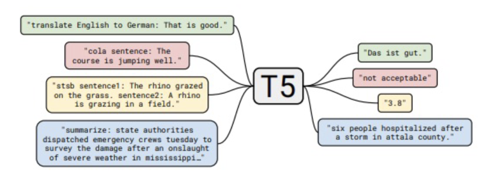

| Task Category | Input String (Task Prefix + Context) | Output String (Target Text) |
| :--- | :--- | :--- |
| **Translation** | "translate English to German: That is good." | "Das ist gut." |
| **Linguistic Acceptability (CoLA)** | "cola sentence: The course is jumping well." | "not acceptable" |
| **Semantic Similarity (STS-B)** | "stsb sentence1: The rhino grazed on the grass. sentence2: A rhino is grazing in a field." | "3.8" |
| **Summarization** | "summarize: state authorities dispatched emergency crews tuesday to survey the damage after an onslaught of severe weather in mississippi..." | "six people hospitalized after a storm in attala county." |

The key takeaway here is that T5 treats everything as a **string-to-string problem**. Unlike BERT, which needs a **custom "Classification Head"** to turn vectors into labels, T5 literally "writes out" the answer. It uses the **same decoder architecture** to produce a **sentiment label** ("not acceptable") as it does to produce a **translation** or a **summary**. **T5** represents a shift from the **"Encoder-only"** world of BERT to an **Encoder-Decoder framework** (where everything is a sequence-to-sequence problem)

This diagram represents a major departure from the BERT-style fine-tuning we discussed earlier. While BERT requires you to build a custom "Classification Head" to turn vectors into labels, T5 (Text-to-Text Transfer Transformer) uses a Unified Framework:
* **No Custom Heads:** T5 uses the exact same Encoder-Decoder architecture for every task. It doesn't output a class index; it literally generates the text of the answer.
* **Task Prefixes:** The model knows what to do based on the Prefix (e.g., "summarize:" or "translate:"). This allows one single model to handle dozens of different linguistic jobs without changing its internal structure.
* **Regression as Text:** Note the STS-B example—T5 treats a similarity score (3.8) as a string of characters rather than a raw numerical value.

---

# Are the Task Prefixes rule-based?
No, the prompt is the input to the encoder and the prefix, i.e. "summarise", is handled by the weights of the model directly. There is no hard-coded rule or "switch" inside the model that says, "If you see 'summarize', go to the summarization department." 

Instead, the task prefix is treated as just another sequence of tokens. Because T5 was trained on a massive mixture of different tasks simultaneously, it learned through Gradient Descent that when the input starts with certain patterns (like translate English to German:), the output should follow a specific "style" or "logic" (like producing German words).

When you input "summarize: [Text]", the tokenizer breaks "summarize" and ":" into their own token IDs. These IDs are then converted into Vectors (Embeddings). To the model's first layer, the word "summarize" is just a specific point in a 768-dimensional space.

Because T5 is a Transformer, it uses Self-Attention. The encoder looks at every token in the sequence. When the model "reads" the main body of your text, the attention mechanism is constantly looking back at those first few tokens (the prefix).
* The weights in the attention heads have been trained to "attend" heavily to the prefix to decide how to process the rest of the sentence
* If the prefix is `"cola sentence:"`, the attention weights shift the model’s internal state to focus on syntax and grammar.
* If the prefix is `"sentiment:"`, the weights focus on emotive adjectives.

The prefix acts as a Conditioning Signal. Think of it like a "mood" for the entire neural network. The prefix doesn't trigger a separate part of the model; rather, it changes how the entire set of weights responds to the input text.

---

# T5 also uses MLM: Span-denoising
Pre-training involves unsupervised objectives which are similar to the **MLM** of BERT and “word dropout” regularization technique (Bowman et al. 2015)

Figure 2: Schematic of the objective we use in our baseline model. In this example, we process the sentence “Thank you for inviting me to your party last week.” The words “for”, “inviting” and “last” (marked with an x) are **randomly chosen for corruption**. Each consecutive span of corrupted tokens is replaced by a sentinel token (shown as <X> and <Y>) that is unique over the example. Since “for” and “inviting” occur consecutively, they are replaced by a single sentinel <X>. The output sequence then consists of the dropped-out spans, delimited by the sentinel tokens used to replace them in the input plus a final sentinel token <Z>.

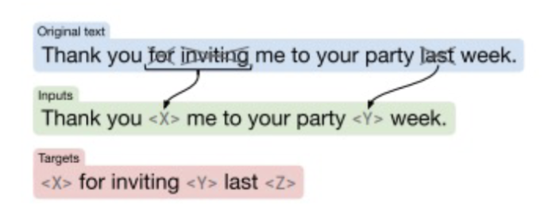

This process is known as **Span-denoising**, which is T5’s version of BERT's Masked Language Modeling. Instead of masking single words, it masks whole "**spans**" (chunks) of text.

| Stage | Text Content | 
| :--- | :--- | 
| Original Text | Thank you for inviting me to your party last week. | 
| Inputs (Corrupted) | Thank you <X> me to your party <Y> week. | 
| Targets (Predicted) | <X> for inviting <Y> last <Z> | 

### Key Mechanics of this Objective:
- **Sentinels:** Unlike BERT which uses a generic `[MASK]` token, T5 uses unique sentinel tokens (`<X>`, `<Y>`, `<Z>`) to act as placeholders for specific missing chunks.
- **Span Collapse:** Notice that "for" and "inviting" are two words, but they are collapsed into a single `<X>`. This teaches the model to predict how many words might be missing, not just which ones.
- **Efficient Decoding:** The model doesn't try to reconstruct the entire original sentence. It only generates the "missing pieces," which makes the training objective computationally efficient.

---

# T5 Fine-Tuning
T5 (Text-to-Text Transfer Transformer) achieves its "unified" nature through a unique approach to fine-tuning. Unlike BERT, which requires swapping out architectural "heads" for different tasks, T5 is fine-tuned by feeding it a variety of supervised tasks simultaneously using the exact same objective: **generating the correct target string**. Because every task — from translation to regression — shares the **same global parameters**, the model can leverage **cross-task transfer**, where learning the structural nuances of one task (like linguistic acceptability) can actually improve its performance on another (like summarization).

To successfully use a fine-tuned T5 model, you must adhere to the Prompt Format it was trained on. This is because the model relies on Task Prefixes to "trigger" the correct internal logic. If you want a summary, you cannot simply provide the text; you must prepend the specific string the model expects (e.g., "summarize: "). These prefixes act as a conditioning signal, shifting the Transformer's attention weights to focus on the specific linguistic features required for that output style.

---

#### Prompting vs Fine-Tuning
**Prompting (In-Context Learning):** You give a model (like GPT-4) a few examples in the text. The model's weights are frozen. It "learns" the pattern only for that specific conversation. Once you close the tab, it forgets everything you showed it.

**Fine-Tuning (T5's approach):** You take the T5 model and actually run **Backpropagation**. You show it thousands of examples, calculate the error, and permanently update the weights. T5 "learns" the task so deeply that it no longer needs the examples — **it just needs the "prefix."**

---

T5 is unique because it uses a **"Prompt-based Fine-tuning"** format. The reason it feels like prompting is because of those **Task Prefixes** (e.g., "summarize:"). During **Pre-training**, T5 is taught that when it sees a prefix, it should act a certain way. During **Fine-tuning**, we give it a specific new prefix (or use an old one) and update the weights so that the model becomes an absolute expert at that specific prefix. Essentially, T5 uses the interface of prompting to perform the act of fine-tuning.

---

# Week 8 Summary
This week’s study marks the transition from Transformer theory to the engineering reality of **Transfer Learning**, focusing on how to adapt "generalist" models like BERT to specific "specialist" tasks. We explored the **Distributional Hypothesis** at scale, moving from word-level embeddings to **Sentential Contexts** and specialized models like **SBERT** for semantic similarity. The core of the week centered on the fine-tuning pipeline: utilizing the `[CLS]` **token** as a global aggregator for text classification, navigating the trade-offs of **freezing layers** to prevent catastrophic forgetting, and leveraging the **Hugging Face** `Trainer` **API** alongside the **GLUE benchmark** for standardized evaluation.

We also examined the broader ecosystem of the **BERT Family**—including optimized variants like **RoBERTa**, **ALBERT**, and **DistilBERT** — before looking toward the future of NLP with **GPT-3** and **T5**. While BERT remains an encoder-only model requiring custom heads, GPT-3 introduces the **Prompting/In-Context Learning** paradigm (Zero/Few-shot), and T5 unifies all NLP tasks into a **Text-to-Text** framework. This shift from task-specific architectures to unified, prompt-driven generative models sets the stage for upcoming discussions on RAG, reasoning, and the responsible deployment of Large Language Models.

---

# Week 8: Seminar

* [Video](https://sussex.cloud.panopto.eu/Panopto/Pages/Viewer.aspx?id=50969dc7-6b73-404c-900f-b42b011c43f8)

### Previous Weeks Topics
* Language models
* Distributional representations of meaning
* Composition
* Contextualised word embeddings
    * ELMo
    * transformers
    * BERT
* Pre-training Large Language Models

### This Weeks Topic
* Transfer learning
* Fine-tuning BERT-based models for 
    * Text/sequence classification 
    * sequence labelling
* The BERT family
* More distant relatives
* Pattern Exploiting Training (PET) - Schick and Schütze (2021)

---

## Transfer Learning through Fine

* **Transfer learning:** acquiring knowledge from one task or domain and then applying (transferring) it to solve a new task.
* BERT-based models acquire knowledge about language through **pre-training** (masked language model prediction and next sentence prediction) on large unannotated corpora. BERT will know lots about language including what words are similar things to other. Its represenations are contenxualised, i.e. not static, they depend on the words around them. 
* **Fine-tuning** is the process of transferring this knowledge to a specific task e.g., is a tweet racially offensive or not?

---

## Fine-tuning
* Fine-tuning **uses labelled data** from the application to train **additional application-specific parameters**
* Application-specific parameters could be a single layer neural network on top of the BERT architecture
* Even though we are training a new model, maybe a classifier, we need signficantly less labelled data because there is a lot of language-based information already stored in the pre-train model which will be ultilsed for the task. 
* Fine-tuning might:
    * **freeze** the pre-trained language model parameters
    * **allow updates** to be made to some or all of the pre-trained language model parameters

--- 

## Text classification with BERT
* *E.g., Is a tweet **racially offensive** or **not**?*
    * `[CLS]` token is used to stand for the entire sequence
    * `[CLS]` is part of the vocabulary and  must be pre-pended to all input  sequences during pre-training and fine-tuning
    * `[CLS]` is the input to a classifier head, e.g., logistic regression, which makes relevant **decision**
    * learn a set of weights $W_c$ which maps output vector for `[CLS]` to a set of scores for the possible classes
    * Pass input text through **pre-trained language model** to generate $y_{cls}$ (single cls token), multiply it by $W_c$ and then pass this through **softmax** $$𝒚=softmax(𝑾_c * 𝒚_{cls})$$
    * Fine-tuning **requires** input sequences labelled with appropriate class
    * **Cross-entropy loss** between softmax output and correct label drives backpropagation
    * Weights can be updated just for $W_c$ (pre-trained language model is frozen) or in the pre-trained language model as well

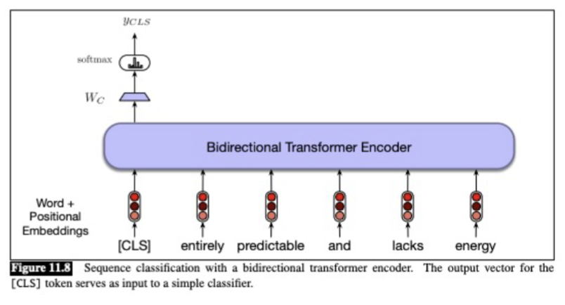

> Recall that the word representation input to a BERT is not raw strings, nor are you feeding in static "one-hot" vectors or pre-trained Word2Vec vectors. Instead, BERT uses a Trainable Embedding Layer that converts token IDs into high-dimensional vectors. 
> 
> A one-hot vector for a 30,000-word vocabulary would be 30,000 dimensions long (mostly zeros with a single "1"). This is incredibly inefficient for a neural network to process.
> 
> Instead, BERT uses an Embedding Matrix. Think of this as a giant "lookup table" of shape $30,000 \times 768$. Every word (token) in the vocabulary is assigned a unique ID (an integer from 0 to 30,000). When "pizza" (ID: 1074) enters the model, BERT simply "grabs" the 1074th row of that matrix. That row is a 768-dimensional vector of floating-point numbers. For the initial pre-trianing, this starts as a randomly initalized matrix of floating point numbers. 
>
> To get the final vector that actually enters the first Transformer layer, BERT sums three different types of embeddings together: Token Embeddings (768-dimensional vector),  Segment Embeddings (binary A or B), Positional Embeddings. 
>
> While Word2Vec produces vectors, those are static. In the BERT era, the embedding layer is part of the model itself.

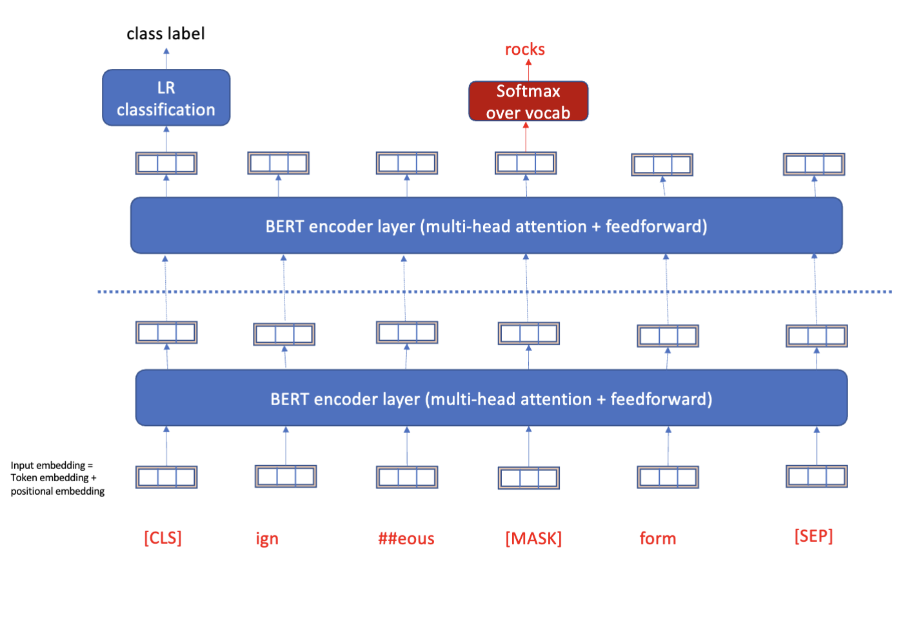

---

## Code for BERTclassifer
This is code from Lab 9 where we will be looking at doing classification with BERT. One thing we will be doing is using the simple `BertClassifier` class. 
* We pick up a pre-trained BERT model using `self.bert = BertModel.from_pretrained('bert-base-uncased')`
* The bolt on classifier is just a simple linear layer `self.linear = nn.Linear(768, num_classes)`
* In the forwardpass, the input `input_id` goes into the `self.bert` layer. To generate the `last_hidden_layer` and the `pooled_output`.
* We are only using the `pooled_output` but you could pick up the `last_hidden_layer` and apply a custom pooling. Could also adapt the bert so that the output is the `CLS` rather than a pooled output. 
* Remember, in this pipeline, the linear part is what is being trained. 

```
#now we need to put a simple classification layer on top of BERT

from torch import nn
from transformers import BertModel

class BertClassifier(nn.Module):

    def __init__(self, dropout=0.5, num_classes=2):

        super(BertClassifier, self).__init__()

        self.bert = BertModel.from_pretrained('bert-base-uncased')
        self.dropout = nn.Dropout(dropout)
        self.linear = nn.Linear(768, num_classes)
        self.relu = nn.ReLU()

    def forward(self, input_id, mask):

        last_hidden_layer, pooled_output = self.bert(input_ids=input_id, attention_mask=mask, return_dict=False)
        dropout_output = self.dropout(pooled_output)
        linear_output = self.linear(dropout_output)
        final_layer = self.relu(linear_output)

        return final_layer
```

---

## Freezing layers
* Switch off requiring the gradient for the BERT
* Advantage of Freezing is speed and avoiding Catastrophic Forgetting through overfitting.

``` 
model = BERTClassifer(num_classes=len(labels.key())) #init model with labels

# this will freeze the pre-trained BERT model and just make the classification head trainable 
# can speed things up and avoid "catastophic forgetting"/overfitting on task-specific data
model.bert.requires_grad(False)
```

---

## Pairwise Sequence Classification
Above we were thinking about a single sequence and how we might classify it by bolting on a classification head on top of the BERT and processing the CLS token. 

Another common task we might be working with is Pairwise Sequence Classifcation. This is generally the task of trying to determine if two sequences entail or contradict each other?

Entailment can be a complicated and needs to be defined, i.e. it could can directioned relationships where one sequence entails another but not the other way round.

1. “I’m confused”
2. “It is not completely clear to me”
3. “I’m confused about transfer learning”
4. “Everything is really clear to me”

#### What are the ways of turning this into a classification task?
* Concatenate the sentences, separated by the [SEP] token. This is the BERT method. Costly as it needs to cpature every pair but accurate.
* Proceed as for single sequence classification. Much quicker in training and inference. 
* OR use something like SBERT.

---

## Sequence Labelling with BERT
*E.g., POS tagging or NER*

Simplest approach is to pass each output from BERT to a simple classifier, or pass it to a CRF which considers tag-level transitions as well.

Complications can arise from subword tokenization

The simplest approach is to use the first subword token from each word

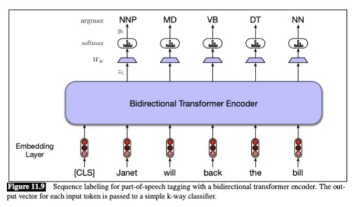

---

## Week 8: Paper
Schick and Schütze (2021): Exploiting Cloze Questions for Few Shot Text Classification and Natural Language Inference

Schick and Schutze (2021) introduce Pattern-Exploiting Training (PET), a semi-supervised training procedure that reformulates input examples as cloze-style phrases to help language models understand a given task. Once you have read the paper, consider the following questions.

1. [What do you understand by the term few-shot learning? Why is it important /challenging in NLP?](#1-what-do-you-understand-by-the-term-few-shot-learning-why-is-it-important-challenging-in-nlp)
2. [What is a Cloze question or Cloze-style phrase?](#2-what-is-a-cloze-question-or-cloze-style-phrase)
3. [What is pattern-verbalizer pair (PVP)? Give some examples of your own that might be used for different tasks e.g., sentiment classification and paraphrasing](#3-what-is-pattern-verbalizer-pair-pvp-give-some-examples-of-your-own-that-might-be-used-for-different-tasks-eg-sentiment-classification-and-paraphrasing)
4. [How are the PVPs used in training and inference?](#4-how-are-the-pvps-used-in-training-and-inference)
5. [What is catastrophic forgetting and how is it avoided?](#5-what-is-catastrophic-forgetting-and-how-is-it-avoided)
6. [How are different PVPs used to create a final model?](#6-how-are-different-pvps-used-to-create-a-final-model)
7. [What is iPET?](#7-what-is-ipet)
8. [What experiments did the authors carry out to demonstrate the effectiveness of their approach? What do you think of the results?](#8-what-experiments-did-the-authors-carry-out-to-demonstrate-the-effectiveness-of-their-approach-what-do-you-think-of-the-results)
9. [What does the analysis in section 5 tell us?](#9-what-does-the-analysis-in-section-5-tell-us)
10. [What are the main conclusions? Are you convinced? Would you use this approachy?](#10-what-are-the-main-conclusions-are-you-convinced-would-you-use-this-approach)

---

### 1. What do you understand by the term few-shot learning? Why is it important /challenging in NLP?
**Few-shot learning** refers to the challenge of training a machine learning model to generalize to a new task using only a minimal amount of labeled data—typically ranging from 10 to 100 examples. In the context of NLP, this is critically **important** because the "messy engineering reality" often involves niche domains (like legal or medical sub-specialties) where human annotation is prohibitively expensive or time-consuming. It is **uniquely challenging** because standard supervised fine-tuning relies on a "signal" from gradients to update millions of parameters. When the training set is tiny, the gradient signal is too weak to overcome the "random noise" of newly initialized layers, often leading to **catastrophic forgetting** — where the model overfits to the idiosyncratic quirks of the few examples provided and loses its broader linguistic reasoning capabilities.

---

### 2. What is a Cloze question or Cloze-style phrase?
A **Cloze question** is a linguistic exercise where a portion of a sentence or phrase is replaced with a blank or a "mask" token, requiring the participant to provide the missing information based on the surrounding context. In traditional education, this is known as a "fill-in-the-blank" test.

In the context of NLP models like BERT, this format is the primary mechanism for **Masked Language Modeling (MLM)** during pre-training. By providing a Cloze-style phrase like `"The capital of France is [MASK],"` we force the model to use its internal distributional knowledge to predict the most likely token. The genius of the PET paper is that it repurposes this "cloze" format as a synthetic task description. Instead of asking the model to recover a word that was actually there, we append an artificial blank (e.g., `"The movie was great. It was [MASK]."`) to "trick" the model into expressing its latent semantic understanding of a specific classification task.

---

### 3. What is pattern-verbalizer pair (PVP)? Give some examples of your own that might be used for different tasks e.g., sentiment classification and paraphrasing
A **Pattern-Verbalizer Pair (PVP)** is a two-part linguistic bridge that transforms a standard classification problem into a "completion" task that a pre-trained language model can understand without adding any new, noisy layers.
* **The Pattern ($P$):** A template function that reformulates the input text into a sentence containing exactly one `[MASK]` token (e.g., adding `"It was [MASK]"` to a review).
* **The Verbalizer ($v$):** A mapping function that connects your abstract data labels to real-world tokens in the model's vocabulary (e.g., mapping the label `1` to the word "great").

By combining these, you provide the model with a "natural" context that allows it to use its pre-trained linguistic intuition rather than learning a mathematical mapping from scratch.

#### 1. Sentiment Classification (Topic: Restaurant Reviews)
* Input ($x$): "The pasta was cold and the waiter was rude."
* Pattern ($P$): `[Input] Summary: The experience was [MASK].`
* Verbalizer ($v$):
    * `Negative` $\rightarrow$ "awful"
    * `Positive` $\rightarrow$ "delightful"

#### 2. Paraphrasing (Topic: Semantic Equivalence)
* **Input ($x_1, x_2$):** "The sun is shining" and "It is a sunny day"
* **Pattern ($P$):** `[Sentence 1]. In other words, [Sentence 2]. This is [MASK]`.
* **Verbalizer ($v$)**:
    * `Paraphrase` $\rightarrow$ "true"
    * `Not Paraphrase` $\rightarrow$ "false"

#### 3. Topic Classification (Topic: News Headlines)
* **Input ($x$):** "Apple announces new MacBook Pro with M3 chip."
* **Pattern ($P$):** Category: [MASK]. News: [Input]
* **Verbalizer ($v$):**
    * `Business` $\rightarrow$ "Economy"
    * `Tech` $\rightarrow$ "Technology"
    * `Sports` $\rightarrow$ "Games"

---

### 4. How are the PVPs used in training and inference?
In PET, the Pattern-Verbalizer Pair (PVP) acts as a "filter" that repurposes the existing Masked Language Modeling (MLM) architecture for classification. Here is the step-by-step mathematical process for both training and inference:

#### Step 1: Input Transformation
Given a raw input $x$ (like a movie review), we apply the Pattern $P$ to transform it into a Cloze-style sequence $P(x)$ that contains exactly one [MASK] token.
* "The film was boring." $\rightarrow$ "The film was boring. It was [MASK]."

#### Step 2: Scoring the Labels ($s_{\mathbf{p}}$)
We pass this sequence into the pre-trained model $M$. Instead of looking at the entire 50,000-word vocabulary output, we target only the specific indices of the words defined in our Verbalizer $v$.

For each possible label $l \in \mathcal{L}$, we extract the unnormalized logit that the model assigns to the word $v(l)$ at the masked position. This is represented as:

$$s_{\mathbf{p}}(l \mid \mathbf{x}) = M(v(l) \mid P(\mathbf{x}))$$

If our labels are "Positive" and "Negative," and our verbalizer maps them to "great" and "terrible," we are simply grabbing the raw numerical "volume levels" the model produced for those two specific words.

> When BERT/RoBERTa processes a sentence with a [MASK], its final hidden layer produces a single vector of numbers (usually 768 or 1024 dimensions) for that specific position.
> 
> The model then performs a Vocabulary Projection. It multiplies that hidden vector by a massive weight matrix (the "MLM Head") that has one row for every word in its vocabulary. The result is a 1x50,000 vector of raw scores (Logits). This is the "original" thing the model does. It calculates a "fit" score for every word it knows, from "aardvark" to "zebra."
> 
> In a standard pre-training task, the model would softmax all 50,000 scores to find the most likely word. In PET, we perform a "lookup and slice" operation: We look at our Verbalizer. If our verbalizer only uses the words "great" and "terrible," we find the specific ID numbers (indices) for those two words. We "reach in" to that massive 50,000-long vector and pull out only the scores sitting at those two indices.

#### Step 3: Probability Distribution ($q_{\mathbf{p}}$)
To turn these raw scores into a valid prediction, we apply a Restricted Softmax. This forces the model to distribute 100% of its probability mass only among our chosen labels, effectively ignoring the rest of the dictionary:

$$q_{\mathbf{p}}(l \mid \mathbf{x}) = \frac{e^{s_{\mathbf{p}}(l \mid \mathbf{x})}}{\sum_{l' \in \mathcal{L}} e^{s_{\mathbf{p}}(l' \mid \mathbf{x})}}$$

#### Step 4: Training (Loss Computation)
During training, we have a small set of labeled examples $\mathcal{T}$. For each example, we know the "true" label. We calculate the Cross-Entropy Loss between our predicted distribution ($q_{\mathbf{p}}$) and the True (One-Hot) Distribution.
* If the review is "Negative," the target is 1.0 for "terrible" and 0.0 for "great."
* The error (difference) is backpropagated through the entire model $M$, updating the weights so that the model becomes better at predicting the correct verbalizer for that specific task.

#### Step 5: Inference
During inference, we follow the same scoring and softmax steps. We don't update any weights; we simply pick the label $l$ that achieved the highest probability $q_{\mathbf{p}}$. Because the model was already a "language expert" before we started, it requires very few of these updates to become a "task expert."

---

### 5. What is catastrophic forgetting and how is it avoided?
**Catastrophic forgetting** occurs when a pre-trained model is fine-tuned on a very small, specific dataset and effectively "overwrites" the general linguistic knowledge it acquired during its massive pre-training phase. Because the gradient updates from only 10 or 50 examples are so concentrated, the model "warps" its internal weights to perfectly satisfy those few examples. While it might become a "specialist" for those 10 sentences, it loses its ability to reason about the general structure, grammar, and nuances of the broader language, becoming brittle and prone to overfitting.

#### How PET Avoids It: The Auxiliary Loss
The authors avoid this by forcing the model to multi-task. While the model is learning your specific classification task, it is simultaneously forced to keep doing its "day job" — **Masked Language Modeling (MLM)**. This is achieved through an **Auxiliary Loss** mechanism:
1. **The Task Loss ($L_{\text{CE}}$):** This measures how well the model predicts your specific verbalizer words (e.g., "awful" vs "delightful").
2. **The Anchor Loss ($L_{\text{MLM}}$):** Using the unlabeled dataset, the model is asked to predict random masked words (like "the," "restaurant," or "ate") in the same way it did during its original pre-training on Wikipedia.
3. **The Weighted Combination:** The total loss is calculated as:
$$L = (1 - \alpha) \cdot L_{\text{CE}} + \alpha \cdot L_{\text{MLM}}$$

#### The Role of Alpha ($\alpha$)
By setting $\alpha$ to a very small value (the paper uses $10^{-4}$), the auxiliary task acts as a **regularizer**. It creates mathematical "friction" against the task-specific updates. It tells the model: "You can change your weights to learn this new sentiment task, but you aren't allowed to change them so much that you forget how to predict basic English words in the unlabeled data." This constant "reminder" of what normal English looks like keeps the model's general reasoning "warm" while it learns the specialized patterns of your specific dataset.

---

### 6. How are different PVPs used to create a final model?

#### Phase 1: Training the Ensemble of Teachers
The process begins by training a set of "Teacher" models. Because it is difficult to know which specific pattern (the "Pattern") or which specific words (the "Verbalizer") will most effectively unlock the model's pre-trained knowledge, the researchers don't gamble on just one. Instead, they define a diverse set of PVPs—for example, one might use "It was [MASK]" while another uses "The reviewer felt [MASK]." A separate version of the language model is fine-tuned for every single PVP using the tiny available set of labeled examples. This results in an **ensemble**, where each model is a "specialist" in seeing the task through its own specific linguistic lens.

#### Phase 2: Generating the Synthetic Dataset
Once the ensemble is trained, it is used to annotate a much larger, unlabeled dataset. Each model in the ensemble "votes" on the label for every unlabeled sentence. Rather than producing a simple "True/False" answer, the ensemble produces **soft labels** — probability distributions that might indicate a sentence is 88% likely to be "Positive" and 12% likely to be "Negative." This step is crucial because it aggregates the "collective wisdom" of all the different patterns, effectively canceling out the noise or bias of any single poorly designed PVP. This phase transforms a pile of raw, unlabeled text into a massive "silver-standard" training set.

#### Phase 3: Distilling Knowledge into the Student
The final stage involves Knowledge Distillation, where the insights of the complex ensemble are transferred into a single "Student" model. This Student is a standard BERT model with a traditional sequence classification head—the kind that sits on the [CLS] token. We train this Student using the massive synthetic dataset created in the previous step. Because the Student is learning from "soft labels," it inherits the "Dark Knowledge" (the nuances and uncertainties) of the ensemble.

#### Why this structure is preferred
By the end of this process, the "Cloze" patterns and the multiple teacher models are discarded entirely.

The final result is a single, fast, and high-performance classifier. This approach allows the final model to benefit from the data-efficiency of prompting (the teachers) while maintaining the inference speed and simplicity of a standard classifier (the student). Essentially, PET uses a sophisticated linguistic "scaffolding" to build a massive training set out of thin air, then removes that scaffolding to leave behind a polished, specialist model.

---

### 7. What is iPET?
**iPET (Iterative Pattern-Exploiting Training)** is the advanced, recursive version of PET designed to overcome the "bottleneck" of human error in prompt design. While standard PET is a one-time process, iPET uses a **multi-generational approach** to help the model "self-correct" and improve its own training data.

The core motivation for iPET is that some human-designed patterns are naturally weaker than others. In a standard ensemble, a "bad" pattern can poison the synthetic dataset with mislabeled examples. iPET solves this by letting the models "teach" each other across several rounds.

#### The iPET Process: "Generational Learning"
The iterative loop follows these logical stages:
1. **Generation 0:** You start with the same 10-50 labeled examples and several different PVPs (Patterns). You train your initial ensemble of "Teachers."
2. **The Confident Selection:** Instead of labeling the entire unlabeled dataset immediately, each model looks at a random subset of unlabeled data. It only "keeps" the examples where it is extremely confident (e.g., the top 100 highest-probability sentences).
3. **Knowledge Sharing:** These new, "silver-labeled" examples are added to the original training pool. Critically, a model doesn't learn from its own predictions; it learns from a random subset of other models in the ensemble. This prevents a model from simply reinforcing its own mistakes (confirmation bias).
4. **Generation 1, 2, 3...:** This larger dataset is used to train a new generation of Teachers. Because the training set has grown (e.g., from 10 to 500 examples), even the "awkward" patterns now have enough data to understand how they should behave.

#### Why the Iteration is Necessary
The authors found that increasing the training set size gradually is better than doing it all at once. If you label too many examples too early, the percentage of "noise" (mislabeled data) is too high, and the final model will be inaccurate. By using iPET, you are performing a "slow-cook" distillation: you only accept the most obvious labels first, and as the model becomes an "expert," it becomes qualified to label the more difficult, nuanced sentences in later generations.

---

### 8. What experiments did the authors carry out to demonstrate the effectiveness of their approach? What do you think of the results?
The authors tested their framework across a diverse range of four distinct NLP tasks to ensure the results weren't specific to one type of logic:
* **Sentiment Analysis (Yelp/Amazon):** Mapping 1-5 star reviews to their corresponding labels.
* **Topic Classification (AG's News/Yahoo):** Sorting articles into categories like Business, Sci/Tech, or Sports.
* **Natural Language Inference (MNLI/RTE):** Determining if a premise entails or contradicts a hypothesis.
* **Paraphrasing (QQP):** Identifying if two questions share the same semantic meaning.

They specifically targeted low-resource settings, simulating environments with only 10, 50, or 100 labeled examples. To ensure a fair fight, they compared PET against "Supervised BERT" (the standard fine-tuning you've studied) and "Unsupervised Prompting" (like GPT-style zero-shot).

---

#### Key Findings

**The "Crushing" of Supervised Baselines:** With only 10 examples, standard supervised learning performed barely better than random chance. PET, however, achieved accuracies 20-40% higher, often matching the performance that a standard model would only reach with 1,000+ examples.

**iPET vs. PET:** The iterative version consistently outperformed the one-shot version, proving that "generational learning" successfully filters out the noise from weak patterns.

**Cross-Lingual Success:** They showed that PET works equally well in languages other than English (testing on German tasks), highlighting the universality of the Pattern-Verbalizer approach.

---

#### Analysis of the Results

##### 1. The Myth of the "Small Data" Barrier
The results prove that "lack of data" is often actually a "lack of communication." The model already knows the answer; it just doesn't understand the question when presented as an abstract label (0 or 1). By using PVPs, the authors proved that we can bridge this gap. The fact that 10 examples + PET can beat 1,000 examples + Standard Fine-tuning is a staggering win for data efficiency.

##### 2. The Robustness of the Ensemble
What I find most impressive is the Ablation Study where they intentionally included "bad" patterns. The results showed that the ensemble and distillation process were so robust that the final student model remained accurate despite being taught by a few "confused" teachers. This makes the approach practical for real-world engineers who might not be linguistic experts.

---

The results suggest that the "Classification Head" we've been bolting onto BERT for years is actually a bottleneck. PET reveals that the most powerful way to use a Language Model is to let it stay a Language Model and simply reframe our problems to fit its native tongue.

---

### 9. What does the analysis in section 5 tell us?

#### The "Safety Net" of the Ensemble
The analysis reveals a massive performance gap between different PVPs — sometimes as high as 10-15% accuracy. This confirms your earlier suspicion: human intuition is a bottleneck, and some "slices" are objectively worse than others. However, the data shows that the **PET ensemble effectively compensates** for this. The combined "wisdom" of the models consistently outperforms even the best single pattern in the set. This proves that you don't need to be a linguistic genius to use PET; you just need to provide a variety of "reasonable" patterns, and the math will filter out the duds.

#### The Power of Distillation and Auxiliary Tasks
The researchers found that **Distillation brings consistent improvements** over simply using the raw ensemble. By training a single student model on the collective soft labels, the model becomes more robust and significantly faster for real-world use. Furthermore, the Auxiliary Language Modeling task proved to be a critical "anchor" for very small datasets. The analysis shows that when you only have 10 examples, the auxiliary task is vital for preventing the model from "warping" its weights. Interestingly, as the dataset size grows to 1,000 examples, this anchor becomes less necessary, as the task-specific signal is finally strong enough to stand on its own.

#### Iteration and Domain Adaptation
Regarding **iPET**, the analysis confirms that **more model generations lead to better performance**, but only if the growth is gradual. If you try to jump from 10 examples to 10,000 in one step, the "noise" from early mislabeled examples poisons the model. Slow, generational learning is the key to high-fidelity synthetic data. Finally, the authors addressed the "Unlabeled Data" question. While **In-domain pre-training** (training on the raw text of Yelp or Yahoo before starting PET) helps all models, it doesn't close the gap. This proves that PET’s success isn't just because it "saw" more data — it’s because the **Cloze-style** formatting is a fundamentally better way to communicate with the model.

---

### 10. What are the main conclusions? Are you convinced? Would you use this approach?
The paper concludes that Pattern-Exploiting Training (PET) is a highly effective semi-supervised method for low-resource NLP. By reformulating classification tasks as Cloze-style questions, the authors proved that we can leverage the "latent knowledge" already present in pre-trained models. The main takeaways are that task descriptions (prompts) are a more efficient interface than random classification heads for few-shot learning, and that Knowledge Distillation can turn a complex ensemble of "teachers" into a fast, standard "student" classifier.

The paper solves two major problems: the "Initialization Bottleneck" (where a new head is too noisy for a small dataset) and "Catastrophic Forgetting" (where the model loses its general intelligence). The most compelling part of the results is the data-to-performance ratio; the fact that PET with 10 examples can rival a standard model with 1,000 examples suggests that we have been "under-utilizing" the native reasoning of Large Language Models by forcing them into rigid, non-linguistic output formats.

#### When to use this approach?
If you are working on a specialized project (e.g., classifying legal clauses or rare medical symptoms) where you only have a few dozen labeled examples but thousands of unlabeled ones. In this scenario, PET is a "practical lightweight weapon" compared to the brute force of trying to label more data.

I would use the iPET loop if my task were nuanced and difficult to describe in one single pattern. The ability of the model to "self-correct" through generational learning makes it much safer than relying on a single, potentially flawed human prompt.

#### When to skip this approach?
If you have 10,000+ labeled examples, PET’s complexity (designing PVPs and training ensembles) is likely not worth the overhead, as standard fine-tuning will converge effectively with that much data.

---

Ultimately, PET is the perfect "bootstrap" tool. It allows you to move from a "Zero/Few-Shot" state to a "Supervised" state by using the model itself to generate the training data you need. It represents a smarter, more communicative way of working with AI.

---

## Week 8: Lab
Lab 9b; Bonus lab!

Have a go at fine-tuning BERT for Named Entity Recognition

---

# Week 8: Additional Reading
* [Jurafsky and Martin 2026, Chapter 7: Large Language Models](https://web.stanford.edu/~jurafsky/slp3/7.pdf)
* [Jurasfsky and Martin 2026, Chapter 9: Post-training: Instruction Tuning, Alignment, and Test-Time Compute](https://web.stanford.edu/~jurafsky/slp3/9.pdf)

---

### Suggested reading 
* [Brown et al. (OpenAI) (2020). Language Learners are Few Shot Learners](https://arxiv.org/abs/2005.14165)
* [Devlin, J., Chang, M.-W., Lee, K., & Toutanova, K. (2019). BERT: Pre-training of Deep Bidirectional Transformers for Language Understanding.](https://aclanthology.org/N19-1423/)
* [Liu et al. (Facebook) (2019). RoBERTa: A Robustly Optimized BERT Pretraining Approach.](https://arxiv.org/abs/1907.11692)
* [Mitchell, J. and Lapata, M. (2010). Composition in distributional models of semantics.]()
* [Pires et al. (2019). How Multilingual is Multilingual BERT?](https://aclanthology.org/P19-1493.pdf)
* [Raffel et al. (Google) (2020). Exploring the Limits of Transfer Learning with a Unified Text-to-Text Transformer.](https://arxiv.org/pdf/1910.10683)

---

#### Further reading
* [Beltagy et al. (2019). SciBERT: A Pretrained Language Model for Scientific Text.](https://aclanthology.org/D19-1371/)
* [Bowman et al. (2015). A large Unannotated Corpus for Learning Natural Language Inference. ](https://aclanthology.org/D15-1075/)
* [Lan et al. (Google) (2019). ALBERT: A Lite BERT for Self-supervised Learning of Language Representations.](https://arxiv.org/abs/1909.11942)
* [Peters, M. E., Neumann, M., Iyyer, M., Gardner, M., Clark, C., Lee, K., & Zettlemoyer, L. (2018). Deep contextualized word representations]()
* [Sanh et al. (Huggingface) (2019). DistilBERT, a distilled version of BERT: smaller, faster, cheaper and lighter.](https://arxiv.org/abs/1910.01108)
* [Vaswani et al. (Google) (2017). Attention is All You Need.](https://arxiv.org/abs/1706.03762)

---

<br>
<br>
<br>
<br>
<br>
<br>

# [Week 9 - Generative Large Language Models](https://canvas.sussex.ac.uk/courses/36171/pages/week-slash-topic-9-generative-large-language-models?module_item_id=1602176)

This week we will be looking at generative large language models. In particular, we will focus on:
- More distant relatives of BERT such as GPT and ChatGPT.
- Generative applications with LLMs including.
    - machine translation
    - summarization
    - question answering
- Variation in LLM responses
- Prompt engineering
- Chain-of-thought reasoning 

---

#### Week 9: Contents

1. [Lecture](#week-9-lecture)
2. [Seminar](#week-9-seminar)
3. [Paper](#week-9-paper)
3. [Additional Readings](#week-9-additional-reading)

---

# Week 9: Lecture
- [Video Part 1](https://sussex.cloud.panopto.eu/Panopto/Pages/Viewer.aspx?id=7b8af2cf-612e-4e52-ba94-b41a00e181b9)
- [Video Part 2](https://sussex.cloud.panopto.eu/Panopto/Pages/Viewer.aspx?id=7ed12e14-e1a4-4413-990f-b41a00e99806)

---

Week 9 represents the transition from understanding language through encoding to generating it through prediction, marking the culmination of your journey from Transformer theory to modern AI assistants. The following summary bridges the technical shift from BERT to GPT and highlights the critical research that defined this "Generative Era."

### The Paradigm Shift: From Encoding to Generation
While previous weeks focused on BERT, a bi-directional encoder that "understands" by filling in missing blanks, Week 9 introduces Generative Large Language Models (LLMs) like GPT-3 and Gemini. These models are autoregressive, meaning they predict the next token in a sequence from left to right. This architectural shift from a "cloze" task to a "completion" task transforms the model from a classifier into a conversational agent. You have moved from a model that represents the world (Encoders) to one that actively constructs responses based on that world (Decoders).

### Scaling and the "Few-Shot" Breakthrough
The cornerstone of this week is the **Brown et al. (2020)** paper, "Language Models are Few-Shot Learners." It demonstrates that by simply scaling a model to 175 billion parameters (GPT-3), the model develops "emergent abilities." It proves that we no longer need to fine-tune a model's weights for every task; instead, we can use **In-Context Learning**. By providing a few examples in a prompt (Few-Shot), the model can perform translation, coding, or reasoning without any permanent updates to its brain. This shift marks the birth of **Prompt Engineering**, where the "bottleneck" is no longer the architecture, but our ability to effectively "ask" the model for the right output.

### Alignment and Reinforcement Learning (RLHF)
Raw pre-training makes a model smart, but not necessarily helpful or safe. **The Ouyang et al. (2022)** paper, "Training Language Models to Follow Instructions with Human Feedback," introduced the **InstructGPT** methodology (the basis for ChatGPT). This process uses **Reinforcement Learning** from **Human Feedback (RLHF)** to "align" the model with human intentions. By training a **Reward Model** to act as a "judge" based on human preferences and updating the model's **Policy** (its generation strategy), researchers created models that are more truthful, less toxic, and better at following complex instructions than their raw, pre-trained ancestors.

### Grounding and Reliability: RAG and Summarization
To combat the inherent "hallucination" problem of LLMs, Week 9 introduces **Retrieval-Augmented Generation (RAG)**. This **Retrieve-Read** framework prevents the model from relying solely on its pre-trained memory by allowing it to "look up" facts in an external database before generating an answer. This is supported by evaluation research like **Zhang et al. (2024)**, which benchmarks LLMs for news summarization. Their findings suggest that **instruction-tuning**, rather than just model size, is the key to high-quality generation, showing that LLM-generated summaries are now frequently judged to be on par with those written by professional human writers.

---

## More Distant Relative of BERT
Last week we looked at some derivatives of BERT, i.e. Roberta, distillbert, sbert. However, there are some other Pretrained Large Language Models, which do not expliticitly use the BERT architecture but are generally still based on transformers:

- GPT (GPT-2, GPT-3, ChatGPT, GPT-4, GPT-5 ...) 
- Gemini
- Claude
- Turing-NLG
- XLNet
- Electra
- Dolly
- NeMo
- BLOOM
- LLaMa
- PaLM2
- DeepSeek

---

## How to choose which LLM to use?
Choosing the right Large Language Model (LLM) involves balancing technical performance against operational constraints. Because modern NLP has shifted from "building from scratch" to "selecting and adapting," this decision-making process is the first critical step in any engineering pipeline.

### Model Scale and Efficiency
The **number of parameters** (the model's "size") is the primary predictor of performance, as larger models generally exhibit stronger reasoning and few-shot abilities. However, this comes with a significant trade-off in **computational cost** and latency. For simpler tasks like sentiment analysis or basic classification, a smaller, "distilled" model may offer comparable accuracy at a fraction of the price and speed.

### Data Composition and Domain Expertise
Performance is not just a function of size, but of the **pre-training data**. A mid-sized model trained on high-quality, domain-specific data (such as medical journals or legal documents) will often outperform a massive general-purpose model on specialized tasks. Furthermore, check if the model has undergone **task-specific fine-tuning**; for instance, models like CodeLlama have been specifically optimized on vast repositories of source code, making them inherently superior for programming tasks compared to standard models of the same size.

### The Source Ecosystem: Open vs. Closed
The choice between **Open Source** (e.g., Llama 3, Mistral) and **Closed Source** (e.g., GPT-4, Claude) models often dictates your project's long-term flexibility.

**Closed Source** models typically offer the "state-of-the-art" ceiling and are easily accessible via API (priced per token), removing the need for local hardware.

**Open Source models** provide critical advantages in **data privacy** and **personalization**. They allow you to host the model on your own servers and perform "Continual Pre-training" or "Supervised Fine-tuning" to tailor the weights to your specific brand voice or proprietary datasets.

---

## Generative Pre-Trained Transformer 3 (GPT-3)
The release of GPT-3 marked a definitive shift in the field of Natural Language Processing, moving the industry away from task-specific fine-tuning toward a "universal" model interface. This section focuses on the technical innovations and the landmark research that established the generative era.

### The "Few-Shot Learner" Paradigm
The defining research for this model is **Brown et al. (2020): Language Models are Few-Shot Learners**. Before this paper, the standard practice was to take a pre-trained model and fine-tune its weights on a specific dataset. Brown et al. proved that if you scale a model large enough, it develops the ability to perform **In-Context Learning**. This means the model can learn a new task simply by being shown a few examples within the prompt—without any updates to its underlying parameters. This introduced the "prompting" era, where a single model could suddenly handle translation, math, and coding based purely on the instructions provided.

### Architecture: Autoregressive and Uni-directional
Unlike BERT, which is a bi-directional encoder that "looks" at the whole sentence to fill in blanks, GPT-3 is a **uni-directional, autoregressive decoder**. This means it processes text from left to right, predicting the next token based solely on the preceding context. While this uni-directionality means it lacks the "global" context that BERT uses for word representations, it makes GPT-3 a natural "writer." It excels at generating coherent, long-form text because its architecture is designed specifically for continuous sequence generation.

### Scale and Density: The 175 Billion Parameter Mark
At the time of its release, GPT-3 was the largest **non-sparse** language model ever built, featuring **175 billion** parameters. In this context, "non-sparse" (or "dense") means that every single parameter is active and involved in the computation for every token generated. This massive scale allowed the model to "memorize" a significant portion of the internet, having been trained on the **Common Crawl**, **WebText2**, and the **Google Books** corpora. The sheer density of the model is what allowed the "emergent abilities" described in the Brown et al. paper to appear, proving that in NLP, "quantity has a quality of its own."

### Clarification: Prompting vs. Few-Shot
In the lecture and the Brown et al. paper, Prompting is the method of interaction, while Few-Shot is a specific type of prompt:
- **Prompting:** The general act of giving the model a text input to trigger a response.
- **Zero-Shot:** A prompt with only an instruction (e.g., "Translate 'cat' to French").
- **Few-Shot:** A prompt that includes a few examples to "prime" the model's logic (e.g., "Apple -> Pomme, Dog -> Chien, Cat ->").

---

## Generating Responses
Take a prompt and use a language model to predict what comes next or what fills in the gaps (Masked Language Models). 

Working out what is the best prompt strategy (how to convert the user utterance into a prompt for the LLM) is known as prompt engineering

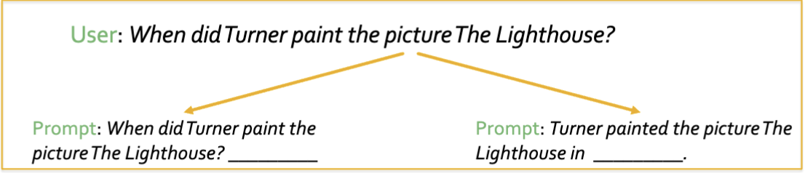

Find the word(s) that fills in the blank(s) with the highest probability according to the large language model (pretrained on the very large corpus)

---

## What could possibly go wrong?
While Large Language Models (LLMs) appear highly fluent and authoritative, their architecture and training methods introduce several significant risks. Understanding these failure modes—specifically hallucinations and biases—is essential for the responsible deployment of generative AI

### The Problem of Hallucination
One of the most persistent issues in generative AI is **hallucination**, where a model generates content that is syntactically correct and linguistically plausible but factually unsupported or entirely false. Research, including **Zhang et al. (2024)** and recent surveys, distinguishes between two primary types of this phenomenon:
- **Intrinsic Hallucinations:** The generated output contradicts the information provided in the source text (e.g., misstating a date or name that was correctly provided in a summary prompt).
- **Extrinsic Hallucinations:** The model adds "imaginary" information that wasn't in the source text at all (e.g., inventing a person's biography or adding legal citations that do not exist).

These errors occur because LLMs are **probabilistic token predictors**, not knowledge databases. They prioritize the most likely word sequence over factual truth. If a model has seen two words appear together millions of times in its training data (like "Charles Dickens" and "Jane Austen" in literature discussions), it may mistakenly link them in a factual query even if the context is incorrect.

### Bias Inheritance and Data Toxicity
Because LLMs are trained on massive web corpora like Common Crawl, they inevitably absorb the **biases**, **stereotypes**, and **factual errors** present in human-generated text. This "Bias Inheritance" means models can replicate and even amplify societal prejudices regarding race, gender, and culture. For example:
- **Gender Stereotypes:** If training data predominantly describes doctors as "he" and nurses as "she," the model's policy will naturally reflect these historical imbalances in its generations.
- **Cultural Skew:** Most major LLMs are trained on a disproportionate amount of Western, English-language data. This results in a "cultural bottleneck" where the model may fail to understand or accurately represent the values and nuances of Eastern or Global South contexts.

### The "Stochastic Parrot" Vulnerability
Ultimately, these weaknesses stem from the fact that an LLM is a **stochastic generator** — it does not "know" or "understand" anything in the human sense. It mimics the patterns of its training data. If that data contains fiction, misinformation, or biased viewpoints, the model treats them with the same weight as objective facts. This makes techniques like **RLHF** (to align behavior) and **RAG** (to provide factual grounding) not just "extra features," but necessary safeguards to prevent the model from becoming a high-speed engine for misinformation.

---

## ChatGPT (OpenAI, 2023)
The evolution from the raw GPT-3 model to ChatGPT represents a move away from simple "word prediction" toward instruction following. While GPT-3 was a powerful mimic of the internet, it often struggled to stay on task or provide helpful answers. OpenAI addressed this by developing **InstructGPT**, the architectural foundation of ChatGPT, which utilizes "Alignment" techniques to ensure the model behaves in a way that is useful and safe for humans.

---

## Reinforcement learning from human feedback (RLHF)
The core "engine" of this transformation is **Reinforcement Learning from Human Feedback (RLHF)**.To move from a raw predictor to a helpful assistant, the Ouyang paper outlines a three-step training pipeline:
1. **Supervised Fine-Tuning (SFT):** Human labelers write out "gold standard" responses to prompts, teaching the model the desired "persona."
2. **Reward Modeling:** Humans rank different model outputs from best to worst. This data trains a separate "Reward Model" to understand what humans prefer.
3. **Reinforcement Learning:** The model is "incentivized" to generate responses that achieve high scores from the Reward Model using an optimization algorithm called **PPO (Proximal Policy Optimization)**.

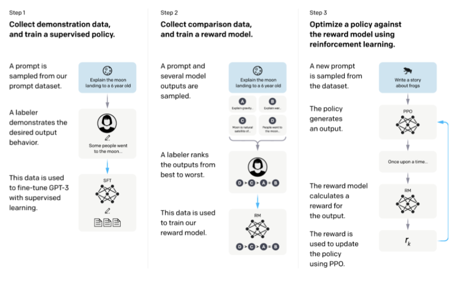

---

## The "Policy" and "Reward" Explained
To understand the technical side of this alignment, it is helpful to define two key terms:

### The Policy
In reinforcement learning, the "Policy" is essentially the model's **decision-making strategy**. It is the internal logic (the weights) that the model uses to choose the next token. When we fine-tune ChatGPT, we are "updating the policy" to favor helpfulness over mere probability.

### The Reward
The "Reward" is a scalar value (a score) provided by the Reward Model. If the policy generates a helpful, polite response, it receives a high reward; if it generates a toxic or nonsensical response, it receives a low reward. The model’s goal during training is to **maximize this total reward**.

---

## Weakness
The primary weakness of Generative LLMs stems from a fundamental disconnect: they are exceptional at **linguistic mimicry** but possess no internal model of **truth**, **logic**, or the **physical world**. Because they function as probabilistic engines rather than knowledge databases, their outputs are subject to several structural vulnerabilities.

### 1. The Illusion of Understanding
Despite their fluency, ChatGPT and similar models do not "understand" concepts; they calculate the statistical likelihood of token sequences. This leads to a specific failure in **reasoning** and **arithmetic**.

For example, numbers and dates often share identical distributional contexts in training data (e.g., "The event happened in 19__"). Because the architecture treats these as similar "slots," the model can easily swap a "4" for a "5" or a "1998" for a "1999" without realizing the factual gravity of the change. It is not "looking up" a calendar; it is essentially playing a high-stakes game of Mad Libs.

### 2. Training Data and Cultural Bias
An LLM is only as objective as the "snapshot" of the internet it was trained on. This creates several layers of bias:
* **Temporal Bias:** The model's knowledge is frozen at its "knowledge cutoff" date. It cannot reason about events that happened after its training ended.
* **Geographic and Cultural Skew:** Most dominant LLMs are trained on disproportionately Western, English-centric data. This results in a "cultural bottleneck" where the model may fail to grasp non-Western logic, minority languages, or specific regional traditions.
* **Systemic Bias:** If the training corpus contains historical prejudices or toxic viewpoints, the model — unless heavily aligned — will reflect those biases as "normal" linguistic patterns.

### 3. The Brittleness of Alignment
While **RLHF** (Reinforcement Learning from Human Feedback) makes models safer, this "safety layer" is often just a thin veneer over the base model.
- **Subversion (Jailbreaking):** Creative prompting can bypass safety filters, forcing the model to ignore its "Policy" and revert to the raw, unaligned behavior of the base model.
- **Hallucination:** Even with alignment, models still "hallucinate" information that sounds plausible but has no basis in reality. This happens because the model is incentivized to be "helpful" and "confident," sometimes leading it to invent an answer rather than admit it doesn't know.

### 4. Lack of Grounding
LLMs lack a **"World Model."** They do not verify information against external databases or carry out formal logical inferences. They cannot "double-check" their work. Without an external framework like **RAG (Retrieval-Augmented Generation)**, the model is a "closed loop," limited entirely to the patterns it memorized during pre-training.

---

## Using Generative Models: MT and Summarization
Nearly all NLP applications can be posed as a prompt to a generative model:
- Translate the following text from English to French: The cat sat on the mat
- Summarise the following information in 3 sentences: 
- Who played Hans Solo in Star Wars?
- What is the sentiment of the following review:

The generative model will encode the prompt and then use that as a condition for decoding and generating a response.

--- 

## Document-Level Machine Translation (Wang et al. 2023)
Historically, machine translation was performed sentence-by-sentence, often losing the "discourse" (the overall flow and consistency) of a document. The research by **Wang et al. (2023)** highlights that LLMs like ChatGPT are naturally "discourse-aware." Because they have a large context window, they can maintain consistent terminology and gender agreement across an entire document. The study found that while sentence-by-sentence translation is possible, providing the **entire document in a single prompt** yields the best results. However, challenges remain in handling extremely long documents and maintaining specific "stylized" tones across different cultures

**Wang et al. (2023, MT):** Proves LLMs are superior for "Document-Level" tasks because they understand context better than traditional MT.

---

## News Summarization Benchmarking (Zhang et al., 2024)
The task of summarization tests a model's ability to compress information without losing factual integrity. In Zhang et al. (2024), researchers compared summaries generated by models like GPT-3 (Davinci) against those written by professional freelance writers. The findings were twofold:
- **Instruction-Tuning is King:** The researchers discovered that instruction-tuning (alignment), rather than just raw model size, was the primary driver of high-quality, zero-shot summaries. A smaller, well-aligned model often produces better summaries than a massive, unaligned one.
- **Human-Parity:** The study found that LLM-generated summaries are now frequently judged to be on par with professional human writers, though they often exhibit different stylistic choices, such as a higher frequency of paraphrasing.

**Zhang et al. (2024, Summarization):** Proves that how a model is taught (instruction-tuning) matters more for summaries than how big it is.


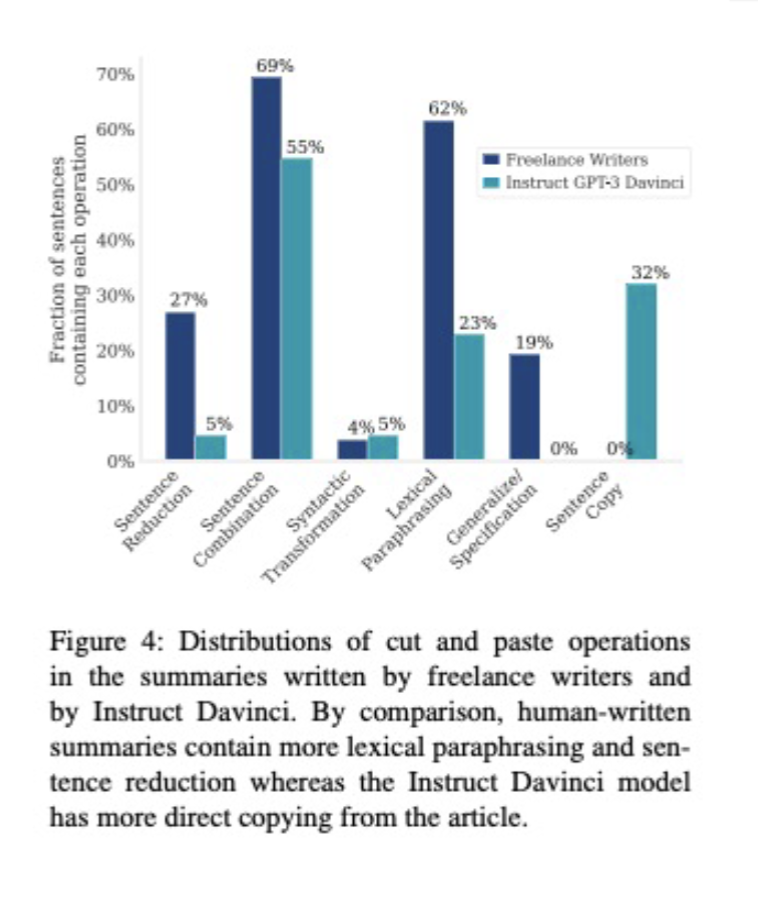

---

## Retrieval Augmented Generation (Gao et al. 2023)
While LLMs are impressive "reasoning engines," they often struggle with a lack of up-to-date knowledge and a tendency to hallucinate. Retrieval-Augmented Generation (RAG), as detailed in the landmark survey by Gao et al. (2023), provides a solution by giving the model an "open-book" to reference before it speaks. Instead of relying solely on its internal, frozen weights, the model retrieves relevant snippets from an external database to ground its responses in facts.

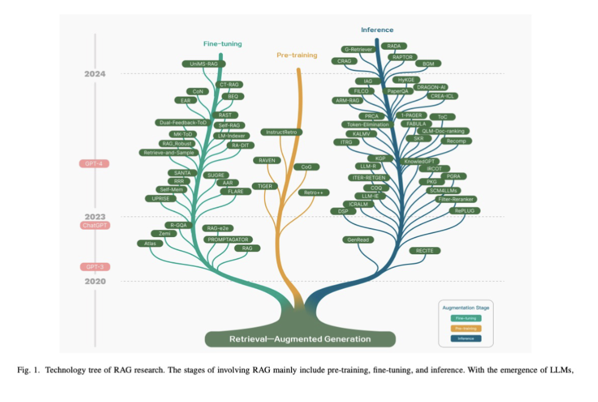

---

## The Evolution of RAG Paradigms
The Gao et al. paper categorizes the development of RAG into three distinct evolutionary stages, moving from simple pipelines to complex, modular ecosystems:

### Naive RAG/Retrieve-Read
This is the foundational "Retrieve-Read" framework. It follows a linear path: **Indexing** (chopping documents into chunks and turning them into vectors), **Retrieval** (finding chunks that mathematically match the user's query), and **Generation** (feeding those chunks into the LLM as context). While simple, it is prone to "Retriever Noise" (fetching the wrong info) and "Generator Misalignment" (ignoring the info provided).

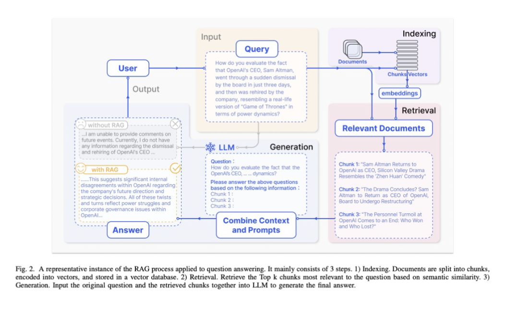

### Advanced RAG
To fix the flaws of the Naive approach, Advanced RAG introduces "Pre-retrieval" and "Post-retrieval" optimizations. This includes **Query Rewriting** (refining the user's question to be more searchable) and **Reranking** (using a second, smaller model to double-check the relevance of the retrieved chunks before the LLM sees them).

### Modular RAG
This is the current state-of-the-art. It moves away from a fixed pipeline toward a "plug-and-play" architecture. It allows for specialized modules like a **Search module** for web access, a **Memory module** to recall past interactions, and **Routing** that decides whether a query even needs retrieval at all.

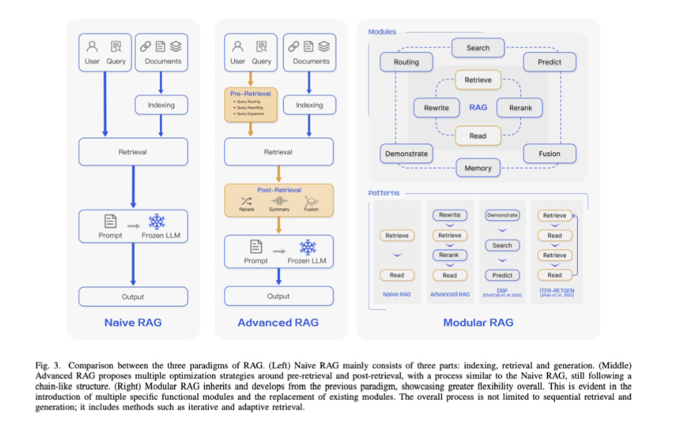

---

## Does it work? The Role of RLHF
A common concern is whether the model will actually "listen" to the retrieved documents or just keep hallucinating. Gao et al. point out that RLHF (**Reinforcement Learning from Human Feedback**) is essential here. During the alignment phase, models are specifically incentivized to prioritize the "provided context" over their own internal training data. When human labelers rank responses, they reward "Faithfulness" (sticking to the documents) and penalize "Extrinsic Hallucinations" (making things up), effectively training the model to be a better "researcher."

---

## Variation and Temperature
Generating a response from an LLM is not a simple "lookup" but a probabilistic selection process. At every step of the generation, the model calculates a probability distribution across its entire vocabulary, and the **Temperature** setting acts as the "tuning knob" for how the model samples from that distribution.

### The Mechanism of Sampling
When an LLM predicts the next word, it produces "logits" (raw scores) for every possible token. These logits are converted into probabilities via a Softmax function. Temperature ($T$) is a hyperparameter applied during this calculation that modifies the "shape" of that probability curve:

$$P(x_i) = \frac{\exp(\text{logit}_i / T)}{\sum_j \exp(\text{logit}_j / T)}$$

### Low Temperature ($T \to 0$): Precision and Consistency
When the temperature is set near zero (often called "Greedy Decoding" at exactly 0), the model becomes highly conservative.
- **The Effect:** It exaggerates the differences between probabilities, making the most likely token much more dominant and "crushing" the probability of all other words.
- **The Result:** The model will almost always choose the same, most probable next token. This makes the response predictable, factual, and consistent across multiple attempts. This is ideal for tasks like **coding**, **mathematical reasoning**, or **data extraction**, where there is a "correct" answer.

### High Temperature ($T \to 1$): Creativity and Variation
As the temperature increases toward 1 (or even higher), the model becomes more "adventurous."
- **The Effect:** It flattens the probability distribution. While the most likely word is still more probable, the "gap" between it and the less likely words shrinks.
- **The Result:** The model is much more likely to sample a "surprise" token from the "long tail" of the distribution. This leads to higher variation, more creative phrasing, and a lower chance of the model getting stuck in repetitive loops. This is preferred for **creative writing, brainstorming, or roleplay**.

### Self-Consistency and Temperature (Wang et al. 2023)
The interaction between temperature and reliability is best demonstrated by the Self-Consistency technique. By setting a non-zero temperature, we can generate multiple "reasoning paths" for the same question. If the model is asked a complex math problem, it might reach different conclusions across five attempts. However, as Wang et al. (2023) demonstrated, the correct answer usually emerges as the "majority vote" among these paths. Using a bit of "temperature-driven randomness" actually helps filter out the logic errors that might occur in a single, rigid, low-temperature run.

[SELF-CONSISTENCY IMPROVES CHAIN OF THOUGHT REASONING IN LANGUAGE MODELS](https://arxiv.org/pdf/2203.11171)

---
| Task Type | Recommended Temperature | Goal |
| :--- | :--- | :--- |
| Classification / Logic | 0.0 - 0.2 | Accuracy & Reproducibility |
| Summarization | 0.3 - 0.5 | Balance of fact and flow |
| Creative Writing | 0.7 - 1.0+ | Novelty & Character |
---

## Prompt Engineering
The practice of Prompt Engineering is the art and science of optimizing the input text to ensure an LLM generates the most accurate, helpful, or safe response. Because generative models are conditioned on the prompt—meaning the input vector essentially "steers" the entire generation process—even minor linguistic variations can lead to vastly different outputs.

### The Logic of the Prompt
From a technical perspective, when a model receives a prompt, it creates a high-dimensional encoding of that text. This encoding acts as the starting point for the decoder to begin predicting the next token. While we might assume that two prompts with the same meaning (e.g., "Summarize this" vs. "Give me a summary") would result in the same encoding, the high sensitivity of Transformer attention mechanisms means that word order, punctuation, and even white space can shift the model's internal "focus."

### Prompting as an Ensemble Strategy
One of the most powerful applications of prompt engineering is in the creation of **voting ensembles**. Instead of relying on a single "perfect" prompt, researchers often use several variations of the same request. If five differently worded prompts all lead to the same conclusion, our confidence in the answer's reliability increases. This is a form of **Linguistic Robustness**; if a model's answer changes when you change "please" to "kindly," it suggests the model's reasoning is brittle rather than grounded in fact.

--- 

## Prompt Engineering: Optimization and Heuristics
Optimizing a prompt is increasingly treated like a traditional machine learning task. This often involves testing multiple prompt versions on a **validation set** to see which phrasing yields the highest accuracy or lowest toxicity. Over time, several reliable "heuristics" have emerged to improve model performance:

### Role Prompting
Assigning the model a persona (e.g., "You are an expert physicist") primes the model's "probability space" to favor technical and authoritative terminology.

### Chain-of-Thought (CoT)
Using phrases like "Think step-by-step" encourages the model to generate intermediate reasoning tokens. This prevents the model from "rushing" to a wrong answer by forcing it to calculate the logical path first.

### Few-Shot Examples
Including 2-3 examples of high-quality inputs and outputs (the "In-Context Learning" we saw in the GPT-3 paper) is often more effective than providing a long list of instructions.

### Instruction Clarity
Explicitly defining the output format (e.g., "Return only JSON") or using negative constraints (though LLMs typically follow positive "do this" instructions better than negative "don't do that" ones) helps reduce post-processing errors.

---
<br>
<br>
<br>

# Week 9: Seminar
* [Recording](https://sussex.cloud.panopto.eu/Panopto/Pages/Viewer.aspx?id=9bceca1d-92c2-498d-80c0-b432012657ac)

### 1. Why might someone prefer to use an open-source LLM over a closed source LLM?
- lower costs potentially as open-source is priced by token but closed source cost is fixed base on the cost of your hardward
- customizable, ability to inspect and edit code and weights. could add functions to the model. integrate other models as an ensemble or vote etc. 
- privacy concerns, don't have to send sensitive data
- could be futher fine-tuned or pre-training (not 100% sure this is exclusive to closed-source but probably alot easier and practical)

---

### 2. Outline the technique of Reinforcement Learning from Human Feedback (RLHF) as used in the training of generative large language models. Why is it used?

---

#### 1. Supervised Fine-Tuning (SFT)
**Step:** Human labelers provide demonstrations of **desired model behaviors**. i.e. write responses to prompts as if they were the model. The model can use these to learn to by mimicking high-quality human examples, instead of just relying on generic internet corpora.

---

#### 2. Reward Model Training
**Step:** You prompt an LLM several times for the same prompt and human labelers **rank** different model outputs. Then a separate, smaller model (the **Reward Model**) is trained on these rankings. It learns to mathematically "score" an answer based on how much a human would likely prefer it.

---

#### 3. Reinforcement Learning via PPO
**Step:** GPT-3’s "policy" is fine-tuned to maximize the reward using **Proximal Policy Optimization (PPO)**. This is the final "tuning" phase. The model generates responses, the **Reward Model** scores them, and the **PPO** algorithm **updates** the model's weights to make high-scoring responses more likely in the future. (We don't go into detail on how **Proximal Policy Optimization (PPO)** works on this module)
---

This flow is also reflected in Ouyang et al. (2022) which is the ChatGPT paper. (Training language models to follow instructions
with human feedback). IntructGPT was the original name they gave these models which were trainined with reinforement learning. They found that after applying this Reinforcement learning the models become less **RealToxicity**, more **TruthfulQA**, less likely to **Hallucinate** (but still more so than supervised fine-tuning) and more **CustomerAssistantAppropriate**. Note, all compared to the Baseline of GPT-3. 

---

### 3. What is RAG? Why is it used?
- 'Retreival Augmented Generation'
- Basic RAG uses a Read-Retreive framework where relevant documents are retrieved and combined with the prompt for the LLM.
- Could find relevant documents by computing the cosine similarity with the prompt and the documents. 
- RAG generally "works" but there is no way to force the model to generate an answer that is true to the context retrieved. 
- Models can be trained with RLFH to be more true to the context. 
---

### 4. What is temperature and how does it affect LLMs? Is it better to have a high or low temperature?
- During decode/generation LLMs samples from the probability distribution to generate the next token. 
- Low = More deterministic, 0 is a one-to-one mapping between prompt and response. will choose the next most probable token. Greedy. 
- Higher = More probablistic, encourages more creativity. may choose any token according to its prob
- Whether to use higher or lower depends entirely on the task

---

### 5. What is the method of self-consistency?
- Used to improve reliability of LLMs
- Sample N responses from the model; could keep the prompt the same or use varied prompts. 
- Use majority voting to determine the correct output
- Wang et al 2023

---

### 6. Give examples of ways in which prompts can be optimized through prompt engineering
- Roles
- Break down tasks; "step-by-step"
- Give explicity instructions, i.e. must be yes or no. 
- Few-shot prompting examples

---
<br>
<br>
<br>

# Week 9: Paper
Large Language Models are Zero-Shot Reasoners (Kojima et al., 2022)


### 1. Explain the terms: zero shot learning, few shot learning and in-context learning?
In-context learning (ICL) is the underlying mechanism that enables a Large Language Model to adapt to a task purely through the information provided in its current input sequence (the prompt). Although termed "learning," it involves no gradient updates or changes to the model’s permanent weights; it is a purely feed-forward inference operation where the model utilizes its attention mechanism to recognize and replicate patterns found within the context window.

Few-shot learning is a specific application of ICL where the prompt includes a small number of "demonstrations" or examples (typically 1 to 100) of the task being performed. By providing these input-output pairs, the user "primes" the model to follow a specific logic or formatting style, significantly boosting performance on complex or niche tasks that the model might struggle to solve with a simple instruction alone.

Zero-shot learning occurs when the model is given a task description or instruction without any supporting examples. It relies entirely on the vast general knowledge and linguistic patterns absorbed during its pre-training phase. The rise of zero-shot capabilities has shifted the focus of research toward Prompt Engineering, specifically the search for task-agnostic "trigger phrases" (like "Let’s think step by step") that can elicit sophisticated reasoning behaviors without requiring human-intensive, hand-crafted examples.

> Zero-Shot focuses on prompt engineering, it is specifically because we are trying to trigger "latent" abilities—capabilities the model already has but needs the right "key" to unlock.

---

### 2. Why are mathematical reasoning problems potentially challenging for LLMs?
Mathematical reasoning is fundamentally difficult for LLMs because they are probabilistic engines rather than symbolic calculators. While a model is trained to predict the most likely next token based on statistical patterns, mathematical truth is deterministic—there is only one correct answer, and "near-miss" answers are entirely wrong. Because all digits often have similar probability distributions in the model's vocabulary, the model may select a "plausible-looking" number that is mathematically incorrect, a phenomenon known as hallucination.

Furthermore, the autoregressive nature of LLMs creates a "cascading error" problem. Since the model generates text one token at a time, a single minor error in an intermediate calculation becomes part of the permanent context for all subsequent steps. Because the model cannot "backtrack" or "re-think" once a token is produced, it is forced to continue its logic from a flawed premise

While tools like Temperature are used to encourage creativity and generalization in prose, they are counter-productive for math, as they increase the likelihood of the model deviating from the single, discriminative path required to reach the correct solution.

---

### 3. Give an example of how a model can be encouraged to think “step-by-step” using a few-shot prompt-ing paradigm
In a few-shot prompting paradigm, the model is encouraged to reason by being shown a **demonstration** that includes intermediate logical steps between the question and the final answer. This "primes" the model to follow a similar structural pattern when it encounters a new, unsolved problem. By providing these examples, we transition the model from a **direct mapping** (Input $\to$ Answer) to a **sequential mapping** (Input $\to$ Reasoning $\to$ Answer).

#### Example Prompt:
**Question:** I have 1 apple and my friend has 2 apples. If the travel limit is 2 apples per group, can we bring them all on the flight?

**Answer:** We have 1 + 2 = 3 apples in total. The limit is 2. Since 3 is greater than 2, we are over the limit. Therefore, we cannot bring all the apples.

This utilizes the model's In-Context Learning capability to adopt a "System 2" approach without any permanent changes to its underlying architecture.

---

### 4. Give an example of how a model can be encouraged to think “step-by-step” using a zero-shot prompting paradigm
In a **zero-shot prompting** paradigm, a model is encouraged to reason by using specific "trigger phrases" that shift the model's probability distribution toward generating logical, sequential tokens. This does not require the user to provide any examples; instead, it leverages the model's **latent reasoning capabilities** developed during pre-training. By conditioning the model with an instruction to be methodical, we prevent it from attempting to calculate complex answers in a single, instinctive "System 1" pass.

#### Examples of Zero-Shot Reasoning Triggers:
- **"Let's think step by step":** The most famous example (from Kojima et al., 2022). This phrase serves as a "stochastic scratchpad" trigger, forcing the model to externalize each logical link before arriving at a final conclusion.
- **"Show your work":** Often used in mathematical contexts to ensure the model provides a verifiable audit trail of its calculations.
- **"Break this down into a logical sequence":** Useful for complex planning or coding tasks where the order of operations is critical.

The effectiveness of these phrases highlights that LLMs often possess the "knowledge" required to solve a problem but lack the default "behavior" to process it sequentially. Zero-shot prompting provides the instructional template that bridges this gap, allowing for high-performance reasoning without the human overhead of writing few-shot demonstrations.

---

### 5. Outline the two stages of prompting proposed by the authors?
The authors propose a "Reasoning-then-Extraction" pipeline. This decoupled process ensures that the model first focuses entirely on logical throughput before being forced to provide a concise, evaluatable result.

---

#### Stage 1: Reasoning Extraction:
The original question is modified with a **"trigger" prompt**, most notably "Let's think step by step." The model then generates a long-form **Reasoning Path**. By outputting these intermediate tokens, the model essentially externalizes its "working memory." Each token generated becomes part of the context for the next, allowing the model to process complex dependencies that are impossible to solve in a single-pass response.

#### Stage 2: Answer Extraction:
The original question and the reasoning generated in Stage 1 are concatenated together, followed by an **Extraction Prompt** (e.g., "Therefore, the answer is"). The model is then run a second time to produce a clean, final answer (usually a single number or a specific choice). This stage prevents "verbosity noise" and ensures the final output is grounded in the logic developed during the first stage.

---

This two-stage approach effectively turns the LLM into a sequential processor, where the output of the first stage acts as the "logical foundation" for the final conclusion.

---

### 6. What are the four categories of reasoning tasks considered in the experiments? Give an example of each kind of problem?
The experiments primarily focused on tasks where "System 1" intuition fails and "System 2" deliberation is required. The authors utilized benchmarks that require the model to maintain a logical state across multiple steps.

#### Arithmetic Reasoning (Math Word Problems):
These tasks require the model to extract numbers from a narrative and apply the correct sequence of mathematical operations.

**Example (GSM8K):** "If a box contains 5 red balls and twice as many blue balls, and you remove 3 balls, how many remain?" (Requires: $5 + (5 \times 2) - 3 = 12$).

---

#### Commonsense Reasoning:
These problems test the model's ability to combine general world knowledge with logical deduction to answer questions that aren't explicitly answered in the text.

**Example (StrategyQA):** "Would a person living during the reign of Charlemagne have used a typewriter?" (Requires: Knowing Charlemagne’s dates vs. the invention of the typewriter).

---

#### Symbolic Reasoning (Algorithmic Tasks):
These involve tracking specific symbols or object states through a series of transformations. These are often "synthetic" and don't rely on real-world facts.

**Example (Coin Flip):** "A coin is heads up. You flip it. You don't flip it. You flip it. Is it heads or tails?" (Requires: Tracking the state changes: $H \to T \to T \to H$).

---

#### Logical Reasoning (Spatial & Temporal):
These tasks, often pulled from the BIG-bench collection, require the model to understand dates, time, or the physical shuffling of objects.

**Example (Tracking Shuffled Objects):** "Alice, Bob, and Charlie have cups. A ball is under Alice’s cup. Alice swaps with Bob. Bob swaps with Charlie. Where is the ball?" (Requires: Mapping the movement of the object).

---

### 7. What baselines do the authors compare their zero-shot-CoT approach to? How do the authors ensure determinism of the methods?
The authors compare Zero-shot-CoT against three primary baseline categories to measure its relative impact:
- **Zero-shot (Standard):** The most basic baseline where the model is given a question and asked for an immediate answer (e.g., "Q: [Question] A: [Answer]"). This measures the "System 1" performance.
- **Few-shot (Standard):** The model is given several examples of questions and direct answers but no intermediate reasoning steps.
- **Few-shot-CoT:** The "gold standard" baseline from the original Wei et al. (2022) paper, where the model is provided with hand-crafted, step-by-step reasoning demonstrations.

#### Ensuring Determinism:
To ensure that the results are reproducible and not the result of a "lucky" random guess, the authors employed two main strategies:
- **Greedy Decoding (Temperature = 0):** The authors set the model's temperature to 0. This forces the model to always select the token with the highest probability at every step. This removes the "creativity" or randomness of the model, ensuring that if you ran the same prompt twice, you would get the exact same output.
- **Fixed Answer Extraction:** By using a consistent, automated template for the second stage (e.g., "Therefore, the answer is"), they ensured that the final result was extracted in a uniform way that didn't rely on human interpretation of the model's long-form reasoning.

---

### 8. How do the authors carry out answer cleansing?
Because Zero-shot-CoT generates a long "Chain of Thought" reasoning path, the final numerical or logical answer is often buried within a wall of text. To evaluate the model’s performance objectively, the authors use a two-step "cleansing" process:
1. **The Extraction Prompt:** After the model has generated its reasoning path, the authors append a specific Answer Extraction Prompt to the end of the conversation. The most common template used is: `(Question) + (Generated Reasoning) + "Therefore, the answer (Arabic numerals) is"`. Then in the answer itself they extract the text after "The answer is...". There are a couple of rules to handle when the model says this twice where they take first instance. As well as, back up rule for where "The answer is..." is not presented in the answer, where they work backwards through the text to find something that fits.
2. **Format Standardization:** This second prompt forces the model to look back at its own reasoning and summarize it into a concise format (like a single number or a multiple-choice letter). This makes the output "machine-readable," allowing the authors to compare the model's answer directly against the dataset's "gold standard" key without manual human interpretation.

---

### 9. How does zero-shot-CoT compare to the baselines at the different tasks? What other factors are there that affect performance?
Zero-shot-CoT significantly outperforms the standard zero-shot baseline across nearly all reasoning tasks, often by a massive margin.

For example, on the GSM8K grade school math benchmark, standard zero-shot prompting typically yields very low accuracy (sometimes near 10%), while the addition of "Let’s think step by step" can boost performance to over 40% or 50% without providing a single example.

While it still generally trails behind **Few-shot-CoT** — which remains the "gold standard" because human-provided demonstrations offer a more precise logical template — Zero-shot-CoT proves that the ability to reason is a latent capability already present in the model, simply waiting to be activated by the right instruction.

Beyond the prompt itself, the primary factor affecting performance is **model scale**.

The experiments show that Zero-shot-CoT is an **emergent ability**; it provides almost no benefit to smaller models (e.g., those with fewer than 10B parameters) and only becomes effective once a model reaches a massive scale (roughly 100B+ parameters, like GPT-3 or PaLM).

Additionally, performance is highly sensitive to the **choice of the trigger phrase**. While "Let’s think step by step" was found to be the most effective, other variations like "Let's work this out" still show improvements, whereas purely instructional prompts like "Solve this carefully" do not trigger the same sequential reasoning process.

Finally, the **nature of the task matters**; the method is highly effective for multi-step arithmetic and symbolic logic but provides **diminishing returns** on simple **"System 1**" tasks like factual retrieval or sentiment analysis where no intermediate steps are required.

---

<br>
<br>
<br>

# Week 9: Additional Reading
- [Jurasfsky and Martin 2026, Chapter 9: Post-training: Instruction Tuning, Alignment, and Test-Time Compute](https://web.stanford.edu/~jurafsky/slp3/9.pdf)
- [Jurafsky and Martin 2026, Chapter 11: Information Retrieval and Retrieval Augmented Generation](https://web.stanford.edu/~jurafsky/slp3/11.pdf)

---
<br>
<br>
<br>


# [Week N - TITLE]()

#### Week N: Contents

1. [Lecture]()
2. [Seminar]()
3. [Lab]()
4. [Additional Readings]()

## Week N: Lecture

## Week N: Seminar

## Week N: Lab Content

## Week N: Additional Reading