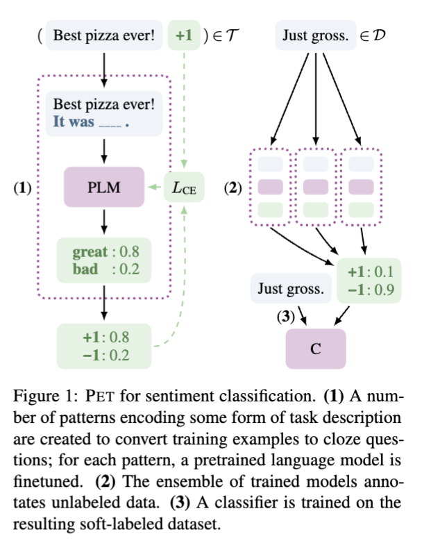
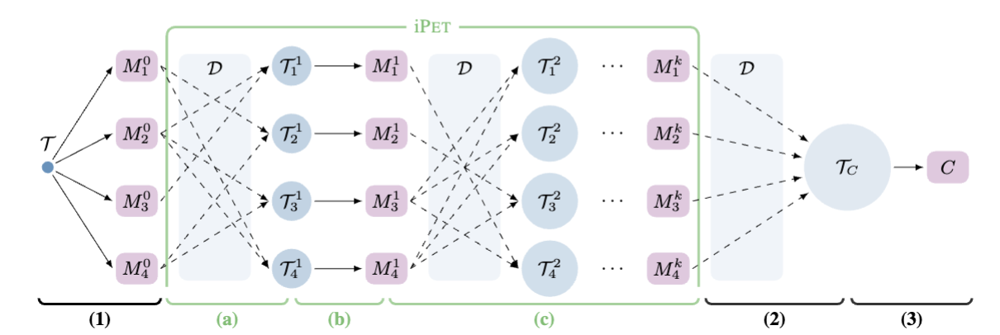
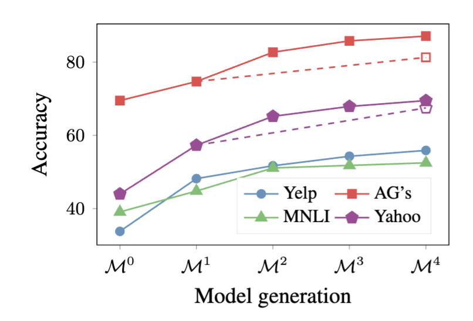

# Exploiting Cloze Questions for Few Shot Text Classification and Natural Language Inference
*Schick and Schütze (2021)*

This paper represents a paradigm shift in how we approach the "generalist vs. specialist" tension in NLP. By proving both mathematically and empirically that explicit task descriptions — delivered via **Cloze questions** — can bridge the chasm between zero-shot prompting and traditional supervised fine-tuning, the authors have provided a roadmap for high-performance NLP in data-scarce environments. Schick and Schütze demonstrate that we don't need to choose between the raw reasoning power of a massive pre-trained model and the precision of a task-specific classifier; PET allows us to seamlessly combine the innate, hidden knowledge of the former with the rigour of the latter.

What makes this paper particularly enduring is its grounding in "messy engineering reality." It acknowledges that while deep-pocketed researchers might have millions of labeled examples, the average practitioner is often working with a "shoestring" budget of maybe 50 human-annotated samples. By utilizing abundant, cheap unlabeled data through an elegant **Auxiliary Loss** mechanism, PET solves the problem of **Catastrophic Forgetting** without requiring specialized hardware or massive budgets. In a modern context, if you were faced with thousands of unread customer service tickets and only an afternoon to label a handful, the PET/iPET loop remains a "practical lightweight weapon" to bootstrap a highly accurate classifier by maximizing the return on every single human annotation.

As we move from the era of **Encoder-only models** (like BERT) toward the **Generative era** (like GPT and T5), this paper serves as a vital bridge. Structurally, it takes the rigid, internal-representation architecture of BERT and forces it to behave like a generative, prompt-driven model. It suggests that the boundary between "understanding" text and "generating" text is far more illusory than we previously thought. Ultimately, PET poses a profound philosophical question: when we fine-tune these models, are we actually teaching them anything new, or are we simply designing better "psychological tests" to unlock the latent, hidden knowledge they already acquired by reading the entire internet?

---

1. [The Core Problem: The "Signal-to-Noise" Crisis](#1-the-core-problem-the-signal-to-noise-crisis)
2. [The PET Solution: PVPs (Pattern-Verbalizer Pairs)](#2-the-pet-solution-pvps-pattern-verbalizer-pairs)
3. [The Math: "Restricted Softmax"](#3-the-math-restricted-softmax)
    * [How does the math work during training?](#how-does-the-math-work-during-training)
4. [Solving "Catastrophic Forgetting": The Auxiliary Loss](#4-solving-catastrophic-forgetting-the-auxiliary-loss)
    * [The Vulnerability of Few-Shot Updates](#the-vulnerability-of-few-shot-updates)
    * [The "Anchor" Mechanism](#the-anchor-mechanism)
    * [Balancing the Scales with Alpha ($\alpha$)](#balancing-the-scales-with-alpha-)
5. [iPET: The "Bootstrap" Loop](#5-ipet-the-bootstrap-loop)
    * [How we utilize the Unlabeled Data](#how-we-utilize-the-unlabeled-data)
    * [The 3-Step "Teacher-Student" Methodology](#the-3-step-teacher-student-methodology)
        1. [Step 1: The Teacher Ensemble](#step-1-the-teacher-ensemble)
        2. [Step 2: Confident Labeling (Knowledge Distillation)](#step-2-confident-labeling-knowledge-distillation)
        3. [Step 3: Training the Student Classifier](#step-3-training-the-student-classifier)
    * [Why the Iteration? (The iPET "Generations")](#why-the-iteration-the-ipet-generations)
        * [iPET fixes this through Generational Learning:](#ipet-fixes-this-through-generational-learning)
        * [PET vs. iPET](#pet-vs-ipet)
6. [The "Dark Knowledge" (Temperature)](#6-the-dark-knowledge-temperature)
    * [What is Dark Knowledge?](#what-is-dark-knowledge)
    * [The Role of Temperature ($T$)](#the-role-of-temperature-)
    * [Why this matters for PET:](#why-this-matters-for-pet)

---

## 1. The Core Problem: The "Signal-to-Noise" Crisis
**Transfer Learning** generally implies there is a plethora of data to learn from but what happens when we are faced with a labelled training dataset of say only 10 instances. 

In Few-shot Learning (10–50 examples), standard supervised fine-tuning is inherently flawed. When you bolt a randomly initialized linear layer onto the <CLS> token of a pre-trained model, you create a "stochastic barrier."

> **Few-shot Learning** means trying to get a model to generalize to unseen data using small amount of labeled examples

The issue is that the weights in that new layer start as **random noise**. With only 10 examples, the gradient signal from 10 examples is too weak to tune the random noise of a new classification head. The model spends all its energy trying to understand the new layer rather than the actual task. 

**The Pizza Review Example:** Imagine a 2-sentence training set:
* **T1:** "This was the best pizza I’ve ever had" $\rightarrow$ Positive
* **T2:** "You can get better sushi for half the price" $\rightarrow$ Negative

**The Under-specified Hypothesis Space:** Without a task description, the model is "lost." It doesn't know if the task is about Food Quality or Value for Money. When it encounters T3 ("The pizza was average. Not worth the price"), the gradients from T1 and T2 pull the weights in opposite directions. The model overfits to specific keywords rather than the underlying intent.

---

## 2. The PET Solution: PVPs (Pattern-Verbalizer Pairs)
This is where the paper introduces its core mechanism, the "cloze" question. Or in NLP terms, masked language modelling. 

BERT is optimized for filling in blanks. The authors of the paper asked a simple question: 
> "Instead of forcing the model to learn a new mathematical mapping to an arbitary label space from scratch, why don't we just reformat our classification task to look exactly like the pre-training task"

The paper introduces **PET** which bypasses the "bolt-on" layer by using the **Masked Language Model (MLM) head** already present in the pre-trained model. This allows us to "tell" the model the task through **Linguistic Archeology**. Additionally, removing the classifcation head means there are no freshly initalized weights to optimize. 

There are two parts to this approach the **The Pattern ($P$)** and **The Verbalizer ($V$)**.

**The Pattern ($P$)** is the "Syntactic Scaffolding." It transforms the input into a **Cloze task**, with the input being a sequence/sentence. 

> "The sushi was overpriced." $\rightarrow$ Pattern: "It was [MASK]."

**The Verbalizer ($V$)** is the mapping function. It maps your abstract labels (0 or 1) to real vocab words (terrible or great). The Verbalizer must be **Injective** (one-to-one). Each label must have a unique word to avoid ambiguous signals.

> Positive $\rightarrow$ "great";  Negative $\rightarrow$ "terrible"

---

## 3. The Math: "Restricted Softmax"
Standard MLM considers all 50,000+ words in a vocabulary. PET utilizes a **Restricted Softmax** that "slices" the logit vector to ignore everything except the words defined in the **Verbalizer**.

By forcing the model to distribute 100% of its probability mass among the task-relevant labels, the loss calculation becomes extremely stable. This effectively "narrows" the model's focus, making it a specialist without needing thousands of examples.

### How does the math work during training? 
Once the masked input (e.g., `"The food was [MASK]."` ) is fed into the model, the following mathematical pipeline occurs:

---
1. **Transformer Processing:** The sequence passes through the standard **Transformer** layers (**Self-Attention** and **Feed-Forward**), resulting in a contextualized hidden state for every token.
---
2. **Mask Extraction:** We isolate the hidden state vector ($h_{mask}$) specifically for the position of the [MASK]. The vectors for all other words are discarded.
---
3. **Vocabulary Projection:** The vector $h_{mask}$ is multiplied by the pre-trained MLM weights to project it across the entire vocabulary. This produces a massive vector of unnormalized logits ($z$)—typically 50,000+ values.
---
4. **Verbalizer Slicing:** Instead of applying **Softmax** to the whole vector, we perform a lookup for the indices of our Verbalizer words (e.g., the indices for "great" and "terrible"). We "slice" the logit vector to extract only these specific values.
    * The 12 or 24 layers of the Transformer are the **Body**. Their only job is to take raw text and turn it into a high-dimensional mathematical summary (the hidden state vector $h_{mask}$, which is usually 768 or 1024 dimensions).
    * The MLM **Head** is a final, single linear layer that sits on top of that body. It consists of a massive matrix of weights that were learned during pre-training.
    * When we say we "project" $h_{mask}$ across the vocabulary, we are doing a single matrix multiplication between the The Hidden Vector and Weight Matrix which produces a 1x50,000 vector of Logits.
---
5. **Restricted Softmax:** We apply the Softmax function only to these selected logits.
    * **The Math: **$P(v) = \frac{\exp(z_v)}{\sum_{v' \in V} \exp(z_{v'})}$
    * This ensures the model’s "attention" is locked exclusively onto the valid labels ($V$), ignoring the "noise" of the other 49,998 words in the dictionary.
---
6. **Loss Calculation:** We compare this restricted distribution to the **Ground Truth** (the actual label) using **Cross-Entropy Loss**.
    * If the review was 5-stars, the "target" is a one-hot vector where "great" = 1.0.
    * The model then uses backpropagation to update the weights of the entire Transformer based on how well it guessed "great" within that tiny restricted set.
---

## 4. Solving "Catastrophic Forgetting": The Auxiliary Loss
During the training phase, PET initially utilizes standard **Cross-Entropy Loss** ($Loss_{Task}$). We compare the model’s restricted softmax distribution against the "ground truth" provided by our 10 labeled examples. Mathematically, this is a **Negative Log-Likelihood** calculation: we take the log of the probability the model assigned to the correct verbalizer (e.g., "terrible"), multiply it by 1, and backpropagate that error to update the Transformer's weights. While this works for the task at hand, it immediately encounters the "brick wall" of **Catastrophic Forgetting**.

#### The Vulnerability of Few-Shot Updates
When a generalist model like **RoBERTa-Large** (350M parameters) is updated using a tiny dataset, the gradient updates become dangerously concentrated. The model effectively "warps" its latent space to satisfy the specific syntactic quirks of those 10 sentences, overwriting the vast, expensive linguistic knowledge it gained during pre-training. To prevent this "shattering" of the model’s internal logic, the authors leverage the reality of the data environment: while labeled data is scarce, unlabeled data from the same domain is usually abundant.

#### The "Anchor" Mechanism
PET introduces an **Auxiliary Language Modeling Loss** ($L_{MLM}$) which acts as a mathematical anchor to the pre-trained state. The total loss becomes a weighted sum:

$$Loss = Loss_{Task} + (\alpha \cdot Loss_{MLM})$$

While the model learns the specialist task, it is simultaneously forced to perform standard **Masked Language Modeling** on unlabeled sequences. It might seem that forcing the model to predict generic words like "the" or "restaurant" would dilute the fine-tuning, but this is intentional. The auxiliary task acts as a **regularization term**, creating "friction" against the specialist gradients. This friction ensures that the model adapts to the new task without destroying the multi-dimensional geometric balance that makes it a good general reasoner.

#### Balancing the Scales with Alpha ($\alpha$)
The relationship between these two losses is managed by the hyperparameter $\alpha$.

* If $\alpha = 1$, the model stays in a pre-training state and never learns the new task.
* If $\alpha = 0$, the model suffers catastrophic forgetting.

The authors found the "sweet spot" at a remarkably small value: $10^{-4}$. Even at this tiny scale, the auxiliary loss significantly impacts the gradients. This is because $L_{MLM}$ is computed across the entire 50,000-word vocabulary, making its raw numerical magnitude much larger than the $Loss_{Task}$, which is restricted to just a few verbalizer words. The small alpha scales the language model loss down so that it doesn't overwhelm the task-specific learning, but remains "heavy" enough to keep the model’s general language abilities "warm."

--- 

## 5. iPET: The "Bootstrap" Loop
The "Iterative" part of PET (iPET) is designed to solve a fundamental human problem: **Pattern Uncertainty**. When we design a **Cloze** prompt, we don't know which specific wording will resonate best with the model's internal latent space. Instead of gambling on one "perfect" pattern, iPET uses an ensemble to "rehabilitate" weak patterns through generational learning.

#### How we utilize the Unlabeled Data
A common question is whether we "pattern mask" the unlabeled data used for the auxiliary loss. The answer is **yes**: the unlabeled sentences are passed through the same PVP templates as the labeled data. However, the model is never asked to predict the label mask in these instances.
* **The Process:** We mask random words in the surrounding context (e.g., "the," "restaurant") and ask the model to predict those.
* **The Goal:** This reinforces the **structural syntax** of the pattern in the model's "mind" without providing it with biased labels. It keeps the model's general language skills sharp within the specific context of the task template.

### The 3-Step "Teacher-Student" Methodology
Since 10 examples are too few for a reliable validation set, the authors use **Knowledge Distillation** to move from an ensemble of "Teachers" to a single, efficient "Student."

---

#### Step 1: The Teacher Ensemble
We train several distinct models, each using a different PVP (Pattern-Verbalizer Pair). We don't know which pattern is best, so we let each model develop its own "perspective" on the task using the tiny labeled dataset.

---

#### Step 2: Confident Labeling (Knowledge Distillation)
The ensemble is unleashed on a massive unlabeled dataset. Each model in the ensemble "votes" on the labels for these millions of sentences.
* **Soft Labels:** We average the normalized scores to produce "soft labels" (probability distributions rather than 1/0 counts).
* **The Synthetic Dataset:** This effectively transforms a pile of raw text into a massive, silver-standard training set.

---

#### Step 3: Training the Student Classifier
Finally, we throw away the Cloze patterns and the PVPs entirely. We train a standard **BERT Sequence Classifier** (with a head bolted onto the `<CLS>` token) on the massive synthetic dataset.

**Why this step?** PET/Prompting is slow at inference because you have to process the extra "scaffolding" tokens. A standard classifier is fast, simple, and takes advantage of the "data efficiency" of prompting while retaining the "inference speed" of traditional supervised models.

---

### Why the Iteration? (The iPET "Generations")
The danger in Step 2 is **Pollution**. If a human designs 5 patterns and 3 of them are "garbage" (misaligned with the model), those 3 models will produce inaccurate labels, dragging down the average and poisoning the student's training data.

#### iPET fixes this through Generational Learning:
Rather than jumping straight to the final classifier, we expand the training set in discrete stages.

1. **Generation 1:** The initial ensemble labels a random subset of the unlabeled data. However, we only "keep" the examples where the models agree with **extreme confidence**.
2. **Expansion:** These new, high-confidence examples are added to the original 10-sentence pool (often quintupling the size of the training set).
3. **Generation 2:** A new ensemble is trained on this larger pool. Even the "awkward" patterns now have enough data to learn how to map their syntax to the correct labels.
4. **Zero-Shot Bootstrapping:** Remarkably, iPET can start with zero labeled examples. Generation 0 simply uses the pre-trained model's innate logic to find the first few "confident" labels in the unlabeled pool, effectively bootstrapping a specialist classifier from pure general knowledge.

### PET vs. iPET
* **PET:** One-shot distillation. You trust your patterns are good and train the student immediately.
* **iPET:** Multi-stage distillation. You assume your patterns might be bad and use the model's own confidence to "self-correct" and grow the training data before the final distillation.

--- 

## 6. The "Dark Knowledge" (Temperature)
In a standard neural network, the final layer is a **Softmax** that usually produces a very "peaky" distribution. If a model is 99.9% sure a review is "Positive," it will output a 1.0 for that label and effectively `0.0` for all others. This is a **Hard Label**.

#### What is Dark Knowledge?
The term "Dark Knowledge" (Geoffrey Hinton, 2015) refers to the rich information hidden in the **relative probabilities** of the incorrect classes.

**Example:** Imagine a model classifies an image of a Labrador.
* It gives "Labrador" 90%.
* It gives "Golden Retriever" 9%.
* It gives "Car" 1%.

A **Hard Label** (1.0 for Labrador) tells the student model: "This is a dog." 

The **Soft Label** (the 9%) tells the student: "This is a dog, and it looks a lot more like a Golden Retriever than it looks like a Car." This "similarity" between classes is the Dark Knowledge. It reveals the underlying structure of the semantic space that the model has learned.

#### The Role of Temperature ($T$)
During the distillation step in PET, we don't want the ensemble to just give the student model the "right" answer. We want it to share its nuances. We use **Temperature Scaling** to "thaw" the distribution.

In the Softmax formula, we divide the raw scores (logits) by $T$ before exponentiating:

$P_i = \frac{\exp(z_i / T)}{\sum_{j} \exp(z_j / T)}$

* When $T = 1$: You get the standard, confident Softmax.
* When $T > 1$: You "soften" the curve. The absolute differences between the scores shrink.

By setting $T > 1$, the ensemble’s output for a "Great" review might shift from a "Hard" `[0.99, 0.01]` to a "Soft" `[0.80, 0.20]`. That `0.20` is the "Dark Knowledge" being handed to the student. It forces the final classifier to learn not just the correct label, but the **linguistic boundaries** between labels.

> What conceptually is a soft label? To start a hard label is a one-hot vector, its is not ambiguous it is X. A soft label is a continious probability distribution. the ensemble averages the diserve outputs of the pattern models meanign the output looks somehting like 80% A, 10% B, 10% C. a hard label destroy naunces, a soft label preserves it

#### Why this matters for PET:
In the iPET loop, different patterns might focus on different nuances of the text. By averaging these "softened" distributions, the final classifier inherits the collective "wisdom" and uncertainty of all the teacher models, making it far more robust than if it had just been trained on 10 hard-labeled sentences.

---

# Direct Paper Extracts

## Abstract 
Some NLP tasks can be solved in a fully unsupervised fashion by providing a pretrained language model with “task descriptions” in natural language (e.g., Radford et al., 2019)

> Alec Radford, Jeff Wu, Rewon Child, David Luan, Dario Amodei, and Ilya Sutskever. 2019. [Language models are unsupervised multitask learners](https://cdn.openai.com/better-language-models/language_models_are_unsupervised_multitask_learners.pdf). Technical report.

---

While this approach underperforms its supervised counterpart, we show in this work that the two ideas can be combined: We introduce **Pattern-Exploiting Training** (PET), a semi-supervised training procedure that reformulates input examples as cloze-style phrases to help language models understand a given task. 

These phrases are then used to assign soft labels to a large set of unlabeled examples.

Finally, standard supervised training is performed on the resulting training set.

For several tasks and lan- guages, PET outperforms supervised training and strong semi-supervised approaches in low- resource settings by a large margin

---

## 1 Introduction

Due to the vast number of languages, domains and tasks and the cost of annotating data, it is common in real-world uses of NLP to have only a small number of labeled examples, making few-shot learning a highly important research area.

Unfortunately, applying standard supervised learning to small training sets often performs poorly; many problems are difficult to grasp from just looking at a few examples.

---

However, if we know that the underlying task is to identify whether the text says anything about prices, we can easily assign l′ to T3. This illustrates that solving a task from only a few examples becomes much easier when we also have a task description, i.e., a textual explanation that helps us understand what the task is about.

---

With the rise of pretrained language models (PLMs) such as GPT (Radford et al., 2018), BERT (Devlin et al., 2019) and RoBERTa (Liu et al., 2019), the idea of providing task descriptions has become feasible for neural architectures: We can simply append such descriptions in natural language to an input and let the PLM predict continuations that solve the task (Radford et al., 2019; Puri and Catanzaro, 2019)

So far, this idea has mostly been considered in zero-shot scenarios where no training data is available at all.

> Alec Radford, Jeff Wu, Rewon Child, David Luan, Dario Amodei, and Ilya Sutskever. 2019. [Language models are unsupervised multitask learners](https://cdn.openai.com/better-language-models/language_models_are_unsupervised_multitask_learners.pdf). Technical report.

> Raul Puri and Bryan Catanzaro. 2019. [Zero-shot text classification with generative language models](https://arxiv.org/abs/1912.10165). Computing Research Repository, arXiv:1912.10165.

---

In this work, we show that providing task descriptions can successfully be combined with standard supervised learning in few-shot settings

---

We introduce Pattern-Exploiting Training (PET), a semi-supervised training procedure that uses natural language patterns to reformulate input examples into cloze-style phrases

---

PET works in three steps: First, for each pattern a separate PLM is finetuned on a small training set T. The ensemble of all models is then used to annotate a large unlabeled dataset D with soft labels. Finally, a standard classifier is trained on
the soft-labeled dataset.

---

We also devise iPET, an iterative variant of PET in which this process is repeated with increasing training set sizes

---

On a diverse set of tasks in multiple languages, we show that given a small to medium number of labeled examples, PET and iPET substantially outperform unsupervised approaches, supervised training and strong semi-supervised baselines.

---

## 2 Related Work

Radford et al. (2019) provide hints in the form of natural language patterns for zero-shot learning of challenging tasks such as reading comprehension and question answering (QA). 

---

Another recent line of work uses cloze-style phrases to probe the knowledge that PLMs acquire during pretraining; this includes probing for factual and commonsense knowledge (Trinh and Le, 2018; Petroni et al., 2019; Wang et al., 2019; Sakaguchi et al., 2020), linguistic capabilities (Ettinger, 2020; Kassner and Sch  ̈utze, 2020), understanding of rare words (Schick and Schutze, 2020), and ability to perform symbolic reasoning (Talmor et al., 2019).

---

Jiang et al. (2020) consider the problem of finding the best pattern to express a given task

---

## 3 Pattern-Exploiting Training

Let $M$ be a masked language model with vocabulary $V$ and mask token $\_\_\_\_ \in V$, and let $\mathcal{L}$ be a set of labels for our target classification task $A$.

We write an input for task $A$ as a sequence of phrases $\mathbf{x} = (s_1, \dots, s_k)$ with $s_i \in V^*$; for example, $k = 2$ if $A$ is textual inference (two input sentences). 

We define a $\textit{pattern}$ to be a function $P$ that takes $\mathbf{x}$ as input and outputs a phrase or sen- tence $P(\mathbf{x}) \in V^*$ that contains exactly one mask token, i.e., its output can be viewed as a cloze ques-
tion. 

Furthermore, we define a $\textit{verbalizer}$ as an injective function $v : \mathcal{L} \rightarrow V$ that maps each label to a word from $M$'s vocabulary. We refer to $(P, v)$ as a $\textit{pattern-verbalizer pair}$ (PVP).

---

Using a PVP $(P, v)$ enables us to solve task $A$ as follows: Given an input $x$, we apply $P$ to obtain an input representation $P(x)$, which is then processed by $M$ to determine the label $y ∈ L$ for which $v(y)$ is the most likely substitute for the mask

For example, consider the task of identifying whether
two sentences a and b contradict each other (label
$y_0$) or agree with each other ($y_1$).

For this task, we may choose the pattern $P(a,b) = a? <MASK>, b$. combined with a verbalizer $v$ that maps $y_0$ to “Yes” and $y_1$ to “No”. Given an example input pair

> Just to be clear. The model is predicting `1` or `0`, the verbalizer is mapping this to a given subset of language.

`x = (Mia likes pie, Mia hates pie)`

the task now changes from having to assign a label
without inherent meaning to answering whether the
most likely choice for the masked position in

$P(x)$ = `Mia likes pie? <MASK>, Mia hates pie`

is “Yes” or “No”.

> It is really important to understand what the authors are demonstrating here. 
>
> In standard pre-training (the Masked Language Model task), we take a real sentence like "The cat sat on the mat" and hide the word "mat." The model learns to predict "mat" because it was physically there in the training data.
>
> In PET, we are creating a Synthetic Cloze Task. The "imaginary" word (the Mask) doesn't exist in any original text. Instead, we insert it into a Pattern we created. The model isn't trying to recover a hidden word. It is using it's understanding of linguistics to decide what word should be there. 
> 
> PET transforms Classification into a "Completion" game

---

## 3.1 PVP Training and Inference
Let $\mathbf{p} = (P, v)$ be a PVP. We assume access to a small training set $\mathcal{T}$ and a (typically much larger) set of unlabeled examples $\mathcal{D}$. For each sequence $\mathbf{z} \in V^*$ that contains exactly one mask token and $w \in V$, we denote with $M(w \mid \mathbf{z})$ the unnormalized score that the language model assigns to $w$ at the masked position. Given some input $\mathbf{x}$, we define the score for label $l \in \mathcal{L}$ as:

$$s_{\mathbf{p}}(l \mid \mathbf{x}) = M(v(l) \mid P(\mathbf{x}))$$

> The model output $M(\cdot)$ in this formula refers to the raw logit (a number), not a word. In a standard Transformer like BERT or RoBERTa, the very last layer before you see a "word" is a vector of thousands of numbers. nside the model $M$, there is a final linear layer (the "MLM Head") that has one output neuron for every word in the dictionary. These numbers are called Logits.
> 
> When the paper writes $M(v(l) \mid P(\mathbf{x}))$, it is saying:
>
> 1. Run the sentence with the pattern $P(\mathbf{x})$ through the model.
> 2. Go to that final layer of 50,000 logits.
>3. Find the specific index for the word $v(l)$ (e.g., the word "great").
> 4. The "Output" of $M$ is just that one specific number (the logit) associated with that word.

and obtain a probability distribution over labels using softmax:

$$q_{\mathbf{p}}(l \mid \mathbf{x}) = \frac{e^{s_{\mathbf{p}}(l \mid \mathbf{x})}}{\sum_{l' \in \mathcal{L}} e^{s_{\mathbf{p}}(l' \mid \mathbf{x})}}$$

We use the cross-entropy between $q_{\mathbf{p}}(l \mid \mathbf{x})$ and the true (one-hot) distribution of training example $(\mathbf{x}, l)$ — summed over all $(\mathbf{x}, l) \in \mathcal{T}$ — as loss for finetuning $M$ for $\mathbf{p}$.

> If the human label for a review is "Positive," we tell the model the probability of "great" should have been 1.0. The model compares its calculated $q_{\mathbf{p}}$ to that 1.0, finds the error, and updates its weights so that next time, the word "great" gets a higher logit in that context.

---

## 3.2 Auxiliary Language Modeling

As a PLM finetuned for some PVP is still a language model at its core, we address this by using language modeling as auxiliary task.

With $L_CE$ denoting cross-entropy loss and $L_MLM$ language modeling loss, we compute the final loss as

$L = (1 - \alpha) \cdot L_{\text{CE}} + \alpha \cdot L_{\text{MLM}}$

As $L_MLM$ is typically much larger than LCE, in preliminary experiments, we found a small value of $α = 10^{−4}$ to consistently give good results, so we use it in all our experiments.

To obtain sentences for language modeling, we use the unlabeled set $D$. However, we do not train directly on each $x \in D$, but rather on $P(x)$, where we never ask the language model to predict anything for the masked slot.

---

## 3.3 Combining PVPs
A key challenge for our approach is that in the
absence of a large development set, it is hard to
identify which PVPs perform well. 

To address this,
we use a strategy similar to knowledge distillation
(Hinton et al., 2015).

First, we define a set $\mathcal{P}$ of PVPs that intuitively make sense for a given task $A$. 

> To choose a "good" PVP (Pattern-Verbalizer Pair), you have to consider what the model already knows from its pre-training. You want to pick patterns that mimic how humans naturally write and verbalizers that use high-frequency, "pure" semantic words.

| PVP | Pattern $(P)$ | Verbalizer $(v) $| 
| :--- | :--- | :--- |
| Opinion | `[Input Text] It was [MASK]` | Pos: "great", Neg: "terrible" | 
| Reviewer | `[Input Text] The reviewer felt [MASK]` | Pos: "happy", Neg: "sad"
| Summary | `[MASK] movie review: [Input Text]` | Pos: "Good", Neg: "Bad" |

We then use these PVPs as follows:

(1) We finetune a separate language model $M_{\mathbf{p}}$ for each $\mathbf{p} \in \mathcal{P}$ as described in Section 3.1. As $\mathcal{T}$ is small, this finetuning is cheap even for a large number of PVPs.

(2) We use the ensemble $\mathcal{M} = \{M_{\mathbf{p}} \mid \mathbf{p} \in \mathcal{P}\}$ of finetuned models to annotate examples from $\mathcal{D}$. We first combine the unnormalized class scores for each example $\mathbf{x} \in \mathcal{D}$ as

$s_{\mathcal{M}}(l \mid \mathbf{x}) = \frac{1}{Z} \sum_{\mathbf{p} \in \mathcal{P}} w(\mathbf{p}) \cdot s_{\mathbf{p}}(l \mid \mathbf{x})$

where $Z = \sum_{\mathbf{p} \in \mathcal{P}} w(\mathbf{p})$ and the $w(\mathbf{p})$ are weighting terms for the PVPs. We experiment with two different realizations of this weighting term: either we simply set $w(\mathbf{p}) = 1$ for all $\mathbf{p}$ or we set $w(\mathbf{p})$ to be the accuracy obtained using $\mathbf{p}$ on the training set before training. We refer to these two variants as uniform and weighted. Jiang et al. (2020) use a similar idea in a zero-shot setting.

We transform the above scores into a probability distribution $q$ using softmax. Following Hinton et al. (2015), we use a temperature of $T = 2$ to obtain a suitably soft distribution. All pairs $(\mathbf{x}, q)$ are collected in a (soft-labeled) training set $\mathcal{T}_C$.

(3) We finetune a PLM $C$ with a standard sequence classification head on $\mathcal{T}_C$

The finetuned model $C$ then serves as our classifier for $A$

> Figure 1: PET for sentiment classification. (1) A number of patterns encoding some form of task description are created to convert training examples to cloze questions; for each pattern, a pretrained language model is finetuned. (2) The ensemble of trained models annotates unlabeled data. (3) A classifier is trained on the resulting soft-labeled dataset.

---

## 3.4 Iterative PET (iPET)
Distilling the knowledge of all individual models into a single classifier C means they cannot learn from each other. As some patterns perform (possibly much) worse than others, the training set $T_C$ for our final model may therefore contain many mislabeled examples.

To compensate for this shortcoming, we devise iPET, an iterative variant of PET. The core idea of iPET is to train several generations of models on datasets of increasing size

To this end, we first enlarge the original dataset $T$ by labeling selected examples from Dusing a random subset of trained PET models (Figure 2a). We then train a new generation of PET models on the enlarged dataset (b); this process is repeated several times (c).

More formally, let $\mathcal{M}^0 = \{M_1^0, \dots, M_n^0\}$ be the initial set of PET models finetuned on $\mathcal{T}$, where each $M_i^0$ is trained for some PVP $\mathbf{p}_i$. 

We train $k$ generations of models $\mathcal{M}^1, \dots, \mathcal{M}^k$ where $\mathcal{M}^j = \{M_1^j, \dots, M_n^j\}$ and each $M_i^j$ is trained for $\mathbf{p}_i$ on its own training set $\mathcal{T}_i^j$. 

In each iteration, we multiply the training set size by a fixed constant $d \in \mathbb{N}$ while maintaining the label ratio of the original dataset. That is, with $c_0(l)$ denoting the number of examples with label $l$ in $\mathcal{T}$, each $\mathcal{T}_i^j$ contains $c_j(l) = d \cdot c_{j-1}(l)$ examples with label $l$. This is achieved by generating each $\mathcal{T}_i^j$ as follows:

After training $k$ generations of PET models, we use
$\mathcal{M}^k$ to create $\mathcal{T}_C$ and train $C$ as in basic PET.

With minor adjustments, iPET can even be used in a zero-shot setting

> Figure 2: Schematic representation of PET (1-3) and iPET (a-c). **(1)** The initial training set is used to finetune an ensemble of PLMs. **(a)** For each model, a random subset of other models generates a new training set by labeling examples from D. **(b)** A new set of PET models is trained using the larger, model-specific datasets. **(c)** The previous two steps are repeated k times, each time increasing the size of the generated training sets by a factor of d. **(2)** The final set of models is used to create a soft-labeled dataset TC. **(3)** A classifier C is trained on this dataset.

--- 

## 4 Experiments
We investigate the performance of PET and all baselines for different training set sizes; each model is trained three times using different seeds and average results are reported.

As we consider a few-shot setting, we assume no access to a large development set on which hyperparameters could be optimized

Our choice of hyperparameters is thus based on choices made in previous work and practical considerations. We use a learning rate of $1*10^{−5}$, a batch size of $16$ and a maximum sequence length of $256$.

Unless otherwise specified, we always use the weighted variant of PET with auxiliary language modeling. For iPET, we set $λ = 0.25$ and $d = 5$; that is, we select 25% of all models to label examples for the next generation and quintuple the number of training examples in each iteration.

---

## 4.1 Patterns
We now describe the patterns and verbalizers used for all tasks.

$\textbf{Yelp}$ For the Yelp Reviews Full Star dataset (Zhang et al., 2015), the task is to estimate the rating that a customer gave to a restaurant on a 1- to 5-star scale based on their review's text. We define the following patterns for an input text $a$:

$P_1(a) = \text{It was \_\_\_\_. } a \quad P_2(a) = \text{Just \_\_\_\_! } \| \ a$

$P_3(a) = a. \text{ All in all, it was \_\_\_\_.}$

$P_4(a) = a \ \| \ \text{In summary, the restaurant is \_\_\_\_.}$

We define a single verbalizer v for all patterns as

1. $v(1) =$ terrible 
2. $v(2) =$ bad 
3. $v(3) =$ okay
4. $v(4) =$ good 
5. $v(5) =$ great

---

Yahoo Yahoo Questions (Zhang et al., 2015) is a text classification dataset. Given a question a and an answer b, one of ten possible categories has to be assigned. We use the same patterns as for AG’s News, but we replace the word “News” in P5 with the word “Question”. We define a ver- balizer that maps categories 1–10 to “Society”, “Science”, “Health”, “Education”, “Computer”, “Sports”, “Business”, “Entertainment”, “Relation- ship” and “Politics”.

---

## 4.2 Results
Zero-shot iPET clearly outperforms the unsupervised baselines for all datasets (L3 vs L1)

on AG’s News, it even performs better than standard supervised training with 1000 examples (L3 vs L13)

With just 10 training examples, standard supervised learning does not perform above chance (L4).

In contrast, PET (L5) performs much better than the fully unsupervised baselines (L1–L2); 

training multiple generations using iPET (L6) gives consistent improvements

#### Comparison with SotA 
We compare PET to UDA (Xie et al., 2020) and MixText (Chen et al., 2020), two state-of-the-art methods for semi- supervised learning in NLP that rely on data augmentation. Whereas PET requires that a task can be expressed using patterns and that such patterns be found, UDA and MixText both use backtranslation (Sennrich et al., 2016) and thus require thousands of labeled examples for training a machine translation model.

We use RoBERTa (base) for our comparison as MixText is specifically tailored towards a 12-layer Transformer (Vaswani et al., 2017). Both Xie et al. (2020) and Chen et al. (2020) use large development sets to optimize the number of training steps. 

Despite this, Table 2 shows that PET and iPET substantially outperform both methods across all tasks, clearly demonstrating the benefit of incorporating human knowledge in the form of PVPs.

---

## Analysis

#### Combining PVPs
We first investigate whether PET is able to cope with situations were some PVPs perform much worse than others. 

Even after finetuning, the gap between the best and worst pattern is large, especially for Yelp.

However, PET is not only able to compensate for this, but even improves accuracies over using only the best- performing pattern across all tasks.

Distillation brings consistent improvements over the ensemble; additionally, it significantly reduces the size of the final classifier. We find no clear difference between the uniform and weighted variants of PET

#### Auxiliary Language Modeling
We analyze the influence of the auxiliary language modeling task on PET’s performance.

Figure 3 shows performance improvements from adding the language modeling task for four training set sizes.

We see that the auxiliary task is extremely valuable when training on just 10 examples. With more data, it becomes less important, sometimes even leading to worse performance.

#### Iterative PET
To check whether iPET is able to improve models over multiple generations, Figure 4 shows the average performance of all generations of models in a zero-shot setting.

Each additional iteration does indeed further improve the ensemble’s performance. 

Another natural question is whether similar results can be obtained with fewer iterations by increasing the training set size more aggressively. To answer this question, we skip generations 2 and 3 for AG’s News and Yahoo and for both tasks directly let ensemble M1 annotate $10*5^4$ examples for M4. As indicated in Figure 4 through dashed lines, this clearly leads to worse performance, highlighting the importance of only gradually increasing the training set size.

We surmise that this is the case because annotating too many examples too early leads to a large percentage of mislabeled training examples.

#### In-Domain Pretraining
Unlike our supervised baseline, PET makes use of the additional unlabeled dataset D. Thus, at least some of PET’s performance gains over the supervised baseline may arise from this additional in-domain data.

To test this hypothesis, we simply further pre-train RoBERTa on in-domain data, a common technique for improving text classification accuracy (e.g., Howard and Ruder, 2018; Sun et al., 2019). As language model pretraining is expensive in terms of GPU usage, we do so only for the Yelp dataset.

Figure 5 shows results of supervised learning and PET both with and without this in-domain pretraining. While pretraining does indeed improve accuracy for supervised training, the supervised model still clearly performs worse than PET, showing that the success of our method is not simply due to the usage of additional unlabeled data.

Interestingly, in-domain pretraining is also helpful for PET, indicating that PET leverages unlabeled data in a way that is clearly different from standard masked language model pretraining

---

## 6 Conclusion
We have shown that providing task descriptions to pretrained language models can be combined with standard supervised training.

Our proposed method, PET, consists of defining pairs of cloze question patterns and verbalizers that help leverage the knowledge contained within pretrained language models for downstream tasks.

We finetune models for all pattern-verbalizer pairs and use them to create large annotated datasets on which standard classifiers can be trained.

When the initial amount of training data is limited, PET gives large improvements over standard supervised training and strong semi-supervised approaches.

---