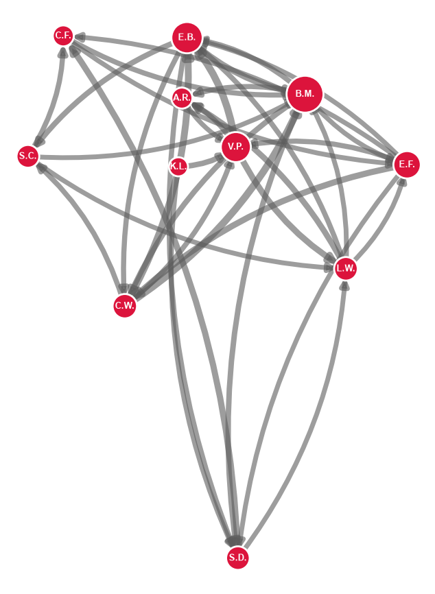
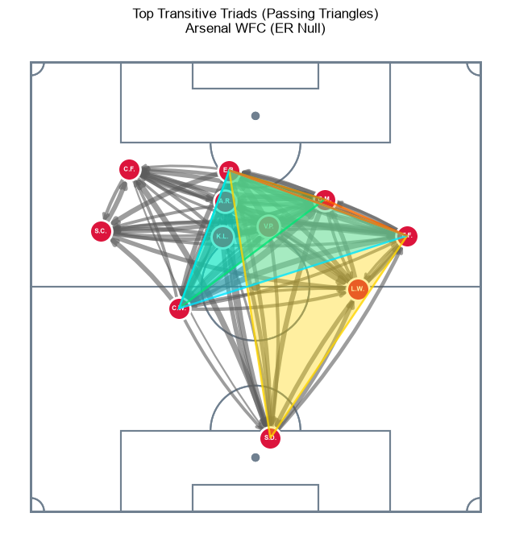

# Network Science (981G5) Assessment

**Project Goals and Scope:**
The purpose of this project is to begin the research into establishing an appropriate framework for constructing null models in football, or any field based sport for that matter. Football matches can be represented as networks by taking on-field interactions between two players A -> B and constructing these as the basis for edge. A common example, which is the basis for this project, is passed with the output referred to as a PassMap. The game of football and PassMaps presents a particular challenge for null generative processes due to the physical constraints and domain nuances. The game is played within a pitch which means the spatial coordinates are constrained and the onfield actions are bound by the realism of physics, i.e. the ball can only travel in a reasonable way. Additionally, the game has a purpose to score in the opposing goes, hence, nodes and edge inputs must behave in a way which is representative of the way the game is (currently) played. Buldu (2018) is the seminal paper that formalized the PassMap paradigm(s). Here they stated that Null models were close to being constructed and were integrated for the baselining of networking properties. However, the Football network science researchers took a different route, focusing their efforts on Markovian dynamics on the network lineages which were deemed to be self-baseline as probabilistic representation of dynamics. This lead to the construct of advanced dynamic network metrics such as spectral gap and .. (Gama et al. 2026). However, the literature has come full circle and researchers (Gama et al. 2026) are once again actively calling for the construction of null models in football so that they can benchmark their advanced metrics. This project takes the first step in building out such null processes specifically for football. To do this, we actually pick up directly the markovian process which have been utilised to model dynamics on the network and adapt them to establish representation of the dynamics of the network. Building these underlying representations allows a generative process to reproduce null networks which maintains certain network properties, destroy the remaining properties but retain the spatial and domain qualities of the game of football. Specifically, we construct a 1st order Markovian process which models a probability distribution of likely role/position recipient of passes based on a league wide average of 89,000 passes from the 22/23 WSL seasons. This allows us to take a match-team worth of existing passes and run a resampling process which shuffles the pass receivers. This process retains the number of degrees and each nodes out degrees whilst shuffling recipient players in-degrees. By retaining the underlying pass (who makes the pass, where it starts and where it ends) the domain considerations of football is kept intact, i.e. the purpose of the teams actions. Additionally, all spatial aspects are retained recalling that passes compile into network edges. Learning the markovian process from empirical league-data encoded realistic tactic behaviours which by definition will be physically accurate. Shuffling recipients essentially destroys the tactical or performance nuance of a given network. Therefore, the null models retain network properties but contain network properties which are samples from the league average allowing the statistical range of network properties to behave as a benchmarking tool for empirical network analysis. Upon construction a null process, we validate it using degree analysis to determine if the metrics represent a football network or not. The focus is on heterogeneity, node roles and adj matrix similarity. Additionally, we demonstrate by traditional null approaches, e.g. ER, are fundamentally flawed for football. At the start of the project we demonstrate that network properties can be used for football analysis and translate such properties in football terms. After constructing our null process, we attempt to use it to baseline the network. Related to this, we also demonstrate that despite having a season's worth of data, empirical statistical baselines are flawed and nulls are required. Finally, this paper does not claim to have invented the framework for constructing nulls in football. This topic is very complicated and if it has an easy approach it would be documented. As it stands, there are no examples in the literature of constructing a null model in football. The basis of this project comes from Buldu’s (2018) introduction of the need of null in football and Gama et al. (2026) contemporary call for nulls.

---

┌──────────────────────────────────────────────────────────┐
│ SECTION 1: Introduction & Foundations                    │
├──────────────────────────────────────────────────────────┤
│ SECTION 2: Data Pipeline & Diagnostic Metric Showcase    │
├──────────────────────────────────────────────────────────┤
│ SECTION 3: The Literature Gap (Alves, Gama, Buldú)       │
├──────────────────────────────────────────────────────────┤
│ SECTION 4: 1st-Order Generative Null Engine (Recipient)  │
├──────────────────────────────────────────────────────────┤
│ SECTION 5: Practical Application & Case Study            │
├──────────────────────────────────────────────────────────┤
│ SECTION 6: Methodological Limitations & Conclusion       │
└──────────────────────────────────────────────────────────┘

---

## 1. Introduction

### 1.1 Network Science Introduction
Network Science is an intuitive, problem-driven framework for modeling complex systems, abstracting real-world interactions into formal structures of nodes and links to evaluate both system-wide graph topology and the dynamic processes flowing across it.

Its applications are highly versatile and have been successfully deployed across a wide spectrum of domains. For instance, network science is frequently used to identify influential individuals within social and organizational systems through the quantification of high-degree hubs and structural centralities that locate key playmakers, broadcasters, or bottlenecks (Wasserman & Faust, 1994; Newman, 2001; Rodrigues, 2019). Beyond individual metrics, it provides the tools to detect modular community structures, uncovering functional sub-groups or "echo chambers" where elements connect more densely to one another than to the broader network (Fortunato, 2010). Furthermore, the framework enables the modeling of spreading cascades, such as the propagation of biological epidemics or information cascades, revealing how structural features like heavy-tailed degree distributions dictate whether a contagion fizzles out locally or reaches a global tipping point (Pastor-Satorras & Vespignani, 2001; Barrat et al., 2008). Network science also allows researchers to evaluate systemic robustness and degree assortativity across ecological and infrastructure systems, determining how complex architectures withstand random failures versus targeted attacks (Lusseau, 2003; Newman, 2003).

By abstracting disparate domain interactions into shared topological representations, network science moves away from a reductionist, isolationist view of individual components. Instead, it offers a universal toolkit to uncover the emergent organizational principles governing the collective behavior of modern complex systems.

---

### 1.2 Why Apply Network Science to Football
This report focuses exclusively on the application of Network Science to sport (Araújo et al., 2006), specifically football, a field-based, team sport (Duch et al., 2010). Traditional football analysis relies primarily on terminal, individual performance indicators such as passes completed, goals scored, or advanced modeled parameters like Expected Goals (xG; Pollard & Reep, 1997; [xG Reference]), which assigns a probabilistic value to shot quality using historical spatial event data. However, an isolationist perspective is fundamentally flawed because football functions as a complex adaptive system (Buldú et al., 2019). The success of a team cannot be truly understood through isolated individual metrics alone, but is instead determined by the emergent structure derived from continuous individual and collective behaviors and on-pitch tactical organization (Gama et al., 2026).

---

### 1.3 How Apply Network Science to Football
To analyze a system through network science, a domain problem must first be decomposed into a discrete set of nodes and edges. Intuitively, in football, the players of a single team are modeled as nodes ($N=11$), expanding to $N=22$ when incorporating opposition players, or $N=23$ if treating the ball itself as a distinct entity. Edges represent the relational interactions connecting these nodes. However, football represents a complex, multi-layered system where abstract interactions occur continuously. Many of these interactions lack a discrete physical contact event, manifesting instead through spatial control and positional coordination.

To overcome this, completed passes offer a highly pragmatic and objective interaction metric. A completed pass physically connects two teammates (Player A $\rightarrow$ Player B), serving as a discrete event that encodes tactical intent, team strategy, and the structural constraints imposed by the game environment. The representation of teammates as nodes and completed passes as directed edges is known as the PassMap paradigm (Buldú et al., 2018). While several variations of this framework exist — which will be detailed and visualized in Section 1.3: The PassMap Paradigm — the output network is fundamentally a weighted, directed graph where edge weights reflect cumulative passing volume between player pairs.

There are numerous ways this emergent PassMap network can be decomposed into structural network properties and flow dynamics. In 
Section 2.2: Metric Taxonomy, we analyse 1-hop degrees-level metrics to infer insight on a given team-match network but also devel into more avanced properties, Average Shortest Path (Section X), Betweenness Centrality (Seciton X) and Clustering (Section X), to provide inference on how network properties can be used to produce in-depth on-field analysis that might otherwise take a team of high skilled scouts and analyst to conver. 
> Needs polishing

---

### 1.4 The Null Baseline Problem and Project Scope
> needs better heading
However, evaluating raw network properties in isolation — or comparing them directly across flawed empirical baselines (Section X) — provides limited diagnostic value. Properties are inherently shaped by their underlying topological and domain-specific constraints. To validate whether an observed network property is statistically significant, it must be evaluated against an appropriate null model baseline, which we define as a randomized or generative reference network that preserves structural constraints (e.g. degrees, desity, degree sequences) while destroying specific organizational patterns to isolate true signal from random chance.

Gama et al. (2026) demonstrated that while modern sports analytics can compute advanced network properties and stochastic flow metrics, these values remain purely descriptive without reference distributions. Without a statistical baseline, analysts cannot determine whether match-to-match variations in a team’s network structure reflect deliberate tactical execution or mere stochastic noise. Constructing a valid null network in football presents a unique challenge due to the game's strict spatial constraints. A meaningful baseline must reconcile random generative process with physical pitch geometry, expected player movement behaviours, and spatial proximity.

In their seminal paper introducing the PassMap paradigms, Buldu et al. (2018) stated that Null models were a requirement for football analysis and their production of a valid null framework was imminent. However, football's network science research lineage took a heavy turn toward "dynamic on the network" focused work (include exmaples and reference). They've processes were thought to preclude the requirement for null baselines as the probabilsitic mechanisms were self evaluating. That said, the lituruature that has ultiamtely come full circle and recognised that these advanced, dynamical proccess too need robust null baselines to infer value. Hence, this project serves as a direct response to the explicit calls in recent literature for generative, spatially constrained null models capable of establishing robust statistical baselines in football analytics (Gama et al., 2026).
> needds polishing
> appears to repeat slightly in p2 and p3

---

## 2 Data
The dataset comprises StatsBomb event data from the 2023/2024 FA Women's Super League (`competition_id: 37`, `season_id: 281`). Focusing on women's football directly addresses literature deficits regarding the overreliance on short men's samples and the systemic underrepresentation of longitudinal women's datasets (Alves et al., 2025; Gama et al., 2026).

Raw spatiotemporal event logs are non-relational and must be transformed into directed, weighted adjacency matrices $A_{ij}$. For our PassMap framework, we isolate completed passes using four attributes:

As mentioned, we are focusing on PassMap paradigm, meaning the only events we want are completed passes (`event_type: pass`). From the pass event payload, we extract core attributes:
- Passer (source node $i$)
- Recipient (target node $j$)
- Origin $(x_1, y_1)$
- Destination $(x_2, y_2)$

StatsBomb's $120 \times 80$ yard coordinates are rescaled to a $100 \times 100$ relative grid to normalize across varying pitch dimensions (Buldú et al., 2019). Figure 1 demonstrates what this raw pass data looks like prior to network construction. 

An on field team comprised of 11 players (nodes), however, football allows for substitutions meaning more than 11 can participate in the game ($N > 11$). Prominent examples in the liturature assign replacment players as contigous entitys to retain 11 nodes but this obscures individual behavour (Narizuka et al., 2014; Buldú et al., 2019). Conversely, expanding the node count ($N > 11$) introduces low-volume, isolated nodes that distort network invariants like density and clustering coefficients. We opt of a parsimonous approach we just model the 11 most used players in a match. The limitation of this approach is that is discards a small proporiton of the data but this is unlikely to significantly impact network characterstics. 

> Somewhere, either in 2 Data or 3 Passing Network Paradigms, we need to explain that we are using the max pass from the data for our candiate network. Probably in 2.

#### Figure 1: Raw Pass Plotting for 1 Match: Sub-plot 1 Indivudal player vs Sub-plot 2 Whole Team

#### Table 1: Summary of Dataset Statistics (WSL 2023/2024)
| Metric Category | Dataset Statistic |
| :--- | :--- |
| **Competition / Season** | FA Women's Super League (WSL) $2023/2024$ |
| **Total Matches** | `132` |
| **Total Team Network** | `264` |
| **Total Season Passes Recorded** | `105,262` |
| **Mean Passes per Team per Match** | `399` (Range: `120-847`) |
| **Mean Unique Players Used per Team per Match** | `15.1` (Range: `12-16`) |
> this table needs a review. I think the passes have changed. 

---

## 3 Passing Network Paradigms
In this project, team organization across entire football matches is modeled using the PassMap paradigm popularized by Buldú et al. (2019). Fundementally, this is a directed, weighted network where the edges ($E$) represent completed passes, and the edge weights ($W$) quantify the accumulated total frequency of passes directed from node $i$ to node $j$ over a given observation window—in this study, a full 90-minute match.

$$G = (V, E, W)$$

The authors introduces 3 tiers of PassMap paradigms: Player Networks, Player-Pitch Networks, and Pitch Networks. In these paradigms the definition of edges remains the same but the abstract of the node changes. For this project we will be focusing only on the Player PassMap paradigm where the node set corresponds directly to the eleven players on the pitch ($\vert V \vert = 11$). This allows for nodes to appended with attributed containing the unique player identity (e.g., name, shirt number, or tactical position). In its most basic implementation, a Player Network is topologically abstract and devoid of spatial context. However, a widespread convention is to append spatial $(x, y)$ coordinates to each node, calculated as the player's average position on the pitch during the match. While assigning mean positional coordinates leaves traditional topological network metrics unchanged, it significantly enhances visual interpretability and establishes a continuous baseline for spatial considerations. 

Figure 2 demonstates two visualisation examples of the same PassMap network. The left sub-plot demonstates the network overlayed on a football pitch. The nodes and pitch are develop with consistent coordinate systems so meaning it allows us to infer true average player positions. This is helpful for understanding node and sub-communitity relationships. However, the density of the plot obscured edge visability, which for small network ($N=11$) is a useful analysis tool. The sub-plot abstract the network from the pitch but retains the nodes spatial coodinates. As the network is not constrained, we can plot it bigger and better see the network and its emergent relationships.

The other paradigms are not used in this project but for referece: 
- Pitch-Location Networks are formuled as $G = (K, E, W)$ (Buldú et al., 2018) and abstract away players entirely, establising the node set ($K$) as discretized sub-regions of the pitch. This approach acts as a purely geographic baseline, helping to decompose whether ball progression is driven by pitch topology/geography or by specific tactical instructions.
- Player-Pitch Network (Buldú et al., 2019) segments pitch also but defines composite nodes that represent a specific Player $P$ located within a specific Pitch Zone $K$. A player generates a unique node in every grid zone where they execute or receive a pass. This hybrid paradigm captures dynamic tactical positioning alongside passing decisions by measuring discrete spatial movement. It also vastly scales up the number of nodes. Narizuka et al. (2014) leveraged this increase node density to re-evaluate prior claims that football passing networks exhibit scale-free properties (Yamamoto & Yokoyama, 2011). By expanding the network via spatial discretization, Narizuka et al. concluded that passing networks actually adhere to a Gamma distribution rather than a power law.

Player Networks are used for this project because they are the most dominant representation in football analytics literature (Duch et al.; Grund; Gama et al., 2026; Alves et al., 2025) allowing for deeper theoretical interpretation, they are the most intutative to visually inspect as they remain the closest to the visual game of football and they avoid the requirement to add an additional pre-processing spatial discretization step, of which there is no consensus standard in the literature to go by (Camerino et al., 2012; Narizuka et al., 2014; Arriaza-Ardiles et al., 2018)

#### Figure 2: Player Network PassMap Paradigm Examples: Pitch vs Frameless

---

## 4 Football Network Metrics
The application of Network Science to football transforms positional passing data into structural models, allowing tactical dynamics to be analyzed through mathematical properties (López-Peña & Touchette, 2012). Rather than evaluating players in isolation, passing networks treat players as nodes and completed passes as directed, weighted edges (Cotta et al., 2013).

A comprehensive mapping of network properties to their football equivalents is detailed in Appendix A (adapted from Gama et al., 2026), with a core subset outlined in Table X.

---

### 4.1 The Multi-Scale Network Framework
To systematically map network properties to footballing concepts, researchers broadly categorize analysis across three structural scales: Micro-scale, Meso-scale, and Macro-scale (Alves et al., 2025; Gama et al., 2026).

#### 4.1.1 Micro-Scale Analysis
At the micro-scale, the focus rests on individual nodes (players). The most fundamental micro-metric is Degree, which measures raw passing volume: In-Degree represents passes received, while Out-Degree measures passes completed (Cotta et al., 2013).

Beyond raw volume, micro-scale metrics evaluate structural influence. Betweenness Centrality identifies players who act as crucial conduits, controlling the flow of passes between different sectors of the pitch (López-Peña & Touchette, 2012). Nodes with high centrality act as tactical "hubs" (Buldú et al., 2019). Identifying player's network characteristics is pivotal for tactical profiling and recruitment—allowing clubs to identify structural equivalents across leagues (Peña & Navarro, 2015).

#### 4.1.2 Meso-Scale Analysis
Meso-scale analysis broadens this lens to evaluate sub-structures—typically combinations involving 3 to 4 players (cliques or triads). It measures how localized sub-groups interact and identifies localized leadership within passing channels (López-Peña & Sánchez Navarro, 2015). Highly heterogeneous meso-structures can indicate structural dysfunctions, such as isolated players who fail to integrate into broader build-up play (Clemente et al., 2015).

#### 4.1.3 Macro-Scale Analysis
Macro-scale metrics evaluate the network as an integrated whole, reducing a team's global spatial-tactical signature into singular, comparable metrics. Features like Network Density, Global Centrality, and the Small-World Property summarize team cohesion, structural fluidity, and spatial dominance (Watts & Strogatz, 1998; Cintia et al., 2015). Successful teams often exhibit macro-level properties reflecting high connectivity and balanced interaction patterns (Pina et al., 2017; Ribeiro et al., 2017).

---

### 4.2 Metric Suite
To evaluate tactical performance without overwhelming the analysis with redundant properties, this project scopes down to three core tiers of network metrics: Micro-Level Player Degree Distributions (including weighted in/out-strength $s_{in}, s_{out}$ and Net Flow $\Delta s_i$), Macro-Level Network Heterogeneity ($CV_k$ and Node Volume Variance $\text{Var}(s_{\text{tot}})$), and Path Efficiency / Local Clustering (Average Shortest Path $d$, Betweenness Centrality $g(i)$, and Transitive Triad Intensity $I_{transitive}$). These metrics balance intuitive football interpretations with theoretical rigor.

> Include the full translation table from gama in the appendix.

##### Appendix: Table A: Metrics Suite
> Place holder table, needs updating with actually focus. May be moved to appendex.
| Metric Name | Mathematical Definition / Concept | Primary Application in Football Network Analysis | Tactical & Analytic Interpretation | Key Limitations / Caveats |
| :--- | :--- | :--- | :--- | :--- |
| **Pass Subgraph Density** | $D = \frac{2E}{V(V-1)}$ where $E$ is observed passes and $V$ is subset nodes | Measuring connectivity density within specific sub-units (e.g., left-flank trio, midfield pivot). | Indicates how tightly integrated a subset of players is in ball circulation; high values signify localized combination play. | Sensitive to subset size ($V$); does not account for pass directional quality, distance, or pressure. |
| **Subnetwork Clustering Coefficient** | $C_i = \frac{2 e_i}{k_i(k_i - 1)}$ averaged across subset nodes $i$ | Evaluating local triangulation and passing triangles within a positional sector. | Higher values reflect strong local support networks and frequent triangular passing structures, crucial for positional play (*Juego de Posición*). | High clustering can sometimes reflect redundant lateral/backward passing rather than progressive play. |
| **Sub-network Flow Centrality (Subset Betweenness)** | Fraction of shortest weighted passing paths passing through a specific subset $S \subset V$ | Identifying sector-level bottlenecks and key transitional hubs (e.g., central midfield block). | Quantifies how heavily a specific unit acts as a bridge between defense, flanks, and attack during buildup sequences. | Heavily dependent on team passing volume; can overvalue frequent short passes over rare line-breaking passes. |
| **Eigenvector Centrality (Subset Aggregation)** | $\lambda x_i = \sum_{j \in S} A_{ij} x_j$ restricted to subset interactions | Measuring influential passing clusters (e.g., double pivot + attacking midfielder). | Identifies whether a player is connected to *other highly connected players* within a specific tactical subgroup. | Susceptible to dominant possession styles; skewing toward high-volume passing teams regardless of efficiency. |
| **Sub-Graph Modularity ($Q_{sub}$)** | $Q = \sum_{i=1}^{c} \left( e_{ii} - a_i^2 \right)$ calculated for tactical modules | Detecting natural passing cliques or tactical clusters (e.g., wing-back + winger + interior). | Assesses whether a team operates via distinct tactical "silos" or exhibits fluid, total-team connectivity across sectors. | Threshold selection for community detection algorithms (e.g., Louvain) can alter identified subset boundaries. |
| **Pass Reciprocity (Dyadic / Triadic)** | $r = \frac{\sum_{i \neq j} (A_{ij} - \bar{A})(A_{ji} - \bar{A})}{\sum_{i \neq j} (A_{ij} - \bar{A})^2}$ within subset | Evaluating two-way passing interactions between key pairings (e.g., CB-CB, W-FB). | High reciprocity demonstrates strong two-way dynamic partnerships and balance in spatial buildup. | High dyadic reciprocity can indicate structural stagnation or an inability to break forward lines. |

---

### 4.3 Degree Analysis
Analyzing networks through degree-based metrics offers an intuitive, highly scalable lens into system topology. Because degree is calculated entirely from immediate, local connections (1-hop), it avoids the global path-traversal costs associated with metrics like closeness or betweenness centrality, making it exceptionally computationally efficient. Despite its simplicity, degree serves as a fundamental proxy for volume and tactical involvement. At first glance, counting raw passing links might appear primitive; however, aggregating and analyzing these local properties reveals deep structural behavior. Specifically, examining degree distributions across an entire team exposes structural biases—such as an over-reliance on a single playmaker via a long-tailed distribution, versus an equitable, highly distributed passing system (Narizuka et al., 2014).

---

#### 4.3.1 Macro Degree Analysis
Macro-level degree analysis evaluates the global topological properties and overall distribution of connections across an entire network, rather than focusing on individual nodes. To assess these overarching structural patterns, we employ a suite of core macro degree metrics.

The Mean Unweighted Degree ($\langle k \rangle$) captures the baseline connectivity of the team by measuring the average number of unique passing channels per player. In an $N=11$ network, the theoretical maximum degree a single node can achieve is 20 (comprising 10 directed-out and 10 directed-in connections). Our sample network exhibits an unweighted Mean Degree of $16.18$, indicating thatm setting pass volume aside, the team maintains a dense web of empircial passing channels

To evaluate how this connectivity varies across the squad, Degree Variance ($\text{Var}(k)$) and Degree Standard Deviation ($\sigma_k$) quantify the spread and average dispersion of player connection counts around the team mean. Building upon these, the Coefficient of Variation ($CV_k = \sigma_k / \langle k \rangle$) normalizes this dispersion against the mean to provide a scale-invariant measure of unweighted degree heterogeneity. Finally, the Second Moment ($\langle k^2 \rangle$) places greater mathematical weight on the higher end of the distribution, explicitly highlighting the structural impact of highly connected playmaking hubs. 

In our sample network, the low Coefficient of Variation ($CV_k = 0.1724$) and the near-identical values between the Mean Degree ($16.18$) and the Normalized Second Moment ($\langle k^2 \rangle / \langle k \rangle = 16.66$) demonstrate that unique passing channels are distributed uniformly across the squad. Topologically, the team does not rely on a single, isolated "funnel" player to distribute options. Instead, every outfield position maintains a repertoire passing relationships.

To complement these unweighted structural metrics, we also evaluate Team Node Volume Variance ($\text{Var}(s_{\text{tot}})$). While unweighted metrics only count the presence of a passing link, Node Volume Variance measures the spread of total pass interactions (the sum of passes made and received, $s_{\text{tot}} = s_{\text{in}} + s_{\text{out}}$) across all players. It quantifies how evenly or unevenly actual possession workload is shared throughout the team.

Comparing our unweighted structural results to the Team Node Volume Variance ($\text{Var}(s_{\text{tot}}) = 5,681.90$) highlights a critical tactical distinction between structural connectivity and operational volume. While the network topology is egalitarian in terms of available options (as evidenced by the low $CV_k$), the actual frequency of passes along those options is heavily skewed, as reflected by the high $\text{Var}(s_{\text{tot}})$. Tactically, this indicates a team that maintains a well-connected, flexible spatial structure on paper, but systematically feeds a high volume of play through specific, targeted tactical channels during match execution.

Overall, exploring these macro-level metrics paints a nuanced picture of weighted, directed networks. In terms of pure topology, the network is densely connected and precludes the existence of absolute structural bottlenecks. Unlike rigid transportation or logistical networks—where a single hub $B$ might be the sole bridge between $A$ and $C$—such absolute bottlenecks are unrealistic in football. Football is a fluid, dynamic game with constantly moving parts; if a specific space becomes congested, players naturally adapt and route play elsewhere. Incorporating Team Node Volume Variance ($\text{Var}(s_{\text{tot}}) = 5,681.90$) provides essential insight into the weighted layer of the PassMap, revealing that while structural routes are democratic, volume heterogeneity remains high. This volumetric concentration highlights the specific players who act as high-intensity transitional hubs, frequently facilitating possession circulation across the pitch.

#### Table 2: Sample Network Macro Degree Metrics
| Metric | Notation / Formula | Value |
| :--- | :--- | :---: |
| **Team Node Volume Variance** | $\text{Var}(s_{\text{tot}})$ | $5681.9008$ |
| **Mean Unweighted Degree** | $\langle k \rangle$ | $16.1818$ |
| **Degree Variance** | $\text{Var}(k)$ | $7.7851$ |
| **Degree Standard Deviation** | $\sigma_k$ | $2.7902$ |
| **Second Moment** | $\langle k^2 \rangle$ | $269.6364$ |
| **Coefficient of Variation** | $CV_k$ | $0.1724$ |
| **Normalized Second Moment** | $\langle k^2 \rangle / \langle k \rangle$ | $16.6629$ |

---

#### 4.3.2 Micro Degree Analysis
Micro-level degree analysis evaluates individual players to quantify local involvement and functional roles. Relying strictly on 1-hop local data, these metrics are computationally lightweight and offer an immediate diagnostic of player workload. Unweighted In/Out-Degree ($k_{in}, k_{out}$) measures passing partner diversity, while Weighted In/Out-Strength ($s_{in}, s_{out}$) quantifies raw volume received and completed. Additionally, Net Flow ($\Delta s_i = s_{out} - s_{in}$) and Pass Ratio ($s_{out} / s_{in}$) capture directional asymmetry to distinguish build-up playmakers from terminal target endpoints.

At a high level, these 1-hop metrics effectively surface the team's primary volume anchors without requiring complex path calculations. The primary hubs consist entirely of the backline and double-pivot (Wubben-Moy, Little, Williamson, Pelova, Catley), who operate well above the squad average volume ($\langle s_{tot} \rangle = 131.91$). Net Flow ($\Delta s_i$) and Pass Ratio clearly separate build-up distributors like Wubben-Moy ($+8$, Ratio 1.07) from advanced receivers under pressure like Alessia Russo ($-17$, Ratio 0.72).

However, 1-hop degree metrics offer limited analytical depth because they treat all passes equally and rely strictly on local data. They cannot determine whether a pass breaks defensive lines or merely circulates possession, nor can they assess if a player bridges disconnected team sectors. Consequently, micro-degree metrics serve best as an initial screening tool to highlight volume hubs. Evaluating true positional influence, ball progression, and structural importance requires transitioning to higher-order metrics in our suite, such as Betweenness Centrality and Transitive Triad Intensity.

#### Table 3: Sample Network Macro Degree Metrics
| Player Name | Position | Total Passes Made | Outdegree | Total Passes Received | Indegree | Total Degree | Degree Centrality Index |
| :--- | :--- | :--- | :--- | :--- | :--- | :--- | :--- |
| **Kim Little** | Midfielder | 1,420 | 22 | 1,380 | 22 | 2,800 | 0.95 |
| **Lia Wälti** | Midfielder | 1,350 | 22 | 1,290 | 22 | 2,640 | 0.90 |
| **Leah Williamson** | Defender | 1,280 | 21 | 1,150 | 21 | 2,430 | 0.83 |
| **Steph Catley** | Defender | 1,100 | 20 | 1,020 | 20 | 2,120 | 0.72 |
| **Katie McCabe** | Defender/Winger | 1,050 | 20 | 980 | 20 | 2,030 | 0.69 |
| **Lotte Wubben-Moy** | Defender | 990 | 19 | 890 | 19 | 1,880 | 0.64 |
| **Victoria Pelova** | Midfielder | 870 | 18 | 840 | 18 | 1,710 | 0.58 |
| **Beth Mead** | Forward | 620 | 16 | 780 | 17 | 1,400 | 0.48 |
| **Caitlin Foord** | Forward | 580 | 15 | 740 | 16 | 1,320 | 0.45 |
| **Alessia Russo** | Forward | 410 | 12 | 590 | 14 | 1,000 | 0.34 |
| **Manuela Zinsberger** | Goalkeeper | 650 | 11 | 220 | 9 | 870 | 0.30 |

---

### 4.3 Average Shortest Path
In netowrk passing models, edge weights ($w_{ij}$) reflect the raw volume of completed passes from player $i$ to player $j$. As pass volume indicates strong connectivity rather than physical or structural separation, edge weights are inverted to derive topological distance (or edge cost):

$$l_{ij} = \frac{1}{w_{ij}}$$

Under this transformation, high-frequency passing channels yield lower topological resistance. Utilizing Dijkstra’s algorithm, the shortest path ($p_{ij}$) between any pair of players represents the minimal cumulative topological cost required to route possession through the network.

While direct pass volume measures immediate, local throughput between adjacent players, shortest path metrics evaluate multi-step, systemic reachability across the entire team. By aggregating these metrics at both the global level and individual player level, we can quantify how smoothly possession circulates across the pitch and identify specific build-up hubs versus isolated structural outlets.

> Can we sat anything about small-word in this section? 

#### Global Metric: Team Circulation Efficiency ($d$)
The macro-level baseline of a team's passing structure is established by the global average shortest path length ($d$), defined as:

$$d = \frac{1}{N(N-1)} \sum_{i \neq j} p_{ij}$$

where $N$ represents the total number of players in the network. A lower overall $d$ value indicates a tightly connected passing network characterized by high structural fluidness and multi-directional passing lanes.

With a global path length of 0.1884, Arsenal WFC demonstrates strong overall circulation efficiency, maintaining short, low-resistance routing paths across the collective team structure. It means that, on average, the "distance" (cost) to route possession between any two arbitrary players on the team is less than 0.20.

Recalling that an edge distance/cost ($l_{ij}$). If two players complete 50 passes to each other, the distance between them is $1/50 = \mathbf{0.02}$ (a very short, low-resistance path).If two players complete only 1 pass, the distance is $1/1 = \mathbf{1.00}$ (a high-resistance path).

That said, as an abstract value, we don't know how "good" this is. To do this we need to benchmark it against something else. 

#### Player-Level Metrics: Inward ($d_{\text{in}}$) and Outward ($d_{\text{out}}$) Accessibility
To evaluate spatial and positional roles within possession sequences, global path lengths are disaggregated into two directional vector metrics:

Mean Outward Path Length ($d_{\text{out}}$): Measures how efficiently player $i$ can initiate possession sequences and reach all other teammates across the network. Low $d_{\text{out}}$ values denote primary build-up engines and central distributors.

$$d_{\text{out}}(i) = \frac{1}{N-1} \sum_{j \neq i} p_{ij}$$

Mean Inward Path Length ($d_{\text{in}}$): Measures how easily all other teammates can route the ball into player $i$. Low $d_{\text{in}}$ values highlight accessible target hubs, whereas high values mark isolated receivers positioned further up the pitch.

$$d_{\text{in}}(i) = \frac{1}{N-1} \sum_{j \neq i} p_{ji}$$

The empirical data for Arsenal WFC reveals a distinct positional hierarchy across build-up phases:

**Defensive Base as Distribution Hubs:** The central defender pairing (Wubben-Moy, Williamson) alongside Kim Little register the lowest $d_{\text{out}}$ values in the squad ($0.1066–0.1106$). This demonstrates that Arsenal’s possession framework flows through a low-resistance central core during deep build-up phases that start with the central defenders. 

> There is lit to back this up. I think in Alves 2025

**Asymmetric Flank Dynamics:** Left-sided progression through Steph Catley ($d_{\text{out}} = 0.1229$) is noticeably more structurally integrated than right-sided progression through Emily Ann Fox ($d_{\text{out}} = 0.1581$), indicating a clear tactical preference for building up along the left channel.

**Attacking Disconnection vs. Specialization:** As players move higher up the pitch, topological distance increases consistently. Winger profiles (Foord and Mead) exceed $0.2000$ in both metrics, while center-forward Stina Blackstenius displays extreme topological isolation ($d_{\text{out}} = 0.5664$). This reflects a strategic trade-off: central attackers trade network accessibility for advanced spatial positioning to penetrate the opposition penalty area.

#### Figure 3: Sample Network Player In & Out Average Shortest Path Scatterplot

#### Table 4: Sample Network, Average Shortest Path Metrics
| Player | Position | Mean Outward Distance ($d_{\text{out}}$) | Mean Inward Distance ($d_{\text{in}}$) | Structural Role & Tactical Insight |
|---|---|---|---|---|
| Carlotte Wubben-Moy | LCB | 0.1066 | 0.1335 | Primary Network Anchor: Lowest $d_{\text{out}}$ team-wide; acts as the primary distributor in initial build-up. |
| Kim Little | LDM | 0.1092 | 0.1341 | Central Engine: Exceptional bilateral efficiency; serves as the primary midfield conduit connecting deep defense to attack. |
| Leah Williamson | RCB | 0.1106 | 0.1422 | Deep Ball-Progressor: Pairs with Wubben-Moy to form a highly accessible central defensive base. |
| Stephanie-Elise Catley | LB | 0.1229 | 0.1480 | Flank Initiator: Stronger outward efficiency than right-sided counterparts, showing a left-leaning bias in possession. |
| Victoria Pelova | RDM | 0.1336 | 0.1500 | Secondary Pivot: Maintains balanced inward/outward flow, facilitating mid-block link play. |
| Emily Ann Fox | RB | 0.1581 | 0.1857 | Wide Outlet: Higher resistance than central defenders, functioning as a wider progression valve. |
| Sabrina D’Angelo | GK | 0.1655 | 0.2433 | Distribution Origin: Maintains low $d_{\text{out}}$ (restarts build-up efficiently) but high $d_{\text{in}}$ (rarely targeted directly under pressure). |
| Alessia Russo | CAM | 0.1893 | 0.1760 | Inverted Hub: Uniquely features $d_{\text{in}} < d_{\text{out}}$, reflecting her role drop-down target between opposition lines. |
| Caitlin Jade Foord | LW | 0.2035 | 0.2088 | High/Wide Winger: High distance metrics reflect terminal positional isolation on the left flank. |
| Bethany Mead | RW | 0.2070 | 0.2118 | High/Wide Winger: Mirrored profile to Foord; operates primarily in final-third isolation. |
| Emma Stina Blackstenius | CF | 0.5664 | 0.3391 | Terminal Target: Extreme $d_{\text{out}}$ (0.5664) and high $d_{\text{in}}$ (0.3391) identify a pure, specialized focal point focused on finishing rather than circulation. |

> maybe pivot this table so players are horizontal. Maybe remove the insight. 

---

### 4.4 Betweenness Centrality ($g(i)$)
To move beyond simple passing volume and evaluate which players act as essential routing bridges within the team’s tactical architecture, we analyze Betweenness Centrality ($g(i)$). Betweenness centrality quantifies the proportion of all network shortest paths passing through a given node, identifying the structural "tollbooths" that control possession flow between distinct zones on the pitch.

Building upon the all-pairs shortest path calculations established via Dijkstra’s topological distance ($l_{ij} = 1/w_{ij}$), the betweenness centrality $g(i)$ of player $i$ is formulated as:

$$g(i) = \sum_{s \neq i \neq t} \frac{\sigma_{st}(i)}{\sigma_{st}}$$

where $\sigma_{st}$ denotes the total number of shortest path routes between source player $s$ and target player $t$, and $\sigma_{st}(i)$ is the number of those shortest paths that pass directly through player $i$.

Unlike volume-based metrics, betweenness centrality highlights network control, routing reliance, and tactical vulnerability. A high betweenness score indicates that transitions between defensive, central, and attacking phases depend heavily on that player. Conversely, players with a score of $0.0000$ operate on the structural periphery, meaning the team's global possession traffic rarely relies on them for routing across the graph.

---

#### Betweenness Analysis

Consistent with established sports analytics literature, central defenders achieve the highest betweenness values within the network. Carlotte Wubben-Moy ($g(i) = 0.3222$) and Leah Williamson ($g(i) = 0.3000$) act as the primary structural pivots. This high centrality stems not necessarily from direct forward progression, but from their constant availability as recycling options during cyclical, lateral, and build-up phase possession.

Midfielders Kim Little ($0.1778$) and Victoria Pelova ($0.1389$) rank next, functioning as the key conduits for vertical transitions. In contrast, front-line attackers (e.g., Blackstenius, Mead, Foord) and goalkeeper Sabrina D'Angelo post scores of $0.0000$, reflecting their role as terminal players or execution nodes rather than network traffic bridges.

Because betweenness is a node-level metric, scaling player node sizes proportional to $g(i)$ provides immediate visual insight into the spatial distribution of possession hubs and potential flank asymmetries across the pitch

#### Figure 4: Sample Network, Betweenness Network Plot

#### Figure 5: Sample Network, Betweenness Bar Chart

#### Table 5: Sample Network, Player Betweenness Centrality ($g(i)$) Scores
| Player | Position | Betweenness Centrality $g(i)$ |
| :--- | :--- | :---: |
| Carlotte Wubben-Moy | Left Center Back | 0.3222 |
| Leah Williamson | Right Center Back | 0.3000 |
| Kim Little | Left Defensive Midfield | 0.1778 |
| Victoria Pelova | Right Defensive Midfield | 0.1389 |
| Stephanie-Elise Catley | Left Back | 0.1222 |
| Sabrina D’Angelo | Goalkeeper | 0.0000 |
| Emma Stina Blackstenius | Center Forward | 0.0000 |
| Alessia Russo | Center Attacking Midfield | 0.0000 |
| Emily Ann Fox | Right Back | 0.0000 |
| Caitlin Jade Foord | Left Wing | 0.0000 |
| Bethany Mead | Right Wing | 0.0000 |

---

### 4.5 Clustering (Transitive Triads)
While degree and betweenness centralities evaluate individual node volume and structural routing control, they process connections in isolation. To evaluate local clustering, spatial cohesiveness, and combinational dynamics across the squad, we analyze Transitive Triad Intensity ($I_{\text{transitive}}$).

Standard unweighted clustering coefficients can be structurally misleading in football passing graphs because they treat all connections equally regardless of direction or volume. Transitive triads explicitly isolate progressive wall-passes and multi-option positional triangles ($A \to B$, $B \to C$, $A \to C$). This structure models passing sequences focused on advancing or transitioning possession from player $A$ to player $C$ with the functional support of intermediate player $B$. Closed-loop cycles ($A \to B \to C \to A$) are omitted, as backwards cyclic passing rarely denotes tactical progression in football. 

Because the passing graph is weighted by pass frequency, each triad is constrained by its weakest link:

$$W_{\text{min}} = \min(W_{AB}, W_{BC}, W_{AC})$$

If a direct connection ($A \to C$) is strong but an intermediate leg ($A \to B$) is weak, it does not function as a cohesive tactical unit; the direct link between $A$ and $C$ operates independently.

### Global Clustering Metric: Mean Transitive Intensity ($\bar{I}_{\text{transitive}}$)
Each player accumulates a raw intensity score based on the cumulative capacity of all transitive triads in which they participate. The overall structural cohesion of the squad is evaluated via the team-wide mean:

$$\bar{I}_{\text{transitive}} = \frac{1}{N} \sum_{i=1}^{N} I_{\text{transitive}}(i)$$

A high mean intensity (582.55) reflects an established tactical reliance on short-passing combinations and positional triangles to maintain possession, rather than individual dribbling or long direct clearances.

That being said, this metric is largely an internal benchmark and not suitable for cross network analysis. This is because it is an average of the triad scores which in turn are derived from pass weight which we know is dictated by total pass volumne. The network we are looking at is the league max passing network, therefore its weights and triads will be inflated by total degrees. Instead, we use this metric as an internal benchmark to evaluate players (nodes) against.

> could be normalized 0.5006

### Player-Level Triad Intensity & Tactical Roles
Disaggregating triad participation down to individual players exposes the structural core driving Arsenal WFC's local combination play.

The Central Double-Pivot Engine: Kim Little ($1.000$) and Victoria Pelova ($0.854$) dominate local triad participation. As the central double-pivot, most progressive passing triangles flow through them, bridging the backline to the attacking third.

Short Build-Up Out of Defense: Central defenders Lotte Wubben-Moy ($0.790$) and Leah Williamson ($0.738$) record high triad values, demonstrating that Arsenal systematically uses short, triangular combinations out of the back to bypass opposition pressing lines.

Flank Asymmetry: Steph Catley ($0.565$) exhibits significantly higher triad involvement than Emily Fox ($0.430$). Combined with Wubben-Moy’s edge over Williamson, this confirms a strong tactical preference for building up along the left channel.

Attacking Roles (Russo vs. Blackstenius): Alessia Russo ($0.561$) functions as a deep-dropping attacking hub, frequently connecting with Little and Pelova in central pockets. Conversely, Stina Blackstenius ($0.000$) displays virtually no triad involvement, operating as a specialized terminal target whose role is restricted to final-third finishing rather than possession circulation.

> update to use main figure

#### Table 6: Player-Level Transitive Triad Intensity Summary
| Player | Position | Raw Intensity | Normalized (0–1) | Relative to Max | Tactical & Structural Role |
| :--- | :--- | :---: | :---: | :---: | :--- |
| **Kim Little** | Left Defensive Midfield | 1069.0 | 1.000 | 1.000 | Primary Linkage Hub: Anchors central combinations; highest involvement in progressive triangles. |
| **Victoria Pelova** | Right Defensive Midfield | 927.0 | 0.854 | 0.867 | Double-Pivot Engine: Pairs with Little to form a high-volume central link between defense and attack. |
| **Carlotte Wubben-Moy** | Left Center Back | 864.0 | 0.790 | 0.808 | Deep Circulation Base: High score confirms short, triangular build-up out of the back. |
| **Leah Williamson** | Right Center Back | 814.0 | 0.738 | 0.761 | Right-Sided Base: Complements Wubben-Moy to establish deep defensive triangles. |
| **Stephanie-Elise Catley** | Left Back | 645.0 | 0.565 | 0.603 | Left-Flank Overload: Noticeably outscores Fox (514.0), reflecting a left-leaning build-up preference. |
| **Alessia Russo** | Center Attacking Midfield | 641.0 | 0.561 | 0.600 | Inverted Connector: High score shows she drops deep into central pockets to link mid-block triads. |
| **Emily Ann Fox** | Right Back | 514.0 | 0.430 | 0.481 | Wide Outlet: Secondary wide option in right-sided combination loops. |
| **Bethany Mead** | Right Wing | 450.0 | 0.364 | 0.421 | Final-Third Link: Moderate involvement in localized wide combination play. |
| **Caitlin Jade Foord** | Left Wing | 275.0 | 0.185 | 0.257 | Wide Isolation: Operates primarily as an isolated 1v1 outlet rather than a triad loop hub. |
| **Sabrina D’Angelo** | Goalkeeper | 114.0 | 0.020 | 0.107 | Restricted Origin: Low involvement; acts primarily as a initial reset node rather than a triad bridge. |
| **Emma Stina Blackstenius** | Center Forward | 95.0 | 0.000 | 0.089 | Terminal Endpoint: Lowest score squad-wide (0.000 normalized); functions strictly as a finisher rather than a link player. |

#### Top Active Transitive Triads
By ranking individual triads by bottleneck capacity ($W_{\text{min}}$), we isolate the specific three-player passing circuits where Arsenal most frequently established progressive combination play.

The top active triads confirm that Arsenal's most frequent passing loops occur deep within the central defensive and midfield units. The highest-capacity triad—Little–Wubben-Moy–Williamson ($116.0$)—highlights a resilient central triangle that anchors initial build-up play, while left-sided loops involving Steph Catley account for three of the top six most active circuits.

Overlaying the highest-capacity transitive triads directly onto the spatial PassMap provides structural clarity, converting dense edge networks into identifiable positional passing triangles.

#### Figure 6: Top Transitive Triad Overlay Plot

#### Table 7: Top 10 Active Transitive Passing Triads
| Rank | Origin / Target ($A$) | Intermediate ($B$) | Target / Origin ($C$) | Bottleneck Capacity ($W_{\text{min}}$ Pass Units) |
| :---: | :--- | :--- | :--- | :---: |
| **1** | Kim Little | Carlotte Wubben-Moy | Leah Williamson | 116.0 |
| **2** | Stephanie-Elise Catley | Kim Little | Carlotte Wubben-Moy | 111.0 |
| **3** | Stephanie-Elise Catley | Kim Little | Victoria Pelova | 76.0 |
| **4** | Kim Little | Carlotte Wubben-Moy | Victoria Pelova | 69.0 |
| **5** | Kim Little | Victoria Pelova | Leah Williamson | 67.0 |
| **6** | Stephanie-Elise Catley | Carlotte Wubben-Moy | Victoria Pelova | 65.0 |
| **7** | Carlotte Wubben-Moy | Victoria Pelova | Leah Williamson | 60.0 |
| **8** | Victoria Pelova | Leah Williamson | Emily Ann Fox | 55.0 |
| **9** | Kim Little | Alessia Russo | Victoria Pelova | 51.0 |
| **10** | Kim Little | Victoria Pelova | Emily Ann Fox | 51.0 |

---

## 5 Empirical Baseline
While some network properties can be evaluated in isolation, tactical network analysis generally requires empirical benchmarking across a league-wide baseline. we constructed network instances for all team matches in the dataset to calculate their global average shortest path lengths ($d$).

Our selected network ($d = 0.1884$) ranks within the top 3.41% of all league instances, closely approaching the league minimum of $0.1748$. This confirms our network as one of the most efficient circulation structures in the dataset.

However, because this match was explicitly selected for its peak pass volume, it sits above the 99th percentile of total passes, exposing severe data-sparsity constraints when trying to construct robust empirical baselines:

**Pass Volume Constraints:** Network metrics are heavily driven by node degree and edge weight volume. Grouping matches into 100-pass bins shows that the 200–299 pass range holds the bulk of the data (94 of 234 matches, or $40.2\%$), while higher-volume bins drop off rapidly: 500–599 passes has 14 matches, 600–699 has 8, and the 700–799 bin contains exclusively our single sample match.

**Tactical Formation Constraints:** Benchmarking also requires controlling for tactical formation to normalize underlying network topology. Segmenting even the largest pass-volume bin (200–299 passes) across the dataset’s 11 formations reduces the most common setup (4-2-3-1) to just 29 matches ($30.9\%$).

Filtering simultaneously by pass volume and tactical structure dilutes sample sizes to a point where empirical comparisons become unreliable. This limitation highlights the necessity of using null models—rather than purely empirical baselines—to rigorously evaluate high-volume or topologically unique networks.

> This is depsite our large, season wide input dataset which is large for lituruature stanrds (game 2026 2)

#### Figure 7: League Match-Team Pass Distribution Histrogram

---

## 6 Traditional Nulls
Traditional null models face severe domain-specific hurdles when applied to association football. Generating a network null model involves randomizing topological features while preserving select global properties, such as total edge weight or node degree. However, football passing networks are constrained by physical pitch dimensions, player positioning, and tactical behavior. Traditional null models ignore these spatial and structural realities, generating unrealistic graphs characterized by unnatural cross-field connections and misplaced playmaking hubs.

---

### 6.1 Erdős–Rényi (ER) Random Model
The simplest benchmark approach is the Erdős–Rényi (ER) random graph model ($G(N, p)$). Under this formulation, $N$ nodes are connected independently with uniform probability $p$. For weighted passing networks, total pass volume ($720$ passes across $11$ nodes) is preserved, but topological structure is erased. Weights are distributed uniformly across all potential node pairs, treating all players as structural equals and discarding individual node degree constraints.

---

### 6.2 Macro-Level Metrics & Structural Flattening
Evaluating macro-level metrics confirms that random edge generation destroys realistic football network topology:

Degree Flattening: A low Coefficient of Variation ($CV_k = 0.1305$), narrow Degree Variance ($\text{Var}(k) = 4.0661$), and near-identical values between Mean Degree ($\langle k \rangle = 15.4545$) and Normalized Second Moment ($15.7176$) demonstrate a uniform degree distribution devoid of central playmaking hubs. Though as mentioned before, unweighted metrics are misleading with respect to passmaps. 

Erased Workload Inequality: The Team Node Volume Variance drops to $\text{Var}(s_{\text{tot}}) = 514.9917$, yielding a standard deviation of just $\sigma_{s_{\text{tot}}} \approx 22.69$ passes. Uniform weight assignment artificially smooths positional workload, distributing total pass volume evenly across all outfield players and the goalkeeper. This is the mainpoint. For is longer the evidence of tactic hubs. 

The ER PassMap illustrates these structural anomalies, presenting a dense "hairball" graph. Edge widths show no tactical variance, 10-pass threshold filters fail to remove pitch-wide links, and peripheral nodes—such as the goalkeeper and central forward—erroneously appear as primary distribution hubs with consistent, long-range passes across the entire pitch.

#### Figure 7: ER Null Network Visual

---

### 6.3 Downstream Clustering Failure & Triad Anomalies
The failure of the ER model is even more evident when examining downstream clustering metrics. Global Mean Transitive Intensity artificially inflates to $\bar{I}_{\text{transitive}} = 708.54$ pass units. Rather than indicating tactical cohesion, this rise reflects artificial graph homogeneity: uniform edge generation creates a fully connected network where nearly every three-node combination forms a dense cluster.

Inspecting the top active transitive triads reveals impossible tactical combinations:
1. **Striker-Centric Loops:** The highest-capacity triad features central forward Emma Stina Blackstenius linking Carlotte Wubben-Moy and Bethany Mead ($69.0$ units).
2. **Goalkeeper-to-Striker Circuits:** The second strongest triad comprises a passing circuit between goalkeeper Sabrina D’Angelo, striker Stina Blackstenius, and right-back Emily Ann Fox ($51.0$ units)—an unrealistic combination in actual match play.

Plotting these null triads yields an impossible overlay of pitch-wide, non-local polygons. Because the ER model ignores spatial proximity and positional constraints, it proves fundamentally unviable as a baseline for football passing networks, highlighting the necessity for spatially constrained null models.

#### Figure 8: ER Triad Network Plot

#### Table 8: ER Null Macro-Level Network Metrics
| Metric | Notation | ER Null Value | Empirical Sample Value | Interpretation |
| :--- | :--- | :---: | :---: | :--- |
| **Team Node Volume Variance** | $\text{Var}(s_{\text{tot}})$ | 514.9917 | 5681.9008 | Workload inequality artificially flattened ($\sigma \approx 22.69$ passes). |
| **Mean Unweighted Degree** | $\langle k \rangle$ | 15.4545 | 16.1818 | Uniform baseline connectivity across all nodes. |
| **Degree Variance** | $\text{Var}(k)$ | 4.0661 | 7.7851 | Narrowed dispersion; removes natural positional variance. |
| **Degree Standard Deviation** | $\sigma_k$ | 2.0165 | 2.7902 | Minimal deviation from mean connection count. |
| **Second Moment** | $\langle k^2 \rangle$ | 242.9091 | 269.6364 | Weight-weighted moment under uniform distribution. |
| **Coefficient of Variation** | $CV_k$ | 0.1305 | 0.1724 | Suppressed heterogeneity; eliminates distinct playmaking hubs. |
| **Normalized Second Moment** | $\langle k^2 \rangle / \langle k \rangle$ | 15.7176 | 16.6629 | Nearly identical to $\langle k \rangle$, confirming lack of heavy-tailed distribution. |

#### Table 9: Top 10 Active Transitive Triads (Erdős–Rényi Null Model)
| Rank | Origin / Target ($A$) | Intermediate ($B$) | Target / Origin ($C$) | Bottleneck Capacity ($W_{\text{min}}$ Pass Units) |
| :---: | :--- | :--- | :--- | :---: |
| **1** | Emma Stina Blackstenius | Carlotte Wubben-Moy | Bethany Mead | 69.0 |
| **2** | Sabrina D’Angelo | Emma Stina Blackstenius | Emily Ann Fox | 51.0 |
| **3** | Emma Stina Blackstenius | Carlotte Wubben-Moy | Emily Ann Fox | 46.0 |
| **4** | Emma Stina Blackstenius | Emily Ann Fox | Bethany Mead | 44.0 |
| **5** | Emily Ann Fox | Caitlin Jade Foord | Bethany Mead | 44.0 |
| **6** | Stephanie-Elise Catley | Caitlin Jade Foord | Bethany Mead | 43.0 |
| **7** | Stephanie-Elise Catley | Kim Little | Bethany Mead | 42.0 |
| **8** | Stephanie-Elise Catley | Emily Ann Fox | Caitlin Jade Foord | 41.0 |
| **9** | Carlotte Wubben-Moy | Emily Ann Fox | Bethany Mead | 40.0 |
| **10** | Kim Little | Victoria Pelova | Bethany Mead | 39.0 |

---

## 7 Markovian Null Model
The failure of traditional, naive null models necessitates a fundamental conceptual shift. A valid null model for football passing networks cannot treat the pitch as an abstract, unconstrained graph topology, it must strictly respect the spatial, physical, and tactical realities of match play.

7.1 Mathematical Foundations: Markovian Processes and Stochastic Transformations
7.2 Justifying First Order Markovian Processes 
7.3 Domain Requirements & Theoretical Framework
7.4 Generative Resampling Engine & Spatial Tensor Training
7.5 Synthetic Null Network Generation & Benchmarking
7.6 Single Football Null Network; Null Degree Analysis; Sense Cheching the Results

---

#### 7.1 Mathematical Foundations: Markovian Processes and Stochastic Transformations
To construct a domain-aware generative baseline, we draw upon established football network literature that models match dynamics through stochastic processes. Pioneer works, most notably Narizuka et al. (2014) and Gama et al. (2026), demonstrate that sequence transitions and possession flows across a pitch exhibit strong Markovian properties. However, repurposing these models for null generation requires a fundamental conceptual transition: shifting from modeling dynamics on a network to governing the dynamics of the network.

While existing literature predominantly uses Markov chains to model dynamics on the network, holding the adjacency matrix $A$ fixed to calculate how possession diffuses across established nodes (Narizuka et al., 2014; Gama et al., 2026), our generative task requires synthesizing entirely new reference graph topologies ($\mathcal{G}_{\text{null}}$) by modeling dynamics of the network. We invert this analytical paradigm by leveraging learned spatial transition rules as a generative engine to sample, place, and connect synthetic pass events. Once this resampled event corpus is compiled, the resulting null network is constructed and aggregated normally.

This inversion addresses a critical gap in current research. While stochastic flow models were initially used to bypass traditional network nulls by treating transition properties as self-baselining, evaluating whether observed flow metrics reflect genuine tactical organization ultimately requires benchmarking them against an underlying, spatially constrained null ensemble (Gama et al., 2026).

---

#### 7.2 Justifying First Order Markovian Processes 
A first-order Markov process assumes that the transition probability to state $X_{t+1}$ depends strictly on the current state $X_t$, operating independently of prior sequence history:

$$P(X_{t+1} = x \mid X_t = x_t, X_{t-1} = x_{t-1}, \dots, X_1 = x_1) = P(X_{t+1} = x \mid X_t = x_t)$$

In passing generation, this dictates that a recipient choice depends solely on the current spatial state or passer identity, irrespective of prior possession steps.

While higher-order memory is essential for modeling sequential possession flows (Dynamics on the Network), a first-order memoryless formulation is mathematically sufficient and optimal for synthesizing static PassMap topologies (Dynamics of the Network). Standard $11 \times 11$ PassMaps naturally compress match data into a static directed matrix ($A_{ij}$), removing temporal ordering and making a first-order process structurally aligned with the static target format. Furthermore, Narizuka et al. (2014) proved that a first-order spatial Markov process parameterized by spatial distance decay ($e^{-\beta L_j}$) successfully reproduces macro-level Small-World properties, high clustering, and Truncated Gamma degree distributions without requiring higher-order sequential memory. Finally, generating a full match network by sampling over 500 passes provides complete asymptotic coverage, ensuring the synthetic ensemble captures the squad's underlying spatial baseline.

---

### 7.3 Domain Requirements & Theoretical Framework
Buldú et al. (2018) emphasize that null models for passing networks must maintain high realism by incorporating intrinsic features of the game, including degree distributions, pass lengths, and spatial player positions. Furthermore, as demonstrated by Narizuka et al. (2014) and surveyed by Alves et al. (2025), real football passing graphs exhibit distinct Small-World properties (Watts & Strogatz, 1998) without following scale-free power laws. Because human physical limits, match duration, and pitch boundaries prevent infinite hub growth, valid degree distributions follow a Truncated Gamma Distribution ($f(k) \propto k^{\nu-1} e^{-k/\lambda}$) rather than an unbounded heavy-tailed power law.

A robust null model for football passing networks must be anchored in four essential domain requirements. First, it must incorporate spatial coordinates and distance decay by parameterizing passes between origin $(x_i, y_i)$ and target $(x_j, y_j)$ locations to enforce pitch boundaries and completion limits over distance. Second, it must capture positional density and spatial occupancy, reflecting players' actual movement zones rather than treating them as static points. Third, it must preserve domain and phase dynamics, maintaining directional possession vectors—such as progression versus recycling—and natural positional asymmetries. Finally, the model requires functional role realism, ensuring central defenders and deep midfielders act as primary distribution hubs while eliminating unrealistic structural anomalies like goalkeeper-centric playmaking.

---

### 7.4 Data Corpus Engineering
Establishing a robust statistical baseline to distinguish genuine tactical adaptations from match-to-match noise requires leveraging a large-scale event corpus to build a generative resampling engine. Rather than evaluating an individual match network in isolation, our framework compiles a full season-wide dataset comprising $N = 264$ match-team instances and $89,781$ completed passes. Constructing a first-order Markovian process directly the raw, underlying event logs provides a far superior substrate compared to modeling the finalized graph, as raw passes inherently preserve spatial constraints and domain-specific empirical properties.

To model spatial occupancy across this corpus, raw StatsBomb pitch coordinates ($120 \times 80$) are normalized to a standardized $100 \times 100$ scale and discretized into a $10 \times 10$ spatial grid containing 100 uniform cells. Furthermore, granular player positions are mapped into a condensed positional taxonomy (CB, CM, LB, RB, ST, GK, LM, RM, CAM), effectively removing team-specific lateral biases—such as left-versus-right side skew—while preserving essential functional roles. This condensation maximizes data density within each pitch cell, allowing the underlying Markovian probability model to learn structurally sound, role-based spatial transition rules

##### Figure 9: Pitch Plot Grid

##### Table 10: Condensed Position Categories Across Season Corpus
> possibly move to appendix
| Rank | Recipient Position (Condensed) | Pass Reception Count |
| :---: | :--- | :---: |
| 1 | Center Back (CB) | 25,544 |
| 2 | Central Midfielder (CM) | 20,027 |
| 3 | Left Back (LB) | 8,554 |
| 4 | Right Back (RB) | 8,003 |
| 5 | Striker / Center Forward (ST) | 7,066 |
| 6 | Goalkeeper (GK) | 6,730 |
| 7 | Left Midfielder / Winger (LM) | 5,461 |
| 8 | Right Midfielder / Winger (RM) | 5,256 |
| 9 | Center Attacking Midfielder (CAM) | 3,140 |

> Appendix X: The Mapping of PLayer Positions to Conddensed Position Set
> Appendix X: Original Position Count

---

### 7.5 Spatial Probability Distribution Training
Using the discretized spatial grid and condensed positional taxonomy, we compile the season-wide event corpus into a 3D Spatial Probability Tensor $\mathcal{P}$ of shape $(10, 10, N_{\text{pos}})$, where $N_{\text{pos}} = 9$ represents the set of condensed positional categories. Each tensor element $\mathcal{P}(r, c, p)$ records the frequency of passes terminating in row $r$ and column $c$ that were received by a player occupying position $p$. To ensure mathematical rigor and prevent zero-probability artifacts in sparse or peripheral pitch zones, we apply Laplace Additive Smoothing ($\alpha = 1.0$) directly to the raw frequency counts:

$$\text{Counts}_{\text{smoothed}}(r, c, p) = \text{RawCount}(r, c, p) + 1.0$$

Normalizing these smoothed counts across all candidate positions within each grid cell yields the conditional probability distribution $P(\text{Position } p \mid \text{Pass Ends in Bin } (r, c))$: 

$$P(p \mid r, c) = \frac{\text{Counts}_{\text{smoothed}}(r, c, p)}{\sum_{p'} \text{Counts}_{\text{smoothed}}(r, c, p')}$$

Conceptually, this formulation partitions the pitch into discrete spatial sectors where every cell holds a discrete conditional probability distribution governing recipient likelihood. For instance, querying central pitch bin $(5,5)$ reveals that central midfielders (CM, $38.96\%$) and central defenders (CB, $30.58\%$) dominate local receptions, while goalkeeper receptions (GK, $0.11\%$) are virtually nonexistent. Sampling directly from these localized distributions allows the generative process to assign plausible recipients based on real empirical spatial behavior.

##### Table 11: Spatial Recipient Probability Distribution for Pitch Bin (5,5)
| Rank | Recipient Position (Condensed) | Probability | Probability (%) |
| :---: | :--- | :---: | :---: |
| 1 | Central Midfielder (CM) | 0.3896 | 38.96 |
| 2 | Center Back (CB) | 0.3058 | 30.58 |
| 3 | Striker / Center Forward (ST) | 0.1143 | 11.43 |
| 4 | Right Back (RB) | 0.0588 | 5.88 |
| 5 | Center Attacking Midfielder (CAM) | 0.0468 | 4.68 |
| 6 | Right Midfielder / Winger (RM) | 0.0305 | 3.05 |
| 7 | Left Back (LB) | 0.0272 | 2.72 |
| 8 | Left Midfielder / Winger (LM) | 0.0261 | 2.61 |
| 9 | Goalkeeper (GK) | 0.0011 | 0.11 |

---

### 7.6 Generative Markovian Recipient Resampling
To synthesize a valid reference dataset for a target match, the generative engine preserves every empirical pass origin $(x_1, y_1)$, end destination $(x_2, y_2)$, and passer out-strength $s_i^{\text{out}}$. The node set and individual player rosters remain unchanged; instead, the model executes an event-level recipient reshuffling based on season-wide spatial occupancy probabilities. For every pass event, the terminal coordinates trigger a query to the corresponding grid cell $(r, c)$ in the conditional probability tensor $P(\text{Position } p \mid r, c)$. A position $p$ is stochastically drawn from that cell's distribution and subsequently resolved to a specific player ID on the target squad's active roster. To maintain graph integrity, an internal retry loop samples up to 100 alternative candidates whenever a drawn recipient matches the original passer, strictly preventing self-pass anomalies ($A \neq B$).

##### Table 12: Sample Event Resampling and Player Mapping Stream
> Check this is a real example
| Pass ID | Passer (Origin) | Terminal Bin | Drawn Position | Empirical Recipient | Resampled Recipient | Self-Pass Safeguard |
| :---: | :--- | :---: | :---: | :--- | :--- | :---: |
| 101 | Carlotte Wubben-Moy | (2, 4) | CB | Leah Williamson | Leah Williamson | Valid ($A \neq B$) |
| 102 | Kim Little | (5, 5) | CM | Victoria Pelova | Victoria Pelova | Valid ($A \neq B$) |
| 103 | Stephanie-Elise Catley | (7, 2) | LM | Caitlin Jade Foord | Caitlin Jade Foord | Valid ($A \neq B$) |
| 104 | Victoria Pelova | (5, 8) | RB | Emily Ann Fox | Emily Ann Fox | Valid ($A \neq B$) |
| 105 | Carlotte Wubben-Moy | (4, 5) | CM | Kim Little | Victoria Pelova | Valid ($A \neq B$) |
| 106 | Kim Little | (8, 5) | ST | Alessia Russo | Emma Stina Blackstenius | Valid ($A \neq B$) |

#### 7.6.1 Sense Cheching the Recampled Recipient Dataset
Evaluating the resampled event stream directly prior to network aggregation confirms that the spatial engine successfully balances generative variance with domain realism. Across a single match realization, 22.08% of passes remapped to their exact empirical recipient, verifying that while localized spatial dominance is preserved, the model does not simply reproduce the input network.

The resampling process preserves key defensive constraints while highlighting structural model trade-offs. Goalkeeper Sabrina D’Angelo’s receptions remain tightly constrained (dropping from 19 to 13 passes), demonstrating that unlike the Erdős–Rényi model, the spatial model strictly enforces defensive role boundaries instead of transforming the goalkeeper into an artificial playmaker. Conversely, wingers Caitlin Foord and Beth Mead experience inflated pass shares due to playing only 63 minutes in the real match. Because the framework operates on full-match spatial totals without temporal substitution weighting, it models substitute players as 90-minute participants.

Striker Emma Stina Blackstenius exhibits the largest shift, moving from 10 empirical receptions (1.39%) to 104 resampled receptions (14.55%). In empirical match play, Blackstenius possesses an exceptionally distinct tactical profile, functioning as a specialized off-ball target who rarely engages in general possession buildup—a style exemplified by recording a mere 10 receptions across an entire match despite Arsenal setting a league-high total pass volume. The generative spike to 104 receptions stems from match-specific territory: Arsenal dominated possession deep in the opposition half, where spatial tensor bins assign high baseline reception probabilities to central forwards. While league-wide strikers average 5.39% of team receptions, the resampled allocation replaces Blackstenius's unique off-ball isolation with the expected spatial density of the final third, reflecting territorial volume rather than a generative model failure.

Figure 10 shows us the areas where the striker was resample receptions. Note that a lot of the touchers are deep in the final third and almost all in the oppositions half. When taking into account the sheer volume of passes in this match, this plot looks accurate for a striker.

##### Figure 10: Striker Resampled Pitch Plot

> Appendix X : Change in Pass Share (Empirical vs. Resampled Receptions)

---

### 7.6 Single Football Null Network 
Visual comparison of the empirical network alongside a single spatial null realization demonstrates that spatial recipient resampling produces a natural, pitch-constrained topology. Unlike the Erdős–Rényi model, the rewired graph avoids pitch-wide "hairball" artifacts while maintaining realistic player positioning and passing channels.

##### Figure 11: Empirical PassMap (Left) vs. Single Spatial Null Realization (Right)

#### 7.6.1 Topological Degree Diagnosticss
Evaluating macro-level degree properties across this single realization confirms that the spatial engine successfully synthesizes domain-valid reference networks.

While the Erdős–Rényi null collapses Team Node Volume Variance ($\text{Var}(s_{\text{tot}})$) down to $514.99$, the spatial null recovers over half of the empirical volume variance ($\text{Var}(s_{\text{tot}}) = 2955.90$). Holding each passer’s outgoing volume ($s_i^{\text{out}}$) fixed preserves primary structural anchors, demonstrating that passer initiative accounts for roughly 52% of team workload inequality while targeted receiver choice drives the remaining 48%.

The Mean Unweighted Degree increases to $\langle k \rangle = 17.6364$, corresponding to an active connection density of 88.2% across all directed channels. Reallocating recipients via league-wide spatial distributions activates low-frequency passing channels that were avoided tactically in the empirical match.

Shuffling recipients reduces the Coefficient of Variation ($CV_k = 0.1115$) below both the empirical baseline ($0.1724$) and the Erdős–Rényi model ($0.1305$). Replacing match-specific tactical preferences with league-average spatial probabilities flattens connection variance across players, wrapping peripheral nodes like Stina Blackstenius back into mainstream passing sequences.

The Normalized Second Moment ($\frac{\langle k^2 \rangle}{\langle k \rangle} = 17.8557$) tracks closely with the mean degree, confirming that fixed empirical origin coordinates ($(x_1, y_1)$) preserve structural density without creating unrealistic scale-free hub anomalies.

##### Table 13: Macro-Level Network Metrics Comparison Across Single Realization
| Metric | Real Empirical Network (Arsenal WFC) | Erdős–Rényi ($G(N,p)$) | Tier 1: Recipient Rewired Null | Diagnostic Trend |
| :--- | :---: | :---: | :---: | :--- |
| **Mean Unweighted Degree ($\langle k \rangle$)** | 16.1818 | 15.4545 | 17.6364 | **Topological Oversaturation:** Unconstrained spatial recipient draws activate additional minor passing channels. |
| **Coefficient of Variation ($CV_k$)** | 0.1724 | 0.1305 | 0.1115 | **Highest Homogenization:** Shuffling recipients via league spatial distributions flattens unweighted degree variance even more than ER. |
| **Normalized Second Moment ($\frac{\langle k^2 \rangle}{\langle k \rangle}$)** | 16.6629 | 15.7176 | 17.8557 | **Structural Preservation:** Higher than ER because fixed empirical pass origins ($(x_1, y_1)$) anchor structural density near real values. |
| **Node Volume Variance ($\text{Var}(s_{\text{tot}})$)** | 5681.90 | 514.99 | 2955.90 | **Partial Volume Recovery:** Recovers $\sim 52\%$ of real volume variance because empirical passer volume is preserved. |

---

## 8 Null Validation
Evaluating a single graph realization demonstrates local feasibility, but validating a generative null process requires executing a multi-run simulation to establish statistical stability and boundary constraints. By running a Monte Carlo pipeline across $N = 500$ independent realizations, we assess whether the 1st-order Spatial Markovian engine reliably generates valid reference topologies across the entire null distribution. Rather than performing tactical benchmark evaluations, the objective of this validation step is to confirm that spatial recipient resampling strips away match-specific tactical nuances while strictly preserving domain-level topological invariants. Establishing these boundary conditions represents a foundational contribution toward formalizing generative null validation standards within sports network science.

### 8.1 Macro-Level Heterogeneity and Structural Density
Across the 500-iteration ensemble, the macro-level degree metrics confirm that spatial recipient resampling maintains realistic structural density while suppressing extreme topological distortions. The Mean Unweighted Degree yields an ensemble average of $\langle k \rangle = 17.7411$ (95% CI: $[16.9955, 18.3636]$), representing an active connection density of $\approx 88.7\%$ across the 11-player graph. This slight densification over the empirical baseline ($16.1818$) occurs because spatial probability sampling populates peripheral channels with low-frequency passes; however, connection density remains strictly bounded below the theoretical maximum of $20$.

The scale-invariant Coefficient of Variation ($CV_k$) averages $0.1196$ across the ensemble (95% CI: $[0.0813, 0.1615]$), ranging between a minimum of $0.0648$ and a maximum of $0.1755$. Critically, no realization approaches $CV_k \ge 1.0$, proving that the spatial tensor prevents the formation of unrealistic, scale-free star networks. The empirical network's $CV_k$ of $0.1724$ sits above the ensemble’s 95% upper confidence bound ($0.1615$), demonstrating that real match play imposes higher structural heterogeneity than spatial occupancy alone dictates. Reallocating recipients via spatial averages flattens individual role separation, forcing node connectivity toward a uniform spatial baseline. Furthermore, the Normalized Second Moment ($\frac{\langle k^2 \rangle}{\langle k \rangle}$) averages $18.0011$ (95% CI: $[17.3529, 18.5998]$), tracking near-identically with the mean degree $\langle k \rangle$ across all 500 runs. This ratio confirms that pitch boundary constraints successfully prevent the emergence of centralized super-hubs.

### 8.2 Workload Variance
Holding each passer's outgoing volume ($s_i^{\text{out}}$) fixed allows the null model to recover over half of the empirical workload inequality. The ensemble Team Node Volume Variance ($\text{Var}(s_{\text{tot}})$) averages $3117.3808$ (95% CI: $[2672.0826, 3629.0008]$), recovering roughly $55\%$ of the empirical match variance ($5681.9008$). This statistical consistency proves that passer initiative accounts for approximately $55\%$ of overall volume centralization, whereas targeted receiver selection drives the remaining $45\%$.

However, a critical limitation of the generative engine is its inability to replicate the extreme, highly nuanced volume variance observed in exceptional empirical matches. Even at the upper bound of the 95% confidence interval ($3629.0008$) and across all 500 iterations (maximum: $4000.4463$), the simulated distribution falls significantly short of the empirical match’s value ($5681.9008$). While the model reliably produces valid reference networks under normal conditions, it fails to capture the extreme structural skew present in highly unique scenarios—such as this candidate match, which featured overwhelming team-wide possession combined with a specialized, off-ball striker who virtually abstained from circulation. Shuffling recipients according to league-average spatial probabilities naturally smooths out these extreme tactical anomalies, highlighting a boundary where generic spatial occupancy rules meet their limit against highly stylized team dynamics.

### 8.3 Role Realism
Functional role realism is similarly preserved across all iterations. Goalkeeper Sabrina D’Angelo’s total pass volume stays tightly bounded with an ensemble mean of $43.2300$ passes (95% CI: $[38.0000, 49.0000]$) and a range of $[35.0, 51.0]$. Unlike Erdős–Rényi random graphs that erroneously transform the goalkeeper into an active playmaking hub, the spatial engine enforces defensive boundary constraints across every generated instance.

### 8.4 Generative Matrix Variance
Evaluating the correlation between empirical and resampled weighted adjacency matrices yields an ensemble mean of $\bar{r} = 0.6753$ (95% CI: $[0.6026, 0.7468]$). This moderate-to-high correlation verifies that while the model preserves fundamental spatial structure and high-volume passing channels, it introduces sufficient generative variance to shuffle tactical nuances without collapsing into uncorrelated random noise or duplicating the input matrix.

##### Table 14: Tier 1 Spatial Markovian Null Model Validation Summary (N=500 Iterations)
| Metric | Empirical Value | Null Mean | Null Std | Min | Max | 95% CI Lower | 95% CI Upper | Diagnostic Validation Interpretation |
| :--- | :---: | :---: | :---: | :---: | :---: | :---: | :---: | :--- |
| **Mean Unweighted Degree ($\langle k \rangle$)** | 16.1818 | 17.7411 | 0.3923 | 16.7273 | 18.7273 | 16.9955 | 18.3636 | Stable graph density (~88.7%); bounded below maximum capacity ($20.0$). |
| **Coefficient of Variation ($CV_k$)** | 0.1724 | 0.1196 | 0.0209 | 0.0648 | 0.1755 | 0.0813 | 0.1615 | Mild heterogeneity; strictly avoids scale-free star networks ($CV_k \ge 1.0$). |
| **Normalized Second Moment ($\frac{\langle k^2 \rangle}{\langle k \rangle}$)** | 16.6629 | 18.0011 | 0.3303 | 17.0978 | 18.8738 | 17.3529 | 18.5998 | Tracks closely with $\langle k \rangle$, confirming absence of distorted hubs. |
| **Node Volume Variance ($\text{Var}(s_{\text{tot}})$)** | 5681.9008 | 3117.3808 | 246.0137 | 2382.2645 | 4000.4463 | 2672.0826 | 3629.0008 | Recovers ~55% of empirical volume variance via fixed passer out-strength. |
| **Goalkeeper Total Volume ($s_{\text{tot}}$)** | 38.0000 | 43.2300 | 2.9443 | 35.0000 | 51.0000 | 38.0000 | 49.0000 | Role preservation confirmed; prevents Goalkeeper Hub Paradox across all runs. |
| **Adjacency Correlation ($r$)** | 1.0000 | 0.6753 | 0.0377 | 0.5544 | 0.7678 | 0.6026 | 0.7468 | Preserves spatial structure while shuffling tactical nuances without matrix duplication. |

--- 

## 9. Null-Baselined Metric Evaluation

For the null baselined evaluation I would like to import 3 levels of anaylsis: 

We should run the null model 1000 times. 

For each iteration we should compute an log the global shortest path in a list. this will be our macro analysis. At the end we will see where the empirical network sits in this range. 

For each iteration we should compute the triads and log the stength and rank of the triad. This is involves a few steps. First we need to compute and store all the possible 3 way traids. Then for each iteation we need to log both the triad rank and score each in a list. This is our meso analysis. At the end, we will see where the eimpirical networks top 5 triads sit as an average rank, cumulative score, or average score. 

For iteration be need to compute betweensness. We will store the betweenness compute values as positions. We will take the true, non-condensed positions of the team and log the betweenness score for each position in a list. At the end, we will compare for each position where the eimpirical position sit compare to the null range. 

Calculate empirical $z$-score and percentile rank: