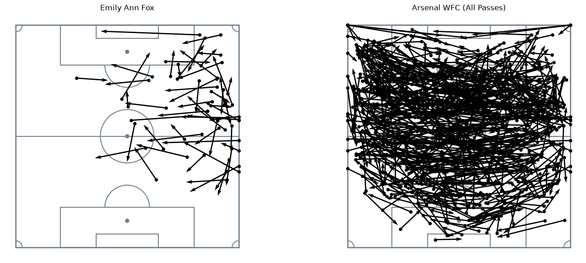
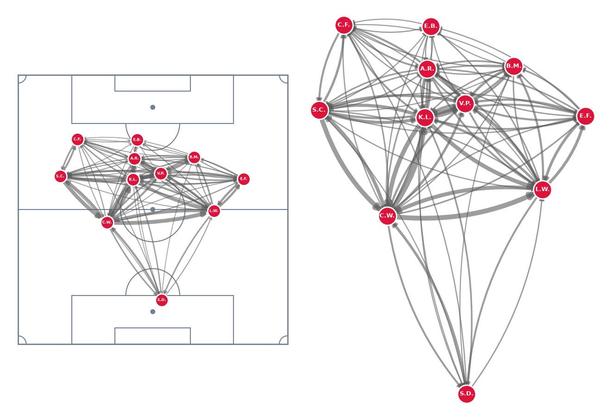
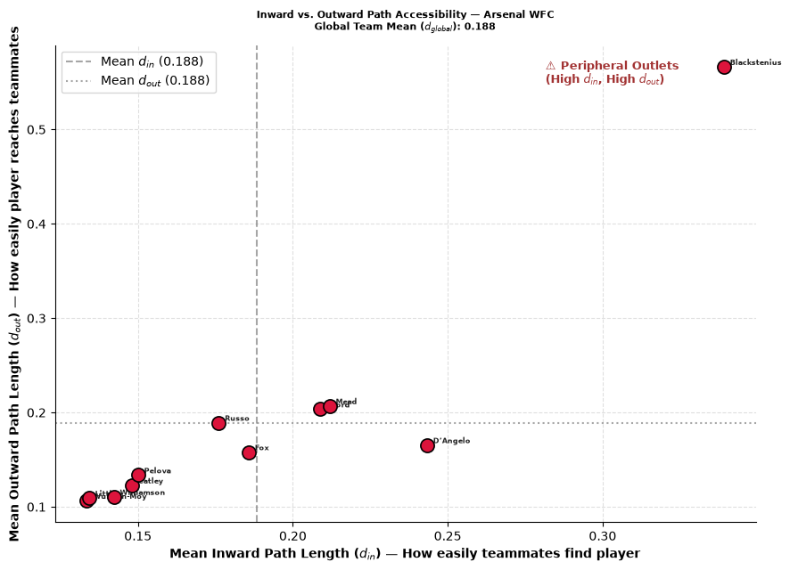
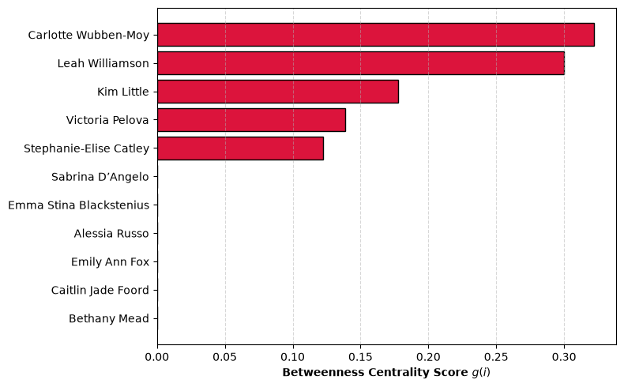
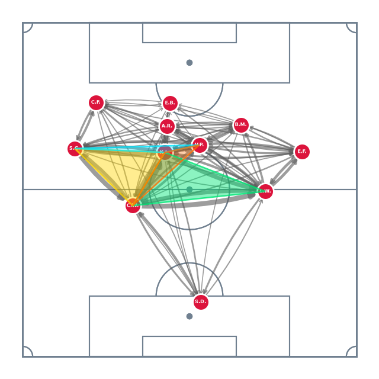
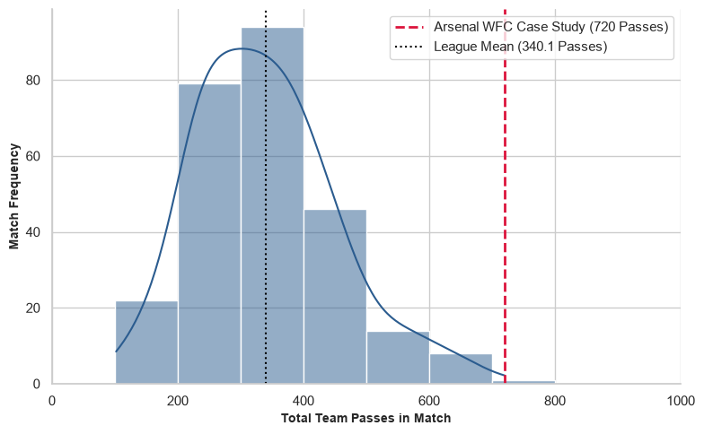
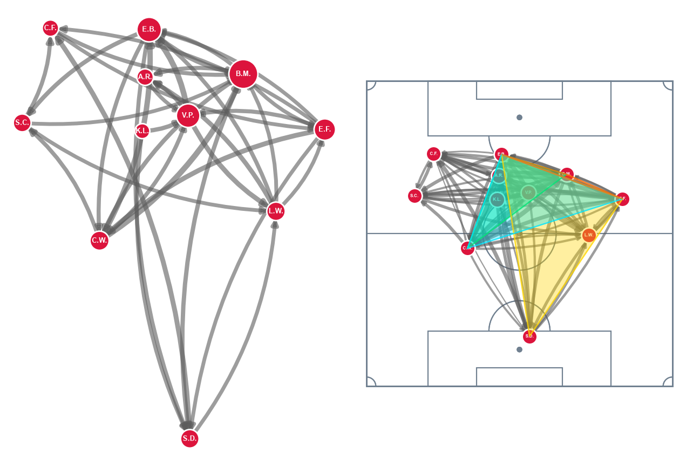
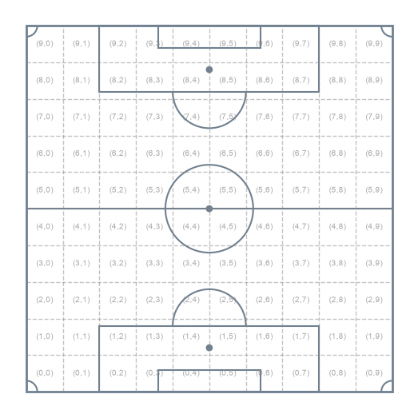
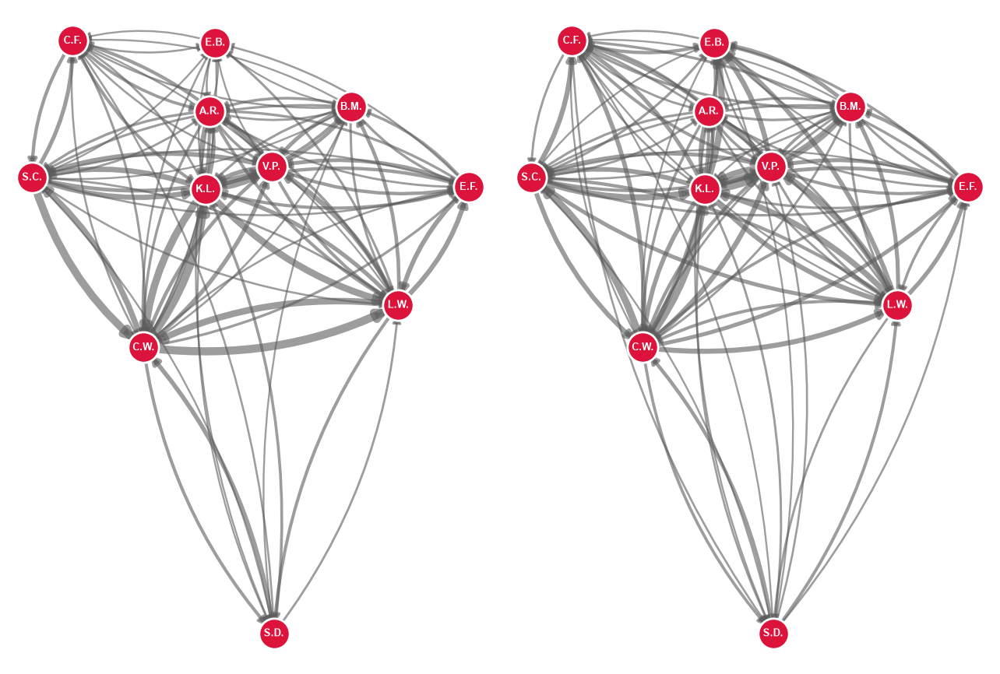

# Network Science (981G5) Assessment

## 1. Introduction

### 1.1 Network Science Introduction
Network science provides a versatile framework for modeling complex systems, abstracting real-world interactions into formal graphs of nodes and links to evaluate overall topology and system dynamics. Its applications span identifying key central entities in social systems (Wasserman & Faust, 1994; Newman, 2001), detecting functional sub-communities (Fortunato, 2010), modeling biological and information cascades (Pastor-Satorras & Vespignani, 2001), and assessing structural robustness against failures (Lusseau, 2003; Newman, 2003). By shifting away from isolationist views of individual components, network science reveals the emergent organizational principles and collective behaviors governing modern complex systems.

---

### 1.2 Why Apply Network Science to Football
This report focuses on applying network science to sport (Araújo et al., 2006), specifically football (Duch et al., 2010). Traditional football analytics relies primarily on isolated, terminal metrics such as completed passes, goals scored, or advanced modeled parameters like Expected Goals (Pollard & Reep, 1997) to quantify performance. However, evaluating players in isolation is fundamentally limited because football operates as a complex adaptive system (Buldú et al., 2019). Team success cannot be understood through isolated actions alone, instead it emerges from continuous collective interactions, dynamic spatial relationships, and overarching tactical organization across the squad (Gama et al., 2026).

---

### 1.3 How Apply Network Science to Football
Applying network science requires decomposing a complex system into discrete nodes and directed edges. In football, outfield teammates are modeled as nodes ($N = 11$), while relational interactions between them form the connecting edges. Completed passes provide a pragmatic, objective event stream encoding tactical intent and spatial structure. Representing players as nodes and directed pass volumes as weighted edges forms the foundation of the PassMap paradigm (Buldu et al., 2018). A comprehensive taxonomy of these network paradigms and their topological variations is detailed and visualized in Section 3.

---

### 1.4 Project Scope
Evaluating raw football network metrics in isolation offers limited analytical value, as network properties are shaped by underlying topological and spatial constraints. Without baselines distributions, analysts cannot separate deliberate tactical execution from stochastic match noise. Constructing valid null models in football requires reconciling randomized generative processes with physical pitch geometry, spatial proximity, and positional roles. Responding to explicit calls in contemporary literature (Gama et al., 2026), this project develops a 1st-order Spatial Markovian null framework to generate domain-aware reference ensembles, establishing a robust statistical baseline for tactical evaluation.

---

## 2 Data
The dataset comprises StatsBomb event data from the 2023/2024 FA Women's Super League (`competition_id: 37`, `season_id: 281`). Focusing on women's football directly addresses literature deficits regarding the overreliance on short men's samples and the systemic underrepresentation of longitudinal women's datasets (Alves et al., 2025; Gama et al., 2026).

Raw non-relational event logs are engineered into directed, weighted adjacency matrices $A_{ij}$. For our PassMap framework, we isolate completed passes using four attributes:
- Passer (source node $i$) + Role
- Recipient (target node $j$) + Role
- Origin $(x_1, y_1)$
- Destination $(x_2, y_2)$

StatsBomb's $120 \times 80$ yard pitch coordinates are rescaled to a normalized $100 \times 100$ grid to standardize across varying venue dimensions (Buldú et al., 2019). Figure 1 illustrates this raw pass data before graph transformation.

#### Figure 1: Raw Pass Plotting for 1 Match: Sub-plot 1 Indivudal player vs Sub-plot 2 Whole Team

#### Table 1: Summary of Dataset Statistics (WSL 2023/2024)
| Metric Category | Dataset Statistic |
| :--- | :--- |
| **Competition / Season** | FA Women's Super League (WSL) $2023/2024$ |
| **Total Matches** | `132` |
| **Total Team Network** | `264` |
| **Total Season Passes Recorded** | `89,781` |
| **Mean Passes per Team per Match** | `399` (Range: `120-847`) |
| **Mean Unique Players Used per Team per Match** | `15.1` (Range: `12-16`) |

---

## 3 Passing Network Paradigms
Team organization is modeled using the PassMap paradigm popularized by Buldú et al. (2019), represented as a directed, weighted graph $G = (V, E, W)$ where edges ($E$) denote completed passes and edge weights ($W$) quantify pass volume between nodes over a 90-minute match.

While literature outlines alternative formulations — such as purely geographic Pitch-Location networks or high-density composite Player-Pitch networks (Buldú et al., 2018; Narizuka et al., 2014) — this project focuses exclusively on the Player PassMap paradigm. Here, the node set corresponds directly to the eleven players ($\vert V \vert = 11$), enriched with individual identities and mean spatial $(x, y)$ coordinates. Appending average positions leaves topological graph invariants unchanged while significantly enhancing visual interpretability and establishing spatial baselines.

To preserve an $N = 11$ network structure despite match substitutions, we model only the eleven players with the highest total volume. Unlike literature methods that merge substitutes into contiguous positional nodes — obscuring individual identities — or expand the graph ($N > 11$), distorting density and clustering metrics (Narizuka et al., 2014; Buldú et al., 2019), this parsimonious filtering isolates true player dynamics without skewing core network properties.

Player Networks represent the standard approach in football analytics (Duch et al., 2010; Gama et al., 2026; Alves et al., 2025). They maintain intuitive alignment with real-world tactical play while avoiding artificial spatial discretization steps that lack consensus standards (Narizuka et al., 2014; Arriaza-Ardiles et al., 2018). As shown in Figure 2, plotting these networks either directly overlaying pitch boundaries or in a frameless spatial layout preserves structural clarity while surfacing emergent team interactions.

#### Figure 2: Player Network PassMap Paradigm Examples: Pitch vs Frameless

---

## 4 Football Network Metrics
Applying Network Science to football allows us to decompose analysis of system tactics through mathematical properties (López-Peña & Touchette, 2012). Gama et al., (2026) provide a comprehensive translation of network properties into football interpretation which is presented in Appendix X.

To demonstrate the utility of network analysis, we compose a suite of metrics which we apply to the high-volume outlier network from Figure 2 (Arsenal WFC), which recorded the season's highest match pass volume. This is an interesting instance to evaluate as we would like to determine whether the observed topological structures represent deliberate tactical execution or are merely emergent artifacts of extreme pass volume.

---

### 4.1 Metric Suite
To systematically map network properties to footballing concepts, analysis is categorized into three structural scales: Macro, Meso, and Micro (Alves et al., 2025; Gama et al., 2026). This project targets a core suite of metrics across these scales to balance theoretical rigor with clear tactical interpretation.

Macro-scale analysis evaluates global team cohesion, structural fluidity, and spatial dominance across the entire graph (Watts & Strogatz, 1998; Cintia et al., 2015). We examine overall connectivity and structural skew through Unweighted Degree Heterogeneity ($CV_k$) and Team Node Volume Variance ($\text{Var}(s_{\text{tot}})$), alongside multi-step reachability via the Global Average Shortest Path ($d$).

Meso-scale analysis assesses localized sub-graphs and multi-player combinational passing channels (López-Peña & Sánchez Navarro, 2015). We quantify positional triangle strength and progressive build-up loops using Transitive Triad Intensity ($I_{\text{transitive}}$), ranking circuits by their operational bottleneck capacity ($W_{\text{min}}$).

Micro-scale analysis evaluates individual player workload, directional asymmetry, and routing control (López-Peña & Touchette, 2012; Buldú et al., 2019). We measure phase-transition control through Betweenness Centrality ($g(i)$) based on inverted topological distance ($l_{ij} = 1/w_{ij}$).

---

### 4.2 Degree-Based Metrics 
Degree-based metrics evaluate system topology using direct, 1-hop connections, avoiding global path-traversal costs to provide a computationally efficient proxy for tactical involvement and workload distribution (Narizuka et al., 2014).

Evaluating unweighted degree across our high-volume sample network yields a Mean Unweighted Degree of $\langle k \rangle = 16.18$, indicating high overall connectivity out of a theoretical maximum bound of 20. The low Coefficient of Variation ($CV_k = 0.1724$) and near-identical Normalized Second Moment ($\langle k^2 \rangle / \langle k \rangle = 16.66$) confirm that passing lanes are widely distributed across squad positions, eliminating absolute topological bottlenecks.

However, introducing weighted metrics highlights a critical tactical distinction between unweighted structural availability and actual operational execution. The high Team Node Volume Variance ($\text{Var}(s_{\text{tot}}) = 5,681.90$) reveals that while available passing channels are widespread on paper, pass workload is heavily skewed through specific targeted players.

#### Table 2: Sample Network Macro Degree Metrics
| Metric | Notation / Formula | Value |
| :--- | :--- | :---: |
| **Team Node Volume Variance** | $\text{Var}(s_{\text{tot}})$ | $5681.9008$ |
| **Mean Unweighted Degree** | $\langle k \rangle$ | $16.1818$ |
| **Degree Variance** | $\text{Var}(k)$ | $7.7851$ |
| **Degree Standard Deviation** | $\sigma_k$ | $2.7902$ |
| **Second Moment** | $\langle k^2 \rangle$ | $269.6364$ |
| **Coefficient of Variation** | $CV_k$ | $0.1724$ |
| **Normalized Second Moment** | $\langle k^2 \rangle / \langle k \rangle$ | $16.6629$ |

---

### 4.3 Average Shortest Path ($d$)
In PassMaps, edge weights ($w_{ij}$) reflect completed passes from player $i$ to player $j$. Pass volume is a stronger indicator of connectivity than physical distance so edge weights are inverted to derive a topological distance:

$$l_{ij} = \frac{1}{w_{ij}}$$

This transformation ensures high-frequency passing channels yield lower topological resistance. Using Dijkstra’s algorithm, the shortest path ($p_{ij}$) between any pair of players represents the minimal cumulative cost required to move possession through the network.

The macro-level baseline of a team's passing structure is established by the global average shortest path length ($d$), defined as:

$$d = \frac{1}{N(N-1)} \sum_{i \neq j} p_{ij}$$

Arsenal WFC demonstrates strong circulation efficiency with a global path length of $d = 0.1884$, meaning the average cost to route possession between any two arbitrary players is less than $0.20$. Low path length ($d$) is a prerequisite of the Small-World phenomenon (Watts & Strogatz, 1998). In football, it indicates an integrated network capable of rapid ball circulation. However, evaluating $d = 0.1884$ in isolation is arbitrary and cannot confirm tactical superiority. This requires some form of statistical benchmarking.

#### Figure 3: Sample Network Player In & Out Average Shortest Path Scatterplot

---

### 4.4 Betweenness Centrality ($g(i)$)
To evaluate which players act as essential routing, Betweenness Centrality ($g(i)$) is analysed. Moving beyond volume, betweenness measures the proportion of a network's shortest topological paths ($l_{ij} = 1/w_{ij}$) traversing a given node, identifying possession flow:

$$g(i) = \sum_{s \neq i \neq t} \frac{\sigma_{st}(i)}{\sigma_{st}}$$

where $\sigma_{st}$ represents the total shortest paths between source player $s$ and target player $t$, and $\sigma_{st}(i)$ is the number of those paths passing through player $i$.

Providing deeper inference than 1-hop volume metrics, high scores denote players through whom phase transitions depend, whereas scores of $0.0000$ mark peripheral endpoints whose exclusion does not disrupt global network routing.

In our sample network, central defenders Lotte Wubben-Moy ($g(i) = 0.3222$) and Leah Williamson ($g(i) = 0.3000$) record the highest centrality, acting as primary structural pivots during recycling and build-up phases—a finding consistent with contemporary football network literature (Alves et al., 2025).

Interpreting betweenness in football requires a key domain-specific nuance. In classic network science, high betweenness denotes a central bottleneck bridge. In football, topological distance allows a physically longer route to represent an easier, low-resistance option. Therefore, the deep lying central defenders can behave as high centrality by recycling and re-route a phase of play.

Midfielders Kim Little ($0.1778$) and Victoria Pelova ($0.1389$) follow as traditional vertically bridging central players. Conversely, front-line attackers and the goalkeeper register scores of $0.0000$, confirming their roles as terminal nodes rather than network traffic bridges.

#### Figure 5: Sample Network, Betweenness Bar Chart

---

### 4.5 Clustering: Transitive Triads ($I_{\text{transitive}}$)
To evaluate localized spatial cohesiveness and combinational dynamics across the squad, we analyze Transitive Triad Intensity ($I_{\text{transitive}}$). Standard unweighted clustering coefficients can be misleading in football because they treat all connections equally regardless of direction or volume. Transitive triads explicitly isolate progressive wall-passes and multi-option positional triangles ($A \to B \to C$ with $A \to C$), omitting backward cyclic loops ($A \to B \to C \to A$) that rarely denote tactical progression.

As passing networks are weighted by pass volume, a triad's operational strength is constrained by its weakest link:

$$W_{\text{min}} = \min(W_{AB}, W_{BC}, W_{AC})$$

By ranking individual triads by the strength of their weakest link ($W_{\text{min}}$), we isolate the specific three-player passing circuits where Arsenal most frequently established progressive combination play.

As shown in Appendix Table 7, the highest-capacity triad (Kim Little, Lotte Wubben-Moy, Leah Williamson ($W_{\text{min}} = 116.0$)) highlights a resilient central triangle anchoring initial build-up out of defense, while left-sided loops involving Steph Catley account for three of the top six most active circuits indicating an asymmetric possessional competency. Overlaying these top-capacity transitive triads onto the PassMap (Figure 6) converts a dense network into identifiable passing triangles.

#### Figure 6: Top Transitive Triad Overlay Plot

---

## 5 Empirical Baseline Constraints
Tactical network analysis generally requires benchmarking against a league-wide baseline. Evaluating global average shortest path lengths ($d$) across all season matches places our sample network ($d = 0.1884$) in the top 3.41% of league efficiency, approaching the season minimum ($0.1748$) from a league mean (std) $0.3521 ± 0.1263$ .

However, networks properties are heavily dictated by edge volume and spatial topology and this match was selected as it is the league's peak pass volume outlier. Binning the pass data  exposes severe data-sparsity constraints for empirical comparisons.  Bins of 100-pass increments show that the 200–299 pass range holds $40.2\%$ of league matches (94 of 234), whereas higher volume tiers drop off rapidly: 500–599: 14 matches, 600–699: 8, and 700–799: 1, exclusively our single sample match.

Benchmarking also requires controlling for tactical formation to normalize network topology. Segmenting even the largest pass-volume bin across the 11 recorded formations reduces the primary setup (4-2-3-1) to just 29 instances and 3 formation categories carry a single instance (Appendix X). Dual filtering for pass volume and formation dilutes sample sizes to near zero. Despite using a comprehensive season-wide dataset that is large by literature standards (Gama et al., 2026), these sparsity constraints necessitate generating spatial null models to evaluate extreme networks.

#### Figure 7: League Match-Team Pass Distribution Histrogram

---

## 6 Traditional Nulls
Traditional null models face severe domain-specific deficiencies when applied to football. Generating a network null model involves randomizing topological features while preserving select global properties, such as total edge weight or node degree. However, football passing networks are constrained by physical pitch dimensions, player positioning, and tactical behavior. Traditional null models ignore these spatial and structural realities, generating unrealistic networks characterized by unnatural cross-field connections and misplaced playmaking hubs.

---

### 6.1 Erdős–Rényi (ER) Random Model
The simplest benchmarking approach is the Erdős–Rényi random graph framework, specifically the $G(N, p)$ model (Gilbert, 1959; Erdős & Rényi, 1959). Under this formulation, $N$ nodes are connected independently with uniform probability $p$. For weighted passing networks, total pass volume ($720$ passes across $11$ nodes) is preserved, but topological structure is erased. Weights are distributed uniformly across all potential node pairs, treating all players as structural equals and discarding individual node degree constraints.

---

### 6.2 Null Network Validation
Evaluating macro-level properties confirms that random edge generation fundamentally destroys realistic football network topology (Table 8). In an Erdős–Rényi ($G(N, p)$) random model, uniform weight assignment erases operational workload inequality. Team Node Volume Variance collapses to $\text{Var}(s_{\text{tot}}) = 514.9917$ ($\sigma_{s_{\text{tot}}} \approx 22.69$ passes), homogeneously smoothing possession across all players and removing tactical playmaking hubs. Topologically, the PassMap degrades into an uninformative dense network where edge weights lack tactical variance and peripheral nodes erroneously appear as major distribution outlets.

This breakdown extends to downstream clustering. Global Mean Transitive Intensity artificially inflates ($\bar{I}_{\text{transitive}} = 708.54$), as uniform edge generation forces nearly every three-node combination into a dense cluster. Inspecting top active triads yields tactical impossibilities, such as high-capacity loops linking central forward Stina Blackstenius with defender Lotte Wubben-Moy ($69.0$ units) or goalkeeper Sabrina D’Angelo ($51.0$ units) (Appendix X). Plotting these triads (Figure X) produces non-local pitch-wide polygons, proving the spatial unviability of ER models for football networks.

#### Figure 7: ER Null Network Visual (Left) and ER Triad Network Plot (Right)

#### Table 8: ER Null Macro-Level Network Metrics
| Metric | Notation | ER Null | Empirical |
| :--- | :--- | :---: | :---: |
| **Team Node Volume Variance** | $\text{Var}(s_{\text{tot}})$ | 514.9917 | 5681.9008 |
| **Mean Unweighted Degree** | $\langle k \rangle$ | 15.4545 | 16.1818 |
| **Degree Variance** | $\text{Var}(k)$ | 4.0661 | 7.7851 |
| **Degree Standard Deviation** | $\sigma_k$ | 2.0165 | 2.7902 |
| **Second Moment** | $\langle k^2 \rangle$ | 242.9091 | 269.6364 |
| **Coefficient of Variation** | $CV_k$ | 0.1305 | 0.1724 |
| **Normalized Second Moment** | $\langle k^2 \rangle / \langle k \rangle$ | 15.7176 | 16.6629 |

---

## 7 Markovian Null Model
The failure of naive, traditional null models necessitates a fundamental conceptual shift. A valid null model for football passing networks cannot treat the pitch as an abstract, unconstrained graph topology, it must strictly respect the spatial, physical, and tactical realities of match play.

---

#### 7.1 Markovian Processes and Stochastic Transformations
To construct a domain-aware generative baseline, we draw upon established football network literature modeling match dynamics using stochastic processes (Narizuka et al., 2014; Gama et al., 2026) and repurpose the methodologies for null generation, shifting from modeling dynamics on a network to governing the dynamics of the network.

While existing literature predominantly applies Markov chains to fixed adjacency matrices to analyze possession diffusion, our generative task synthesizes entirely new reference graph topologies ($\mathcal{G}_{\text{null}}$). We invert this paradigm by using learned spatial transition rules as a generative engine to resample synthetic pass events before aggregating the final null network.

This inversion addresses a critical research gap. Although stochastic flow models were originally used to bypass traditional nulls, evaluating whether observed flow metrics reflect genuine tactical organization ultimately requires benchmarking against a spatially constrained null ensemble (Gama et al., 2026).

---

#### 7.1.1 Justifying First Order Markovian Processes 
A first-order Markov process assumes that state transition probabilities ($X_{t+1}$) depend strictly on the current state ($X_t$):

$$P(X_{t+1} = x \mid X_t = x_t, \dots, X_1 = x_1) = P(X_{t+1} = x \mid X_t = x_t)$$

While higher-order memory is necessary for tracking sequential possession dynamics, a first-order memoryless formulation provides a parsimonious, mathematically aligned baseline for synthesizing static PassMap topologies. Because standard $11 \times 11$ adjacency matrices aggregate matches statically—discarding temporal ordering—a first-order process matches the target format. Furthermore, Narizuka et al. (2014) demonstrated that a first-order spatial Markov process parameterised by distance decay successfully reproduces macro-level Small-World properties and truncated degree distributions without higher-order memory overhead.

---

### 7.2 Domain Requirements & Spatial Resampling Design
Buldú et al. (2018) emphasize that valid null models for football networks must maintain high domain realism by preserving physical game constraints, spatial player distributions, and pass length mechanics. To satisfy this, we propose a targeted spatial pass-recipient resampling model. Under this framework, each recorded pass's origin location, passer identity, and pitch phase are held fixed, while the recipient is systematically resampled using a first-order Markov process.

This design choice explicitly balances tactical destruction with domain validity. Retaining empirical match coordinates means actual positional occupancy zones and realistic pass-distance decay mechanics are not lost. Simultaneously, decoupling the original recipient breaks existing tactical systems and specific player-to-player relationships.

Finally, resampling recipients using spatial transition probabilities re-establishes network edges under strict physical constraints. This prevents structural anomalies, such as long-range goalkeeper-to-striker loops, while allowing central hubs to form naturally through emergent spatial proximity.

---

### 7.4 Data Corpus Engineering
To distinguish genuine tactical adaptations from match-to-match noise, our generative resampling engine is parameterized across a large-scale league dataset comprising $N = 264$ match-team instances and $89,781$ completed passes. Constructing the first-order Markovian model directly from raw event logs — rather than finalized graph topologies — ensures the resampling process inherently preserves spatial coordinates and physical game constraints.

Raw StatsBomb pitch coordinates ($120 \times 80$) are normalized to a standardized $100 \times 100$ scale and discretized into a $10 \times 10$ spatial grid of 100 uniform cells. Granular player positions are mapped into a condensed positional taxonomy (Appendix X), eliminating team-specific lateral biases while retaining essential functional roles. This spatial and positional aggregation maximizes data density per pitch cell (Appendix X), enabling the Markovian transition model to learn robust, role-based spatial transition probabilities across the dataset.

##### Figure 9: Pitch Plot Grid

---

### 7.5 Recipient Probability Distribution Training
Using the discretized spatial grid and condensed positional taxonomy, we compile the pass data into a 3D Spatial Probability Tensor $\mathcal{P}$ of shape $(10, 10, N_{\text{pos}})$, where $N_{\text{pos}} = 9$. Each tensor element $\mathcal{P}(r, c, p)$ records pass frequencies terminating in cell $(r, c)$ received by position $p$. To prevent zero-probability artifacts in sparse pitch zones, we apply Laplace Additive Smoothing ($\alpha = 1.0$):

$$\text{Counts}_{\text{smoothed}}(r, c, p) = \text{RawCount}(r, c, p) + 1.0$$

Normalizing these smoothed counts yields the conditional recipient probability distribution $P(\text{Position } p \mid \text{Pass Ends in Bin } (r, c))$:

$$P(p \mid r, c) = \frac{\text{Counts}_{\text{smoothed}}(r, c, p)}{\sum_{p'} \text{Counts}_{\text{smoothed}}(r, c, p')}$$

This partitions the pitch into discrete spatial sectors governing recipient likelihood. For instance, central cell $(5,5)$ assigns highest reception probabilities to central midfielders ($38.96\%$) and central defenders ($30.58\%$), while goalkeeper receptions drop to $0.11\%$ (Table 11). Sampling from these localized distributions ensures generated passes assign plausible recipients based on empirical spatial behavior.

##### Table 11: Spatial Recipient Probability Distribution for Pitch Bin (5,5)
| Rank | Recipient Position (Condensed) | Probability | Probability (%) |
| :---: | :--- | :---: | :---: |
| 1 | Central Midfielder (CM) | 0.3896 | 38.96 |
| 2 | Center Back (CB) | 0.3058 | 30.58 |
| 3 | Striker / Center Forward (ST) | 0.1143 | 11.43 |
| 4 | Right Back (RB) | 0.0588 | 5.88 |
| 5 | Center Attacking Midfielder (CAM) | 0.0468 | 4.68 |
| 6 | Right Midfielder / Winger (RM) | 0.0305 | 3.05 |
| 7 | Left Back (LB) | 0.0272 | 2.72 |
| 8 | Left Midfielder / Winger (LM) | 0.0261 | 2.61 |
| 9 | Goalkeeper (GK) | 0.0011 | 0.11 |

---

### 7.6 Generative Markovian Recipient Resampling
For each empirical pass in the target match, the engine retains the origin, end location, and passer identity. The terminal coordinates query the learned probability tensor $P(p \mid r, c)$ to sample a recipient position, which is mapped to an active teammate. Self-passes ($A \to A$) are strictly prevented. Evaluating the resampled event stream prior to network aggregation confirms the engine successfully balances generative variance with domain realism. As detailed in Appendix X, the spatial model avoids simply reproducing the input network while strictly enforcing defensive boundaries and realistically redistributing high-volume territorial possession.

##### Table 12: Sample Event Resampling and Player Mapping Stream
| Pass ID | Passer (Origin) | Terminal Bin | Drawn Position | Empirical Recipient | Resampled Recipient | Self-Pass Safeguard |
| :---: | :--- | :---: | :---: | :--- | :--- | :---: |
| 101 | Carlotte Wubben-Moy | (2, 4) | CB | Leah Williamson | Leah Williamson | Valid ($A \neq B$) |
| 102 | Kim Little | (5, 5) | CM | Victoria Pelova | Victoria Pelova | Valid ($A \neq B$) |
| 103 | Stephanie-Elise Catley | (7, 2) | LM | Caitlin Jade Foord | Caitlin Jade Foord | Valid ($A \neq B$) |
| 104 | Victoria Pelova | (5, 8) | RB | Emily Ann Fox | Emily Ann Fox | Valid ($A \neq B$) |
| 105 | Carlotte Wubben-Moy | (4, 5) | CM | Kim Little | Victoria Pelova | Valid ($A \neq B$) |
| 106 | Kim Little | (8, 5) | ST | Alessia Russo | Emma Stina Blackstenius | Valid ($A \neq B$) |

---

### 7.6 Sample Null Passing Network
Visual comparison of the empirical network alongside a single spatial null realization demonstrates that spatial recipient resampling produces a natural, pitch-constrained topology. Unlike the Erdős–Rényi model, the rewired graph avoids pitch-wide "hairball" artifacts while maintaining realistic player positioning and passing channels.

##### Figure 11: Empirical PassMap (Left) vs. Null PassMap(Right)

#### 7.6.1 Topological Degree Diagnostics
Evaluating macro-level degree properties across this single realization confirms the spatial engine synthesizes domain-valid reference networks (Table 13).

Holding passer volume ($s_i^{\text{out}}$) fixed recovers over half of empirical workload inequality ($\text{Var}(s_{\text{tot}}) = 2955.90$ vs. ER's $514.99$). This reveals passer initiative accounts for roughly 52% of workload variance, while receiver choice drives 48%.

Replacing match-specific target preferences with league-average spatial probabilities increases active density ($\langle k \rangle = 17.64$) and flattens connection variance ($CV_k = 0.1115$). The Normalized Second Moment ($17.86$) closely tracks mean degree, proving empirical origin coordinates preserve structural density without creating scale-free hub anomalies.

##### Table 13: Sample Null Macro-Level Metrics
| Metric | Empirical | ER ($G(N,p)$) | Null |
| :--- | :---: | :---: | :---: |
| **Mean Unweighted Degree ($\langle k \rangle$)** | 16.1818 | 15.4545 | 17.6364 |
| **Coefficient of Variation ($CV_k$)** | 0.1724 | 0.1305 | 0.1115 |
| **Normalized Second Moment ($\frac{\langle k^2 \rangle}{\langle k \rangle}$)** | 16.6629 | 15.7176 | 17.8557 |
| **Node Volume Variance ($\text{Var}(s_{\text{tot}})$)** | 5681.90 | 514.99 | 2955.90 |

---

## 8 Null Validation
While a single realization confirms local feasibility, formal validation requires a multi-run simulation to establish statistical stability and boundary constraints. Executing a 500-run Monte Carlo pipeline confirms that spatial recipient resampling reliably strips away match-specific tactical nuances across the entire null ensemble while strictly preserving domain-level topological invariants.

### 8.1 Macro-Level Heterogeneity and Structural Density
Across the 500-iteration ensemble, macro-level degree metrics confirm that spatial resampling maintains realistic structural density while suppressing extreme topological distortions (Table 14). The Mean Unweighted Degree averages $\langle k \rangle = 17.7411$ (95% CI: $[16.9955, 18.3636]$), representing an expected connection density ($\approx 88.7\%$) that populates peripheral channels without exceeding pitch boundaries.

The Coefficient of Variation ($CV_k = 0.1196$) remains well below scale-free thresholds ($CV_k \ge 1.0$), while the empirical value ($0.1724$) sits above the upper confidence bound ($0.1615$), confirming match-specific tactical heterogeneity. Additionally, the Normalized Second Moment ($18.0011$) closely tracks mean degree, proving the ensemble operates within logical domain boundaries without generating central super-hubs.

### 8.2 Workload Variance
Holding passer volume ($s_i^{\text{out}}$) fixed allows the spatial model to recover over half of empirical workload inequality. The ensemble Team Node Volume Variance ($\text{Var}(s_{\text{tot}})$) averages $3117.38$ (95% CI: $[2672.08, 3629.00]$), capturing $55\%$ of empirical variance ($5681.90$). This establishes that passer initiative accounts for roughly $55\%$ of volume centralization, while targeted receiver selection drives $45\%$.

However, even the maximum simulated variance ($4000.45$) falls short of the empirical value. League-average spatial probabilities naturally smooth out extreme tactical dynamics — such as high team possession paired with an off-ball striker — highlighting the boundary where generic spatial occupancy rules meet highly stylized team play.

### 8.3 Role Realism
Functional role realism is similarly preserved across all iterations. Goalkeeper Sabrina D’Angelo’s total pass volume stays tightly bounded with an ensemble mean of $43.2300$ passes (95% CI: $[38.0000, 49.0000]$) and a range of $[35.0, 51.0]$. Unlike Erdős–Rényi random graphs that erroneously transform the goalkeeper into an active playmaking hub, the spatial engine enforces defensive boundary constraints across every generated instance.

### 8.4 Generative Matrix Variance
Evaluating the correlation between empirical and resampled weighted adjacency matrices yields an ensemble mean of $\bar{r} = 0.6753$ (95% CI: $[0.6026, 0.7468]$). This moderate-to-high correlation verifies that while the model preserves fundamental spatial structure and high-volume passing channels, it introduces sufficient generative variance to shuffle tactical nuances without collapsing into uncorrelated random noise or duplicating the input matrix.

##### Table 14: Tier 1 Spatial Markovian Null Model Validation Summary (N=500 Iterations)
| Metric | Empirical | Null Mean | Null Std | Min | Max | 95% CI Lower | 95% CI Upper |
| :--- | :---: | :---: | :---: | :---: | :---: | :---: | :---: |
| **Mean Unweighted Degree ($\langle k \rangle$)** | 16.1818 | 17.7411 | 0.3923 | 16.7273 | 18.7273 | 16.9955 |
| **Coefficient of Variation ($CV_k$)** | 0.1724 | 0.1196 | 0.0209 | 0.0648 | 0.1755 | 0.0813 | 0.1615 |
| **Normalized Second Moment ($\frac{\langle k^2 \rangle}{\langle k \rangle}$)** | 16.6629 | 18.0011 | 0.3303 | 17.0978 | 18.8738 | 17.3529 | 18.5998 |
| **Node Volume Variance ($\text{Var}(s_{\text{tot}})$)** | 5681.9008 | 3117.3808 | 246.0137 | 2382.2645 | 4000.4463 | 2672.0826 | 3629.0008 |
| **Goalkeeper Total Volume ($s_{\text{tot}}$)** | 38.0000 | 43.2300 | 2.9443 | 35.0000 | 51.0000 | 38.0000 | 49.0000 |
| **Adjacency Correlation ($r$)** | 1.0000 | 0.6753 | 0.0377 | 0.5544 | 0.7678 | 0.6026 | 0.7468 |

--- 

## 9. Null-Baselined Metric Evaluation

### 9.1 Experimental Setup & Simulation Scope
To evaluate empirical network properties against a spatially constrained baseline, we executed $N = 1000$ spatial Markovian resampling iterations over the target match event stream. Dedicated tracking structures logged multi-scale graph metrics across each Monte Carlo run, including global shortest paths ($d$), 3-player transitive triad bottleneck capacities, and player-level betweenness centrality ($g(i)$).

---

### 9.2 Macro-Level Evaluation: Global Circulation Distance ($d$)
Evaluating global average shortest path ($d = 0.1884$) against the 1000-iteration spatial null ensemble reveals that Arsenal WFC’s circulation efficiency emerges primarily from spatial territory and pass volume rather than unique tactics or elite performance.

The empirical path length sits slightly below the null mean ($\bar{d}_{\text{null}} = 0.1932$, $z = -0.43$), well within the 95% confidence interval ($[0.1732, 0.2120]$). Completing over 700 passes inherently dictates and bounds the global distance. One reasons Arsenal's path length remains above the theoretical minimum ($0.1732$) is because they forgo global efficiency in lieu of deliberate, localized tactical overloads.

#### Table: Null-Baselined Macro Evaluation Summary
| Scale | Metric | Empirical Value | Null Mean | Null 95% CI | Z-Score |
| :--- | :--- | :---: | :---: | :---: | :---: |
| **Macro** | Global Shortest Path ($d$) | 0.1884 | 0.1932 | [0.1732, 0.2120] | -0.43 |

---

### 9.3 Meso-Level Evaluation: Transitive Triad Dynamics ($I_{\text{transitive}}$)
Benchmarking the top 20 empirical transitive triads against the 1,000-iteration spatial null ensemble separates intentional tactical mechanics from simple spatial occupancy (Table 15).

Deep build-up triangles demonstrate extreme statistical significance. The rank 1 triad (Wubben-Moy–Little–Williamson; $116.00$ units, $z = +3.83$) and rank 2 left-flank triangle (Wubben-Moy–Little–Catley; $111.00$ units, $z = +5.67$) comfortably exceed null 95% upper bounds ($98.00$ and $78.00$, respectively), confirming an intentional left-sided overloading mechanism for progressive build-up.

Conversely, central double-pivot recycling loops operate directly in line with spatial expectations. Triads like Wubben-Moy–Little–Pelova ($69.00$ units, $z = -0.28$) track null means ($\bar{W} = 71.53$) almost perfectly, proving their high volume reflects spatial density rather than specialized tactics.

Finally, Alessia Russo’s participation across progressive triads consistently surpasses null bounds ($z$-scores between $+1.84$ and $+2.78$), proving her deep-dropping movement represents deliberate tactical linkage rather than spatial chance.

##### Table 15: Null-Baselined Meso Evaluation Summary (Transitive Triads Top 20)
| Scale | Targeted Metric / Entity | Empirical Value | Null Mean | Null 95% CI | Z-Score |
| :--- | :--- | :---: | :---: | :---: | :---: |
| **Meso** | Triad (Emp Rank 1): Wubben-Moy – Little – Williamson | 116.00 | 79.23 | [61.00, 98.00] | +3.83 |
| **Meso** | Triad (Emp Rank 2): Wubben-Moy – Little – Catley | 111.00 | 61.11 | [44.00, 78.00] | +5.67 |
| **Meso** | Triad (Emp Rank 3): Little – Catley – Pelova | 76.00 | 56.74 | [39.00, 74.00] | +2.11 |
| **Meso** | Triad (Emp Rank 4): Wubben-Moy – Little – Pelova | 69.00 | 71.53 | [54.98, 89.00] | -0.28 |
| **Meso** | Triad (Emp Rank 5): Little – Williamson – Pelova | 67.00 | 66.89 | [50.00, 85.00] | +0.01 |
| **Meso** | Triad (Emp Rank 6): Wubben-Moy – Catley – Pelova | 65.00 | 49.48 | [34.00, 65.00] | +1.97 |
| **Meso** | Triad (Emp Rank 7): Wubben-Moy – Williamson – Pelova | 60.00 | 57.81 | [42.00, 73.00] | +0.28 |
| **Meso** | Triad (Emp Rank 8): Fox – Williamson – Pelova | 55.00 | 37.90 | [24.00, 52.00] | +2.47 |
| **Meso** | Triad (Emp Rank 9): Russo – Little – Pelova | 51.00 | 36.34 | [21.00, 51.00] | +1.87 |
| **Meso** | Triad (Emp Rank 10): Fox – Little – Pelova | 51.00 | 40.84 | [25.00, 57.00] | +1.30 |
| **Meso** | Triad (Emp Rank 11): Fox – Little – Williamson | 51.00 | 38.20 | [23.00, 54.00] | +1.63 |
| **Meso** | Triad (Emp Rank 12): Russo – Little – Williamson | 42.00 | 24.05 | [10.00, 39.00] | +2.44 |
| **Meso** | Triad (Emp Rank 13): Mead – Williamson – Pelova | 40.00 | 25.52 | [15.00, 37.02] | +2.44 |
| **Meso** | Triad (Emp Rank 14): Russo – Wubben-Moy – Little | 39.00 | 25.58 | [12.00, 40.00] | +1.84 |
| **Meso** | Triad (Emp Rank 15): Russo – Williamson – Pelova | 38.00 | 22.44 | [9.00, 36.00] | +2.30 |
| **Meso** | Triad (Emp Rank 16): Russo – Wubben-Moy – Pelova | 37.00 | 23.67 | [11.00, 37.00] | +2.00 |
| **Meso** | Triad (Emp Rank 17): Russo – Wubben-Moy – Williamson | 35.00 | 18.79 | [7.00, 30.00] | +2.78 |
| **Meso** | Triad (Emp Rank 18): Foord – Little – Catley | 33.00 | 37.36 | [25.00, 50.00] | -0.67 |
| **Meso** | Triad (Emp Rank 19): Foord – Catley – Pelova | 33.00 | 32.95 | [21.00, 45.00] | +0.01 |
| **Meso** | Triad (Emp Rank 20): Wubben-Moy – Williamson – D’Angelo | 33.00 | 32.70 | [21.00, 44.02] | +0.05 |

---

### 9.4 Micro-Level Evaluation: Positional Betweenness Centrality ($g(i)$)
Evaluating empirical betweenness centrality ($g(i)$) against the 1,000-iteration spatial null baseline reveals how Arsenal WFC explicitly structures its build-up play (Table 16).

The central defensive core operates as a primary routing engine: both Left Center Back ($g = 0.3222, z = +2.73$) and Right Center Back ($g = 0.3000, z = +2.85$) exceed their upper 95% confidence bounds ($0.2668$ and $0.2556$), proving their central conduit role is an explicit tactical instruction.

Controlling for empirical spatial volume highlights a distinct flank asymmetry. The Left Back baseline range ($[0.0000, 0.1556]$) reflects high local pass density; Steph Catley’s score ($g = 0.1222, z = +1.73$) approaches this upper limit, whereas the Right Back registers $g = 0.0000$. Conversely, Left Defensive Midfield falls below its high spatial expectation ($\bar{g} = 0.2896$ vs. $g = 0.1778, z = -1.31$), demonstrating that Arsenal avoids over-funneling progression through a single central pivot. Finally, terminal attackers and the goalkeeper register $g = 0.0000$, preserving functional role boundaries.

##### Table: Null-Baselined Micro Evaluation Summary (Positional Betweenness Centrality)
| Scale | Targeted Metric / Position | Empirical Value | Null Mean | Null 95% CI | Z-Score |
| :--- | :--- | :---: | :---: | :---: | :---: |
| **Micro** | Betweenness: Left Center Back | 0.3222 | 0.1471 | [0.0222, 0.2668] | +2.73 |
| **Micro** | Betweenness: Right Center Back | 0.3000 | 0.1149 | [0.0111, 0.2556] | +2.85 |
| **Micro** | Betweenness: Left Back | 0.1222 | 0.0426 | [0.0000, 0.1556] | +1.73 |
| **Micro** | Betweenness: Right Defensive Midfield | 0.1389 | 0.1367 | [0.0111, 0.2778] | +0.03 |
| **Micro** | Betweenness: Left Defensive Midfield | 0.1778 | 0.2896 | [0.1313, 0.4556] | -1.31 |
| **Micro** | Betweenness: Right Back | 0.0000 | 0.0071 | [0.0000, 0.0667] | -0.38 |
| **Micro** | Betweenness: Left Wing | 0.0000 | 0.0058 | [0.0000, 0.1000] | -0.27 |
| **Micro** | Betweenness: Right Wing | 0.0000 | 0.0054 | [0.0000, 0.1000] | -0.27 |
| **Micro** | Betweenness: Center Attacking Midfield | 0.0000 | 0.0038 | [0.0000, 0.0889] | -0.22 |
| **Micro** | Betweenness: Goalkeeper | 0.0000 | 0.0001 | [0.0000, 0.0000] | -0.03 |
| **Micro** | Betweenness: Center Forward | 0.0000 | 0.0000 | [0.0000, 0.0000] | 0.00 |

---

## 10 Conclusion, Limitations and Future Work
### 10.1 Conclusion
This project demonstrates the intersection of network science and sports analytics, exploring spatially aware framework for evaluating collective tactical behavior in football. By leveraging open-source StatsBomb event data from the 2023/2024 FA Women's Super League, the project converts raw spatiotemporal events into directed, weighted PassMaps while actively addressing the systemic underrepresentation of women's football research. 

The project deployed a comprehensive, multi-scale diagnostic suite across micro (betweenness centrality), meso (transitive triads), and macro (global shortest paths) graph dimensions, supported by custom spatial visualization tools.

This research responds to direct calls in literature (Gama et al., 2026) for robust null baselines. We validate that traditional randomizations, such as Erdős–Rényi, fail in this domain by destroying pitch geometry, flattening workload inequality, and generating structural role anomalies.

In response, we engineered a novel 1st-order Spatial Markovian generative null process. By inverting the paradigm to govern the dynamics of the network, the generative engine resamples pass recipients using league-average spatial probabilities while strictly preserving empirical origin coordinates, passer identities, and physical pitch boundaries.

Ultimately, executing this Monte Carlo null pipeline against an extreme high-volume match separated baseline geometric inevitabilities from deliberate tactical architecture, isolating true tactical signals like left-flank overloads and center-back re-distribution from baseline spatial noise.

### 10.2 Limitations
While effective for synthesizing static PassMaps, the first-order Markovian framework carries two primary structural limitations. First, its memoryless assumption evaluates passes in isolation based purely on terminal spatial coordinates. By ignoring sequential, multi-step player interactions, the model washes out localized "work group" dynamics and complex combinational routines, which restricts higher-order triad analysis. Second, the framework lacks temporal and game-state context. Aggregating pass totals across full 90-minute matches ignores time elapsed and scoreline dynamics, such as chasing a late deficit versus early-game consolidation. Consequently, resampled recipients reflect broad spatial averages rather than the specific tactical context of the original pass.

### 10.3 Future Work
Future research should expand the null validation framework by establishing algorithmic bounds that dynamically adjust for tactical formations, team quality, and game states. Expanding the generative engine requires integrating temporal context, higher-order sequence memory, and multi-step player interactions to better reflect localized combination play. Additionally, broadening the generative scope beyond pass recipient to resample pass destinations and origins based on role constraints would enable full synthetic event-stream generation. Ensembling these steps will allow analysts to systematically benchmark passer initiative, decision-making, and systemic ball progression across any tactical scenario.

---

# Biblography

