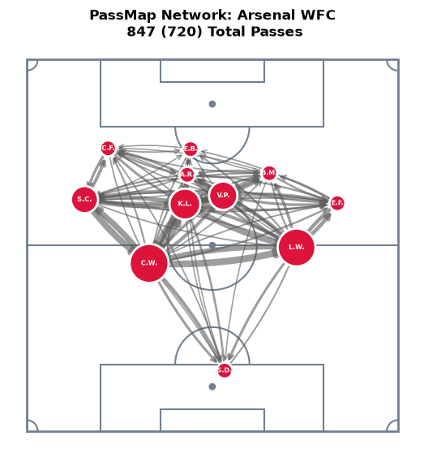
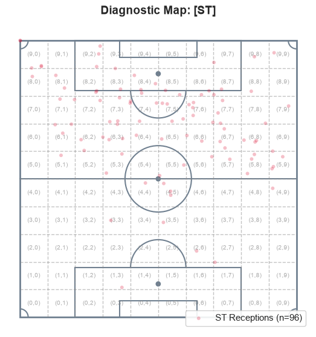

#### Appendix DTable 4: Sample Network, Average Shortest Path Metrics
| Player | Position | Mean Outward Distance ($d_{\text{out}}$) | Mean Inward Distance ($d_{\text{in}}$) | Structural Role & Tactical Insight |
|---|---|---|---|---|
| Carlotte Wubben-Moy | LCB | 0.1066 | 0.1335 | Primary Network Anchor: Lowest $d_{\text{out}}$ team-wide; acts as the primary distributor in initial build-up. |
| Kim Little | LDM | 0.1092 | 0.1341 | Central Engine: Exceptional bilateral efficiency; serves as the primary midfield conduit connecting deep defense to attack. |
| Leah Williamson | RCB | 0.1106 | 0.1422 | Deep Ball-Progressor: Pairs with Wubben-Moy to form a highly accessible central defensive base. |
| Stephanie-Elise Catley | LB | 0.1229 | 0.1480 | Flank Initiator: Stronger outward efficiency than right-sided counterparts, showing a left-leaning bias in possession. |
| Victoria Pelova | RDM | 0.1336 | 0.1500 | Secondary Pivot: Maintains balanced inward/outward flow, facilitating mid-block link play. |
| Emily Ann Fox | RB | 0.1581 | 0.1857 | Wide Outlet: Higher resistance than central defenders, functioning as a wider progression valve. |
| Sabrina D’Angelo | GK | 0.1655 | 0.2433 | Distribution Origin: Maintains low $d_{\text{out}}$ (restarts build-up efficiently) but high $d_{\text{in}}$ (rarely targeted directly under pressure). |
| Alessia Russo | CAM | 0.1893 | 0.1760 | Inverted Hub: Uniquely features $d_{\text{in}} < d_{\text{out}}$, reflecting her role drop-down target between opposition lines. |
| Caitlin Jade Foord | LW | 0.2035 | 0.2088 | High/Wide Winger: High distance metrics reflect terminal positional isolation on the left flank. |
| Bethany Mead | RW | 0.2070 | 0.2118 | High/Wide Winger: Mirrored profile to Foord; operates primarily in final-third isolation. |
| Emma Stina Blackstenius | CF | 0.5664 | 0.3391 | Terminal Target: Extreme $d_{\text{out}}$ (0.5664) and high $d_{\text{in}}$ (0.3391) identify a pure, specialized focal point focused on finishing rather than circulation. |
> maybe pivot this table so players are horizontal. Maybe remove the insight. 
---

#### Table 5: Sample Network, Player Betweenness Centrality ($g(i)$) Scores
| Player | Position | Betweenness Centrality $g(i)$ |
| :--- | :--- | :---: |
| Carlotte Wubben-Moy | Left Center Back | 0.3222 |
| Leah Williamson | Right Center Back | 0.3000 |
| Kim Little | Left Defensive Midfield | 0.1778 |
| Victoria Pelova | Right Defensive Midfield | 0.1389 |
| Stephanie-Elise Catley | Left Back | 0.1222 |
| Sabrina D’Angelo | Goalkeeper | 0.0000 |
| Emma Stina Blackstenius | Center Forward | 0.0000 |
| Alessia Russo | Center Attacking Midfield | 0.0000 |
| Emily Ann Fox | Right Back | 0.0000 |
| Caitlin Jade Foord | Left Wing | 0.0000 |
| Bethany Mead | Right Wing | 0.0000 |

---

#### Figure 4: Sample Network, Betweenness Network Plot

---

#### Table 7: Top 10 Active Transitive Passing Triads
| Rank | Origin / Target ($A$) | Intermediate ($B$) | Target / Origin ($C$) | Bottleneck Capacity ($W_{\text{min}}$ Pass Units) |
| :---: | :--- | :--- | :--- | :---: |
| **1** | Kim Little | Carlotte Wubben-Moy | Leah Williamson | 116.0 |
| **2** | Stephanie-Elise Catley | Kim Little | Carlotte Wubben-Moy | 111.0 |
| **3** | Stephanie-Elise Catley | Kim Little | Victoria Pelova | 76.0 |
| **4** | Kim Little | Carlotte Wubben-Moy | Victoria Pelova | 69.0 |
| **5** | Kim Little | Victoria Pelova | Leah Williamson | 67.0 |
| **6** | Stephanie-Elise Catley | Carlotte Wubben-Moy | Victoria Pelova | 65.0 |
| **7** | Carlotte Wubben-Moy | Victoria Pelova | Leah Williamson | 60.0 |
| **8** | Victoria Pelova | Leah Williamson | Emily Ann Fox | 55.0 |
| **9** | Kim Little | Alessia Russo | Victoria Pelova | 51.0 |
| **10** | Kim Little | Victoria Pelova | Emily Ann Fox | 51.0 |

#### Table 6: Player-Level Transitive Triad Intensity Summary
| Player | Position | Raw Intensity | Normalized (0–1) | Relative to Max | Tactical & Structural Role |
| :--- | :--- | :---: | :---: | :---: | :--- |
| **Kim Little** | Left Defensive Midfield | 1069.0 | 1.000 | 1.000 | Primary Linkage Hub: Anchors central combinations; highest involvement in progressive triangles. |
| **Victoria Pelova** | Right Defensive Midfield | 927.0 | 0.854 | 0.867 | Double-Pivot Engine: Pairs with Little to form a high-volume central link between defense and attack. |
| **Carlotte Wubben-Moy** | Left Center Back | 864.0 | 0.790 | 0.808 | Deep Circulation Base: High score confirms short, triangular build-up out of the back. |
| **Leah Williamson** | Right Center Back | 814.0 | 0.738 | 0.761 | Right-Sided Base: Complements Wubben-Moy to establish deep defensive triangles. |
| **Stephanie-Elise Catley** | Left Back | 645.0 | 0.565 | 0.603 | Left-Flank Overload: Noticeably outscores Fox (514.0), reflecting a left-leaning build-up preference. |
| **Alessia Russo** | Center Attacking Midfield | 641.0 | 0.561 | 0.600 | Inverted Connector: High score shows she drops deep into central pockets to link mid-block triads. |
| **Emily Ann Fox** | Right Back | 514.0 | 0.430 | 0.481 | Wide Outlet: Secondary wide option in right-sided combination loops. |
| **Bethany Mead** | Right Wing | 450.0 | 0.364 | 0.421 | Final-Third Link: Moderate involvement in localized wide combination play. |
| **Caitlin Jade Foord** | Left Wing | 275.0 | 0.185 | 0.257 | Wide Isolation: Operates primarily as an isolated 1v1 outlet rather than a triad loop hub. |
| **Sabrina D’Angelo** | Goalkeeper | 114.0 | 0.020 | 0.107 | Restricted Origin: Low involvement; acts primarily as a initial reset node rather than a triad bridge. |
| **Emma Stina Blackstenius** | Center Forward | 95.0 | 0.000 | 0.089 | Terminal Endpoint: Lowest score squad-wide (0.000 normalized); functions strictly as a finisher rather than a link player. |

---

#### Table 9: Top 10 Active Transitive Triads (Erdős–Rényi Null Model)
| Rank | Origin / Target ($A$) | Intermediate ($B$) | Target / Origin ($C$) | Bottleneck Capacity ($W_{\text{min}}$ Pass Units) |
| :---: | :--- | :--- | :--- | :---: |
| **1** | Emma Stina Blackstenius | Carlotte Wubben-Moy | Bethany Mead | 69.0 |
| **2** | Sabrina D’Angelo | Emma Stina Blackstenius | Emily Ann Fox | 51.0 |
| **3** | Emma Stina Blackstenius | Carlotte Wubben-Moy | Emily Ann Fox | 46.0 |
| **4** | Emma Stina Blackstenius | Emily Ann Fox | Bethany Mead | 44.0 |
| **5** | Emily Ann Fox | Caitlin Jade Foord | Bethany Mead | 44.0 |
| **6** | Stephanie-Elise Catley | Caitlin Jade Foord | Bethany Mead | 43.0 |
| **7** | Stephanie-Elise Catley | Kim Little | Bethany Mead | 42.0 |
| **8** | Stephanie-Elise Catley | Emily Ann Fox | Caitlin Jade Foord | 41.0 |
| **9** | Carlotte Wubben-Moy | Emily Ann Fox | Bethany Mead | 40.0 |
| **10** | Kim Little | Victoria Pelova | Bethany Mead | 39.0 |

---

##### Table 10: Condensed Position Categories Across Season Corpus
> possibly move to appendix
| Rank | Recipient Position (Condensed) | Pass Reception Count |
| :---: | :--- | :---: |
| 1 | Center Back (CB) | 25,544 |
| 2 | Central Midfielder (CM) | 20,027 |
| 3 | Left Back (LB) | 8,554 |
| 4 | Right Back (RB) | 8,003 |
| 5 | Striker / Center Forward (ST) | 7,066 |
| 6 | Goalkeeper (GK) | 6,730 |
| 7 | Left Midfielder / Winger (LM) | 5,461 |
| 8 | Right Midfielder / Winger (RM) | 5,256 |
| 9 | Center Attacking Midfielder (CAM) | 3,140 |

#### Appendix X: The Mapping of PLayer Positions to Conddensed Position Set
POSITION_MAP_11 = {
    # Center Backs
    "Center Back": "CB",
    "Left Center Back": "CB",
    "Right Center Back": "CB",
    # Goalkeeper
    "Goalkeeper": "GK",
    # Fullbacks/Wingbacks (Left)
    "Left Back": "LB",
    "Left Wing Back": "LB",
    # Fullbacks/Wingbacks (Right)
    "Right Back": "RB",
    "Right Wing Back": "RB",
    # Defensive/Central Midfielders
    "Left Defensive Midfield": "CM",
    "Center Defensive Midfield": "CM",
    "Right Defensive Midfield": "CM",
    # Central Midfielders
    "Left Center Midfield": "CM",
    "Right Center Midfield": "CM",
    # Attacking Midfielders
    "Center Attacking Midfield": "CAM",
    "Right Attacking Midfield": "CAM",
    "Left Attacking Midfield": "CAM",
    # Strikers/Forwards
    "Center Forward": "ST",
    "Left Center Forward": "ST",
    "Right Center Forward": "ST",
    # Wide Left
    "Left Wing": "LM",
    "Left Midfield": "LM",
    # Wide Right
    "Right Wing": "RM",
    "Right Midfield": "RM",
}

### Appendix X: Original Position Count
           recipient_position  count
0            Left Center Back  11956
1           Right Center Back  10913
2                  Goalkeeper   6730
3                   Left Back   6283
4                  Right Back   5926
5     Left Defensive Midfield   5446
6    Right Defensive Midfield   4997
7              Center Forward   4469
8                   Left Wing   4315
9                  Right Wing   4103
10  Center Defensive Midfield   3532
11       Left Center Midfield   3065
12      Right Center Midfield   2987
13  Center Attacking Midfield   2729
14                Center Back   2675
15             Left Wing Back   2271
16            Right Wing Back   2077
17        Left Center Forward   1349
18       Right Center Forward   1248
19             Right Midfield   1153
20              Left Midfield   1146
21   Right Attacking Midfield    213
22    Left Attacking Midfield    198

---

#### 7.6.1 Appendix X Sense Checking the Resampled Recipient Dataset
Evaluating the resampled event stream directly prior to network aggregation confirms that the spatial engine successfully balances generative variance with domain realism. Across a single match realization, 22.08% of passes remapped to their exact empirical recipient, verifying that while localized spatial dominance is preserved, the model does not simply reproduce the input network.

The resampling process preserves key defensive constraints while highlighting structural model trade-offs. Goalkeeper Sabrina D’Angelo’s receptions remain tightly constrained (dropping from 19 to 13 passes), demonstrating that the spatial model strictly enforces defensive role boundaries instead of transforming the goalkeeper into an artificial playmaker. Conversely, wingers Caitlin Foord and Beth Mead experience inflated pass shares due to playing only 63 minutes in the real match. Because the framework operates on full-match spatial totals without temporal substitution weighting, it models substitute players as 90-minute participants.

Striker Stina Blackstenius exhibits the largest shift, moving from 10 empirical receptions (1.39%) to 104 resampled receptions (14.55%). In empirical match play, Blackstenius possesses an exceptionally distinct tactical profile, functioning as a specialized off-ball target who rarely engages in general possession buildup. The generative spike to 104 receptions stems from match-specific territory. Arsenal dominated possession deep in the opposition half, where spatial tensor bins assign high baseline reception probabilities to central forwards. The resampled allocation replaces Blackstenius's unique off-ball isolation with the expected spatial density of the final third, reflecting territorial volume rather than a generative model failure (Figure X).

##### Striker Resampled Pitch Plot

##### Change in Pass Share (Empirical vs. Resampled Receptions)
| Player | Original Passes Received (Count) | Original Share (%) | Resampled Passes Received (Count) | Resampled Share (%) |
| :--- | :---: | :---: | :---: | :---: |
| Carlotte Wubben-Moy | 120 | 16.67 | 67 | 9.31 |
| Kim Little | 117 | 16.25 | 106 | 14.72 |
| Leah Williamson | 99 | 13.75 | 66 | 9.17 |
| Victoria Pelova | 92 | 12.78 | 108 | 15.00 |
| Stephanie-Elise Catley | 79 | 10.97 | 70 | 9.72 |
| Alessia Russo | 60 | 8.33 | 25 | 3.47 |
| Emily Ann Fox | 48 | 6.67 | 48 | 6.67 |
| Bethany Mead | 42 | 5.83 | 55 | 7.64 |
| Caitlin Jade Foord | 33 | 4.58 | 65 | 9.03 |
| Sabrina D’Angelo | 19 | 2.64 | 14 | 1.94 |
| Emma Stina Blackstenius | 11 | 1.53 | 96 | 13.33 |

#### League-Wide Striker Pass Execution Summary
| Metric | Value |
| :--- | :---: |
| Total Completed Passes | 89,781 |
| Striker Completed Passes | 4,433 |
| Percentage Completed by Strikers | 4.94% |