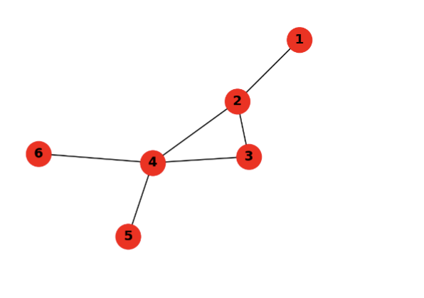
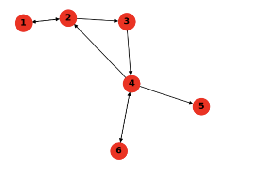
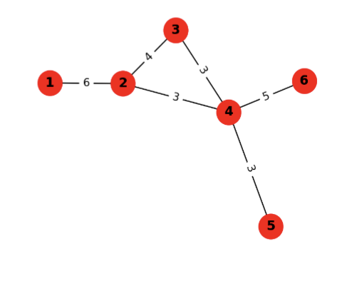

# Week 1 - Introduction

# Week 1 Lecture 

# What is a Complex System? 

In a discussion, some students suggeted that a jet engine is a complex system. The lecturer said this could be true depending on the definition but for this module it is not a complex system. We would not want components jet engine to be a complex system because we wish a jet engine to be work exactly as planned everytime. With a complex system we can never fully understand then and know their outcomes as they are too complex. A complex system is not the same as complicated system for which a jet engine would be. A brain is an example of a complex system. It has a very large number of small components all working together in various ways. Emergence is a key theme in complex systems. 

Dynamics on network means things that happen on the network, i.e. firing. There is also the dynamics of a the network, i.e. how many neurons there are. 

---


# Week 2 - Network Elements 

Let us learn the language of networks:
* The components: nodes, links
* Types of networks and representations
* Features of nodes and links

We want to be able to talk about:
* properties to characterize structure & behavior of networks
* roles of networks in affecting processes occurring on network structures

---

## Formal Definitions 

A network or graph $G$ has two parts: a set of $N$ elements, called **nodes** or vertices, and a set of $L$ pairs of nodes, called links or **edges**. The link $(i, j)$ joins the nodes $i$ and $j$. Two nodes are adjacent or connected or neighbours if there is a link between them.
* this definition excludes temporal nets works as $i,j$ implies the edge exists at all times

A network can be **undirected or directed**. A directed network is also called a digraph (relevant for netx).
* In directed networks, links are called directed links and the order of the nodes in a link reflects the direction: the link $(i, j)$ goes from the source node $i$ to the target node $j$. 
* In undirected networks, all links are bi-directional and the order of the two nodes in a link does not matter.

A network can be unweighted or weighted. In a weighted network, links have
associated weights: the weighted link $(i,j,w)$ between nodes $i$ and $j$ has weight $w$. A network can be both directed and weighted, in which case it has directed weighted links.

---

## Python and NetworkX

### Undirected Networks

This might considered as the default form of networks. 

```
import networkx as nx

# Build network3
G = nx.Graph()4
G.add_node(1)5
G.add_nodes_from([2,3,…])6
G.add_edge(1,2)7
G.add_edges_from([(2,3),(2,4),…])

# Show nodes and edges10
print(G.nodes())11
print(G.edges())

# Show neighbours of node 114
print(G.neighbors(1))

# List edges17
for u,v in G.edges:18
print(u, v)
```



### Directed Networks

This is a more implicated network so it will naturally have more available functions to set up the network and explore it. We can check predecessors and sucessors as there is a distinct order now. Even in di-graph (directed network), some edges can still be constructed as bi-directional, though in a di-graph, this will be shown as a link with two arrows. A bi-directional edge is counted as 2. 

```
import networkx as nx
import matplotlib.pyplot as plt

D = nx.DiGraph()
D.add_edge(1,2)
D.add_edge(2,1)

D.add_edges_from([(2,3),(3,4),…])

print(D.number_of_nodes())
print(D.number_of_edges())

print(D.edges())
print(D.successors(2)) # iterators
D.predecessors(2)
D.neighbors(2)

# List successors of node 218
for s in D.successors(2):
```



### Weighted Network

```
W = nx.Graph()1
W.add_edge(1,2,weight=6)

W.add_weighted_edges_from([(4,5,3),(4,6,5),…])

W.edges()

W.edges(data='weight')

# Print edges with weight > 3
for (u,v,d) in W.edges(data='weight'):
    if d>3:
        print('(%d, %d, %d)’%(u,v,d))

# Draw the directed graph with weights
plt.figure(figsize=(4, 3))
pos = nx.spring_layout(W) # Spring layout
nx.draw(W, pos,
    with_labels=True,
```



---

## Biparite Networks

In a bipartite network, there are two groups of nodes such that links only connect nodes from different groups and not nodes from the same group. This could be though of at product::input relationships, i.e. songs and artists, product and customers, classes and students. 


--- 

## Tree Network 

A tree network is a special class of undirected, connected network such that the deletion of any one link will disconnect the network into two components. The number of links in a tree is $L = N - 1$, where N is the nodes. 

Examples of tree networks include phylogenetic trees, water distribution or power grids, broadcasting networks, food webs


**What is the sparestest type of network?** Technically a straight line but in terms of a true network, a tree. This is ebcause each time you add a new node, you add one more possible edge, this is why Links/Edges = $N-1$. There cannot exist a network with less edges than $N-1$, removing any link in a tree would result in a disconnected components. 

**Why do we care about components and disconnects?** This is linked to redunancy, reliliance and robustness measures. We test these by attacking the network. Interconnectness and Density is a big factor in how these attacks are handled, and/or spread. A high density network means more redundancy, which means it will be more resiliant to attack/changes. 

# Density and Sparsity

For an undirected network of size $N$ (nodes) with $L$ links:

This is the formula for the maximum number of links ($L_{max}$) in a network with $N$ nodes, provided in LaTeX:

$$L_{max} = \binom{N}{2} = \frac{N(N-1)}{2}$$

* $L_{max}$: The maximum possible number of links (edges) in a simple undirected network.

* $\binom{N}{2}$: The binomial coefficient "N choose 2," representing the number of ways to pick a pair of nodes to connect. Given N, how many pairs (2) can you make?

* $N(N-1)/2$: The algebraic expansion. Since each of the $N$ nodes can connect to $N-1$ other nodes, you multiply them; you then divide by 2 because a link between node A and B is the same as the link between B and A.


This notion, $\binom{total}{groups}$ could have anything on the bottom. If you wanted to find make number of triangles within the nodes you would put a 3:

$$\binom{N}{3} = \frac{N(N-1)(N-2)}{3 \times 2 \times 1}$$

And the true form is actually a factorial but it simplies down to what we see above: 

$$\binom{N}{3} = \frac{N!}{3!(N-3)!}$$

$$\frac{N \times (N-1) \times (N-2) \times \color{red}{(N-3) \times (N-4) \dots \times 1}}{(3 \times 2 \times 1) \times \color{red}{(N-3) \times (N-4) \dots \times 1}}$$

The formula cancels out and effectivly flips the fraction so that the simple bit is on the denominiator. 

Now that we have the maximum possible number of links we can use it calculate the density $d$ which is given by: $\frac{L}{L_max} = \frac{2L}{N(N-1)}$. We say a network is space is $d << 1$$.

$<<$ means much less than. Scientists use >> when a simple inequality doesn't tell the whole story.

---


formula for size of undirected, max links, density
sparse definition based on density

and formula for directed, max links, density


[complete network]
every node connected to everyone
density will be 1


[facebook]
appox of sizes
N
L
d

facebook is not dense, actually sparse
most networks are sparse
this is because links scale with N
where as max sclaes with N^2
this means lager the net, the more sparse


[subnetworks]
why? interested to see details in certain area of networks

A subnetwork is a network
obtained by selecting a
subset of the nodes and all
of the links among these
nodes.

S = nx.subgraph(G, node_list)

A complete subnetwork is
called a clique

slide has a part respreenting networks are matrix


[Degree]

undirected
The degree of a node is its number of links, or neighbours.
The degree of node $i$ is typically denoted by $k_i$.

A node without neighbours is called a singleton (k=0)

G.degree(2) # returns the degree of node 2
G.degree() # dict with the degree of all nodes


In a directed network, we have:
in-degree of a node = number of incoming links k_in
out-degree of a node = number of outgoing links k_out

more about connections than neighbours

D.in_degree(4)1
D.out_degree(4)2
D.degree(4) # total degree

The degree function returns the total degree which is
the sum of both in- and out-degrees.


[average degree]
The average degree of a (undirected) network is $ $

av num of edges you have per node

We can connect network size, number of links, density, and average degree!
In undirected networks:

TODO: fill in a understand eqs from slides

[excess degree]
rewatch this section


[strength]

strength of a node, weighted degree

different from undir and dir again

str is sum of strength

dir has an in and out str

**unweigthed uses degrees, weighted uses strength**

[simplifying assumptions]
if not using temporal or something

assume single layer networkds, with single type of node and type of link

there are not self loops back tothe same node


[network repsresnation]
4 slides on this one
adjecency matrix

net rep by matrix

diags are 0 as we cant have self loops

single net allows matrix rep

TODO: fill in exact details a eqs from slide

TODO: something about the pytohn code

undirected networkds will be symetic in the matrix (equation)

undirected degres are obtained by summing cols or rows (both? clarify)

row,col for matrix notation a_ij, a_row,col

recall matmul is not reverisble, ij is not the same as ji

matrix are poor represenation for netowrks because networkds are sparse, meaning alot of space in the matrix will be empty but the memory wont be 

best representation will be an edge list (is this dictionary?)

if not efficent then why use matrix? because it has linear algebra for maths


[about adj mat and matmul] 3 slides

A*A squared, changes the view of the matrix (slides better notes)

TODO: watch this whole section again

Something about seeing triangles


DO THE WHOLE [network repsresnation] SECTION AGAIN


# Week 3 Lecture

textbook second chapter

think about structure of networks and important concepts

[outline]
chapter 2 small words [TODO write down slide structure] rewatch video and take downs of topic introductions

things that are similar tend to group together. also a social phenom

[bird of a feather]

similar things tends to group togoether; like minded people, similar people

wont go into quantifying this yet (later lecture) but ...

how to measure?  how connected entities are compared to other entities; quant way to measure; distance; steps from one another; however still very expensive to compute this; can just calculate the distance between two nodes as there are many routes often; shortest path possible; this depends on type of network, i.e. weighted edges; physical shortest distances may not be the fastest; however this is all too expensive to calc; focus needs to be on density of connections to the "same" type; prob that node connects to same type; dont need to consider path this way

friends of friends connected is clusters; counting the triangles; this is not measuring similar people directly

degree = number of connections

[assortativity]

[THERE IS A PAPER REFERENCED HERE, if interested in network science then should read if possible, foundational paper]

[rewatch slides]

how does assoc emerge; 
1. selection or self-selection process; homopily; you like people who are like yourself; (has a opposite word too); neurons that has similar reactions to the same input; human cells die so need several that know and do the same thing; brain is backed up by redundancy and re[sometihng]; similar ndoes become connected; social sciences this is very common topic, think social media and echo chambers; homopily causes echo chambers and radicalness, bias reinforced; 

2. influece can also be a way that connectivity occurs; not just together because of similar but there is something that pulls you into a network/cluster; 

do similarity incudes links or do links incudes similarity? i.e. yourr env is what influecnes you, exposed to a particualr group, does this influece you? this is related to coevolution and adativness. 

assoc is not ness a good thing, echo chamoers

[degree assortativity]

look at this alot in net science. aka degree correlation; de-assorative is the oppos, assoc means similars group; degree assoc means group with people that has similar degrees (connections); 

right is de-assoc, low degree codes are only connecting to central high degree nodes; doesnt mean disconnected; think hub and spoke;

assoc means nodes connected to nodes with similar number of connected; how be variable within a net; have a mix of high and low degree nodes, but will only connected to similar nodes; think brain highly connects but body less degees, more direct; core-perihperhy structre (this was in bold, what does it mean?); hubs in the core (again, what does this mean?)

degree is calc some sort of a degree correlation

core-periphery with huges in core. "rich club" or social networds with key central figures. 

[assoc in networkx]
 measure correlation bbetween the degree and the average degree of the direct neighbours of a given node
TODO INCLUDES FORMILAS; there is two; 

first calc degree (number) of neighbours of a given node; dot product matmult; a_ji is the connection, k is either the weight or 1 (check this?)

second; average degree of neighbours of a node with a degree of X

if i have degree x, the average degree of my neighbours is x

followed by peasron correlation

TODO UNPACK NETX code

[Paths; Definitions]

unpack from slides

pathl seq of links to go from source to target; there paty not be a paths

cylce; closed path, source and taget node are the same, loop

simple path; no traversing the same link more than ones; we will only deal with simple paths

path length; num of links; could also be based on weights

[euler circa 1736]

[SHORTEST PATH]

between two nodes; min length, there may be more than one; in weighted networkds, weights may mean distance; 

shortest path length is a the metric for teh shrotest path, akak distances. undefined or initite is there is no root.

[APL and Diameter]

diameter is the longest shortest path length, or max of the shortest path lengths accross nodes; shortest path length =. of two nodes; diameter looks at all possible pairs of nodes, which is the longest in the network?; this gives a measure of the total size of the network; need to look at the shortest paths to give us this measure, otherwise we could just mkae arbitarily huge routes; number = you cannot find a longer path that will need to be traversed, any pair will be this or less; 

TODO INCLUDE EQUATION OF DIAMETER

Average Path Length (APL) average of the shortest path length accorss all pairs of nodes. 

TODO TO DIFF EQUATIONS FOR UNDIR VS DIR NETWORKS

big issue here if there is an undefinied path; netx will highlight this as a diconnected network; could exclused all connected elements; solution is to do the harmonic means

TODO equation but also understand the intution as to why we make this change with repect to the above topic. harminc mean is a ratio; the infinate dstance becomes 0, we can get rid of disconnected components; average of iverse and invert again; 

looking as inverse of distance has a name and paper, measure of network efficency; TODO RE WATCH THIS EXPLANATION; something about inf becoming 0;

TODO UNPACK NETOWRKX OPTIOND (REWATCH SLIDES)

[connectedness and components]

net is conn if there is a path between any two nodes

if not then disconnected

MISSED SOME TERMINOLOGT ON FIRST SLIDE

a dir net can be strongly connected or weakly connected

strongly is triangles, a pass between any pair

notion of in-component and out-component

nodes that are connected to a network but you cannot go to, this in-component. i.e. a node on the edge that has a direction that goes into the network, i..e you cant get to do, cant go back; node can reach S nodes,  but S node cannot reach the start node; 

out-compent as connect nodes that cannot go to the S but S can go to

NETWORKX CODE TO UNPACK

[trees]

tree is a connected network with out cycles, friends of friends cannot exists, N-1 links; sparsest way of building network;

with a tree, you can pick any node to be the root and it retrains its hierachical structure; nets can be reorganised; root has no parents, leaves ahve no children; 

[finding shortest paths]

algo; breadth-first search; not a tree becasue it has cycles (loops); start from source node, doesn't matter which one but probably start from root; as above, any can be root; first list neighbours at same depth; then iterative to next layer; 

[breadth-first search]

TODO DIDNT LIST TO ANY OF THIS, REFOLLOW SECTION AND MAKE NOTES

[social distance]

how closer or far, is is apl

acedeic coauthoriship networks; how connected are authors, how far away;

Paul Ardos; 500 coauthor; is a hub in a coauthorship network; SOMETING ABOUT SMALL NUMBERS, REVIST

[six degrees of kevin bacon]

shorts paths, hubs have short paths; 

[small worlds]

social networks trned to have very short paths

six degress of sperationl any two people are at most 6 people away; 

[milgrams experiement]

PAPER TO READ

take rand people, give them a tatget; send letter to people that might bring you closer to x person or place; see how many steps to get to x; only 26% Mmade it; av steps were 6; range 3-12;

yahoo repeated with email in 2003; approx 4-7

facebook; uni milan; 

[short paths]

what do we mean by short paths, when can we call a path short?

depends on size of network; fast within network; observe erela between alp and net wise

apl is short when it grows very slowly with the size of the network

LOG EQUATION

[small worlds]

most irl will be small worlds

type of structure that might not be so short? hubs create short routes if the hubs are connected; a lattice strcture will not be short; or a grid like nyc; 

[friend of a friend]

the presence of triangles

often use with social becuase friends are often friends of friends also

direct networks are a bit more complicated. transitivity; may have a triangle but all 3 arent actually connected;

[clustering coefficent]

measure num of trianges that a node actually has relative to how many it could have

clust coeff is the fract of pairs of the nodes neighbours that are connected to each other

NEED TO FOLLOW THIS SLIDE, LECTURE VIDEO and EQUATION BETTER

xs


# Week 4 Lecture

* talk about hubs and notion of centrality
* how to look at resilience in networks
* start with network models (later week but it is a big topic)

we've spents a bit of time on generality, now starting on the detail

Hubs, this corresponds to **Chapter 3** of the text book

Talk about this notion of centrality measure

Whats is cent? nodes in the netowrk that are important, how important nodes are measure. more center, i.e. hubs = important

in big networks,, you cant practically scope into individual nodes to analyse

we want to know about entire netowrk, not just at ndeo level

to do this we look at distrubions; histgram of values;

revist friendship paradox; clarify in more detail; better than just avaring nodes

ultra-small words, networkds tends to have short distances; many are ultra-small; suprising small number of hops to go anywhere

because we have hubs weare going to look at robustness; hubs are what make it possible to move around quick; then these hubs are under risk of attack; i.e. london railway, connection point; 

core decomposition; lab sheet 3; 

[real networks are hetrogeneous]

some nodes (and links) are much more important (central) than other; nodes are clearly more important than others, i.e. hubs; but links are important to look at too, 

hubs are hub in terms of distribution; long tail

real worlds is highly hetro; 

[centrality measures]

centrality: measure of important of a node

measure types looked at:
* degree
* closness
* betweeness

link shows 111 measures. there are many different types

not all measures can capture all dimensions. 

degree may not measure hetro in your network

second link have options for mutliplayer and temporal network

point of lecture is to understand how the measures work then you can decide if they work for you

[degree]

the degree k_i of node i is the number of its neighbours

high deg nodes are called hubs

avg degree of an (undirected) net is given by: [INSERT FORMULA and python code]

> clarify why this us undir rather than dir

this is centrality measure in the sense that it is a number that qusnitfies size of node

[cloessness]

another anlt measure

idea: a node is more central the closer it is to other ndoes on average

need the idea of path to do this

1/ sum of ddistance between i and j

[INSERT FORMULA and python code]

the formula is looking at all other nodes in the network, thats why it is a sum

int: how many hop does it take to get anywhere in the network

[betweenness]

classic, used alot

idea: a node is more central the more often it is crossed by paths

[INSERT FORMULA]

how often is going to be involved with pairs in the netowrk

important for transport, i.e. east to west coast us. 

where is your particular network going to take you. if you had a fill connected network, you could just hop easily accross the netowrk. but with a hetro net, you need to access the route availble to you, often utilising hubs to move faster. 

if you have all possible routes, i to j, what nodes are going to occur alot in this? 

NOTE: does i to j just mean all possible nodes in a network, of all possible routes given a specified statt and end?? IT IS USING THE SHORTEST PATHS. REDO DEFINITION OF SHORTEST PATHS AGAIN (wait not sure if this was correct, still says from h to j) seem to actually start with start and end points

we are looking at the inbetween nodes

if node appear alot then we say they have a high betweenenss centrality


num: shortest paths from h to j, crossing through i.

den: num of shortest paths from h to j

dont need to do any loops, python does it for you

this metric is expressing in terms of nodes, but you can extend the logic to links

links are often easier to think about. if looking at transport networks, a broken link is generally what occurs. the hubs, i.e. a stration are generally fine, but links centralitiy is important

hubs usually habe high betweenness 

but there can be huges with high bet that are not hubs

[includes networks example with correct numbers]

routes that are connecting points only have high bets

if you attack these points you disconnect the network

[a quick visual depication of differences]

each cent metric gives you a different view of the network 

[insert image]

comes from paper 2

[centrality distrubtion]

on small networds, it makes sense to ask which nodes or links are most important

on large, it does not

solution: stats approach

characterist net in terms of prob dist of metrics

insttead of focus of individ nodes and links, we consider classes of nodes and links with similar properties

centrality distribtion; instead of each node, we look at overall

network can be presented as histogram; this is the int of distributions

[insert diagram]

normailis metrice by number of nodes n_k to get a fraction

n_k i the number of nodes with degree k 

f_k = n_k/K is the frq of degree k

whe N -> inf, f_k is the prob p_k of having degree k

p_k vs k is the prob dist of node degree

[cumulative distribion]

ask what is the prob that i get a number greater than something

if var is not int (e.g. betweenness) the range of the variable is divided into internvals (bins) and we count how many values fall in each int

cumulative dis p(x) prob that the var tkaes vlues larger than x and funcion of x

our prob functions are determined by counting and nromalising by what happends after some contraction or inequal. i.e. > v

compute by summing the freqs of the var inside the internvals to the right of x

summing all the values v that are greater than x

[insert formula]

it is complemntation to the prob dist and and used when the range of the variablity is very broad (this is often the case with cent measures and irl netowrks)


[log scale]

q, how to plot a prob dist if the var spans a large range of values, from small to very large

use a log scale

report the log of the values on the x and y axis

i.e. node with 1 neighbour compares to another with 1,000,000; mill swill swamp out resolution of 1

we are converting the scale

[degree distributions]

[insert degree of deg for a real world network ]

x axis is in-dgree
y axis is prob

heavy tail distributions: the variable goes from small to large values

what HT means? 

freq of earthquakes in terms of magnutide. how often to small vs big occur. small happens all the time. high is very rare. the ricter scale is a expo scale, 8 is 10 times strong than 7. if you were to prob dist of all ricters, it will have an expo drop in probability, 

but the 9 will happen more often than if completely random. this is heavy tail; 

in the graph, most prob is in the low in-degree; very close to one, v large number; however, relatively, we stil have a large prob for high in-degree

if you were to draw it with a linear scope, you woul dhave a straight line and then prob for the large would be much less.

There is an overrepresentation of very large events compare to what would happen if the process was completely random (straight line)

--- 

In statistics and network science, a heavy-tailed distribution is one where the "tails" (the extreme ends of the graph) are much thicker or heavier than you’d see in a standard "normal" (Bell Curve) distribution.

In a heavy-tailed system, events that would be "one-in-a-billion" in a normal distribution happen with surprising frequency. This occurs because the probability of an event decreases slowly as the size of the event increases.

Positive Feedback Loops: In systems like the stock market or social media, popularity breeds more popularity. This "preferential attachment" pushes events into the extreme tail.

Lack of a Physical Limit: While human height is limited by biology (gravity, bone strength), "virtual" things like debt, computer virus spread, or Twitter retweets have no physical ceiling, allowing the tail to stretch indefinitely.

Non-Independence: In a Bell Curve, one person being tall doesn't make the next person taller. In heavy-tailed systems (like a bank run), one event triggers another, making a massive, "unlikely" collapse much more probable.

To relate these concepts to network science, we have to look at the Degree Distribution, which is essentially a census of the network: it tells us how many nodes have 1 connection, how many have 2, and so on.

In a scale-free network, the degree distribution is a heavy-tail distribution. Here is how that connection works:

In a standard "Bell Curve" network (like a grid of city streets), the "average" number of connections actually tells you something useful. If the average is 4, most intersections have 3, 4, or 5 streets.

In a heavy-tailed degree distribution, the "average" is a mathematical ghost. If you take a network with a few massive hubs (like the Internet), the "average" number of links might be 50.However, 95% of nodes might have only 2 links, while one hub has 1,000,000. The takeaway: The heavy tail means the "typical" node is tiny, but the "total" system is defined by the giants.

The "unlikely events" we discussed in heavy tails are the Hubs in network science. In a random network, a node with 1,000 connections is statistically impossible (like a 20-foot tall human). In a scale-free network, these hubs are "overrepresented" because the tail doesn't decay quickly.

Why do they appear? (Preferential Attachment)
Heavy tails in networks usually arise from a process called Preferential Attachment (or the "Rich-Get-Richer" effect): A new node joins the network. It prefers to connect to nodes that already have many links. This creates a feedback loop: the more links a hub has, the faster it earns new ones.

The fact that hubs are more common than "normal" math would predict changes how networks function:
* Epidemics: In a normal distribution, a virus needs a certain "virulence" to spread. In a heavy-tailed network, a virus can persist even if it's weak, because if it hits a hub, it instantly teleports to thousands of other nodes.
* Robustness: Because the tail is heavy, you can remove 50% of random nodes and the network will stay connected. The hubs act as the "glue."
* Searchability: You can find almost any information on the web in a few clicks because the heavy-tail distribution ensures there is always a "super-connector" nearby to bridge distant parts of the graph.

To see if a network is truly scale-free/heavy-tailed, scientists use a Log-Log Plot.

In a normal distribution, the curve crashes downward.

In a heavy-tailed distribution, the data follows a straight line. This straight line is the visual proof that "unlikely" high-degree nodes are appearing at a steady, predictable rate rather than vanishing.

Log-log plots in network science are graphs with logarithmic scales on both axes used to identify power-law degree distributions (
) in scale-free networks. They transform power-law relationships into straight lines, allowing researchers to visualize the presence of hubs and analyze network heterogeneity.

Purpose: To visualize if a network's degree distribution follows a power law (i.e., a scale-free network), where most nodes have few connections and a few nodes have many connections.
Interpretation: A straight downward-sloping line on a log-log plot indicates a power-law distribution.
Scale-Free Networks: In these networks, the probability 
 that a node has 
 connections follows 
, where 
 (gamma) is the degree exponent.
Applications: Used to analyze various networks, including the World Wide Web, citation networks, and social networks.
Limitations: Simply "eyeballing" a straight line can be misleading; rigorous statistical methods are required to confirm a power law.

--- 

this is v important chara of natural networds


Another thing we want to look at is how hetro our network is 

If you have a regular network where every node has the same number of neighbours then your distribution would be highly regular. It would be homo, the variance of the degree will be small. 

How do we measure this?
* take the hetro parameter $k$ which is going ot be the ratio of variable

$$\kappa = \frac{\langle k^2 \rangle}{\langle k \rangle^2}$$

The formula in the image represents the heterogeneity parameter (often denoted as $\kappa$) in network science. It is used to measure how much the degree distribution of a network deviates from a uniform or random state.

* $\kappa$ (Kappa): The heterogeneity parameter.
* $\langle k^2 \rangle$: The second moment of the degree distribution (the average of the squared degrees).
* $\langle k \rangle^2$: The square of the first moment (the square of the average degree).

In a scale-free network, the second moment $\langle k^2 \rangle$ often diverges as the network size increases. This leads to a very high $\kappa$, mathematically signaling the "overrepresentation of unlikely events" (the hubs) we discussed earlier. In contrast, for a perfectly uniform network where every node has the same number of links, $\kappa = 1$.

A scale-free network is a network where the "wealth" (connections) is distributed extremely unevenly.

n most systems we are used to, things cluster around an average. In a scale-free network, the "average" doesn't really exist. Instead, the network is defined by two types of players:

The Masses: The vast majority of nodes have only one or two connections.

The Hubs: A tiny handful of nodes have an astronomical number of connections. These "super-connectors" hold the entire system together.

The name is a bit counter-intuitive. It means the network does not have a characteristic scale.

In a "Scaled" Network (like a Bread Forest): If you look at a forest, most trees are roughly the same height. There is a "scale" (e.g., 20–50 feet). You won't find a tree that is 10,000 feet tall.

In a "Scale-Free" Network: Because the distribution follows a Power Law, the network looks statistically similar whether you are looking at a small piece of it or the whole thing. There is no "typical" node that represents the "scale" of the network.

Scale-free networks usually grow through a process called Preferential Attachment.

Imagine a new person joins a social network. Are they more likely to follow a random stranger with 2 followers, or a celebrity with 2 million? They pick the celebrity. Because the celebrity gets more links, they become even more visible, which attracts even more links. This feedback loop creates the "Heavy Tail" we talked about earlier.

Because of this structure, scale-free networks have a unique weakness:

Robustness: You can break 90% of the random nodes, and the network will still function because the hubs are still there.

Vulnerability: If you strategically remove just the hubs, the entire network falls apart into isolated pieces instantly.

You nailed it. Saying a network is heterogeneous is the formal way of saying it has a "diverse" range of nodes—from the tiny "nobodies" to the massive "hubs."

When you say it is characterized by a large $k$, you are touching on the most important mathematical consequence of scale-freeness: the Diverging Second Moment.

In a scale-free network, $k$ (the degree of a node) doesn't just get "large"—in theory, as the network grows, the maximum degree ($k_{max}$) can become infinite.

$$\kappa = \frac{\langle k^2 \rangle}{\langle k \rangle^2}$$

In the context of the formula you shared, the symbols $\langle$ and $\rangle$ are called angle brackets. They represent the expected value or the average of a variable.

The Numerator: $\langle k^2 \rangle$This is the average of the squares. To calculate this:Take the degree ($k$) of every single node.Square each of those numbers ($k^2$).Add them all up and divide by the total number of nodes ($N$).Significance: Because the degrees are squared before averaging, large hubs (high $k$) have a massive, disproportionate impact on this number.

The Denominator: $\langle k \rangle^2$This is the square of the average. To calculate this:Find the simple average degree of the network ($\langle k \rangle$).Square that single result.Significance: This represents what the network would look like if it were "normal" or homogeneous.

In a Homogeneous Network (like a grid): Most nodes have the same $k$. The average of the squares $\langle k^2 \rangle$ is very close to the square of the average $\langle k \rangle^2$. This makes $\kappa$ small (close to 1).

In a Heterogeneous (Scale-Free) Network: Because of those few massive hubs, the term $\langle k^2 \rangle$ becomes enormous. Even if the "average" node only has 2 links, a single hub with 10,000 links blows the math wide open.

The reason scientists care about a "large $k$" and a high $\kappa$ value is that it changes the physics of the network.

The "Vanishing" Epidemic ThresholdIn a "normal" network, a virus needs a certain level of contagiousness to spread. If it's too weak, it dies out.However, in a scale-free network with a very large $\kappa$:The threshold vanishes. * Because the hubs are so connected, even a incredibly "weak" virus can stay alive indefinitely because it will eventually hit a hub and be broadcast to the rest of the system.

Heterogeneity makes the network a "Small World." Because $\kappa$ is large, the distance between any two nodes is incredibly short. The hubs act as high-speed super-highways that bridge different communities.

1. Preferential Attachment leads to...
2. A Power Law Degree Distribution (Heavy Tail), which creates...
3. High Heterogeneity (Large $\kappa$), which results in...
4. Extreme Robustness to random failure but Extreme Vulnerability to targeted attacks.

--- 

These formulas show how to calculate the average degree (first moment) and the average of the squared degrees (second moment):

Average Degree ($\langle k \rangle$):
$$\langle k \rangle = \frac{\sum_{i} k_i}{N} = \frac{2L}{N}$$

Second Moment ($\langle k^2 \rangle$):
$$\langle k^2 \rangle = \frac{\sum_{i} k_i^2}{N}$$

Homogeneous Distribution: If most nodes have roughly the same degree ($k_0$), then the first moment is approximately $k_0$ and the second moment is approximately $k_0^2$. This leads to a $\kappa$ value near 1:

$$\langle k \rangle \approx k_0, \langle k^2 \rangle \approx k_0^2 \implies \kappa \approx 1$$

Heterogeneous Distribution: If the distribution is very broad (like in a scale-free network with massive hubs), the value of $\kappa$ is much greater than 1:

$$\kappa \gg 1$$

[degree centrality]

for the example of real networks; wike, facebook. all of the hetro k is above k, often by alot like wiki 38

[betweenness distribtion]

same thing happens if we look at betweenness, the distribtion doesnt collapse at all

In a standard "thin-tailed" distribution (like the heights of 100 people), as you add more data, the average quickly stabilizes. It "collapses" onto a single, predictable value. In a heavy-tailed distribution, the opposite happens: the more data you collect, the more likely you are to hit a "Hub" or a "Black Swan" that completely shifts the average.

Here is why heavy tails prevent that "collapse" to a stable mean:

1. The "Moving Target" AverageIn a scale-free network, because the second moment $\langle k^2 \rangle$ (and sometimes even the first moment $\langle k \rangle$) can diverge, the "average" is sensitive to the size of the system ($N$).Small Sample: You might only see small nodes, so your average degree $\langle k \rangle$ looks small.Large Sample: The larger the network, the more likely it is to contain a massive hub. When that hub appears, it pulls the average up significantly.Result: The distribution doesn't "settle down" or collapse into a single characteristic value because the "scale" keeps growing with the system.

In network science, when a lecturer says a log-log graph like this one "doesn't collapse," they are highlighting that the system lacks a characteristic scale. Instead of the data points settling into a predictable, narrow range (collapsing around an average), the distribution remains broad and "heavy-tailed".

In the context of the log-log graph you provided, a straight line is the visual signature of a distribution that does not collapse.

The Straight Line (The Non-Collapse)The straight line on a log-log plot (like the Twitter and Wikipedia data in your image) represents a Power Law.Why it doesn't collapse: It stays "spread out" across many orders of magnitude.The Math: Because it follows $P(k) \sim k^{-\gamma}$, there is no single "scale". As the network grows, you just find even larger hubs, preventing the data from settling into a single point or narrow curve.Heterogeneity: This results in $\kappa \gg 1$, meaning the distribution is very broad

2. What a "Collapsing" Distribution Looks LikeA distribution that "collapses" (like a Normal or Exponential distribution) would look like a rapidly plummeting curve on a log-log plot, not a straight line.The "Crash": Instead of continuing in a straight line toward the right, the line would suddenly dive downward almost vertically.The Limit: This "crash" happens because, in those systems, it is physically or statistically impossible to have "hubs". For example, in a network of physical roads, you can't have an intersection with 10,000 streets.Homogeneity: In these cases, $\kappa \approx 1$ because most nodes have roughly the same degree ($k_0$).


# friendship paradox

on average your friends will have more friends than you

if choosing nodes at random, a hub has the same chance to be picked as anyone else

if choosing links at random, a hub has a higher chance to be picked as it has more links

imagine if doing the average using this method, hubs have more weight 

thr average will be bias towards the degree of the hub

# ultra-small world

later topic in next lecture called small worlds

small world property

we also have a lecture called small world

the later is being about being small world model

there is a metric for small worlded ness which is trade-off between

this lecture

if we have a network with hubs, then we will likely have ultra short paths (just small world is typical of most networks of interest)

[INSERT GRAPH OF DISTROIBTUION OF SHORTEST PATH LENGTH DIST]

you tend to have a "prefered" path lenth, i.e. a peak

but what it also demonstrates is exponential collepase of prob

there is not a heavy trail

# robustness

a system is robust if the failure of some of its components does not affect its function

but wait, does structure predict function? 

how to define robust of a net?

we remove nodes and/or links see what happens on its structure

key point it connectedness

(a better approach is to sse how relevant metric change given network changes)

how to do it: plot select side of S, which is the largest connected component, as a fraction of the removed nodes

As the fraction of removed nodes increases, the network is progressively broken into smaller, disconnected components, and the value of $S$ goes down. (from 1)

we want to track the size of the largest component and see how it changes. (as a proportion)

$$S = \frac{\text{Size of largest component remaining}}{\text{Original total nodes } (N)}$$

The "non-collapsing" log-log distributions you saw for Twitter and Wikipedia mean those networks have a very high heterogeneity parameter $\kappa$.

In a robustness test, these heterogeneous networks behave in a "Robust-yet-Fragile" way:
* Random Failure: If nodes are removed at random, these networks are incredibly robust because you are likely to hit tiny nodes rather than the hubs.
* Targeted Attack: If you specifically target the hubs (the "overrepresented unlikely events" in the tail), the value of $S$ will drop to zero very quickly, causing the network to collapse.

evutually the network is going to rpgressively breakdow. but we want to see how it breaks down

two robust strats:
* random failures: break down nodes randomly so they are chosen at the same prob. remove a fraction of nodes chosen at random
* attacks: hubs are deliberetly targetted. the larger the degree, the higher prob a node is targeted

[insert diagram of different approaches]

what does this plot tell you about the network?

with targetted attacks you are taking much larger chunks out of the network even on the first removal 

the random is much more gradual as it hasnt (in this run) hit the hub(s)

the attacks taper out because all of the hubs are removed

consclus: real networks are robust again rand but not targetted

# core decompostion

understand the backbone of the network

core: is the dense part of the netowrk, with high degree nodes

it is a recurisvie iterative procees

take a network and gruadullaly identify the dense part

indestructable=max reducdancy
* safe against random and target attacks

remove all nodes with. degree less than k-1

the remainining will be called k-core

k-core decomposition proc:

* start with k=0
* recurs remove all nodes with degree k until none are left
* the set of removed nodes is the k-th shel, while the remaining one form the k+1 core, i.e. the ones removed could be the 0th shell.
* if there is no node left, terminate. othereise, incredment k by one and repeat 

easy to think we are just collecting the k-th nodes

this is no it, we need to look at the impact on removing a node on the remaining nodes. 

a node with 1 connection may be removed but this removes a connection from something that may have has k=4, now has k=3. this why we need to recurse

[insert pic of effect of decomp]

k=1 the clear poliarisation still remains

k=4, just looking at peopole who are conencted to 4 people. the interaction is more clear

k=16, split but see that the two groups interact to some extent but one node is much bigger

k=20 just one remaining group

core decomp helps to vis large nets by pruning low degree nodes and showing only the denest parts

the remaining is the super stable core


# week 5 (chapter 4 part 2)

emp networks are; hetro, degree, hubs, clustering tends to be high, this creates resiliance, maybe be design, i..e transport, crete redunance to avoid dependency

the metric helps you design stuff, it is not the property itself

small world; related to small paths; 

[heavy tail]

poor explnation last lecture

heavy tail does not mean scale freeness

features of real networks:
* small word prop
* high clust coeff
* hetrogenenity


why do we say scale free: the pdf becomes linear and predictable; no matter what scale you are scale, the system is under the same rules, within the scale the laws are the same

this is incontract to say travel; walk, run, run, plane, all different

the (something) dictates the slope

now, heavy tail, this is not scale free as it is not a straight line, there seems to be a collapse at the end

end has overabundance 

(still review all of this)

[models]

set of intructions to build a net

goal: find models that generate networs with the same chars as irl nets

[random networds]

algo to build a ranfom netowrk

WRITE FULL DETAILS AND EXPLANTION HERE

[random networks; evolution]

focus connected components

p=0 no connections, just nodes

p=1 there are links with n nodes

what happens as we add nodes to to network? 

naive: smmot increase of size of largest comp with number of links

wrong, there is a abrputpt increase for a given value of the link prob p

somthing about francito nof nodes in a giant component 

(what is a giant component)


network evolution shows jumps

in the start random links create pairs on average, there is not giant component

suddenly, these components become connected, this caused the jumps

often will plateu again, might be building 2 gaints, then suddely these get joined and another jump

[tossing of a coin]

(using this int to follow respresentation of building a netowrk randomly)

using a biased coin which yeilds help with prob p

t: num indep tosses
h: num heads after t trials

getting head is like building a link

special cases:
[copy in the spec cases]

[number of links, density]

epected number of links L of a random network N

[REFOLLOW THIS LOGIC AND COPY IN FORMULAS]

density = p (how, real follow)

**some point about not setting p too high or low** 0.8 is too high for anything realted to the real world

[rand nets: average degree]

expected average degree

REFOLLOW INTUATION AND FORMULAS

can derived p is you know average degree and size, visa verse

[rand net: degree distribution]

Q: what is the prob that a node has k neighbs?

is inorder to say if net is hetro, need to look at prob dist and degree dist

in order to do this need answer the Q

i.e. counter example = if throw coin 10 times what is prob of through 8 heads

INSERT FORMULA: BIONOMIAL DISTRIBTUION

something about the logic of combination, the first term is quanitify the ways to get k neighbours

this decribes rv process of allocating links

for small p ... [finish and understand pont as bottom of slide]

[INSERT GRAPH]

degree dist is random netwokrs is very different from the dist of real-word networds

[DONT REALLT UNDERSTAND THE INT HERE, why?]


[rnaodm net: small word propert]

how many nodes are there on average from any node

first make simplifiation

fomulas give a way to predict number of conns av

[rand net: clustering coeff]

based on prob that neighbours are connected

(refollow)


[rand net: summary]

FILL THIS INS

[small word networks]

goal: building networkds with the small world prop and high clustering coeff


sol: interp between a reg lattice (high clust) and a random net (small-world prop)

[watts-strogatz]

follow this as at the end there is metric for small worldness

this type as small world nd clustering but it does not have hetro (degree dist) it does not have hub

[THIS HAS A PAPER]


[configuration model]

problem: is it possible to build netowkrds with a pre-definite degree sequence, .e. a list of N numbers (k_1, k_n) specifiying the degree k_i of each node i

list of degree of the nodes in the network

each entry of a nodes degrees

soltuon= confif model

assign a degree to each node (from the desired dist or a real network), places stubs on each node as per the dergee of the node 

attatch pairs of stubs at random

create a network based on the stubs

maybe leads to implementation that don't work or arent valid

space of possibility are valid connections

huge networkds have high space of possibily

[DIDNT FOLLOW LAST CONFIG SLIDE]


[expon random randoms]

more advance, might not be used by use, relevant for rico lecture

[d-k randomization]

instead of just preseriving the degree dsequence

(this says very little about over things, i.e. assoc)

dk maintains not just the degree seq but also the joint degree-degree correlation at given level k

d0-

d1-

d2-

what are the diffs between these 3?

something apply applying empiral network whilst mainitng over property/metric of the network that defines it

this is what dk allows you to do

ideal is to generate networks which are isomorpch of networks that oyu already have

should be acheived by d3???????

[network growth]

real world networkds are dynamic

dk has no way to generate hubs, its generation is random

previous examples we prespecified the size of the network

facebook was a network that grew

we want to define a process for whislt nets can grow

gen proc:
* a new noe comes with a given number of stubs, indidating the number of neighb of the node (degree)
* stubs are attached to some of the esiting codes, according to some rule

[perferential attatchement]

nodes prefere to link to the more connected nodes

i.e. knowledge of web is bias towards popular pages, which are highly linked so it it more likely rhat our website points to a high linked site

same concept for highly cited papers and acedemia

[whcih model?]

out net model should have the following features:
* growth
* pref attach; our previous models just added randomlyto anything

[polyas urn model]

this concept helps exaplin pref attach

go through this better

[barabasi albert model]

didnt follow this section


