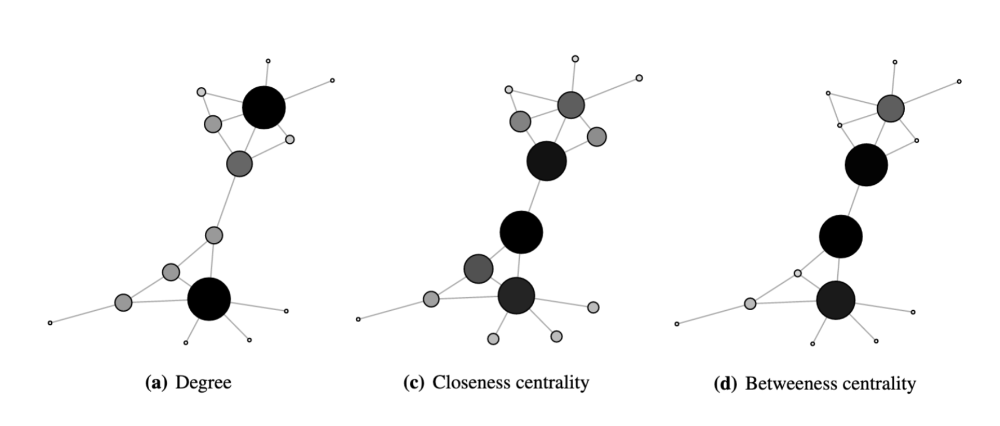
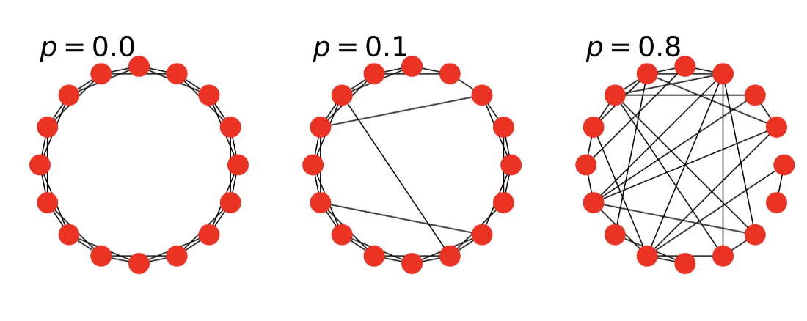

# Network Science

1. [Week 1 - Introduction](#week-1---introduction) 
2. [Week 2 - Network Elements ](#week-2---network-elements)
3. [Week 3 - Small World](#week-3---small-worlds)


# Week 1 - Introduction

## What is a Complex System? 

In a discussion, some students suggeted that a jet engine is a complex system. The lecturer said this could be true depending on the definition but for this module it is not a complex system. We would not want components jet engine to be a complex system because we wish a jet engine to be work exactly as planned everytime. With a complex system we can never fully understand then and know their outcomes as they are too complex. A complex system is not the same as complicated system for which a jet engine would be. A brain is an example of a complex system. It has a very large number of small components all working together in various ways. Emergence is a key theme in complex systems. 

Dynamics on network means things that happen on the network, i.e. firing. There is also the dynamics of a the network, i.e. how many neurons there are. 

---

<br>

# Week 2 - Network Elements 

Learning Outcomes:
* Learn the language of networks
* The components: nodes, links
* Types of networks and representations
* Features of nodes and links

We want to be able to talk about:
* properties to characterize structure & behavior of networks
* roles of networks in affecting processes occurring on network structures

---

#### Lecture 2: Contents 

* []()


<br>

---

## Formal Definitions 

A network or graph $G$ has two parts: a set of $N$ elements, called **nodes** or vertices, and a set of $L$ pairs of nodes, called links or **edges**. The link $(i, j)$ joins the nodes $i$ and $j$. Two nodes are adjacent or connected or neighbours if there is a link between them.
* this definition excludes temporal nets works as $i,j$ implies the edge exists at all times

A network can be **undirected or directed**. A directed network is also called a digraph (relevant for netx).
* In directed networks, links are called directed links and the order of the nodes in a link reflects the direction: the link $(i, j)$ goes from the source node $i$ to the target node $j$. 
* In undirected networks, all links are bi-directional and the order of the two nodes in a link does not matter.

A network can be unweighted or weighted. In a weighted network, links have
associated weights: the weighted link $(i,j,w)$ between nodes $i$ and $j$ has weight $w$. A network can be both directed and weighted, in which case it has directed weighted links.

---

## Python and NetworkX

### Undirected Networks

This might considered as the default form of networks. 

```
import networkx as nx

# Build network3
G = nx.Graph()4
G.add_node(1)5
G.add_nodes_from([2,3,…])6
G.add_edge(1,2)7
G.add_edges_from([(2,3),(2,4),…])

# Show nodes and edges10
print(G.nodes())11
print(G.edges())

# Show neighbours of node 114
print(G.neighbors(1))

# List edges17
for u,v in G.edges:18
print(u, v)
```


### Directed Networks

This is a more implicated network so it will naturally have more available functions to set up the network and explore it. We can check predecessors and sucessors as there is a distinct order now. Even in di-graph (directed network), some edges can still be constructed as bi-directional, though in a di-graph, this will be shown as a link with two arrows. A bi-directional edge is counted as 2. 

```
import networkx as nx
import matplotlib.pyplot as plt

D = nx.DiGraph()
D.add_edge(1,2)
D.add_edge(2,1)

D.add_edges_from([(2,3),(3,4),…])

print(D.number_of_nodes())
print(D.number_of_edges())

print(D.edges())
print(D.successors(2)) # iterators
D.predecessors(2)
D.neighbors(2)

# List successors of node 218
for s in D.successors(2):
```


### Weighted Network

```
W = nx.Graph()1
W.add_edge(1,2,weight=6)

W.add_weighted_edges_from([(4,5,3),(4,6,5),…])

W.edges()

W.edges(data='weight')

# Print edges with weight > 3
for (u,v,d) in W.edges(data='weight'):
    if d>3:
        print('(%d, %d, %d)’%(u,v,d))

# Draw the directed graph with weights
plt.figure(figsize=(4, 3))
pos = nx.spring_layout(W) # Spring layout
nx.draw(W, pos,
    with_labels=True,
```


---

## Biparite Networks

In a bipartite network, there are two groups of nodes such that links only connect nodes from different groups and not nodes from the same group. This could be though of at product::input relationships, i.e. songs and artists, product and customers, classes and students. 


--- 

## Tree Network 

A tree network is a special class of undirected, connected network such that the deletion of any one link will disconnect the network into two components. The number of links in a tree is $L = N - 1$, where N is the nodes. 

Examples of tree networks include phylogenetic trees, water distribution or power grids, broadcasting networks, food webs


**What is the sparestest type of network?** Technically a straight line but in terms of a true network, a tree. This is ebcause each time you add a new node, you add one more possible edge, this is why Links/Edges = $N-1$. There cannot exist a network with less edges than $N-1$, removing any link in a tree would result in a disconnected components. 

**Why do we care about components and disconnects?** This is linked to redunancy, reliliance and robustness measures. We test these by attacking the network. Interconnectness and Density is a big factor in how these attacks are handled, and/or spread. A high density network means more redundancy, which means it will be more resiliant to attack/changes. 

<br>

---

## Density and Sparsity

### Undirected Networks

For an undirected network of size $N$ (nodes) with $L$ links:

This is the formula for the maximum number of links ($L_{max}$) in a network with $N$ nodes, provided in LaTeX:

$$L_{max} = \binom{N}{2} = \frac{N(N-1)}{2}$$

* $L_{max}$: The maximum possible number of links (edges) in a simple undirected network.

* $\binom{N}{2}$: The binomial coefficient "N choose 2," representing the number of ways to pick a pair of nodes to connect. Given N, how many pairs (2) can you make?

* $N(N-1)/2$: The algebraic expansion. Since each of the $N$ nodes can connect to $N-1$ other nodes, you multiply them; you then divide by 2 because a link between node A and B is the same as the link between B and A.


This notion, $\binom{total}{groups}$ could have anything on the bottom. If you wanted to find make number of triangles within the nodes you would put a 3:

$$\binom{N}{3} = \frac{N(N-1)(N-2)}{3 \times 2 \times 1}$$

And the true form is actually a factorial but it simplies down to what we see above: 

$$\binom{N}{3} = \frac{N!}{3!(N-3)!}$$

$$\frac{N \times (N-1) \times (N-2) \times \color{red}{(N-3) \times (N-4) \dots \times 1}}{(3 \times 2 \times 1) \times \color{red}{(N-3) \times (N-4) \dots \times 1}}$$

The formula cancels out and effectivly flips the fraction so that the simple bit is on the denominiator. 

Now that we have the maximum possible number of links we can use it calculate the density $d$ which is given by: $\frac{L}{L_max} = \frac{2L}{N(N-1)}$. We say a network is space is $d << 1$$.

$<<$ means much less than. Scientists use >> when a simple inequality doesn't tell the whole story.

---

### Directed Networks

In a directed network, the logic of "N choose 2" changes because the direction of the connection creates a unique relationship. In an undirected network, we divide by 2 because $A \to B$ and $B \to A$ are the exact same link. In a directed network, they are considered two distinct links. 

For the first node: You have $N$ choices. For the second node: You have $N - 1$ choices (since a node usually doesn't link to itself). Therefore the maximum links for Directed Networks is:

$$L_{max} = N(N - 1)$$

Because direction matters, we don't "collapse" the pairs. You can have a link from $A \to B$ AND a separate link from $B \to A$.


| Feature | Undirected (Lmax​) | Directed (Lmax​) |
| :--- | :--- | :--- |
| Formula | 2N(N−1)​ | N(N−1) |
| Logic | Pairs of nodes | Ordered pairs (Source → Target) |
| Example (3 nodes) | 3 possible links | 6 possible links | 

---

## Example Network: Facebook

$N \approx 10^9$; $L \approx 10^3 * N$

This also means the average degree $\langle k \rangle$ is approx 1,000 (or $10^3$). Strictly speaking, if we start with the average degrees formula $\langle k \rangle = \frac{2L}{N}$, sub in our total links $\langle k \rangle = \frac{2 \times (10^3 \times N)}{N}$, and then factorise $\langle k \rangle = 2 \times 10^3 = 2,000$. We will then tend to drop the constant because the squared order of magniute swamps out the $2$.


Using the previous formula, $L_{max} = \frac{N(N-1)}{2}$. For a network as huge as Facebook ($N \approx 10^9$), $N-1$ is basically just $N$. So, scientists often approximate the maximum links as $L_{max} \approx \frac{N^2}{2}$.

The density formula is $d = \frac{L}{L_{max}}$. Plugging in we get $d \approx \frac{10^3 \times N}{N^2}$, we cancel out the N's leaving you with $10^3/N$. With $N = 10^9$, the density is $10^{-6}$.

This extremely low density ($0.000001$) tells you that Facebook is a sparse network. Even though there are trillions of links, it is nearly empty compared to its maximum capacity because most people are only connected to a tiny fraction of the total population.

Most (but not all) real-world networks are similarly sparse because the number of
links scales proportionally to , whereas the maximum scales with 

---

## Subnetworks

A subnetwork is a network obtained by selecting a subset of the nodes and all of the links among these nodes. A complete subnetwork is called a clique, where complete means each node connected to all othernodes. We look as subnetworks because we are interested to see details in certain areas of networks.

```S = nx.subgraph(G, node_list)```

---

## Degree

The degree of a node is its number of links, or neighbours. The degree of node $i$ is typically denoted by $k_i$. A node without any neighbours is called a singleton ($k=0$)

```
G.degree(2) # retunrd the degree of node 2
G.degree() # dict with the degree of all nodes
```

For directed networks, we have:
* in-degree of a node = number incoming links $k_{i}^{in}$
* out-degree of a node = number incoming links $k_{i}^{out}$

The "total degree" is the sum of both in and out degrees

```
D.in_degree(4)
D.out_degree(4)
D.degree(4) # total degree
```

---

## Average Degree

The average degree of a (undirected network) is $\langle k \rangle = \frac{\sum_{i} k_{i}}{N}$. This tells you the average number of edges a network's node has. 

There is a formulatic connection for undirected networks between network size $N$, number of links $L$, density $d$ and average degree $\langle k \rangle$. 

$$\langle k \rangle = \frac{2L}{N} = \frac{dN(N-1)}{N} = d(N-1)$$

This tells us that Density ($d$) is essentially the probability that any two nodes are connected. If you know the density and the number of nodes, you can immediately find the average degree. In large social networks like Facebook, $N$ is so massive that $d$ becomes incredibly small, even if $\langle k \rangle$ is high.

While the "Average Degree" tells you the typical connectivity, it doesn't tell you if the network has "hubs." For that, we use $\kappa$ (Kappa). The Heterogeneity Parameter ($\kappa$): $$\kappa = \frac{\langle k^2 \rangle}{\langle k \rangle^2}$$

---

## Excess Degrees

The excess degree of a node $k$ with degree is $k-1$. It represents the number of edges connected to that node excluding the edge that was used to reach it.

We can then define the mean excess degree of a network, which is the average number of connections a randomly chosen neighbour of a node has excluding the link to the starting node. This concept is important when considering spreading on a network (e.g., in epidemiology). The famous Friendship paradox (not to be confused with the Friendship theorem!) is closely related to that.

---

## Strength

In a weighed undirected network, the strength of a node $s_{i} = \sum_{j} w_{ij}$. This is also known as weighted between. In weighted networks, this is the total "weight" of all connections attached to that specific node. While the degree formula ($\langle k \rangle = \frac{\sum k_i}{N}$) counts the number of links, the strength formula accounts for how important or heavy those links are. 

In an unweighted network, every link weight $w_{ij}$ is simply 1. In that specific case, the strength of a node becomes identical to its degree. 

We use degrees for unweighted networks but will tend to use strength for weighted degree because this gives us additional information on the context and importance of nodes. 

In a weighted and directed network, we have:
* **in-strength:** $s_{i}^{in} = \sum_j w_{ji}$
* **out-strength:** $s_{i}^{out} = \sum_j w_{ji}$

---

## Simplifying Assumptions

There are some rules that we apply to networks for simplification purposes:
* Single-layer networks with a single type of nodes and a single type of link (unless using a temporal structure).
* There are no self-loops. A node cannot connect to itself.
* There can only be a single link between nodes (or two for directed networks). 

---

## Network Representations

Adjacency Matrix: $N × N$ matrix where each element $a_{ij} = 1$ if $i$ and $j$ are adjacent, otherwise $0$. The diagonal elements ($a_{ii}$) will always be zero because of the no self-loops rule. 

In an undirected network, this matrix will be symmetric on either side of the diagonal: $a_{ij} = a_{ji}$

```
print(nx.adjacency_matrix(G).toarray())
print(G[4])
G[3][4]['color']='blue'
print(G[4])
```

In an undirected network, the degree for a node can be calculated by summing the matrix accross the relevant row or column:

$$k_{i} = \sum_{j} a_{ij} = \sum_{j} a_{ji}$$

This does not work exactly the same for a directed network because the matrix is not symmetric meaning the rows and columns do not mean the same thing. Here the rows hold a nodes out-degree and the columsn hold the in-degree. 

$$k_{i}^{out} = \sum_{j} a_{ij}$$

$$k_{i}^{in} = \sum_{j} a_{ji}$$

In weighted networks, element $w_ij$
represents the weight of the link between $i$ and $j$. It is $0$ if there is no link.

If undirected, the strength is obtained by summing adjacency matrix elemetns across the rows or columns. But if directed, the in/out strength is obtained by summing adjacency matrix elements across columns/rows.

```
W.degree(4, weight='weight') # strength
```

However, it should be noted that matrices are poor respresenations for networds because networds are sparse, meaning a lot of the space in the matrix will be empty but the memory will be allocated. The best repsresentation will be an edge list/dictionary. 

**If a matrix is not efficent then why use them?** Becuase it allows us to use linear algebra for the maths. 

---

## Adjacency List

While an adjacency matrix is a grid of 0s and 1s, an adjacency list is a more compact "address book" for a network. Instead of a giant table showing every possible connection (even the ones that don't exist), you only list the connections that actually are there.

In an adjacency list, every node $i$ has its own list that contains the names (or indices) of its neighbors. 

For Undirected Networks: If there is a link between $A$ and $B$, $B$ appears in $A$'s list, and $A$ appears in $B$'s list. This is the exact reason we divide the max links for undirected networks by two because we don't want to count the link from A to B as being different from B to A: ($L_{max} = \frac{N(N-1)}{2}$). 

For Directed Networks: If $A \to B$, then $B$ appears in $A$'s list (the "out-list"), but $A$ does not appear in $B$'s list unless there is a separate link $B \to A$

In the Facebook example, the network is sparse ($d \approx 10^{-6}$). A matrix for 1 billion users would require $10^{18}$ cells (a quintillion!), mostly filled with zeros. This is impossible for most computers to store. An adjacency list only stores the actual links ($L$). Since the average person only has $10^3$ friends, the computer only has to store $10^9$ lists with about 1,000 entries each. This is much more efficient. 

```
for line in nx.generate_adjlist(G):
    print(line)

nx.write_adjlist(G, "netfile.adjlist")
G2 = nx.read_adjlist("netfile.adjlist") 
```

```
1 2
2 1 3
3 4
4 2 5 7
5 8
6 5
7 4
8
10 9
9
```

This output is to be interpetted as:

```
{
    1: [2],
    2: [1,3],
    3: [4],
    ...
}
```

Meaning each key entry in the adj list is a node, and the numbers to the right are the out-bound connections, from that node. If there are no out bound connections then the node entry will still exist but there will be not numbers to the right of it. 

---

## Edge List 

An edge list is the simplest and most common way to store network data. While an adjacency list organizes connections by node, an edge list is just a two-column (or three-column) list where each row represents a single link $(node_1, node_2)$. In a weighted matrix the weight is also included $(node_1, node_2, weight)$.

For an undirected network, you do not write the bi-directional entries twice. If $1 \to 2$ there will be an edge list entry but this won't exist for $2 /to 1$. 

```
for edge in nx.generate_edgelist(W, data=["weight"]):
    print(edge)

nx.write_edgelist(G, "netfile.edgelist")
G2 = nx.read_edgelist("netfile.edgelist")

nx.write_weighted_edgelist(W, "wf.edges") 
W2 = nx.read_weighted_edgelist("wf.edges")
```

---

## Adjanency Matrices and Matrix Multiplication

The intuition behind multiplying an adjacency matrix by itself is that it reveals connectivity over multiple steps within the netowrk. 

While the base adjacency matrix $\mathbf{A}$ tells you who is directly connected (1 step), $\mathbf{A}^2$ tells you about paths that are exactly 2 steps long.

When you perform matrix multiplication $\mathbf{A}^2 = \mathbf{A} \cdot \mathbf{A}$, the value at index $(i, j)$ in the resulting matrix represents the number of paths of length 2 from node $i$ to node $j$.
* $\mathbf{A}^1$: Tells you if you can go from $i \to j$ in 1 step.
* $\mathbf{A}^2$: Tells you how many ways you can go from $i \to k \to j$ in 2 steps.
* $\mathbf{A}^3$: Tells you how many ways you can go from $i \to k \to m \to j$ in 3 steps.


Let take an example where the network is: $X \to Y \to Z \to X$:

The First Matrix ($\mathbf{A}$) captures the direct link relationships: $X \to Y$ is 1, $Y \to Z$ is 1, $Z \to X$ is 1. All other values in the matrix are 0 because you can't get anywhere else in exactly one jump. $Y \to X$ is 0 for example. 

With the Squared Matrix ($\mathbf{A}^2$) the 1's have shifted. The first row represents $X$. Originally, it only had a $1$ in the middle column which was its connectioned to $Y$. Now, the $1$ has shifted to the end column. This means there is example 1 path of length 2 from $X$ to $Z$ ($X \to Y \to Z$). You cannot get from $X$ back to $X$ in 2 steps, so the diagonal is 0.


This calculation and the intution is the backbone behind many other concepts in network science. 

**Robustness:** If you multiply $\mathbf{A}$ by itself many times and the matrix is still full of zeros, it means the network is not well-connected (it has a small $S$). In a well-connected network, each step should open up more routes to get to same place. Think about travelling through London and how many individual routes you could take to a destination if you really wished. 

**Betweeness as a Centrality Measure**: This is covered later in the module but we often wish to be able to measure centrality, which is a concept related to hubs. Betweenness looks at shortest-paths which pass through a node. To find those paths effectivly we can use matrix mutliplication to traverse a network and we can track indices of interested to see if they are passed through. 

**Clustering:** Recall "N choose 3" ($\binom{N}{3}$) for triangles. A triangle is just a path of length 2 ($i \to j \to k$) that has a third link closing the loop ($k \to i$). We find these by looking at the diagonal of $\mathbf{A}^3$.

**Small World Effect:** If a network is "dense" enough ($d \approx \langle k \rangle / N$), you will find that $\mathbf{A}^n$ fills up with non-zero numbers very quickly, meaning everyone is connected by a short path.

| Matrix | Intuition | Application |
| :--- | :--- | :--- |
| $A$ | Direct neighbors | Degree ($k_i$​), Strength ($s_i$​) |
| $A_2$ | Friends-of-friends | Clustering, Indirect links |
| $A_n$ | Long-distance paths | Network diameter, Robustness |

#### How Hubs Impact Adjacency Matrices?

When you add a hub, the row and column for H will be full of ones. This in turn will hugely impact the result for $\mathbf{A}^2$. In the examples before, $\mathbf{A}^2$ largely just results in the 1's being shifted around the matrix. Nodes that weren't able directly directly accessed in 1 step are opened up with 2 steps. However, with the introduction of a hub, the numbers in $\mathbf{A}^2$ will become larger than 1. 

If there is a path from $X \to H \to Z$ AND a path $X \to Y \to Z$, the entry for $(X, Z)$ in $\mathbf{A}^2$ will be 2.

This is important because the more paths of length 2 between nodes, the more "redundant" and robust the network becomes.

#### "Cliquiness" and the Diagonal

To find if a network is "cliquey" (high clustering), we look at the diagonal of the matrix powers. The diagonal represents paths that start and end at the same node. 

For $\mathbf{A}^2$ in a simple directed network without "self-loops," the diagonal is usually 0 because you can't go $i \to j \to i$ unless it's a mutual connection.

However, with $\mathbf{A}^3$, the diagonal is the "Triangle Detector". If the entry at $(X, X)$ in $\mathbf{A}^3$ is 1, it means there is a path $X \to Y \to Z \to X$. By summing the diagonal of $\mathbf{A}^3$ (called the Trace), scientists count the total number of triangles in the network.

---

<br>
<br>
<br>


# Week 3 - Small Worlds

**||** [Recording](https://sussex.cloud.panopto.eu/Panopto/Pages/Viewer.aspx?id=c9b0c637-df69-41ee-a755-b3ef00b54cbd) **||**

This week correlates to the **second chapter** (small worlds) of the textbook and we will be thinking about the structure of networks, as well as, important concepts. 

Lecture Outline:

* **Birds of a feather**; things that are similar tend to group. 
* **Paths and distances**; understand but also quantify in order to look into things like spread. Also important for optimization tasks. 
* **Connectedness and components**
* **Finding shortest paths**
* **Social distance**
* **Six degrees of separation**
* **Friend of a friend**

---

#### Lecture 2: Contents 

* []()

---

## Birds of a Feather

In network science, "Birds of a Feather" usually refers to two distinct but related concepts: Homophily (similarity of node attributes) and Clustering (structural density). The principle that "similar things tend to group together" is a defining feature of real-world networks.

Similar things tend to group together; like minded people, similar poeple etc. We wont go into quantifying this yet, this is covered in a later lecture. 

Homophily is the tendency of nodes to connect to others with similar attributes (e.g., interests, demographics, or "like-mindedness"). A common quantitative approach is calculating the probability that a node connects to a node of the same "type" versus a different type. This is computationally cheaper than path-based metrics because it only requires looking at a node’s immediate neighbors (its degree) rather than the entire network map.

Path based measures look at the distance between nodes. How many steps does it take to get from one to another. However, this is often a global approach and comutationally expensive. Additionally, there are often several ways to get from Node A to Node B, we are only interested in the shortest path possible generally. Although, this opens up the additional problem of comparing options. In a large enough network, if the problem is uncontrainsed, a path from A to B is infinite. 

The focus needs to be on the density of connections to the "same" type. As we will see througout the module, "same" can mean a number of different things. If we just consisder the probability that a node connects to the same "same", or not, then we dont need to consider path length and physical distances. This is also a local computation, you just need to look at a nodes connections/neighbours, not the travse the whole network looking for a route. Recall, that in Networks, we call the number of connections a of a node is called the "Degree". 

In the previous week(s), we looked at the Friendship Paradox and "Friends of Friends". This notion of connectivity is called clustering, or at least it forms the basis of clustering and the clustering coefficent which measures how "cliquey" the local neighborhood is. The quantantive way to approach clustering is to count the triangles $\binom{N}{3}$ in the network, or areas of a network, i.e. around a given node. That being said, it shoul be noted that these structures do not equal identity. Clustering only tells you that people are connected in groups. It doesn't tell you why. Homophily (the "Birds of a Feather" concept) is the actual measure of similarity—like-minded people grouping together.

| Concept | Method | Requirement |
| :--- | :--- | :--- |
| Clustering | Counting triangles / $\mathbf{A}^3$ diagonal | Only the Links ($L$) |
| Homophily | Probability of "same-type" connection | Node Attributes (Metadata) |

---

## Assortativity

[Mixing patterns in networks](https://journals.aps.org/pre/abstract/10.1103/PhysRevE.67.026126)
* This is a foundation paper in network science

In network science, assortativity (or assortative mixing) is a preference for a network's nodes to attach to others that are similar in some way.

Assortativity (or assortative mixing) describes the preference for nodes to attach to others that are similar in some way. This similarity can be structural (degree) or attribute-based (homophily).

There are two possible mechanisms by which assortativity emerges naturally: 
* Selection (Homophily): similar nodes become connected
* Influence (Social Contagion): connected nodes become more similar.

**Selection or Homophily:** You like people who are like yourself. Neurons that have similar reactions to the same input. Human cells die so need several that know and do the same thing. Similar nodes become connected and "word" together. In social sciences this is very common topic, think about social media and echo chambers. Homopily causes echo chambers and radicalness as bias reinforced. 

**Influence:** This can also be a way that connectivity occurs. There is something that pulls you into a network/cluster. "You become who you hang out with." In this mechanism, the connection exists before the similarity develops. Change, and attributes, changing based on the "physical" neighbors.

---

## Degree Assortativity

This is a very common topic in Network Science, also known as degree correlation. Degree Assortativity means that nodes group with people that have similar degrees. 

Assortative networks have a core-periphery structure with hubs in the core, e.g. social networks. In an assortative network, nodes do group with nodes that have similar degrees. High-degree nodes (hubs) tend to connect to other high-degree nodes, while low-degree nodes connect to other low-degree nodes. This creates a "dense core" of highly connected individuals.


Disassortative networks have hub-and-spoke (or star) structure, e.g.  Web, Internet, food webs, bio networks. In a disassortative network, nodes do not group with nodes of similar degrees. High-degree nodes tend to connect to low-degree nodes. 


---

## Calcualting Assortativity

By comparing a node's own degree to the average degree of the nodes it hangs out with, we can see if "hubs connect to hubs" (assortative) or "hubs connect to spokes" (disassortative).

#### 1. Average Nearest-Neighbor Degree for a specific node $i$

This formula calculates the average degree of all nodes directly connected to node $i$. You are adding up the degrees of all your friends and dividing by the number of friends you have.

$$k_{nn}(i) = \frac{1}{k_i} \sum_{j} a_{ij}k_j$$

* $k_i$: The degree of node $i$ (how many neighbors it has).
* $a_{ij}$: The adjacency matrix entry. It acts as a "filter" that only includes nodes $j$ that are actually connected to $i$.
* $k_j$: The degree of neighbor $j$.

#### 2. Average Nearest-Neighbor Degree for all nodes with degree $k$

This formula aggregates the values from above to see the general trend for all nodes of a certain "rank" or degree. 

$$\langle k_{nn}(k) \rangle = \langle k_{nn}(i) \rangle_{i:k(i)=k}$$

* $\langle \dots \rangle$: This bracket notation always means "Average".
* $k_{nn}(k)$: This is the Average Nearest-Neighbor Degree for all nodes that have a degree of exactly $k$.
* $i:k(i)=k$: This is the "filter". It says: "Only look at nodes ($i$) where their degree ($k(i)$) is equal to $k$".

#### 3. How this identifies Assortativity

Scientists plot $\langle k_{nn}(k) \rangle$ against $k$ to see the relationship:
* Assortative ($r > 0$): If the graph increases, it means high-degree nodes connect to other high-degree nodes.
* Disassortative ($r < 0$): If the graph decreases, it means high-degree nodes (hubs) are connected to low-degree nodes (spokes).

This part of the process is essentially looking for a trendline on a scatter plot. Once you have calculated $\langle k_{nn}(k) \rangle$ for every possible degree $k$ in your network, you plot them to see the "social behavior" of the hubs versus the spokes.

Scientists use the Degree Correlation Function, which is a plot where:
* The x-axis ($k$): Represents the degree of a node.
* The y-axis ($\langle k_{nn}(k) \rangle$): Represents the average degree of that node's neighbors.

---

#### Python Implementation

```
import scipy.stats

knn_dict = nx.average_degree_connectivity(G)
k, knn = list(knn_dict.keys()), list(knn_dict.values ())
r, p_value = scipy.stats.pearsonr(k, knn)
```

* `nx.average_degree_connectivity(G)`: This single function performs the heavy lifting of your formulas. It calculates $k_{nn}(i)$ for every node and then groups them to find $\langle k_{nn}(k) \rangle$ for every degree $k$.
* `list(knn_dict.keys())`: These are your $k$ values (the independent variable on your x-axis).
* `list(knn_dict.values())`: These are your $\langle k_{nn}(k) \rangle$ values (the average neighbor degrees on your y-axis).
* `scipy.stats.pearsonr(k, knn)`: This calculates the Assortativity Coefficient ($r$). It measures the strength and direction of the linear relationship between a node's degree and its neighbors' average degree.

---

#### NetworkX Different Approaches

There are different ways to measure Assortativity depending on what attribute you are using to define "similarity" between nodes. It could be on labels, numbers or the structure of the network itself. 

---

#### Categorical Attribute Assortativity

`nx.attribute_assortativity_coefficient(G, category)`

This approach is used when your nodes have labels or discrete categories. It measures the probability that a node connects to another node in the same group versus a different group. If people in a social network mostly connect with others of the same gender, the coefficient will be close to 1. This is the most direct measure of Homophily (Selection). It answers: "Are people sticking to their own kind?"

---

#### Numerical Attribute Assortativity 

`nx.numeric_assortativity_coefficient(G, quantity)`

This is used for continuous values or ordered numbers. It calculates the correlation between the numerical values of connected nodes. Unlike categories (where you are either "in" or "out"), this accounts for how close the numbers are. If 20-year-olds connect with 21-year-olds, the "similarity" is high. If 20-year-olds only connect with 80-year-olds, the assortativity would be negative. It answers: "Is there a linear relationship between the 'score' of one node and its neighbor?".

---

#### Degree Assortativity 

`nx.degree_assortativity_coefficient(G)`

This is a structural measure that ignores external metadata and looks only at the network's links. It calculates the Pearson correlation between the degrees ($k$) of adjacent nodes. In an assortative social network, hubs ($k=1000$) connect to other hubs ($k=800$). In a disassortative tech network, hubs connect to spokes ($k=1$). This is what the previous $k_{nn}$ formulas were exploring. It answers: "Do popular nodes hang out with other popular nodes?".


---
| Approach | Attribute Type | Key Question |
| :--- | :--- | :--- |
| Categorical | "Labels (Gender, Race, Job)" | Do nodes pick the same group? |
| Numerical | "Numbers (Age, Income, Height)" | Do nodes pick similar values? |
| Degree | "Structure (ki​,kj​)" | Do hubs pick hubs? |
---

<br>
<br>

Note, these functions give a single "summary number" ($r$) where as `nx.average_degree_connectivity(G)` gives you the raw data points needed to see the full relationship across the whole network. 

This function calculates the Average Nearest-Neighbor Degree for every degree $k$ found in the network. It returns a dictionary where: 
* The Key ($k$): Is the degree of a node. 
* The Value ($\langle k_{nn}(k) \rangle$): Is the average degree of all nodes connected to nodes of degree $k$.

It is the direct implementation of the formula:

$$\langle k_{nn}(k) \rangle = \frac{1}{N_k} \sum_{i:k_i=k} k_{nn}(i)$$

The three coefficients (assort_a, assort_n, and r) give you a final verdict: "The network is assortative".
`nx.average_degree_connectivity(G)` is used when you want to visualize the trend.
* Coefficients: Best for a quick summary or comparison between different networks.
* Average Degree Connectivity: Best for plotting a degree correlation function. It allows you to see if the relationship is linear or if only specific hubs behave strangely.

---

## Paths: definitions

**Path:** sequence of links traversed to go from a source to a target node. Directed networkds must be traversed according to their directions. There may not be a path between two nodes (directed). 

**Cycle:** path where source and target node are the same. i.e. a loop. 

**Simple path:** no traversing the same link more than once. This module deals only with simple paths.

**Path length:** number of links in path. 

---

## Shortest Path

This is the minimum length path between two nodes. There may be more than one, we just want the shortest. In a weighted network, the weight may mean distances. 

---

## APL and Diameter

In network science, the longest shortest path is formally known as the Diameter of the network. While it sounds like a contradiction, the term describes the maximum distance you would ever have to travel between any two nodes using the most efficient route available. 

Between any two nodes (A and B), there might be many ways to travel. The shortest path is the route with the fewest possible links. You calculate the shortest path for every possible pair of nodes in the entire network. The largest of all those values is your Diameter. Given any 2 nodes, this is the longest path you can take in the network. 

In Network Science, we generally need to constrain our task to look at shortest paths. Without this, we could just make arbitarily long routes that take pointless de-tours. 

$$\ell_{\max} = \max_{i, j} \ell_{ij}$$

The average path length (APL) is the average of the shortest path lengths across all pairs of nodes

**Undirected:**
For undirected networks, you divide by the total number of possible pairs $\binom{N}{2}$.

$$\langle \ell \rangle = \frac{\sum_{i,j} \ell_{ij}}{\binom{N}{2}} = \frac{2 \sum_{i,j} \ell_{ij}}{N(N-1)}$$

* Numerator: The sum of all shortest path distances ($\ell_{ij}$) between every pair of nodes.
* Denominator: $N(N-1)/2$ is the total number of unique pairs in an undirected network. We multiply the sum by 2 to account for the $1/2$ in the denominator.

**Directed:** 
For directed networks, the direction of the link matters, so you divide by the total number of ordered pairs.

$$\langle \ell \rangle = \frac{\sum_{i,j} \ell_{ij}}{N(N-1)}$$

$N(N-1)$: This represents the total number of directed pairs (where $A \to B$ is counted separately from $B \to A$).

---

## Undefined Path

The biggest issue here is if there is an undefined path. Netx will highlight this as a dissconected network, this risks excluding all connected elements. The solution is to do the harmonic mean.

In standard arithmetic average formulas, like the ones in your other slides, an "undefined" path (where nodes $i$ and $j$ are not connected) is treated as having a distance of infinity ($\infty$). If you try to sum infinity into an average, the entire result becomes infinity, which doesn't tell you anything useful about the network's structure.

The formula you’ve shared (the harmonic mean of path lengths) is the key to calculating distances in networks that are disconnected.

$$\langle \ell \rangle = \left( \frac{\sum_{i,j} \frac{1}{\ell_{ij}}}{\binom{N}{2}} \right)^{-1}$$

* $\langle \ell \rangle$: The average path length (specifically the harmonic mean).
* $\ell_{ij}$: The shortest path distance between node $i$ and node $j$.
* $\frac{1}{\ell_{ij}}$: The reciprocal of the distance. If a path is undefined ($\ell_{ij} = \infty$), this value becomes 0, preventing the total average from becoming infinite.
* $\sum_{i,j}$: The sum over all pairs of nodes $i$ and $j$.$\binom{N}{2}$: The total number of possible pairs in the network.
* $(\dots)^{-1}$: After averaging the reciprocals, you flip the fraction back to return the result to the scale of "steps" or "links".

In this formula, you are not summing the distances ($\ell_{ij}$) directly. Instead, you are summing their reciprocals: $\frac{1}{\ell_{ij}}$. If a path is defined: A distance of 2 becomes $1/2$, a distance of 10 becomes $1/10$, etc. If a path is undefined: The distance is $\infty$. The reciprocal of infinity is zero ($\frac{1}{\infty} = 0$). Because undefined paths turn into zeros in this calculation, they simply drop out of the summation without "breaking" the math. The formula effectively counts the pairs that are connected and ignores the ones that aren't. The resulting $\langle \ell \rangle$ gives you a finite, meaningful number that represents the "efficiency" of communication across the reachable parts of the network.

Note, that this formula allows us to do calculation on networks which are not complete, i.e. there isn't a connection between every node. But it also allows for use to calculate when there is an entire break in a network, where it may be broken down into seperate components but we consider it to be the "same" network. 

We use this formula when the network is disconnected (composed of two or more separate "islands" of nodes). It treats the "infinite" distance between these islands as zero in the summation, allowing us to measure the efficiency of the parts that are reachable.

Note, that another route to handling undefined, or disconnected sub-nets, is to just measure the APL and Diameter of the largest component. However, this is a topic for later so we don't loook at it here. 


Below are various path related functions in NetworkX:

```
nx.has_path(G, 'a', 'c')
nx.has_path(G, 'a', 'b')
nx.shortest_path(G, 'a', 'b')
nx.shortest_path_length(G,'a','b')
nx.shortest_path(G, 'a') # dictionary
nx.shortest_path_length(G, 'a') # dictionary
nx.shortest_path(G) # all pairs
nx.shortest_path_length(G) # all pairs
nx.average_shortest_path_length(G) # error
G.remove_node('c') # make G connected
nx.average_shortest_path_length(G) # now okay


nx.has_path(D, 'b', 'a')
nx.has_path(D, 'a', 'b')
nx.shortest_path(D, 'a', 'b')

nx.shortest_path_length(W, 'a', 'b')
nx.shortest_path_length(W, 'a', 'b', 'weight')
```

---

## Connectedness and Components

A network is connected with there is a path between any two nodes. These don't need to be 1 step apart, there just needs to be an availble route through the network. If a network is not connected it is disconnected but will have mutliple components which are connected. 

A connected component is a connected subnetwork. The largest one is called giant component, it often includes a substantial portion of the network. A singleton is the smallest-possible connected component. 

A directed network can be strongly connected or weakly connected if there is a path between any two nodes, respecting or disregarding the link directions, respectively. 
* Strongly Connected: You must follow the arrows. To get from node $A$ to node $B$, there must be a sequence of directed links ($A \to \dots \to B$). To be a strongly connected network, every node must be able to reach every other node while respecting these one-way streets. For two nodes to be strongly connected, you need a path that goes $i \to j$ and a path that comes back $j \to i$. In the simplest possible loop involving three nodes, this forms a directed triangle (a 3-cycle).
* Weakly Connected: You are allowed to "disregard" the direction of the arrows. This means you treat the directed links as if they were simple, undirected edges. If you can get from $A$ to $B$ by traveling "the wrong way" down a one-way street, the nodes are weakly connected.

If a directed network is not strongly connected, many node pairs will have a shortest path $\ell_{ij} = \infty$ because you simply can't "get there from here" following the arrows. This is why we measure Diameter or APL using the harmonic mean or Largest Connected Component. It's very common for directed networks (like the Web or Twitter) to have many nodes that are weakly connected but cannot reach each other "strongly".

Strongly connected components are often made up of many overlapping directed triangles. In Week 2 we looked at using Linear Algebra/Matrix Mutliplication as a triangle detector by looking at the diagonal in the $A^3$. If a directed network has many triangles (high clustering), it is much more likely to have a large Strongly Connected Component because there are many redundant "return paths". This is particularly relevant to the small worlds concept. 

A weakly connected network is a "feed-forward" loop. You can get to $k$ easily, but once you are at $k$, you are stuck. There is no way back to $i$. This is weakly connected. 

A strongly connected network represents a "feedback" loop. No matter where you are, you can reach everyone else. This is strongly connected.

---

## In/Out Components

The in-component of a strongly connected component $S$ is the set of nodes from
which one can reach $S$, but that cannot be reached from $S$

The out-component of a strongly connected component $S$ is the set of nodes that can be reached from $S$, but from which one cannot reach $S$

A Strongly Connected Component (SCC) covers both of these, i.e. you can get to and from a node. Disconnected nodes have no path to or from the SCC at all.

---

## Trees

* A tree is a connected network without cycles
* A tree is a connected network with N -1 links
* In a tree there is a single path between any two nodes
* Trees are hierarchical: you can pick a node as the root . Each node is connected to a parent node (toward the root) and to one or more children nodes (away from the root).  The root has no parent. The leaves have no children

---

# Finding Shortest Paths

Whether you are calculating the Average Path Length ($\langle \ell \rangle$), the Diameter ($\ell_{\max}$), or checking for Strong/Weak Connectivity, you need a way to actually find those shortest paths.

The main algorithm used to find shortest paths is called breadth-first search. It looks like a tree in structure but it is not as it has cycles.

Think of BFS like dropping a stone into a still pond. The stone hits a single node. The "ripples" expand outward one layer at a time. You must visit every node at distance 1 before you are allowed to look at anyone at distance 2. Because you explore layer-by-layer, the first time you encounter a node, you are guaranteed to have found the absolute shortest path to it. 

You can start from any node and treat it as the root. This allows you to form the network to work out the shortest roots from any node. 

In BFS, Layer 1 contains every node exactly 1 step away. Layer 2 contains every node exactly 2 steps away.

BFS is efficient at finding the shortest path because it never has to "re-visit" a node to see if there's a better route. Once a node is labeled with a distance, that is guaranteed to be its minimum. The "slowness" ($O(N^2)$) comes only from the fact that you have to repeat this entire process for every single node to get the full network APL.

It feels like brute force because, in a way, it is! You are systematically checking every neighbor. However, BFS is considered "efficient" compared to a true random brute force because it never explores the same path twice and never looks deeper than it needs to. BFS keeps a list of nodes it has already visited. If another route tries to go to that same node later, the algorithm says, "Stop, I've already been here via a shorter or equal path". This prevents the algorithm from going in circles or re-calculating the same distances over and over.

To find the Average Path Length, you have to run this BFS "ripple" starting from every single node in the network. If there are $N$ nodes, you run BFS $N$ times. That is where the $O(N^2)$ (or more accurately $O(N(N+L))$) comes from.

The Cost of a Single BFS is $O(N+L)$. You start from a node, and traverse every link it has to find the nodes one step away. Then from each new node, you traverse every link it has. There is a lookup table of recorded nodes so if a link heads back to a node, you don't go there, i.e. the next step you are just at new nodes. You repeat the searching steps again. At the final step, you have exhausted all nodes and links. You have visted every node once and traversed every link once, hence, $O(N+L)$. 

However, a single BFS only tells you the distance from one specific node to everyone else. To calculate metrics like the Average Path Length ($\langle \ell \rangle$) or the Diameter ($\ell_{\max}$), you need the distance between every possible pair of nodes. Therefore, you have to repeat the algo for every node in the network ($N$ times). Resulting in $O(N(N+L))$.

If the network is sparse (like a Tree where $L \approx N$), this looks like $O(N \times 2N)$, which simplifies to $O(N^2)$. If the network is dense (where $L \approx N^2$), this can climb toward $O(N^3)$.

Recall, that the max links a network can have is: 
* Undirected $L_{max} = \binom{N}{2} = \frac{N(N-1)}{2}$
* Directed $L_{max} = N(N-1)$

---
| Network Type | Formula for $L_{max}$​ | Approximation for Large $N$ | 
| :--- | :--- | :--- | 
| Undirected | $\frac{N(N−1)}{2}$​ | $≈\frac{}{} N^2$ | 
| Directed | $N(N−1)$ | $≈N^2$ | 
---

---

## Breadth-First Search

Every node starts with a distance of $l = -1$. This is a "flag" that tells the algorithm, "I haven't visited this node yet". The source node is manually set to $l = 0$. When you find a neighbor $j$ from node $i$, you set its distance to $l(j) = l(i) + 1$. This ensures you are always building the path one step at a time. 

The FIFO (First-In, First-Out) Queue (The Frontier) is the mechanical "brain" of the BFS. The first node added is the first one processed. This queue holds the "frontier" of the search. By always removing the next node in the queue, the algorithm is forced to finish everyone at distance 1 before it can even start looking at anyone at distance 2. The algorithm stops only when this queue is empty, meaning every reachable node has been processed. 

As the BFS runs, it doesn't just find numbers; it builds a directed shortest-path tree. Initially, this tree has all nodes but no links. Every time a new node $j$ is discovered from node $i$, a directed link ($i \to j$) is added to this tree. This tree is the "proof" of the shortest route. If you want to know how to get from the source to node 10 in the shortest way, you just follow the arrows in this tree. 

The algo has a check: "For each neighbour/successor $j$ of $i$ with $l(j) = -1$". In ensures, that only non-visited nodes are considered. 

---

## Small Worlds

What have we learned so far:
* Social networks tend to have very short paths
* Six degrees of separation: the idea that any two people are at most six steps away from each other in the social network

---

## Milgrams Experiment

[J. Travers & S. Milgram, An Experimental Study of the Small World Problem](https://www.jstor.org/stable/2786545?origin=crossref)

Stanley Milgram’s 1967 experiment, often called the "Small World" study, is the foundational research behind the "six degrees of separation" concept. It aimed to measure how connected people are within a large social network.

The Setup
* The Goal: Participants in the Midwestern U.S. (Omaha, Nebraska, and Wichita, Kansas) were asked to send a folder to a specific "target" person: a stockbroker in Boston.
* The Rule: Participants could only send the folder to someone they knew personally (on a first-name basis) who they thought might be "closer" to the target.
* The Chain: Each person who received the folder would repeat the process until it eventually reached the stockbroker in Boston.

The Results
* Success Rate: Only about 20% of the chains actually reached the target.
* Path Length: For the chains that did succeed, the average number of intermediate "handshakes" was approximately six.
* The Outcome: This led to the famous phrase "Six Degrees of Separation," suggesting that any two people on Earth can be connected through a short chain of acquaintances.

Milgram’s experiment discovered a fundamental property of social networks: they have a very small Average Path Length ($\langle \ell \rangle$) despite having millions of nodes.


Small World Property: This is defined as a network where the average distance $\langle \ell \rangle$ between nodes grows very slowly (logarithmically) as the number of nodes $N$ increases.

The "Six Degrees" Paradox: Even though most people only know a tiny fraction of the world's population, the existence of "hubs" or long-range acquaintances (people who know people in different cities/social circles) keeps the overall diameter of the network remarkably small.

---

## Short Paths

What do we mean by “short paths”? When can we call a path “short”? **depends on the network**

We need to observe the relationship between Average Path Length (APL) and Network Size.

We say that the average path length is short when it grows very slowly with the size of the network, say, logarithmically:

$$\langle \ell \rangle \sim \log N$$


This relationship (the small world propert) is the mathematical heart of Milgram's experiment and the "Six Degrees of Separation." It means that as a network grows larger (as $N$ increases), the average distance between nodes ($\langle \ell \rangle$) increases incredibly slowly—specifically, logarithmically.

It acts as both a definition and a benchmark (check). In network science, we use this specific scaling behavior to distinguish "Small World" networks from other structures like grids or lattices. The formula $\langle \ell \rangle \sim \log N$ is the formal requirement for a network to be considered "Small World". If you increase the number of nodes $N$ by a factor of 10, and the average path length $\langle \ell \rangle$ only increases by a small constant amount, the network satisfies the Small World property.
* Lattice/Grid: $\langle \ell \rangle \sim N^{1/d}$ (where $d$ is dimension). This grows much faster than $\log N$.
* Small World: $\langle \ell \rangle \sim \log N$. This grows much slower.

---

## Small Worlds

Many other types of networks are small worlds, too. Air transportation networks, the Internet, the Web, and Wikipedia, all have short paths. Most real-world networks are small worlds. 

---

## Friend of a Friend

Another feature of social (and some other) networks is the presence of triangles: if Alice and Bob are both friends with Charlie, they are also likely friends of each other. In other words, many friends of my friends are also my friends. In directed networks, we can consider only certain types of directed triangles, like shortcuts (in a follower-network). This is known as transitivity, there may be a triangle, but all 3 arent actually connected. 

## Clustering Coefficent

We can measure the number of triangles that a node actually has relative to how many it could have. The clustering coefficient of a node is the fraction of pairs of the node’s neighbours that are connected to each other:

$$C(i) = \frac{\tau(i)}{\tau_{max}(i)} = \frac{\tau(i)}{\binom{k_i}{2}} = \frac{2\tau(i)}{k_i(k_i - 1)}$$

* $C(i)$: The clustering coefficient of node $i$. This measures how close node $i$'s neighbors are to being a complete graph (a "clique").
* $\tau(i)$: The actual number of links existing between the neighbors of node $i$ (forming triangles).
* $\tau_{max}(i)$: The maximum possible number of links that could exist between those neighbors.
* $k_i$: The degree of node $i$ (how many neighbors it has).
* $\binom{k_i}{2}$: The mathematical combination representing the total possible pairs of neighbors.

If there are 8 neighbours, each neighbour can connect to 7 (excluding itself) and that is true for all 8 neighbours, hence, the $\tau_{max}(i)$ is $k_i(k_i - 1)$.

This too if a check for Small World-ness and works alongside the other one ($\langle \ell \rangle \sim \log N$):
* Small distances: $\langle \ell \rangle \sim \log N$ (as we discussed).
* High clustering: A high average $C(i)$ across the network.

While the $\log N$ formula checks if people are "close" in terms of steps, this $C(i)$ formula checks if your friends also know each other. In real social networks, clustering is usually much higher than in a purely random network.

## Network Clustering Coefficent 

The above formula was the clustering coefficient of 1 node. To work out the coefficient for the network we look at the average clusteirng coefficient of the nodes: 

$$C = \frac{\sum_{i:k_i > 1} C(i)}{N_{k > 1}}$$

* $C$: The overall average clustering coefficient for the network.
* $C(i)$: The local clustering coefficient for an individual node $i$.
* $\sum_{i:k_i > 1}$: This instructs you to sum the local clustering coefficients only for nodes that have a degree ($k_i$) greater than 1.
* $N_{k > 1}$: This represents the total count of nodes in the network that have a degree greater than 1.

Here are the valid NetworkX functions:

```
nx.triangles(G) # dict node -> no. triangles

nx.clustering(G, node) # clustering coefficient of node

nx.clustering(G) # dict node -> clustering coefficient

nx.average_clustering(G) # network's clustering coefficient
```

## Alternative Clustering: Triplets

An alternative option is the look at the triplets:

$$C = \frac{closed}{triplets}$$

where a triplet consists of three nodes where at least two edges exist (i.e., a wedge or a
triangle). A closed triplet is a triplet where all three nodes are connected (i.e., a triangle).

This provides an intuitive measure of transitivity, i.e., how often a friend of a friend is also
a direct friend

```
nx.average_clustering(G) # network's average clustering coefficient

nx.transitivity(G) # network's global clustering coefficient

```

---

<br>
<br>
<br>
<br>
<br>

# Week 4 - Hubs

[Lecture Video](), Chapter: 3

---
This lecture explains the structural properties of complex networks, focusing on how centrality measures like degree, closeness, and betweenness identify significant nodes known as hubs. Real-world networks are described as heterogeneous, meaning they possess a heavy-tailed degree distribution where a few massive hubs coexist with many low-connection nodes. This unique architecture is often the result of preferential attachment, creating a "rich-get-richer" effect that makes the system robust against random failures but highly vulnerable to targeted attacks. Mathematical tools such as log-log plots and the heterogeneity parameter help researchers visualize these patterns and understand why certain networks lack a characteristic scale. Finally, the text introduces core decomposition as a recursive method for pruning peripheral nodes to reveal a network's dense, stable backbone.

---

Learning Outcomes:
* Talk about hubs and notion of centrality
* How to look at resilience in networks
* Start with network models (later week but it is a big topic)

---

Moving from general concepts to technical details, this lecture focuses on the identification and impact of hubs—the highly connected nodes that define a network's structure and function. We begin by exploring centrality measures, which provide various domain-dependent metrics to quantify a node's "importance" based on its position in the network topology. Because manual node-level analysis is impossible in large-scale systems, we shift toward a statistical perspective, using degree distributions and histograms to understand the global picture. This statistical lens allows us to revisit the friendship paradox and explain the ultra-small world property, where a surprisingly small number of hops can connect any two nodes due to the presence of hubs. Finally, we examine the dual nature of these super-connectors: while they provide efficiency and robustness against random failures, they also represent critical vulnerabilities under targeted attack. We conclude with core decomposition, a recursive method used to strip away peripheral nodes and reveal the dense, stable backbone of a network.

---

## Real World Networks are Hetrogeneous

Real-world networks are fundamentally heterogeneous, meaning node and link importance is highly unequal rather than uniform. This structural diversity is defined by a long-tail distribution, where the vast majority of nodes have few connections while a small number of "hubs" act as massive super-connectors.

---

## Centrality Measures

Centrality is a numerical measure used to quantify the importance or "centrality" of a node within a network. While there are over 100 different metrics available—including specialized options for multilayer and temporal networks—no single measure can capture every dimension of importance.

The primary goal is to understand the mechanics behind the three core types to determine which best fits your specific system:
* Degree Centrality: Identifies local "heavyweights" by simply counting links.
* Closeness Centrality: Measures how fast a node can broadcast information based on its average distance to others.
* Betweenness Centrality: Pinpoints structural "bottlenecks" by tracking how often a node sits on the shortest paths between others.

---

## Degree Centrality

Degree centrality is the most fundamental measure of importance, identifying the local "heavyweights" of a network by simply counting their connections. In an undirected network, the degree $k_i$ of node $i$ is defined as the number of its neighbors. Nodes with an exceptionally high degree relative to the rest of the network are referred to as hubs.

The average degree $\langle k \rangle$ of an undirected network is calculated by summing the degrees of all nodes and dividing by the total number of nodes $N$. Because each link $L$ is connected to two nodes, the sum of all degrees is exactly $2L$.

$$\langle k \rangle = \frac{1}{N} \sum_{i=1}^{N} k_i = \frac{2L}{N}$$

This formula applies specifically to undirected networks. In directed networks, we must distinguish between in-degree (incoming links) and out-degree (outgoing links), as their roles in centrality (e.g., prestige vs. influence) differ significantly.

Using NetworkX, you can easily compute the degree of every node or find the average degree of the system:

```
import networkx as nx

# Calculate degree for all nodes
degree_dict = dict(G.degree())

# Calculate average degree
avg_degree = sum(dict(G.degree()).values()) / G.number_of_nodes()
```

#### Limitations:

The primary drawback of degree centrality is its local focus; it treats all links as equal ($+1$) and fails to account for the wider geometry of the network or the "quality" of the connections.

---

## Closeness Centrality

Closeness centrality moves beyond local counts to consider the wider geometry of the network. It is based on the idea that a node is more central if it is, on average, "closer" to all other nodes in the network.

#### The Concept: The Optimal Broadcaster

This metric measures the efficiency of information spread. If a node has high closeness centrality, it can "broadcast" information throughout the entire network at the lowest possible cost (fewer hops). Conversely, a node with low closeness is structurally isolated and requires more steps to reach others.

Closeness centrality $C_i$ for a node $i$ is the inverse of the sum of the shortest path distances $d_{ij}$ between node $i$ and every other node $j$ in the network.

$$C_i = \frac{1}{\sum_{j \neq i} d_{ij}}$$

The Summation: The formula sums the distances to all other nodes, which is why it captures the global structure.

The Inverse: We use the inverse so that lower distances (closer nodes) result in a higher centrality score.

#### Python Implementation

In NetworkX, the function automatically normalizes the value (multiplying by $N-1$) so that the score stays between 0 and 1.

```
import networkx as nx

# Calculate closeness centrality for all nodes
closeness_dict = nx.closeness_centrality(G)
```

#### Key Intuition

* High Closeness: Sitting "in the middle" of the network; excellent for spreading a virus or a message quickly.
* Low Closeness: Sitting on the periphery; information takes a long time to reach these nodes.

---

## Betweenness Centrality

Betweenness centrality captures a fundamentally different dimension of importance compared to degree or closeness. Rather than focusing on how many neighbors a node has or how fast it can broadcast, this metric identifies nodes that act as structural bottlenecks or bridges between different parts of the network.

A node has high betweenness if it frequently lies on the shortest paths between other pairs of nodes. These nodes are critical for transport and communication; if a node with high betweenness is removed or attacked, it can effectively "cut off" entire sections of the network, causing a total collapse of efficiency.

The betweenness centrality $g_i$ of node $i$ is the ratio of the number of shortest paths between nodes $h$ and $j$ that pass through $i$, compared to the total number of shortest paths between $h$ and $j$:

$$g_i = \sum_{h \neq i \neq j} \frac{\sigma_{hj}(i)}{\sigma_{hj}}$$

* $\sigma_{hj}$: The total number of shortest paths between nodes $h$ and $j$.
* $\sigma_{hj}(i)$: The number of those shortest paths that pass through node $i$.
* The Summation: The calculation iterates through all possible pairs of nodes in the network to determine node $i$'s global "control" over traffic.

#### Key Observations
* Not Always a Hub: While hubs (high-degree nodes) often have high betweenness, a node with a very low degree can still have a massive betweenness score if it acts as the only bridge between two large communities (e.g., a single bridge connecting two islands).
* Link Betweenness: This logic can be extended to edges. Link betweenness identifies critical connections (like a main highway) that, if broken, would disconnect the system.

#### Python Implementation

```
import networkx as nx

# Calculate betweenness centrality for all nodes
betweenness_dict = nx.betweenness_centrality(G)

# You can also calculate it for edges
edge_betweenness = nx.edge_betweenness_centrality(G)
```

---

## Centrality Summary Metrics

| Metric | Role| Identifies... |
| :--- | :--- | :--- |
| Degree | Local Heavyweight | Nodes with many direct connections |
| Closeness | Optimal Broadcaster | Nodes that can reach the whole network quickly |
| Betweenness | Structural Bottleneck | Nodes that control the flow of information/traffic |

Below are some examples of how the different networkds can be visualised in nodes/networks. It comes form *F. A. Rodrigues, Network centrality: An introduction. (2019)*. Note how different nodes are highlighted as important, or central, depending on the metric used:



---

## Centrality Distrubtion

In large-scale networks with millions or billions of nodes, it is computationally and practically impossible to analyze the importance of individual nodes or links. Instead, we shift to a statistical approach, focusing on how these metrics are distributed across the entire system.

#### From Histograms to Probability Distributions
To understand the "big picture," we group nodes with similar properties into classes and calculate a probability distribution. This process typically begins with a normalized histogram:
1. **Count ($n_k$):** Determine how many nodes have a specific degree or centrality value ($k$).
2. **Normalize ($f_k$):** Divide that count by the total system size ($N$) to find the fraction of nodes with that value.
3. **Probabilistic View ($P_k$):** As $N$ approaches infinity, this fraction represents the probability distribution $P_k$ — the likelihood that any randomly selected node will have a degree of $k$.

#### Discrete vs. Continuous Metrics

The way we visualize these distributions depends on whether the metric is discrete or continuous:
* Discrete Metrics (e.g., Degree $k$): We can use a standard Probability Mass Function (PMF) because nodes have integer values.
* Continuous Metrics (e.g., Betweenness): In massive networks, each node may have a hyper-specific decimal value. A standard histogram would look like a flat "noise" because no two nodes share the exact same value.

To solve this, we use Cumulative Distributions.

Instead of asking for the probability of a specific value, we define an interval and ask: "What is the probability that a node has a value greater than $x$?". This smooths out the variance and reveals the underlying topological signal.

We compute this by summing (or integrating) all values $v$ that are greater than $x$:

$$P(x) = \sum_{v=x}^{\infty} P(v)$$

Cumulative distributions are especially useful when the range of values is extremely broad, which is common in real-world networks where some nodes have 1 connection and others have 1,000,000.

---

## Log-Log Scale 

When analyzing real-world networks, we often encounter a significant visualization problem: the range of values is too vast. In a typical network, you might have thousands of nodes with only 1 connection (the "singles") and a few massive hubs with 1,000,000 connections. If you plot this on a standard linear scale, the massive hubs swamp the resolution of the smaller nodes, making it impossible to see the behavior of the majority of the system.

To solve this, we transform the data by taking the logarithm of both the x-axis (the variable, such as degree $k$) and the y-axis (the probability $P_k$).
* Linear Scale: Equal distances represent equal sums (1, 2, 3, 4...).
* Log-Log Scale: Equal distances represent equal factors or powers ($10^1, 10^2, 10^3, 10^4$).

In network science, a log-log plot reveals whether a distribution is heavy-tailed. If the data points follow a straight downward-sloping line, it indicates that the distribution follows a Power Law.
* A "Collapsing" Distribution: In a standard Bell Curve or exponential distribution, the probability of extreme events drops so fast that the line on a log-log plot "crashes" or dives downward almost vertically. This means the system has a "characteristic scale" (e.g., no one is 20 feet tall).
* A "Non-Collapsing" Distribution: A straight line means the distribution stays "spread out" across many orders of magnitude. There is no single characteristic scale, which is why we call these Scale-Free networks.

#### Summary of Advantages
* Visibility: Allows us to view "micro" nodes and "mega" hubs on the same canvas.
* Identification: Provides the visual signature of a power law ($P(k) \sim k^{-\gamma}$).
* Predictability: Shows that "unlikely" high-degree nodes appear at a steady, predictable rate rather than vanishing as they would in a random system.

---

## Degree Distributions and the Heavy Tail

A degree distribution is essentially a "census" of a network, recording how many nodes have exactly $k$ connections. While random systems follow a standard Bell Curve where most nodes cluster around an average, real-world networks exhibit heavy-tailed distributions.
* The Heavy Tail: In these systems, extreme events (massive hubs) occur far more frequently than "normal" statistics would predict.
* Visual Proof: On a linear scale, the probability for large hubs is nearly invisible. On a Log-Log plot, a heavy tail appears as a straight downward-sloping line, indicating a Power Law ($P(k) \sim k^{-\gamma}$).
* Scale-Free Nature: Because the distribution follows a power law, the network lacks a "characteristic scale". Whether you look at a small sub-section or the entire graph, the statistical pattern of hubs and loners remains the same.

---

## Measuring Heterogeneity ($\kappa$)

To quantify how "diverse" or uneven a network is, we use the heterogeneity parameter ($\kappa$). This is the ratio between the second moment (average of squared degrees) and the square of the first moment (square of the average degree).

$$\kappa = \frac{\langle k^2 \rangle}{\langle k \rangle^2}$$

Homogeneous Networks ($\kappa \approx 1$): Nodes have roughly the same number of links (e.g., a grid). The variance is small because $\langle k^2 \rangle$ is close to $\langle k \rangle^2$.

Heterogeneous Networks ($\kappa \gg 1$): A few massive hubs cause the second moment $\langle k^2 \rangle$ to explode. For example, in Wikipedia, $\kappa$ is significantly higher than the average degree because the hubs disproportionately weight the math.

---

## The Origin: Preferential Attachment

Heavy tails and scale-free structures usually arise from Preferential Attachment, also known as the "Rich-Get-Richer" effect.
* Feedback Loops: When a new node joins, it is more likely to connect to a node that already has many links.
* Hub Growth: This preference ensures that existing hubs grow faster than smaller nodes, pushing the distribution into the extreme tail.

--- 

## Structural Consequences

The presence of a heavy tail ($\kappa \gg 1$) fundamentally changes how a network functions:
* Vanishing Epidemic Threshold: In homogeneous networks, a virus needs high virulence to spread. In heterogeneous networks, even a "weak" virus can persist indefinitely because hitting a single hub allows it to broadcast to the entire system.
* Robustness vs. Vulnerability: These networks are "Robust-yet-Fragile". They can survive the random failure of many nodes because you are likely to hit insignificant loners. However, a targeted attack on just a few hubs can cause the entire system to collapse into isolated pieces.
* Ultra-Small World: High heterogeneity creates super-highways. Hubs act as bridges that drastically shorten the path length between any two nodes in the network.

---

## What is a "Scale-Free" Network?

A Scale-free network is a network whose degree distribution follows a Power Law. In simpler terms, it is a system where there is no "typical" node that represents the scale of the entire network.

In most systems we are familiar with, there is a characteristic scale or "average".
* A "Scaled" System (The Bell Curve): Think of human height. Most people are between 5 and 6 feet tall. You will never meet someone who is 100 feet tall or 1 inch tall. The "average" gives you a clear scale of what a human looks like.
* A "Scale-Free" System (The Power Law): If human height were scale-free, most people would be 1 inch tall, but you would regularly encounter people who are 500 feet tall. Because the "giants" (hubs) are so diverse in size, the "average" height becomes a meaningless number that doesn't describe anyone.

The name "scale-free" comes from the fact that if you "zoom in" or "zoom out" on the network's degree distribution, the functional form remains the same. Mathematically, if you multiply the degree $k$ by a constant, the shape of the power-law distribution $P(k) \sim k^{-\gamma}$ doesn't change—it just shifts. This means the ratio of "massive hubs" to "small nodes" is constant regardless of whether you are looking at a small sub-section or the entire internet.

You can identify a scale-free network by its appearance on different graph scales:
* On a Linear Plot: It looks like an "L" shape—a huge spike at the start that drops instantly to a flat line.
* On a Log-Log Plot: It appears as a straight downward-sloping line. This straight line is the "fingerprint" of a scale-free system.

| Feature | Random Network (Erdős-Rényi) | Scale-Free Network (Barabási-Albert) | 
| :--- | :--- | :--- |
| Distribution | Bell Curve (Poisson) | Power Law |
| Typical Node | Most nodes are near the average | Most nodes are tiny; hubs are massive |
| Scale | Has a characteristic scale | Scale-Free (no characteristic scale) | 
| Formation | Random connections | "Preferential Attachment (""Rich-get-Richer"")" | 

---

## Betweenness Distribution

Just as with degree centrality, analyzing the betweenness distribution in large-scale networks reveals that structural bottlenecks do not follow a "normal" pattern. In many real-world systems like Twitter or Wikipedia, the betweenness distribution follows a heavy-tailed power law, meaning the vast majority of nodes rarely participate in shortest paths, while a tiny handful of nodes control almost all the traffic.

In statistics, a distribution "collapses" if, as you add more data, the average stabilizes into a narrow, predictable range (like human height). However, in heavy-tailed networks, the distribution does not collapse.
* The Moving Target: In a scale-free network, the larger the system grows, the more likely you are to encounter a "Black Swan"—a node with such high betweenness that it shifts the entire average.
* Visual Signature: On a log-log plot, the betweenness distribution appears as a straight line that spans many orders of magnitude rather than crashing downward. This indicates that the "scale" of traffic control keeps growing with the system size.

#### Why This Matters for Bottlenecks
The fact that betweenness does not collapse tells us that bottlenecks are a permanent, structural feature of these networks.

Vulnerability: Because a few nodes sit on an "overrepresented" number of shortest paths, the network's efficiency is highly dependent on a few critical points.

Infrastructure: In transport networks, this "non-collapse" explains why certain hubs (like a major airport or a central train station) remain high-pressure bottlenecks regardless of how much the surrounding network expands.

---

## The Friendship Paradox

The heterogeneity of these distributions leads to a counter-intuitive phenomenon known as the Friendship Paradox: On average, your friends have more friends than you do:
* Sampling Bias: If you pick nodes at random, every node has an equal chance of being chosen. However, if you pick links at random, you are far more likely to end up at a hub because hubs have more links pointing to them.
* The Math: Because your "friends" are reached via links, your sample of friends is naturally biased toward high-degree hubs. The average degree of a neighbor is actually weighted by the square of the degrees, making it consistently higher than the average degree of the nodes themselves.

---

## Ultra-Small World

While many networks exhibit the "small world" property (where path lengths grow logarithmically with network size), networks with hubs often fall into the category of ultra-small worlds. In these systems, the distance between any two nodes is exceptionally short because the hubs act as high-speed super-highways that bridge distant parts of the graph.

In a heterogeneous network, you don't need to wander through many random connections to reach a destination. Instead, you are statistically likely to find a "super-connector" nearby. Once you reach a hub, you can "teleport" across the network in a single hop.

If you plot the distribution of shortest path lengths in these networks, you will notice a distinct pattern:
* The Peak: There is usually a "preferred" or most common path length (e.g., 3 or 4 hops).
* Exponential Collapse: Unlike the degree distribution, the path length distribution collapses quickly. There is no "heavy tail" here; it is extremely rare to find two nodes that are 20 or 30 hops apart because the hubs have effectively "shrunk" the network.

# Robustness and Resilience

A network is considered robust if it can maintain its primary functions (like connectivity) even when some of its components fail. In network science, we measure this by removing nodes and tracking the size of the Largest Connected Component ($S$).

$$S = \frac{\text{Size of largest component remaining}}{\text{Original total nodes } (N)}$$

Because of their scale-free nature ($\kappa \gg 1$), real-world networks exhibit a dual personality regarding resilience:

1. Random Failures (Robust): If nodes fail at random, the network is incredibly resilient. Since the vast majority of nodes are low-degree "nobodies," a random failure is unlikely to hit a hub. You can remove a large fraction of the network, and it will remain held together by its super-connectors.
2. Targeted Attacks (Fragile): If an attacker deliberately targets hubs, the network is exceptionally vulnerable. Removing even a small percentage of the highest-degree nodes can cause the Largest Connected Component ($S$) to drop to zero almost instantly, shattering the network into isolated, non-functional fragments.

---

## Core Decompostion

Core decomposition is a recursive, iterative process used to reveal the "backbone" or the dense, stable core of a network. While centrality measures identify important individual nodes, core decomposition identifies dense clusters of nodes that are resilient to both random failures and targeted attacks.

#### The Concept: Finding the Indestructible Core

The goal is to prune away the peripheral, low-degree nodes to see what remains. A $k$-core is defined as the maximal subgraph where every node has a degree of at least $k$. Unlike a simple degree filter, this is a recursive process: removing one node might cause its neighbor's degree to drop below the threshold, triggering further removals.

#### The Algorithm: $k$-shell Decomposition

1. Start with $k=0$: No nodes are removed.
2. Iterative Pruning: To find the $k$-core, remove all nodes with a degree less than $k$.
3. Recursion: After removing a node, re-evaluate the degrees of its neighbors. If a neighbor's degree now falls below $k$, remove it too. Repeat until no more nodes can be removed.
4. $k$-shells: The set of nodes removed when moving from a $k$-core to a $(k+1)$- core is known as the $k$-shell.
5. Termination: Increment $k$ and repeat until the network is empty.

#### Why Recursive Pruning is Necessary

A node might have a high degree (e.g., $k=10$), but if all its connections are to "leaves" (nodes with degree 1), it is not part of the network's stable core. Once those leaves are pruned in the $k=1$ or $k=2$ rounds, the high-degree node's connections vanish, eventually causing it to be pruned as well.

#### Visualizing the Result

Core decomposition helps simplify massive, complex networks:
* Low $k$ values: Show the overall "hairball" including peripheral nodes.
* High $k$ values: Prune the noise to show the "super-stable core"—the nodes that are the most tightly interconnected and critical for the network's structural integrity.

#### Python Implementation

```
import networkx as nx

# Extract the 5-core of a graph
k5_core = nx.k_core(G, k=5)

# Get the core number for every node (which k-shell it belongs to)
core_numbers = nx.core_number(G)
```

## Week 4 Summary

---
| Concept | Key Question | Mathematical Signature | Structural Impact |
| :--- | :--- | :--- | :--- |
| Centrality | Which nodes are important? | $k_i$​,$C_i$​,$g_i$​ | Identifies local leaders, broadcasters, and bottlenecks. |
| Power Law | How are links distributed? | $P(k)∼k−γ$ | Creates a Heavy Tail where massive hubs are common. |
| Scale-Free | Is there a "typical" node? | Straight line on Log-Log plot | Network is self-similar; no characteristic "average" exists. |
| Heterogeneity | How "diverse" is the network? | $κ=⟨k⟩2⟨k2⟩​≫1$ | Causes a vanishing epidemic threshold and ultra-short paths. | 
| Robustness | How resilient is the system? | Change in S (Largest Component) | Robust-yet-Fragile: Safe from random error |  weak to targeted hub attacks. |
| Core Decomp. | What is the stable backbone? | Recursive k-core pruning | Filters "noise" to reveal the most interconnected indestructible center. |
---


# Week 5 - Network Models


# Models

set of intructions to build a net

goal: find models that generate networs with the same chars as irl nets

---

# Random networks

Simple idea: placing links at random between pairs of nodes

Algo: Gilbert random network model

Start with N nodes and zero links

Go over all pairs of nodes; for each pair of nodes i and j, generate a random number r between 0 and 1

i r < p; i and j get connected
if r >= pl; i and j remain disconnected

[random networks; evolution]

focus connected components

p=0 no connections, just nodes

p=1 there are links with n nodes; all links are there; one compoenent (complete) nextwork with n nodes

what happens as we add nodes to to network? 

naive: smooth increase of size of largest comp with number of links

wrong: there is a abrputpt increase for a given value of the link prob p

somthing about fraction of nodes in a giant component  (what is a giant component)

network evolution shows jumps

in the start random links create pairs on average, there is not giant component

suddenly, these components become connected, this caused the jumps

often will plateu again, might be building 2 gaints, then suddely these get joined and another jump

[tossing of a coin]

(using this int to follow respresentation of building a netowrk randomly)

using a biased coin which yeilds help with prob p

t: num indep trails (tosses)
h: num heads after t trials

getting head is like building a link

special cases:
* p = 0 -> the coin never yeilds heads -> h = 0 
* p = 1 -> the coin always yeilds heads -> h = 1
* p = 1/2 -> the coin yeilds heads (about) half of the times -> h ~ 1/2
* general rule: h ~ pt

---

# Random Networks: Number of Links, Density 

This slide explores how to mathematically define the basic properties of a Random Network, specifically focusing on the expected number of links and the overall link density. The model relies on the logic of a binomial process, where creating a network is compared to tossing a biased coin for every possible pair of nodes to decide if a link should exist. 

#### The Expected Number of Links $\langle L \rangle$

To find the expected number of links, we first determine the total number of "trials," which is the total number of all possible node pairs in a network of $N$ nodes. This value, represented as $t$, is calculated using the formula $t = N(N - 1)/2$. By multiplying these possible pairs by the probability $p$ that any two nodes are connected, we arrive at the expected number of links:

$$\langle L \rangle = \frac{pN(N-1)}{2}$$

#### Expected Density of Links $d$

The density of a network is defined as the ratio of actual links to the total number of potential links. When we take the expected number of links $\langle L \rangle$ and divide it by the total possible pairs $N(N - 1)/2$, the formula simplifies significantly. The resulting density $d$ is exactly equal to the connection probability $p$.

#### The Sparsity Constraint

The slide concludes with a critical warning about the application of this model to real-world scenarios. Because most real-world networks are sparse—meaning they have very few links relative to the total number of possible connections—the random network model is only a good representation if the probability $p$ is kept very small.

$p$ is potentially a parameter to be set when constructing a random network. A $p$ of 0.8 is way to high to relfect any notion of a real network, thus won't tell us anything about the real world.

--- 

## Random Networks: Average Degree

Moving into average degree, the lecture transitions from looking at the network as a whole to looking at the connectivity of a single node. The (expected) average degree, represented as $\langle k \rangle$, is defined by the number of "heads" or successful connections a node makes, given a probability $p$ and a set number of trials $t$. In this specific context, the number of trials $t$ is equal to the number of potential neighbors a node could have, which is $N-1$.

By applying the same logic used for the total number of links, the formula for the average degree in a random network simplifies to:

$$\langle k \rangle = p(N - 1)$$

This calculation is particularly important for practical applications, such as in lab classes, when you need to determine the correct probability $p$ to satisfy a specific known average degree for a model.

---

## Random Networks: Degree Distribution

The lecture then connects this to the degree distribution, asking what the probability is that any given node has exactly $k$ neighbors. This is modeled using the Binomial distribution, expressed as:

$$P(k) = \binom{N-1}{k} p^k (1-p)^{(N-1-k)}$$

For networks with a large number of nodes $N$ and a small probability $p$, this distribution takes the shape of a bell curve, meaning most nodes have a degree very close to the peak average, and it is highly unlikely to find nodes with a degree much larger or smaller than that average.

The "point at the bottom of the slide" is the most important takeaway for your course: Random networks are not good models for the real world.

In a random network, the degree distribution follows a "bell-shaped" curve. This means almost every node has a degree very close to the average $\langle k \rangle$. If you look at the distribution, the probability of finding a "hub" (a node with a massive number of links) drops off exponentially.

In contrast, real-world networks like Twitter or Wikipedia are heterogeneous. They have "heavy tails," meaning that while most nodes have few links, there is a statistically significant number of massive hubs that the Binomial distribution simply cannot account for.

---

# Random Network: Small World Property

The small-world property asks how many steps it takes to reach all nodes in a network, starting from the premise that nodes in a random network have roughly the same degree $k$.

To understand how a network is "covered," we assume every node has exactly $k$ links. This is the assumption for random networks and we do this because all nodes have approximately the same degree (normal distribution).

If you start at a single node and move out one step ($d=1$), you find $k$ nodes. At two steps away ($d=2$), you find $k(k-1)$ nodes, and by the time you reach a distance $d$, the number of nodes reached is approximately $k^d$. This exponential growth demonstrates how quickly you can move through a random network.

If $k4 is not too small, the total number of nodes within a distance $d$ from a given node is approximately: 

$$N_{d} \sim k(k-1)^{d-1} \sim k^{d}$$

This formula represents the approximate number of nodes reached within a specific distance in a network where every node is assumed to have the same degree. It is used to demonstrate how the "small-world property" arises from exponential growth.

#### The Logarithmic Diameter

The "diameter" of a network, or the maximum distance $d_{max}$ needed to cover all $N$ nodes, is derived from the relationship $N \sim k^{d_{max}}$. Solving for $d_{max}$ reveals that the diameter grows only as the logarithm of the network size:

$$d_{max} \sim \frac{\log(N)}{\log(k)}$$

The lecture provides a striking example using "Dunbar's number" ($k=150$) and a global population of 7 billion people. Despite the massive size of $N$, the calculated $d_{max}$ is only 4.52, meaning everyone on Earth is connected by fewer than five steps on average.

---

## Random Networks: Clustering Coefficient

The clustering coefficient of a specific node $i$ is defined as the probability that two of its neighbors are connected to each other.

In a random network, links are placed independently of one another. Because of this independence, the probability that two neighbors of node $i$ are linked is exactly the same as the probability $p$ that any two random nodes in the entire graph are connected.

$$C_{i} = p = \frac{\langle k \rangle}{N-1} \sim \frac{\langle k \rangle}{N}$$

#### The Modeling Failure

This is major failure between random network models and reality:
* Small Values: In most large networks, the number of nodes $N$ is massive, while the average degree $\langle k \rangle$ is relatively small.
* Low Clustering: Because $N$ is so large in the denominator, the resulting clustering coefficient $C$ is a very tiny number.
* Real-World Contrast: Empirical data shows that real networks have clustering coefficients much higher than what this random model predicts.

---

# Random Network: Summary

While random networks are a useful mathematical starting point, they are not good models for most real-world networks. 

They correctly predict the small-world property (short distances) but they produce clustering coefficients that are far too low and fail to account for the existence of hubs, as nodes in this model all have approximately the same degree.

--- 

# Small World Networks 

Small-World Model as a solution to the shortcomings of the random network model, specifically its inability to produce high clustering. The goal here is to create a model that captures both the short path lengths seen in random networks and the high clustering observed in real-world social structures, 

To build this, the lecture first looks at a regular lattice (like a grid or ring). In a lattice where each internal node has $k=6$ neighbors, there are 15 possible pairs of neighbors. Because 6 of those pairs are actually connected, the clustering coefficient $C$ is $6/15$, which equals 0.4. This is a very high clustering value compared to a random network, but lattices fail because their average path length is too large; moving across a large grid takes many steps. They have a large **average shortest path length**. 

The "Small-World" property will be achieved by interpolating between these two extremes: the high-clustering lattice and the short-path random network.

--- 

# Watts Strogatz

Building a comprehensive understanding of the Watts-Strogatz model requires looking at how it bridges the gap between the predictable structure of a lattice and the randomness of an Erdős-Rényi graph. The goal of this model is to build a network that possesses both the small-world property (short paths) and a high clustering coefficient.

The model starts with $N$ nodes arranged in a regular ring lattice, where each node is connected to its $k$ nearest neighbors (where $k$ is an even integer).

The process then introduces randomness through a parameter $p$, representing the rewiring probability.  For every link in the network, you rewire it with probability $p$ by moving one end of the link to a new node chosen uniformly at random:

* $p = 0$: The network remains a regular lattice. It has high clustering but a large average path length.
* $0 < p < 1$: This is the "Small-World" regime. Even a small number of rewired links act as "shortcuts" that drastically reduce the distance between distant parts of the network.
* $p = 1$: Every link is rewired, and the network effectively becomes a random network with short paths but very low clustering.



The brilliance of this model is revealed when you plot the average path length ($L$) and the clustering coefficient ($C$) against the rewiring probability ($p$).
* **Rapid Drop in Distance:** As $p$ increases slightly from zero, the average path length drops almost immediately. This is because even a single shortcut can connect two nodes that were previously on opposite sides of the ring.
* **Persistent Clustering:** Unlike the path length, the clustering coefficient remains high for much larger values of $p$. This is because a few rewired links don't destroy the majority of the local "triangles" (connected neighbors) that define a lattice.
* The Result: There exists a significant range of $p$ where the network is "small-world"—it has a short path length (like a random graph) but a high clustering coefficient (like a lattice)

#### Small-Worldedness Index ($S$)

To quantify how "small-world" a network actually is, the lecture introduces a specific index ($S$):

$$S = \frac{C/C_{rand}}{L/L_{rand}}$$

In this formula, $C$ and $L$ are the properties of your network, while $C_{rand}$ and $L_{rand}$ are the properties of a comparable Erdős-Rényi random graph. A value of $S > 1$ typically indicates that the network exhibits small-world characteristics.

#### Limitations and Summary

While the Watts-Strogatz model fixed the clustering problem found in random networks, it still has a major flaw when compared to real-world data: the degree distribution.
* **Degree Distribution:** Because the model starts with a regular lattice where everyone has degree $k$, even after rewiring, the degrees remain "peaked" around $k$.
* **Missing Hubs:** The model fails to produce the broad, heavy-tailed distributions seen in real-world networks. In Watts-Strogatz, there are no "hubs"—nodes with a disproportionately high number of links.

```
G1 = nx.watts_strogatz_graph(N,k,p)            # The original model
G2 = nx.newman_watts_strogatz_graph(N,k,p)     # No edges are removed
G3 = nx.connected_watts_strogatz_graph(N,k,p)  # Guaranteed to be connected
```

---

# Configuration Model

The Configuration Model addresses a specific problem: how to build a network that has a pre-defined degree sequence (a specific list of degrees for every node, $(k_1, k_2, ..., k_n)$ while keeping all other connections random. This is essential because many different network structures can share the same degree distribution, and researchers need a way to isolate the effects of the distribution itself.

#### The Construction Principle: The "Stub" Method

The model follows a straightforward mechanical process to ensure every node ends up with exactly the degree assigned to it:
* Assign Degrees: Each of the $N$ nodes $N_i$ is assigned a degree $k_i$ based on a desired distribution or data from a real-world network.
* Place Stubs: Every node is given a number of "stubs" (half-links) equal to its assigned degree
* Random Matching: Pairs of stubs are chosen at random and attached to form full links until no stubs remain.

#### Why Use This Model?

The primary use of the configuration model is degree-preserving randomization. By generating a randomized version of an existing network that keeps the exact same degree sequence, scientists can perform a "control" experiment:

If a property (like a specific path length) is maintained in the randomized version, it proves that the degree distribution is the main driver of that property.

If the property disappears after randomization, then other factors—such as social preferences or geographical constraints—must be responsible for it.

#### Implementation and Constraints

n practical terms, you can implement this in Python using NetworkX with the command nx.configuration_model(D), where $D$ is your list of degrees. However, it is important to note that this purely random matching can sometimes result in self-loops (a node connecting to itself) or multi-edges (two nodes sharing more than one link).

---

# Exponential Random Graphs

Exponential Random Graphs (ERGMs) represent a shift from purely algorithmic models to a statistical framework. Instead of describing how to build a network step-by-step, ERGMs describe the probability of a specific network structure based on observed features or "statistics" like the number of edges or triangles.

#### The Statistical Framework

The probability $P(G)$ of a given network $G$ is determined by an exponential function: 

$$P(G) \propto \exp(\theta^{T}x(G))$$

In this formula, $x(G)$ represents the network statistics (such as the count of links or clusters), and $\theta$ represents the parameters that determine the weight or importance of those statistics. This allows researchers to distinguish between structures that occur purely by chance and those that are driven by specific formation processes.

#### Analytical Power and Inference

Unlike the models discussed previously, ERGMs enable statistical inference. This means they can be used to:

Identify Drivers: Determine if certain structural patterns, like high clustering, are statistically significant given the number of nodes and edges.

Generate Synthetic Data: Create new networks that maintain the same statistical properties as an empirical dataset

Unified Theory: The model is highly flexible; for instance, the Gilbert random network model is actually a special case of an ERGM where the only constraint is the average number of links

#### Simulation via Triangle Bias

The lecture demonstrates the power of ERGMs by showing how adjusting a single parameter—Triangle Bias—affects network structure:
* Low Bias: Results in a network that looks essentially random.
* Moderate Bias: Leads to the emergence of some clustering and small communities.
* High Bias: Produces a network with strong, dense clustering throughout.

```
import networkx as nx
import random
import numpy as np

def generate_ergm_network(n, edge_prob, triangle_bias, steps=5000):
    # Start with an Erdős–Rényi random graph [cite: 326]
    G = nx.erdos_renyi_graph(n, edge_prob)
    
    for _ in range(steps):
        # Pick two random nodes [cite: 332]
        u, v = random.sample(list(G.nodes()), 2)
        
        # Calculate the number of common neighbors (triangles that would be formed/lost)
        common_neighbors = len(list(nx.common_neighbors(G, u, v)))
        
        if G.has_edge(u, v):
            # Probability of keeping the edge vs removing it
            # We use the triangle_bias as the exponential weight [cite: 312]
            if random.random() < np.exp(-triangle_bias * common_neighbors):
                G.remove_edge(u, v)
        else:
            # Probability of adding the edge
            if random.random() < np.exp(triangle_bias * common_neighbors):
                G.add_edge(u, v)
                
    return G
```

---

# D-k Randomization

The d-k randomization framework (specifically the $d-k$ series) provides a more sophisticated way to randomize networks while preserving increasingly complex structural properties. While the basic configuration model only keeps the degree sequence, $d-k$ randomization allows you to choose exactly how much of the original network's "DNA" you want to keep.

The "d" in $d-k$ refers to the level of detail or the "dimension" of connectivity preserved.

**d0-randomization ($0k$):** This is the most basic level. It preserves only the average degree $\langle k \rangle$ of the network. All other structure is completely randomized.

**d1-randomization ($1k$):** This is equivalent to the Configuration Model. It preserves the exact degree sequence (how many links each specific node has) but connects them randomly.

**d3-randomization ($3k$):** This preserves even more complex features, such as clustering and the connectivity between neighbors.

A key takeaway from your slides is that these models are nested—each higher level of $k$ automatically includes all the constraints of the levels below it. For example, a $d2$ randomized network naturally has the same degree sequence as a $d1$ network. As you increase $k$, the "ensemble" of possible random networks shrinks until eventually, if $k$ is high enough ($Dk=G$), the only possible network left is the original one.

This is the ultimate "stress test" for network science. By randomizing a network at the $d2$ level, researchers can ask: "Is this community structure I'm seeing just a result of who connects to whom based on their degree, or is there something more social/biological going on?"

---

# Network Growth

Shifts focus from static models to Network Growth, recognizing that real-world networks are dynamic systems that expand over time. Rather than having a fixed number of nodes, these networks are constantly adding new members and connections.

The World Wide Web: In 1991, it consisted of a single node; today, it contains trillions.

Scientific Networks: Citation and collaboration networks grow continuously as new papers are published and new researchers enter the field.

#### General Procedure
The general procedure for modeling this growth involves two main steps:
1. **Node Arrival:** A new node enters the system with a specific number of "stubs," representing the number of future neighbors it will have.
2. **Attachment:** These stubs are attached to existing nodes in the network according to a specific rule or mechanism.

#### The Limitation of Static Models
A key takeaway from this transition is that the models discussed earlier—such as the Random (Gilbert) and Watts-Strogatz models—are static. They assume a fixed number of nodes from the start, which fails to capture the "rich-gets-richer" phenomenon observed in expanding systems.

---

# Preferential Attachement

To explain how real-world networks develop massive hubs, the lecture introduces the concept of Preferential Attachment, often described as the "rich-gets-richer" phenomenon. This mechanism moves beyond random connectivity by suggesting that new nodes have a bias toward connecting to existing nodes that are already well-connected.

#### The Core Mechanism

The fundamental idea is that popularity is attractive. In the real world, this is visible in several systems:
* **The Web:** We are more likely to discover and link to popular, highly-cited pages than obscure ones.
* **Scientific Citations:** Researchers are more familiar with highly-cited papers and therefore tend to cite them more frequently than poorly-cited ones.
* **Collaboration:** Popular actors who have been in many movies are more likely to be cast in new projects, further increasing their number of connections.

#### The Barabási-Albert (BA) Model
The BA model formally combines Growth and Preferential Attachment to create networks that look like the real world. The procedure follows these steps:
1. **Initial State:** Start with a small group of $m_0$ nodes, usually fully connected.
2. **Growth:** At each time step, a new node $i$ is added and creates $m$ links to existing nodes.
3. **Preferential Attachment:** The probability $\Pi$ that the new node $i$ connects to an existing node $j$ is proportional to the degree $k_j$ of that node.

$$\Pi(i \leftrightarrow j) = \frac{k_{j}}{\sum_{l} k_{l}}$$

The procedure ends when the given number of $N$ nodes is reached. 

#### Why Growth Alone Isn't Enough

The lecture poses a critical question: if older nodes have more time to gather links, do we even need preferential attachment? To test this, researchers compared the BA model against a model with growth but random attachment.

The Conclusion: Growth combined with random attachment fails to generate hubs. Preferential attachment is the essential ingredient required to produce the heavy-tailed degree distributions seen in real-world networks.

#### Python Implementation

```
import networkx as nx
import matplotlib.pyplot as plt

# Parameters: N = 100 nodes, m = 3 edges per new node
N = 100
m = 3

# Generate the Barabási-Albert graph
G = nx.barabasi_albert_graph(N, m) [cite: 451]

# Visualize the network
plt.figure(figsize=(8, 6))
nx.draw(G, node_size=50, node_color="skyblue", edge_color="gray")
plt.title(f"Barabási-Albert Model (N={N}, m={m})")
plt.show()
```

--- 

# Non-Linear Preferential Attachment

In this final part of the lecture, the Non-Linear Preferential Attachment model is explored to determine if a simple "rich-gets-richer" logic is enough to generate hubs, or if the specific linearity of that growth is the secret ingredient

The procedure for this model is nearly identical to the standard Barabási-Albert model, starting with a small clique and adding nodes one by one. However, the probability $\Pi_{\alpha}$ that a new node $i$ connects to an existing node $j$ is modified by a power $\alpha$:

$$\Pi_{\alpha}(i \leftrightarrow j) = \frac{k_{j}^{\alpha}}{\sum_{l} k_{l}^{\alpha}}$$

The behavior of the network changes drastically depending on the value of $\alpha$:

* Sub-linear Attachment ($\alpha < 1$): In this regime, the linking probability does not grow fast enough with the degree. Consequently, high-degree nodes do not gain a large enough advantage, the heavy-tail distribution fails to form, and hubs disappear
* Linear Attachment ($\alpha = 1$): This recovers the original Barabási-Albert model. It is the "goldilocks" zone that successfully generates the broad degree distributions and hubs seen in real-world networks.
* Super-linear Attachment ($\alpha > 1$): High-degree nodes accumulate new links much faster than low-degree ones. This leads to a "winner-takes-all" effect, where one node eventually connects to a fraction of all other nodes. If $\alpha > 2$, a single node may connect to every other node in the system

The lecture concludes that linear preferential attachment is the only way to go if you want to accurately model the hub structure of real-world networks. Sub-linear attachment fails to make hubs, while super-linear attachment makes one "super-hub" that dominates the entire network.

# Week 5 Summary

---
| Feature,Random (Gilbert/ER) | Watts-Strogatz | Barabási-Albert | Real-World Networks |
| :--- | :--- | :--- | :--- |
| Growth Mechanism | Static (Fixed N) | Static (Fixed N) | Dynamic (Growth) | Dynamic (Continuous) |
| Attachment Rule | Purely Random | Rewired Lattice | Preferential | Preferential/Biased |
| Path Length | Short (Small-world) | Short (due to shortcuts) | Short | Short |
| Clustering | Low | High | Low (generally) | High |
| Degree Dist. | Peaked (Binomial) | Peaked (No hubs) | Heavy-Tail (Power-law) | Heavy-Tail |
| Hubs Present? | No | No | Yes | Yes |
---

<br>
<br>
<br>
<br>
<br>
<br>

# Week 6 - Modularity and Stochstic Block Modelling

This week’s content focuses on Modularity and Stochastic Block Modelling, shifting the objective from simply building networks to uncovering the hidden structures within them. Building on last week's recap of null models—which are used to statistically benchmark network features by randomizing connections while preserving specific properties—you will explore how to define and identify "communities" or modules. While intuitive, modularity is mathematically defined as groups of nodes with a higher probability of connecting to each other than to the rest of the network. The lecture contrasts descriptive methods like Modularity Maximization (e.g., the Louvain Algorithm) with inferential approaches like the Stochastic Block Model (SBM), specifically highlighting the pitfalls of overfitting when using score-based detection.

Random models are specific mathematical frameworks, whereas null models are a functional category of models used for statistical testing:
* Random Models (The "What"): These are specific sets of instructions used to build a network, such as the Gilbert and Erdős-Rényi models where links are placed independently.
* Null Models (The "Why"): These are flexible tools used to "benchmark" the features of a real-world network. A null model selectively preserves certain architectural properties (like the number of nodes or the degree sequence) while systematically randomizing others.

---

#### Learning Outcomes:
1. Why null models are used (last week lecture’s recap)
2. Learn about modularity and the Stochastic Block Model
3. Compare community detection approaches
4. Introduction to Network Inference

---

## Why Null Models? (Recap)

We don’t just observe a network in isolation because we risk overfitting—assuming a pattern is meaningful when it might just be a random fluke of that specific data.

A null model is a match for your real network that preserves some properties (like the number of nodes or the degree sequence) while randomizing everything else. We use them to "reverse engineer" the system. If a property (like a hub) exists in the real brain but disappears in the null model, we can hypothesize that the hub has a specific biological function.

Recall D-k Randomization: This is the hierarchy of null models where $d=0$ only keeps the average degree, and $d=1$ (Configuration Model) keeps the exact degree sequence

> “Null models are a flexible tool to statistically benchmark the presence or magnitude of features of interest, by selectively preserving specific architectural properties of (brain) networks while systematically randomizing others.”

* we accept the complexity of a system
* we try to represent this complexity as a network
* we hypothesize that a specific collective property plays a role in the function of
the system
* we use network null models to test if the property of interest is non-trivial

# Conceptual Summary

* Random networks models (Gilbert and Erdos–Renyi models)
* Small-world models (Watts-Strogatz model)
* Preferential atttachment models (Polya’s urn and variations of Barab´asi-Albert model)
* Configuration model (retain sequence)
* Exponential random graphs (ERG) 


# Defining Modularity

Modularity is the intuitive idea that a network can be divided into groups (modules, clusters, or communities).

Working Definition: A modular structure exists if nodes are more likely to connect to others within their own group than to nodes outside of it.

Driving Principles: 
* Homophily: "Like attracts like"—similar nodes tend to connect.
* Hebbian Theory: "Neurons that fire together, wire together".

Visualizing Structure: The Adjacency Matrix is the best way to see this; if you sort the nodes by their module, the matrix will show dense blocks along the diagonal

# Community Detection

We can split community detection into two primary methodologies, each representing a different philosophical approach to data:
* Optimization-Based Algorithms: These methods treat community detection as a mathematical puzzle where the goal is to maximize a specific "score" (usually the Modularity Index $Q$).
* Statistical (Bayesian) Inference: This approach views the network as being generated by an underlying "hidden" process (like the Stochastic Block Model) and uses statistical tools to work backward to find the most likely structure.

Before selecting an algorithm, you must decide how nodes are allowed to exist within groups. Hard Clustering is when every node is assigned to exactly one module. This is the most common approach in introductory network science. Soft (Overlapping) Clustering: Nodes are permitted to belong to multiple modules simultaneously, reflecting real-world scenarios like a person belonging to both a "Work" and "Friend" community. 

Once a partition is proposed, we use specific definitions to assess how "good" those communities actually are:

**Strong Community:** Every individual vertex $i$ within a subgraph $G_r$ has more links connecting to members of its own group ($k_{in}$) than to nodes outside of it ($k_{out}$).

$$k_i^{in}(G_r) > k_i^{out}(G_r)$$

**Weak Community:** The total sum of internal links within the subgraph exceeds the total sum of links connecting that subgraph to the rest of the network

#### Modern Probability-Based Definitions

The lecture also introduces more nuanced definitions from 2004 that rely on edge probability rather than raw counts:

**Strong Community (Modern):** Each vertex in the subgraph has a higher probability of being linked to other members of the subgraph than to any other vertex in the entire graph.

**Weak Community (Modern):** The average edge probability of each vertex with its group members exceeds its average edge probability with any other group in the network.

---

# Modularity Index

In this section, we move from the conceptual definition of communities to the mathematical tool used to evaluate them: the Modularity Index ($Q$). If we have found a partition (a way to divide the nodes), $Q$ tells us if that partition is actually "good" by comparing the observed connections to what we would expect by random chance

The Modularity Index measures the fraction of edges that fall within defined communities minus the expected fraction if edges were distributed at random.
* Actual Connections: We look at the adjacency matrix $A_{ij}$ to see if nodes $i$ and $j$ are actually linked.
* Expected Connections ($P_{ij}$): We use a null model (specifically the Configuration Model) to calculate the probability that two nodes would be connected based solely on their degrees ($k_i, k_j$) and the total number of edges ($L$).
* The Difference: The goal is to see if the density of internal edges is significantly higher than this random baseline

To calculate $Q$ for a network with $L$ total edges, we use the following equation:
$$Q = \frac{1}{2L} \sum_{i,j} \left( A_{ij} - \frac{k_i k_j}{2L} \right) \delta_{b_i, b_j}$$

#### Breakdown of the symbols:

* $A_{ij}$: The adjacency matrix (1 if nodes $i$ and $j$ are connected, 0 otherwise).
* $\frac{k_i k_j}{2L}$: The expected number of edges between node $i$ and $j$ in the configuration model null model.
* $\delta_{b_i, b_j}$ (Kronecker Delta): This acts as a mathematical "switch." It equals 1 if nodes $i$ and $j$ are in the same community ($b_i = b_j$) and 0 if they are in different communities. This ensures we only sum the differences for nodes within the same module.
* $\frac{1}{2L}$: Normalizes the result so that $Q$ typically falls between -1 and 1.

#### Interpreting the Score

The Modularity Index provides a numerical value that describes the "community strength" of your partition:
* $Q \approx 0$: The number of edges within communities is no different than what you would expect from a random graph.
* $Q > 0$: There are more edges within communities than expected by chance
* Rule of Thumb: In practice, a value of $Q > 0.3$ is generally considered a strong indicator of a modular structure

#### Partition Convention
There are two ways to represent these partitions in Python:

**Membership List:** A list where the $i$-th element is the community ID of node $i$ (e.g., `b = [1, 1, 1, 2, 2, 2]`)

**List of Lists:** A list where each internal list contains the IDs of all nodes in that community (e.g., `[[1, 2, 3], [4, 5, 6]]`)

#### Python Implementation

```
from networkx.algorithms.community.quality import modularity
communities = [np.where(b==i)[0] for i in range (len(np.unique(b)))]
modularity(g,communities)
```
* networkx uses a list of lists, in which each list specifies the nodes (labels)

---

# Modularity Index

Modularity Maximization is an optimization-based approach to community detection. The goal is to find the specific partition $b$ of a network that results in the highest possible Modularity Index ($Q$). Conceptually, this is similar to k-means clustering used in traditional data science, where the algorithm iteratively tries to group items to optimize a central score.

Finding the absolute best partition is computationally "expensive" because the number of ways to partition a network grows exponentially with its size. This is governed by the Bell Number; for a network of only 20 nodes, there are over 51 trillion possible partitions to check. Because of this complexity, researchers use heuristic algorithms like the Louvain Algorithm to find high-quality solutions quickly.

For instance, `a(20) = 51724158235372`

# The Louvain Algorithm

The Louvain algorithm is one of the most popular methods for community detection because it is extremely fast and scales well to very large networks. It operates in two distinct, repeating phases:

#### Phase 1: Local Optimization
* **Initial State:** Every node in the network is assigned to its own unique community. Start with N communities and assign nodes. 
* **Node Swapping:** The algorithm "sweeps" through the nodes one by one. For each node $i$, the algorithm considers moving it into the community of one of its neighbors.
* **Greedy Choice:** A move is only made if it results in an increase in the total Modularity Index ($Q$).
* **Iteration:** This process continues until no further swaps can improve the modularity score.

#### Phase 2: Coarse-Graining
* **Aggregation:** Once Phase 1 stabilizes, the algorithm collapses the identified communities into single "super-nodes"
* **Meta network:** A new, smaller network is built where these super-nodes are connected by edges that represent the sum of the links between the original communities.
* **Recursion:** The algorithm then runs Phase 1 again on this "coarse-grained" network. This process repeats until a maximum $Q$ is reached and the partitions no longer change.

#### The Overfitting Pitfall
A critical warning raised in the lecture is that Modularity Maximization (and the Louvain algorithm specifically) has a tendency to overfit. Because it is designed to always find the "best" partition, it can identify clusters even in purely random networks where no real communities exist. This means a high $Q$ value doesn't always guarantee that the communities represent real-world functional groups; it might just be the algorithm finding patterns in random noise.

#### `graph-tool` Warning

> Using Modularity Maximisation is almost always a terrible idea. 
> Modularity Maximisaiton is a substantially inferior to the inference based ones since it does not contain any statistical regularization. 
> This causes it to massively overfit empircal data
> This algo should only be used for comparison purposes

# Stochastic Block Model and Bayesian Inference

To address the overfitting issues of modularity maximization, the lecture introduces the Stochastic Block Model (SBM). Instead of searching for a partition that maximizes a score, we treat the network as a generative process and use statistical tools to infer the hidden community structure.

The SBM is built on the concept of homophily—the idea that "like attracts like" in a social system. In this framework, modular networks are viewed as physical representations of a latent similarity space.

Given a partition of $N$ nodes into $B$ blocks ($b = \{b_1, b_2, \dots, b_B\}$), we want to construct a model that can generate networks with a specific probability $P(A|b)$. There are two primary ways to mathematically define this:

Using Edge Counts (i): We use a $B \times B$ matrix $\{e_{rs}\}$ that represents the expected number of edges between block $r$ and block $s$.
* Formula: $e_{rs} = \sum_{i,j} A_{ij} \delta_{b_i,r} \delta_{b_j,s}$
* Note: By convention, if $r=s$, $e_{rs}$ is twice the number of internal edges

Using Connection Probabilities (ii): We use a $B \times B$ matrix $\{p_{rs}\}$ that represents the density of connections between blocks.
* Between blocks ($r \neq s$): $p_{rs} = \frac{e_{rs}}{n_r \times n_s}$
* Within blocks ($r = s$): $p_{rs} = \frac{1}{2} \frac{e_{rs}}{\binom{n_r}{2}}$

#### Bayesian Inference: Working Backwards

Earlier, we generated networks using $P(A|b)$. Now, we observe a real-world network $A$ and want to learn the best partition $b$, written as $P(b|A)$.

We achieve this using Bayes' Rule: $P(b|A) = \frac{P(A|b)P(b)}{P(A)}$
* $P(A|b)$ (Likelihood): How likely it is that the observed network would be produced by that specific modular structure.
* $P(b)$ (Prior): Our initial belief about the partitions, usually chosen to be as "uninformative" as possible to follow the principle of maximum indifference.
* $P(A)$ (Evidence): The data itself

#### Solving with MCMC
Because we cannot solve $P(b|A)$ analytically for large networks, we use Monte Carlo Markov Chain (MCMC) sampling
* We start with an initial partition $b_0$ and propose a change $b \rightarrow b'$
* We accept the move with a specific probability based on whether it makes the network more probable under our generative model.
* In practice, we use libraries like graph-tool to perform these complex "multiflip" MCMC sweeps.


#### NetworkX
This follows the "generative" approach where you define the block sizes and the probability matrix. This is useful for creating synthetic data to test algorithms

```
import networkx as nx
import numpy as np
import matplotlib.pyplot as plt

# 1. Define block sizes (n): two communities of 50 nodes each
block_sizes = [50, 50]

# 2. Define probability matrix (p): 
# High probability within blocks (0.5), low probability between blocks (0.05)
probs = [[0.5, 0.05], 
         [0.05, 0.5]]

# 3. Generate the SBM graph
G = nx.stochastic_block_model(block_sizes, probs, seed=42)

# Visualization
pos = nx.spring_layout(G)
plt.figure(figsize=(8, 6))
nx.draw(G, pos, node_size=30, node_color=[G.nodes[v]['block'] for v in G], cmap=plt.cm.RdYlBu)
plt.title("Generated Stochastic Block Model")
plt.show()
```

#### Inferring Communities with SBM (using graph-tool)
As noted in the lecture, graph-tool is the preferred library for inference-based community detection. It uses Bayesian Inference and MCMC sweeps to find the most probable partition without overfitting.

```
import graph_tool.all as gt
import numpy as np

# Load or create your graph (using a built-in example here)
g = gt.collection.data["polblogs"] # Political blogs network

# 1. Minimize the description length to find the best SBM state
# This automatically infers the number of blocks [cite: 1044, 1091]
state = gt.minimize_blockmodel_dl(g)

# 2. Refine the result using MCMC (Markov Chain Monte Carlo) [cite: 1024, 1047]
# We run sweeps to ensure we aren't stuck in a local minimum [cite: 1027, 1047]
for i in range(100):
    state.multiflip_mcmc_sweep(beta=np.inf, niter=10)

# 3. Draw the result
state.draw(output="sbm_inference.pdf")

# Get the inferred block membership for a specific node
# 'b' is the property map containing block assignments [cite: 803, 963]
blocks = state.get_blocks()
print(f"Node 0 belongs to block: {blocks[0]}")
```

Likelihood vs. Scoring: Unlike the Louvain algorithm which maximizes a modularity score ($Q$), the graph-tool approach finds partitions that make the observed graph most probable under the SBM generative model.

Handling Overfitting: The Bayesian approach in graph-tool includes statistical regularization, which is why it is "universally preferred" over modularity maximization for serious analysis.

---

