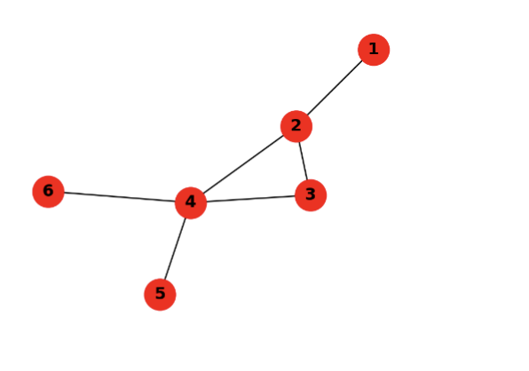
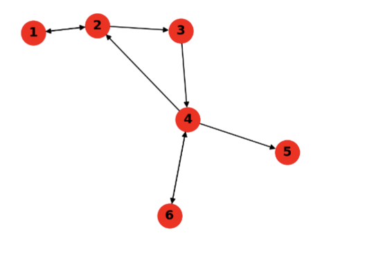
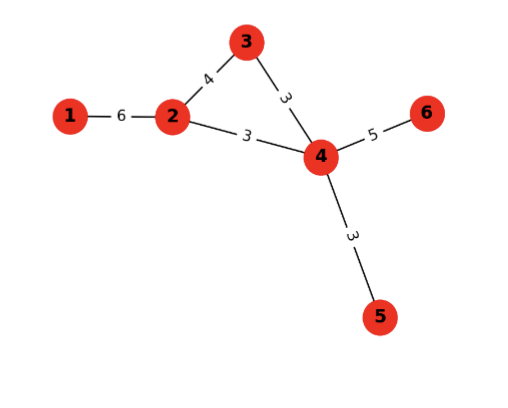
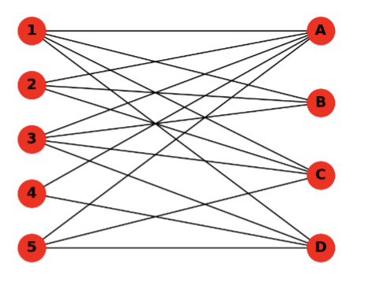
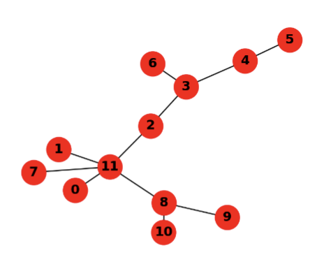
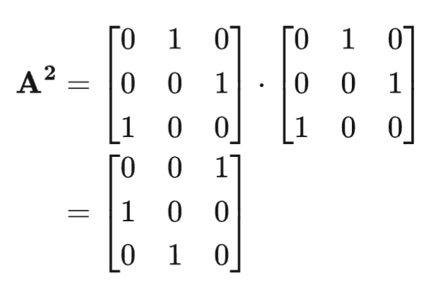

# Network Science

1. [Week 1 - Introduction](#week-1---introduction) 
2. [Week 2 - Network Elements ](#week-2---network-elements)
3. [Week 3 - Small World](#week-3---small-worlds)


# Week 1 - Introduction

## What is a Complex System? 

In a discussion, some students suggeted that a jet engine is a complex system. The lecturer said this could be true depending on the definition but for this module it is not a complex system. We would not want components jet engine to be a complex system because we wish a jet engine to be work exactly as planned everytime. With a complex system we can never fully understand then and know their outcomes as they are too complex. A complex system is not the same as complicated system for which a jet engine would be. A brain is an example of a complex system. It has a very large number of small components all working together in various ways. Emergence is a key theme in complex systems. 

Dynamics on network means things that happen on the network, i.e. firing. There is also the dynamics of a the network, i.e. how many neurons there are. 

---

<br>

# Week 2 - Network Elements 

Learning Outcomes:
* Learn the language of networks
* The components: nodes, links
* Types of networks and representations
* Features of nodes and links

We want to be able to talk about:
* properties to characterize structure & behavior of networks
* roles of networks in affecting processes occurring on network structures

---

#### Lecture 2: Contents 

* []()


<br>

---

## Formal Definitions 

A network or graph $G$ has two parts: a set of $N$ elements, called **nodes** or vertices, and a set of $L$ pairs of nodes, called links or **edges**. The link $(i, j)$ joins the nodes $i$ and $j$. Two nodes are adjacent or connected or neighbours if there is a link between them.
* this definition excludes temporal nets works as $i,j$ implies the edge exists at all times

A network can be **undirected or directed**. A directed network is also called a digraph (relevant for netx).
* In directed networks, links are called directed links and the order of the nodes in a link reflects the direction: the link $(i, j)$ goes from the source node $i$ to the target node $j$. 
* In undirected networks, all links are bi-directional and the order of the two nodes in a link does not matter.

A network can be unweighted or weighted. In a weighted network, links have
associated weights: the weighted link $(i,j,w)$ between nodes $i$ and $j$ has weight $w$. A network can be both directed and weighted, in which case it has directed weighted links.

---

## Python and NetworkX

### Undirected Networks

This might considered as the default form of networks. 

```
import networkx as nx

# Build network3
G = nx.Graph()4
G.add_node(1)5
G.add_nodes_from([2,3,…])6
G.add_edge(1,2)7
G.add_edges_from([(2,3),(2,4),…])

# Show nodes and edges10
print(G.nodes())11
print(G.edges())

# Show neighbours of node 114
print(G.neighbors(1))

# List edges17
for u,v in G.edges:18
print(u, v)
```



### Directed Networks

This is a more implicated network so it will naturally have more available functions to set up the network and explore it. We can check predecessors and sucessors as there is a distinct order now. Even in di-graph (directed network), some edges can still be constructed as bi-directional, though in a di-graph, this will be shown as a link with two arrows. A bi-directional edge is counted as 2. 

```
import networkx as nx
import matplotlib.pyplot as plt

D = nx.DiGraph()
D.add_edge(1,2)
D.add_edge(2,1)

D.add_edges_from([(2,3),(3,4),…])

print(D.number_of_nodes())
print(D.number_of_edges())

print(D.edges())
print(D.successors(2)) # iterators
D.predecessors(2)
D.neighbors(2)

# List successors of node 218
for s in D.successors(2):
```



### Weighted Network

```
W = nx.Graph()1
W.add_edge(1,2,weight=6)

W.add_weighted_edges_from([(4,5,3),(4,6,5),…])

W.edges()

W.edges(data='weight')

# Print edges with weight > 3
for (u,v,d) in W.edges(data='weight'):
    if d>3:
        print('(%d, %d, %d)’%(u,v,d))

# Draw the directed graph with weights
plt.figure(figsize=(4, 3))
pos = nx.spring_layout(W) # Spring layout
nx.draw(W, pos,
    with_labels=True,
```



---

## Biparite Networks

In a bipartite network, there are two groups of nodes such that links only connect nodes from different groups and not nodes from the same group. This could be though of at product::input relationships, i.e. songs and artists, product and customers, classes and students. 



--- 

## Tree Network 

A tree network is a special class of undirected, connected network such that the deletion of any one link will disconnect the network into two components. The number of links in a tree is $L = N - 1$, where N is the nodes. 

Examples of tree networks include phylogenetic trees, water distribution or power grids, broadcasting networks, food webs



**What is the sparestest type of network?** Technically a straight line but in terms of a true network, a tree. This is ebcause each time you add a new node, you add one more possible edge, this is why Links/Edges = $N-1$. There cannot exist a network with less edges than $N-1$, removing any link in a tree would result in a disconnected components. 

**Why do we care about components and disconnects?** This is linked to redunancy, reliliance and robustness measures. We test these by attacking the network. Interconnectness and Density is a big factor in how these attacks are handled, and/or spread. A high density network means more redundancy, which means it will be more resiliant to attack/changes. 

<br>

---

## Density and Sparsity

### Undirected Networks

For an undirected network of size $N$ (nodes) with $L$ links:

This is the formula for the maximum number of links ($L_{max}$) in a network with $N$ nodes, provided in LaTeX:

$$L_{max} = \binom{N}{2} = \frac{N(N-1)}{2}$$

* $L_{max}$: The maximum possible number of links (edges) in a simple undirected network.

* $\binom{N}{2}$: The binomial coefficient "N choose 2," representing the number of ways to pick a pair of nodes to connect. Given N, how many pairs (2) can you make?

* $N(N-1)/2$: The algebraic expansion. Since each of the $N$ nodes can connect to $N-1$ other nodes, you multiply them; you then divide by 2 because a link between node A and B is the same as the link between B and A.


This notion, $\binom{total}{groups}$ could have anything on the bottom. If you wanted to find make number of triangles within the nodes you would put a 3:

$$\binom{N}{3} = \frac{N(N-1)(N-2)}{3 \times 2 \times 1}$$

And the true form is actually a factorial but it simplies down to what we see above: 

$$\binom{N}{3} = \frac{N!}{3!(N-3)!}$$

$$\frac{N \times (N-1) \times (N-2) \times \color{red}{(N-3) \times (N-4) \dots \times 1}}{(3 \times 2 \times 1) \times \color{red}{(N-3) \times (N-4) \dots \times 1}}$$

The formula cancels out and effectivly flips the fraction so that the simple bit is on the denominiator. 

Now that we have the maximum possible number of links we can use it calculate the density $d$ which is given by: $\frac{L}{L_max} = \frac{2L}{N(N-1)}$. We say a network is space is $d << 1$$.

$<<$ means much less than. Scientists use >> when a simple inequality doesn't tell the whole story.

---

### Directed Networks

In a directed network, the logic of "N choose 2" changes because the direction of the connection creates a unique relationship. In an undirected network, we divide by 2 because $A \to B$ and $B \to A$ are the exact same link. In a directed network, they are considered two distinct links. 

For the first node: You have $N$ choices. For the second node: You have $N - 1$ choices (since a node usually doesn't link to itself). Therefore the maximum links for Directed Networks is:

$$L_{max} = N(N - 1)$$

Because direction matters, we don't "collapse" the pairs. You can have a link from $A \to B$ AND a separate link from $B \to A$.


| Feature | Undirected (Lmax​) | Directed (Lmax​) |
| :--- | :--- | :--- |
| Formula | 2N(N−1)​ | N(N−1) |
| Logic | Pairs of nodes | Ordered pairs (Source → Target) |
| Example (3 nodes) | 3 possible links | 6 possible links | 

---

## Example Network: Facebook

$N \approx 10^9$; $L \approx 10^3 * N$

This also means the average degree $\langle k \rangle$ is approx 1,000 (or $10^3$). Strictly speaking, if we start with the average degrees formula $\langle k \rangle = \frac{2L}{N}$, sub in our total links $\langle k \rangle = \frac{2 \times (10^3 \times N)}{N}$, and then factorise $\langle k \rangle = 2 \times 10^3 = 2,000$. We will then tend to drop the constant because the squared order of magniute swamps out the $2$.


Using the previous formula, $L_{max} = \frac{N(N-1)}{2}$. For a network as huge as Facebook ($N \approx 10^9$), $N-1$ is basically just $N$. So, scientists often approximate the maximum links as $L_{max} \approx \frac{N^2}{2}$.

The density formula is $d = \frac{L}{L_{max}}$. Plugging in we get $d \approx \frac{10^3 \times N}{N^2}$, we cancel out the N's leaving you with $10^3/N$. With $N = 10^9$, the density is $10^{-6}$.

This extremely low density ($0.000001$) tells you that Facebook is a sparse network. Even though there are trillions of links, it is nearly empty compared to its maximum capacity because most people are only connected to a tiny fraction of the total population.

Most (but not all) real-world networks are similarly sparse because the number of
links scales proportionally to , whereas the maximum scales with 

---

## Subnetworks

A subnetwork is a network obtained by selecting a subset of the nodes and all of the links among these nodes. A complete subnetwork is called a clique, where complete means each node connected to all othernodes. We look as subnetworks because we are interested to see details in certain areas of networks.

```S = nx.subgraph(G, node_list)```

---

## Degree

The degree of a node is its number of links, or neighbours. The degree of node $i$ is typically denoted by $k_i$. A node without any neighbours is called a singleton ($k=0$)

```
G.degree(2) # retunrd the degree of node 2
G.degree() # dict with the degree of all nodes
```

For directed networks, we have:
* in-degree of a node = number incoming links $k_{i}^{in}$
* out-degree of a node = number incoming links $k_{i}^{out}$

The "total degree" is the sum of both in and out degrees

```
D.in_degree(4)
D.out_degree(4)
D.degree(4) # total degree
```

---

## Average Degree

The average degree of a (undirected network) is $\langle k \rangle = \frac{\sum_{i} k_{i}}{N}$. This tells you the average number of edges a network's node has. 

There is a formulatic connection for undirected networks between network size $N$, number of links $L$, density $d$ and average degree $\langle k \rangle$. 

$$\langle k \rangle = \frac{2L}{N} = \frac{dN(N-1)}{N} = d(N-1)$$

This tells us that Density ($d$) is essentially the probability that any two nodes are connected. If you know the density and the number of nodes, you can immediately find the average degree. In large social networks like Facebook, $N$ is so massive that $d$ becomes incredibly small, even if $\langle k \rangle$ is high.

While the "Average Degree" tells you the typical connectivity, it doesn't tell you if the network has "hubs." For that, we use $\kappa$ (Kappa). The Heterogeneity Parameter ($\kappa$): $$\kappa = \frac{\langle k^2 \rangle}{\langle k \rangle^2}$$

---

## Excess Degrees

The excess degree of a node $k$ with degree is $k-1$. It represents the number of edges connected to that node excluding the edge that was used to reach it.

We can then define the mean excess degree of a network, which is the average number of connections a randomly chosen neighbour of a node has excluding the link to the starting node. This concept is important when considering spreading on a network (e.g., in epidemiology). The famous Friendship paradox (not to be confused with the Friendship theorem!) is closely related to that.

---

## Strength

In a weighed undirected network, the strength of a node $s_{i} = \sum_{j} w_{ij}$. This is also known as weighted between. In weighted networks, this is the total "weight" of all connections attached to that specific node. While the degree formula ($\langle k \rangle = \frac{\sum k_i}{N}$) counts the number of links, the strength formula accounts for how important or heavy those links are. 

In an unweighted network, every link weight $w_{ij}$ is simply 1. In that specific case, the strength of a node becomes identical to its degree. 

We use degrees for unweighted networks but will tend to use strength for weighted degree because this gives us additional information on the context and importance of nodes. 

In a weighted and directed network, we have:
* **in-strength:** $s_{i}^{in} = \sum_j w_{ji}$
* **out-strength:** $s_{i}^{out} = \sum_j w_{ji}$

---

## Simplifying Assumptions

There are some rules that we apply to networks for simplification purposes:
* Single-layer networks with a single type of nodes and a single type of link (unless using a temporal structure).
* There are no self-loops. A node cannot connect to itself.
* There can only be a single link between nodes (or two for directed networks). 

---

## Network Representations

Adjacency Matrix: $N × N$ matrix where each element $a_{ij} = 1$ if $i$ and $j$ are adjacent, otherwise $0$. The diagonal elements ($a_{ii}$) will always be zero because of the no self-loops rule. 

In an undirected network, this matrix will be symmetric on either side of the diagonal: $a_{ij} = a_{ji}$

```
print(nx.adjacency_matrix(G).toarray())
print(G[4])
G[3][4]['color']='blue'
print(G[4])
```

In an undirected network, the degree for a node can be calculated by summing the matrix accross the relevant row or column:

$$k_{i} = \sum_{j} a_{ij} = \sum_{j} a_{ji}$$

This does not work exactly the same for a directed network because the matrix is not symmetric meaning the rows and columns do not mean the same thing. Here the rows hold a nodes out-degree and the columsn hold the in-degree. 

$$k_{i}^{out} = \sum_{j} a_{ij}$$

$$k_{i}^{in} = \sum_{j} a_{ji}$$

In weighted networks, element $w_ij$
represents the weight of the link between $i$ and $j$. It is $0$ if there is no link.

If undirected, the strength is obtained by summing adjacency matrix elemetns across the rows or columns. But if directed, the in/out strength is obtained by summing adjacency matrix elements across columns/rows.

```
W.degree(4, weight='weight') # strength
```

However, it should be noted that matrices are poor respresenations for networds because networds are sparse, meaning a lot of the space in the matrix will be empty but the memory will be allocated. The best repsresentation will be an edge list/dictionary. 

**If a matrix is not efficent then why use them?** Becuase it allows us to use linear algebra for the maths. 

---

## Adjacency List

While an adjacency matrix is a grid of 0s and 1s, an adjacency list is a more compact "address book" for a network. Instead of a giant table showing every possible connection (even the ones that don't exist), you only list the connections that actually are there.

In an adjacency list, every node $i$ has its own list that contains the names (or indices) of its neighbors. 

For Undirected Networks: If there is a link between $A$ and $B$, $B$ appears in $A$'s list, and $A$ appears in $B$'s list. This is the exact reason we divide the max links for undirected networks by two because we don't want to count the link from A to B as being different from B to A: ($L_{max} = \frac{N(N-1)}{2}$). 

For Directed Networks: If $A \to B$, then $B$ appears in $A$'s list (the "out-list"), but $A$ does not appear in $B$'s list unless there is a separate link $B \to A$

In the Facebook example, the network is sparse ($d \approx 10^{-6}$). A matrix for 1 billion users would require $10^{18}$ cells (a quintillion!), mostly filled with zeros. This is impossible for most computers to store. An adjacency list only stores the actual links ($L$). Since the average person only has $10^3$ friends, the computer only has to store $10^9$ lists with about 1,000 entries each. This is much more efficient. 

```
for line in nx.generate_adjlist(G):
    print(line)

nx.write_adjlist(G, "netfile.adjlist")
G2 = nx.read_adjlist("netfile.adjlist") 
```

```
1 2
2 1 3
3 4
4 2 5 7
5 8
6 5
7 4
8
10 9
9
```

This output is to be interpetted as:

```
{
    1: [2],
    2: [1,3],
    3: [4],
    ...
}
```

Meaning each key entry in the adj list is a node, and the numbers to the right are the out-bound connections, from that node. If there are no out bound connections then the node entry will still exist but there will be not numbers to the right of it. 

---

## Edge List 

An edge list is the simplest and most common way to store network data. While an adjacency list organizes connections by node, an edge list is just a two-column (or three-column) list where each row represents a single link $(node_1, node_2)$. In a weighted matrix the weight is also included $(node_1, node_2, weight)$.

For an undirected network, you do not write the bi-directional entries twice. If $1 \to 2$ there will be an edge list entry but this won't exist for $2 /to 1$. 

```
for edge in nx.generate_edgelist(W, data=["weight"]):
    print(edge)

nx.write_edgelist(G, "netfile.edgelist")
G2 = nx.read_edgelist("netfile.edgelist")

nx.write_weighted_edgelist(W, "wf.edges") 
W2 = nx.read_weighted_edgelist("wf.edges")
```

---

## Adjanency Matrices and Matrix Multiplication

The intuition behind multiplying an adjacency matrix by itself is that it reveals connectivity over multiple steps within the netowrk. 

While the base adjacency matrix $\mathbf{A}$ tells you who is directly connected (1 step), $\mathbf{A}^2$ tells you about paths that are exactly 2 steps long.

When you perform matrix multiplication $\mathbf{A}^2 = \mathbf{A} \cdot \mathbf{A}$, the value at index $(i, j)$ in the resulting matrix represents the number of paths of length 2 from node $i$ to node $j$.
* $\mathbf{A}^1$: Tells you if you can go from $i \to j$ in 1 step.
* $\mathbf{A}^2$: Tells you how many ways you can go from $i \to k \to j$ in 2 steps.
* $\mathbf{A}^3$: Tells you how many ways you can go from $i \to k \to m \to j$ in 3 steps.


Let take an example where the network is: $X \to Y \to Z \to X$:

The First Matrix ($\mathbf{A}$) captures the direct link relationships: $X \to Y$ is 1, $Y \to Z$ is 1, $Z \to X$ is 1. All other values in the matrix are 0 because you can't get anywhere else in exactly one jump. $Y \to X$ is 0 for example. 

With the Squared Matrix ($\mathbf{A}^2$) the 1's have shifted. The first row represents $X$. Originally, it only had a $1$ in the middle column which was its connectioned to $Y$. Now, the $1$ has shifted to the end column. This means there is example 1 path of length 2 from $X$ to $Z$ ($X \to Y \to Z$). You cannot get from $X$ back to $X$ in 2 steps, so the diagonal is 0.




This calculation and the intution is the backbone behind many other concepts in network science. 

**Robustness:** If you multiply $\mathbf{A}$ by itself many times and the matrix is still full of zeros, it means the network is not well-connected (it has a small $S$). In a well-connected network, each step should open up more routes to get to same place. Think about travelling through London and how many individual routes you could take to a destination if you really wished. 

**Betweeness as a Centrality Measure**: This is covered later in the module but we often wish to be able to measure centrality, which is a concept related to hubs. Betweenness looks at shortest-paths which pass through a node. To find those paths effectivly we can use matrix mutliplication to traverse a network and we can track indices of interested to see if they are passed through. 

**Clustering:** Recall "N choose 3" ($\binom{N}{3}$) for triangles. A triangle is just a path of length 2 ($i \to j \to k$) that has a third link closing the loop ($k \to i$). We find these by looking at the diagonal of $\mathbf{A}^3$.

**Small World Effect:** If a network is "dense" enough ($d \approx \langle k \rangle / N$), you will find that $\mathbf{A}^n$ fills up with non-zero numbers very quickly, meaning everyone is connected by a short path.

| Matrix | Intuition | Application |
| :--- | :--- | :--- |
| $A$ | Direct neighbors | Degree ($k_i$​), Strength ($s_i$​) |
| $A_2$ | Friends-of-friends | Clustering, Indirect links |
| $A_n$ | Long-distance paths | Network diameter, Robustness |

#### How Hubs Impact Adjacency Matrices?

When you add a hub, the row and column for H will be full of ones. This in turn will hugely impact the result for $\mathbf{A}^2$. In the examples before, $\mathbf{A}^2$ largely just results in the 1's being shifted around the matrix. Nodes that weren't able directly directly accessed in 1 step are opened up with 2 steps. However, with the introduction of a hub, the numbers in $\mathbf{A}^2$ will become larger than 1. 

If there is a path from $X \to H \to Z$ AND a path $X \to Y \to Z$, the entry for $(X, Z)$ in $\mathbf{A}^2$ will be 2.

This is important because the more paths of length 2 between nodes, the more "redundant" and robust the network becomes.

#### "Cliquiness" and the Diagonal

To find if a network is "cliquey" (high clustering), we look at the diagonal of the matrix powers. The diagonal represents paths that start and end at the same node. 

For $\mathbf{A}^2$ in a simple directed network without "self-loops," the diagonal is usually 0 because you can't go $i \to j \to i$ unless it's a mutual connection.

However, with $\mathbf{A}^3$, the diagonal is the "Triangle Detector". If the entry at $(X, X)$ in $\mathbf{A}^3$ is 1, it means there is a path $X \to Y \to Z \to X$. By summing the diagonal of $\mathbf{A}^3$ (called the Trace), scientists count the total number of triangles in the network.

---

<br>
<br>
<br>


# Week 3 - Small Worlds

**||** [Recording](https://sussex.cloud.panopto.eu/Panopto/Pages/Viewer.aspx?id=c9b0c637-df69-41ee-a755-b3ef00b54cbd) **||**

This week correlates to the **second chapter** (small worlds) of the textbook and we will be thinking about the structure of networks, as well as, important concepts. 

Lecture Outline:

* **Birds of a feather**; things that are similar tend to group. 
* **Paths and distances**; understand but also quantify in order to look into things like spread. Also important for optimization tasks. 
* **Connectedness and components**
* **Finding shortest paths**
* **Social distance**
* **Six degrees of separation**
* **Friend of a friend**

---

#### Lecture 2: Contents 

* []()

---

## Birds of a Feather

In network science, "Birds of a Feather" usually refers to two distinct but related concepts: Homophily (similarity of node attributes) and Clustering (structural density). The principle that "similar things tend to group together" is a defining feature of real-world networks.

Similar things tend to group together; like minded people, similar poeple etc. We wont go into quantifying this yet, this is covered in a later lecture. 

Homophily is the tendency of nodes to connect to others with similar attributes (e.g., interests, demographics, or "like-mindedness"). A common quantitative approach is calculating the probability that a node connects to a node of the same "type" versus a different type. This is computationally cheaper than path-based metrics because it only requires looking at a node’s immediate neighbors (its degree) rather than the entire network map.

Path based measures look at the distance between nodes. How many steps does it take to get from one to another. However, this is often a global approach and comutationally expensive. Additionally, there are often several ways to get from Node A to Node B, we are only interested in the shortest path possible generally. Although, this opens up the additional problem of comparing options. In a large enough network, if the problem is uncontrainsed, a path from A to B is infinite. 

The focus needs to be on the density of connections to the "same" type. As we will see througout the module, "same" can mean a number of different things. If we just consisder the probability that a node connects to the same "same", or not, then we dont need to consider path length and physical distances. This is also a local computation, you just need to look at a nodes connections/neighbours, not the travse the whole network looking for a route. Recall, that in Networks, we call the number of connections a of a node is called the "Degree". 

In the previous week(s), we looked at the Friendship Paradox and "Friends of Friends". This notion of connectivity is called clustering, or at least it forms the basis of clustering and the clustering coefficent which measures how "cliquey" the local neighborhood is. The quantantive way to approach clustering is to count the triangles $\binom{N}{3}$ in the network, or areas of a network, i.e. around a given node. That being said, it shoul be noted that these structures do not equal identity. Clustering only tells you that people are connected in groups. It doesn't tell you why. Homophily (the "Birds of a Feather" concept) is the actual measure of similarity—like-minded people grouping together.

| Concept | Method | Requirement |
| :--- | :--- | :--- |
| Clustering | Counting triangles / $\mathbf{A}^3$ diagonal | Only the Links ($L$) |
| Homophily | Probability of "same-type" connection | Node Attributes (Metadata) |

---

## Assortativity

[Mixing patterns in networks](https://journals.aps.org/pre/abstract/10.1103/PhysRevE.67.026126)
* This is a foundation paper in network science

In network science, assortativity (or assortative mixing) is a preference for a network's nodes to attach to others that are similar in some way.

Assortativity (or assortative mixing) describes the preference for nodes to attach to others that are similar in some way. This similarity can be structural (degree) or attribute-based (homophily).

There are two possible mechanisms by which assortativity emerges naturally: 
* Selection (Homophily): similar nodes become connected
* Influence (Social Contagion): connected nodes become more similar.

**Selection or Homophily:** You like people who are like yourself. Neurons that have similar reactions to the same input. Human cells die so need several that know and do the same thing. Similar nodes become connected and "word" together. In social sciences this is very common topic, think about social media and echo chambers. Homopily causes echo chambers and radicalness as bias reinforced. 

**Influence:** This can also be a way that connectivity occurs. There is something that pulls you into a network/cluster. "You become who you hang out with." In this mechanism, the connection exists before the similarity develops. Change, and attributes, changing based on the "physical" neighbors.

---

## Degree Assortativity

This is a very common topic in Network Science, also known as degree correlation. Degree Assortativity means that nodes group with people that have similar degrees. 

Assortative networks have a core-periphery structure with hubs in the core, e.g. social networks. In an assortative network, nodes do group with nodes that have similar degrees. High-degree nodes (hubs) tend to connect to other high-degree nodes, while low-degree nodes connect to other low-degree nodes. This creates a "dense core" of highly connected individuals.


Disassortative networks have hub-and-spoke (or star) structure, e.g.  Web, Internet, food webs, bio networks. In a disassortative network, nodes do not group with nodes of similar degrees. High-degree nodes tend to connect to low-degree nodes. 


---

## Calcualting Assortativity

By comparing a node's own degree to the average degree of the nodes it hangs out with, we can see if "hubs connect to hubs" (assortative) or "hubs connect to spokes" (disassortative).

#### 1. Average Nearest-Neighbor Degree for a specific node $i$

This formula calculates the average degree of all nodes directly connected to node $i$. You are adding up the degrees of all your friends and dividing by the number of friends you have.

$$k_{nn}(i) = \frac{1}{k_i} \sum_{j} a_{ij}k_j$$

* $k_i$: The degree of node $i$ (how many neighbors it has).
* $a_{ij}$: The adjacency matrix entry. It acts as a "filter" that only includes nodes $j$ that are actually connected to $i$.
* $k_j$: The degree of neighbor $j$.

#### 2. Average Nearest-Neighbor Degree for all nodes with degree $k$

This formula aggregates the values from above to see the general trend for all nodes of a certain "rank" or degree. 

$$\langle k_{nn}(k) \rangle = \langle k_{nn}(i) \rangle_{i:k(i)=k}$$

* $\langle \dots \rangle$: This bracket notation always means "Average".
* $k_{nn}(k)$: This is the Average Nearest-Neighbor Degree for all nodes that have a degree of exactly $k$.
* $i:k(i)=k$: This is the "filter". It says: "Only look at nodes ($i$) where their degree ($k(i)$) is equal to $k$".

#### 3. How this identifies Assortativity

Scientists plot $\langle k_{nn}(k) \rangle$ against $k$ to see the relationship:
* Assortative ($r > 0$): If the graph increases, it means high-degree nodes connect to other high-degree nodes.
* Disassortative ($r < 0$): If the graph decreases, it means high-degree nodes (hubs) are connected to low-degree nodes (spokes).

This part of the process is essentially looking for a trendline on a scatter plot. Once you have calculated $\langle k_{nn}(k) \rangle$ for every possible degree $k$ in your network, you plot them to see the "social behavior" of the hubs versus the spokes.

Scientists use the Degree Correlation Function, which is a plot where:
* The x-axis ($k$): Represents the degree of a node.
* The y-axis ($\langle k_{nn}(k) \rangle$): Represents the average degree of that node's neighbors.

---

#### Python Implementation

```
import scipy.stats

knn_dict = nx.average_degree_connectivity(G)
k, knn = list(knn_dict.keys()), list(knn_dict.values ())
r, p_value = scipy.stats.pearsonr(k, knn)
```

* `nx.average_degree_connectivity(G)`: This single function performs the heavy lifting of your formulas. It calculates $k_{nn}(i)$ for every node and then groups them to find $\langle k_{nn}(k) \rangle$ for every degree $k$.
* `list(knn_dict.keys())`: These are your $k$ values (the independent variable on your x-axis).
* `list(knn_dict.values())`: These are your $\langle k_{nn}(k) \rangle$ values (the average neighbor degrees on your y-axis).
* `scipy.stats.pearsonr(k, knn)`: This calculates the Assortativity Coefficient ($r$). It measures the strength and direction of the linear relationship between a node's degree and its neighbors' average degree.

---

#### NetworkX Different Approaches

There are different ways to measure Assortativity depending on what attribute you are using to define "similarity" between nodes. It could be on labels, numbers or the structure of the network itself. 

---

#### Categorical Attribute Assortativity

`nx.attribute_assortativity_coefficient(G, category)`

This approach is used when your nodes have labels or discrete categories. It measures the probability that a node connects to another node in the same group versus a different group. If people in a social network mostly connect with others of the same gender, the coefficient will be close to 1. This is the most direct measure of Homophily (Selection). It answers: "Are people sticking to their own kind?"

---

#### Numerical Attribute Assortativity 

`nx.numeric_assortativity_coefficient(G, quantity)`

This is used for continuous values or ordered numbers. It calculates the correlation between the numerical values of connected nodes. Unlike categories (where you are either "in" or "out"), this accounts for how close the numbers are. If 20-year-olds connect with 21-year-olds, the "similarity" is high. If 20-year-olds only connect with 80-year-olds, the assortativity would be negative. It answers: "Is there a linear relationship between the 'score' of one node and its neighbor?".

---

#### Degree Assortativity 

`nx.degree_assortativity_coefficient(G)`

This is a structural measure that ignores external metadata and looks only at the network's links. It calculates the Pearson correlation between the degrees ($k$) of adjacent nodes. In an assortative social network, hubs ($k=1000$) connect to other hubs ($k=800$). In a disassortative tech network, hubs connect to spokes ($k=1$). This is what the previous $k_{nn}$ formulas were exploring. It answers: "Do popular nodes hang out with other popular nodes?".


---
| Approach | Attribute Type | Key Question |
| :--- | :--- | :--- |
| Categorical | "Labels (Gender, Race, Job)" | Do nodes pick the same group? |
| Numerical | "Numbers (Age, Income, Height)" | Do nodes pick similar values? |
| Degree | "Structure (ki​,kj​)" | Do hubs pick hubs? |
---

<br>
<br>

Note, these functions give a single "summary number" ($r$) where as `nx.average_degree_connectivity(G)` gives you the raw data points needed to see the full relationship across the whole network. 

This function calculates the Average Nearest-Neighbor Degree for every degree $k$ found in the network. It returns a dictionary where: 
* The Key ($k$): Is the degree of a node. 
* The Value ($\langle k_{nn}(k) \rangle$): Is the average degree of all nodes connected to nodes of degree $k$.

It is the direct implementation of the formula:

$$\langle k_{nn}(k) \rangle = \frac{1}{N_k} \sum_{i:k_i=k} k_{nn}(i)$$

The three coefficients (assort_a, assort_n, and r) give you a final verdict: "The network is assortative".
`nx.average_degree_connectivity(G)` is used when you want to visualize the trend.
* Coefficients: Best for a quick summary or comparison between different networks.
* Average Degree Connectivity: Best for plotting a degree correlation function. It allows you to see if the relationship is linear or if only specific hubs behave strangely.

---

## Paths: definitions

**Path:** sequence of links traversed to go from a source to a target node. Directed networkds must be traversed according to their directions. There may not be a path between two nodes (directed). 

**Cycle:** path where source and target node are the same. i.e. a loop. 

**Simple path:** no traversing the same link more than once. This module deals only with simple paths.

**Path length:** number of links in path. 

---

## Shortest Path

This is the minimum length path between two nodes. There may be more than one, we just want the shortest. In a weighted network, the weight may mean distances. 

---

## APL and Diameter

In network science, the longest shortest path is formally known as the Diameter of the network. While it sounds like a contradiction, the term describes the maximum distance you would ever have to travel between any two nodes using the most efficient route available. 

Between any two nodes (A and B), there might be many ways to travel. The shortest path is the route with the fewest possible links. You calculate the shortest path for every possible pair of nodes in the entire network. The largest of all those values is your Diameter. Given any 2 nodes, this is the longest path you can take in the network. 

In Network Science, we generally need to constrain our task to look at shortest paths. Without this, we could just make arbitarily long routes that take pointless de-tours. 

$$\ell_{\max} = \max_{i, j} \ell_{ij}$$

The average path length (APL) is the average of the shortest path lengths across all pairs of nodes

**Undirected:**
For undirected networks, you divide by the total number of possible pairs $\binom{N}{2}$.

$$\langle \ell \rangle = \frac{\sum_{i,j} \ell_{ij}}{\binom{N}{2}} = \frac{2 \sum_{i,j} \ell_{ij}}{N(N-1)}$$

* Numerator: The sum of all shortest path distances ($\ell_{ij}$) between every pair of nodes.
* Denominator: $N(N-1)/2$ is the total number of unique pairs in an undirected network. We multiply the sum by 2 to account for the $1/2$ in the denominator.

**Directed:** 
For directed networks, the direction of the link matters, so you divide by the total number of ordered pairs.

$$\langle \ell \rangle = \frac{\sum_{i,j} \ell_{ij}}{N(N-1)}$$

$N(N-1)$: This represents the total number of directed pairs (where $A \to B$ is counted separately from $B \to A$).

---

## Undefined Path

The biggest issue here is if there is an undefined path. Netx will highlight this as a dissconected network, this risks excluding all connected elements. The solution is to do the harmonic mean.

In standard arithmetic average formulas, like the ones in your other slides, an "undefined" path (where nodes $i$ and $j$ are not connected) is treated as having a distance of infinity ($\infty$). If you try to sum infinity into an average, the entire result becomes infinity, which doesn't tell you anything useful about the network's structure.

The formula you’ve shared (the harmonic mean of path lengths) is the key to calculating distances in networks that are disconnected.

$$\langle \ell \rangle = \left( \frac{\sum_{i,j} \frac{1}{\ell_{ij}}}{\binom{N}{2}} \right)^{-1}$$

* $\langle \ell \rangle$: The average path length (specifically the harmonic mean).
* $\ell_{ij}$: The shortest path distance between node $i$ and node $j$.
* $\frac{1}{\ell_{ij}}$: The reciprocal of the distance. If a path is undefined ($\ell_{ij} = \infty$), this value becomes 0, preventing the total average from becoming infinite.
* $\sum_{i,j}$: The sum over all pairs of nodes $i$ and $j$.$\binom{N}{2}$: The total number of possible pairs in the network.
* $(\dots)^{-1}$: After averaging the reciprocals, you flip the fraction back to return the result to the scale of "steps" or "links".

In this formula, you are not summing the distances ($\ell_{ij}$) directly. Instead, you are summing their reciprocals: $\frac{1}{\ell_{ij}}$. If a path is defined: A distance of 2 becomes $1/2$, a distance of 10 becomes $1/10$, etc. If a path is undefined: The distance is $\infty$. The reciprocal of infinity is zero ($\frac{1}{\infty} = 0$). Because undefined paths turn into zeros in this calculation, they simply drop out of the summation without "breaking" the math. The formula effectively counts the pairs that are connected and ignores the ones that aren't. The resulting $\langle \ell \rangle$ gives you a finite, meaningful number that represents the "efficiency" of communication across the reachable parts of the network.

Note, that this formula allows us to do calculation on networks which are not complete, i.e. there isn't a connection between every node. But it also allows for use to calculate when there is an entire break in a network, where it may be broken down into seperate components but we consider it to be the "same" network. 

We use this formula when the network is disconnected (composed of two or more separate "islands" of nodes). It treats the "infinite" distance between these islands as zero in the summation, allowing us to measure the efficiency of the parts that are reachable.

Note, that another route to handling undefined, or disconnected sub-nets, is to just measure the APL and Diameter of the largest component. However, this is a topic for later so we don't loook at it here. 


Below are various path related functions in NetworkX:

```
nx.has_path(G, 'a', 'c')
nx.has_path(G, 'a', 'b')
nx.shortest_path(G, 'a', 'b')
nx.shortest_path_length(G,'a','b')
nx.shortest_path(G, 'a') # dictionary
nx.shortest_path_length(G, 'a') # dictionary
nx.shortest_path(G) # all pairs
nx.shortest_path_length(G) # all pairs
nx.average_shortest_path_length(G) # error
G.remove_node('c') # make G connected
nx.average_shortest_path_length(G) # now okay


nx.has_path(D, 'b', 'a')
nx.has_path(D, 'a', 'b')
nx.shortest_path(D, 'a', 'b')

nx.shortest_path_length(W, 'a', 'b')
nx.shortest_path_length(W, 'a', 'b', 'weight')
```

---

## Connectedness and Components

A network is connected with there is a path between any two nodes. These don't need to be 1 step apart, there just needs to be an availble route through the network. If a network is not connected it is disconnected but will have mutliple components which are connected. 

A connected component is a connected subnetwork. The largest one is called giant component, it often includes a substantial portion of the network. A singleton is the smallest-possible connected component. 

A directed network can be strongly connected or weakly connected if there is a path between any two nodes, respecting or disregarding the link directions, respectively. 
* Strongly Connected: You must follow the arrows. To get from node $A$ to node $B$, there must be a sequence of directed links ($A \to \dots \to B$). To be a strongly connected network, every node must be able to reach every other node while respecting these one-way streets. For two nodes to be strongly connected, you need a path that goes $i \to j$ and a path that comes back $j \to i$. In the simplest possible loop involving three nodes, this forms a directed triangle (a 3-cycle).
* Weakly Connected: You are allowed to "disregard" the direction of the arrows. This means you treat the directed links as if they were simple, undirected edges. If you can get from $A$ to $B$ by traveling "the wrong way" down a one-way street, the nodes are weakly connected.

If a directed network is not strongly connected, many node pairs will have a shortest path $\ell_{ij} = \infty$ because you simply can't "get there from here" following the arrows. This is why we measure Diameter or APL using the harmonic mean or Largest Connected Component. It's very common for directed networks (like the Web or Twitter) to have many nodes that are weakly connected but cannot reach each other "strongly".

Strongly connected components are often made up of many overlapping directed triangles. In Week 2 we looked at using Linear Algebra/Matrix Mutliplication as a triangle detector by looking at the diagonal in the $A^3$. If a directed network has many triangles (high clustering), it is much more likely to have a large Strongly Connected Component because there are many redundant "return paths". This is particularly relevant to the small worlds concept. 

A weakly connected network is a "feed-forward" loop. You can get to $k$ easily, but once you are at $k$, you are stuck. There is no way back to $i$. This is weakly connected. 

A strongly connected network represents a "feedback" loop. No matter where you are, you can reach everyone else. This is strongly connected.

---

## In/Out Components

The in-component of a strongly connected component $S$ is the set of nodes from
which one can reach $S$, but that cannot be reached from $S$

The out-component of a strongly connected component $S$ is the set of nodes that can be reached from $S$, but from which one cannot reach $S$

A Strongly Connected Component (SCC) covers both of these, i.e. you can get to and from a node. Disconnected nodes have no path to or from the SCC at all.

---

## Trees

* A tree is a connected network without cycles
* A tree is a connected network with N -1 links
* In a tree there is a single path between any two nodes
* Trees are hierarchical: you can pick a node as the root . Each node is connected to a parent node (toward the root) and to one or more children nodes (away from the root).  The root has no parent. The leaves have no children

---

# Finding Shortest Paths

Whether you are calculating the Average Path Length ($\langle \ell \rangle$), the Diameter ($\ell_{\max}$), or checking for Strong/Weak Connectivity, you need a way to actually find those shortest paths.

The main algorithm used to find shortest paths is called breadth-first search. It looks like a tree in structure but it is not as it has cycles.

Think of BFS like dropping a stone into a still pond. The stone hits a single node. The "ripples" expand outward one layer at a time. You must visit every node at distance 1 before you are allowed to look at anyone at distance 2. Because you explore layer-by-layer, the first time you encounter a node, you are guaranteed to have found the absolute shortest path to it. 

You can start from any node and treat it as the root. This allows you to form the network to work out the shortest roots from any node. 

In BFS, Layer 1 contains every node exactly 1 step away. Layer 2 contains every node exactly 2 steps away.

BFS is efficient at finding the shortest path because it never has to "re-visit" a node to see if there's a better route. Once a node is labeled with a distance, that is guaranteed to be its minimum. The "slowness" ($O(N^2)$) comes only from the fact that you have to repeat this entire process for every single node to get the full network APL.

It feels like brute force because, in a way, it is! You are systematically checking every neighbor. However, BFS is considered "efficient" compared to a true random brute force because it never explores the same path twice and never looks deeper than it needs to. BFS keeps a list of nodes it has already visited. If another route tries to go to that same node later, the algorithm says, "Stop, I've already been here via a shorter or equal path". This prevents the algorithm from going in circles or re-calculating the same distances over and over.

To find the Average Path Length, you have to run this BFS "ripple" starting from every single node in the network. If there are $N$ nodes, you run BFS $N$ times. That is where the $O(N^2)$ (or more accurately $O(N(N+L))$) comes from.

The Cost of a Single BFS is $O(N+L)$. You start from a node, and traverse every link it has to find the nodes one step away. Then from each new node, you traverse every link it has. There is a lookup table of recorded nodes so if a link heads back to a node, you don't go there, i.e. the next step you are just at new nodes. You repeat the searching steps again. At the final step, you have exhausted all nodes and links. You have visted every node once and traversed every link once, hence, $O(N+L)$. 

However, a single BFS only tells you the distance from one specific node to everyone else. To calculate metrics like the Average Path Length ($\langle \ell \rangle$) or the Diameter ($\ell_{\max}$), you need the distance between every possible pair of nodes. Therefore, you have to repeat the algo for every node in the network ($N$ times). Resulting in $O(N(N+L))$.

If the network is sparse (like a Tree where $L \approx N$), this looks like $O(N \times 2N)$, which simplifies to $O(N^2)$. If the network is dense (where $L \approx N^2$), this can climb toward $O(N^3)$.

Recall, that the max links a network can have is: 
* Undirected $L_{max} = \binom{N}{2} = \frac{N(N-1)}{2}$
* Directed $L_{max} = N(N-1)$

---
| Network Type | Formula for $L_{max}$​ | Approximation for Large $N$ | 
| :--- | :--- | :--- | 
| Undirected | $\frac{N(N−1)}{2}$​ | $≈\frac{}{} N^2$ | 
| Directed | $N(N−1)$ | $≈N^2$ | 
---

---

## Breadth-First Search

Every node starts with a distance of $l = -1$. This is a "flag" that tells the algorithm, "I haven't visited this node yet". The source node is manually set to $l = 0$. When you find a neighbor $j$ from node $i$, you set its distance to $l(j) = l(i) + 1$. This ensures you are always building the path one step at a time. 

The FIFO (First-In, First-Out) Queue (The Frontier) is the mechanical "brain" of the BFS. The first node added is the first one processed. This queue holds the "frontier" of the search. By always removing the next node in the queue, the algorithm is forced to finish everyone at distance 1 before it can even start looking at anyone at distance 2. The algorithm stops only when this queue is empty, meaning every reachable node has been processed. 

As the BFS runs, it doesn't just find numbers; it builds a directed shortest-path tree. Initially, this tree has all nodes but no links. Every time a new node $j$ is discovered from node $i$, a directed link ($i \to j$) is added to this tree. This tree is the "proof" of the shortest route. If you want to know how to get from the source to node 10 in the shortest way, you just follow the arrows in this tree. 

The algo has a check: "For each neighbour/successor $j$ of $i$ with $l(j) = -1$". In ensures, that only non-visited nodes are considered. 

---

## Small Worlds

What have we learned so far:
* Social networks tend to have very short paths
* Six degrees of separation: the idea that any two people are at most six steps away from each other in the social network

---

## Milgrams Experiment

[J. Travers & S. Milgram, An Experimental Study of the Small World Problem](https://www.jstor.org/stable/2786545?origin=crossref)

Stanley Milgram’s 1967 experiment, often called the "Small World" study, is the foundational research behind the "six degrees of separation" concept. It aimed to measure how connected people are within a large social network.

The Setup
* The Goal: Participants in the Midwestern U.S. (Omaha, Nebraska, and Wichita, Kansas) were asked to send a folder to a specific "target" person: a stockbroker in Boston.
* The Rule: Participants could only send the folder to someone they knew personally (on a first-name basis) who they thought might be "closer" to the target.
* The Chain: Each person who received the folder would repeat the process until it eventually reached the stockbroker in Boston.

The Results
* Success Rate: Only about 20% of the chains actually reached the target.
* Path Length: For the chains that did succeed, the average number of intermediate "handshakes" was approximately six.
* The Outcome: This led to the famous phrase "Six Degrees of Separation," suggesting that any two people on Earth can be connected through a short chain of acquaintances.

Milgram’s experiment discovered a fundamental property of social networks: they have a very small Average Path Length ($\langle \ell \rangle$) despite having millions of nodes.


Small World Property: This is defined as a network where the average distance $\langle \ell \rangle$ between nodes grows very slowly (logarithmically) as the number of nodes $N$ increases.

The "Six Degrees" Paradox: Even though most people only know a tiny fraction of the world's population, the existence of "hubs" or long-range acquaintances (people who know people in different cities/social circles) keeps the overall diameter of the network remarkably small.

---

## Short Paths

What do we mean by “short paths”? When can we call a path “short”? **depends on the network**

We need to observe the relationship between Average Path Length (APL) and Network Size.

We say that the average path length is short when it grows very slowly with the size of the network, say, logarithmically:

$$\langle \ell \rangle \sim \log N$$


This relationship (the small world propert) is the mathematical heart of Milgram's experiment and the "Six Degrees of Separation." It means that as a network grows larger (as $N$ increases), the average distance between nodes ($\langle \ell \rangle$) increases incredibly slowly—specifically, logarithmically.

It acts as both a definition and a benchmark (check). In network science, we use this specific scaling behavior to distinguish "Small World" networks from other structures like grids or lattices. The formula $\langle \ell \rangle \sim \log N$ is the formal requirement for a network to be considered "Small World". If you increase the number of nodes $N$ by a factor of 10, and the average path length $\langle \ell \rangle$ only increases by a small constant amount, the network satisfies the Small World property.
* Lattice/Grid: $\langle \ell \rangle \sim N^{1/d}$ (where $d$ is dimension). This grows much faster than $\log N$.
* Small World: $\langle \ell \rangle \sim \log N$. This grows much slower.

---

## Small Worlds

Many other types of networks are small worlds, too. Air transportation networks, the Internet, the Web, and Wikipedia, all have short paths. Most real-world networks are small worlds. 

---

## Friend of a Friend

Another feature of social (and some other) networks is the presence of triangles: if Alice and Bob are both friends with Charlie, they are also likely friends of each other. In other words, many friends of my friends are also my friends. In directed networks, we can consider only certain types of directed triangles, like shortcuts (in a follower-network). This is known as transitivity, there may be a triangle, but all 3 arent actually connected. 

## Clustering Coefficent

We can measure the number of triangles that a node actually has relative to how many it could have. The clustering coefficient of a node is the fraction of pairs of the node’s neighbours that are connected to each other:

$$C(i) = \frac{\tau(i)}{\tau_{max}(i)} = \frac{\tau(i)}{\binom{k_i}{2}} = \frac{2\tau(i)}{k_i(k_i - 1)}$$

* $C(i)$: The clustering coefficient of node $i$. This measures how close node $i$'s neighbors are to being a complete graph (a "clique").
* $\tau(i)$: The actual number of links existing between the neighbors of node $i$ (forming triangles).
* $\tau_{max}(i)$: The maximum possible number of links that could exist between those neighbors.
* $k_i$: The degree of node $i$ (how many neighbors it has).
* $\binom{k_i}{2}$: The mathematical combination representing the total possible pairs of neighbors.

If there are 8 neighbours, each neighbour can connect to 7 (excluding itself) and that is true for all 8 neighbours, hence, the $\tau_{max}(i)$ is $k_i(k_i - 1)$.

This too if a check for Small World-ness and works alongside the other one ($\langle \ell \rangle \sim \log N$):
* Small distances: $\langle \ell \rangle \sim \log N$ (as we discussed).
* High clustering: A high average $C(i)$ across the network.

While the $\log N$ formula checks if people are "close" in terms of steps, this $C(i)$ formula checks if your friends also know each other. In real social networks, clustering is usually much higher than in a purely random network.

## Network Clustering Coefficent 

The above formula was the clustering coefficient of 1 node. To work out the coefficient for the network we look at the average clusteirng coefficient of the nodes: 

$$C = \frac{\sum_{i:k_i > 1} C(i)}{N_{k > 1}}$$

* $C$: The overall average clustering coefficient for the network.
* $C(i)$: The local clustering coefficient for an individual node $i$.
* $\sum_{i:k_i > 1}$: This instructs you to sum the local clustering coefficients only for nodes that have a degree ($k_i$) greater than 1.
* $N_{k > 1}$: This represents the total count of nodes in the network that have a degree greater than 1.

Here are the valid NetworkX functions:

```
nx.triangles(G) # dict node -> no. triangles

nx.clustering(G, node) # clustering coefficient of node

nx.clustering(G) # dict node -> clustering coefficient

nx.average_clustering(G) # network's clustering coefficient
```

## Alternative Clustering: Triplets

An alternative option is the look at the triplets:

$$C = \frac{closed}{triplets}$$

where a triplet consists of three nodes where at least two edges exist (i.e., a wedge or a
triangle). A closed triplet is a triplet where all three nodes are connected (i.e., a triangle).

This provides an intuitive measure of transitivity, i.e., how often a friend of a friend is also
a direct friend

```
nx.average_clustering(G) # network's average clustering coefficient

nx.transitivity(G) # network's global clustering coefficient

```


# Week 4 Lecture

* talk about hubs and notion of centrality
* how to look at resilience in networks
* start with network models (later week but it is a big topic)

we've spents a bit of time on generality, now starting on the detail

Hubs, this corresponds to **Chapter 3** of the text book

Talk about this notion of centrality measure

Whats is cent? nodes in the netowrk that are important, how important nodes are measure. more center, i.e. hubs = important

in big networks,, you cant practically scope into individual nodes to analyse

we want to know about entire netowrk, not just at ndeo level

to do this we look at distrubions; histgram of values;

revist friendship paradox; clarify in more detail; better than just avaring nodes

ultra-small words, networkds tends to have short distances; many are ultra-small; suprising small number of hops to go anywhere

because we have hubs weare going to look at robustness; hubs are what make it possible to move around quick; then these hubs are under risk of attack; i.e. london railway, connection point; 

core decomposition; lab sheet 3; 

[real networks are hetrogeneous]

some nodes (and links) are much more important (central) than other; nodes are clearly more important than others, i.e. hubs; but links are important to look at too, 

hubs are hub in terms of distribution; long tail

real worlds is highly hetro; 

[centrality measures]

centrality: measure of important of a node

measure types looked at:
* degree
* closness
* betweeness

link shows 111 measures. there are many different types

not all measures can capture all dimensions. 

degree may not measure hetro in your network

second link have options for mutliplayer and temporal network

point of lecture is to understand how the measures work then you can decide if they work for you

[degree]

the degree k_i of node i is the number of its neighbours

high deg nodes are called hubs

avg degree of an (undirected) net is given by: [INSERT FORMULA and python code]

> clarify why this us undir rather than dir

this is centrality measure in the sense that it is a number that qusnitfies size of node

[cloessness]

another anlt measure

idea: a node is more central the closer it is to other ndoes on average

need the idea of path to do this

1/ sum of ddistance between i and j

[INSERT FORMULA and python code]

the formula is looking at all other nodes in the network, thats why it is a sum

int: how many hop does it take to get anywhere in the network

[betweenness]

classic, used alot

idea: a node is more central the more often it is crossed by paths

[INSERT FORMULA]

how often is going to be involved with pairs in the netowrk

important for transport, i.e. east to west coast us. 

where is your particular network going to take you. if you had a fill connected network, you could just hop easily accross the netowrk. but with a hetro net, you need to access the route availble to you, often utilising hubs to move faster. 

if you have all possible routes, i to j, what nodes are going to occur alot in this? 

NOTE: does i to j just mean all possible nodes in a network, of all possible routes given a specified statt and end?? IT IS USING THE SHORTEST PATHS. REDO DEFINITION OF SHORTEST PATHS AGAIN (wait not sure if this was correct, still says from h to j) seem to actually start with start and end points

we are looking at the inbetween nodes

if node appear alot then we say they have a high betweenenss centrality


num: shortest paths from h to j, crossing through i.

den: num of shortest paths from h to j

dont need to do any loops, python does it for you

this metric is expressing in terms of nodes, but you can extend the logic to links

links are often easier to think about. if looking at transport networks, a broken link is generally what occurs. the hubs, i.e. a stration are generally fine, but links centralitiy is important

hubs usually habe high betweenness 

but there can be huges with high bet that are not hubs

[includes networks example with correct numbers]

routes that are connecting points only have high bets

if you attack these points you disconnect the network

[a quick visual depication of differences]

each cent metric gives you a different view of the network 

[insert image]

comes from paper 2

[centrality distrubtion]

on small networds, it makes sense to ask which nodes or links are most important

on large, it does not

solution: stats approach

characterist net in terms of prob dist of metrics

insttead of focus of individ nodes and links, we consider classes of nodes and links with similar properties

centrality distribtion; instead of each node, we look at overall

network can be presented as histogram; this is the int of distributions

[insert diagram]

normailis metrice by number of nodes n_k to get a fraction

n_k i the number of nodes with degree k 

f_k = n_k/K is the frq of degree k

whe N -> inf, f_k is the prob p_k of having degree k

p_k vs k is the prob dist of node degree

[cumulative distribion]

ask what is the prob that i get a number greater than something

if var is not int (e.g. betweenness) the range of the variable is divided into internvals (bins) and we count how many values fall in each int

cumulative dis p(x) prob that the var tkaes vlues larger than x and funcion of x

our prob functions are determined by counting and nromalising by what happends after some contraction or inequal. i.e. > v

compute by summing the freqs of the var inside the internvals to the right of x

summing all the values v that are greater than x

[insert formula]

it is complemntation to the prob dist and and used when the range of the variablity is very broad (this is often the case with cent measures and irl netowrks)


[log scale]

q, how to plot a prob dist if the var spans a large range of values, from small to very large

use a log scale

report the log of the values on the x and y axis

i.e. node with 1 neighbour compares to another with 1,000,000; mill swill swamp out resolution of 1

we are converting the scale

[degree distributions]

[insert degree of deg for a real world network ]

x axis is in-dgree
y axis is prob

heavy tail distributions: the variable goes from small to large values

what HT means? 

freq of earthquakes in terms of magnutide. how often to small vs big occur. small happens all the time. high is very rare. the ricter scale is a expo scale, 8 is 10 times strong than 7. if you were to prob dist of all ricters, it will have an expo drop in probability, 

but the 9 will happen more often than if completely random. this is heavy tail; 

in the graph, most prob is in the low in-degree; very close to one, v large number; however, relatively, we stil have a large prob for high in-degree

if you were to draw it with a linear scope, you woul dhave a straight line and then prob for the large would be much less.

There is an overrepresentation of very large events compare to what would happen if the process was completely random (straight line)

--- 

In statistics and network science, a heavy-tailed distribution is one where the "tails" (the extreme ends of the graph) are much thicker or heavier than you’d see in a standard "normal" (Bell Curve) distribution.

In a heavy-tailed system, events that would be "one-in-a-billion" in a normal distribution happen with surprising frequency. This occurs because the probability of an event decreases slowly as the size of the event increases.

Positive Feedback Loops: In systems like the stock market or social media, popularity breeds more popularity. This "preferential attachment" pushes events into the extreme tail.

Lack of a Physical Limit: While human height is limited by biology (gravity, bone strength), "virtual" things like debt, computer virus spread, or Twitter retweets have no physical ceiling, allowing the tail to stretch indefinitely.

Non-Independence: In a Bell Curve, one person being tall doesn't make the next person taller. In heavy-tailed systems (like a bank run), one event triggers another, making a massive, "unlikely" collapse much more probable.

To relate these concepts to network science, we have to look at the Degree Distribution, which is essentially a census of the network: it tells us how many nodes have 1 connection, how many have 2, and so on.

In a scale-free network, the degree distribution is a heavy-tail distribution. Here is how that connection works:

In a standard "Bell Curve" network (like a grid of city streets), the "average" number of connections actually tells you something useful. If the average is 4, most intersections have 3, 4, or 5 streets.

In a heavy-tailed degree distribution, the "average" is a mathematical ghost. If you take a network with a few massive hubs (like the Internet), the "average" number of links might be 50.However, 95% of nodes might have only 2 links, while one hub has 1,000,000. The takeaway: The heavy tail means the "typical" node is tiny, but the "total" system is defined by the giants.

The "unlikely events" we discussed in heavy tails are the Hubs in network science. In a random network, a node with 1,000 connections is statistically impossible (like a 20-foot tall human). In a scale-free network, these hubs are "overrepresented" because the tail doesn't decay quickly.

Why do they appear? (Preferential Attachment)
Heavy tails in networks usually arise from a process called Preferential Attachment (or the "Rich-Get-Richer" effect): A new node joins the network. It prefers to connect to nodes that already have many links. This creates a feedback loop: the more links a hub has, the faster it earns new ones.

The fact that hubs are more common than "normal" math would predict changes how networks function:
* Epidemics: In a normal distribution, a virus needs a certain "virulence" to spread. In a heavy-tailed network, a virus can persist even if it's weak, because if it hits a hub, it instantly teleports to thousands of other nodes.
* Robustness: Because the tail is heavy, you can remove 50% of random nodes and the network will stay connected. The hubs act as the "glue."
* Searchability: You can find almost any information on the web in a few clicks because the heavy-tail distribution ensures there is always a "super-connector" nearby to bridge distant parts of the graph.

To see if a network is truly scale-free/heavy-tailed, scientists use a Log-Log Plot.

In a normal distribution, the curve crashes downward.

In a heavy-tailed distribution, the data follows a straight line. This straight line is the visual proof that "unlikely" high-degree nodes are appearing at a steady, predictable rate rather than vanishing.

Log-log plots in network science are graphs with logarithmic scales on both axes used to identify power-law degree distributions (
) in scale-free networks. They transform power-law relationships into straight lines, allowing researchers to visualize the presence of hubs and analyze network heterogeneity.

Purpose: To visualize if a network's degree distribution follows a power law (i.e., a scale-free network), where most nodes have few connections and a few nodes have many connections.
Interpretation: A straight downward-sloping line on a log-log plot indicates a power-law distribution.
Scale-Free Networks: In these networks, the probability 
 that a node has 
 connections follows 
, where 
 (gamma) is the degree exponent.
Applications: Used to analyze various networks, including the World Wide Web, citation networks, and social networks.
Limitations: Simply "eyeballing" a straight line can be misleading; rigorous statistical methods are required to confirm a power law.

--- 

this is v important chara of natural networds


Another thing we want to look at is how hetro our network is 

If you have a regular network where every node has the same number of neighbours then your distribution would be highly regular. It would be homo, the variance of the degree will be small. 

How do we measure this?
* take the hetro parameter $k$ which is going ot be the ratio of variable

$$\kappa = \frac{\langle k^2 \rangle}{\langle k \rangle^2}$$

The formula in the image represents the heterogeneity parameter (often denoted as $\kappa$) in network science. It is used to measure how much the degree distribution of a network deviates from a uniform or random state.

* $\kappa$ (Kappa): The heterogeneity parameter.
* $\langle k^2 \rangle$: The second moment of the degree distribution (the average of the squared degrees).
* $\langle k \rangle^2$: The square of the first moment (the square of the average degree).

In a scale-free network, the second moment $\langle k^2 \rangle$ often diverges as the network size increases. This leads to a very high $\kappa$, mathematically signaling the "overrepresentation of unlikely events" (the hubs) we discussed earlier. In contrast, for a perfectly uniform network where every node has the same number of links, $\kappa = 1$.

A scale-free network is a network where the "wealth" (connections) is distributed extremely unevenly.

n most systems we are used to, things cluster around an average. In a scale-free network, the "average" doesn't really exist. Instead, the network is defined by two types of players:

The Masses: The vast majority of nodes have only one or two connections.

The Hubs: A tiny handful of nodes have an astronomical number of connections. These "super-connectors" hold the entire system together.

The name is a bit counter-intuitive. It means the network does not have a characteristic scale.

In a "Scaled" Network (like a Bread Forest): If you look at a forest, most trees are roughly the same height. There is a "scale" (e.g., 20–50 feet). You won't find a tree that is 10,000 feet tall.

In a "Scale-Free" Network: Because the distribution follows a Power Law, the network looks statistically similar whether you are looking at a small piece of it or the whole thing. There is no "typical" node that represents the "scale" of the network.

Scale-free networks usually grow through a process called Preferential Attachment.

Imagine a new person joins a social network. Are they more likely to follow a random stranger with 2 followers, or a celebrity with 2 million? They pick the celebrity. Because the celebrity gets more links, they become even more visible, which attracts even more links. This feedback loop creates the "Heavy Tail" we talked about earlier.

Because of this structure, scale-free networks have a unique weakness:

Robustness: You can break 90% of the random nodes, and the network will still function because the hubs are still there.

Vulnerability: If you strategically remove just the hubs, the entire network falls apart into isolated pieces instantly.

You nailed it. Saying a network is heterogeneous is the formal way of saying it has a "diverse" range of nodes—from the tiny "nobodies" to the massive "hubs."

When you say it is characterized by a large $k$, you are touching on the most important mathematical consequence of scale-freeness: the Diverging Second Moment.

In a scale-free network, $k$ (the degree of a node) doesn't just get "large"—in theory, as the network grows, the maximum degree ($k_{max}$) can become infinite.

$$\kappa = \frac{\langle k^2 \rangle}{\langle k \rangle^2}$$

In the context of the formula you shared, the symbols $\langle$ and $\rangle$ are called angle brackets. They represent the expected value or the average of a variable.

The Numerator: $\langle k^2 \rangle$This is the average of the squares. To calculate this:Take the degree ($k$) of every single node.Square each of those numbers ($k^2$).Add them all up and divide by the total number of nodes ($N$).Significance: Because the degrees are squared before averaging, large hubs (high $k$) have a massive, disproportionate impact on this number.

The Denominator: $\langle k \rangle^2$This is the square of the average. To calculate this:Find the simple average degree of the network ($\langle k \rangle$).Square that single result.Significance: This represents what the network would look like if it were "normal" or homogeneous.

In a Homogeneous Network (like a grid): Most nodes have the same $k$. The average of the squares $\langle k^2 \rangle$ is very close to the square of the average $\langle k \rangle^2$. This makes $\kappa$ small (close to 1).

In a Heterogeneous (Scale-Free) Network: Because of those few massive hubs, the term $\langle k^2 \rangle$ becomes enormous. Even if the "average" node only has 2 links, a single hub with 10,000 links blows the math wide open.

The reason scientists care about a "large $k$" and a high $\kappa$ value is that it changes the physics of the network.

The "Vanishing" Epidemic ThresholdIn a "normal" network, a virus needs a certain level of contagiousness to spread. If it's too weak, it dies out.However, in a scale-free network with a very large $\kappa$:The threshold vanishes. * Because the hubs are so connected, even a incredibly "weak" virus can stay alive indefinitely because it will eventually hit a hub and be broadcast to the rest of the system.

Heterogeneity makes the network a "Small World." Because $\kappa$ is large, the distance between any two nodes is incredibly short. The hubs act as high-speed super-highways that bridge different communities.

1. Preferential Attachment leads to...
2. A Power Law Degree Distribution (Heavy Tail), which creates...
3. High Heterogeneity (Large $\kappa$), which results in...
4. Extreme Robustness to random failure but Extreme Vulnerability to targeted attacks.

--- 

These formulas show how to calculate the average degree (first moment) and the average of the squared degrees (second moment):

Average Degree ($\langle k \rangle$):
$$\langle k \rangle = \frac{\sum_{i} k_i}{N} = \frac{2L}{N}$$

Second Moment ($\langle k^2 \rangle$):
$$\langle k^2 \rangle = \frac{\sum_{i} k_i^2}{N}$$

Homogeneous Distribution: If most nodes have roughly the same degree ($k_0$), then the first moment is approximately $k_0$ and the second moment is approximately $k_0^2$. This leads to a $\kappa$ value near 1:

$$\langle k \rangle \approx k_0, \langle k^2 \rangle \approx k_0^2 \implies \kappa \approx 1$$

Heterogeneous Distribution: If the distribution is very broad (like in a scale-free network with massive hubs), the value of $\kappa$ is much greater than 1:

$$\kappa \gg 1$$

[degree centrality]

for the example of real networks; wike, facebook. all of the hetro k is above k, often by alot like wiki 38

[betweenness distribtion]

same thing happens if we look at betweenness, the distribtion doesnt collapse at all

In a standard "thin-tailed" distribution (like the heights of 100 people), as you add more data, the average quickly stabilizes. It "collapses" onto a single, predictable value. In a heavy-tailed distribution, the opposite happens: the more data you collect, the more likely you are to hit a "Hub" or a "Black Swan" that completely shifts the average.

Here is why heavy tails prevent that "collapse" to a stable mean:

1. The "Moving Target" AverageIn a scale-free network, because the second moment $\langle k^2 \rangle$ (and sometimes even the first moment $\langle k \rangle$) can diverge, the "average" is sensitive to the size of the system ($N$).Small Sample: You might only see small nodes, so your average degree $\langle k \rangle$ looks small.Large Sample: The larger the network, the more likely it is to contain a massive hub. When that hub appears, it pulls the average up significantly.Result: The distribution doesn't "settle down" or collapse into a single characteristic value because the "scale" keeps growing with the system.

In network science, when a lecturer says a log-log graph like this one "doesn't collapse," they are highlighting that the system lacks a characteristic scale. Instead of the data points settling into a predictable, narrow range (collapsing around an average), the distribution remains broad and "heavy-tailed".

In the context of the log-log graph you provided, a straight line is the visual signature of a distribution that does not collapse.

The Straight Line (The Non-Collapse)The straight line on a log-log plot (like the Twitter and Wikipedia data in your image) represents a Power Law.Why it doesn't collapse: It stays "spread out" across many orders of magnitude.The Math: Because it follows $P(k) \sim k^{-\gamma}$, there is no single "scale". As the network grows, you just find even larger hubs, preventing the data from settling into a single point or narrow curve.Heterogeneity: This results in $\kappa \gg 1$, meaning the distribution is very broad

2. What a "Collapsing" Distribution Looks LikeA distribution that "collapses" (like a Normal or Exponential distribution) would look like a rapidly plummeting curve on a log-log plot, not a straight line.The "Crash": Instead of continuing in a straight line toward the right, the line would suddenly dive downward almost vertically.The Limit: This "crash" happens because, in those systems, it is physically or statistically impossible to have "hubs". For example, in a network of physical roads, you can't have an intersection with 10,000 streets.Homogeneity: In these cases, $\kappa \approx 1$ because most nodes have roughly the same degree ($k_0$).


# friendship paradox

on average your friends will have more friends than you

if choosing nodes at random, a hub has the same chance to be picked as anyone else

if choosing links at random, a hub has a higher chance to be picked as it has more links

imagine if doing the average using this method, hubs have more weight 

thr average will be bias towards the degree of the hub

# ultra-small world

later topic in next lecture called small worlds

small world property

we also have a lecture called small world

the later is being about being small world model

there is a metric for small worlded ness which is trade-off between

this lecture

if we have a network with hubs, then we will likely have ultra short paths (just small world is typical of most networks of interest)

[INSERT GRAPH OF DISTROIBTUION OF SHORTEST PATH LENGTH DIST]

you tend to have a "prefered" path lenth, i.e. a peak

but what it also demonstrates is exponential collepase of prob

there is not a heavy trail

# robustness

a system is robust if the failure of some of its components does not affect its function

but wait, does structure predict function? 

how to define robust of a net?

we remove nodes and/or links see what happens on its structure

key point it connectedness

(a better approach is to sse how relevant metric change given network changes)

how to do it: plot select side of S, which is the largest connected component, as a fraction of the removed nodes

As the fraction of removed nodes increases, the network is progressively broken into smaller, disconnected components, and the value of $S$ goes down. (from 1)

we want to track the size of the largest component and see how it changes. (as a proportion)

$$S = \frac{\text{Size of largest component remaining}}{\text{Original total nodes } (N)}$$

The "non-collapsing" log-log distributions you saw for Twitter and Wikipedia mean those networks have a very high heterogeneity parameter $\kappa$.

In a robustness test, these heterogeneous networks behave in a "Robust-yet-Fragile" way:
* Random Failure: If nodes are removed at random, these networks are incredibly robust because you are likely to hit tiny nodes rather than the hubs.
* Targeted Attack: If you specifically target the hubs (the "overrepresented unlikely events" in the tail), the value of $S$ will drop to zero very quickly, causing the network to collapse.

evutually the network is going to rpgressively breakdow. but we want to see how it breaks down

two robust strats:
* random failures: break down nodes randomly so they are chosen at the same prob. remove a fraction of nodes chosen at random
* attacks: hubs are deliberetly targetted. the larger the degree, the higher prob a node is targeted

[insert diagram of different approaches]

what does this plot tell you about the network?

with targetted attacks you are taking much larger chunks out of the network even on the first removal 

the random is much more gradual as it hasnt (in this run) hit the hub(s)

the attacks taper out because all of the hubs are removed

consclus: real networks are robust again rand but not targetted

# core decompostion

understand the backbone of the network

core: is the dense part of the netowrk, with high degree nodes

it is a recurisvie iterative procees

take a network and gruadullaly identify the dense part

indestructable=max reducdancy
* safe against random and target attacks

remove all nodes with. degree less than k-1

the remainining will be called k-core

k-core decomposition proc:

* start with k=0
* recurs remove all nodes with degree k until none are left
* the set of removed nodes is the k-th shel, while the remaining one form the k+1 core, i.e. the ones removed could be the 0th shell.
* if there is no node left, terminate. othereise, incredment k by one and repeat 

easy to think we are just collecting the k-th nodes

this is no it, we need to look at the impact on removing a node on the remaining nodes. 

a node with 1 connection may be removed but this removes a connection from something that may have has k=4, now has k=3. this why we need to recurse

[insert pic of effect of decomp]

k=1 the clear poliarisation still remains

k=4, just looking at peopole who are conencted to 4 people. the interaction is more clear

k=16, split but see that the two groups interact to some extent but one node is much bigger

k=20 just one remaining group

core decomp helps to vis large nets by pruning low degree nodes and showing only the denest parts

the remaining is the super stable core


# week 5 (chapter 4 part 2)

emp networks are; hetro, degree, hubs, clustering tends to be high, this creates resiliance, maybe be design, i..e transport, crete redunance to avoid dependency

the metric helps you design stuff, it is not the property itself

small world; related to small paths; 

[heavy tail]

poor explnation last lecture

heavy tail does not mean scale freeness

features of real networks:
* small word prop
* high clust coeff
* hetrogenenity


why do we say scale free: the pdf becomes linear and predictable; no matter what scale you are scale, the system is under the same rules, within the scale the laws are the same

this is incontract to say travel; walk, run, run, plane, all different

the (something) dictates the slope

now, heavy tail, this is not scale free as it is not a straight line, there seems to be a collapse at the end

end has overabundance 

(still review all of this)

[models]

set of intructions to build a net

goal: find models that generate networs with the same chars as irl nets

[random networds]

algo to build a ranfom netowrk

WRITE FULL DETAILS AND EXPLANTION HERE

[random networks; evolution]

focus connected components

p=0 no connections, just nodes

p=1 there are links with n nodes

what happens as we add nodes to to network? 

naive: smmot increase of size of largest comp with number of links

wrong, there is a abrputpt increase for a given value of the link prob p

somthing about francito nof nodes in a giant component 

(what is a giant component)


network evolution shows jumps

in the start random links create pairs on average, there is not giant component

suddenly, these components become connected, this caused the jumps

often will plateu again, might be building 2 gaints, then suddely these get joined and another jump

[tossing of a coin]

(using this int to follow respresentation of building a netowrk randomly)

using a biased coin which yeilds help with prob p

t: num indep tosses
h: num heads after t trials

getting head is like building a link

special cases:
[copy in the spec cases]

[number of links, density]

epected number of links L of a random network N

[REFOLLOW THIS LOGIC AND COPY IN FORMULAS]

density = p (how, real follow)

**some point about not setting p too high or low** 0.8 is too high for anything realted to the real world

[rand nets: average degree]

expected average degree

REFOLLOW INTUATION AND FORMULAS

can derived p is you know average degree and size, visa verse

[rand net: degree distribution]

Q: what is the prob that a node has k neighbs?

is inorder to say if net is hetro, need to look at prob dist and degree dist

in order to do this need answer the Q

i.e. counter example = if throw coin 10 times what is prob of through 8 heads

INSERT FORMULA: BIONOMIAL DISTRIBTUION

something about the logic of combination, the first term is quanitify the ways to get k neighbours

this decribes rv process of allocating links

for small p ... [finish and understand pont as bottom of slide]

[INSERT GRAPH]

degree dist is random netwokrs is very different from the dist of real-word networds

[DONT REALLT UNDERSTAND THE INT HERE, why?]


[rnaodm net: small word propert]

how many nodes are there on average from any node

first make simplifiation

fomulas give a way to predict number of conns av

[rand net: clustering coeff]

based on prob that neighbours are connected

(refollow)


[rand net: summary]

FILL THIS INS

[small word networks]

goal: building networkds with the small world prop and high clustering coeff


sol: interp between a reg lattice (high clust) and a random net (small-world prop)

[watts-strogatz]

follow this as at the end there is metric for small worldness

this type as small world nd clustering but it does not have hetro (degree dist) it does not have hub

[THIS HAS A PAPER]


[configuration model]

problem: is it possible to build netowkrds with a pre-definite degree sequence, .e. a list of N numbers (k_1, k_n) specifiying the degree k_i of each node i

list of degree of the nodes in the network

each entry of a nodes degrees

soltuon= confif model

assign a degree to each node (from the desired dist or a real network), places stubs on each node as per the dergee of the node 

attatch pairs of stubs at random

create a network based on the stubs

maybe leads to implementation that don't work or arent valid

space of possibility are valid connections

huge networkds have high space of possibily

[DIDNT FOLLOW LAST CONFIG SLIDE]


[expon random randoms]

more advance, might not be used by use, relevant for rico lecture

[d-k randomization]

instead of just preseriving the degree dsequence

(this says very little about over things, i.e. assoc)

dk maintains not just the degree seq but also the joint degree-degree correlation at given level k

d0-

d1-

d2-

what are the diffs between these 3?

something apply applying empiral network whilst mainitng over property/metric of the network that defines it

this is what dk allows you to do

ideal is to generate networks which are isomorpch of networks that oyu already have

should be acheived by d3???????

[network growth]

real world networkds are dynamic

dk has no way to generate hubs, its generation is random

previous examples we prespecified the size of the network

facebook was a network that grew

we want to define a process for whislt nets can grow

gen proc:
* a new noe comes with a given number of stubs, indidating the number of neighb of the node (degree)
* stubs are attached to some of the esiting codes, according to some rule

[perferential attatchement]

nodes prefere to link to the more connected nodes

i.e. knowledge of web is bias towards popular pages, which are highly linked so it it more likely rhat our website points to a high linked site

same concept for highly cited papers and acedemia

[whcih model?]

out net model should have the following features:
* growth
* pref attach; our previous models just added randomlyto anything

[polyas urn model]

this concept helps exaplin pref attach

go through this better

[barabasi albert model]

didnt follow this section


# week 6 - modularity and stochstic block modelling

1. why null models are used (last week lecture’s recap)
2. learn about modularity and the Stochastic Block Model
3. compare community detection approaches
4. introduction to Network Inference

# Last Week Recap

Why do we use null models? why can't we just observe a network and study it
* don't want to over fit to one net you have

“Null models are a flexible tool to statistically benchmark the presence or magnitude of features of interest, by selectively preserving specific architectural properties of (brain) networks while systematically randomizing others.”

Make sure the prop we are looking at are interesing (?)


* we accept the complexity of a system
* we try to represent this complexity as a network
* we hypothesize that a specific collective property plays a role in the function of
the system
* we use network null models to test if the property of interest is non-trivial

brains; hubs; do these hubs have any function; re-create the net without nets, does it behave the same?

Recall D-k Randomization [INSERT DIGAGRAM]

"A common belief is that a self-organizing system should evolve to a network structure
that makes these dynamical processes, or network functions, efficient. If this is the
case, then given a real network, we may ‘reverse engineer’ it by showing that its
structure optimizes its function. In that respect the problem of interdependency
between different network properties becomes particularly important”"

# Conceptual Summary

* Random networks models (Gilbert and Erd˝os–R´enyi models)
* Small-world models (Watts-Strogatz model)
*  Preferential atttachment models (Polya’s urn and variations of Barab´asi-Albert models - (To do with hubs)
* Configuration model (retain sequence)
* Exponential random graphs (ERG), we will get back to this later

[GO BACK AND REVIEW, GIVE SHORT DEFINITIONS TO WHAT ALL OF THESE ARE]


# Whats is another simple example of "whole-level" network property?

Modularity

can divide net into modules

# modularity and comminity detection

Modularity seems like an intuitive concept,
but it is not so easy to define.
One possible “general” definition for
modules (or clusters or communitites) is

working def: "Modularity seems like an intuitive concept,
but it is not so easy to define.
One possible “general” definition for
modules (or clusters or communitites) is"

and a network is said to have a modular
structure if it has these modules.

begin of slides stressed the importantce of null models. alsl vis ill be very important for understadning and defintion mdoular

Most real world networks display a modular structure:

Nodes that are similar tends to connect: Homophiliy Principle (sociology)

Neurons that fire together wire together

Cynertics: the architecture of complexity: "Hierarchy, I shall argue, is one of the central structural schemes that the architect of complexity uses. ([. . . ]) There once were two watchmakers, named Hora and Tempus, ..."

c-elgan brain structure visualised. one possible way to vis modular [INSERT DIAGRAM]

# community detection

how to indentify modules:

1. Optimization based algo 
2. Statistical (baysian) inference

other options: 
3. Spectral Methods
4. Dynamical Methods
5. And many more
https://www.sciencedirect.com/science/article/pii/S0370157316302964?via%3Dihub

neurscuence prob isnt the best example of understand this concpet as even after we map out the whole brain we still don't really understand it


# hard vs soft clustering

when defining modules, will be less nodes be part of 1 module?

if not, then we call it hard clustering

if allowed, then soft clustering

Strong community: a subgraph Gr such that the internal degree k
in of each vertex i is greater than its external degree k
out 

k_in_i (Gr) > k_out_i(Gr)

Weak community: the internal degree of the subgraph exceeds its external
degree  [INSERT LATEX FORMULA]

int is to do with number of nodes within the module rather than outside. 


in-degree with nodes within the module

but node will (may) have connections to nodes outside of the module

strong and weak is about assessing the communities. we ahve already established the community, now we are assesing them: subgraphs

Modern Definitions (2004):

Strong community: a subgraph each of whose vertices has a higher
probability to be linked to every vertex of the subgraph than to any other
vertex of the graph

Weak community: a subgraph such that the average edge probability of
each vertex with the other members of the group exceeds the average edge
probability of the vertex with the vertices of any other group

> Assuming we have a good definition for the probability of an edge

note these are just a working defintion, not perfect yet (coming later)

later in the slides we get to how to define the modules themsevles (find them)


# modularity index

assume we have found a partition of the network

we want a measure that says if it is a good partition

they give us a high (or low) modularity measure

these measures will be used later to optimise and find modules

metric shoul tell use if a node have more edges between nodes in the same module - compared to random chance

* define what a part is
* come up with prob measure for random chance
* observe action vs expected


assume part found: b = {1, 1, 1, 1, 3, 3, 3, 3, 3, 3, 2, 2, 2, 2, 2}

think of this as assigning node to a space

b_i is node_i

netX does not use this concention

another way to define modules is list of lists where each list is a module and contains the elemtns within in

[[1,2,3][3,4,5][6,7,8]]

[INSERT NETWORK DIAGRAM]

Recall the configuration model, our degree sequence is
{ki} = {3, 4, 4, 4, 5, 5, 4, 4, 4, 4, 5, 4, 3, 4, 5}

we want to come up with a measure of what we would expect

we want to retain nunber of nodes, edges

first we need the number of edges in the same module: [INSERT FORMULA]

conical delta: δbi,bj: 1 if elemetns bi,bj match, otherwise 0. works as a switch. maths way as a rule or if/statement

A_ij is the adjeancy matrix look up [quick reminder of what this is]

sum = counting connections

divde by two to stop each edge of being counted twice


what is the prob of two nodes being connected in the configuration model (degree seq)? 

thisis what need to come up with a measure of modularity

trick then talking of probs between two things, we generally mutliply things (bay)

int: create nodes and provide stubes based on their degree seq; empty unconnected model; total connections is the stubs / 2 because we don't want to double count connections; stubs become edges; or stubs are 2L; 

k_i * k_j / 2L

this is the random prob of a connection between node 

he total expected number of edges between nodes i and j in the same group is
1
2
P
ij
kikj
2L
δbi,bj
, where L is the total number of edges (note the double 1/2).

something about modularity index (?): [INSERT MODULARITY]

Was this the measure of modularity in a net work???


For the network above Q ≈ 0.5 (rule of thumb: Q > 0.3 is considered modular)


# Modularity Index (Python Example)


# Community Detection: Modularity Maximisation 

ind the partition b that maximises the modularity index Q (Similar concept to
k-means clustering.)

* loop through each possible partition of
a network
▶ compute Q for each partition
▶ select the partition with the highest Q

issue where is that the number of possible partiotions of a network is huge

size N is given by bell number
https://oeis.org/A000110/list

For instance, a(20) = 51724158235372 

we need some algo approach to tackle this:

# algos

# louvain algo

most opular for community detection

very fast

Goal: find the partition b that maximises the modularity index Q 

phases 1
1. start with N communityies, rand assign nodes
2. sweep through nodes, make make proposia, assign node i to the community of one of its neighbours. 
3. compute Q, if imporoved then make change, other wise revert
4. repeat uuntil the increases stop


phase 2:
take the modules created in phase 1

turn the "communities" into a single node

this is known as coarse graining

repeat on coarse grained

[INSERT NETWX CODE]

sometimes fails [understand reason why]

Using Louvain, best partition gives Q = 0.5003 → for both of them! They are actually the same exact network, generate using a configuration model with degree sequence ki = 4, ∀i (same as a regular random graph with d = 4). The trick is to sort nodes using the partition from the Louvain algorithm!

# community detection pitfall

[NOT IN ORGINAL SLIDES]

# Stochastic Block Model and Bayesian Inference

New Goal: Community detection without overfitting

Possible Solution:
▶ define a null model for modular networks: the Stochastic Block Model (SBM).
▶ do Bayesian inference

# Stochastic Block Model [13, 14]

Intuition: think of modular networks as particular representations of a latent similarity space.

recall the isea of homophily "like attracts like" in social networkds. think of modular networks as particular represations of a latent similarity space

SBM

given the partition of N nodes into B blocks: b = {b1, b2, . . . , bB}

▶ we construct a generative model that generates networks with a probability: P(A|b)

There are two ways to do this. both syarts teh same

Both start by defining the number of blocks
B and the number of nodes in each block n = {n1, n2, . . . , nB}

1. Using edges. Using the expected number of edges between block r and block s

{e_rs} B × B matrix

e_rs = \sum_ij Aij δbi,r δbj,s

Convention is that if r = s then ers
is twice the number of edges

2. Using probability. Using the probability (density) of
connections between blocks

{p_rs} B × B matrix

if r ̸= s prs =
ers
nr × ns

if r = s prs =
1
2
ers
nr
2

[get the formulas better]

netx uses probs

[netx code]

# stoch block model: example

re-review this. slide diff

coarse grained adjency matrix > generate network

can use counts or probs

# baysian ingerence int

we wish to learn the best parti b after obs a real workd network A, i.e. p(b|A)

Earlier, we generated modular networks using our generative model P(A|b).
Now we wish to learn the best partition b after observing a real world network A, i.e., P(b|A).

can't solve b analytics so we employ mcmc 

sample b(b|a) by starting with some b_0 and then make new proposals b -> b' with prob p(b'|b)

[need to review all of this]


---

old slides

Goal: infer the most likely partition b of the observed network A → maximise
p(b|A), while avoiding overfitting.

To do this we take very seriously the principle of maximum indifference, i.e., we want to choose the most uninformative priors and a generative model (likelihood) with maximal entropy.

[insert min length equations]

The SBM P(A|b) is the maximum entropy model for a network A with partition b. By
maximising the entropy S = − \sum P(A|b) ln P(A|b) we can obtain

[insert product equations]

This should make sense, remember our Stochastic Block Model: Example in slide 19.

[type out notes and research with gemini dk]

[Follow this over into MCMC slide]

---

# baysian infernce: graph-tool

lab: diff between lev algo and baysian to obtian module splits

# community detection: algos compared

modularity max: find part that maximises a score
* this assumes there is modulaity
* does it require number of modules to be pre-set?
* example, fitting line to data that hasn't been generated by a linear process
* leuvan will give you a number even if there isn't modules

bayesian SMB: find parts that the grpah model probable under a generative model
* about generating ensembles
* can't go without repeated data (?)
* how like it is to obs x if the data observed by a modular process

is lev always bad to use? good for a quick first check, if modularity is the main focus, bays gives you a strong answer/claim that an obss network if derived from a given input/distriburion

# what not covered

we did not cover 

dynamic methods: rand walk, diffusion, synchnonization

spectral methods: linear algebra


